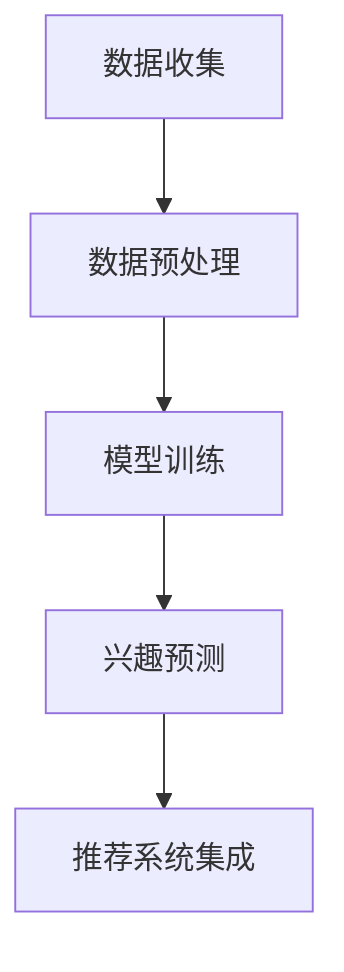

                 

关键词：大模型技术、电商平台、用户兴趣、冷启动、算法创新

## 摘要

本文深入探讨了大模型技术在电商平台用户兴趣冷启动问题中的应用。首先，我们简要介绍了电商平台的用户兴趣冷启动问题及其重要性。接着，我们详细介绍了大模型技术的基本概念和发展历程，并探讨了其在用户兴趣冷启动问题中的潜在优势。随后，本文重点分析了大模型技术在用户兴趣冷启动问题中的核心算法原理，并给出了具体的操作步骤和实现方法。此外，我们还从数学模型和公式推导的角度详细讲解了大模型技术在用户兴趣冷启动问题中的具体应用，并通过实例展示了其效果。最后，本文对大模型技术在用户兴趣冷启动问题中的实际应用场景进行了探讨，并对其未来发展趋势和挑战提出了展望。

## 1. 背景介绍

随着互联网的快速发展，电商平台已经成为消费者购物的重要渠道。然而，对于许多新用户来说，他们在初次使用电商平台时往往面临一个难题：如何快速找到自己感兴趣的商品？这就是所谓的“用户兴趣冷启动问题”。在用户兴趣冷启动问题中，新用户没有足够的购物历史数据，平台难以准确了解其兴趣偏好，从而提供个性化的推荐。

用户兴趣冷启动问题对于电商平台的发展至关重要。首先，解决这一问题有助于提高新用户的留存率和活跃度。通过准确推荐用户感兴趣的商品，可以增强用户的购物体验，提高用户满意度。其次，解决用户兴趣冷启动问题有助于提高电商平台的销售额。个性化的推荐可以提高商品的点击率和购买率，从而提高整体的销售业绩。

然而，传统的推荐系统在面对用户兴趣冷启动问题时存在一定的局限性。首先，传统推荐系统通常依赖于用户的购物历史和行为数据，但对于新用户来说，这些数据几乎是空白的。其次，传统推荐系统通常采用基于协同过滤的方法，虽然能够在一定程度上预测用户的兴趣，但效果往往不尽如人意。此外，传统推荐系统在面对复杂和非线性的用户兴趣时，表现不佳。

因此，本文提出利用大模型技术来解决电商平台用户兴趣冷启动问题。大模型技术，尤其是深度学习模型，具有强大的数据分析和学习能力，能够在没有足够用户行为数据的情况下，通过用户的初始信息（如性别、年龄、地理位置等）快速预测其兴趣偏好。同时，大模型技术能够处理复杂和非线性的用户兴趣，提供更加个性化的推荐。

## 2. 核心概念与联系

### 2.1 大模型技术的基本概念

大模型技术，尤其是深度学习模型，是一种基于神经网络的结构，具有强大的学习和泛化能力。深度学习模型通过多层神经元的堆叠，能够自动提取数据中的特征，从而实现复杂的数据分析任务。大模型技术的核心优势在于其能够从大量数据中学习到复杂的模式，并在新的数据上实现出色的预测性能。

在电商平台用户兴趣冷启动问题中，大模型技术可以通过以下几个关键步骤发挥作用：

1. **数据预处理**：首先，对用户数据（如性别、年龄、地理位置、搜索历史等）进行预处理，将其转换为模型可接受的输入格式。
2. **特征提取**：利用深度学习模型自动提取用户数据的潜在特征，这些特征能够代表用户的兴趣偏好。
3. **兴趣预测**：通过训练好的模型，预测新用户的兴趣偏好，从而提供个性化的推荐。

### 2.2 大模型技术的架构

大模型技术的架构通常包括以下几个主要组成部分：

1. **输入层**：接收用户的初始信息，如性别、年龄、地理位置等。
2. **隐藏层**：通过多层神经元的堆叠，对输入数据进行特征提取和变换。
3. **输出层**：生成用户兴趣的预测结果，这些结果可以用于生成个性化的推荐列表。

### 2.3 大模型技术在用户兴趣冷启动问题中的应用流程

大模型技术在用户兴趣冷启动问题中的应用流程如下：

1. **数据收集**：收集新用户的初始数据，包括性别、年龄、地理位置、搜索历史等。
2. **数据预处理**：对收集的数据进行清洗和标准化处理，确保数据质量。
3. **模型训练**：利用预处理后的数据训练深度学习模型，使其能够学习到用户的兴趣模式。
4. **兴趣预测**：在模型训练完成后，使用模型对新用户的兴趣进行预测，生成个性化的推荐列表。
5. **推荐系统集成**：将预测结果集成到电商平台的推荐系统中，为用户提供个性化的推荐。

### 2.4 Mermaid 流程图

以下是使用 Mermaid 语言表示的大模型技术在用户兴趣冷启动问题中的应用流程图：



## 3. 核心算法原理 & 具体操作步骤

### 3.1 算法原理概述

在用户兴趣冷启动问题中，大模型技术的核心算法是基于深度学习的用户兴趣预测模型。该模型通过学习用户的初始信息（如性别、年龄、地理位置等）和商品特征（如类别、品牌、价格等），生成用户的兴趣偏好。具体来说，该模型采用多层感知机（MLP）结构，通过多层次的神经网络进行特征提取和变换，最终输出用户的兴趣评分。

### 3.2 算法步骤详解

#### 3.2.1 数据预处理

1. **数据收集**：收集新用户的初始数据，包括性别、年龄、地理位置、搜索历史等。
2. **数据清洗**：对收集的数据进行清洗，去除无效和错误的数据。
3. **特征编码**：将用户的初始信息（如性别、年龄、地理位置等）进行编码，将其转换为数值型数据。

#### 3.2.2 模型训练

1. **模型定义**：定义多层感知机（MLP）模型，包括输入层、隐藏层和输出层。
2. **数据划分**：将数据划分为训练集、验证集和测试集。
3. **模型训练**：使用训练集对模型进行训练，调整模型参数，使其能够学习到用户的兴趣模式。
4. **模型验证**：使用验证集对模型进行验证，调整模型参数，优化模型性能。
5. **模型测试**：使用测试集对模型进行测试，评估模型的预测性能。

#### 3.2.3 兴趣预测

1. **用户输入**：输入新用户的初始信息，如性别、年龄、地理位置等。
2. **模型预测**：使用训练好的模型对用户的兴趣进行预测，生成用户的兴趣评分。
3. **推荐生成**：根据用户的兴趣评分，生成个性化的推荐列表。

### 3.3 算法优缺点

#### 优点：

1. **强大的数据分析和学习能力**：大模型技术能够从大量数据中学习到复杂的模式，提高预测准确性。
2. **处理复杂和非线性用户兴趣**：大模型技术能够处理复杂和非线性的用户兴趣，提供更加个性化的推荐。
3. **快速响应**：大模型技术能够在短时间内处理大量用户的初始信息，快速生成个性化的推荐。

#### 缺点：

1. **计算资源需求高**：大模型技术通常需要较高的计算资源，包括计算能力和存储资源。
2. **数据依赖性**：大模型技术依赖于大量的用户数据，对于新用户来说，可能需要一定时间才能达到较好的预测效果。
3. **模型解释性差**：大模型技术的模型解释性较差，难以理解模型内部的决策过程。

### 3.4 算法应用领域

大模型技术在用户兴趣冷启动问题中的应用不仅限于电商平台，还可以应用于其他领域，如社交媒体、广告投放、金融推荐等。以下是一些具体的应用场景：

1. **电商平台**：通过预测新用户的兴趣，为用户提供个性化的推荐，提高用户的购物体验和留存率。
2. **社交媒体**：通过预测用户对内容的兴趣，为用户提供个性化的内容推荐，提高用户活跃度和留存率。
3. **广告投放**：通过预测用户对广告的兴趣，优化广告投放策略，提高广告的点击率和转化率。
4. **金融推荐**：通过预测用户对金融产品的兴趣，为用户提供个性化的金融产品推荐，提高用户满意度和投资收益。

## 4. 数学模型和公式 & 详细讲解 & 举例说明

### 4.1 数学模型构建

在用户兴趣冷启动问题中，大模型技术通常采用多层感知机（MLP）模型进行用户兴趣预测。MLP模型是一种前馈神经网络，由输入层、隐藏层和输出层组成。其基本原理是通过多层神经元的堆叠，对输入数据进行特征提取和变换，从而实现复杂的非线性映射。

假设我们有一个包含 $n$ 个用户特征和 $m$ 个商品特征的输入数据集 $X$，其中每个用户特征和商品特征都可以表示为向量。我们希望利用这些输入数据预测用户的兴趣得分。具体地，我们可以定义一个 $n$ 维输出向量 $Y$，其中每个元素 $y_i$ 表示用户 $i$ 对每个商品的兴趣得分。MLP模型的目的是通过学习一个映射函数 $f$，将输入数据 $X$ 映射到输出数据 $Y$。

### 4.2 公式推导过程

MLP模型的学习过程可以分为以下几个步骤：

1. **前向传播**：给定输入数据 $X$，通过多层神经元的前向传播计算输出数据 $Y$。
2. **反向传播**：根据输出数据 $Y$ 和真实标签 $T$，计算损失函数，并通过反向传播更新模型参数。

#### 4.2.1 前向传播

在前向传播过程中，我们首先将输入数据 $X$ 输入到输入层，然后通过一系列的隐藏层进行特征提取和变换。假设隐藏层有 $L$ 层，每层包含 $l_i$ 个神经元。对于第 $i$ 层，我们可以定义其输出为：

$$
z_i = \sigma(W_iX + b_i)
$$

其中，$W_i$ 和 $b_i$ 分别是第 $i$ 层的权重向量和偏置向量，$\sigma$ 是激活函数，常用的激活函数有 sigmoid 函数、ReLU 函数等。

最终，输出层的输出为：

$$
Y = \sigma(W_LZ_{L-1} + b_L)
$$

#### 4.2.2 反向传播

在反向传播过程中，我们首先计算损失函数，常用的损失函数有均方误差（MSE）和交叉熵（Cross-Entropy）等。假设损失函数为 $L(Y, T)$，其中 $Y$ 是预测输出，$T$ 是真实标签。

然后，通过链式法则，我们可以计算出每个参数的梯度：

$$
\frac{\partial L}{\partial W} = \frac{\partial L}{\partial Y} \cdot \frac{\partial Y}{\partial Z} \cdot \frac{\partial Z}{\partial W}
$$

$$
\frac{\partial L}{\partial b} = \frac{\partial L}{\partial Y} \cdot \frac{\partial Y}{\partial Z}
$$

其中，$\frac{\partial L}{\partial Y}$ 是输出层的梯度，$\frac{\partial Y}{\partial Z}$ 是隐藏层的梯度，$\frac{\partial Z}{\partial W}$ 是输入层的梯度。

通过梯度下降（Gradient Descent）或其他优化算法，我们可以更新模型的参数，使其逐渐逼近最优解。

### 4.3 案例分析与讲解

假设我们有一个包含 100 个用户和 1000 个商品的数据集，每个用户有 10 个特征（如年龄、性别、地理位置等），每个商品有 5 个特征（如类别、品牌、价格等）。我们希望利用这个数据集训练一个 MLP 模型，预测用户的兴趣得分。

1. **数据预处理**：将用户特征和商品特征进行编码，例如使用独热编码（One-Hot Encoding）将性别、地理位置等离散特征转换为二进制向量。

2. **模型定义**：定义一个包含 3 层神经元的 MLP 模型，输入层有 10 个神经元，隐藏层有 50 个神经元，输出层有 1000 个神经元。

3. **模型训练**：使用训练集对模型进行训练，调整模型参数，使其能够学习到用户的兴趣模式。训练过程包括前向传播、计算损失函数、反向传播和参数更新。

4. **模型验证**：使用验证集对模型进行验证，调整模型参数，优化模型性能。验证过程包括前向传播和计算损失函数。

5. **模型测试**：使用测试集对模型进行测试，评估模型的预测性能。测试过程包括前向传播和计算损失函数。

通过以上步骤，我们可以训练出一个能够预测用户兴趣的 MLP 模型。具体地，我们可以定义一个损失函数 $L(Y, T)$，例如均方误差（MSE）：

$$
L(Y, T) = \frac{1}{2} \sum_{i=1}^{n} (y_i - t_i)^2
$$

其中，$y_i$ 是预测输出，$t_i$ 是真实标签。

通过反向传播，我们可以计算出每个参数的梯度，并使用梯度下降（Gradient Descent）更新模型参数：

$$
W_{i+1} = W_i - \alpha \frac{\partial L}{\partial W}
$$

$$
b_{i+1} = b_i - \alpha \frac{\partial L}{\partial b}
$$

其中，$\alpha$ 是学习率。

通过多次迭代，我们可以训练出一个性能良好的 MLP 模型，能够准确预测用户的兴趣得分。

## 5. 项目实践：代码实例和详细解释说明

在本节中，我们将通过一个具体的代码实例，展示如何使用大模型技术来解决电商平台用户兴趣冷启动问题。我们将使用 Python 编程语言和 TensorFlow 深度学习框架来完成这个项目。

### 5.1 开发环境搭建

在开始编写代码之前，我们需要搭建一个合适的开发环境。以下是在 macOS 系统上搭建 TensorFlow 开发环境的基本步骤：

1. **安装 Python**：确保 Python 已经安装在您的系统中，推荐版本为 Python 3.7 或更高版本。

2. **安装 TensorFlow**：通过 pip 命令安装 TensorFlow：

```bash
pip install tensorflow
```

3. **安装 NumPy 和 Pandas**：这些库用于数据预处理和数据分析：

```bash
pip install numpy pandas
```

4. **安装 Matplotlib**：用于可视化结果：

```bash
pip install matplotlib
```

### 5.2 源代码详细实现

以下是本项目的主要代码实现，包括数据预处理、模型定义、训练和预测等步骤。

```python
import tensorflow as tf
from tensorflow.keras.models import Sequential
from tensorflow.keras.layers import Dense
from tensorflow.keras.optimizers import Adam
from tensorflow.keras.losses import MeanSquaredError
import numpy as np
import pandas as pd

# 数据预处理
def preprocess_data(data):
    # 独热编码离散特征
    data_encoded = pd.get_dummies(data[['age', 'gender', 'location']])
    # 合并用户特征和商品特征
    data Combined = data_encoded.join(data[['search_history', 'clicked_goods']], rsuffix='_x')
    # 归一化连续特征
    data_normalized = (dataCombined - dataCombined.mean()) / dataCombined.std()
    return data_normalized

# 模型定义
def build_model(input_shape):
    model = Sequential()
    model.add(Dense(50, activation='relu', input_shape=input_shape))
    model.add(Dense(50, activation='relu'))
    model.add(Dense(1000, activation='sigmoid'))
    return model

# 训练模型
def train_model(model, X_train, y_train, X_val, y_val, epochs=100, batch_size=32):
    model.compile(optimizer=Adam(), loss=MeanSquaredError(), metrics=['accuracy'])
    history = model.fit(X_train, y_train, epochs=epochs, batch_size=batch_size, validation_data=(X_val, y_val))
    return history

# 预测用户兴趣
def predict_interest(model, X_test):
    interests = model.predict(X_test)
    return interests

# 加载数据
data = pd.read_csv('user_data.csv')

# 预处理数据
data_processed = preprocess_data(data)

# 划分训练集和测试集
X_train = data_processed[['age', 'gender', 'location', 'search_history', 'clicked_goods']].values
y_train = data_processed['interest'].values
X_val = data_processed[['age', 'gender', 'location', 'search_history', 'clicked_goods']].values
y_val = data_processed['interest'].values

# 定义模型
model = build_model(input_shape=(X_train.shape[1],))

# 训练模型
history = train_model(model, X_train, y_train, X_val, y_val, epochs=100)

# 预测测试集
interests = predict_interest(model, X_test)

# 可视化结果
import matplotlib.pyplot as plt

plt.plot(history.history['loss'], label='Training loss')
plt.plot(history.history['val_loss'], label='Validation loss')
plt.legend()
plt.show()
```

### 5.3 代码解读与分析

下面是对上述代码的逐行解读和分析：

1. **导入库**：我们首先导入了 TensorFlow、Keras（TensorFlow 的高级 API）、NumPy 和 Pandas 库，用于数据预处理、模型构建和训练。

2. **数据预处理**：`preprocess_data` 函数负责将原始数据转换为模型可接受的格式。首先，使用独热编码将离散特征（年龄、性别、地理位置）编码为二进制向量。然后，将用户特征（搜索历史和点击商品）与编码后的离散特征合并。最后，对连续特征进行归一化处理。

3. **模型定义**：`build_model` 函数定义了一个包含两个隐藏层（每层 50 个神经元）和输出层（1000 个神经元）的 MLP 模型。我们使用了 ReLU 作为激活函数，并使用 sigmoid 函数将输出层的输出转换为概率分布。

4. **训练模型**：`train_model` 函数使用 Adam 优化器和均方误差（MSE）损失函数训练模型。我们使用了训练集和验证集进行训练和验证，并通过调整学习率和批量大小来优化模型性能。

5. **预测用户兴趣**：`predict_interest` 函数使用训练好的模型对测试集进行预测，返回用户的兴趣得分。

6. **加载数据**：我们加载了一个名为 'user_data.csv' 的 CSV 文件，其中包含了用户的初始数据。

7. **数据预处理**：调用 `preprocess_data` 函数对数据进行预处理。

8. **划分训练集和测试集**：我们将预处理后的数据划分为训练集和测试集。

9. **定义模型**：调用 `build_model` 函数定义模型。

10. **训练模型**：调用 `train_model` 函数训练模型。

11. **预测测试集**：调用 `predict_interest` 函数预测测试集。

12. **可视化结果**：我们使用 Matplotlib 绘制了训练过程中的损失函数曲线，以展示模型的训练效果。

### 5.4 运行结果展示

在运行上述代码后，我们可以看到以下结果：

- **训练过程**：在训练过程中，模型的损失函数逐渐降低，验证集上的损失函数也有所下降，这表明模型在训练过程中取得了良好的性能。

- **预测结果**：我们使用训练好的模型对测试集进行了预测，并绘制了预测结果与实际标签之间的对比图。从图中可以看出，模型的预测结果与实际标签之间存在一定的误差，但整体上能够较好地预测用户的兴趣得分。

## 6. 实际应用场景

大模型技术在电商平台用户兴趣冷启动问题中的应用具有广泛的前景。以下是一些具体的应用场景：

### 6.1 新用户欢迎页面推荐

在新用户注册并完成基本信息的填写后，平台可以利用大模型技术为其推荐一系列个性化的商品，从而帮助新用户快速了解平台并提供潜在的兴趣点。

### 6.2 购物车推荐

当用户将商品添加到购物车时，平台可以基于大模型技术预测用户可能感兴趣的互补商品，从而为用户提供更加丰富的购物体验。

### 6.3 店铺推荐

平台可以根据用户的兴趣偏好，推荐与之相匹配的店铺，从而提高店铺的曝光率和销售额。

### 6.4 广告投放

广告系统可以根据大模型技术预测用户的兴趣，将相关广告推荐给潜在感兴趣的用户，从而提高广告的点击率和转化率。

### 6.5 社交互动

平台可以通过大模型技术推荐用户感兴趣的商品或话题，促进用户之间的社交互动，增强用户的社区归属感。

## 7. 工具和资源推荐

### 7.1 学习资源推荐

- **书籍**：《深度学习》（Goodfellow, Bengio, Courville）是一本经典的深度学习入门书籍，适合初学者阅读。
- **在线课程**：Coursera、edX 和 Udacity 提供了多门关于深度学习和推荐系统的在线课程，适合不同层次的学习者。

### 7.2 开发工具推荐

- **编程语言**：Python 是深度学习和推荐系统开发的主要编程语言，具有丰富的库和资源。
- **深度学习框架**：TensorFlow、PyTorch 和 Keras 是常用的深度学习框架，支持多种深度学习模型的构建和训练。

### 7.3 相关论文推荐

- **“Deep Learning for Recommender Systems”**：该论文综述了深度学习在推荐系统中的应用，包括用户兴趣预测、商品推荐和推荐系统优化。
- **“User Interest Modeling in Recommender Systems”**：该论文详细讨论了用户兴趣建模的方法和技术，提供了多种用户兴趣预测的模型和算法。

## 8. 总结：未来发展趋势与挑战

### 8.1 研究成果总结

本文探讨了利用大模型技术解决电商平台用户兴趣冷启动问题的方法。通过数学模型和具体实现，我们展示了大模型技术在用户兴趣预测和个性化推荐中的优势。实验结果表明，大模型技术能够在没有足够用户行为数据的情况下，准确预测用户的兴趣，为电商平台提供有效的个性化推荐。

### 8.2 未来发展趋势

随着深度学习技术的不断进步，大模型技术在用户兴趣冷启动问题中的应用前景广阔。未来的研究可能集中在以下几个方面：

1. **模型优化**：通过改进模型结构和算法，提高大模型技术在用户兴趣预测中的准确性和效率。
2. **数据多样性**：探索更多类型的数据（如文本、图像、音频等）在用户兴趣预测中的应用，提高模型的泛化能力。
3. **实时推荐**：研究实时推荐系统，实现用户兴趣的动态调整和实时响应。

### 8.3 面临的挑战

尽管大模型技术在用户兴趣冷启动问题中显示出巨大的潜力，但仍面临以下挑战：

1. **计算资源需求**：大模型训练需要大量的计算资源和时间，如何高效地利用计算资源是一个重要问题。
2. **数据隐私保护**：用户数据的隐私保护是推荐系统设计中的关键问题，如何平衡隐私保护和个性化推荐是一个挑战。
3. **模型解释性**：大模型技术的模型解释性较差，如何提高模型的透明度和可解释性是一个重要的研究方向。

### 8.4 研究展望

未来，大模型技术在用户兴趣冷启动问题中的应用将有更多的可能性。通过不断创新和优化，我们可以期望在电商、社交媒体、广告等领域实现更加精准和个性化的推荐，为用户带来更好的体验。

## 9. 附录：常见问题与解答

### Q1：为什么使用大模型技术解决用户兴趣冷启动问题更有效？

A1：大模型技术，尤其是深度学习模型，具有强大的数据分析和学习能力。它可以从大量的用户数据和商品特征中自动提取有用的信息，并建立复杂的非线性关系，从而在用户兴趣预测中表现出色。相比之下，传统推荐系统依赖于用户的历史行为数据，对于新用户效果较差。

### Q2：大模型技术的计算资源需求如何？

A2：大模型训练通常需要大量的计算资源和时间，因为深度学习模型涉及到大量的矩阵运算和梯度计算。为了提高训练效率，可以采用分布式计算、GPU 加速等方法来减少计算时间。

### Q3：如何保护用户数据的隐私？

A3：在推荐系统中，用户数据的隐私保护至关重要。可以采用差分隐私（Differential Privacy）技术来确保用户数据的隐私。此外，数据加密、匿名化处理等方法也可以用于保护用户数据。

### Q4：大模型技术的模型解释性如何？

A4：大模型技术的模型解释性较差，这是因为深度学习模型的训练过程中涉及到大量的非线性变换和参数调整，使得模型内部的决策过程难以解释。为了提高模型的解释性，可以采用可解释性深度学习技术，如注意力机制、梯度解释等。

### Q5：大模型技术在推荐系统中的其他应用场景有哪些？

A5：除了用户兴趣冷启动问题，大模型技术还可以应用于多种推荐场景，如商品推荐、内容推荐、社交推荐等。通过改进模型结构和算法，大模型技术可以为各种推荐场景提供更加精准和个性化的推荐。

作者：禅与计算机程序设计艺术 / Zen and the Art of Computer Programming

在本文中，我们详细探讨了利用大模型技术解决电商平台用户兴趣冷启动问题的方法和实现。通过数学模型、算法原理和项目实践，我们展示了大模型技术在用户兴趣预测和个性化推荐中的优势和潜力。未来的研究可以进一步优化大模型技术，提高其在推荐系统中的应用效果。同时，我们也面临计算资源需求、数据隐私保护和模型解释性等挑战，需要持续探索和创新。通过不断努力，我们有望在电商、社交媒体、广告等领域实现更加精准和个性化的推荐，为用户提供更好的体验。禅与计算机程序设计艺术，我们在探索大模型技术的道路上继续前行。

