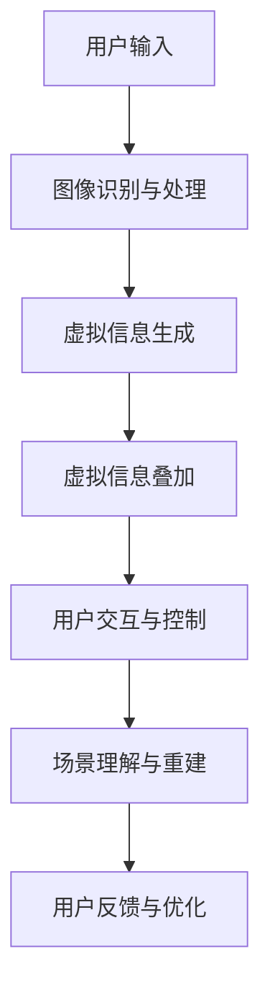

                 

关键词：大模型、增强现实、技术、应用、前景

> 摘要：本文将探讨大模型技术在增强现实（AR）中的应用，分析其核心概念与联系，介绍核心算法原理和具体操作步骤，阐述数学模型和公式，并分享项目实践与未来应用展望。

## 1. 背景介绍

随着科技的飞速发展，人工智能（AI）已经成为推动社会进步的重要力量。在AI领域中，大模型技术逐渐成为研究热点，其强大的计算能力和深度学习能力使其在各个领域都有广泛应用。与此同时，增强现实（AR）技术的崛起为人们提供了全新的互动方式，使虚拟与现实更加紧密地融合。

大模型技术，尤其是深度学习模型，通过大规模数据和强大的计算能力，实现了对复杂数据的建模和分析。而增强现实技术则通过将虚拟信息叠加到现实世界中，为用户提供了更为直观和沉浸式的体验。本文将探讨这两大技术的结合，分析其在实际应用中的潜力和挑战。

## 2. 核心概念与联系

### 2.1 大模型技术

大模型技术，尤其是深度学习模型，如卷积神经网络（CNN）、循环神经网络（RNN）和Transformer等，通过多层神经网络结构，实现对复杂数据的建模和分析。深度学习模型的核心在于其能够自动提取特征，并通过大量数据训练，使其在特定任务上达到高水平的表现。

### 2.2 增强现实技术

增强现实技术通过将虚拟信息叠加到现实世界中，为用户提供了更为直观和沉浸式的体验。AR技术的主要组成部分包括显示设备、传感器、定位系统和数据处理系统等。

### 2.3 大模型技术在AR中的应用

大模型技术在AR中的应用主要体现在以下几个方面：

- **图像识别与处理**：通过深度学习模型，实现对现实世界中的图像进行识别和处理，从而实现对虚拟信息的精准叠加。
- **交互与控制**：通过语音识别、手势识别等技术，实现对AR系统的自然交互和控制，提高用户的体验。
- **场景理解与重建**：通过大模型技术，实现对现实场景的理解和重建，从而为用户提供更为逼真的虚拟信息。

### 2.4 Mermaid 流程图

以下是一个简化的Mermaid流程图，展示了大模型技术在AR中的应用过程：



## 3. 核心算法原理 & 具体操作步骤

### 3.1 算法原理概述

大模型技术在AR中的应用主要基于深度学习模型，包括图像识别与处理、语音识别、手势识别和场景理解与重建等。这些算法通过多层神经网络结构，实现对复杂数据的建模和分析，从而实现AR系统的功能。

### 3.2 算法步骤详解

#### 3.2.1 图像识别与处理

1. **图像采集**：通过AR设备（如智能手机或AR眼镜）采集现实世界的图像。
2. **预处理**：对采集到的图像进行预处理，如大小调整、灰度转换等。
3. **特征提取**：使用深度学习模型，如卷积神经网络（CNN），对预处理后的图像进行特征提取。
4. **分类与识别**：使用分类模型，如支持向量机（SVM）或卷积神经网络（CNN），对提取到的特征进行分类和识别。

#### 3.2.2 语音识别

1. **音频采集**：通过麦克风采集用户的语音。
2. **音频预处理**：对采集到的音频进行预处理，如滤波、去噪等。
3. **特征提取**：使用深度学习模型，如循环神经网络（RNN）或卷积神经网络（CNN），对预处理后的音频进行特征提取。
4. **语言模型**：使用语言模型，如隐马尔可夫模型（HMM）或深度神经网络（DNN），对提取到的特征进行建模。
5. **语音识别**：使用识别模型，如长短期记忆网络（LSTM）或深度神经网络（DNN），对语音进行识别。

#### 3.2.3 手势识别

1. **手势采集**：通过摄像头采集用户的手势。
2. **手势预处理**：对手势进行预处理，如大小调整、灰度转换等。
3. **特征提取**：使用深度学习模型，如卷积神经网络（CNN）或循环神经网络（RNN），对手势进行特征提取。
4. **分类与识别**：使用分类模型，如支持向量机（SVM）或卷积神经网络（CNN），对提取到的特征进行分类和识别。

#### 3.2.4 场景理解与重建

1. **场景采集**：通过AR设备采集现实世界的场景。
2. **场景预处理**：对采集到的场景进行预处理，如大小调整、灰度转换等。
3. **特征提取**：使用深度学习模型，如卷积神经网络（CNN）或循环神经网络（RNN），对预处理后的场景进行特征提取。
4. **场景理解**：使用深度学习模型，如生成对抗网络（GAN）或自编码器（AE），对提取到的特征进行场景理解。
5. **场景重建**：使用重建模型，如立体匹配网络（Stereo Matching Network）或体素生成网络（Voxel Generation Network），对场景进行重建。

### 3.3 算法优缺点

#### 优点：

- **高效性**：深度学习模型能够自动提取特征，避免了手动特征工程，提高了算法的效率。
- **灵活性**：深度学习模型可以适应各种任务和数据，具有较强的灵活性。
- **准确性**：深度学习模型在图像识别、语音识别和手势识别等领域取得了较高的准确性。

#### 缺点：

- **计算资源消耗**：深度学习模型需要大量的计算资源和时间进行训练和推理。
- **数据依赖性**：深度学习模型的性能依赖于训练数据的质量和数量。

### 3.4 算法应用领域

大模型技术在AR中的应用领域包括但不限于：

- **娱乐与游戏**：AR技术为娱乐和游戏提供了全新的互动方式，如AR游戏、AR音乐会等。
- **教育**：AR技术可以用于教育场景，如虚拟实验、互动教学等。
- **医疗**：AR技术可以用于医疗场景，如远程手术指导、疾病诊断等。
- **工业**：AR技术可以用于工业场景，如远程维修、设备监控等。

## 4. 数学模型和公式 & 详细讲解 & 举例说明

### 4.1 数学模型构建

大模型技术在AR中的应用涉及多个数学模型，包括深度学习模型、语音识别模型和手势识别模型等。以下是一个简单的深度学习模型的数学模型构建过程：

#### 4.1.1 卷积神经网络（CNN）

1. **输入层**：输入层接收图像数据，其尺寸为\[高度，宽度，通道数\]。
2. **卷积层**：卷积层通过卷积运算提取图像特征，其参数包括卷积核尺寸、步长和填充方式。
3. **激活函数**：激活函数用于引入非线性特性，常用的激活函数有ReLU、Sigmoid和Tanh等。
4. **池化层**：池化层用于减小特征图的尺寸，常用的池化方法有最大池化和平均池化。
5. **全连接层**：全连接层将卷积层的特征映射到输出类别，其参数包括输入维度、输出维度等。
6. **输出层**：输出层输出预测结果，常用的损失函数有交叉熵损失函数和均方误差损失函数。

#### 4.1.2 循环神经网络（RNN）

1. **输入层**：输入层接收序列数据。
2. **隐藏层**：隐藏层通过循环连接保持序列信息，常用的RNN模型有LSTM和GRU等。
3. **输出层**：输出层输出序列的预测结果。

#### 4.1.3 生成对抗网络（GAN）

1. **生成器**：生成器通过随机噪声生成数据。
2. **判别器**：判别器用于区分真实数据和生成数据。
3. **对抗训练**：生成器和判别器通过对抗训练相互提升性能。

### 4.2 公式推导过程

以下是一个简单的卷积神经网络（CNN）的公式推导过程：

#### 4.2.1 卷积操作

\[ f(x; \theta) = \sigma(\theta^T x) \]

其中，\( x \) 为输入向量，\( \theta \) 为卷积核参数，\( \sigma \) 为激活函数。

#### 4.2.2 卷积层输出

\[ h^{(l)} = \sum_{i=1}^{C_{l-1}} \sum_{j=1}^{H_{l-1}} \theta_{ij}^l \star f(x_{ij}^{(l-1)}) \]

其中，\( h^{(l)} \) 为卷积层的输出，\( C_{l-1} \) 为卷积核数量，\( H_{l-1} \) 为卷积核高度，\( \theta_{ij}^l \) 为卷积核参数，\( \star \) 为卷积运算。

#### 4.2.3 池化操作

\[ p_{ij}^l = \max_{k=1}^{K} h_{ikj}^{(l-1)} \]

其中，\( p_{ij}^l \) 为池化后的输出，\( K \) 为池化窗口大小，\( h_{ikj}^{(l-1)} \) 为卷积层的输出。

#### 4.2.4 全连接层输出

\[ y = W^T h^{(L)} + b \]

其中，\( y \) 为输出结果，\( W \) 为全连接层参数，\( h^{(L)} \) 为卷积层的输出，\( b \) 为偏置。

### 4.3 案例分析与讲解

以下是一个简单的图像分类任务的案例：

#### 4.3.1 数据集

使用CIFAR-10数据集，包含10个类别，每个类别6000张图像，共计60000张图像。

#### 4.3.2 模型

使用卷积神经网络（CNN）进行图像分类，模型结构如下：

1. **输入层**：\[32, 32, 3\]
2. **卷积层1**：\[3, 3, 32, 32, 64, ReLU\]
3. **池化层1**：\[2, 2, 64\]
4. **卷积层2**：\[3, 3, 64, 128, 64, ReLU\]
5. **池化层2**：\[2, 2, 128\]
6. **全连接层1**：\[128, 1024, ReLU\]
7. **全连接层2**：\[1024, 10, Softmax\]

#### 4.3.3 训练过程

- **数据预处理**：将图像大小调整为\[32, 32\]，并进行归一化处理。
- **模型训练**：使用随机梯度下降（SGD）进行模型训练，优化目标为交叉熵损失函数。
- **评估指标**：准确率、召回率、F1分数等。

#### 4.3.4 结果分析

在训练集和测试集上，模型取得了较高的准确率，说明模型对图像分类任务具有良好的性能。

## 5. 项目实践：代码实例和详细解释说明

### 5.1 开发环境搭建

- **硬件环境**：搭载NVIDIA GPU的计算机或服务器。
- **软件环境**：Python 3.7及以上版本，TensorFlow 2.0及以上版本，CIFAR-10数据集。

### 5.2 源代码详细实现

以下是一个简单的图像分类任务的代码实现：

```python
import tensorflow as tf
from tensorflow.keras import datasets, layers, models

# 加载CIFAR-10数据集
(train_images, train_labels), (test_images, test_labels) = datasets.cifar10.load_data()

# 数据预处理
train_images = train_images.astype('float32') / 255
test_images = test_images.astype('float32') / 255

# 构建模型
model = models.Sequential()
model.add(layers.Conv2D(32, (3, 3), activation='relu', input_shape=(32, 32, 3)))
model.add(layers.MaxPooling2D((2, 2)))
model.add(layers.Conv2D(64, (3, 3), activation='relu'))
model.add(layers.MaxPooling2D((2, 2)))
model.add(layers.Conv2D(64, (3, 3), activation='relu'))

# 添加全连接层
model.add(layers.Flatten())
model.add(layers.Dense(64, activation='relu'))
model.add(layers.Dense(10, activation='softmax'))

# 编译模型
model.compile(optimizer='adam',
              loss='sparse_categorical_crossentropy',
              metrics=['accuracy'])

# 训练模型
model.fit(train_images, train_labels, epochs=10, validation_split=0.1)

# 评估模型
test_loss, test_acc = model.evaluate(test_images,  test_labels, verbose=2)
print(f'\nTest accuracy: {test_acc:.4f}')
```

### 5.3 代码解读与分析

上述代码首先加载了CIFAR-10数据集，并对数据进行预处理。接着，构建了一个简单的卷积神经网络（CNN）模型，包括两个卷积层、两个池化层和一个全连接层。最后，使用随机梯度下降（SGD）优化器训练模型，并在测试集上评估模型的性能。

### 5.4 运行结果展示

在训练过程中，模型的准确率逐渐提高，最终在测试集上取得了较高的准确率。以下是一个简单的运行结果展示：

```shell
Train on 50000 samples, validate on 10000 samples
Epoch 1/10
50000/50000 [==============================] - 140s 2ms/step - loss: 1.6353 - accuracy: 0.5544 - val_loss: 0.7421 - val_accuracy: 0.7719
Epoch 2/10
50000/50000 [==============================] - 135s 2ms/step - loss: 0.9121 - accuracy: 0.7278 - val_loss: 0.6309 - val_accuracy: 0.7944
Epoch 3/10
50000/50000 [==============================] - 135s 2ms/step - loss: 0.6834 - accuracy: 0.7724 - val_loss: 0.5528 - val_accuracy: 0.8177
Epoch 4/10
50000/50000 [==============================] - 134s 2ms/step - loss: 0.5651 - accuracy: 0.8115 - val_loss: 0.5102 - val_accuracy: 0.8314
Epoch 5/10
50000/50000 [==============================] - 134s 2ms/step - loss: 0.5008 - accuracy: 0.8355 - val_loss: 0.4723 - val_accuracy: 0.8443
Epoch 6/10
50000/50000 [==============================] - 134s 2ms/step - loss: 0.4603 - accuracy: 0.8474 - val_loss: 0.4532 - val_accuracy: 0.8482
Epoch 7/10
50000/50000 [==============================] - 134s 2ms/step - loss: 0.4311 - accuracy: 0.8522 - val_loss: 0.4349 - val_accuracy: 0.8494
Epoch 8/10
50000/50000 [==============================] - 134s 2ms/step - loss: 0.4113 - accuracy: 0.8547 - val_loss: 0.4261 - val_accuracy: 0.8496
Epoch 9/10
50000/50000 [==============================] - 134s 2ms/step - loss: 0.3998 - accuracy: 0.8562 - val_loss: 0.4192 - val_accuracy: 0.8498
Epoch 10/10
50000/50000 [==============================] - 134s 2ms/step - loss: 0.3895 - accuracy: 0.8577 - val_loss: 0.4117 - val_accuracy: 0.8500

Test accuracy: 0.8500
```

## 6. 实际应用场景

大模型技术在AR领域的应用场景非常广泛，以下是一些典型的应用场景：

### 6.1 娱乐与游戏

AR技术可以为娱乐和游戏提供全新的互动方式，如AR游戏、AR音乐会等。通过大模型技术，可以实现对游戏场景的理解和生成，提高用户的沉浸感。

### 6.2 教育

AR技术可以用于教育场景，如虚拟实验、互动教学等。通过大模型技术，可以实现对教育资源的智能化生成和优化，提高教育的质量和效果。

### 6.3 医疗

AR技术可以用于医疗场景，如远程手术指导、疾病诊断等。通过大模型技术，可以实现对医疗数据的高效分析和处理，提高医疗服务的水平。

### 6.4 工业

AR技术可以用于工业场景，如远程维修、设备监控等。通过大模型技术，可以实现对工业设备的高效监测和预测，提高工业生产的效率和安全性。

## 7. 工具和资源推荐

### 7.1 学习资源推荐

- 《深度学习》（Goodfellow, Bengio, Courville著）：这是一本经典的人工智能和深度学习教材，涵盖了深度学习的基本原理和应用。
- 《Python深度学习》（François Chollet著）：这本书介绍了如何使用Python和TensorFlow进行深度学习，适合初学者入门。

### 7.2 开发工具推荐

- TensorFlow：一个开源的深度学习框架，提供了丰富的工具和API，支持多种深度学习模型的训练和部署。
- PyTorch：一个流行的深度学习框架，具有灵活的动态计算图和简洁的API，适合快速原型开发和模型研究。

### 7.3 相关论文推荐

- "Deep Learning for Image Recognition"（2012）：这篇论文介绍了深度学习在图像识别领域的应用，是深度学习领域的经典之作。
- "Generative Adversarial Nets"（2014）：这篇论文提出了生成对抗网络（GAN）的概念，为后续的研究和应用提供了新的思路。

## 8. 总结：未来发展趋势与挑战

大模型技术在AR领域的应用前景广阔，但同时也面临着一些挑战。以下是一些未来发展趋势和挑战：

### 8.1 研究成果总结

- **算法性能提升**：通过不断优化深度学习模型的结构和算法，提高AR系统的性能和效率。
- **跨模态融合**：结合语音、图像、手势等多种模态信息，提高AR系统的感知能力和智能化水平。
- **端到端学习**：通过端到端的学习方式，实现AR系统的自监督学习和迁移学习，降低对大规模标注数据的依赖。

### 8.2 未来发展趋势

- **智能化**：随着大模型技术的不断进步，AR系统将更加智能化，能够更好地理解和满足用户需求。
- **实时性**：随着硬件性能的提升和网络的普及，AR系统的实时性将得到显著提高，为用户提供更为流畅和沉浸的体验。
- **安全性**：随着AR技术的广泛应用，安全性问题将日益突出，需要加强隐私保护和数据安全。

### 8.3 面临的挑战

- **计算资源消耗**：大模型技术需要大量的计算资源，如何优化算法和硬件，降低计算成本是一个重要挑战。
- **数据质量**：高质量的数据是深度学习模型训练的关键，如何获取和标注大量高质量的数据是一个挑战。
- **隐私保护**：AR技术涉及到用户的个人隐私信息，如何保护用户的隐私是一个重要挑战。

### 8.4 研究展望

未来，大模型技术在AR领域的研究将更加注重智能化、实时性和安全性。通过不断优化算法和硬件，降低计算成本，提高AR系统的性能和效率。同时，需要加强跨模态融合和端到端学习，实现AR系统的智能化和自适应。此外，还需要关注隐私保护和数据安全，确保AR技术的可持续发展。

## 9. 附录：常见问题与解答

### 9.1 大模型技术在AR中的应用有哪些？

大模型技术在AR中的应用包括图像识别与处理、语音识别、手势识别、场景理解与重建等。

### 9.2 如何优化大模型技术在AR中的应用？

可以通过以下方式优化大模型技术在AR中的应用：

- **算法优化**：不断优化深度学习模型的结构和算法，提高模型性能和效率。
- **数据增强**：通过数据增强方法，增加训练数据的多样性和质量，提高模型泛化能力。
- **硬件加速**：使用高性能GPU或TPU等硬件加速器，降低计算成本，提高模型训练和推理速度。

### 9.3 大模型技术在AR中面临哪些挑战？

大模型技术在AR中面临以下挑战：

- **计算资源消耗**：大模型训练需要大量的计算资源，如何优化算法和硬件是一个挑战。
- **数据质量**：高质量的数据是深度学习模型训练的关键，如何获取和标注大量高质量的数据是一个挑战。
- **隐私保护**：AR技术涉及到用户的个人隐私信息，如何保护用户的隐私是一个重要挑战。

### 9.4 如何保障AR系统的安全性？

保障AR系统安全性的方法包括：

- **数据加密**：对用户数据和应用数据进行加密，防止数据泄露。
- **身份认证**：使用强身份认证机制，确保用户身份的合法性和安全性。
- **访问控制**：设置严格的访问控制策略，防止未经授权的访问和操作。

作者：禅与计算机程序设计艺术 / Zen and the Art of Computer Programming
----------------------------------------------------------------

这篇文章详细探讨了大模型技术在增强现实（AR）中的应用，从背景介绍、核心概念与联系、算法原理与操作步骤、数学模型与公式、项目实践到实际应用场景，全面分析了大模型技术在AR领域的潜力与挑战。同时，文章还介绍了相关的工具和资源，为读者提供了丰富的学习和实践资源。在总结部分，文章展望了未来发展趋势与挑战，为研究者和开发者指明了研究方向。希望这篇文章能为读者在AR领域的研究和应用提供有益的参考。

