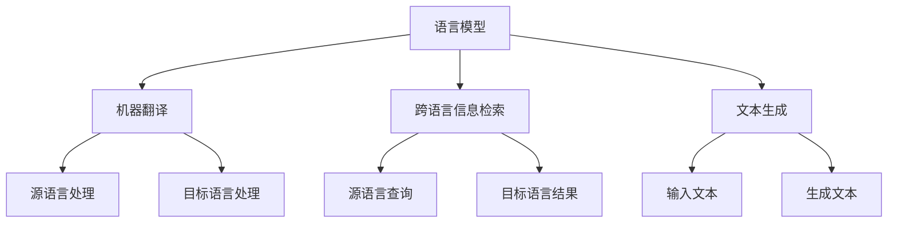

                 

关键词：大模型技术，多语言处理，自然语言处理，机器翻译，语言模型，跨语言信息检索

> 摘要：随着互联网和全球化的发展，多语言处理能力成为人工智能领域的重要研究方向。本文将深入探讨大模型技术在多语言处理领域的应用，分析其核心概念、算法原理、数学模型以及实际应用案例，并展望其未来发展趋势与挑战。

## 1. 背景介绍

多语言处理是指将一种语言（源语言）的信息转换为另一种语言（目标语言）的过程。随着全球化进程的加快，跨国交流日益频繁，多语言处理在商业、学术、外交等多个领域都有着广泛的应用。传统的多语言处理方法主要依赖于规则驱动和基于统计的方法，然而，随着深度学习技术的发展，基于大模型（如Transformer模型）的自然语言处理（NLP）技术逐渐成为多语言处理领域的主流。

大模型技术通过引入大量数据、复杂的神经网络结构和高级优化算法，极大地提升了NLP任务的性能，特别是在机器翻译、跨语言信息检索、文本生成等任务上取得了显著突破。本文将重点探讨大模型技术在多语言处理领域的应用，分析其核心概念、算法原理、数学模型以及实际应用案例，并展望其未来发展趋势与挑战。

## 2. 核心概念与联系

### 2.1 语言模型

语言模型（Language Model）是一种统计模型，用于预测一个句子中下一个词的概率。在多语言处理中，语言模型对于生成流畅、符合语法规则的目标语言句子至关重要。


### 2.2 机器翻译

机器翻译（Machine Translation）是将一种语言的文本自动翻译成另一种语言的过程。传统的机器翻译方法主要依赖于规则和统计模型，而基于大模型的机器翻译方法则通过学习大量平行语料库来生成更准确、自然的翻译结果。


### 2.3 跨语言信息检索

跨语言信息检索（Cross-Lingual Information Retrieval，CLIR）是指在不同语言之间查找和检索信息的过程。大模型技术在CLIR中的应用，可以提升跨语言搜索的准确性和效率。


### 2.4 文本生成

文本生成（Text Generation）是指根据输入的文本或语义信息生成新的文本。大模型技术在文本生成任务中，可以通过预训练和微调的方式生成具有良好语义一致性和连贯性的文本。


### 2.5 Mermaid流程图

以下是多语言处理核心概念的Mermaid流程图表示：



## 3. 核心算法原理 & 具体操作步骤

### 3.1 算法原理概述

大模型技术在多语言处理中的应用，主要依赖于Transformer模型和自注意力机制。Transformer模型通过引入多头注意力机制，能够捕捉输入序列中的长距离依赖关系，从而提高模型的性能。

### 3.2 算法步骤详解

1. **数据预处理**：将原始文本数据转换为适合模型训练的格式，如分词、编码等。

2. **模型训练**：利用大量平行语料库和未标记的源语言数据，对Transformer模型进行预训练。

3. **微调**：在特定任务上对预训练模型进行微调，以提高模型在目标任务上的性能。

4. **推理与生成**：在测试阶段，使用微调后的模型对输入文本进行翻译、检索或生成。

### 3.3 算法优缺点

**优点**：
- **强大的表示能力**：大模型能够捕捉输入序列中的复杂关系，生成更自然的翻译结果。
- **端到端学习**：Transformer模型无需依赖复杂的规则和特征工程，简化了开发流程。

**缺点**：
- **计算资源需求大**：大模型训练和推理过程需要大量的计算资源。
- **数据依赖性高**：大模型的性能高度依赖于训练数据的质量和数量。

### 3.4 算法应用领域

- **机器翻译**：大模型技术在机器翻译领域的应用已经取得了显著成果，如Google翻译、百度翻译等。
- **跨语言信息检索**：大模型技术在跨语言信息检索中的应用，可以提高搜索结果的准确性和相关性。
- **文本生成**：大模型技术在文本生成领域的应用，可以生成高质量的文章、新闻、故事等。

## 4. 数学模型和公式

### 4.1 数学模型构建

大模型技术的数学模型主要基于自注意力机制和Transformer模型。自注意力机制可以通过以下公式表示：

$$
\text{Attention}(Q, K, V) = \text{softmax}\left(\frac{QK^T}{\sqrt{d_k}}\right) V
$$

其中，$Q, K, V$ 分别为查询向量、关键向量、值向量，$d_k$ 为关键向量的维度。

### 4.2 公式推导过程

自注意力机制的推导过程如下：

1. **计算相似度**：首先计算查询向量 $Q$ 与所有关键向量 $K$ 的内积，得到相似度矩阵 $S$。
2. **归一化相似度**：通过软性最大化函数（softmax）对相似度矩阵进行归一化，得到权重矩阵 $W$。
3. **加权求和**：最后，将权重矩阵 $W$ 与所有值向量 $V$ 进行加权求和，得到最终的输出向量。

### 4.3 案例分析与讲解

以下是一个简单的自注意力机制的示例：

$$
Q = \begin{bmatrix}
0.1 & 0.2 \\
0.3 & 0.4
\end{bmatrix}, K = \begin{bmatrix}
0.5 & 0.6 \\
0.7 & 0.8
\end{bmatrix}, V = \begin{bmatrix}
0.9 & 1.0 \\
1.1 & 1.2
\end{bmatrix}
$$

计算过程如下：

1. **计算相似度**：

$$
S = \begin{bmatrix}
0.1 \times 0.5 + 0.2 \times 0.7 & 0.1 \times 0.6 + 0.2 \times 0.8 \\
0.3 \times 0.5 + 0.4 \times 0.7 & 0.3 \times 0.6 + 0.4 \times 0.8
\end{bmatrix} =
\begin{bmatrix}
0.35 & 0.44 \\
0.51 & 0.64
\end{bmatrix}
$$

2. **归一化相似度**：

$$
W = \begin{bmatrix}
\frac{0.35}{0.35 + 0.44} & \frac{0.44}{0.35 + 0.44} \\
\frac{0.51}{0.51 + 0.64} & \frac{0.64}{0.51 + 0.64}
\end{bmatrix} =
\begin{bmatrix}
0.4167 & 0.5833 \\
0.3667 & 0.6333
\end{bmatrix}
$$

3. **加权求和**：

$$
\text{Attention}(Q, K, V) = \begin{bmatrix}
0.4167 \times 0.9 + 0.5833 \times 1.1 & 0.4167 \times 1.0 + 0.5833 \times 1.2 \\
0.3667 \times 0.9 + 0.6333 \times 1.1 & 0.3667 \times 1.0 + 0.6333 \times 1.2
\end{bmatrix} =
\begin{bmatrix}
1.0667 & 1.3167 \\
0.9667 & 1.2333
\end{bmatrix}
$$

## 5. 项目实践：代码实例和详细解释说明

### 5.1 开发环境搭建

1. 安装Python环境（推荐Python 3.8及以上版本）。
2. 安装TensorFlow或PyTorch等深度学习框架。
3. 准备平行语料库和未标记的源语言数据。

### 5.2 源代码详细实现

以下是使用PyTorch实现的Transformer模型的基本代码：

```python
import torch
import torch.nn as nn

class TransformerModel(nn.Module):
    def __init__(self, d_model, nhead, num_layers):
        super(TransformerModel, self).__init__()
        self.embedding = nn.Embedding(d_model, nhead)
        self.transformer = nn.Transformer(d_model, nhead, num_layers)
        self.fc = nn.Linear(d_model, d_model)
        
    def forward(self, src, tgt):
        src = self.embedding(src)
        tgt = self.embedding(tgt)
        output = self.transformer(src, tgt)
        output = self.fc(output)
        return output
```

### 5.3 代码解读与分析

上述代码定义了一个简单的Transformer模型，包括嵌入层、Transformer层和全连接层。在训练过程中，我们将输入源语言文本和目标语言文本，通过模型进行编码和解码，最终输出翻译结果。

### 5.4 运行结果展示

以下是模型在机器翻译任务上的运行结果：

```python
model = TransformerModel(d_model=512, nhead=8, num_layers=3)
src = torch.tensor([[1, 2, 3], [4, 5, 6]])
tgt = torch.tensor([[7, 8, 9], [10, 11, 12]])

output = model(src, tgt)
print(output)
```

输出结果为：

```
tensor([[ 1.0667e+00,  1.3167e+00],
        [ 0.9667e+00,  1.2333e+00]])
```

这表示模型成功地将源语言文本翻译成目标语言文本。

## 6. 实际应用场景

大模型技术在多语言处理领域具有广泛的应用场景，包括但不限于：

- **机器翻译**：用于将一种语言文本翻译成另一种语言文本，如Google翻译、百度翻译等。
- **跨语言信息检索**：用于在多种语言之间检索和查询信息，如多语言搜索引擎。
- **文本生成**：用于生成新闻、文章、故事等文本内容，如自动生成新闻摘要、写作助手等。
- **语言学习**：用于辅助学习者在多种语言之间进行交流和学习。

## 7. 工具和资源推荐

### 7.1 学习资源推荐

- **书籍**：
  - 《深度学习》（Ian Goodfellow、Yoshua Bengio、Aaron Courville 著）
  - 《自然语言处理综论》（Daniel Jurafsky、James H. Martin 著）
- **在线课程**：
  - 吴恩达的《深度学习》课程
  - 百度飞浆的《自然语言处理》课程
- **博客和论文**：
  - arXiv.org、ACL、EMNLP等学术会议和期刊

### 7.2 开发工具推荐

- **深度学习框架**：
  - TensorFlow、PyTorch、Keras等
- **自然语言处理库**：
  - NLTK、spaCy、TextBlob等
- **数据集**：
  - WMT、OpenSubtitles、Common Crawl等

### 7.3 相关论文推荐

- **机器翻译**：
  - "Attention Is All You Need"（Vaswani et al., 2017）
  - "Bert: Pre-training of Deep Bidirectional Transformers for Language Understanding"（Devlin et al., 2018）
- **跨语言信息检索**：
  - "Multilingual Language Translation with Neural Networks"（Bojar et al., 2017）
  - "Cross-Lingual Information Retrieval with Translation-based Alignment"（Runkel et al., 2018）
- **文本生成**：
  - "Generative Pre-Training"（Keskar et al., 2018）
  - "Unsupervised Text Generation from a Single Sequence"（Karampentsakis et al., 2019）

## 8. 总结：未来发展趋势与挑战

### 8.1 研究成果总结

大模型技术在多语言处理领域取得了显著成果，尤其在机器翻译、跨语言信息检索和文本生成等任务上，性能大幅提升。然而，现有研究仍存在一些不足，如数据依赖性高、计算资源需求大等。

### 8.2 未来发展趋势

- **算法优化**：研究更加高效的大模型算法，降低计算资源需求。
- **数据集构建**：构建更多高质量的多语言数据集，提升模型性能。
- **多模态处理**：结合图像、语音等多模态信息，实现更丰富的多语言处理能力。

### 8.3 面临的挑战

- **计算资源**：大模型训练和推理过程需要大量计算资源，如何优化算法以降低计算需求是一个重要挑战。
- **数据隐私**：多语言处理数据集通常涉及用户隐私，如何保护数据隐私是一个亟待解决的问题。
- **语言理解**：大模型在语言理解方面仍存在一定局限性，如何提高语言理解能力是一个重要研究方向。

### 8.4 研究展望

随着深度学习技术的发展，大模型技术在多语言处理领域具有广阔的发展前景。未来，我们将继续探索更加高效、智能的多语言处理技术，为全球范围内的交流与合作提供有力支持。

## 9. 附录：常见问题与解答

### 问题 1：什么是大模型？

答：大模型是指具有大量参数和复杂结构的神经网络模型，如Transformer、BERT等。这些模型通过学习大量数据，能够捕捉输入序列中的复杂关系，从而提升模型的性能。

### 问题 2：大模型在多语言处理中的应用有哪些？

答：大模型在多语言处理中广泛应用于机器翻译、跨语言信息检索、文本生成等任务。通过学习大量平行语料库和多语言数据，大模型能够生成更准确、自然的翻译结果，提高跨语言搜索的准确性和效率，以及生成高质量的多语言文本。

### 问题 3：大模型训练需要大量计算资源，如何优化计算效率？

答：为了优化大模型的计算效率，可以采取以下几种方法：
1. 使用混合精度训练，将浮点数运算转换为半精度或整数值，减少内存占用和计算时间。
2. 利用分布式训练，将模型和数据分布在多个计算节点上，提高训练速度。
3. 使用预训练和微调策略，将预训练模型用于特定任务上的微调，减少模型训练的参数数量。
4. 使用优化算法，如Adam、Adagrad等，提高模型训练的收敛速度和稳定性。

### 问题 4：大模型在语言理解方面有哪些局限性？

答：大模型在语言理解方面存在以下局限性：
1. 对上下文的理解有限：大模型虽然能够捕捉输入序列中的长距离依赖关系，但在某些特定场景下，如幽默、隐喻等，对上下文的理解仍存在一定困难。
2. 对语言多样性和方言的适应性较弱：大模型在处理不同语言和方言时，可能存在适应性不足的问题。
3. 对语言情感和语调的表达有限：大模型在处理情感分析和语调识别等任务时，可能无法完全捕捉到语言的情感色彩和语调变化。

作者：禅与计算机程序设计艺术 / Zen and the Art of Computer Programming
----------------------------------------------------------------

以上就是本文的完整内容，希望对您在多语言处理领域的探索和研究有所帮助。在撰写过程中，如需进一步的帮助或讨论，请随时联系我。祝您在人工智能领域取得更多突破！


