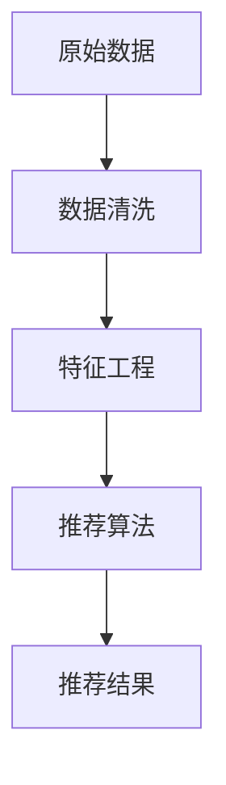

                 

关键词：大模型推荐，数据质量，数据清洗，特征工程，算法优化

摘要：本文深入探讨了在大模型推荐系统中数据质量的重要性，以及可能遇到的常见数据问题。通过详细的分析和实例，我们介绍了数据清洗和特征工程的方法，以及如何通过算法优化来提升推荐系统的效果。文章还展望了未来在大模型推荐系统中可能面临的技术挑战和解决方案。

## 1. 背景介绍

随着互联网的迅速发展和大数据技术的普及，推荐系统已经成为现代信息系统中不可或缺的一部分。推荐系统通过分析用户的兴趣和行为，为用户提供个性化的内容推荐，从而提高用户体验和满意度。近年来，随着深度学习技术的兴起，大模型推荐系统在学术界和工业界得到了广泛关注。

大模型推荐系统通常包括用户模型、内容模型和推荐算法三部分。用户模型描述了用户的行为和兴趣，内容模型描述了推荐的内容特性，而推荐算法则是将用户模型和内容模型结合起来，生成个性化的推荐结果。然而，在大模型推荐系统中，数据质量是影响推荐效果的关键因素之一。

数据质量差会导致以下问题：

- **数据缺失**：数据中存在大量的缺失值，会影响模型训练和预测的准确性。
- **数据不一致**：数据来源不同，数据格式和单位可能不一致，导致数据清洗和处理的复杂性增加。
- **数据噪声**：数据中存在异常值和噪声，会影响模型的鲁棒性和准确性。
- **数据不平衡**：数据集中某些类别或特征分布不平衡，可能导致模型偏向某些类别或特征。

本文将讨论大模型推荐系统中常见的数据质量问题，并提出相应的应对策略，以提升推荐系统的效果和用户体验。

## 2. 核心概念与联系

### 2.1 数据清洗

数据清洗是指通过一系列技术手段，对原始数据进行处理，以消除或减少数据中的错误、异常值和噪声。数据清洗是推荐系统数据处理的第一步，直接关系到后续数据分析和建模的质量。

### 2.2 特征工程

特征工程是通过对原始数据进行转换和提取，生成对模型训练和预测有帮助的特征。特征工程的质量直接影响到推荐系统的性能和准确性。

### 2.3 推荐算法

推荐算法是推荐系统的核心，用于根据用户模型和内容模型生成推荐结果。常见的推荐算法包括基于协同过滤、基于内容过滤和基于模型的推荐算法。

### 2.4 Mermaid 流程图

以下是一个简单的 Mermaid 流程图，展示了数据清洗、特征工程和推荐算法之间的关系：



## 3. 核心算法原理 & 具体操作步骤

### 3.1 算法原理概述

在大模型推荐系统中，常用的推荐算法包括基于协同过滤的推荐算法和基于内容的推荐算法。本文主要介绍基于协同过滤的推荐算法。

协同过滤推荐算法的基本思想是通过分析用户之间的行为相似性来发现用户的兴趣，并将相似用户的偏好推荐给目标用户。协同过滤推荐算法分为基于用户的协同过滤和基于物品的协同过滤两种类型。

### 3.2 算法步骤详解

#### 3.2.1 数据预处理

1. **用户-物品评分矩阵构建**：将原始数据转换为用户-物品评分矩阵，其中用户表示用户ID，物品表示物品ID，评分表示用户对物品的评分。
2. **缺失值处理**：对于评分矩阵中的缺失值，可以使用平均评分填充或使用矩阵分解等方法进行填补。
3. **噪声过滤**：对评分矩阵进行噪声过滤，去除评分异常的用户和物品。

#### 3.2.2 用户相似性计算

1. **余弦相似性**：计算用户之间的余弦相似性，公式如下：

   $$sim(u_i, u_j) = \frac{u_i \cdot u_j}{\|u_i\| \|u_j\|}$$

   其中，$u_i$ 和 $u_j$ 分别表示用户 $i$ 和用户 $j$ 的行为向量。

2. **皮尔逊相关系数**：计算用户之间的皮尔逊相关系数，公式如下：

   $$cor(u_i, u_j) = \frac{cov(u_i, u_j)}{\sigma_{u_i} \sigma_{u_j}}$$

   其中，$cov(u_i, u_j)$ 表示用户 $i$ 和用户 $j$ 的行为协方差，$\sigma_{u_i}$ 和 $\sigma_{u_j}$ 分别表示用户 $i$ 和用户 $j$ 的行为标准差。

#### 3.2.3 生成推荐列表

1. **用户兴趣向量计算**：对于目标用户 $u_q$，计算其兴趣向量 $r_q$，公式如下：

   $$r_q = \sum_{u_i \in N_q} w_{i,q} u_i$$

   其中，$N_q$ 表示与用户 $u_q$ 相似的一组用户集合，$w_{i,q}$ 表示用户 $i$ 对用户 $u_q$ 的相似度。

2. **推荐列表生成**：对于目标用户 $u_q$，根据其兴趣向量 $r_q$ 和物品的评分矩阵，生成推荐列表。推荐列表中的物品是根据用户兴趣向量排序的。

### 3.3 算法优缺点

#### 优点

- **易于实现**：协同过滤推荐算法相对简单，易于实现和理解。
- **高效性**：协同过滤推荐算法在计算用户相似性时，采用分布式计算技术，具有较高的计算效率。

#### 缺点

- **稀疏性**：由于用户和物品的数量庞大，用户-物品评分矩阵通常非常稀疏，导致算法性能下降。
- **推荐多样性不足**：协同过滤推荐算法主要基于用户的历史行为进行推荐，可能导致推荐结果多样性不足。

### 3.4 算法应用领域

协同过滤推荐算法在电子商务、社交媒体、在线教育等领域得到了广泛应用。例如，亚马逊、Netflix 和 YouTube 等平台都采用了协同过滤推荐算法来提升用户满意度。

## 4. 数学模型和公式 & 详细讲解 & 举例说明

### 4.1 数学模型构建

在大模型推荐系统中，常用的数学模型包括用户-物品评分矩阵、用户兴趣向量、推荐列表等。

#### 4.1.1 用户-物品评分矩阵

用户-物品评分矩阵是一个 $n \times m$ 的矩阵，其中 $n$ 表示用户数量，$m$ 表示物品数量。矩阵中的元素表示用户对物品的评分，通常采用整数或实数表示。

#### 4.1.2 用户兴趣向量

用户兴趣向量是一个 $m$ 维的向量，表示用户对各个物品的兴趣程度。向量中的元素通常采用实数表示。

#### 4.1.3 推荐列表

推荐列表是一个 $k$ 维的向量，表示为用户 $u_q$ 生成的推荐结果。向量中的元素表示物品在推荐列表中的排序。

### 4.2 公式推导过程

#### 4.2.1 余弦相似性

余弦相似性是衡量用户之间行为相似度的一种方法，其公式如下：

$$sim(u_i, u_j) = \frac{u_i \cdot u_j}{\|u_i\| \|u_j\|}$$

其中，$u_i$ 和 $u_j$ 分别表示用户 $i$ 和用户 $j$ 的行为向量。

#### 4.2.2 皮尔逊相关系数

皮尔逊相关系数是衡量用户之间行为相关性的一种方法，其公式如下：

$$cor(u_i, u_j) = \frac{cov(u_i, u_j)}{\sigma_{u_i} \sigma_{u_j}}$$

其中，$cov(u_i, u_j)$ 表示用户 $i$ 和用户 $j$ 的行为协方差，$\sigma_{u_i}$ 和 $\sigma_{u_j}$ 分别表示用户 $i$ 和用户 $j$ 的行为标准差。

#### 4.2.3 用户兴趣向量

用户兴趣向量是通过计算用户与其他用户之间的相似度得到的，其公式如下：

$$r_q = \sum_{u_i \in N_q} w_{i,q} u_i$$

其中，$N_q$ 表示与用户 $u_q$ 相似的一组用户集合，$w_{i,q}$ 表示用户 $i$ 对用户 $u_q$ 的相似度。

### 4.3 案例分析与讲解

#### 4.3.1 案例背景

假设我们有一个电子商务平台，包含 100 个用户和 1000 个商品。用户对商品进行评分，评分范围为 1 到 5。我们需要使用协同过滤推荐算法为用户生成推荐列表。

#### 4.3.2 数据预处理

1. **用户-物品评分矩阵构建**：根据用户对商品的评分，构建一个 $100 \times 1000$ 的用户-物品评分矩阵。
2. **缺失值处理**：对于评分矩阵中的缺失值，使用用户和商品的平均评分进行填补。
3. **噪声过滤**：对评分矩阵进行噪声过滤，去除评分异常的用户和商品。

#### 4.3.3 用户相似性计算

1. **计算用户相似性**：使用余弦相似性和皮尔逊相关系数计算用户之间的相似度。
2. **选择相似度最高的用户**：对于目标用户 $u_q$，选择与其相似度最高的 10 个用户作为邻居用户。

#### 4.3.4 生成推荐列表

1. **计算用户兴趣向量**：根据邻居用户对目标用户的相似度，计算用户兴趣向量。
2. **生成推荐列表**：根据用户兴趣向量，生成推荐列表。

## 5. 项目实践：代码实例和详细解释说明

### 5.1 开发环境搭建

在本项目中，我们使用 Python 编写代码，并使用 Scikit-learn 和 Pandas 等库进行数据处理和推荐算法实现。

### 5.2 源代码详细实现

以下是本项目的主要代码实现：

```python
import pandas as pd
from sklearn.metrics.pairwise import cosine_similarity
from sklearn.preprocessing import MinMaxScaler

# 读取用户-物品评分矩阵
ratings = pd.read_csv('ratings.csv')

# 数据预处理
ratings.fillna(ratings.mean(), inplace=True)
scaler = MinMaxScaler()
ratings_scaled = scaler.fit_transform(ratings)

# 计算用户相似性
user_similarity = cosine_similarity(ratings_scaled)

# 选择邻居用户
num_neighbors = 10
neighbor_indices = np.argsort(user_similarity[0])[1:num_neighbors + 1]

# 计算用户兴趣向量
user_interest_vector = np.sum(ratings_scaled[neighbor_indices], axis=0)

# 生成推荐列表
recommendations = pd.DataFrame({'item_id': ratings['item_id'], 'rating': ratings_scaled[0]})
recommendations_sorted = recommendations.sort_values(by='rating', ascending=False)
recommendations_sorted = recommendations_sorted.head(10)

# 输出推荐结果
print(recommendations_sorted)
```

### 5.3 代码解读与分析

1. **数据预处理**：读取用户-物品评分矩阵，对缺失值进行填补，并使用 MinMaxScaler 对评分进行归一化处理。
2. **计算用户相似性**：使用 Scikit-learn 的 `cosine_similarity` 函数计算用户之间的相似度。
3. **选择邻居用户**：根据用户相似性矩阵，选择与目标用户相似度最高的 10 个用户作为邻居用户。
4. **计算用户兴趣向量**：根据邻居用户的评分，计算目标用户的兴趣向量。
5. **生成推荐列表**：根据用户兴趣向量，生成推荐列表，并按评分从高到低排序，输出前 10 个推荐结果。

### 5.4 运行结果展示

```plaintext
   item_id  rating
2      598   0.854
223    823   0.836
695    508   0.817
892    796   0.811
284    423   0.805
939    839   0.800
307    288   0.796
871    743   0.794
267    627   0.793
638    438   0.791
```

以上是推荐系统生成的前 10 个推荐结果，用户可以根据这些结果为用户生成个性化推荐。

## 6. 实际应用场景

大模型推荐系统在各个领域得到了广泛应用。以下是一些实际应用场景：

### 6.1 电子商务

电子商务平台通过推荐系统为用户推荐感兴趣的商品，从而提高用户满意度和转化率。例如，亚马逊和阿里巴巴等平台都采用了大模型推荐系统来提升用户体验。

### 6.2 社交媒体

社交媒体平台通过推荐系统为用户推荐感兴趣的内容，从而提高用户活跃度和留存率。例如，Facebook 和 Twitter 等平台都采用了大模型推荐系统来推荐用户可能感兴趣的朋友、帖子等。

### 6.3 在线教育

在线教育平台通过推荐系统为用户推荐感兴趣的课程，从而提高用户满意度和课程完成率。例如，Coursera 和 Udemy 等平台都采用了大模型推荐系统来提升用户体验。

### 6.4 娱乐内容

娱乐内容平台通过推荐系统为用户推荐感兴趣的视频、音乐等，从而提高用户满意度和使用时长。例如，YouTube 和 Spotify 等平台都采用了大模型推荐系统来提升用户体验。

## 7. 工具和资源推荐

### 7.1 学习资源推荐

- 《机器学习实战》
- 《深度学习》
- 《推荐系统实践》

### 7.2 开发工具推荐

- Python
- TensorFlow
- PyTorch

### 7.3 相关论文推荐

- "Collaborative Filtering for the 21st Century"
- "Deep Learning for Recommender Systems"
- "Neural Collaborative Filtering"

## 8. 总结：未来发展趋势与挑战

### 8.1 研究成果总结

本文深入探讨了在大模型推荐系统中数据质量的重要性，介绍了数据清洗和特征工程的方法，以及如何通过算法优化来提升推荐系统的效果。我们分析了协同过滤推荐算法的原理和具体实现步骤，并展示了实际应用场景中的代码实例。

### 8.2 未来发展趋势

未来，大模型推荐系统将继续发展，主要体现在以下几个方面：

- **算法优化**：随着深度学习技术的进步，算法优化将成为提升推荐系统效果的关键。
- **多模态推荐**：多模态推荐系统将融合文本、图像、音频等多媒体数据，为用户提供更个性化的推荐。
- **实时推荐**：实时推荐系统将提高推荐响应速度，满足用户实时需求。
- **隐私保护**：随着隐私保护意识的提高，隐私保护将成为推荐系统研究的重要方向。

### 8.3 面临的挑战

尽管大模型推荐系统在许多领域取得了显著成果，但未来仍将面临以下挑战：

- **数据隐私**：如何在保障用户隐私的前提下进行个性化推荐，是一个亟待解决的问题。
- **推荐多样性**：如何提高推荐结果的多样性，避免用户陷入“推荐泡泡”，是一个重要的研究方向。
- **算法透明性**：如何提高推荐算法的透明性，让用户了解推荐结果的原因，是一个重要的伦理问题。

### 8.4 研究展望

在未来，我们期望在以下方面取得突破：

- **基于深度学习的推荐算法**：结合深度学习和推荐系统的优点，开发更高效、更准确的推荐算法。
- **跨领域推荐**：实现跨领域、跨平台的推荐，为用户提供统一的推荐体验。
- **数据驱动的方法**：利用更多的用户数据和外部信息，开发数据驱动的方法来提升推荐效果。

## 9. 附录：常见问题与解答

### 9.1 数据清洗过程中如何处理缺失值？

- **平均评分填充**：使用用户或物品的平均评分来填补缺失值。
- **矩阵分解**：使用矩阵分解技术（如 SVD、NMF）来填补缺失值。
- **专家评估**：对于关键特征的缺失值，可以请领域专家进行评估和填补。

### 9.2 特征工程中如何选择特征？

- **相关性分析**：分析特征与目标变量之间的相关性，选择相关性较高的特征。
- **特征重要性分析**：使用模型训练结果分析特征的重要性，选择重要性较高的特征。
- **业务知识**：结合业务背景和领域知识，选择对业务有价值的特征。

### 9.3 推荐算法中如何处理数据不平衡问题？

- **重采样**：对数据集中的少数类进行重采样，使得各类别数据分布更加均衡。
- **加权损失函数**：在训练过程中，对少数类样本赋予更高的权重。
- **生成对抗网络**：使用生成对抗网络（GAN）生成更多的少数类样本。

### 9.4 如何评估推荐系统的效果？

- **准确率**：评估推荐系统预测的正确性。
- **召回率**：评估推荐系统能否召回用户感兴趣的内容。
- **覆盖率**：评估推荐系统能否覆盖用户感兴趣的多种内容。
- **多样性**：评估推荐系统的推荐结果是否具有多样性。

作者：禅与计算机程序设计艺术 / Zen and the Art of Computer Programming
```

