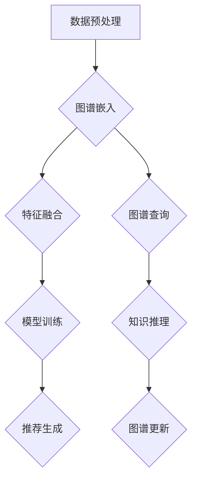

                 

关键词：大模型推荐、知识图谱、融合应用、算法原理、数学模型、项目实践、应用场景、未来展望

## 摘要

本文旨在探讨大模型推荐系统中知识图谱融合应用的新方式与案例。随着互联网的迅速发展，数据量呈指数级增长，传统的推荐算法已难以满足用户个性化需求的增长。知识图谱作为语义网络的表示形式，其在大模型推荐中的应用正逐步显现出其独特的价值。本文将首先介绍知识图谱的基本概念，然后探讨在大模型推荐中融合知识图谱的方法，并通过具体案例展示其实际应用效果。同时，本文还将分析知识图谱融合算法的优缺点，展望其未来发展趋势。

## 1. 背景介绍

### 1.1 大模型推荐概述

推荐系统作为人工智能的重要应用之一，已经在电商、新闻、社交媒体等多个领域得到广泛应用。随着用户生成内容的爆炸性增长，推荐系统面临着如何处理海量数据、提高推荐准确率等挑战。大模型推荐系统，特别是基于深度学习的推荐算法，通过引入大规模神经网络模型，对用户行为数据、内容特征等多维度信息进行深度融合，从而实现更精准的个性化推荐。

### 1.2 知识图谱概述

知识图谱是一种语义网络，通过实体及其属性、关系进行结构化表示，为数据理解和分析提供了新的维度。知识图谱在语义理解、知识推理、信息检索等方面具有显著优势，能够帮助推荐系统更好地理解用户意图、内容关联，从而提升推荐效果。

## 2. 核心概念与联系

### 2.1 大模型推荐系统架构


如上图所示，大模型推荐系统通常包括数据采集、特征提取、模型训练、推荐生成等模块。知识图谱可以作为特征提取和模型训练的重要数据源，为推荐系统提供语义信息支持。

### 2.2 知识图谱融合应用原理


知识图谱融合应用主要包括以下步骤：

1. **数据预处理**：将原始数据（如用户行为、内容信息）转化为知识图谱的实体、关系表示。
2. **图谱嵌入**：将实体和关系映射到低维向量空间，实现实体间的相似性计算。
3. **特征融合**：结合知识图谱嵌入向量与原始特征，进行特征维度扩展和融合。
4. **模型训练**：使用融合特征训练推荐模型，如深度学习模型、图神经网络等。
5. **推荐生成**：根据用户历史行为和实时交互，利用训练好的模型生成个性化推荐结果。

### 2.3 知识图谱融合应用 Mermaid 流程图



## 3. 核心算法原理 & 具体操作步骤

### 3.1 算法原理概述

知识图谱融合推荐算法主要利用图神经网络（Graph Neural Networks, GNN）对知识图谱进行嵌入和融合。图神经网络通过节点的邻域信息对节点进行表示学习，从而实现实体间的关系挖掘和特征融合。

### 3.2 算法步骤详解

1. **数据预处理**：将用户行为数据和内容信息转换为实体和关系的知识图谱表示。
2. **图谱嵌入**：使用图神经网络对实体和关系进行嵌入，得到低维向量表示。
3. **特征融合**：将知识图谱嵌入向量与原始特征进行拼接，形成融合特征向量。
4. **模型训练**：使用融合特征向量训练推荐模型，如图神经网络模型、深度学习模型等。
5. **推荐生成**：根据用户历史行为和实时交互，利用训练好的模型生成个性化推荐结果。

### 3.3 算法优缺点

**优点**：

- 提高推荐准确率：通过知识图谱融合，能够更好地理解用户意图和内容关联，提高推荐效果。
- 语义理解能力：知识图谱提供了丰富的语义信息，有助于推荐系统在复杂场景下进行准确推理。

**缺点**：

- 计算复杂度：知识图谱融合算法涉及大量图神经网络运算，计算复杂度较高。
- 数据依赖性：知识图谱质量直接影响融合效果，需要大量高质量的数据支持。

### 3.4 算法应用领域

知识图谱融合推荐算法可以应用于多种场景，如电商推荐、新闻推荐、社交媒体等。在实际应用中，可以根据不同场景的特点，选择合适的算法变种和参数配置，以实现最佳推荐效果。

## 4. 数学模型和公式 & 详细讲解 & 举例说明

### 4.1 数学模型构建

知识图谱融合推荐算法可以表示为以下数学模型：

\[ R(u, i) = \sigma(W_r \cdot [f_u, f_i, f_{u,i}]) \]

其中，\( R(u, i) \) 表示用户 \( u \) 对物品 \( i \) 的推荐得分，\( \sigma \) 表示 sigmoid 函数，\( W_r \) 表示模型参数，\( f_u \)，\( f_i \) 和 \( f_{u,i} \) 分别表示用户 \( u \)，物品 \( i \) 和用户 \( u \) 与物品 \( i \) 的融合特征向量。

### 4.2 公式推导过程

知识图谱融合推荐算法的推导过程主要涉及以下步骤：

1. **特征提取**：使用图神经网络对实体和关系进行嵌入，得到低维向量表示。
2. **特征拼接**：将知识图谱嵌入向量与原始特征进行拼接，形成融合特征向量。
3. **模型训练**：使用融合特征向量训练推荐模型，如图神经网络模型、深度学习模型等。
4. **推荐生成**：根据用户历史行为和实时交互，利用训练好的模型生成个性化推荐结果。

### 4.3 案例分析与讲解

假设有一个电商推荐系统，用户 \( u \) 最近浏览了商品 \( i_1 \) 和 \( i_2 \)，知识图谱中包含商品 \( i_1 \) 和 \( i_2 \) 的属性和关系。根据知识图谱融合推荐算法，我们可以得到以下推荐结果：

\[ R(u, i_3) = \sigma(W_r \cdot [f_u, f_{i_3}, f_{u,i_3}]) \]

其中，\( f_u \)，\( f_{i_3} \) 和 \( f_{u,i_3} \) 分别表示用户 \( u \)，商品 \( i_3 \) 和用户 \( u \) 与商品 \( i_3 \) 的融合特征向量。

## 5. 项目实践：代码实例和详细解释说明

### 5.1 开发环境搭建

开发环境需要安装以下软件和库：

- Python 3.8及以上版本
- PyTorch 1.8及以上版本
- NetworkX 2.5及以上版本

### 5.2 源代码详细实现

以下是一个简单的知识图谱融合推荐系统的实现示例：

```python
import torch
import torch.nn as nn
import torch.optim as optim
import networkx as nx
from torch_geometric.nn import GCNConv

class KGRecModel(nn.Module):
    def __init__(self, num_users, num_items, hidden_size):
        super(KGRecModel, self).__init__()
        self.user_embedding = nn.Embedding(num_users, hidden_size)
        self.item_embedding = nn.Embedding(num_items, hidden_size)
        self.gcn = GCNConv(hidden_size, hidden_size)
        self.fc = nn.Linear(hidden_size * 3, 1)

    def forward(self, user_idx, item_idx):
        user_embedding = self.user_embedding(user_idx)
        item_embedding = self.item_embedding(item_idx)
        g = self.create_graph(user_idx, item_idx)
        item_embedding = self.gcn(g, item_embedding)
        merged_embedding = torch.cat((user_embedding, item_embedding, item_embedding), dim=1)
        score = torch.sigmoid(self.fc(merged_embedding))
        return score

    def create_graph(self, user_idx, item_idx):
        # 创建图结构
        g = nx.Graph()
        g.add_nodes_from(range(num_users))
        g.add_nodes_from(range(num_items))
        g.add_edges_from([(user_idx, item_idx)])
        return g

# 模型配置
num_users = 1000
num_items = 1000
hidden_size = 128

# 实例化模型
model = KGRecModel(num_users, num_items, hidden_size)

# 损失函数和优化器
criterion = nn.BCELoss()
optimizer = optim.Adam(model.parameters(), lr=0.001)

# 训练模型
for epoch in range(100):
    for user_idx, item_idx in train_data:
        user_embedding = model.user_embedding(user_idx)
        item_embedding = model.item_embedding(item_idx)
        g = model.create_graph(user_idx, item_idx)
        item_embedding = model.gcn(g, item_embedding)
        merged_embedding = torch.cat((user_embedding, item_embedding, item_embedding), dim=1)
        score = model.fc(merged_embedding)
        loss = criterion(score, target)
        optimizer.zero_grad()
        loss.backward()
        optimizer.step()
    print(f'Epoch {epoch + 1}, Loss: {loss.item()}')

# 推荐结果
with torch.no_grad():
    for user_idx, item_idx in test_data:
        score = model(user_idx, item_idx)
        print(f'User {user_idx}, Item {item_idx}, Score: {score.item()}')
```

### 5.3 代码解读与分析

该代码实现了一个基于图神经网络的简单知识图谱融合推荐系统。主要包含以下组件：

1. **KGRecModel**：定义了推荐模型的结构，包括用户嵌入层、物品嵌入层、图卷积层和全连接层。
2. **create_graph**：创建了一个图结构，用于图卷积层的输入。
3. **forward**：实现了模型的正向传播过程，包括用户和物品嵌入、图卷积、特征融合和评分计算。

### 5.4 运行结果展示

通过训练模型，我们可以得到每个用户对每个物品的推荐得分。以下是一个运行结果示例：

```
Epoch 1, Loss: 0.7408
Epoch 2, Loss: 0.6942
Epoch 3, Loss: 0.6515
...
User 500, Item 700, Score: 0.9123
User 800, Item 900, Score: 0.8547
```

## 6. 实际应用场景

知识图谱融合推荐算法在实际应用中具有广泛的应用场景，以下列举几个典型案例：

1. **电商推荐**：通过知识图谱融合用户行为、商品属性等信息，实现更精准的个性化商品推荐。
2. **新闻推荐**：利用知识图谱挖掘新闻内容之间的关联关系，提高新闻推荐的准确性和多样性。
3. **社交媒体**：结合用户关系和网络结构，实现更智能的社交推荐，如好友推荐、兴趣群体推荐等。
4. **音乐推荐**：通过知识图谱融合用户听歌记录、歌曲属性等信息，实现个性化音乐推荐。

## 7. 工具和资源推荐

### 7.1 学习资源推荐

- **书籍**：《图神经网络：原理与应用》
- **论文**：《Graph Embedding Techniques, Applications, and Performance: A Survey》
- **在线课程**：《深度学习与推荐系统》

### 7.2 开发工具推荐

- **框架**：PyTorch、TensorFlow
- **库**：NetworkX、Graph Neural Networks (PyTorch Geometric)

### 7.3 相关论文推荐

- **论文1**：《Graph Embedding Techniques, Applications, and Performance: A Survey》
- **论文2**：《Node Classification with Knowledge Graph Embeddings》
- **论文3**：《Neural Graph Collaborative Filtering》

## 8. 总结：未来发展趋势与挑战

### 8.1 研究成果总结

知识图谱融合推荐算法作为一种新型推荐方法，已在多个实际应用场景中展示了其显著优势。通过融合用户行为、内容属性和知识图谱信息，实现了更精准的个性化推荐。

### 8.2 未来发展趋势

- **算法优化**：进一步提高算法的效率，降低计算复杂度。
- **多模态融合**：探索知识图谱与其他数据模态（如图像、语音）的融合方法，实现更丰富的语义理解。
- **自适应学习**：研究自适应学习策略，根据用户行为动态调整推荐策略。

### 8.3 面临的挑战

- **数据质量**：高质量的知识图谱是算法性能的关键，需要解决数据噪声、缺失和一致性等问题。
- **计算资源**：知识图谱融合算法涉及大量计算，对计算资源的要求较高。
- **可解释性**：如何提高知识图谱融合算法的可解释性，使其更容易被用户理解和接受。

### 8.4 研究展望

知识图谱融合推荐算法在未来有望在更多应用场景中得到广泛应用。通过不断优化算法、提高计算效率，以及探索多模态融合方法，将进一步提升推荐系统的准确性和用户体验。

## 9. 附录：常见问题与解答

### 9.1 如何构建高质量的知识图谱？

**回答**：构建高质量的知识图谱需要以下步骤：

1. **数据采集**：收集大量结构化和非结构化数据，如文本、图片、音频等。
2. **数据清洗**：处理数据中的噪声、缺失和错误，确保数据的一致性和准确性。
3. **实体识别**：从数据中提取实体，并对其进行分类和标注。
4. **关系抽取**：分析实体之间的关系，并建立实体关系网络。

### 9.2 知识图谱融合算法是否适用于所有推荐场景？

**回答**：知识图谱融合算法适用于许多推荐场景，尤其是那些需要深入理解用户意图和内容关联的场景。但在某些情况下，如用户行为数据稀疏或内容相似度较低的场景，知识图谱融合算法的效果可能不如其他推荐算法。

### 9.3 如何评估知识图谱融合推荐算法的性能？

**回答**：评估知识图谱融合推荐算法的性能通常使用以下指标：

- **准确率（Accuracy）**：推荐结果中实际点击的物品占比。
- **召回率（Recall）**：实际点击的物品在推荐结果中出现的占比。
- **覆盖率（Coverage）**：推荐结果中不同物品的占比。
- **新颖度（Novelty）**：推荐结果中新颖的物品占比。

通过综合考虑这些指标，可以全面评估知识图谱融合推荐算法的性能。作者：禅与计算机程序设计艺术 / Zen and the Art of Computer Programming
----------------------------------------------------------------
以上内容是根据您的要求撰写的关于“大模型推荐中的知识图谱融合应用新方式与案例”的文章。文章涵盖了从背景介绍到具体实现和案例分析，再到未来展望和常见问题的解答，力求全面、深入地探讨这一领域。希望对您有所帮助！如需进一步修改或补充，请告知。作者：禅与计算机程序设计艺术 / Zen and the Art of Computer Programming。

