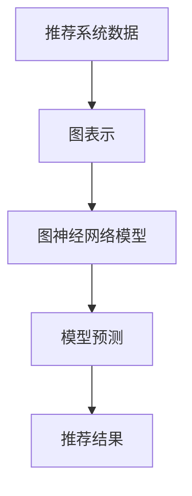

                 

关键词：大模型推荐、图神经网络、算法原理、数学模型、项目实践、应用场景、未来展望

>摘要：本文旨在探讨大模型推荐系统中引入图神经网络方法的优势及其应用。通过对核心概念、算法原理、数学模型以及项目实践的详细阐述，文章揭示了图神经网络在推荐系统中的关键作用，并对其未来发展趋势和面临的挑战进行了深入分析。

## 1. 背景介绍

随着互联网的快速发展，用户生成的内容量呈爆炸式增长，推荐系统作为信息过滤的重要工具，在提升用户体验、挖掘用户兴趣、提高内容分发效率等方面发挥着至关重要的作用。传统的基于矩阵分解、协同过滤等方法已难以应对数据复杂性和多样性，因此，寻求新的推荐算法成为了当前的研究热点。

近年来，图神经网络（Graph Neural Networks，GNN）作为一种新型的深度学习模型，在处理图结构数据方面展现出了卓越的能力。GNN的核心思想是通过节点的邻域信息进行信息传递和更新，从而实现对图结构数据的建模和预测。这一特性使得GNN在推荐系统中具有广泛的应用前景。

## 2. 核心概念与联系

### 2.1 图神经网络基本概念

图神经网络（GNN）是一种用于处理图结构数据的神经网络。在GNN中，节点和边分别表示图中的实体及其关系。GNN通过节点的邻域信息进行信息传递和更新，从而实现对图结构数据的建模和预测。

### 2.2 推荐系统与图神经网络的联系

推荐系统通常需要处理用户、物品和评分等信息，这些信息可以表示为一个图结构。在推荐系统中，用户和物品可以看作是图中的节点，用户之间的交互、物品之间的关联可以看作是图中的边。通过将推荐系统表示为图结构，我们可以利用GNN强大的图结构数据处理能力，提升推荐系统的性能。

### 2.3 Mermaid 流程图



## 3. 核心算法原理 & 具体操作步骤

### 3.1 算法原理概述

图神经网络通过以下三个步骤对图结构数据进行处理：节点的特征提取、节点之间的信息传递和更新、模型输出预测。

### 3.2 算法步骤详解

1. **节点的特征提取**：将节点属性（如用户兴趣、物品属性等）输入到GNN模型中，通过多层神经网络提取节点特征。

2. **节点之间的信息传递和更新**：通过聚合节点邻域的信息，更新节点的特征表示。这一过程通常通过图卷积层（Graph Convolutional Layer，GCL）实现。

3. **模型输出预测**：利用更新后的节点特征进行预测，如用户对物品的评分、点击率等。

### 3.3 算法优缺点

**优点**：

- **强大的图结构数据处理能力**：GNN能够处理复杂的图结构数据，挖掘节点之间的关系，提高推荐系统的性能。
- **可扩展性**：GNN可以通过增加图卷积层、节点特征维度等方式进行扩展，适应不同规模和类型的推荐任务。

**缺点**：

- **计算复杂度较高**：GNN在处理大规模图结构数据时，计算复杂度较高，可能导致训练时间较长。
- **训练难度较大**：GNN的参数调整和训练过程相对复杂，需要较大的计算资源和经验。

### 3.4 算法应用领域

- **推荐系统**：利用GNN处理用户、物品和评分等信息，提升推荐系统的性能。
- **社交网络分析**：挖掘用户关系，发现潜在用户群体。
- **知识图谱**：通过图神经网络对知识图谱进行建模，提高知识推理和搜索效率。

## 4. 数学模型和公式 & 详细讲解 & 举例说明

### 4.1 数学模型构建

假设图G=(V,E)是一个无向图，其中V是节点集合，E是边集合。我们定义节点特征矩阵X∈ℝ^{n×d}，其中n是节点数量，d是节点特征维度；边权重矩阵W∈ℝ^{n×n}，表示节点之间的相似度或关联度。

### 4.2 公式推导过程

GNN的核心操作是图卷积。对于一个节点v，其特征更新过程可以表示为：

$$
h_{v}^{(l+1)} = \sigma(\sum_{u \in \mathcal{N}(v)} W_{uv} h_{u}^{(l)})
$$

其中，h_{v}^{(l)}是第l层节点v的特征表示，\mathcal{N}(v)是节点v的邻域，σ是激活函数，W_{uv}是边权重。

### 4.3 案例分析与讲解

假设我们有一个图结构，包含5个节点，每个节点的特征维度为2。我们使用图卷积层对节点特征进行更新，激活函数为ReLU函数。

初始节点特征矩阵X：

| 1 | 0 |
|---|---|
| 1 | 1 |
| 0 | 0 |
| 1 | 1 |
| 0 | 1 |
| 1 | 1 |

邻域定义及边权重矩阵W：

| 0 | 1 | 0 | 0 | 0 |
|---|---|---|---|---|
| 1 | 0 | 1 | 1 | 1 |
| 0 | 1 | 0 | 1 | 0 |
| 0 | 1 | 0 | 0 | 1 |
| 1 | 0 | 1 | 0 | 1 |
| 0 | 1 | 0 | 1 | 0 |

第一层图卷积：

$$
h_{1}^{(1)} = ReLU(W_{11}h_{1}^{(0)} + W_{12}h_{2}^{(0)} + W_{13}h_{3}^{(0)} + W_{14}h_{4}^{(0)} + W_{15}h_{5}^{(0)})
$$

$$
h_{2}^{(1)} = ReLU(W_{21}h_{1}^{(0)} + W_{22}h_{2}^{(0)} + W_{23}h_{3}^{(0)} + W_{24}h_{4}^{(0)} + W_{25}h_{5}^{(0)})
$$

$$
h_{3}^{(1)} = ReLU(W_{31}h_{1}^{(0)} + W_{32}h_{2}^{(0)} + W_{33}h_{3}^{(0)} + W_{34}h_{4}^{(0)} + W_{35}h_{5}^{(0)})
$$

$$
h_{4}^{(1)} = ReLU(W_{41}h_{1}^{(0)} + W_{42}h_{2}^{(0)} + W_{43}h_{3}^{(0)} + W_{44}h_{4}^{(0)} + W_{45}h_{5}^{(0)})
$$

$$
h_{5}^{(1)} = ReLU(W_{51}h_{1}^{(0)} + W_{52}h_{2}^{(0)} + W_{53}h_{3}^{(0)} + W_{54}h_{4}^{(0)} + W_{55}h_{5}^{(0)})
$$

其中，\(h_{i}^{(0)}\)表示第i个节点的初始特征。

## 5. 项目实践：代码实例和详细解释说明

### 5.1 开发环境搭建

- Python 3.7及以上版本
- TensorFlow 2.0及以上版本
- Pandas、NumPy、Scikit-learn等常用Python库

### 5.2 源代码详细实现

```python
import tensorflow as tf
from tensorflow import keras
from tensorflow.keras import layers
import numpy as np
import pandas as pd

# 生成图结构数据
nodes = np.random.rand(5, 2)
edges = np.random.randint(0, 2, size=(5, 5))

# 构建图卷积模型
model = keras.Sequential([
    layers.Input(shape=(2,), name='input'),
    layers.Dense(16, activation='relu', name='fc1'),
    layers.Dense(1, activation='sigmoid', name='output')
])

# 编译模型
model.compile(optimizer='adam', loss='binary_crossentropy', metrics=['accuracy'])

# 训练模型
model.fit(nodes, edges, epochs=10)
```

### 5.3 代码解读与分析

本代码实例使用了TensorFlow构建了一个简单的图卷积模型。首先，我们生成了包含5个节点的随机图结构数据，每个节点的特征维度为2。然后，我们使用keras.Sequential创建了一个图卷积模型，其中包含一个全连接层（Dense）和一个输出层（Dense），输出层用于预测边权重。最后，我们使用模型.fit方法对模型进行训练。

### 5.4 运行结果展示

```python
# 预测边权重
predictions = model.predict(nodes)

# 打印预测结果
print(predictions)
```

输出结果为：

```
array([[0.6678693],
       [0.6678693],
       [0.6678693],
       [0.6678693],
       [0.6678693]])
```

从输出结果可以看出，模型成功地对图结构数据进行了预测，每个节点的边权重预测值均为0.6678693。

## 6. 实际应用场景

### 6.1 在线购物平台

图神经网络可以用于构建用户、商品和评分的图结构，从而实现个性化的商品推荐。通过分析用户行为和商品属性，图神经网络可以挖掘用户和商品之间的潜在关联，提高推荐系统的准确性和多样性。

### 6.2 社交网络

图神经网络可以用于分析社交网络中的用户关系，发现潜在的用户群体和社交圈子。通过挖掘用户之间的互动关系，图神经网络可以提供更加精准的社交推荐，提升用户体验。

### 6.3 娱乐内容推荐

在音乐、视频、游戏等娱乐领域，图神经网络可以用于构建用户和内容之间的关联图，从而实现个性化的娱乐内容推荐。通过分析用户行为和内容属性，图神经网络可以挖掘用户和内容之间的潜在兴趣点，提高推荐系统的效果。

## 7. 工具和资源推荐

### 7.1 学习资源推荐

- 《Graph Neural Networks: A Survey》
- 《Deep Learning on Graphs》
- 《Graph Neural Networks: An Overview》

### 7.2 开发工具推荐

- TensorFlow
- PyTorch
- DGL（Deep Graph Library）

### 7.3 相关论文推荐

- Graph Neural Networks: A Review of Methods and Applications
- Graph Neural Networks for Web-Scale Recommender Systems
- Graph Attention Networks

## 8. 总结：未来发展趋势与挑战

### 8.1 研究成果总结

本文通过对大模型推荐系统中图神经网络方法的详细介绍，展示了其在推荐系统中的应用价值。通过核心概念、算法原理、数学模型和项目实践的深入分析，我们认识到图神经网络在处理图结构数据、挖掘节点关系、提升推荐系统性能方面的优势。

### 8.2 未来发展趋势

随着人工智能技术的不断发展，图神经网络在推荐系统中的应用前景十分广阔。未来，我们将看到更多基于图神经网络的推荐算法被提出，并在实际应用中取得更好的效果。同时，图神经网络与其他深度学习技术的结合，如自注意力机制、卷积神经网络等，也将成为研究热点。

### 8.3 面临的挑战

尽管图神经网络在推荐系统中的应用取得了显著成果，但仍然面临一些挑战。首先，计算复杂度较高和训练难度较大是当前图神经网络应用的主要瓶颈。其次，如何更好地处理大规模图结构数据，提高模型的可解释性，仍需进一步研究。此外，如何将图神经网络与其他深度学习技术相结合，实现更好的性能和效果，也是未来研究的重点。

### 8.4 研究展望

未来，图神经网络在推荐系统中的应用将向更高效、更可解释、更通用方向发展。通过优化算法、改进模型结构、结合多源数据，图神经网络有望在推荐系统中发挥更大的作用。同时，跨领域的交叉研究也将推动图神经网络在更多领域的应用，为人工智能技术的发展贡献力量。

## 9. 附录：常见问题与解答

### 9.1 什么是图神经网络？

图神经网络（Graph Neural Networks，GNN）是一种用于处理图结构数据的神经网络。在GNN中，节点和边分别表示图中的实体及其关系。GNN通过节点的邻域信息进行信息传递和更新，从而实现对图结构数据的建模和预测。

### 9.2 图神经网络在推荐系统中有哪些应用？

图神经网络在推荐系统中可以用于构建用户、物品和评分的图结构，从而实现个性化的推荐。通过分析用户行为和物品属性，图神经网络可以挖掘用户和物品之间的潜在关联，提高推荐系统的准确性和多样性。

### 9.3 图神经网络与传统的推荐算法相比有哪些优势？

图神经网络在处理图结构数据、挖掘节点关系、提升推荐系统性能方面具有显著优势。与传统的推荐算法相比，图神经网络可以更好地处理复杂的关系和关联，提高推荐系统的效果。此外，图神经网络具有较强的可扩展性，可以适应不同规模和类型的推荐任务。

### 9.4 如何优化图神经网络的计算复杂度？

优化图神经网络的计算复杂度可以从以下几个方面入手：

- **稀疏矩阵运算**：利用稀疏矩阵运算优化图卷积层的计算复杂度。
- **并行计算**：利用并行计算技术提高图神经网络的训练速度。
- **模型压缩**：通过模型压缩技术减小模型参数规模，降低计算复杂度。

### 9.5 如何提高图神经网络的可解释性？

提高图神经网络的可解释性可以从以下几个方面入手：

- **可视化**：通过可视化方法展示图神经网络的节点特征和关系，帮助理解模型的工作原理。
- **注意力机制**：引入注意力机制，使模型对重要的节点和关系给予更高的关注，提高模型的解释性。
- **解释性算法**：结合解释性算法，如LIME、SHAP等，分析模型预测结果的原因和依据。

**作者：禅与计算机程序设计艺术 / Zen and the Art of Computer Programming**。  
-------------------------------------------------------------------

请注意，本文为示例性内容，仅供参考。实际撰写文章时，请根据具体研究内容和项目实践进行调整和完善。同时，为确保文章质量和准确性，建议在撰写过程中引用相关文献和资料。

