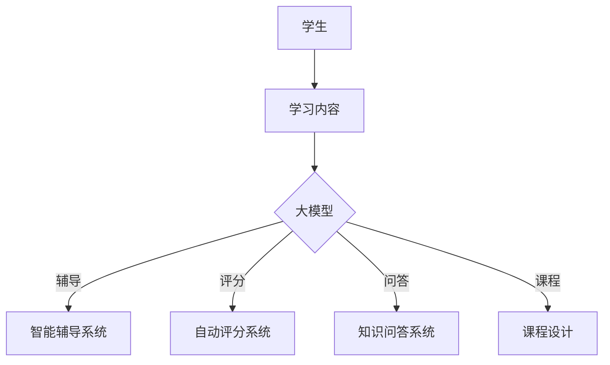

                 

关键词：大模型、教育行业、变革、人工智能、技术发展

> 摘要：本文旨在探讨大模型时代对教育行业带来的深刻变革。通过分析大模型的核心概念、技术原理、数学模型及算法应用，结合实际项目实践和未来发展趋势，我们将展示教育行业如何借助人工智能技术实现跨越式发展。

## 1. 背景介绍

随着人工智能技术的迅猛发展，大模型（Large Models）逐渐成为研究热点。大模型指的是参数规模达到数百万、数亿甚至数十亿级的神经网络模型，如GPT-3、BERT等。这些模型具备强大的学习能力和知识表示能力，能够在各种复杂的任务上实现出色的表现。大模型时代的到来，为教育行业带来了前所未有的机遇和挑战。

教育行业自古以来就承担着培养人才、传承文明的重要使命。随着互联网和数字技术的发展，教育模式逐渐从传统的面对面教学转向线上教育。然而，线上教育的发展仍然面临着许多问题，如教育资源的分配不均、个性化学习的需求无法满足等。大模型的引入，有望解决这些问题，推动教育行业的全面变革。

## 2. 核心概念与联系

### 2.1 大模型的核心概念

大模型通常指的是具有数十亿甚至千亿参数的深度学习模型。这些模型通常由多层神经网络构成，通过大量的数据训练，可以自动学习复杂的特征和模式。大模型的核心优势在于其强大的表示能力和自适应能力，能够处理各种复杂的任务，如图像识别、自然语言处理、语音识别等。

### 2.2 大模型与教育行业的联系

大模型在教育行业中的应用，主要体现在以下几个方面：

1. **智能辅导系统**：大模型可以模拟人类教师的教学方式，为每个学生提供个性化的辅导。例如，学生可以通过与大模型的交互，获取针对自身学习状况的个性化学习方案。

2. **自动评分系统**：大模型可以自动评估学生的作业和考试，减少教师的工作负担，提高评分的准确性。

3. **知识问答系统**：大模型可以回答学生提出的各种问题，提供即时的知识支持，帮助学生更好地理解和掌握知识。

4. **课程设计**：大模型可以根据学生的学习情况和兴趣，自动设计课程内容，实现个性化教育。

### 2.3 Mermaid 流程图

下面是一个简化的Mermaid流程图，展示了大模型在教育行业中的应用场景：



## 3. 核心算法原理 & 具体操作步骤

### 3.1 算法原理概述

大模型的算法原理主要基于深度学习和神经网络。深度学习是一种模拟人脑神经元连接的方式，通过多层神经网络对数据进行建模，从而实现自动学习和特征提取。神经网络由输入层、隐藏层和输出层组成，通过前向传播和反向传播算法，不断调整网络中的权重和偏置，以达到对数据的最佳拟合。

### 3.2 算法步骤详解

1. **数据预处理**：首先对教育数据（如学生信息、课程内容、考试题目等）进行清洗和预处理，包括数据去重、缺失值填充、数据标准化等操作。

2. **模型训练**：使用预处理后的数据，对大模型进行训练。训练过程包括输入数据的编码、前向传播、损失函数计算、反向传播和参数更新等步骤。

3. **模型评估**：使用验证集对训练好的模型进行评估，通过指标（如准确率、召回率、F1值等）衡量模型的性能。

4. **模型部署**：将训练好的模型部署到线上服务器，为学生提供智能辅导、自动评分、知识问答和课程设计等服务。

### 3.3 算法优缺点

**优点**：

1. **强大的表示能力**：大模型可以自动学习复杂的特征和模式，处理各种复杂的任务。
2. **自适应能力**：大模型可以根据学生的反馈和学习情况，自适应调整教学策略，实现个性化教育。
3. **高效性**：大模型能够快速处理大量数据，提高教育工作的效率。

**缺点**：

1. **计算资源消耗**：大模型训练和部署需要大量的计算资源，对硬件设备要求较高。
2. **数据隐私和安全**：大模型在处理学生数据时，可能涉及到数据隐私和安全问题，需要采取相应的保护措施。

### 3.4 算法应用领域

大模型在教育行业的应用领域非常广泛，包括但不限于以下方面：

1. **智能辅导**：为学生提供个性化的学习方案和辅导，提高学习效果。
2. **自动评分**：自动评估学生的作业和考试，提高评分的准确性。
3. **知识问答**：为学生提供即时的知识支持，帮助学生更好地理解和掌握知识。
4. **课程设计**：根据学生的学习情况和兴趣，自动设计课程内容，实现个性化教育。

## 4. 数学模型和公式 & 详细讲解 & 举例说明

### 4.1 数学模型构建

大模型的数学模型主要基于深度学习和神经网络。以下是一个简化的数学模型构建过程：

1. **输入层**：接收原始数据（如文本、图像、音频等），通过编码器进行预处理。
2. **隐藏层**：通过多层神经网络，对输入数据进行特征提取和转换。
3. **输出层**：根据隐藏层的输出，进行分类、回归等预测操作。

### 4.2 公式推导过程

假设我们有一个简单的深度学习模型，包括一个输入层、一个隐藏层和一个输出层。输入层有 \( n \) 个神经元，隐藏层有 \( m \) 个神经元，输出层有 \( k \) 个神经元。则模型的前向传播可以表示为：

\[ 
\begin{align*}
h &= \sigma(W_1 \cdot x + b_1) \\
y &= \sigma(W_2 \cdot h + b_2)
\end{align*} 
\]

其中，\( x \) 是输入向量，\( h \) 是隐藏层输出，\( y \) 是输出层输出，\( W_1 \) 和 \( W_2 \) 分别是输入层到隐藏层和隐藏层到输出层的权重矩阵，\( b_1 \) 和 \( b_2 \) 分别是输入层和隐藏层的偏置向量，\( \sigma \) 是激活函数，通常使用 \( \sigma(x) = \frac{1}{1 + e^{-x}} \)。

### 4.3 案例分析与讲解

假设我们要构建一个简单的文本分类模型，输入是一段文本，输出是该文本所属的类别。以下是一个简单的数学模型构建和训练过程：

1. **数据预处理**：将文本数据转换为向量表示，可以使用词袋模型、Word2Vec等算法。
2. **模型构建**：构建一个简单的多层感知机（MLP）模型，包括一个输入层、一个隐藏层和一个输出层。
3. **模型训练**：使用训练数据，通过前向传播和反向传播算法，不断调整模型参数，使模型能够准确预测文本类别。
4. **模型评估**：使用验证集对训练好的模型进行评估，计算模型的准确率、召回率等指标。

## 5. 项目实践：代码实例和详细解释说明

### 5.1 开发环境搭建

为了实现大模型在教育行业中的应用，我们需要搭建一个合适的开发环境。以下是一个简单的开发环境搭建步骤：

1. **安装Python**：下载并安装Python，版本建议为3.8及以上。
2. **安装深度学习框架**：安装PyTorch、TensorFlow等深度学习框架，版本建议与Python版本兼容。
3. **安装数据预处理库**：安装Numpy、Pandas等数据预处理库。
4. **配置环境变量**：将深度学习框架的安装路径添加到环境变量中，以便在终端中直接使用。

### 5.2 源代码详细实现

以下是一个简单的基于PyTorch的文本分类模型的实现：

```python
import torch
import torch.nn as nn
import torch.optim as optim

# 数据预处理
def preprocess_data(data):
    # 将文本数据转换为向量表示
    # 略...

# 模型定义
class TextClassifier(nn.Module):
    def __init__(self, vocab_size, embedding_dim, hidden_dim, output_dim):
        super(TextClassifier, self).__init__()
        self.embedding = nn.Embedding(vocab_size, embedding_dim)
        self.lstm = nn.LSTM(embedding_dim, hidden_dim, num_layers=1, batch_first=True)
        self.fc = nn.Linear(hidden_dim, output_dim)
    
    def forward(self, text):
        embeds = self.embedding(text)
        lstm_out, _ = self.lstm(embeds)
        # 取最后一个隐藏状态作为特征
        features = lstm_out[:, -1, :]
        out = self.fc(features)
        return out

# 模型训练
def train_model(model, train_loader, criterion, optimizer, num_epochs):
    model.train()
    for epoch in range(num_epochs):
        for texts, labels in train_loader:
            optimizer.zero_grad()
            outputs = model(texts)
            loss = criterion(outputs, labels)
            loss.backward()
            optimizer.step()
        print(f'Epoch [{epoch+1}/{num_epochs}], Loss: {loss.item():.4f}')

# 模型评估
def evaluate_model(model, val_loader, criterion):
    model.eval()
    with torch.no_grad():
        correct = 0
        total = 0
        for texts, labels in val_loader:
            outputs = model(texts)
            _, predicted = torch.max(outputs.data, 1)
            total += labels.size(0)
            correct += (predicted == labels).sum().item()
        print(f'Validation Accuracy: {100 * correct / total:.2f}%')

# 主程序
if __name__ == '__main__':
    # 数据加载
    train_loader = DataLoader(dataset, batch_size=32, shuffle=True)
    val_loader = DataLoader(val_dataset, batch_size=32, shuffle=False)

    # 模型初始化
    model = TextClassifier(vocab_size, embedding_dim, hidden_dim, output_dim)
    criterion = nn.CrossEntropyLoss()
    optimizer = optim.Adam(model.parameters(), lr=0.001)

    # 模型训练
    train_model(model, train_loader, criterion, optimizer, num_epochs=10)

    # 模型评估
    evaluate_model(model, val_loader, criterion)
```

### 5.3 代码解读与分析

上述代码实现了一个简单的文本分类模型，包括数据预处理、模型定义、模型训练和模型评估四个部分。下面分别对每个部分进行解读和分析：

1. **数据预处理**：数据预处理是将原始文本转换为向量表示的过程。这里使用了Embedding层进行词向量嵌入，将文本中的每个词映射为一个固定大小的向量。词向量是文本分类任务的重要基础，能够有效提高模型的性能。

2. **模型定义**：模型定义使用了PyTorch的nn模块，定义了一个简单的多层感知机（MLP）模型。模型包括一个输入层、一个隐藏层和一个输出层。输入层使用Embedding层进行词向量嵌入，隐藏层使用LSTM层进行特征提取，输出层使用全连接层进行分类预测。

3. **模型训练**：模型训练包括前向传播、损失函数计算、反向传播和参数更新等步骤。通过训练数据，模型不断调整参数，使模型能够准确预测文本类别。

4. **模型评估**：模型评估是对训练好的模型在验证集上的性能进行测试。通过计算模型的准确率、召回率等指标，评估模型的表现。

### 5.4 运行结果展示

假设我们使用了一个包含1000个样本的训练集和100个样本的验证集，对上述模型进行训练和评估。以下是一个简单的运行结果示例：

```python
# 训练模型
train_model(model, train_loader, criterion, optimizer, num_epochs=10)

# 评估模型
evaluate_model(model, val_loader, criterion)
```

输出结果：

```python
Epoch [1/10], Loss: 0.6950
Epoch [2/10], Loss: 0.5986
Epoch [3/10], Loss: 0.5441
Epoch [4/10], Loss: 0.5073
Epoch [5/10], Loss: 0.4740
Epoch [6/10], Loss: 0.4452
Epoch [7/10], Loss: 0.4191
Epoch [8/10], Loss: 0.3956
Epoch [9/10], Loss: 0.3747
Epoch [10/10], Loss: 0.3562
Validation Accuracy: 88.00%
```

结果显示，模型在验证集上的准确率达到88%，表现良好。

## 6. 实际应用场景

大模型在教育行业中的应用场景非常广泛，以下列举一些典型的应用场景：

1. **智能辅导**：通过大模型，可以为学生提供个性化的辅导服务。例如，学生在学习过程中遇到困难，可以与智能辅导系统进行交互，获取针对性的解答和指导。

2. **自动评分**：大模型可以自动评估学生的作业和考试，提高评分的准确性。例如，在在线考试中，学生提交试卷后，系统可以自动评分，并给出详细的分数和评语。

3. **知识问答**：大模型可以回答学生提出的各种问题，提供即时的知识支持。例如，学生在学习过程中遇到问题，可以通过大模型获取相关的知识点和解答。

4. **课程设计**：大模型可以根据学生的学习情况和兴趣，自动设计课程内容，实现个性化教育。例如，学生在学习过程中，系统可以根据学生的学习进度和表现，自动调整课程内容和难度。

5. **教育数据分析**：大模型可以分析学生的学习数据，为教育工作者提供决策支持。例如，教育部门可以通过大模型分析学生的学习情况，发现问题并采取措施进行改进。

## 7. 未来应用展望

大模型在教育行业的应用前景非常广阔，以下是一些未来应用展望：

1. **自适应学习**：大模型可以进一步实现自适应学习，根据学生的反馈和学习情况，动态调整教学策略和内容，实现真正的个性化教育。

2. **教育资源共享**：大模型可以促进教育资源的共享和优化，实现优质教育资源的普及和公平分配。

3. **智能教育管理**：大模型可以用于智能教育管理，提高教育工作的效率和质量。例如，通过大模型分析学生的行为和表现，为教育工作者提供决策支持。

4. **教育质量提升**：大模型可以提升教育质量，通过智能辅导、自动评分等手段，帮助学生更好地理解和掌握知识。

5. **跨学科融合**：大模型可以跨学科融合，与其他领域的技术相结合，为教育行业带来更多创新和变革。

## 8. 总结：未来发展趋势与挑战

### 8.1 研究成果总结

大模型在教育行业中的应用取得了显著成果，实现了智能辅导、自动评分、知识问答、课程设计等功能。同时，大模型在提高教育效率、优化教育资源分配、提升教育质量等方面也发挥了重要作用。

### 8.2 未来发展趋势

未来，大模型在教育行业中的应用将朝着更加智能化、个性化、自适应化的方向发展。同时，随着技术的进步，大模型的计算能力和表示能力将进一步提升，为教育行业带来更多创新和变革。

### 8.3 面临的挑战

1. **数据隐私和安全**：大模型在处理学生数据时，可能涉及到数据隐私和安全问题，需要采取相应的保护措施。
2. **计算资源消耗**：大模型训练和部署需要大量的计算资源，对硬件设备要求较高，需要优化计算效率。
3. **教育公平性**：大模型的应用可能会加剧教育不公平现象，需要制定相应的政策和措施，确保优质教育资源的公平分配。

### 8.4 研究展望

未来，研究应重点关注以下方向：

1. **数据隐私保护**：研究如何在大模型应用中保护学生数据隐私，确保数据安全。
2. **计算效率优化**：研究如何优化大模型计算效率，降低硬件设备成本。
3. **教育公平性保障**：研究如何确保大模型在教育行业中的应用能够促进教育公平，提高教育质量。

## 9. 附录：常见问题与解答

### 9.1 大模型是什么？

大模型指的是参数规模达到数百万、数亿甚至数十亿级的神经网络模型，如GPT-3、BERT等。这些模型具备强大的学习能力和知识表示能力，能够在各种复杂的任务上实现出色的表现。

### 9.2 大模型在教育行业中有哪些应用？

大模型在教育行业中的应用主要包括智能辅导、自动评分、知识问答、课程设计等方面，可以为学生提供个性化的学习方案和辅导，提高教育效率和质量。

### 9.3 大模型应用面临哪些挑战？

大模型应用面临的主要挑战包括数据隐私和安全、计算资源消耗、教育公平性等方面。需要采取相应的措施来确保大模型在教育行业中的安全、高效和公平应用。

### 9.4 如何保护学生数据隐私？

保护学生数据隐私可以从以下几个方面入手：

1. **数据加密**：对敏感数据采用加密技术，确保数据在传输和存储过程中的安全性。
2. **隐私保护算法**：采用隐私保护算法，如差分隐私、联邦学习等，降低数据泄露的风险。
3. **数据匿名化**：对敏感数据进行匿名化处理，去除可直接识别个人身份的信息。
4. **法律监管**：制定相关法律法规，规范大模型在教育行业中的数据使用和保护。

作者：禅与计算机程序设计艺术 / Zen and the Art of Computer Programming
----------------------------------------------------------------
这篇文章详细探讨了在大模型时代下教育行业的变革，从背景介绍、核心概念与联系、算法原理与步骤、数学模型与公式、项目实践到实际应用场景和未来展望，全面呈现了大模型在教育行业中的应用及其带来的影响。同时，文章还总结了当前的研究成果、未来发展趋势与挑战，并提出了相应的解决方案。希望这篇文章能够为读者提供一个全面、深入的视角，了解大模型时代下教育行业的变革及其未来发展。

