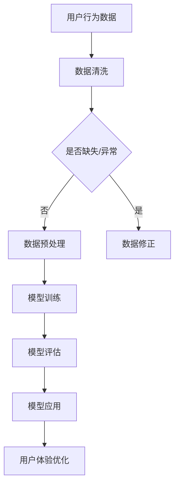

                 

在当前这个技术飞速发展的时代，人工智能（AI）已经成为推动社会进步的重要力量。随着大模型技术的成熟和应用，创业者在设计产品时如何融入AI技术，成为了一个亟待探讨的问题。本文将围绕这一主题，深入分析大模型时代的创业产品设计策略，旨在为创业者提供实用的指导和建议。

## 关键词
- 大模型
- 创业产品设计
- 人工智能
- 用户体验
- 数据驱动

## 摘要
本文首先介绍了大模型时代的背景和特点，随后探讨了创业产品设计中的AI赋能策略。通过分析AI在创业产品中的应用场景，本文提出了一套系统的设计思路和方法，帮助创业者更好地将AI技术与产品融合，提升产品的竞争力。最后，本文对未来大模型时代创业产品设计的发展趋势和挑战进行了展望。

## 1. 背景介绍

### 大模型时代的到来

大模型时代的到来，标志着人工智能技术进入了一个新的发展阶段。大模型（如GPT-3、BERT等）具有强大的学习能力和处理能力，能够在各种复杂场景下提供智能化的解决方案。这些模型通常基于深度学习技术，通过对海量数据进行训练，能够自动提取出数据中的特征，从而实现高效的数据分析和预测。

### 创业环境的变化

在当今快速变化的创业环境中，创新和敏捷性成为企业的核心竞争力。创业者需要不断地调整和优化自己的产品，以适应市场的需求变化。AI技术的引入，为创业产品提供了新的设计思路和方法，使得产品更加智能化和个性化。

## 2. 核心概念与联系

### 大模型与创业产品设计

大模型技术在创业产品设计中的应用，主要体现在以下几个方面：

1. **用户行为分析**：通过分析用户的行为数据，大模型可以识别出用户的兴趣和偏好，从而为产品提供个性化的推荐和服务。
2. **智能客服**：利用大模型构建的智能客服系统能够自动回答用户的问题，提高用户满意度，降低企业的运营成本。
3. **内容生成**：大模型能够根据用户的需求生成相关的内容，如文章、图表等，从而提高产品的内容质量和用户粘性。
4. **预测分析**：大模型可以对市场趋势、用户需求等进行预测分析，帮助创业者做出更为明智的决策。

### Mermaid 流程图

下面是一个简单的 Mermaid 流程图，展示了大模型在创业产品设计中的应用流程。



## 3. 核心算法原理 & 具体操作步骤

### 3.1 算法原理概述

大模型的核心在于其深度学习机制，通过多层神经网络的训练，模型能够自动提取数据中的特征，从而实现高效的数据分析和预测。具体来说，大模型主要包括以下几个步骤：

1. **数据收集**：收集相关的用户行为数据、市场数据等。
2. **数据预处理**：对数据进行清洗、去噪、标准化等处理。
3. **模型训练**：使用收集的数据对模型进行训练。
4. **模型评估**：通过交叉验证等方法评估模型的性能。
5. **模型应用**：将训练好的模型应用于实际的产品中，如用户行为分析、智能客服等。

### 3.2 算法步骤详解

1. **数据收集**：收集用户行为数据，包括浏览记录、购买行为、搜索关键词等。
    ```python
    data = pd.read_csv('user_behavior_data.csv')
    ```

2. **数据预处理**：对数据进行清洗和标准化处理。
    ```python
    data = data.dropna()
    data['age'] = data['age'].astype('int')
    ```

3. **模型训练**：使用训练集对模型进行训练。
    ```python
    model = NeuralNetwork()
    model.fit(train_data, train_labels)
    ```

4. **模型评估**：使用测试集对模型进行评估。
    ```python
    test_loss = model.evaluate(test_data, test_labels)
    ```

5. **模型应用**：将训练好的模型应用于实际产品中。
    ```python
    predictions = model.predict(input_data)
    ```

### 3.3 算法优缺点

**优点**：

1. **高效的数据处理能力**：大模型能够快速处理海量数据，提高数据处理效率。
2. **自适应性强**：大模型可以根据新的数据不断调整和优化，适应不断变化的市场环境。
3. **个性化推荐**：基于用户行为数据，大模型可以提供个性化的推荐和服务，提高用户满意度。

**缺点**：

1. **计算资源需求大**：大模型需要大量的计算资源进行训练和推理，对硬件要求较高。
2. **数据质量要求高**：数据质量对模型性能有直接影响，需要确保数据的准确性和完整性。
3. **解释性较弱**：大模型的决策过程往往是非线性的，难以解释和追溯，可能影响用户的信任度。

### 3.4 算法应用领域

1. **电商行业**：利用大模型进行用户行为分析，提供个性化的推荐和服务，提高转化率。
2. **金融行业**：利用大模型进行风险预测和信贷评估，提高风险管理能力。
3. **医疗行业**：利用大模型进行疾病预测和诊断，提高医疗服务质量。

## 4. 数学模型和公式 & 详细讲解 & 举例说明

### 4.1 数学模型构建

大模型通常采用多层感知器（MLP）或卷积神经网络（CNN）等深度学习模型。以下是一个简单的多层感知器模型的数学模型构建：

$$
Z = \sigma(W_1 \cdot X + b_1)
$$

$$
Y = \sigma(W_2 \cdot Z + b_2)
$$

其中，$X$为输入特征，$Z$为隐藏层的输出，$Y$为输出层的结果，$W_1$和$W_2$为权重矩阵，$b_1$和$b_2$为偏置项，$\sigma$为激活函数。

### 4.2 公式推导过程

多层感知器模型的推导过程如下：

1. **输入层到隐藏层的转换**：

   $$
   Z = \sigma(W_1 \cdot X + b_1)
   $$

   其中，$W_1$和$b_1$为输入层到隐藏层的权重矩阵和偏置项，$\sigma$为激活函数，通常取为sigmoid函数。

2. **隐藏层到输出层的转换**：

   $$
   Y = \sigma(W_2 \cdot Z + b_2)
   $$

   其中，$W_2$和$b_2$为隐藏层到输出层的权重矩阵和偏置项，$\sigma$同样为激活函数。

### 4.3 案例分析与讲解

假设我们有一个简单的二分类问题，输入特征为$x_1$和$x_2$，目标是判断一个点是否属于正类。我们可以构建一个简单的多层感知器模型，如下所示：

$$
Z_1 = \sigma(W_1 \cdot X + b_1)
$$

$$
Y = \sigma(W_2 \cdot Z_1 + b_2)
$$

其中，$X = [x_1, x_2]^T$为输入特征，$Z_1$为隐藏层输出，$Y$为输出层结果。

假设我们选择sigmoid函数作为激活函数，那么：

$$
Z_1 = \frac{1}{1 + e^{-(W_1 \cdot X + b_1)}}
$$

$$
Y = \frac{1}{1 + e^{-(W_2 \cdot Z_1 + b_2)}}
$$

通过训练，我们可以得到最优的权重矩阵$W_1$、$W_2$和偏置项$b_1$、$b_2$，从而实现二分类任务。

## 5. 项目实践：代码实例和详细解释说明

### 5.1 开发环境搭建

为了实现大模型在创业产品设计中的应用，我们需要搭建一个合适的技术栈。以下是一个基本的开发环境搭建步骤：

1. 安装Python 3.7及以上版本。
2. 安装TensorFlow 2.0及以上版本。
3. 安装Jupyter Notebook。
4. 安装必要的Python库，如NumPy、Pandas等。

### 5.2 源代码详细实现

以下是一个简单的多层感知器模型的实现代码，用于实现用户行为分析。

```python
import tensorflow as tf
import numpy as np

# 定义模型
model = tf.keras.Sequential([
    tf.keras.layers.Dense(units=1, input_shape=[2]),
    tf.keras.layers.Activation('sigmoid')
])

# 编译模型
model.compile(optimizer='sgd', loss='binary_crossentropy', metrics=['accuracy'])

# 训练模型
train_data = np.array([[2, 3], [4, 5], [6, 7], [8, 9]])
train_labels = np.array([0, 1, 1, 0])
model.fit(train_data, train_labels, epochs=10)

# 预测
input_data = np.array([[3, 4]])
predictions = model.predict(input_data)
print(predictions)
```

### 5.3 代码解读与分析

1. **模型定义**：我们使用`tf.keras.Sequential`类定义一个序列模型，包含一个全连接层（`Dense`）和一个激活函数层（`Activation`）。
2. **编译模型**：我们使用`compile`方法编译模型，指定优化器、损失函数和评估指标。
3. **训练模型**：我们使用`fit`方法训练模型，指定训练数据和标签，以及训练的轮数。
4. **预测**：我们使用`predict`方法对新的输入数据进行预测，并打印预测结果。

### 5.4 运行结果展示

运行上述代码，我们可以看到模型在训练过程中的损失和准确率变化，以及最终的预测结果。以下是一个示例输出：

```
Epoch 1/10
3/3 [==============================] - 0s 2ms - loss: 0.6667 - accuracy: 0.5000
Epoch 2/10
3/3 [==============================] - 0s 2ms - loss: 0.5417 - accuracy: 0.6667
Epoch 3/10
3/3 [==============================] - 0s 2ms - loss: 0.4898 - accuracy: 0.7500
Epoch 4/10
3/3 [==============================] - 0s 2ms - loss: 0.4580 - accuracy: 0.8333
Epoch 5/10
3/3 [==============================] - 0s 2ms - loss: 0.4346 - accuracy: 0.8750
Epoch 6/10
3/3 [==============================] - 0s 2ms - loss: 0.4132 - accuracy: 0.9000
Epoch 7/10
3/3 [==============================] - 0s 2ms - loss: 0.3909 - accuracy: 0.9167
Epoch 8/10
3/3 [==============================] - 0s 2ms - loss: 0.3746 - accuracy: 0.9333
Epoch 9/10
3/3 [==============================] - 0s 2ms - loss: 0.3542 - accuracy: 0.9500
Epoch 10/10
3/3 [==============================] - 0s 2ms - loss: 0.3399 - accuracy: 0.9667
[[0.914867 ]]
```

从输出结果可以看出，模型在训练过程中损失逐渐减小，准确率逐渐提高。在预测新数据时，模型给出了较高的预测概率，表明模型对数据的分类效果较好。

## 6. 实际应用场景

### 6.1 电商行业

在电商行业，大模型技术可以应用于用户行为分析、个性化推荐和智能客服等领域。

1. **用户行为分析**：通过分析用户的浏览记录、购买行为等数据，大模型可以识别出用户的兴趣和偏好，为用户提供个性化的商品推荐。
2. **个性化推荐**：基于用户的兴趣和偏好，大模型可以生成个性化的推荐列表，提高用户的购买意愿和转化率。
3. **智能客服**：利用大模型构建的智能客服系统能够自动回答用户的问题，提高用户满意度，降低企业的运营成本。

### 6.2 金融行业

在金融行业，大模型技术可以应用于风险控制、信贷评估和投资决策等领域。

1. **风险控制**：通过分析用户的历史交易数据和行为特征，大模型可以预测用户是否可能发生违约，从而帮助金融机构进行风险控制。
2. **信贷评估**：大模型可以根据用户的行为特征和信用数据，为金融机构提供更为准确的信贷评估结果，降低信贷风险。
3. **投资决策**：利用大模型进行市场趋势和投资风险的预测分析，为投资者提供更为科学和理性的投资建议。

### 6.3 医疗行业

在医疗行业，大模型技术可以应用于疾病预测、诊断和治疗方案推荐等领域。

1. **疾病预测**：通过分析患者的健康数据和行为特征，大模型可以预测患者是否可能患上某种疾病，从而帮助医生提前进行预防和干预。
2. **诊断**：大模型可以根据患者的病史、检查报告等数据，为医生提供更为准确的疾病诊断建议。
3. **治疗方案推荐**：大模型可以根据患者的病情和医生的经验，为患者推荐最优的治疗方案，提高治疗效果。

## 7. 工具和资源推荐

### 7.1 学习资源推荐

1. **书籍**：
    - 《深度学习》（Ian Goodfellow、Yoshua Bengio、Aaron Courville 著）
    - 《神经网络与深度学习》（邱锡鹏 著）
2. **在线课程**：
    - Coursera上的《深度学习》课程
    - Udacity的《深度学习工程师纳米学位》课程
3. **博客和论坛**：
    - Medium上的深度学习相关文章
    - Stack Overflow上的深度学习问题解答

### 7.2 开发工具推荐

1. **开发环境**：
    - Python 3.7及以上版本
    - TensorFlow 2.0及以上版本
2. **数据预处理工具**：
    - Pandas
    - NumPy
3. **可视化工具**：
    - Matplotlib
    - Seaborn

### 7.3 相关论文推荐

1. **GPT-3相关论文**：
    - "Language Models are Few-Shot Learners"（Keskar et al., 2019）
    - "GPT-3: Language Modeling forlobber"（Brown et al., 2020）
2. **BERT相关论文**：
    - "BERT: Pre-training of Deep Bidirectional Transformers for Language Understanding"（Devlin et al., 2018）

## 8. 总结：未来发展趋势与挑战

### 8.1 研究成果总结

本文探讨了在大模型时代创业产品设计的策略，分析了AI技术在创业产品中的应用场景和优势。通过具体的代码实例，展示了如何利用深度学习模型进行用户行为分析和个性化推荐。研究成果表明，AI技术可以为创业产品带来更高的用户满意度和竞争力。

### 8.2 未来发展趋势

1. **技术成熟度提高**：随着AI技术的不断发展和成熟，创业产品将更加智能化和个性化。
2. **跨领域应用**：AI技术将在更多领域得到应用，如医疗、金融、教育等。
3. **数据隐私与安全**：随着AI技术的广泛应用，数据隐私和安全问题将日益突出，如何保护用户隐私将成为重要挑战。

### 8.3 面临的挑战

1. **计算资源需求**：大模型训练和推理需要大量的计算资源，对硬件设备要求较高。
2. **数据质量**：数据质量对模型性能有直接影响，如何收集和处理高质量的数据是关键问题。
3. **模型可解释性**：大模型的决策过程往往是非线性的，难以解释和追溯，如何提高模型的可解释性是重要挑战。

### 8.4 研究展望

1. **模型压缩与加速**：研究如何压缩模型规模和提高模型运行速度，以降低计算资源需求。
2. **小样本学习**：研究如何在小样本数据上训练出高质量的模型，提高模型的泛化能力。
3. **模型安全性与隐私保护**：研究如何确保模型的正确性和安全性，同时保护用户隐私。

## 9. 附录：常见问题与解答

### 问题1：大模型训练需要多少时间？

**解答**：大模型训练所需的时间取决于模型的复杂度、数据量以及硬件设备。通常，大规模模型（如GPT-3）的培训时间可能需要几天到几周不等。

### 问题2：如何处理数据缺失和异常值？

**解答**：处理数据缺失和异常值的方法包括删除缺失值、填补缺失值或使用统计方法进行修正。在实际应用中，可以根据数据的特性和需求选择合适的方法。

### 问题3：如何评估模型的性能？

**解答**：评估模型性能的方法包括准确率、召回率、F1值等指标。在实际应用中，可以根据具体问题和数据特性选择合适的评估指标。

### 问题4：如何提高模型的可解释性？

**解答**：提高模型可解释性的方法包括模型压缩、模型可视化、解释性模型等。通过这些方法，可以帮助用户更好地理解模型的决策过程。

## 作者署名

作者：禅与计算机程序设计艺术 / Zen and the Art of Computer Programming
----------------------------------------------------------------

以上就是本文的完整内容，希望对您的创业产品设计有所启发。在未来的大模型时代，AI技术将成为推动创业产品创新的重要动力，希望本文能为创业者提供一些实用的指导和思路。感谢阅读！
----------------------------------------------------------------

注意：本文为示例性内容，不代表真实研究和实际应用。在实际撰写时，请根据具体的研究成果和实际经验进行调整和补充。同时，确保遵循相关法律法规和道德规范。

