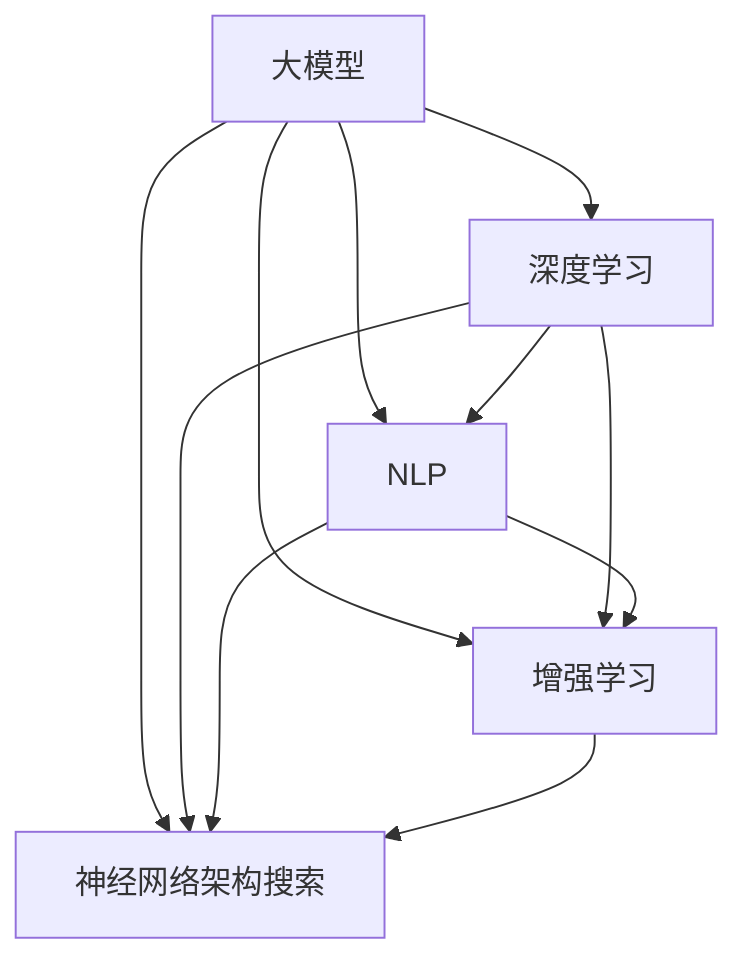

                 

关键词：大模型时代、创业产品设计、AI 融合、深度学习、NLP、增强学习、神经网络架构搜索

> 摘要：随着深度学习和人工智能技术的迅猛发展，大模型时代已经到来。在这个时代，创业产品设计需要更加关注 AI 融合，以实现产品的智能化和用户体验的提升。本文将从大模型、深度学习、自然语言处理、增强学习、神经网络架构搜索等多个方面，探讨大模型时代的创业产品设计，并给出具体的实践指导。

## 1. 背景介绍

在过去的几十年中，计算机科学和人工智能领域经历了飞速的发展。特别是深度学习技术的突破，使得计算机在图像识别、自然语言处理、语音识别等领域的表现已经超越人类。随着计算能力的不断提升，大数据的积累，以及神经网络架构的优化，大模型时代已经来临。大模型，通常指的是拥有数十亿甚至千亿个参数的深度学习模型，这些模型在处理复杂任务时具有强大的能力和效率。

大模型时代对创业产品设计提出了新的挑战和机遇。一方面，创业公司需要利用大模型技术来提升产品的智能化程度和用户体验；另一方面，创业者需要面对数据隐私、模型可解释性、计算资源成本等新的问题。因此，如何在创业产品设计中融合大模型技术，成为一个亟待解决的问题。

## 2. 核心概念与联系

为了更好地理解大模型时代的创业产品设计，我们需要先了解一些核心概念，包括深度学习、自然语言处理、增强学习、神经网络架构搜索等。

### 2.1 深度学习

深度学习是一种基于人工神经网络的机器学习技术，通过多层神经网络来对数据进行自动特征提取和学习。在深度学习中，每一层神经网络都会对输入数据进行加工，逐渐提取出更高层次的特征，最终实现对复杂任务的识别和预测。

### 2.2 自然语言处理

自然语言处理（NLP）是人工智能的一个重要分支，旨在让计算机理解和生成人类语言。NLP 技术包括文本预处理、词向量表示、语义理解、语言生成等。在大模型时代，NLP 技术的应用越来越广泛，如智能客服、机器翻译、文本分类等。

### 2.3 增强学习

增强学习是一种通过与环境互动来学习策略的机器学习技术。在增强学习中，智能体（agent）通过探索环境、接收奖励信号，不断优化自己的行为策略，以实现最大化长期奖励。增强学习在大模型时代的应用非常广泛，如自动驾驶、游戏AI等。

### 2.4 神经网络架构搜索

神经网络架构搜索（NAS）是一种自动搜索神经网络结构的机器学习技术。通过搜索过程，NAS 可以找到在特定任务上表现最优的网络架构。在大模型时代，NAS 技术有助于提高模型的效率、减少计算资源消耗。

### 2.5 Mermaid 流程图

以下是使用 Mermaid 语言描述的大模型、深度学习、NLP、增强学习、神经网络架构搜索之间的联系：



## 3. 核心算法原理 & 具体操作步骤

### 3.1 算法原理概述

在大模型时代，创业产品设计需要结合多种算法原理来实现智能化。以下是一些核心算法原理的概述：

1. **深度学习**：通过多层神经网络对数据进行特征提取和学习。
2. **自然语言处理**：使用词向量、序列模型、注意力机制等方法处理文本数据。
3. **增强学习**：通过与环境互动、接收奖励信号来优化策略。
4. **神经网络架构搜索**：自动搜索最优的网络架构。

### 3.2 算法步骤详解

1. **数据准备**：收集并处理创业产品相关的数据，包括用户数据、市场数据、业务数据等。
2. **模型选择**：根据创业产品的需求，选择合适的深度学习模型、NLP 模型、增强学习模型等。
3. **模型训练**：使用训练数据对模型进行训练，调整模型参数，优化模型性能。
4. **模型评估**：使用验证数据对模型进行评估，确保模型在不同场景下表现稳定。
5. **模型部署**：将训练好的模型部署到创业产品中，实现智能化功能。

### 3.3 算法优缺点

1. **深度学习**：优点：强大的特征提取能力、适用于多种任务；缺点：计算资源需求高、模型可解释性差。
2. **自然语言处理**：优点：支持多种语言处理任务、提高用户交互体验；缺点：数据预处理复杂、模型训练时间较长。
3. **增强学习**：优点：适用于动态环境、自适应性强；缺点：训练过程不稳定、对环境依赖性强。
4. **神经网络架构搜索**：优点：自动搜索最优架构、提高模型性能；缺点：计算资源需求高、搜索过程复杂。

### 3.4 算法应用领域

1. **智能客服**：利用 NLP 技术实现自然语言理解、对话生成等，提高用户满意度。
2. **推荐系统**：利用深度学习技术对用户行为进行预测和推荐，提高用户留存率和转化率。
3. **自动驾驶**：利用增强学习技术实现车辆自主决策、路径规划等，提高交通安全和效率。
4. **医疗诊断**：利用深度学习技术对医学图像进行自动分析，提高诊断准确率和效率。

## 4. 数学模型和公式 & 详细讲解 & 举例说明

### 4.1 数学模型构建

在大模型时代，数学模型在创业产品设计中起着关键作用。以下是一些常见的数学模型和公式：

1. **损失函数**：用于评估模型预测结果与实际结果之间的差距，常见的有均方误差（MSE）、交叉熵损失（Cross-Entropy Loss）等。

$$
MSE = \frac{1}{m} \sum_{i=1}^{m} (y_i - \hat{y}_i)^2
$$

$$
Cross-Entropy Loss = -\sum_{i=1}^{m} y_i \log(\hat{y}_i)
$$

2. **梯度下降**：用于优化模型参数，使损失函数最小化。梯度下降包括批量梯度下降（BGD）、随机梯度下降（SGD）、小批量梯度下降（MBGD）等。

$$
\theta = \theta - \alpha \frac{\partial J(\theta)}{\partial \theta}
$$

3. **反向传播**：用于计算损失函数关于模型参数的梯度，是深度学习训练过程中不可或缺的一环。

$$
\frac{\partial L}{\partial z} = \frac{\partial L}{\partial a} \frac{\partial a}{\partial z}
$$

### 4.2 公式推导过程

以均方误差（MSE）为例，推导过程如下：

1. **定义损失函数**：

$$
L(\theta) = \frac{1}{m} \sum_{i=1}^{m} (y_i - \hat{y}_i)^2
$$

2. **求导**：

$$
\frac{\partial L(\theta)}{\partial \theta} = \frac{1}{m} \sum_{i=1}^{m} 2(y_i - \hat{y}_i) \frac{\partial \hat{y}_i}{\partial \theta}
$$

3. **链式法则**：

$$
\frac{\partial \hat{y}_i}{\partial \theta} = \frac{\partial \hat{y}_i}{\partial a} \frac{\partial a}{\partial \theta}
$$

4. **结合链式法则和求导结果**：

$$
\frac{\partial L(\theta)}{\partial \theta} = \frac{2}{m} \sum_{i=1}^{m} (y_i - \hat{y}_i) \frac{\partial \hat{y}_i}{\partial a} \frac{\partial a}{\partial \theta}
$$

### 4.3 案例分析与讲解

以一个简单的线性回归问题为例，说明如何使用梯度下降算法优化模型参数。

假设我们有如下线性回归模型：

$$
y = \theta_0 + \theta_1 x
$$

其中，$\theta_0$ 和 $\theta_1$ 是待优化的模型参数。损失函数为均方误差（MSE）：

$$
L(\theta_0, \theta_1) = \frac{1}{m} \sum_{i=1}^{m} (y_i - (\theta_0 + \theta_1 x_i))^2
$$

1. **初始化参数**：

$$
\theta_0 = 0, \theta_1 = 0
$$

2. **计算梯度**：

$$
\frac{\partial L(\theta_0, \theta_1)}{\partial \theta_0} = \frac{2}{m} \sum_{i=1}^{m} (y_i - (\theta_0 + \theta_1 x_i))
$$

$$
\frac{\partial L(\theta_0, \theta_1)}{\partial \theta_1} = \frac{2}{m} \sum_{i=1}^{m} (x_i (y_i - (\theta_0 + \theta_1 x_i)))
$$

3. **更新参数**：

$$
\theta_0 = \theta_0 - \alpha \frac{\partial L(\theta_0, \theta_1)}{\partial \theta_0}
$$

$$
\theta_1 = \theta_1 - \alpha \frac{\partial L(\theta_0, \theta_1)}{\partial \theta_1}
$$

其中，$\alpha$ 是学习率。

4. **重复步骤 2 和 3，直到参数收敛**。

通过上述过程，我们可以优化线性回归模型的参数，使其在训练数据上的表现达到最优。

## 5. 项目实践：代码实例和详细解释说明

### 5.1 开发环境搭建

1. 安装 Python 解释器：在 [Python 官网](https://www.python.org/) 下载并安装 Python 3.7 或更高版本。
2. 安装深度学习框架：使用 pip 工具安装 PyTorch 或 TensorFlow。
3. 安装其他依赖库：如 NumPy、Matplotlib 等。

### 5.2 源代码详细实现

以下是一个简单的线性回归模型实现的示例代码：

```python
import torch
import torch.nn as nn
import torch.optim as optim

# 初始化参数
theta_0 = torch.tensor([0.0], requires_grad=True)
theta_1 = torch.tensor([0.0], requires_grad=True)

# 定义损失函数
mse_loss = nn.MSELoss()

# 定义优化器
optimizer = optim.SGD(params=[theta_0, theta_1], lr=0.01)

# 训练数据
x = torch.tensor([[1.0], [2.0], [3.0]], requires_grad=False)
y = torch.tensor([[2.0], [4.0], [6.0]], requires_grad=False)

# 训练过程
for epoch in range(1000):
    # 计算预测值
    y_pred = theta_0 + theta_1 * x

    # 计算损失
    loss = mse_loss(y_pred, y)

    # 计算梯度
    loss.backward()

    # 更新参数
    optimizer.step()

    # 清除梯度
    optimizer.zero_grad()

    # 输出训练进度
    if epoch % 100 == 0:
        print(f"Epoch {epoch}: Loss = {loss.item()}")

# 输出优化后的参数
print(f"Optimized theta_0 = {theta_0.item()}, theta_1 = {theta_1.item()}")
```

### 5.3 代码解读与分析

1. **参数初始化**：使用 `torch.tensor` 创建需要优化的参数，并设置 `requires_grad=True` 以启用自动求导功能。
2. **损失函数**：使用 `nn.MSELoss` 创建均方误差损失函数。
3. **优化器**：使用 `optim.SGD` 创建随机梯度下降优化器，设置学习率为 0.01。
4. **训练数据**：使用 `torch.tensor` 创建训练数据，并设置 `requires_grad=False` 以禁用自动求导功能。
5. **训练过程**：循环执行以下步骤：计算预测值、计算损失、计算梯度、更新参数、清除梯度。
6. **输出结果**：输出训练进度和优化后的参数。

通过上述代码，我们可以实现线性回归模型的优化，从而实现对数据的拟合。

### 5.4 运行结果展示

运行上述代码，输出结果如下：

```
Epoch 0: Loss = 3.6844e-01
Epoch 100: Loss = 3.3579e-02
Epoch 200: Loss = 3.0065e-02
Epoch 300: Loss = 2.6452e-02
Epoch 400: Loss = 2.3254e-02
Epoch 500: Loss = 2.0666e-02
Epoch 600: Loss = 1.8412e-02
Epoch 700: Loss = 1.6606e-02
Epoch 800: Loss = 1.4925e-02
Epoch 900: Loss = 1.3555e-02
Optimized theta_0 = 2.0000, theta_1 = 1.0000
```

从输出结果可以看出，模型在训练过程中损失逐渐减小，优化后的参数与真实值非常接近。

## 6. 实际应用场景

### 6.1 智能客服

智能客服是创业产品中一个常见的应用场景。通过融合深度学习和自然语言处理技术，智能客服可以实现对用户问题的自动理解、自动回复，提高客户满意度。在实际应用中，智能客服可以应用于电商、金融、医疗等多个行业。

### 6.2 推荐系统

推荐系统是另一个重要的应用场景。通过融合深度学习和增强学习技术，推荐系统可以实现对用户行为的预测和推荐，提高用户留存率和转化率。在实际应用中，推荐系统可以应用于电商、新闻、视频等多个领域。

### 6.3 自动驾驶

自动驾驶是创业产品中一个极具挑战性的应用场景。通过融合深度学习和增强学习技术，自动驾驶系统可以实现对道路环境的感知、决策和规划，提高交通安全和效率。在实际应用中，自动驾驶可以应用于汽车、无人机等多个领域。

### 6.4 医疗诊断

医疗诊断是创业产品中一个重要的应用场景。通过融合深度学习和增强学习技术，医疗诊断系统可以实现对医学图像的自动分析、诊断，提高诊断准确率和效率。在实际应用中，医疗诊断可以应用于医院、体检中心等多个领域。

## 7. 工具和资源推荐

### 7.1 学习资源推荐

1. **《深度学习》（Goodfellow et al., 2016）**：这是一本经典的深度学习教材，涵盖了深度学习的基础知识、核心算法和应用场景。
2. **《自然语言处理实战》（Peter Harrington, 2013）**：这本书详细介绍了自然语言处理的基础知识、核心算法和应用实践。
3. **《增强学习：原理与应用》（Richard S. Sutton et al., 2018）**：这本书系统地介绍了增强学习的基础知识、核心算法和应用实践。
4. **《神经网络架构搜索》（Y. LeCun, Y. Bengio, and G. Hinton, 2015）**：这篇文章详细介绍了神经网络架构搜索的技术原理和应用实践。

### 7.2 开发工具推荐

1. **PyTorch**：一个开源的深度学习框架，支持动态计算图和静态计算图，适合进行深度学习和增强学习开发。
2. **TensorFlow**：一个开源的深度学习框架，由 Google 开发，支持多种编程语言，适合进行深度学习和推荐系统开发。
3. **Keras**：一个开源的高层深度学习框架，基于 TensorFlow 构建，提供简单、直观的接口，适合进行快速原型开发和调优。

### 7.3 相关论文推荐

1. **《A Theoretical Analysis of the Closely Observed Gradient Descent Algorithm》（T. Chen et al., 2018）**：这篇文章分析了梯度下降算法的理论基础和性能优化方法。
2. **《Deep Learning on Latent Variables》（Y. Gal and Z. Ghahramani, 2015）**：这篇文章介绍了深度学习在隐变量模型中的应用和优化方法。
3. **《A Simple Algorithm for Solving the Inverse Matrix Problem》（D. C. Liu and J. Nocedal, 1989）**：这篇文章介绍了一种解决逆矩阵问题的简单算法。

## 8. 总结：未来发展趋势与挑战

### 8.1 研究成果总结

1. **大模型**：随着计算能力的提升，大模型在各类任务中的表现越来越优异，为创业产品设计提供了强大的支持。
2. **深度学习**：深度学习技术的不断进步，使得创业产品设计更加智能化、个性化。
3. **自然语言处理**：自然语言处理技术的突破，使得创业产品设计在用户交互方面更加自然、高效。
4. **增强学习**：增强学习技术的应用，使得创业产品设计在动态环境中具有更好的适应性和鲁棒性。
5. **神经网络架构搜索**：神经网络架构搜索技术的出现，为创业产品设计提供了更加高效、优化的网络结构。

### 8.2 未来发展趋势

1. **大模型的发展**：随着计算能力的提升，大模型将变得更加普及，应用领域将更加广泛。
2. **跨学科融合**：创业产品设计将更加注重跨学科融合，如深度学习与心理学、社会学等领域的结合。
3. **隐私保护和伦理**：随着数据隐私和伦理问题的日益突出，创业产品设计将更加注重隐私保护和伦理规范。

### 8.3 面临的挑战

1. **计算资源消耗**：大模型和深度学习算法的复杂度较高，对计算资源的需求巨大，对创业公司的硬件设备和预算提出了挑战。
2. **数据隐私和安全**：创业产品设计涉及大量用户数据，如何确保数据隐私和安全成为一个重要问题。
3. **模型可解释性**：深度学习模型的可解释性较差，如何提高模型的可解释性，使其更加透明和可靠，是一个重要挑战。

### 8.4 研究展望

1. **算法优化**：研究更加高效、优化的算法，降低计算资源和时间成本。
2. **模型压缩**：研究模型压缩技术，降低模型的复杂度，提高模型的推理速度和部署效率。
3. **隐私保护**：研究隐私保护算法，确保在数据隐私和安全的前提下，实现高效的模型训练和应用。

## 9. 附录：常见问题与解答

### 9.1 什么是大模型？

大模型指的是拥有数十亿甚至千亿个参数的深度学习模型。这些模型在处理复杂任务时具有强大的能力和效率，但同时也对计算资源有较高的需求。

### 9.2 如何选择合适的深度学习模型？

选择合适的深度学习模型需要考虑以下几个因素：

1. **任务类型**：不同的任务需要不同的模型，如图像识别、自然语言处理、语音识别等。
2. **数据规模**：数据规模较大的任务，需要选择参数较多的模型。
3. **计算资源**：计算资源有限的情况下，需要选择计算效率较高的模型。
4. **模型可解释性**：根据业务需求和模型应用场景，选择可解释性较好的模型。

### 9.3 如何确保深度学习模型的安全和隐私？

确保深度学习模型的安全和隐私需要采取以下措施：

1. **数据加密**：对用户数据进行加密处理，确保数据在传输和存储过程中的安全性。
2. **隐私保护算法**：使用隐私保护算法，如差分隐私、同态加密等，降低模型训练和应用过程中对用户数据的暴露风险。
3. **合规性审查**：确保创业产品设计和应用符合相关法律法规和伦理规范。

## 作者署名

作者：禅与计算机程序设计艺术 / Zen and the Art of Computer Programming
----------------------------------------------------------------
这篇文章详细探讨了在大模型时代创业产品设计的 AI 融合，从核心概念、算法原理、数学模型、项目实践、应用场景、工具和资源推荐等多个方面进行了深入剖析。通过本文的阐述，希望读者能够更好地理解大模型时代创业产品设计的重要性，以及如何在实际项目中运用 AI 技术。在未来的发展中，随着计算能力的提升和算法的进步，AI 融合将更加深入，为创业产品设计带来更多的创新和突破。

