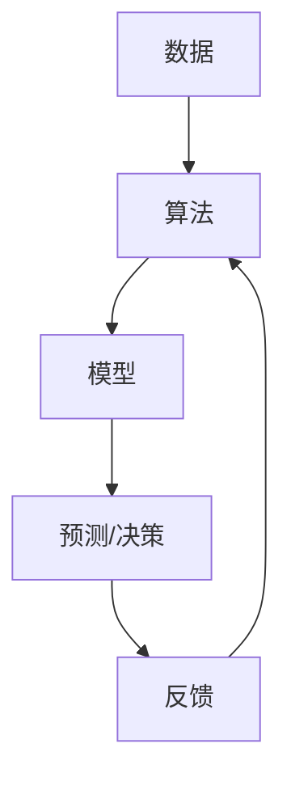

                 

在当今科技飞速发展的时代，大模型（如人工智能模型、深度学习模型等）已经成为驱动创新的重要引擎。对于创业者来说，掌握如何有效地使用大模型进行创业路演，不仅能够更好地展示自己的创新理念，还能增强投资者的信心。本文将围绕故事讲述、数据支撑和演示呈现这三个核心方面，探讨大模型时代创业者的路演技巧。

## 文章关键词
- 大模型
- 创业者
- 路演技巧
- 数据支撑
- 演示呈现

## 文章摘要
本文旨在为创业者提供在大模型时代进行路演的策略，重点关注故事讲述、数据支撑和演示呈现这三个关键环节。通过详细的分析和实例，帮助创业者更好地利用大模型的优势，向投资者展示其商业潜力和技术实力。

## 1. 背景介绍
随着人工智能技术的不断进步，大模型在各个领域得到了广泛应用，从自然语言处理到图像识别，再到推荐系统等。这些模型不仅提升了业务效率，还为创业者提供了前所未有的创新机会。然而，如何在路演中有效地展示这些机会，成为许多创业者面临的挑战。

大模型的应用场景广泛，包括但不限于以下几个方面：

1. **自然语言处理**：用于文本分析、情感识别、机器翻译等。
2. **图像识别**：用于图像分类、目标检测、人脸识别等。
3. **推荐系统**：用于个性化推荐、广告投放等。
4. **医疗健康**：用于疾病预测、诊断辅助等。

这些应用场景不仅展示了大模型的技术实力，也为创业提供了丰富的市场空间。但是，如何将这些机会有效地传达给投资者，是创业者需要解决的难题。

## 2. 核心概念与联系

为了更好地理解大模型在创业中的应用，我们首先需要了解几个核心概念：数据、算法和模型。这三个概念相互联系，共同构成了大模型的技术基础。

### 2.1 数据
数据是大模型的基石。无论是自然语言处理、图像识别还是推荐系统，都需要大量高质量的数据进行训练。这些数据可以是公开的，也可以是特定领域内的私有数据。

### 2.2 算法
算法是数据处理的核心。深度学习、强化学习、迁移学习等都是常见的算法类型。不同的算法适用于不同的场景，创业者需要根据自身业务需求选择合适的算法。

### 2.3 模型
模型是算法和数据结合的产物。通过训练，算法能够从数据中提取特征，形成可预测的模型。这些模型可以用于决策、预测、分类等任务。

下面是一个简单的 Mermaid 流程图，展示了数据、算法和模型的相互关系：



在这个流程图中，数据通过算法被转化为模型，模型用于做出预测或决策，然后通过反馈调整算法，形成一个闭环。

## 3. 核心算法原理 & 具体操作步骤

### 3.1 算法原理概述
在了解大模型的算法原理之前，我们需要了解一些基本的机器学习概念。机器学习是一种通过数据训练模型，使模型能够从数据中学习并做出预测的技术。大模型通常使用深度学习算法，如卷积神经网络（CNN）、循环神经网络（RNN）、生成对抗网络（GAN）等。

### 3.2 算法步骤详解

#### 3.2.1 数据准备
数据准备是算法训练的第一步。创业者需要收集并清洗数据，确保数据的质量和一致性。

#### 3.2.2 模型选择
根据业务需求选择合适的模型。例如，对于图像识别任务，可以选择 CNN；对于序列数据处理，可以选择 RNN。

#### 3.2.3 模型训练
使用训练数据对模型进行训练。在这个过程中，模型会不断调整参数，以最小化预测误差。

#### 3.2.4 模型评估
使用验证数据对训练好的模型进行评估，确保模型具有良好的泛化能力。

#### 3.2.5 模型部署
将训练好的模型部署到生产环境中，使其能够对外提供服务。

### 3.3 算法优缺点
大模型算法的优点包括：

- **强大的预测能力**：能够处理大量复杂的数据，并从中提取有用的信息。
- **自适应性强**：可以根据新数据不断优化模型。

然而，大模型算法也存在一些缺点：

- **计算成本高**：需要大量计算资源和时间进行训练。
- **数据依赖性强**：模型的性能很大程度上依赖于数据的质量和数量。

### 3.4 算法应用领域
大模型算法在各个领域都有广泛的应用，例如：

- **金融**：用于风险控制、信用评估、股票预测等。
- **医疗**：用于疾病预测、诊断辅助、个性化治疗等。
- **零售**：用于客户行为分析、推荐系统、库存管理等。

## 4. 数学模型和公式 & 详细讲解 & 举例说明

### 4.1 数学模型构建

在深度学习中，一个基本的数学模型通常包括以下几个组成部分：

- **输入层**：接收外部输入的数据。
- **隐藏层**：对输入数据进行处理，提取特征。
- **输出层**：生成最终预测结果。

以下是神经网络的基本数学模型：

$$
y = \sigma(\text{weight} \cdot x + \text{bias})
$$

其中，$y$ 是输出，$x$ 是输入，$\sigma$ 是激活函数（如 sigmoid、ReLU 等），$\text{weight}$ 和 $\text{bias}$ 分别是权重和偏置。

### 4.2 公式推导过程

以一个简单的单层神经网络为例，其推导过程如下：

1. **输入层到隐藏层**：

$$
h = \sigma(\text{weight} \cdot x + \text{bias})
$$

2. **隐藏层到输出层**：

$$
y = \sigma(\text{weight} \cdot h + \text{bias})
$$

### 4.3 案例分析与讲解

假设我们有一个简单的图像分类问题，输入图像为 $28 \times 28$ 的像素矩阵，我们需要将其分类为猫或狗。我们可以构建一个简单的神经网络，包括一个输入层、一个隐藏层和一个输出层。

#### 输入层：
$$
x = [x_1, x_2, ..., x_{784}]
$$

#### 隐藏层：
$$
h = \sigma(\text{weight} \cdot x + \text{bias})
$$

#### 输出层：
$$
y = \sigma(\text{weight} \cdot h + \text{bias})
$$

在这个例子中，隐藏层和输出层的激活函数都可以选择 sigmoid 函数：

$$
\sigma(z) = \frac{1}{1 + e^{-z}}
$$

通过训练，我们可以调整权重和偏置，使得输出层能够正确分类输入图像。

## 5. 项目实践：代码实例和详细解释说明

### 5.1 开发环境搭建
为了演示如何使用深度学习模型进行图像分类，我们需要搭建一个开发环境。以下是所需的环境和工具：

- Python 3.8 或更高版本
- TensorFlow 2.5 或更高版本
- Matplotlib 3.4.3 或更高版本

确保已经安装了上述工具后，我们可以开始搭建环境。

```python
pip install tensorflow==2.5
pip install matplotlib==3.4.3
```

### 5.2 源代码详细实现

以下是使用 TensorFlow 实现一个简单的图像分类器的代码：

```python
import tensorflow as tf
from tensorflow.keras import layers
import matplotlib.pyplot as plt

# 数据加载和预处理
(x_train, y_train), (x_test, y_test) = tf.keras.datasets.mnist.load_data()
x_train = x_train.reshape(-1, 28, 28).astype("float32") / 255.0
x_test = x_test.reshape(-1, 28, 28).astype("float32") / 255.0

# 构建模型
model = tf.keras.Sequential([
    layers.Conv2D(32, (3, 3), activation='relu', input_shape=(28, 28, 1)),
    layers.MaxPooling2D((2, 2)),
    layers.Flatten(),
    layers.Dense(64, activation='relu'),
    layers.Dense(10, activation='softmax')
])

# 编译模型
model.compile(optimizer='adam',
              loss='sparse_categorical_crossentropy',
              metrics=['accuracy'])

# 训练模型
model.fit(x_train, y_train, epochs=5, batch_size=64, validation_split=0.1)

# 评估模型
test_loss, test_acc = model.evaluate(x_test, y_test, verbose=2)
print('\nTest accuracy:', test_acc)

# 可视化结果
plt.figure(figsize=(10, 10))
for i in range(25):
    plt.subplot(5, 5, i+1)
    plt.xticks([])
    plt.yticks([])
    plt.grid(False)
    plt.imshow(x_test[i], cmap=plt.cm.binary)
    plt.xlabel(y_test[i])
plt.show()
```

### 5.3 代码解读与分析

上述代码首先加载了 MNIST 数据集，并将其预处理为适合模型训练的形式。然后，我们构建了一个简单的卷积神经网络，包括卷积层、池化层、全连接层等。模型使用 Adam 优化器和交叉熵损失函数进行编译。接下来，我们使用训练数据进行训练，并在测试数据上评估模型的性能。最后，我们使用 Matplotlib 将测试数据的分类结果可视化。

## 6. 实际应用场景

大模型在创业中的应用场景广泛，以下是几个典型的应用案例：

### 6.1 金融行业

在金融领域，大模型可以用于风险控制、信用评估、市场预测等。例如，某金融科技公司利用深度学习模型对客户进行信用评估，通过分析客户的消费行为、财务状况等数据，预测其还款能力，从而降低坏账率。

### 6.2 医疗健康

在医疗健康领域，大模型可以用于疾病预测、诊断辅助、个性化治疗等。例如，某医疗科技公司利用深度学习模型对患者的影像数据进行分析，预测其是否患有特定疾病，为医生提供诊断依据。

### 6.3 零售电商

在零售电商领域，大模型可以用于客户行为分析、推荐系统、库存管理等。例如，某电商平台利用深度学习模型分析客户的购买行为，为其推荐个性化的商品，提高用户满意度。

## 7. 未来应用展望

随着大模型技术的不断进步，其应用场景将更加广泛。未来，我们可能看到以下趋势：

- **更高效的数据处理**：大模型将能够处理更大量、更复杂的数据，提高业务决策的准确性。
- **更智能的自动化**：大模型将实现更高水平的自动化，从数据采集到决策执行，全面提高业务效率。
- **更个性化的服务**：大模型将能够更好地理解客户需求，提供个性化的产品和服务。

然而，大模型技术的发展也面临一些挑战，如数据隐私、算法透明性、伦理问题等。创业者需要密切关注这些挑战，确保其技术在合规、透明和道德的框架内发展。

## 8. 工具和资源推荐

### 8.1 学习资源推荐

- **《深度学习》（Goodfellow et al.）**：这是一本深度学习领域的经典教材，适合初学者和进阶者。
- **TensorFlow 官方文档**： TensorFlow 是一个强大的深度学习框架，其官方文档提供了丰富的学习资源。

### 8.2 开发工具推荐

- **Google Colab**：Google Colab 是一个免费的 Jupyter Notebook 环境，非常适合深度学习实验。
- **AWS S3**：AWS S3 是一个可靠的云存储服务，适合存储和处理大量数据。

### 8.3 相关论文推荐

- **“Deep Learning: A Methodology Overview”**：该论文对深度学习的基本概念和应用进行了全面的概述。
- **“Generative Adversarial Networks”**：该论文提出了生成对抗网络（GAN）的概念，对深度学习领域产生了深远影响。

## 9. 总结：未来发展趋势与挑战

大模型时代为创业者带来了前所未有的机遇。通过有效利用大模型技术，创业者可以更好地理解市场趋势、优化业务流程、提升客户体验。然而，随着技术的发展，创业者也面临着数据隐私、算法透明性等挑战。只有紧跟技术潮流，不断创新，才能在激烈的市场竞争中脱颖而出。

### 附录：常见问题与解答

**Q1：大模型训练需要多少计算资源？**

A1：大模型训练通常需要大量的计算资源，包括高性能 CPU、GPU 或 TPU。具体资源需求取决于模型大小、训练数据量和训练时间。

**Q2：大模型如何保证数据隐私？**

A2：大模型在训练过程中需要处理大量数据，保障数据隐私至关重要。创业者可以使用数据加密、差分隐私等技术来保护数据隐私。

**Q3：如何评估大模型的性能？**

A3：评估大模型性能通常包括准确率、召回率、F1 分数等指标。创业者可以通过交叉验证、A/B 测试等方法评估模型性能。

## 作者署名
作者：禅与计算机程序设计艺术 / Zen and the Art of Computer Programming
----------------------------------------------------------------

以上就是本文的完整内容，希望对创业者们在大模型时代的创业路演有所帮助。在未来的道路上，让我们继续探索技术的无限可能，共创美好未来。

