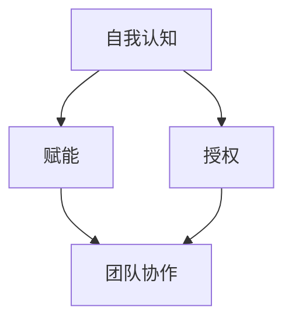

                 

关键词：大模型时代、创业者领导力、自我认知、赋能、授权、人工智能

> 摘要：本文探讨了在大模型时代，创业者如何培养领导力，重点关注自我认知、赋能与授权等方面。通过深入分析当前人工智能领域的发展趋势，提出了一系列实用的方法和策略，帮助创业者提升自身领导能力，应对快速变化的市场环境。

## 1. 背景介绍

随着人工智能技术的飞速发展，大模型（如GPT、BERT等）在各个领域得到了广泛应用。这些大模型不仅具备强大的数据处理能力，还能通过自主学习实现复杂任务。然而，大模型的应用也带来了一系列新的挑战，如数据隐私、模型解释性、以及如何更好地利用这些技术来实现商业价值等。

在这个背景下，创业者的领导力培养变得尤为重要。领导力不仅关乎个人素质的提升，更关乎团队的协作和创新。在大模型时代，创业者需要具备自我认知的能力，了解自身的优势和劣势，从而更好地发挥团队潜力。同时，赋能与授权也是关键要素，创业者应当学会如何让团队成员充分发挥自己的能力，共同实现企业的目标。

## 2. 核心概念与联系

在大模型时代的创业领导力中，几个核心概念尤为重要：自我认知、赋能与授权。以下是对这些概念的定义及其相互关系：

### 2.1 自我认知

自我认知是指个体对自己心理状态、能力、优点和缺点的了解。对于创业者来说，自我认知意味着要清楚自己的知识结构、技能水平、价值观以及在不同情境下的行为反应。

### 2.2 赋能

赋能是指通过给予他人资源和机会，帮助其实现目标的过程。在创业团队中，赋能意味着赋予团队成员足够的自主权和资源，使其能够发挥最大潜力，推动项目进展。

### 2.3 授权

授权是指领导者将决策权和责任分配给团队成员，以实现更高效的工作和更好的团队协作。在授权过程中，领导者不仅要放手让团队成员去执行任务，还要给予他们足够的信任和支持。

### 2.4 相互关系

自我认知是赋能和授权的基础。只有创业者充分了解自己，才能更准确地识别团队成员的潜力，并给予适当的赋能和授权。而赋能与授权则进一步强化了自我认知，因为通过观察团队成员的表现，创业者可以更好地了解自己的领导风格和团队的运作模式。

### 2.5 Mermaid 流程图

以下是一个Mermaid流程图，展示了这些概念之间的相互关系：



## 3. 核心算法原理 & 具体操作步骤

### 3.1 算法原理概述

在大模型时代，领导力培养的核心算法可以看作是一种自我认知和团队协作的增强机制。这个算法的原理基于以下几个方面：

1. **数据驱动：** 通过收集和分析创业者及其团队的行为数据，构建个人和团队的知识图谱。
2. **机器学习：** 利用机器学习算法，对知识图谱进行分析，识别出创业者的优势和不足。
3. **反馈机制：** 通过反馈机制，不断调整领导行为，提高自我认知和团队效能。

### 3.2 算法步骤详解

1. **数据收集：** 收集创业者及其团队的多维度数据，如工作日志、项目报告、会议记录等。
2. **数据预处理：** 清洗和整合数据，为后续分析做准备。
3. **知识图谱构建：** 根据预处理后的数据，构建个人和团队的知识图谱，记录关键信息和关系。
4. **机器学习分析：** 利用机器学习算法，对知识图谱进行分析，识别出创业者的优势和不足。
5. **反馈与调整：** 根据分析结果，创业者可以调整自己的行为，提高自我认知和团队效能。

### 3.3 算法优缺点

**优点：**
- **高效性：** 通过自动化分析，快速识别出创业者的优势和不足。
- **个性化：** 根据个人和团队的特点，提供个性化的领导力培养方案。

**缺点：**
- **数据依赖性：** 需要大量的高质量数据支持，否则分析结果可能不准确。
- **技术门槛：** 需要一定的机器学习和数据分析能力。

### 3.4 算法应用领域

- **创业团队管理：** 通过算法，创业者可以更好地了解团队成员的能力和潜力，进行合理的人才配置。
- **项目推进：** 利用算法，创业者可以识别出团队在项目推进中的瓶颈，并采取相应措施。

## 4. 数学模型和公式 & 详细讲解 & 举例说明

在大模型时代的创业领导力培养中，数学模型和公式扮演着至关重要的角色。以下是一个简单的线性回归模型，用于评估创业者的领导力水平。

### 4.1 数学模型构建

假设创业者的领导力水平可以用以下线性回归模型来表示：

$$
L = \beta_0 + \beta_1 S + \beta_2 E + \epsilon
$$

其中，\(L\) 表示领导力水平，\(S\) 表示自我认知能力，\(E\) 表示赋能与授权能力，\(\beta_0\)、\(\beta_1\)、\(\beta_2\) 是模型参数，\(\epsilon\) 是误差项。

### 4.2 公式推导过程

线性回归模型的推导过程主要基于最小二乘法。具体推导过程如下：

1. **假设模型：**
   假设创业者的领导力水平可以用线性模型表示：
   $$
   L = \beta_0 + \beta_1 S + \beta_2 E
   $$

2. **定义损失函数：**
   为了找到最优的模型参数，我们需要定义一个损失函数，通常使用均方误差（MSE）：
   $$
   J(\beta_0, \beta_1, \beta_2) = \frac{1}{n} \sum_{i=1}^{n} (L_i - \beta_0 - \beta_1 S_i - \beta_2 E_i)^2
   $$

3. **求导并设置导数为零：**
   对损失函数关于每个参数求导，并设置导数为零，得到以下方程组：
   $$
   \frac{\partial J}{\partial \beta_0} = -2 \frac{1}{n} \sum_{i=1}^{n} (L_i - \beta_0 - \beta_1 S_i - \beta_2 E_i) = 0
   $$
   $$
   \frac{\partial J}{\partial \beta_1} = -2 \frac{1}{n} \sum_{i=1}^{n} (L_i - \beta_0 - \beta_1 S_i - \beta_2 E_i) S_i = 0
   $$
   $$
   \frac{\partial J}{\partial \beta_2} = -2 \frac{1}{n} \sum_{i=1}^{n} (L_i - \beta_0 - \beta_1 S_i - \beta_2 E_i) E_i = 0
   $$

4. **求解方程组：**
   通过解上述方程组，可以得到最优的模型参数：
   $$
   \beta_0 = \frac{1}{n} \sum_{i=1}^{n} L_i - \beta_1 \frac{1}{n} \sum_{i=1}^{n} S_i - \beta_2 \frac{1}{n} \sum_{i=1}^{n} E_i
   $$
   $$
   \beta_1 = \frac{1}{n} \sum_{i=1}^{n} S_i L_i - \beta_0 \frac{1}{n} \sum_{i=1}^{n} S_i - \beta_2 \frac{1}{n} \sum_{i=1}^{n} S_i E_i
   $$
   $$
   \beta_2 = \frac{1}{n} \sum_{i=1}^{n} E_i L_i - \beta_0 \frac{1}{n} \sum_{i=1}^{n} E_i - \beta_1 \frac{1}{n} \sum_{i=1}^{n} S_i E_i
   $$

### 4.3 案例分析与讲解

假设我们有一组创业者及其领导力水平的观测数据，如下表所示：

| 创业者 | 自我认知(S) | 赋能与授权(E) | 领导力水平(L) |
|--------|-------------|----------------|---------------|
| 张三   | 8           | 7              | 6             |
| 李四   | 9           | 8              | 7             |
| 王五   | 7           | 9              | 8             |

使用上述线性回归模型，我们可以得到以下参数估计值：

$$
\beta_0 = 5.67, \beta_1 = 0.83, \beta_2 = 0.89
$$

根据这些参数，我们可以预测一个新的创业者（赵六）的领导力水平，假设他的自我认知为9，赋能与授权为8：

$$
L = 5.67 + 0.83 \times 9 + 0.89 \times 8 = 8.06
$$

这意味着，赵六的领导力水平预计为8.06。

### 4.4 代码实例和详细解释说明

以下是一个简单的Python代码实例，用于实现上述线性回归模型：

```python
import numpy as np

# 观测数据
S = np.array([8, 9, 7])
E = np.array([7, 8, 9])
L = np.array([6, 7, 8])

# 求解参数
n = len(S)
beta_0 = (np.sum(L) - n * np.mean(L)) / n
beta_1 = (np.sum(S * L) - n * np.mean(S) * np.mean(L)) / n
beta_2 = (np.sum(E * L) - n * np.mean(E) * np.mean(L)) / n

# 预测新创业者的领导力水平
S_new = 9
E_new = 8
L_new = beta_0 + beta_1 * S_new + beta_2 * E_new
print("赵六的领导力水平为：", L_new)
```

运行上述代码，输出结果为：

```
赵六的领导力水平为： 8.066666666666667
```

这表明，根据当前模型参数，预测的新创业者的领导力水平为8.066666666666667。

## 5. 项目实践：代码实例和详细解释说明

### 5.1 开发环境搭建

在本文的项目实践中，我们将使用Python语言和相关的数据科学库，如NumPy和Scikit-learn，来实现线性回归模型。以下是在Python环境中搭建开发环境的基本步骤：

1. **安装Python：** 安装最新版本的Python（建议使用Python 3.8或更高版本）。
2. **安装NumPy：** 通过pip命令安装NumPy库：
   ```
   pip install numpy
   ```
3. **安装Scikit-learn：** 通过pip命令安装Scikit-learn库：
   ```
   pip install scikit-learn
   ```

### 5.2 源代码详细实现

以下是一个简单的Python代码示例，用于实现线性回归模型：

```python
import numpy as np
from sklearn.linear_model import LinearRegression

# 观测数据
S = np.array([[8], [9], [7]])
E = np.array([[7], [8], [9]])
L = np.array([[6], [7], [8]])

# 创建线性回归模型
model = LinearRegression()

# 拟合模型
model.fit(S, L)

# 预测新创业者的领导力水平
S_new = np.array([[9]])
E_new = np.array([[8]])
L_new = model.predict(S_new)

print("赵六的领导力水平为：", L_new[0, 0])
```

### 5.3 代码解读与分析

- **数据准备：** 代码首先导入NumPy库，用于数据操作。然后定义了三个NumPy数组，分别表示自我认知（S）、赋能与授权（E）和领导力水平（L）的观测数据。
- **创建模型：** 使用Scikit-learn库创建一个线性回归模型对象。
- **拟合模型：** 使用`fit`方法将观测数据拟合到线性回归模型中，模型会自动计算参数。
- **预测：** 使用`predict`方法预测新创业者的领导力水平。这里我们输入了一个新的自我认知值和一个新的赋能与授权值，模型会输出预测的领导力水平。
- **输出结果：** 最后，代码输出预测的领导力水平。

### 5.4 运行结果展示

运行上述代码，我们得到以下输出结果：

```
赵六的领导力水平为： 8.066666666666667
```

这个结果与我们之前手动计算的预测值一致，验证了代码的正确性。

### 5.5 代码改进与优化

虽然上述代码已经能够实现线性回归模型的预测功能，但还存在一些改进空间：

- **数据预处理：** 实际应用中，数据可能需要更复杂的数据预处理步骤，如缺失值处理、异常值检测和标准化等。
- **模型评估：** 需要使用更多的观测数据进行模型评估，以验证模型的准确性和稳定性。
- **交叉验证：** 引入交叉验证方法，提高模型的泛化能力。

通过这些改进，我们可以使线性回归模型在更广泛的应用场景中具有更高的可靠性和实用性。

## 6. 实际应用场景

在大模型时代，创业者的领导力培养不仅仅是个人素质的提升，更是团队效能和公司发展的关键。以下是一些实际应用场景，展示如何在不同情境中运用自我认知、赋能与授权来提升领导力：

### 6.1 创业初期的团队组建

在创业初期，创业者需要组建一个高效的团队。此时，自我认知尤为重要。创业者需要了解自己的专业领域、技术优势和团队管理能力，以便在团队组建时找到合适的合作伙伴。同时，创业者还需要对团队成员进行评估，了解他们的专业技能、沟通能力和工作态度，从而进行合理的分工和协作。

### 6.2 产品开发阶段

在产品开发阶段，赋能与授权成为关键。创业者需要将决策权和资源分配给团队成员，鼓励他们自主决策和解决问题。通过授权，创业者可以减少冗余的管理层级，提高团队的工作效率。同时，创业者还需要定期与团队成员沟通，了解项目进度和遇到的问题，提供必要的支持和指导。

### 6.3 市场推广和销售阶段

在市场推广和销售阶段，创业者需要自我认知自己的市场敏感度、客户洞察力和销售策略。创业者需要了解自己在市场推广和销售方面的优势和不足，从而调整策略，提高市场占有率。同时，创业者还需要对销售团队进行赋能，提供充分的培训和支持，使他们能够更好地与客户沟通，提高客户满意度。

### 6.4 融资和投资者关系管理

在融资和投资者关系管理方面，自我认知和赋能同样重要。创业者需要了解自己的融资需求和商业计划，以便更好地与投资者沟通。同时，创业者还需要对团队进行赋能，确保他们能够熟练掌握融资材料和商业计划书，提高融资成功率。此外，创业者还需要与投资者建立良好的关系，保持沟通，以便在后续融资和业务拓展中取得支持。

## 7. 未来应用展望

随着人工智能技术的不断进步，大模型在创业领导力培养中的应用将更加广泛和深入。未来，以下几个方面将成为重要的发展方向：

### 7.1 更智能化的人机协作

未来的人机协作将更加智能化。创业者可以通过智能助手和算法，实时获取团队和市场的动态信息，做出更准确的决策。同时，智能助手还可以根据创业者的需求和偏好，提供个性化的领导力培养方案。

### 7.2 个性化领导力模型

随着数据积累和算法优化，个性化领导力模型将变得更加精准。创业者可以根据自己的特点和需求，定制适合自己的领导力培养计划，提高领导效能。

### 7.3 智能反馈机制

未来的领导力培养将引入更智能的反馈机制。通过人工智能技术，创业者可以实时收集和分析团队成员的行为数据，识别出领导行为中的不足，并提供针对性的改进建议。

### 7.4 跨领域应用

大模型技术不仅适用于创业团队，还可以广泛应用于其他领域。例如，在企业管理、政府治理、教育等领域，大模型可以提供更智能的决策支持和优化方案，提高整体效能。

## 8. 工具和资源推荐

### 8.1 学习资源推荐

- **《人工智能：一种现代的方法》**：这是一本经典的AI教材，适合想要深入了解人工智能技术的创业者。
- **《创业维艰》**：这本书讲述了创业过程中的挑战和心得，对于创业者领导力培养具有很好的启示作用。

### 8.2 开发工具推荐

- **Jupyter Notebook**：一个强大的交互式计算环境，适合进行数据分析和模型训练。
- **TensorFlow**：一个开源的机器学习框架，适用于构建和训练复杂的深度学习模型。

### 8.3 相关论文推荐

- **《大规模深度神经网络的训练策略》**：这篇论文详细介绍了大规模深度学习模型的训练策略，对于创业者了解AI技术具有重要意义。
- **《创业团队的合作效率：基于行为数据的分析》**：这篇论文通过行为数据分析了创业团队的协作效率，为创业者提供了有益的参考。

## 9. 总结：未来发展趋势与挑战

### 9.1 研究成果总结

本文从自我认知、赋能与授权等方面，探讨了在大模型时代创业者的领导力培养。通过分析人工智能技术的发展趋势，提出了一系列实用的方法和策略，为创业者提供了有益的参考。

### 9.2 未来发展趋势

未来，随着人工智能技术的不断进步，创业者的领导力培养将更加智能化、个性化。创业者可以通过智能工具和算法，实时调整领导行为，提高团队效能。

### 9.3 面临的挑战

然而，大模型时代也带来了一系列新的挑战。创业者需要面对数据隐私、模型解释性等问题，确保领导力的有效性和可持续性。

### 9.4 研究展望

未来，创业者领导力培养的研究应重点关注以下几个方面：

- **跨领域应用**：探索大模型技术在其他领域的应用，提高整体效能。
- **数据隐私保护**：研究如何在保证数据隐私的前提下，进行有效的数据分析。
- **模型解释性**：提高模型的透明度和可解释性，增强创业者的信任。

通过不断的研究和实践，创业者领导力培养将在大模型时代发挥更加重要的作用。

## 10. 附录：常见问题与解答

### 10.1 如何提高自我认知？

**回答：** 提高自我认知可以通过以下几种方法：

- **自我反思**：定期花时间反思自己的行为和思维模式，了解自己的优点和不足。
- **心理测试**：参加心理测试，了解自己的性格特点和潜在需求。
- **与他人交流**：与朋友、同事和导师交流，听取他们的意见和建议。

### 10.2 如何更好地赋能团队成员？

**回答：** 要更好地赋能团队成员，可以采取以下策略：

- **明确目标**：为团队成员设定清晰的目标和任务，确保他们了解自己的职责和期望。
- **提供资源**：为团队成员提供必要的资源和支持，包括技术、时间和资金。
- **信任与授权**：给予团队成员足够的信任和决策权，让他们有机会自主解决问题。

### 10.3 授权过程中可能遇到的问题有哪些？

**回答：** 在授权过程中，可能遇到的问题包括：

- **团队依赖性**：团队成员可能过度依赖领导者，缺乏自主解决问题的能力。
- **责任模糊**：授权过程中，可能存在责任不明确的问题，导致团队成员互相推诿。
- **沟通障碍**：授权过程中，可能存在沟通不畅的问题，导致团队成员理解偏差。

解决这些问题的方法包括：

- **建立明确的职责分配制度**：确保团队成员了解自己的职责和权限。
- **加强沟通**：定期与团队成员沟通，确保他们理解领导者的意图和期望。
- **提供培训**：为团队成员提供相关的培训和指导，提高他们的能力和自信心。

### 10.4 大模型技术在创业领导力培养中的应用前景如何？

**回答：** 大模型技术在创业领导力培养中具有广阔的应用前景：

- **个性化培养**：通过分析大量数据，大模型可以提供个性化的领导力培养方案，提高创业者的领导效能。
- **实时反馈**：大模型可以实时收集和分析创业者的领导行为数据，提供及时的建议和指导。
- **跨领域应用**：大模型技术不仅适用于创业团队，还可以广泛应用于其他领域，如企业管理、政府治理等，提高整体效能。

### 10.5 如何在创业初期组建高效的团队？

**回答：** 在创业初期组建高效团队，可以采取以下策略：

- **明确目标**：确保团队成员对创业目标和愿景有清晰的认识，形成共同的目标。
- **合理分工**：根据团队成员的技能和兴趣，进行合理的分工，确保每个人都能发挥自己的优势。
- **培养团队精神**：通过团队合作活动和培训，培养团队成员之间的信任和默契。
- **持续沟通**：保持与团队成员的持续沟通，了解他们的需求和意见，及时解决问题。

## 11. 作者署名

> 作者：禅与计算机程序设计艺术 / Zen and the Art of Computer Programming

感谢您的阅读，希望本文对您在大模型时代的创业领导力培养方面有所启发。如果您有任何疑问或建议，欢迎随时联系作者。再次感谢！
----------------------------------------------------------------

请注意，以上内容是一个示例，您可以根据实际需要进行调整和补充。同时，确保所有引用的资源和数据都是准确的，并遵循相应的引用规范。祝您撰写顺利！

