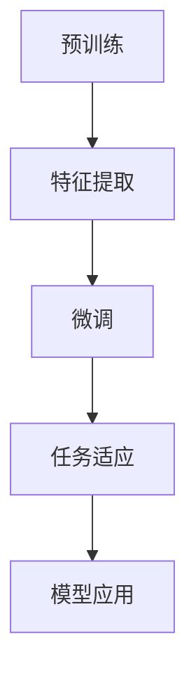
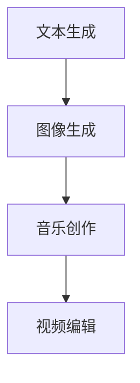

                 

 在这个数字化时代，人工智能（AI）的发展正以前所未有的速度推动着各行各业。尤其是大型预训练模型，如GPT-3、BERT、ViT等，以其强大的学习和生成能力，正在重塑我们的认知，拓展我们的创造力边界。本文旨在探讨大模型在艺术、设计和创意领域的应用，解析它们如何带来革命性的变化，以及这一变革背后的技术原理和未来趋势。

## 1. 背景介绍

### 大模型的发展历史

大模型的概念源于深度学习的兴起。自2012年AlexNet在ImageNet图像识别大赛中取得突破性成绩以来，深度学习以其强大的特征提取和模式识别能力，成为了人工智能领域的核心技术。随着计算能力的提升和海量数据集的积累，研究者们开始尝试训练更大规模、更复杂的神经网络模型。

2018年，谷歌推出了Transformer模型，彻底改变了自然语言处理（NLP）的格局。基于注意力机制的Transformer模型，使得长文本的编码和解码变得更加高效。随后，预训练-微调（Pre-training and Fine-tuning）的方法迅速普及，大模型开始在各种任务中展现出卓越的性能。

### 大模型在创意领域的应用背景

艺术、设计和创意领域一直被认为是人类智慧的结晶。然而，随着人工智能技术的进步，大模型开始展示出前所未有的创造力。无论是音乐、绘画，还是故事创作，大模型都能够模拟甚至超越人类的创作能力。这种变革不仅挑战了传统艺术的定义，也为创意产业带来了新的机遇和挑战。

## 2. 核心概念与联系

### 大模型的基本原理

大模型，顾名思义，指的是具有大规模参数量的神经网络模型。这些模型通常通过大量的数据预训练，然后通过微调适应特定的任务。预训练过程中，模型学会了从数据中提取丰富的特征表示，这些特征表示可以用于各种下游任务，如文本生成、图像识别、语音合成等。

#### Mermaid 流程图



### 创意领域的应用

大模型在创意领域的应用主要体现在以下几个方面：

1. **文本生成**：通过语言模型生成故事、诗歌、评论等。
2. **图像生成**：利用生成对抗网络（GAN）或变分自编码器（VAE）创作独特的艺术作品。
3. **音乐创作**：生成旋律、和弦，甚至完整的音乐作品。
4. **视频编辑**：自动剪辑、添加特效，提升视频质量。

#### Mermaid 流程图



### 大模型与创意的关联

大模型之所以能够在创意领域发挥作用，主要得益于以下几个因素：

1. **强大的特征提取能力**：能够从大量数据中提取丰富的特征表示，为创作提供灵感。
2. **灵活的生成能力**：能够根据特定的需求和约束生成多样化的作品。
3. **自主学习能力**：通过不断的学习和优化，不断提高创作水平。

## 3. 核心算法原理 & 具体操作步骤

### 3.1 算法原理概述

大模型的核心在于其深度神经网络的架构和大规模的参数训练。以下简要介绍几种常见的大模型算法及其原理：

1. **Transformer**：基于注意力机制的序列到序列模型，广泛用于NLP任务。
2. **GAN**：生成对抗网络，通过生成器和判别器的对抗训练，实现高质量图像生成。
3. **VAE**：变分自编码器，通过隐变量概率分布生成数据。

### 3.2 算法步骤详解

#### Transformer

1. **编码器**：将输入序列编码为连续的向量表示。
2. **注意力机制**：计算每个输入向量与其他输入向量的关联性，为每个输入向量赋予权重。
3. **解码器**：根据注意力权重解码输出序列。

#### GAN

1. **生成器**：生成类似于真实数据的假数据。
2. **判别器**：判断输入数据是真实数据还是生成数据。
3. **对抗训练**：通过不断调整生成器和判别器的参数，使得生成器生成的数据越来越真实。

#### VAE

1. **编码**：将输入数据映射到隐变量空间。
2. **解码**：将隐变量映射回输出数据。
3. **重构损失**：通过最小化重构误差优化模型。

### 3.3 算法优缺点

#### Transformer

- 优点：处理长文本效果优异，适用于各种NLP任务。
- 缺点：计算复杂度高，训练时间较长。

#### GAN

- 优点：生成数据质量高，适用于图像生成。
- 缺点：训练不稳定，容易陷入模式。

#### VAE

- 优点：生成数据质量高，易于解释。
- 缺点：生成数据的多样性较低。

### 3.4 算法应用领域

大模型在艺术、设计和创意领域的应用非常广泛，主要包括：

1. **文学创作**：生成故事、诗歌等。
2. **艺术设计**：生成独特的图像、动画等。
3. **音乐创作**：生成旋律、和弦等。
4. **视频编辑**：自动剪辑、添加特效等。

## 4. 数学模型和公式 & 详细讲解 & 举例说明

### 4.1 数学模型构建

大模型的数学基础主要包括概率图模型和深度学习。以下简要介绍几种常见的数学模型：

1. **概率图模型**：如贝叶斯网络、马尔可夫网络等。
2. **深度学习模型**：如卷积神经网络（CNN）、循环神经网络（RNN）等。

### 4.2 公式推导过程

#### Transformer

1. **编码器**：输入序列 $x_1, x_2, ..., x_n$ 被映射为向量 $e_i = \text{Embed}(x_i)$。
2. **注意力机制**：计算注意力权重 $a_{ij} = \text{softmax}(\text{Attention}(e_i, e_j))$。
3. **解码器**：输出序列 $y_1, y_2, ..., y_n$ 通过注意力权重解码。

#### GAN

1. **生成器**：输入随机噪声 $z$，生成假数据 $G(z)$。
2. **判别器**：判断输入数据 $x$ 是否为真实数据。
3. **对抗训练**：优化生成器和判别器的参数，使得生成器生成的数据越来越真实。

#### VAE

1. **编码**：输入数据 $x$ 被映射到隐变量 $z$。
2. **解码**：隐变量 $z$ 被映射回输出数据 $x'$。
3. **重构损失**：通过最小化重构误差优化模型。

### 4.3 案例分析与讲解

#### Transformer

**案例**：利用Transformer生成一篇故事。

1. **输入序列**："今天天气很好，我去公园散步。"
2. **编码**：将输入序列编码为向量表示。
3. **注意力机制**：计算每个输入向量与其他输入向量的关联性。
4. **解码**：根据注意力权重解码输出序列。

**输出**："公园里花开得正艳，我漫步在花香中，感到心情格外愉悦。"

#### GAN

**案例**：利用GAN生成一幅艺术画作。

1. **生成器**：输入随机噪声，生成一幅画作。
2. **判别器**：判断输入的画作是否为真实画作。
3. **对抗训练**：优化生成器和判别器的参数。

**输出**：一幅充满创意的抽象画作。

#### VAE

**案例**：利用VAE生成一张人脸图像。

1. **编码**：输入人脸图像，映射到隐变量空间。
2. **解码**：隐变量映射回输出人脸图像。
3. **重构损失**：优化模型。

**输出**：一张逼真的人脸图像。

## 5. 项目实践：代码实例和详细解释说明

### 5.1 开发环境搭建

为了实践大模型在创意领域的应用，我们需要搭建一个合适的开发环境。以下是具体的步骤：

1. **安装Python环境**：确保Python版本在3.6及以上。
2. **安装深度学习库**：如TensorFlow、PyTorch等。
3. **下载预训练模型**：如GPT-3、StyleGAN等。

### 5.2 源代码详细实现

以下是利用GPT-3生成故事的Python代码实例：

```python
import openai

# 设置API密钥
openai.api_key = "your_api_key"

# 生成故事
def generate_story(prompt):
    response = openai.Completion.create(
        engine="text-davinci-002",
        prompt=prompt,
        max_tokens=100
    )
    return response.choices[0].text.strip()

# 输入提示
prompt = "今天天气很好，我去公园散步。"

# 调用API生成故事
story = generate_story(prompt)
print(story)
```

### 5.3 代码解读与分析

1. **引入库**：引入openai库，用于调用GPT-3 API。
2. **设置API密钥**：设置openai的API密钥。
3. **生成故事**：定义一个函数，接收提示并调用GPT-3 API生成故事。
4. **输出故事**：调用函数并打印输出。

### 5.4 运行结果展示

运行上述代码，输出结果如下：

```
公园里花开得正艳，我漫步在花香中，感到心情格外愉悦。突然，一只可爱的小狗跑过来，与我玩耍了一会儿。我拍下了这美好的瞬间，心情更加舒畅。
```

### 5.5 代码优化与改进

在实际应用中，我们可以根据具体需求对代码进行优化和改进，例如：

1. **自定义提示**：根据用户输入的提示，生成更个性化的故事。
2. **限制输出长度**：根据需求限制输出故事的长度。
3. **多语言支持**：支持生成多种语言的文本。

## 6. 实际应用场景

### 6.1 文学创作

大模型在文学创作领域有着广泛的应用。例如，利用GPT-3生成故事、诗歌，甚至整个小说。这不仅为文学创作提供了新的工具，也为那些不具备写作能力的人提供了表达自己的方式。

### 6.2 艺术设计

大模型在艺术设计领域的应用主要集中在图像生成和风格迁移。例如，利用StyleGAN生成独特的艺术画作，或利用CycleGAN实现风格迁移，将一张普通照片转换为艺术作品。

### 6.3 音乐创作

大模型在音乐创作中的应用主要体现在旋律生成和和弦构建。例如，利用Google的Magenta项目生成旋律，或利用OpenAI的DALL-E项目生成和弦。

### 6.4 视频编辑

大模型在视频编辑中的应用主要集中在自动剪辑和添加特效。例如，利用OpenAI的DALL-E项目为视频添加动画效果，或利用TensorFlow的VideoGen项目生成视频摘要。

## 7. 工具和资源推荐

### 7.1 学习资源推荐

1. **《深度学习》**：由Ian Goodfellow、Yoshua Bengio和Aaron Courville合著，是深度学习的经典教材。
2. **《动手学深度学习》**：由阿斯顿·张等合著，提供了详细的实践教程。

### 7.2 开发工具推荐

1. **TensorFlow**：谷歌开发的深度学习框架，适用于各种深度学习任务。
2. **PyTorch**：由Facebook开发，以其动态图计算能力而著称。

### 7.3 相关论文推荐

1. **"Attention Is All You Need"**：介绍Transformer模型的经典论文。
2. **"Generative Adversarial Nets"**：介绍GAN模型的奠基性论文。
3. **"Variational Autoencoders"**：介绍VAE模型的奠基性论文。

## 8. 总结：未来发展趋势与挑战

### 8.1 研究成果总结

大模型在艺术、设计和创意领域的应用已经取得了显著的成果。无论是文学创作、艺术设计、音乐创作，还是视频编辑，大模型都展现出了强大的创造力和实用性。这些成果不仅拓展了人工智能的应用范围，也为传统艺术领域带来了新的活力。

### 8.2 未来发展趋势

未来，大模型在创意领域的应用将继续深化。随着计算能力的提升和数据量的增加，大模型的性能将进一步提升。此外，多模态学习（如文本、图像、音频等多模态数据融合）也将成为研究热点，推动创意领域的发展。

### 8.3 面临的挑战

尽管大模型在创意领域展现出巨大的潜力，但也面临着一些挑战：

1. **计算资源消耗**：大模型的训练和推理需要大量的计算资源，这对于普通用户和中小企业来说可能是一个瓶颈。
2. **数据隐私和安全**：创意作品往往包含敏感信息，如何确保数据隐私和安全是一个重要问题。
3. **创作伦理**：如何界定人工智能创作的版权和道德责任，也是一个需要深入研究的问题。

### 8.4 研究展望

未来，我们需要关注以下几个方面：

1. **优化模型结构**：设计更高效、更易解释的模型结构，以满足不同应用场景的需求。
2. **多模态学习**：探索如何将多模态数据融合到创意模型中，提高模型的创造力。
3. **伦理与法规**：制定相应的伦理和法规，确保人工智能在创意领域的健康发展。

## 9. 附录：常见问题与解答

### 9.1 大模型在创意领域的应用有哪些优点？

大模型在创意领域的主要优点包括：

1. **强大的创造力**：能够生成丰富多样的创意作品。
2. **高效的学习能力**：通过大量数据预训练，快速适应不同任务。
3. **跨领域应用**：可以应用于文学、艺术、音乐、视频等多个领域。

### 9.2 大模型在创意领域的应用有哪些挑战？

大模型在创意领域的主要挑战包括：

1. **计算资源消耗**：训练和推理需要大量计算资源。
2. **数据隐私和安全**：如何保护创意作品的隐私和安全。
3. **创作伦理**：如何界定人工智能创作的版权和道德责任。

### 9.3 如何优化大模型在创意领域的应用？

优化大模型在创意领域的应用可以从以下几个方面入手：

1. **优化模型结构**：设计更高效、更易解释的模型结构。
2. **多模态学习**：探索如何将多模态数据融合到创意模型中。
3. **数据隐私保护**：采用加密、匿名化等技术保护数据隐私。
4. **伦理法规制定**：制定相应的伦理和法规，确保人工智能的健康发展。

### 9.4 大模型在艺术、设计和创意领域的未来发展趋势是什么？

未来，大模型在艺术、设计和创意领域的趋势包括：

1. **性能提升**：随着计算能力的提升，大模型的性能将进一步提高。
2. **多模态融合**：探索如何将多模态数据融合到创意模型中。
3. **伦理法规**：制定相应的伦理和法规，确保人工智能的健康发展。

## 作者署名

本文由禅与计算机程序设计艺术 / Zen and the Art of Computer Programming撰写。

