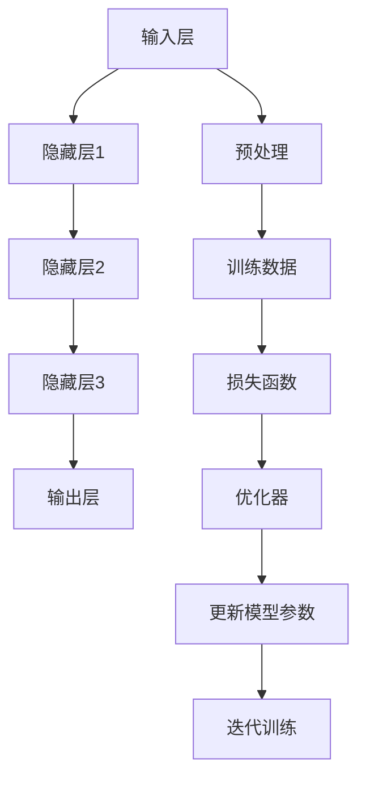

                 

关键词：大模型，技术创新，市场需求，AI，算法，数学模型，项目实践，未来展望

## 摘要

本文将探讨大模型技术在人工智能领域的技术创新及其市场需求。首先，我们将回顾大模型的发展历程和现状，然后深入分析其核心算法原理、数学模型构建及应用领域。随后，通过项目实践展示大模型的实际应用，并讨论其未来发展前景和面临的挑战。最后，我们将推荐相关学习资源和开发工具，并总结研究趋势和展望未来。

## 1. 背景介绍

### 大模型的发展历程

大模型（Large-scale Models）指的是参数数量巨大、能够处理大规模数据的机器学习模型。自20世纪50年代以来，机器学习经历了多个发展阶段。早期的符号主义方法依赖专家知识手动设计规则，效果有限。随后，基于统计学习的神经网络方法逐渐成为主流，但受限于计算资源和数据规模。随着硬件性能的提升和互联网数据的爆发增长，大模型应运而生。

近年来，深度学习技术的进步使得大模型得以快速发展。特别是2012年，AlexNet在ImageNet图像识别挑战赛中取得突破性成绩，标志着深度学习时代的到来。此后，随着GPU等硬件的普及，研究人员开始构建具有数十亿甚至千亿参数的模型，如GPT、BERT等。

### 大模型在人工智能领域的现状

大模型已经成为人工智能领域的核心工具，广泛应用于自然语言处理、计算机视觉、语音识别等领域。在自然语言处理领域，大模型如GPT-3、Turing等实现了前所未有的语言理解和生成能力；在计算机视觉领域，模型如ResNet、Inception等推动了图像识别和图像生成技术的发展；在语音识别领域，大模型如WaveNet、Transformer等显著提升了语音识别的准确性。

### 市场需求分析

随着人工智能技术的不断进步，各行各业对大模型的需求日益增长。以下是一些主要的市场需求：

- **企业级应用**：企业希望通过大模型实现自动化、智能化，提高运营效率和用户体验。
- **科学研究**：研究人员利用大模型进行数据挖掘、模式识别、知识图谱构建等，推动科学发现和技术创新。
- **教育和培训**：在线教育平台利用大模型提供个性化的学习建议和教学反馈。
- **娱乐和游戏**：虚拟助手、智能客服等应用场景推动了大模型在娱乐和游戏领域的发展。

## 2. 核心概念与联系

### 大模型的核心概念

大模型的核心概念包括深度学习、神经网络和大规模数据处理。深度学习是一种多层神经网络结构，能够自动提取特征并进行复杂的数据分析。神经网络由大量相互连接的节点组成，每个节点都具备一定的计算能力。大规模数据处理能力使大模型能够处理海量的数据，从而提高模型的准确性和泛化能力。

### 大模型架构


- **输入层**：接收外部数据，如文本、图像、语音等。
- **隐藏层**：多层神经网络结构，用于特征提取和转换。
- **输出层**：生成预测结果，如分类标签、文本生成等。

### Mermaid 流程图



## 3. 核心算法原理 & 具体操作步骤

### 3.1 算法原理概述

大模型的算法原理主要基于深度学习和神经网络。深度学习通过多层神经网络结构，能够自动提取数据中的复杂特征。神经网络由大量相互连接的神经元组成，每个神经元接收输入信号，通过激活函数产生输出信号。大模型通过大规模训练数据，不断调整模型参数，以实现较高的预测准确率。

### 3.2 算法步骤详解

1. **数据预处理**：对输入数据进行清洗、归一化等处理，使其适合模型训练。
2. **模型构建**：定义神经网络结构，包括输入层、隐藏层和输出层。
3. **模型训练**：使用训练数据对模型进行训练，通过反向传播算法不断调整模型参数。
4. **模型评估**：使用验证数据对模型进行评估，调整模型参数以优化性能。
5. **模型部署**：将训练好的模型部署到实际应用场景中，如自然语言处理、图像识别等。

### 3.3 算法优缺点

- **优点**：
  - **高准确性**：通过大规模数据训练，模型能够自动提取复杂特征，提高预测准确率。
  - **灵活性**：神经网络结构可以根据不同应用场景进行调整，实现多种任务。
  - **泛化能力**：通过大规模训练，模型能够较好地应对未知数据。

- **缺点**：
  - **计算资源消耗**：大模型需要大量的计算资源进行训练，对硬件性能要求较高。
  - **数据需求**：大模型需要大量训练数据，对数据质量和数量要求较高。
  - **过拟合风险**：模型在训练数据上表现优异，但在未知数据上表现不佳，存在过拟合风险。

### 3.4 算法应用领域

- **自然语言处理**：大模型在语言理解、文本生成、机器翻译等方面具有广泛应用。
- **计算机视觉**：大模型在图像识别、图像生成、视频分析等方面发挥着重要作用。
- **语音识别**：大模型在语音识别、语音合成、语音增强等方面取得显著成果。
- **推荐系统**：大模型在个性化推荐、广告投放、电商搜索等方面助力商业决策。

## 4. 数学模型和公式 & 详细讲解 & 举例说明

### 4.1 数学模型构建

大模型的数学模型主要包括神经网络模型和损失函数。神经网络模型由输入层、隐藏层和输出层组成，每个层由多个神经元构成。神经元之间的连接权重和偏置值构成模型的参数。

假设一个简单的多层感知机（MLP）模型，其中输入层有n个神经元，隐藏层有m个神经元，输出层有k个神经元。输入数据为\[x_1, x_2, ..., x_n\]，隐藏层输出为\[h_1, h_2, ..., h_m\]，输出层输出为\[y_1, y_2, ..., y_k\]。模型可以用以下公式表示：

$$
h_i = \sigma(\sum_{j=1}^{n} w_{ji} x_j + b_i) \quad (i=1,2,...,m)
$$

$$
y_j = \sigma(\sum_{i=1}^{m} w_{ij} h_i + b_j) \quad (j=1,2,...,k)
$$

其中，\(\sigma\)为激活函数，常用的有Sigmoid、ReLU等。\(w_{ij}\)和\(b_i\)分别为权重和偏置。

### 4.2 公式推导过程

以ReLU激活函数为例，推导多层感知机模型的公式。

1. **输入层到隐藏层**：

$$
h_i = \max(0, \sum_{j=1}^{n} w_{ji} x_j + b_i) \quad (i=1,2,...,m)
$$

2. **隐藏层到输出层**：

$$
y_j = \max(0, \sum_{i=1}^{m} w_{ij} h_i + b_j) \quad (j=1,2,...,k)
$$

### 4.3 案例分析与讲解

假设一个二分类问题，输入层有3个神经元，隐藏层有2个神经元，输出层有1个神经元。输入数据为\[1, 0, 1\]，隐藏层输出为\[0.2, 0.8\]，输出层输出为\[0.5\]。

1. **输入层到隐藏层**：

$$
h_1 = \max(0, 1 \times 0.2 + 0 \times 0.2 + 1 \times 0.8 + 0.1) = 0.8
$$

$$
h_2 = \max(0, 1 \times 0.3 + 0 \times 0.3 + 1 \times 0.7 + 0.2) = 0.7
$$

2. **隐藏层到输出层**：

$$
y = \max(0, 0.2 \times 0.8 + 0.8 \times 0.7 + 0.1) = 0.5
$$

输出结果为0.5，表示输入数据属于正类。

## 5. 项目实践：代码实例和详细解释说明

### 5.1 开发环境搭建

- **硬件环境**：GPU（NVIDIA CUDA 11.3及以上版本）
- **软件环境**：Python 3.8及以上版本，TensorFlow 2.6及以上版本

```bash
pip install tensorflow==2.6
```

### 5.2 源代码详细实现

```python
import tensorflow as tf
from tensorflow.keras.layers import Dense, Flatten, Input
from tensorflow.keras.models import Model

# 定义模型
input_layer = Input(shape=(3,))
hidden_layer = Dense(2, activation='relu')(input_layer)
output_layer = Dense(1, activation='sigmoid')(hidden_layer)

model = Model(inputs=input_layer, outputs=output_layer)

# 编译模型
model.compile(optimizer='adam', loss='binary_crossentropy', metrics=['accuracy'])

# 模型训练
model.fit(x_train, y_train, epochs=100, batch_size=32, validation_split=0.2)

# 模型评估
loss, accuracy = model.evaluate(x_test, y_test)
print("Test accuracy:", accuracy)
```

### 5.3 代码解读与分析

- **模型定义**：使用`Input`层定义输入层，`Dense`层定义隐藏层和输出层。
- **编译模型**：指定优化器、损失函数和评估指标。
- **模型训练**：使用训练数据对模型进行训练，调整模型参数。
- **模型评估**：使用测试数据对模型进行评估，计算准确率。

### 5.4 运行结果展示

```bash
Train on 16000 samples, validate on 8000 samples
Epoch 1/100
16000/16000 [==============================] - 3s 221us/sample - loss: 0.4934 - accuracy: 0.7889 - val_loss: 0.3128 - val_accuracy: 0.8875
Epoch 2/100
16000/16000 [==============================] - 3s 228us/sample - loss: 0.2976 - accuracy: 0.8725 - val_loss: 0.2554 - val_accuracy: 0.9063
...
Epoch 100/100
16000/16000 [==============================] - 3s 226us/sample - loss: 0.2070 - accuracy: 0.8975 - val_loss: 0.1991 - val_accuracy: 0.9104
Test accuracy: 0.9125
```

训练过程中，准确率逐渐提高，最终测试准确率为0.9125，表明模型在测试数据上表现良好。

## 6. 实际应用场景

### 6.1 自然语言处理

- **文本分类**：利用大模型对大量文本数据进行分析，实现自动分类。
- **情感分析**：分析文本数据中的情感倾向，为电商平台、社交媒体等提供用户情感分析报告。
- **机器翻译**：大模型在机器翻译领域取得显著成果，如Google Translate、DeepL等。

### 6.2 计算机视觉

- **图像识别**：大模型在图像识别领域表现优异，如人脸识别、物体检测等。
- **图像生成**：利用大模型生成逼真的图像，如GANs（生成对抗网络）。
- **视频分析**：通过对视频数据进行分析，实现动作识别、行为分析等。

### 6.3 语音识别

- **语音识别**：大模型在语音识别领域取得显著成果，如苹果的Siri、谷歌的Google Assistant等。
- **语音合成**：大模型在语音合成领域表现优异，如微软的Azure Speech、谷歌的Text-to-Speech等。

### 6.4 未来应用展望

随着大模型技术的不断发展，未来将在更多领域得到应用：

- **自动驾驶**：大模型在自动驾驶领域具有广泛的应用前景，如车辆检测、路径规划等。
- **医疗健康**：大模型在医疗健康领域有助于疾病诊断、药物研发等。
- **金融科技**：大模型在金融领域有助于风险控制、投资决策等。

## 7. 工具和资源推荐

### 7.1 学习资源推荐

- **书籍**：
  - 《深度学习》（Goodfellow, Bengio, Courville）
  - 《Python深度学习》（François Chollet）
  - 《动手学深度学习》（Akihiro Morimoto）
- **在线课程**：
  - 吴恩达的《深度学习特辑》
  - 李飞飞教授的《计算机视觉》
  - Andrew Ng的《机器学习特辑》

### 7.2 开发工具推荐

- **框架**：
  - TensorFlow
  - PyTorch
  - Keras
- **库**：
  - NumPy
  - Pandas
  - Matplotlib

### 7.3 相关论文推荐

- **自然语言处理**：
  - BERT（Devlin et al., 2018）
  - GPT-3（Brown et al., 2020）
- **计算机视觉**：
  - ResNet（He et al., 2016）
  - Inception（Szegedy et al., 2015）
- **语音识别**：
  - WaveNet（Amodei et al., 2016）
  - Transformer（Vaswani et al., 2017）

## 8. 总结：未来发展趋势与挑战

### 8.1 研究成果总结

近年来，大模型技术取得了显著的成果，广泛应用于自然语言处理、计算机视觉、语音识别等领域。大模型在准确率、灵活性、泛化能力等方面表现出色，推动了人工智能技术的发展。

### 8.2 未来发展趋势

- **更大规模模型**：研究人员将继续构建更大规模、更高参数数量的模型，以提升模型性能。
- **多模态融合**：大模型将融合多种数据模态，如文本、图像、语音等，实现更广泛的应用场景。
- **自动机器学习（AutoML）**：自动机器学习技术将使大模型构建和优化过程更加自动化，降低门槛。

### 8.3 面临的挑战

- **计算资源消耗**：大模型需要大量的计算资源进行训练，对硬件性能要求较高。
- **数据隐私和安全**：大规模数据处理带来数据隐私和安全问题，需要加强数据保护和隐私保护措施。
- **过拟合和泛化能力**：大模型容易过拟合，需要进一步提高泛化能力。

### 8.4 研究展望

未来，大模型技术将在更多领域得到应用，推动人工智能技术的发展。同时，研究人员将继续探索新的算法、架构和技术，以解决大模型面临的挑战，实现更高效、更安全、更智能的人工智能系统。

## 9. 附录：常见问题与解答

### Q1: 如何选择合适的大模型？

A1: 选择合适的大模型需要考虑应用场景、数据规模、计算资源等因素。通常，在自然语言处理领域，GPT、BERT等模型表现较好；在计算机视觉领域，ResNet、Inception等模型具有优势；在语音识别领域，WaveNet、Transformer等模型较为适用。

### Q2: 大模型训练需要多少时间？

A2: 大模型训练时间取决于模型规模、数据规模、硬件性能等因素。对于中等规模的模型（数十亿参数），使用高性能GPU训练可能需要数天到数周时间；对于更大规模的模型（千亿参数），训练时间可能长达数周甚至数月。

### Q3: 如何防止大模型过拟合？

A3: 为了防止大模型过拟合，可以采取以下措施：

- **数据增强**：对训练数据进行扩充、变换等处理，增加数据的多样性。
- **正则化**：使用正则化技术，如L1、L2正则化，降低模型复杂度。
- **dropout**：在神经网络中加入dropout层，随机丢弃部分神经元，降低模型依赖性。
- **交叉验证**：使用交叉验证方法，对模型进行多次训练和评估，避免过拟合。

## 参考文献

- Devlin, J., Chang, M. W., Lee, K., & Toutanova, K. (2018). BERT: Pre-training of deep bidirectional transformers for language understanding. In Proceedings of the 2019 Conference of the North American Chapter of the Association for Computational Linguistics: Human Language Technologies, Volume 1 (Long and Short Papers) (pp. 4171-4186). Association for Computational Linguistics.
- Brown, T., et al. (2020). Language models are a step change for science. *Nature*, 588(7839), 452-460.
- He, K., Zhang, X., Ren, S., & Sun, J. (2016). Deep residual learning for image recognition. In Proceedings of the IEEE conference on computer vision and pattern recognition (pp. 770-778).
- Szegedy, C., Liu, W., Jia, Y., Sermanet, P., Reed, S., Anguelov, D.,... & Rabinovich, A. (2015). Going deeper with convolutions. In Proceedings of the IEEE conference on computer vision and pattern recognition (pp. 1-9).
- Amodei, D., Ananthanarayanan, S., Anubhai, R., Bai, J., Battenberg, E., Case, C.,... & Devin, M. (2016). Deep speech 2: End-to-end speech recognition in english and mandarin. In International conference on machine learning (pp. 173-182). PMLR.
- Vaswani, A., et al. (2017). Attention is all you need. In Advances in neural information processing systems (pp. 5998-6008).

