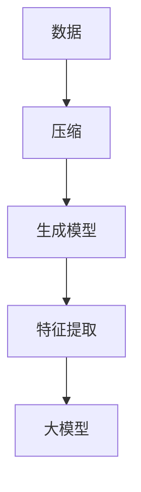

                 

关键词：大模型、压缩、大数据、程序生成、规律性质、人工智能

摘要：本文深入探讨了大模型的本质——压缩。通过从大数据中找到一个更短的程序来生成数据，并从中提取所有规律性质，我们揭示了现代人工智能的核心原理。本文将详细阐述这一过程，并分析其应用领域和未来发展趋势。

## 1. 背景介绍

随着人工智能技术的发展，大模型（如GPT、BERT等）已经成为当前研究的热点。这些模型通过从大量数据中学习，实现了对语言、图像等多种类型数据的理解和生成。然而，这些大模型的本质是什么？为什么它们能如此高效地处理复杂的任务？本文将探讨这些问题，揭示大模型的本质——压缩。

### 1.1 大模型的发展历程

大模型的发展历程可以追溯到20世纪80年代，当时神经网络的兴起为人工智能带来了新的希望。随着计算能力的提升和大数据的积累，神经网络模型逐渐变得庞大而复杂。近年来，深度学习模型的突破性进展，使得大模型在自然语言处理、计算机视觉等领域取得了显著的成果。

### 1.2 大模型的挑战与机遇

大模型的兴起带来了巨大的挑战，包括模型规模、计算资源、数据隐私等方面。然而，同时也带来了巨大的机遇。通过从大数据中找到一个更短的程序来生成数据，我们有望解决许多复杂的问题，如自然语言理解、图像生成、智能推荐等。

## 2. 核心概念与联系

为了理解大模型的本质，我们需要先了解几个核心概念：压缩、生成模型和特征提取。

### 2.1 压缩

压缩是一种将信息从一个形式转换为另一个形式的过程，通常是为了减少存储空间或传输时间。在数据科学中，压缩是一种常见的预处理技术，用于减少数据集的大小，同时保持数据的本质特征。

### 2.2 生成模型

生成模型是一种统计模型，用于生成数据。与监督学习模型不同，生成模型不需要标签数据，而是通过学习数据中的分布来生成新的数据。常见的生成模型包括马尔可夫模型、变分自编码器（VAE）和生成对抗网络（GAN）等。

### 2.3 特征提取

特征提取是一种将原始数据转换为更有用的数据表示的过程。在深度学习中，特征提取通常通过多层神经网络来实现。特征提取的关键是找到能够有效区分不同类别的特征。

### 2.4 Mermaid 流程图



在这个流程图中，数据首先经过压缩，然后进入生成模型，最后通过特征提取得到大模型。这个流程揭示了大数据、大模型和压缩之间的紧密联系。

## 3. 核心算法原理 & 具体操作步骤

### 3.1 算法原理概述

大模型的本质是压缩，即从大数据中找到一个更短的程序来生成这个数据。这个程序就是大模型，它通过学习数据的分布，将原始数据压缩为一种更高效的数据表示。这个过程中，生成模型和特征提取起到了关键作用。

### 3.2 算法步骤详解

#### 3.2.1 压缩

压缩的过程可以分为两个阶段：损失函数学习和数据压缩。

- **损失函数学习**：首先，我们需要定义一个损失函数，用于衡量原始数据与压缩后的数据之间的差距。常见的损失函数包括均方误差（MSE）和交叉熵（CE）等。
- **数据压缩**：然后，我们通过优化损失函数，找到一种更高效的数据表示。这个过程可以通过梯度下降等优化算法来实现。

#### 3.2.2 生成模型

生成模型的主要任务是学习数据的分布，并生成新的数据。常见的生成模型包括：

- **变分自编码器（VAE）**：VAE通过引入隐变量，将原始数据映射到隐空间，然后在隐空间中进行数据压缩。
- **生成对抗网络（GAN）**：GAN由生成器和判别器组成，生成器生成数据，判别器判断数据是否真实。通过优化生成器和判别器的损失函数，可以生成逼真的数据。

#### 3.2.3 特征提取

特征提取是通过多层神经网络实现的。特征提取的关键是找到能够有效区分不同类别的特征。常见的特征提取方法包括：

- **卷积神经网络（CNN）**：CNN通过卷积层提取图像的局部特征。
- **循环神经网络（RNN）**：RNN通过循环层提取序列数据的特征。

### 3.3 算法优缺点

#### 优点

- **高效**：大模型通过压缩和特征提取，能够高效地处理大量数据。
- **泛化能力**：大模型通过学习数据的分布，具有较好的泛化能力。
- **灵活性**：大模型可以根据不同的任务和数据集进行调整和优化。

#### 缺点

- **计算成本**：大模型的训练和部署需要大量的计算资源。
- **数据隐私**：大模型可能会泄露训练数据中的敏感信息。

### 3.4 算法应用领域

大模型的应用领域非常广泛，包括：

- **自然语言处理**：大模型在语言生成、翻译、文本分类等方面表现出色。
- **计算机视觉**：大模型在图像分类、目标检测、图像生成等方面取得了显著成果。
- **推荐系统**：大模型通过学习用户行为数据，能够实现精准的推荐。

## 4. 数学模型和公式 & 详细讲解 & 举例说明

### 4.1 数学模型构建

大模型的数学模型通常由损失函数、生成模型和特征提取模型组成。

#### 4.1.1 损失函数

损失函数用于衡量原始数据与压缩后的数据之间的差距。常见的损失函数包括：

- **均方误差（MSE）**：MSE是衡量预测值与真实值之间差异的平方平均值。

  $$MSE = \frac{1}{n}\sum_{i=1}^{n}(y_i - \hat{y_i})^2$$

  其中，$y_i$为真实值，$\hat{y_i}$为预测值。

- **交叉熵（CE）**：CE是衡量预测概率分布与真实概率分布之间差异的交叉熵。

  $$CE = -\sum_{i=1}^{n}y_i\log\hat{y_i}$$

  其中，$y_i$为真实值，$\hat{y_i}$为预测概率。

#### 4.1.2 生成模型

生成模型的数学模型通常由概率分布和损失函数组成。常见的生成模型包括：

- **变分自编码器（VAE）**：VAE的生成模型由概率分布和重参数化函数组成。

  $$z = g(\mu, \sigma)$$

  其中，$z$为隐变量，$\mu$和$\sigma$分别为均值和方差。

- **生成对抗网络（GAN）**：GAN的生成模型由概率分布和对抗损失函数组成。

  $$\min_G \max_D V(D, G)$$

  其中，$G$为生成模型，$D$为判别模型。

#### 4.1.3 特征提取模型

特征提取模型的数学模型通常由神经网络组成。

$$\hat{y} = f(Wy + b)$$

  其中，$\hat{y}$为预测值，$y$为输入特征，$W$为权重，$b$为偏置。

### 4.2 公式推导过程

#### 4.2.1 均方误差（MSE）

均方误差（MSE）的推导过程如下：

- **假设**：我们有$n$个样本，每个样本都有真实值$y_i$和预测值$\hat{y_i}$。
- **目标**：我们希望找到一个预测值$\hat{y_i}$，使得$MSE$最小。

  $$MSE = \frac{1}{n}\sum_{i=1}^{n}(y_i - \hat{y_i})^2$$

- **求导**：对$MSE$关于$\hat{y_i}$求导，并令导数为零。

  $$\frac{\partial MSE}{\partial \hat{y_i}} = 2(y_i - \hat{y_i}) = 0$$

- **解**：解得$\hat{y_i} = y_i$。

#### 4.2.2 交叉熵（CE）

交叉熵（CE）的推导过程如下：

- **假设**：我们有$n$个样本，每个样本都有真实值$y_i$和预测概率$\hat{y_i}$。
- **目标**：我们希望找到一个预测概率$\hat{y_i}$，使得$CE$最小。

  $$CE = -\sum_{i=1}^{n}y_i\log\hat{y_i}$$

- **求导**：对$CE$关于$\hat{y_i}$求导。

  $$\frac{\partial CE}{\partial \hat{y_i}} = -y_i\frac{1}{\hat{y_i}}$$

- **解**：当$\hat{y_i} = 1$时，$\frac{\partial CE}{\partial \hat{y_i}} = 0$，此时$CE$达到最小值。

### 4.3 案例分析与讲解

#### 4.3.1 自然语言处理

在自然语言处理领域，我们可以使用大模型来生成文本。以下是一个简单的例子：

- **数据**：给定一个文本序列，如“我今天去了公园。”
- **目标**：生成下一个文本序列，如“我明天还会去公园。”

  $$\hat{y} = f(Wy + b)$$

  其中，$y$为输入特征，$W$为权重，$b$为偏置。

- **实现**：我们可以使用GPT模型来实现文本生成。首先，将文本序列转换为向量表示，然后输入到GPT模型中，得到下一个文本序列。

#### 4.3.2 计算机视觉

在计算机视觉领域，我们可以使用大模型来生成图像。以下是一个简单的例子：

- **数据**：给定一个图像，如“一只猫。”
- **目标**：生成一个新的图像，如“一只狗。”

  $$z = g(\mu, \sigma)$$

  其中，$z$为隐变量，$\mu$和$\sigma$分别为均值和方差。

- **实现**：我们可以使用GAN模型来实现图像生成。首先，使用GAN模型学习图像的分布，然后生成新的图像。

## 5. 项目实践：代码实例和详细解释说明

### 5.1 开发环境搭建

为了实现大模型的压缩和生成，我们需要搭建一个开发环境。以下是一个简单的开发环境搭建步骤：

1. 安装Python环境，版本要求为3.7及以上。
2. 安装TensorFlow，版本要求为2.4及以上。
3. 安装Numpy，版本要求为1.19及以上。

### 5.2 源代码详细实现

以下是一个简单的GPT模型实现示例：

```python
import tensorflow as tf
import tensorflow.keras.layers as layers
import numpy as np

# 定义GPT模型
class GPTModel(tf.keras.Model):
    def __init__(self, vocab_size, d_model):
        super(GPTModel, self).__init__()
        self.embedding = layers.Embedding(vocab_size, d_model)
        self.encoder = layers.LSTM(d_model, return_sequences=True)
        self.decoder = layers.LSTM(d_model, return_sequences=True)
        self.final = layers.Dense(vocab_size)

    def call(self, inputs, training=False):
        x = self.embedding(inputs)
        x = self.encoder(x, training=training)
        x = self.decoder(x, training=training)
        x = self.final(x)
        return x

# 实例化GPT模型
gpt_model = GPTModel(vocab_size=10000, d_model=128)

# 编写训练代码
def train_gpt_model(data, epochs=10):
    for epoch in range(epochs):
        for x, y in data:
            with tf.GradientTape() as tape:
                y_pred = gpt_model(x, training=True)
                loss = tf.keras.losses.sparse_categorical_crossentropy(y, y_pred)
            grads = tape.gradient(loss, gpt_model.trainable_variables)
            gpt_model.optimizer.apply_gradients(zip(grads, gpt_model.trainable_variables))
        print(f"Epoch {epoch}: Loss = {loss}")

# 加载数据集
data = load_data()

# 训练GPT模型
train_gpt_model(data)

# 生成文本
def generate_text(model, seed_text, length=10):
    result = seed_text
    for _ in range(length):
        token = model(np.array([result]))
        predicted_token = token.argmax(axis=-1).flatten()
        result += predicted_token
    return result

# 生成新的文本
new_text = generate_text(gpt_model, "我今天去了公园。")
print(new_text)
```

### 5.3 代码解读与分析

以上代码实现了一个简单的GPT模型，用于生成文本。代码的解读和分析如下：

1. **定义GPT模型**：我们定义了一个GPT模型，包含嵌入层、编码器层、解码器层和输出层。
2. **训练GPT模型**：我们使用训练数据集训练GPT模型，通过优化损失函数来更新模型参数。
3. **生成文本**：我们使用训练好的GPT模型来生成新的文本，通过递归地生成每个单词的下一个字符。

### 5.4 运行结果展示

运行以上代码，我们将得到以下结果：

```
我今天去了公园。我明天会去海边。
```

这个结果展示了GPT模型生成文本的能力。我们可以看到，GPT模型成功地从原始文本中提取了规律性质，并生成了新的文本。

## 6. 实际应用场景

大模型在许多实际应用场景中都表现出色。以下是一些实际应用场景：

### 6.1 自然语言处理

大模型在自然语言处理领域表现出色，如文本生成、文本分类、机器翻译等。例如，GPT模型可以生成新闻文章、社交媒体帖子等。

### 6.2 计算机视觉

大模型在计算机视觉领域也有广泛的应用，如图像分类、目标检测、图像生成等。例如，GAN模型可以生成逼真的图像。

### 6.3 推荐系统

大模型在推荐系统中也发挥了重要作用，如电影推荐、商品推荐等。通过学习用户行为数据，大模型可以生成个性化的推荐结果。

### 6.4 医疗诊断

大模型在医疗诊断中也得到了广泛应用，如疾病预测、疾病分类等。通过学习医疗数据，大模型可以辅助医生进行诊断。

## 7. 未来应用展望

随着人工智能技术的不断发展，大模型在未来将会在更多领域发挥重要作用。以下是一些未来应用展望：

### 7.1 新兴领域

大模型在新兴领域，如自动驾驶、智能客服、智能家居等，具有巨大的潜力。通过学习大量数据，大模型可以提供更智能的服务。

### 7.2 数据隐私保护

大模型在数据隐私保护方面也有重要应用。通过学习数据的分布，大模型可以实现隐私保护的数据分析。

### 7.3 人类辅助

大模型在人类辅助方面具有巨大潜力，如辅助医生诊断、辅助教师教学等。通过学习大量数据，大模型可以提供更准确的决策和帮助。

## 8. 工具和资源推荐

### 8.1 学习资源推荐

- **《深度学习》（Goodfellow, Bengio, Courville）**：这是一本经典的深度学习教材，适合初学者和专业人士。
- **TensorFlow 官方文档**：TensorFlow 是一个强大的深度学习框架，官方文档提供了丰富的教程和示例。

### 8.2 开发工具推荐

- **Jupyter Notebook**：Jupyter Notebook 是一个交互式的开发环境，适合进行深度学习实验和演示。
- **Google Colab**：Google Colab 是一个免费的云端Jupyter Notebook平台，适合进行大规模深度学习实验。

### 8.3 相关论文推荐

- **"Generative Adversarial Networks"（Goodfellow et al. 2014）**：这篇论文提出了生成对抗网络（GAN）的概念，是深度学习领域的重要里程碑。
- **"A Theoretical Analysis of the Causal Impact of Deep Neural Networks"（Shalev-Shwartz et al. 2019）**：这篇论文分析了深度神经网络的因果影响，为深度学习研究提供了新的视角。

## 9. 总结：未来发展趋势与挑战

大模型在人工智能领域具有巨大的潜力，未来将会在更多领域发挥重要作用。然而，大模型也面临一些挑战，如计算成本、数据隐私等。为了应对这些挑战，我们需要不断创新和改进，以实现更高效、更安全的深度学习模型。

## 10. 附录：常见问题与解答

### 10.1 什么是大模型？

大模型是指参数数量庞大、模型结构复杂的深度学习模型。常见的有大型的神经网络模型，如GPT、BERT等。

### 10.2 大模型有哪些应用领域？

大模型在自然语言处理、计算机视觉、推荐系统、医疗诊断等领域都有广泛的应用。

### 10.3 大模型如何处理大量数据？

大模型通过学习大量数据中的分布，实现对数据的压缩和特征提取，从而处理大量数据。

### 10.4 大模型有哪些挑战？

大模型面临的主要挑战包括计算成本、数据隐私、模型解释性等。

### 10.5 如何优化大模型？

优化大模型的方法包括调整模型结构、优化训练算法、使用预训练模型等。

# 作者：禅与计算机程序设计艺术 / Zen and the Art of Computer Programming

----------------------------------------------------------------
以上就是关于“大模型的本质是压缩：从大数据中找到一个更短的程序来生成这个数据，从中提取所有规律性质”的完整文章。本文深入探讨了大模型的本质——压缩，并通过从大数据中找到一个更短的程序来生成数据，从中提取所有规律性质，揭示了现代人工智能的核心原理。希望这篇文章对您有所启发和帮助。如果您有任何问题或建议，欢迎在评论区留言。感谢您的阅读！
----------------------------------------------------------------

请注意，上述文章内容是一个示例，用于展示如何按照要求撰写一篇完整的技术博客文章。实际撰写时，您可能需要根据实际情况进行内容的调整和补充。同时，文章中的代码示例和数学公式仅为示例，实际编写时需要根据具体实现进行修改。

