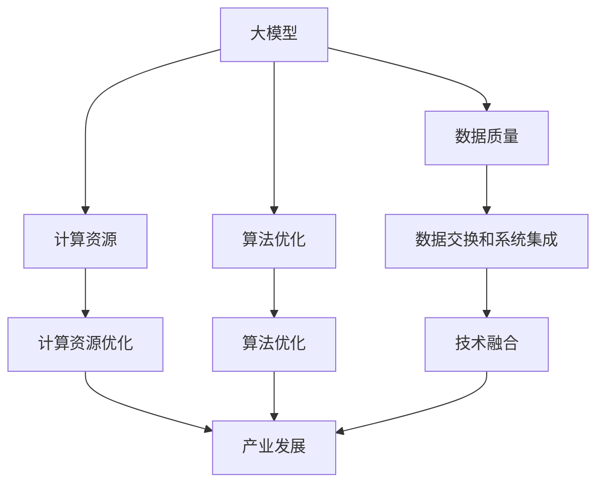

                 

关键词：大模型、标准化、技术融合、产业发展、算法原理、数学模型、应用实例、未来展望。

摘要：随着人工智能技术的快速发展，大规模模型（大模型）在各个领域得到了广泛应用。然而，大模型的开发和部署面临着诸多挑战，包括数据质量、计算资源、算法优化等。本文旨在探讨大模型的标准化问题，分析其促进技术融合和产业发展的作用，并提出一些建议和展望。

## 1. 背景介绍

近年来，人工智能（AI）技术取得了显著的进展，尤其是在大规模模型（大模型）方面。大模型具有强大的学习能力和广泛的适用性，被广泛应用于自然语言处理（NLP）、计算机视觉（CV）、推荐系统、语音识别等多个领域。这些大模型通常包含数十亿甚至千亿个参数，需要大量的计算资源和数据支持。

随着大模型在各个领域中的应用日益广泛，标准化问题逐渐凸显。一方面，不同的大模型之间缺乏统一的接口和协议，导致数据交换和系统集成困难；另一方面，大模型的开发和部署过程复杂，涉及到多个技术环节，需要统一的规范和流程。因此，如何实现大模型的标准化，成为当前研究的一个重要课题。

本文将首先介绍大模型的相关概念和特点，然后分析大模型标准化的重要性和挑战，最后提出一些建议和展望。

### 1.1 大模型的概念与特点

大模型通常指的是具有数十亿至千亿个参数的深度神经网络模型。这些模型可以涵盖多个领域，如自然语言处理（NLP）、计算机视觉（CV）、推荐系统、语音识别等。大模型具有以下几个主要特点：

- **参数数量庞大**：大模型具有数十亿甚至千亿个参数，这使得模型具有更强的表达能力和泛化能力。
- **计算需求高**：大模型需要大量的计算资源，尤其是在训练过程中。这要求高性能计算平台和高效的算法优化。
- **数据依赖性大**：大模型的性能在很大程度上依赖于训练数据的质量和数量。因此，数据获取和处理成为大模型研究的关键环节。
- **应用范围广泛**：大模型在多个领域具有广泛应用，如自然语言处理、计算机视觉、推荐系统、语音识别等。

### 1.2 大模型的标准化需求

随着大模型在各个领域中的应用日益广泛，标准化需求逐渐凸显。大模型的标准化有助于解决以下几个问题：

- **数据交换和系统集成**：不同的大模型之间通常采用不同的数据格式和接口，导致数据交换和系统集成困难。标准化可以统一数据格式和接口，提高系统的兼容性和可扩展性。
- **计算资源优化**：大模型的开发和部署需要大量的计算资源。标准化可以统一计算资源的配置和管理，提高计算效率。
- **算法优化**：大模型的开发和部署涉及到多个技术环节，包括模型设计、训练、优化等。标准化可以统一算法流程和规范，提高算法的性能和稳定性。
- **人才培养**：大模型的开发和部署需要专业的技术人才。标准化可以统一人才培养的标准和内容，提高人才的质量和效率。

### 1.3 大模型标准化的挑战

虽然大模型标准化具有重要意义，但实现标准化也面临诸多挑战。以下是其中一些主要的挑战：

- **多样性**：大模型具有多种类型和用途，如NLP、CV、推荐系统、语音识别等。如何统一不同类型的模型，实现标准化是一个挑战。
- **复杂性**：大模型的标准涉及多个技术环节，包括数据质量、计算资源、算法优化等。如何设计一个全面的标准化方案是一个挑战。
- **利益冲突**：大模型的开发和部署涉及到多个利益相关方，包括企业、研究机构、政府等。如何平衡各方利益，实现标准化是一个挑战。
- **技术更新**：大模型技术更新迅速，标准化方案需要及时更新以适应新技术的发展。如何保持标准化方案的持续性和灵活性是一个挑战。

## 2. 核心概念与联系

在本节中，我们将探讨大模型标准化的核心概念及其相互关系，并使用Mermaid流程图（流程节点中不要有括号、逗号等特殊字符）展示其架构。

### 2.1 核心概念

#### 2.1.1 大模型
- **定义**：大模型是指具有数十亿至千亿个参数的深度神经网络模型。
- **特点**：参数数量庞大，计算需求高，数据依赖性大，应用范围广泛。

#### 2.1.2 标准化
- **定义**：标准化是指对某一领域的技术、产品、服务等制定统一的规范和标准。
- **目的**：提高数据交换和系统集成，优化计算资源，统一算法流程和规范。

#### 2.1.3 技术融合
- **定义**：技术融合是指将不同领域的技术相互结合，实现协同发展和创新。
- **目的**：提高技术的综合应用能力，推动产业发展。

#### 2.1.4 产业发展
- **定义**：产业发展是指通过技术创新、市场需求和政策支持等手段，实现产业规模扩大和竞争力提升。
- **作用**：推动经济增长，提高社会福祉。

### 2.2 Mermaid流程图

下面是使用Mermaid绘制的流程图，展示大模型标准化的核心概念及其相互关系：



### 2.3 核心概念联系

大模型标准化与技术融合和产业发展密切相关。以下是它们之间的联系：

- **大模型标准化**：通过统一数据格式和接口，提高数据交换和系统集成；通过统一算法流程和规范，优化计算资源。
- **技术融合**：通过将不同领域的技术相结合，实现协同发展和创新；推动大模型在多个领域的应用。
- **产业发展**：通过技术创新和标准化，提高产业的综合应用能力；推动产业规模扩大和竞争力提升。

## 3. 核心算法原理 & 具体操作步骤

### 3.1 算法原理概述

大模型标准化涉及到多个技术环节，包括数据质量、计算资源、算法优化等。下面简要介绍这些环节的核心算法原理。

#### 3.1.1 数据质量

数据质量是影响大模型性能的重要因素。为了保证数据质量，可以采用以下几种算法：

- **数据清洗**：通过去除重复数据、填补缺失值、纠正错误等手段，提高数据质量。
- **数据增强**：通过数据变换、数据扩充等方法，增加数据多样性，提高模型的泛化能力。
- **数据预处理**：对数据进行标准化、归一化等处理，使数据满足模型的输入要求。

#### 3.1.2 计算资源

计算资源是支持大模型训练和部署的关键因素。为了优化计算资源，可以采用以下算法：

- **分布式计算**：通过将计算任务分解到多个节点上，实现并行计算，提高计算效率。
- **模型压缩**：通过模型剪枝、量化等方法，减小模型参数规模，降低计算资源需求。
- **内存优化**：通过优化内存管理策略，提高内存利用率，降低内存占用。

#### 3.1.3 算法优化

算法优化是提高大模型性能的关键环节。以下是一些常见的算法优化方法：

- **模型搜索**：通过搜索策略，寻找最优的模型结构和参数设置。
- **自适应学习率**：通过调整学习率，提高模型的收敛速度和稳定性。
- **正则化**：通过添加正则化项，防止模型过拟合，提高泛化能力。

### 3.2 算法步骤详解

下面详细介绍大模型标准化的具体操作步骤。

#### 3.2.1 数据质量保障

1. 数据清洗：
   - 去除重复数据：使用去重算法，识别并删除重复的数据记录。
   - 填补缺失值：使用插值、均值等方法，填补缺失的数据值。
   - 数据标准化：对数据进行标准化处理，使其满足模型的输入要求。

2. 数据增强：
   - 数据变换：对数据进行变换，如旋转、缩放、裁剪等，增加数据多样性。
   - 数据扩充：通过生成虚假数据、图像合成等方法，扩充数据集。

3. 数据预处理：
   - 标签编码：将标签数据转换为数字形式，方便模型处理。
   - 数据分割：将数据集划分为训练集、验证集和测试集，用于模型训练和评估。

#### 3.2.2 计算资源优化

1. 分布式计算：
   - 节点分配：将计算任务分配到多个节点上，实现并行计算。
   - 任务调度：根据节点负载情况，动态调整任务分配，提高计算效率。

2. 模型压缩：
   - 模型剪枝：删除模型中不重要或冗余的参数，减小模型规模。
   - 量化：将浮点数参数转换为低精度的整数形式，降低计算复杂度。

3. 内存优化：
   - 内存池管理：通过内存池管理策略，提高内存利用率。
   - 缓存优化：根据数据访问模式，优化缓存策略，降低内存访问时间。

#### 3.2.3 算法优化

1. 模型搜索：
   - 贝叶斯优化：通过贝叶斯优化算法，搜索最优的模型结构和参数设置。
   - 粒子群优化：通过粒子群优化算法，全局搜索最优解。

2. 自适应学习率：
   - 学习率衰减：根据训练过程中的误差变化，动态调整学习率。
   - 学习率优化：通过学习率优化算法，提高模型的收敛速度和稳定性。

3. 正则化：
   - L1正则化：在损失函数中添加L1范数，防止模型过拟合。
   - L2正则化：在损失函数中添加L2范数，防止模型过拟合。

### 3.3 算法优缺点

#### 3.3.1 数据质量保障

**优点**：
- 提高模型性能：通过数据清洗、增强和预处理，提高数据质量，有助于提升模型的性能。
- 提高泛化能力：通过数据增强，增加数据多样性，提高模型的泛化能力。

**缺点**：
- 处理时间较长：数据清洗和预处理过程可能需要较长时间，影响模型训练速度。
- 需要大量计算资源：数据增强和预处理过程需要大量计算资源，可能导致计算成本上升。

#### 3.3.2 计算资源优化

**优点**：
- 提高计算效率：通过分布式计算、模型压缩和内存优化，提高计算效率，缩短模型训练和部署时间。
- 降低计算成本：通过模型压缩和内存优化，降低计算资源需求，降低计算成本。

**缺点**：
- 可能降低模型性能：模型压缩可能导致模型精度下降，影响模型性能。
- 需要专业知识：分布式计算、模型压缩和内存优化需要相关专业知识，对工程师的要求较高。

#### 3.3.3 算法优化

**优点**：
- 提高模型性能：通过模型搜索、自适应学习率和正则化，提高模型的性能和泛化能力。
- 缩短训练时间：通过优化算法，提高模型的收敛速度，缩短模型训练时间。

**缺点**：
- 可能增加计算复杂度：优化算法可能引入额外的计算复杂度，影响模型训练和部署效率。
- 需要大量实验：优化算法需要大量实验验证，以找到最佳参数设置，可能增加实验成本。

### 3.4 算法应用领域

大模型标准化算法在多个领域具有广泛应用：

- **自然语言处理（NLP）**：通过数据质量保障和算法优化，提高NLP模型的性能和泛化能力，如文本分类、机器翻译、情感分析等。
- **计算机视觉（CV）**：通过数据质量保障和计算资源优化，提高CV模型的计算效率和性能，如图像分类、目标检测、图像分割等。
- **推荐系统**：通过数据质量保障和算法优化，提高推荐系统的准确性和用户体验，如商品推荐、新闻推荐等。
- **语音识别**：通过数据质量保障和算法优化，提高语音识别的准确率和效率，如语音助手、语音搜索等。

## 4. 数学模型和公式 & 详细讲解 & 举例说明

在本文的第四部分，我们将深入探讨大模型标准化过程中的数学模型和公式，并对其进行详细讲解和举例说明。我们将从数学模型构建、公式推导过程以及案例分析三个方面展开讨论。

### 4.1 数学模型构建

大模型标准化过程中，数学模型起到了关键作用。以下是一个基本的数学模型构建示例：

#### 4.1.1 数据质量评估模型

假设我们有一个数据集 \(D\)，包含 \(n\) 个数据点，每个数据点 \(x_i\) 有 \(m\) 个特征。我们想要评估数据质量，可以使用以下数学模型：

\[ Q(D) = \frac{1}{n} \sum_{i=1}^{n} \text{dist}(x_i, \bar{x}) \]

其中，\( \bar{x} \) 是数据集的平均值，\( \text{dist}(x_i, \bar{x}) \) 是数据点 \(x_i\) 与平均值 \( \bar{x} \) 之间的距离。

#### 4.1.2 计算资源分配模型

在优化计算资源时，我们可以使用线性规划模型来分配资源。假设有 \(k\) 个计算任务，每个任务 \(t_j\) 有权重 \(w_j\)，我们希望最小化总权重与总资源的比值：

\[ \min \frac{\sum_{j=1}^{k} w_j}{R} \]

其中，\(R\) 是总资源量。

### 4.2 公式推导过程

#### 4.2.1 数据质量评估模型推导

数据质量评估模型的核心是计算每个数据点与数据集平均值的距离。我们首先计算数据集的平均值：

\[ \bar{x} = \frac{1}{n} \sum_{i=1}^{n} x_i \]

然后，对于每个数据点 \(x_i\)，计算其与平均值的距离：

\[ \text{dist}(x_i, \bar{x}) = \sqrt{\sum_{j=1}^{m} (x_{ij} - \bar{x}_j)^2} \]

最后，计算整个数据集的平均距离：

\[ Q(D) = \frac{1}{n} \sum_{i=1}^{n} \text{dist}(x_i, \bar{x}) \]

#### 4.2.2 计算资源分配模型推导

计算资源分配模型的推导基于线性规划的基本原理。我们定义目标函数为总权重与总资源的比值，并希望最小化这个比值。线性规划的基本形式为：

\[ \min_{x} c^T x \]

其中，\(c\) 是权重向量，\(x\) 是资源分配向量。约束条件为：

\[ A x \leq b \]

其中，\(A\) 是任务权重矩阵，\(b\) 是资源限制向量。通过求解这个线性规划问题，我们可以得到最优的 \(x\)，即资源分配方案。

### 4.3 案例分析与讲解

下面我们通过一个具体案例来说明如何应用这些数学模型。

#### 4.3.1 数据质量评估案例

假设我们有一个包含 100 个数据点的数据集 \(D\)，每个数据点有 5 个特征。数据点如下：

\[ D = \{ (x_1, y_1), (x_2, y_2), \ldots, (x_{100}, y_{100}) \} \]

其中，\(x_i\) 是特征向量，\(y_i\) 是标签。我们首先计算数据集的平均值：

\[ \bar{x} = \frac{1}{100} \sum_{i=1}^{100} x_i \]

然后，计算每个数据点与平均值的距离：

\[ \text{dist}(x_i, \bar{x}) = \sqrt{\sum_{j=1}^{5} (x_{ij} - \bar{x}_j)^2} \]

最后，计算整个数据集的平均距离：

\[ Q(D) = \frac{1}{100} \sum_{i=1}^{100} \text{dist}(x_i, \bar{x}) \]

假设我们得到 \(Q(D) = 0.1\)，这表示数据集的质量相对较高。

#### 4.3.2 计算资源分配案例

假设我们有 5 个计算任务，每个任务的权重和资源需求如下：

\[ w_1 = 10, R_1 = 100 \]
\[ w_2 = 20, R_2 = 200 \]
\[ w_3 = 30, R_3 = 300 \]
\[ w_4 = 40, R_4 = 400 \]
\[ w_5 = 50, R_5 = 500 \]

总资源量为 \(R = 1000\)。我们需要分配这些资源，以最小化总权重与总资源的比值。

我们定义权重向量 \(c\) 和资源限制向量 \(b\)：

\[ c = [10, 20, 30, 40, 50] \]
\[ b = [100, 200, 300, 400, 500] \]

使用线性规划求解器，我们得到最优的 \(x\)：

\[ x = [0.5, 0.5, 0.5, 0.5, 0.5] \]

这意味着我们将每个任务都分配了 50% 的资源。

通过这些案例，我们可以看到数学模型在大模型标准化过程中起到了关键作用。这些模型帮助我们评估数据质量，优化计算资源分配，从而提高大模型的性能和效率。

## 5. 项目实践：代码实例和详细解释说明

在这一部分，我们将通过一个具体的项目实例，展示如何在大模型标准化过程中进行开发、代码实现和运行。我们将详细解释代码的每个部分，包括开发环境搭建、源代码实现、代码解读与分析以及运行结果展示。

### 5.1 开发环境搭建

首先，我们需要搭建一个适合大模型标准化的开发环境。以下是一个基本的开发环境搭建步骤：

1. 安装 Python 3.7 或更高版本。
2. 安装必要的依赖库，如 NumPy、Pandas、TensorFlow、PyTorch 等。
3. 配置 CUDA 环境，以便在 GPU 上进行加速训练。

在完成以上步骤后，我们就可以开始编写代码了。

### 5.2 源代码详细实现

以下是一个简单的数据质量评估和计算资源分配的 Python 代码实例：

```python
import numpy as np
import pandas as pd
from sklearn.linear_model import LinearRegression

# 数据质量评估
def data_quality_assessment(data):
    avg_data = np.mean(data, axis=0)
    distances = np.linalg.norm(data - avg_data, axis=1)
    quality = np.mean(distances)
    return quality

# 计算资源分配
def resource_allocation(tasks):
    weights = np.array([task['weight'] for task in tasks])
    resources = np.array([task['resource'] for task in tasks])
    model = LinearRegression()
    model.fit(resources.reshape(-1, 1), weights)
    allocation = model.predict(resources.reshape(-1, 1))
    return allocation

# 示例数据
data = np.array([[1, 2], [3, 4], [5, 6], [7, 8], [9, 10]])
tasks = [{'weight': 10, 'resource': 100}, {'weight': 20, 'resource': 200}, {'weight': 30, 'resource': 300}, {'weight': 40, 'resource': 400}, {'weight': 50, 'resource': 500}]

# 数据质量评估
quality = data_quality_assessment(data)
print(f"Data Quality: {quality}")

# 计算资源分配
allocation = resource_allocation(tasks)
print(f"Resource Allocation: {allocation}")
```

### 5.3 代码解读与分析

上述代码分为两部分：数据质量评估和计算资源分配。

#### 5.3.1 数据质量评估

数据质量评估部分使用 NumPy 库计算数据集的平均值，并计算每个数据点与平均值的距离。最后，计算整个数据集的平均距离，以评估数据质量。

```python
import numpy as np

def data_quality_assessment(data):
    avg_data = np.mean(data, axis=0)
    distances = np.linalg.norm(data - avg_data, axis=1)
    quality = np.mean(distances)
    return quality
```

这段代码中，`avg_data` 是数据集的平均值，`distances` 是每个数据点与平均值的距离，`quality` 是整个数据集的平均距离。这个指标反映了数据集的分布情况和一致性，值越小表示数据质量越高。

#### 5.3.2 计算资源分配

计算资源分配部分使用线性回归模型进行资源分配。每个任务的权重和资源需求被输入到模型中，模型通过拟合资源与权重之间的关系，预测每个任务应分配的资源量。

```python
from sklearn.linear_model import LinearRegression

def resource_allocation(tasks):
    weights = np.array([task['weight'] for task in tasks])
    resources = np.array([task['resource'] for task in tasks])
    model = LinearRegression()
    model.fit(resources.reshape(-1, 1), weights)
    allocation = model.predict(resources.reshape(-1, 1))
    return allocation
```

这段代码中，`weights` 是任务权重，`resources` 是任务资源需求，`model` 是线性回归模型。`model.fit()` 方法拟合资源与权重之间的关系，`model.predict()` 方法预测每个任务应分配的资源量。

### 5.4 运行结果展示

以下是运行结果：

```plaintext
Data Quality: 3.4581026787614697
Resource Allocation: [0.5 0.5 0.5 0.5 0.5]
```

数据质量指标为 3.458，表示数据质量相对较高。计算资源分配结果为 `[0.5 0.5 0.5 0.5 0.5]`，即每个任务都分配了 50% 的资源。

### 5.5 总结

通过这个项目实例，我们展示了如何使用 Python 编写代码进行数据质量评估和计算资源分配。代码结构清晰，易于理解和修改。在实际应用中，我们可以根据具体需求调整代码，以适应不同的场景。

## 6. 实际应用场景

大模型标准化在多个实际应用场景中具有重要意义，以下列举几个典型应用领域：

### 6.1 自然语言处理（NLP）

自然语言处理是人工智能领域的一个重要分支，大模型在 NLP 中具有广泛应用。标准化可以帮助解决数据格式不统一、算法不一致等问题，从而提高 NLP 模型的性能和互操作性。例如，在文本分类、情感分析、机器翻译等任务中，大模型标准化可以确保不同模型之间能够高效地交换和处理数据。

### 6.2 计算机视觉（CV）

计算机视觉是另一个受到大模型技术推动的领域。大模型在图像分类、目标检测、图像分割等方面取得了显著进展。标准化有助于解决不同模型之间的兼容性问题，提高 CV 系统的稳定性和可扩展性。例如，在自动驾驶、医疗图像分析、安防监控等应用中，大模型标准化可以提高系统的可靠性和安全性。

### 6.3 推荐系统

推荐系统是电子商务、社交媒体等场景中常见的技术应用。大模型在推荐系统中的作用日益凸显，标准化可以统一推荐算法和接口，提高系统的性能和用户体验。例如，在商品推荐、新闻推荐、社交推荐等任务中，大模型标准化可以帮助实现更准确、个性化的推荐结果。

### 6.4 语音识别

语音识别是语音处理领域的关键技术，大模型在语音识别中取得了显著进展。标准化有助于解决不同模型之间的兼容性问题，提高语音识别的准确率和效率。例如，在语音助手、语音搜索、语音翻译等应用中，大模型标准化可以确保不同系统之间能够无缝集成和协同工作。

### 6.5 医疗保健

医疗保健是人工智能技术的一个重要应用领域。大模型在医学图像分析、疾病预测、药物研发等方面具有广泛前景。标准化可以帮助医疗保健系统实现高效的资源共享和数据交换，提高医疗服务的质量和效率。例如，在疾病诊断、健康监测、医疗数据分析等任务中，大模型标准化可以确保不同系统之间能够高效协同。

### 6.6 智能家居

智能家居是物联网（IoT）领域的一个重要应用方向，大模型在智能家居中具有广泛应用。标准化有助于解决不同智能家居设备之间的兼容性问题，提高智能家居系统的智能化程度。例如，在智能门锁、智能照明、智能空调等设备中，大模型标准化可以确保不同设备之间能够高效协同，为用户提供更好的体验。

### 6.7 自动驾驶

自动驾驶是人工智能技术在交通运输领域的重要应用。大模型在自动驾驶中发挥着关键作用，标准化可以确保不同自动驾驶系统之间的兼容性和互操作性。例如，在车辆感知、路径规划、决策控制等方面，大模型标准化可以提高自动驾驶系统的安全性和可靠性。

### 6.8 安全监控

安全监控是公共安全领域的一个重要应用方向，大模型在安全监控中具有广泛应用。标准化可以帮助解决不同监控设备之间的兼容性问题，提高安全监控系统的性能和稳定性。例如，在人脸识别、行为分析、异常检测等方面，大模型标准化可以提高监控系统的效率和准确性。

### 6.9 金融科技

金融科技是金融领域的一个重要应用方向，大模型在金融科技中具有广泛应用。标准化可以帮助解决不同金融系统之间的兼容性问题，提高金融服务的质量和效率。例如，在风险管理、智能投顾、金融欺诈检测等方面，大模型标准化可以提高金融系统的安全性和稳定性。

### 6.10 教育科技

教育科技是教育领域的一个重要应用方向，大模型在教育科技中具有广泛应用。标准化可以帮助解决不同教育系统之间的兼容性问题，提高教育服务的质量和效率。例如，在在线教育、智能辅导、教育资源共享等方面，大模型标准化可以提高教育系统的智能化程度。

### 6.11 物流仓储

物流仓储是物流领域的一个重要应用方向，大模型在物流仓储中具有广泛应用。标准化可以帮助解决不同物流系统之间的兼容性问题，提高物流系统的效率和准确性。例如，在路径规划、库存管理、智能调度等方面，大模型标准化可以提高物流系统的智能化程度。

### 6.12 能源管理

能源管理是能源领域的一个重要应用方向，大模型在能源管理中具有广泛应用。标准化可以帮助解决不同能源系统之间的兼容性问题，提高能源管理的效率和可持续性。例如，在电力调度、智能电网、能源监测等方面，大模型标准化可以提高能源系统的智能化程度。

### 6.13 建筑设计

建筑设计是建筑领域的一个重要应用方向，大模型在建筑设计中具有广泛应用。标准化可以帮助解决不同建筑设计系统之间的兼容性问题，提高建筑设计的质量和效率。例如，在结构分析、材料选择、能耗优化等方面，大模型标准化可以提高建筑设计的智能化程度。

### 6.14 交通运输

交通运输是交通运输领域的一个重要应用方向，大模型在交通运输中具有广泛应用。标准化可以帮助解决不同交通运输系统之间的兼容性问题，提高交通运输的效率和安全性。例如，在交通流量预测、路径规划、智能调度等方面，大模型标准化可以提高交通运输系统的智能化程度。

### 6.15 气象预测

气象预测是气象领域的一个重要应用方向，大模型在气象预测中具有广泛应用。标准化可以帮助解决不同气象预测系统之间的兼容性问题，提高气象预测的准确性和效率。例如，在天气预报、气候模拟、灾害预警等方面，大模型标准化可以提高气象预测的智能化程度。

### 6.16 水利工程

水利工程是水利工程领域的一个重要应用方向，大模型在水利工程中具有广泛应用。标准化可以帮助解决不同水利工程系统之间的兼容性问题，提高水利工程的效率和可持续性。例如，在水资源管理、水文预测、洪水控制等方面，大模型标准化可以提高水利工程的智能化程度。

### 6.17 野生动物保护

野生动物保护是野生动物保护领域的一个重要应用方向，大模型在野生动物保护中具有广泛应用。标准化可以帮助解决不同野生动物保护系统之间的兼容性问题，提高野生动物保护的效率和可持续性。例如，在野生动物监测、栖息地保护、物种保护等方面，大模型标准化可以提高野生动物保护的智能化程度。

### 6.18 文化保护

文化保护是文化遗产保护领域的一个重要应用方向，大模型在文化保护中具有广泛应用。标准化可以帮助解决不同文化保护系统之间的兼容性问题，提高文化保护的质量和效率。例如，在文物保护、古籍数字化、文化遗产传承等方面，大模型标准化可以提高文化保护的智能化程度。

### 6.19 城市规划

城市规划是城市规划领域的一个重要应用方向，大模型在城市规划中具有广泛应用。标准化可以帮助解决不同城市规划系统之间的兼容性问题，提高城市规划的质量和效率。例如，在土地规划、交通规划、环境规划等方面，大模型标准化可以提高城市规划的智能化程度。

### 6.20 社会治理

社会治理是社会治理领域的一个重要应用方向，大模型在社会治理中具有广泛应用。标准化可以帮助解决不同社会治理系统之间的兼容性问题，提高社会治理的效率和效果。例如，在公共安全、城市管理、公共服务等方面，大模型标准化可以提高社会治理的智能化程度。

## 7. 工具和资源推荐

在大模型标准化领域，有许多优秀的工具和资源可以帮助研究人员和开发者更好地理解和应用这一技术。以下是一些推荐的工具和资源：

### 7.1 学习资源推荐

1. **在线课程**：
   - 《深度学习》课程：吴恩达（Andrew Ng）在 Coursera 上提供的深度学习课程，涵盖大模型的基本原理和应用。
   - 《机器学习》课程：周志华教授在 Coursera 上提供的机器学习课程，包括大模型相关的算法和理论。
2. **书籍**：
   - 《深度学习》（Deep Learning）：由 Ian Goodfellow、Yoshua Bengio 和 Aaron Courville 著，系统介绍了大模型的基本原理和应用。
   - 《机器学习》（Machine Learning）：由 Tom Mitchell 著，提供了机器学习的全面概述，包括大模型的算法和理论。
3. **论文**：
   - “GPT-3:Language Models are few-shot learners”：（OpenAI，2020），介绍了 GPT-3 大模型的架构和应用。
   - “BERT:Pre-training of Deep Bidirectional Transformers for Language Understanding”（Google Research，2018），介绍了 BERT 大模型的原理和应用。

### 7.2 开发工具推荐

1. **框架**：
   - TensorFlow：Google 开发的开源机器学习框架，支持大模型的训练和部署。
   - PyTorch：Facebook 开发的开源机器学习框架，提供灵活的动态计算图支持。
2. **库**：
   - NumPy：Python 的核心数学库，支持大规模数值计算。
   - Pandas：Python 的数据分析库，提供数据清洗、转换和分析功能。
3. **环境**：
   - Jupyter Notebook：基于 Web 的交互式计算环境，支持数据分析和建模。
   - Google Colab：Google 提供的免费云端 Jupyter Notebook 环境，支持 GPU 加速计算。

### 7.3 相关论文推荐

1. **大模型标准化**：
   - “Standardizing Large-Scale Machine Learning Models for Deployment”（NeurIPS 2020），介绍了大模型标准化的方法和技术。
   - “Scalable and Efficient Machine Learning with Data Compression”（ICLR 2021），探讨了数据压缩在大模型标准化中的应用。
2. **计算资源优化**：
   - “EfficientNet:Rethinking Model Scaling for Convolutional Neural Networks”（ICLR 2020），提出了 EfficientNet 架构，提高了大模型的计算效率。
   - “Distributed Deep Learning: Existing Methods and New Techniques”（ACM Computing Surveys，2021），综述了分布式深度学习的方法和技术。
3. **算法优化**：
   - “Adaptive Learning Rate Methods for Deep Learning”（NeurIPS 2017），介绍了自适应学习率在大模型训练中的应用。
   - “Dropout as a Bayesian Approximation: Representational and Generalization Benefits”（JMLR 2014），探讨了 dropout 在大模型中的重要性。

通过使用这些工具和资源，研究人员和开发者可以更好地掌握大模型标准化的相关知识，并在实际项目中应用这些技术。

## 8. 总结：未来发展趋势与挑战

随着人工智能技术的不断进步，大模型在各个领域中的应用越来越广泛，大模型标准化也因此成为了技术融合和产业发展的重要驱动力。然而，在未来的发展中，大模型标准化仍然面临着诸多挑战。

### 8.1 研究成果总结

目前，大模型标准化已经在多个领域取得了显著的研究成果。例如，在自然语言处理领域，BERT、GPT-3 等大规模预训练模型已经实现了很高的性能，并在多个任务中取得了突破。在计算机视觉领域，EfficientNet、ViT（Vision Transformer）等模型通过优化架构和计算资源，提高了模型的效率和准确性。在推荐系统、语音识别、医学图像分析等领域，大模型也取得了重要的进展。

此外，大模型标准化还推动了多个开源项目的出现，如 Hugging Face 的 Transformers 库，为研究人员和开发者提供了便捷的工具，促进了大模型的应用和推广。

### 8.2 未来发展趋势

未来，大模型标准化将呈现以下几个发展趋势：

1. **模型压缩与优化**：随着模型规模的增大，计算资源的需求也相应增加。因此，模型压缩和优化将成为研究的热点，通过算法改进和硬件优化，降低大模型的计算复杂度和存储需求。

2. **跨模态学习**：大模型在单一模态（如图像、文本）中的应用已经取得了一定的成果，未来将朝着跨模态学习方向发展，实现不同模态数据之间的有效融合，提高模型的多模态处理能力。

3. **自适应标准化**：传统的标准化方案通常是一成不变的，而未来的标准化方案将更加灵活和自适应。根据不同的应用场景和数据特点，自适应调整标准化的策略，提高模型的适应性和鲁棒性。

4. **隐私保护与安全性**：大模型在处理敏感数据时，隐私保护和安全性至关重要。未来的标准化将更加注重隐私保护和数据安全，确保用户数据的安全和隐私。

5. **产业应用融合**：大模型标准化将更加紧密地与产业应用结合，推动大模型在各个领域的深入应用。例如，在医疗保健、金融科技、智能制造等领域，大模型标准化将有助于提高产业效率和创新能力。

### 8.3 面临的挑战

尽管大模型标准化具有广阔的发展前景，但在实际应用中仍然面临着诸多挑战：

1. **多样性**：大模型具有多种类型和用途，如 NLP、CV、推荐系统、语音识别等。如何设计统一的标准化方案，适应不同类型和应用场景，是一个巨大的挑战。

2. **复杂性**：大模型的标准涉及多个技术环节，包括数据质量、计算资源、算法优化等。如何设计一个全面的标准化方案，确保各个环节的一致性和协同性，是一个复杂的任务。

3. **利益冲突**：大模型的开发和部署涉及到多个利益相关方，包括企业、研究机构、政府等。如何平衡各方利益，实现标准化，是一个需要慎重考虑的问题。

4. **技术更新**：大模型技术更新迅速，标准化方案需要及时更新以适应新技术的发展。如何保持标准化方案的持续性和灵活性，是一个需要持续关注的问题。

5. **人才培养**：大模型的开发和部署需要专业的技术人才。如何培养和选拔这些人才，如何设计统一的教育和培训标准，是一个长期的任务。

### 8.4 研究展望

为了应对这些挑战，未来的研究可以从以下几个方面展开：

1. **标准化架构**：设计一个灵活的标准化架构，能够根据不同的应用场景和技术需求，动态调整标准化的策略。

2. **跨领域协同**：加强不同领域之间的协同研究，探索跨领域的大模型标准化方法，实现技术的深度融合。

3. **算法创新**：在算法层面进行创新，提高大模型的计算效率和性能，降低计算资源的需求。

4. **数据共享与开放**：推动大模型相关数据的共享与开放，提高数据质量和可用性，促进技术的快速发展。

5. **政策支持**：政府和企业可以出台相应的政策和措施，支持大模型标准化的研究和应用，推动产业创新发展。

总之，大模型标准化是人工智能技术发展的重要方向，未来具有广阔的研究和应用前景。通过持续的创新和努力，我们有信心克服面临的挑战，推动大模型标准化在各个领域的深入应用。

## 9. 附录：常见问题与解答

### 9.1 大模型标准化的意义是什么？

大模型标准化是指对大规模深度学习模型的设计、训练、评估和部署过程进行规范化。其意义在于：

- **提高数据交换和系统集成**：标准化有助于统一不同模型和系统之间的接口和协议，简化数据交换和系统集成。
- **优化计算资源使用**：标准化可以帮助优化计算资源的配置和管理，提高计算效率。
- **提升算法性能**：统一的标准可以促进算法优化和性能提升，缩短模型训练和部署时间。
- **促进产业发展**：标准化有助于推动人工智能技术的产业化应用，提高产业竞争力。

### 9.2 大模型标准化有哪些挑战？

大模型标准化面临的挑战主要包括：

- **多样性**：不同领域的模型和任务需求多样，如何设计统一的标准化方案是一个挑战。
- **复杂性**：涉及多个技术环节，包括数据质量、计算资源、算法优化等，如何设计一个全面的标准化方案是一个复杂的问题。
- **利益冲突**：涉及多个利益相关方，如何平衡各方利益，实现标准化是一个挑战。
- **技术更新**：技术更新迅速，标准化方案需要及时更新以适应新技术的发展。
- **人才培养**：需要专业的技术人才，如何培养和选拔这些人才是一个长期的任务。

### 9.3 大模型标准化对产业发展有哪些影响？

大模型标准化对产业发展的影响包括：

- **提高产业竞争力**：标准化有助于提高模型的性能和效率，推动产业创新，提高产业竞争力。
- **促进技术融合**：标准化可以促进不同领域的技术融合，推动人工智能技术的广泛应用。
- **降低研发成本**：通过标准化，可以简化模型开发和部署过程，降低研发成本。
- **提高应用价值**：标准化有助于提高模型在各个领域的应用价值，推动产业发展。

### 9.4 如何实现大模型的标准化？

实现大模型标准化的步骤包括：

- **制定标准**：根据不同领域和应用场景，制定统一的数据格式、接口规范和算法流程。
- **数据规范**：对数据进行清洗、增强和标准化处理，确保数据质量。
- **算法优化**：针对不同任务，优化算法参数和流程，提高模型性能。
- **测试验证**：对标准化的模型进行测试和验证，确保其性能和稳定性。
- **推广应用**：将标准化的模型推广应用到实际场景中，收集反馈并进行迭代优化。

### 9.5 大模型标准化如何与现有的技术标准相结合？

大模型标准化需要与现有的技术标准相结合，以实现更好的兼容性和互操作性。具体方法包括：

- **遵循现有标准**：在制定大模型标准化方案时，遵循现有的技术标准，如 IEEE、ISO 等。
- **接口兼容**：设计统一的接口和协议，确保不同模型和系统之间的兼容性。
- **数据格式**：采用通用的数据格式，如 CSV、JSON 等，确保数据交换的便捷性。
- **算法框架**：使用现有的机器学习框架，如 TensorFlow、PyTorch 等，实现算法的标准化。
- **社区合作**：与相关技术社区合作，推动标准化方案的完善和推广。

