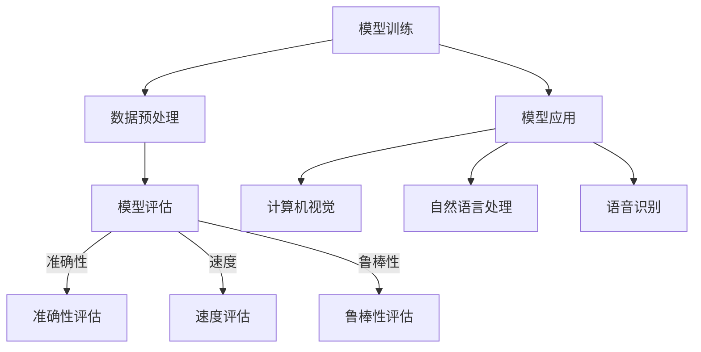

                 

关键词：大模型、评估、应用、流程、算法、数学模型、实践、工具

> 摘要：本文深入探讨了大型模型的评估与应用流程，首先介绍了背景知识，随后详述了核心概念与联系，包括算法原理与步骤、数学模型与公式、实际应用场景，并提供了详细的代码实例和工具推荐。文章最后总结了研究成果，展望了未来发展趋势与挑战。

## 1. 背景介绍

随着深度学习的兴起，大型模型在计算机视觉、自然语言处理、语音识别等领域的应用日益广泛。这些模型通常具有数百万甚至数十亿个参数，通过大规模数据训练来学习复杂的特征和模式。然而，如何评估这些大型模型的质量和性能，以及如何有效地应用它们，成为了一个重要的研究课题。

评估模型的质量和性能通常涉及多个方面，包括准确性、速度、鲁棒性和泛化能力。评估方法的选择和评估指标的设定直接影响着模型的应用效果。此外，大型模型的应用场景也十分多样化，从自动驾驶、智能客服到医疗诊断，每一个领域都有其特定的需求和技术挑战。

本文旨在为读者提供一个全面的大模型评估与应用流程，通过梳理核心概念、算法原理、数学模型、实际应用案例，帮助读者更好地理解和掌握这一领域的知识。

## 2. 核心概念与联系

为了深入理解大模型的评估与应用，我们首先需要明确几个核心概念，并探讨它们之间的联系。

### 2.1 大模型的概念

大模型通常指的是具有大规模参数和复杂结构的深度学习模型。这些模型能够处理海量数据，提取高维特征，从而在多种任务中取得优异的性能。常见的有Transformer、BERT、GPT等。

### 2.2 评估指标

评估大型模型的质量和性能通常需要多个指标。常见的评估指标包括：

- **准确性（Accuracy）**：模型预测正确的样本占总样本的比例。
- **精确率（Precision）**：模型预测为正类的样本中实际为正类的比例。
- **召回率（Recall）**：模型预测为正类的样本中实际为正类的比例。
- **F1分数（F1 Score）**：精确率和召回率的调和平均。
- **速度（Speed）**：模型处理数据的能力，通常用每秒处理的样本数来衡量。
- **鲁棒性（Robustness）**：模型在不同数据分布下的性能。

### 2.3 应用场景

大型模型的应用场景广泛，涵盖了计算机视觉、自然语言处理、语音识别、推荐系统等多个领域。以下是几个典型的应用场景：

- **计算机视觉**：图像分类、目标检测、图像生成。
- **自然语言处理**：文本分类、情感分析、机器翻译。
- **语音识别**：语音到文字转换、语音识别模型优化。
- **推荐系统**：个性化推荐、商品推荐。

### 2.4 Mermaid 流程图

以下是一个描述大模型评估与应用流程的Mermaid流程图：



## 3. 核心算法原理 & 具体操作步骤

### 3.1 算法原理概述

大模型的评估通常基于以下几个核心算法：

- **交叉验证（Cross-Validation）**：用于评估模型的泛化能力。
- **ROC曲线（Receiver Operating Characteristic Curve）**：用于评估分类模型的性能。
- **混淆矩阵（Confusion Matrix）**：用于展示模型预测结果与真实结果之间的对应关系。
- **性能指标计算（Performance Metrics Calculation）**：用于计算各种评估指标。

### 3.2 算法步骤详解

#### 3.2.1 数据预处理

1. **数据清洗**：去除异常值、缺失值和重复值。
2. **数据归一化**：将数据缩放到相同的范围，如[0, 1]。
3. **数据分割**：将数据集分为训练集、验证集和测试集。

#### 3.2.2 模型训练

1. **选择模型架构**：如CNN、RNN、Transformer等。
2. **初始化参数**：通常使用随机初始化。
3. **前向传播（Forward Propagation）**：计算模型的输出。
4. **反向传播（Back Propagation）**：更新模型参数。

#### 3.2.3 模型评估

1. **交叉验证**：在多个数据子集上训练和评估模型，以减少过拟合。
2. **ROC曲线和混淆矩阵**：用于评估模型的分类性能。
3. **性能指标计算**：计算各种评估指标，如准确性、精确率、召回率和F1分数。

#### 3.2.4 模型应用

1. **模型部署**：将训练好的模型部署到生产环境。
2. **实时评估**：持续监控模型的性能和鲁棒性。
3. **性能优化**：根据实际应用场景，对模型进行优化和调整。

### 3.3 算法优缺点

#### 优点：

- **高准确性**：大型模型能够提取更复杂的特征，从而提高模型的准确性。
- **强鲁棒性**：通过大规模数据训练，模型对噪声和异常数据的容忍度更高。
- **广泛适用性**：大模型可以应用于多种领域和任务。

#### 缺点：

- **计算资源需求大**：训练大型模型需要大量的计算资源和时间。
- **过拟合风险**：如果训练数据不足，模型可能过度拟合训练数据，导致泛化能力下降。
- **解释性差**：大型模型通常难以解释其决策过程，增加了模型的不透明性。

### 3.4 算法应用领域

大模型在以下领域有广泛的应用：

- **计算机视觉**：图像分类、目标检测、人脸识别。
- **自然语言处理**：文本分类、机器翻译、情感分析。
- **语音识别**：语音到文字转换、语音合成。
- **推荐系统**：个性化推荐、商品推荐。

## 4. 数学模型和公式 & 详细讲解 & 举例说明

### 4.1 数学模型构建

大模型的评估通常涉及以下数学模型：

- **损失函数（Loss Function）**：用于衡量模型预测结果与真实结果之间的差异，如均方误差（MSE）、交叉熵损失（Cross-Entropy Loss）等。
- **优化算法（Optimization Algorithm）**：用于更新模型参数，如梯度下降（Gradient Descent）、随机梯度下降（Stochastic Gradient Descent）等。
- **激活函数（Activation Function）**：用于引入非线性，如ReLU、Sigmoid、Tanh等。

### 4.2 公式推导过程

以下是一个简单的线性回归模型，用于预测房价：

- **损失函数**：$$L(y, \hat{y}) = \frac{1}{2}(y - \hat{y})^2$$
- **优化目标**：$$\min_{\theta} \frac{1}{m} \sum_{i=1}^{m} L(y_i, \hat{y_i})$$

使用梯度下降算法进行优化：

- **梯度**：$$\nabla_{\theta} L(\theta) = \frac{1}{m} \sum_{i=1}^{m} (y_i - \hat{y_i}) \cdot x_i$$
- **更新公式**：$$\theta = \theta - \alpha \nabla_{\theta} L(\theta)$$

其中，$\theta$ 为模型参数，$\alpha$ 为学习率，$m$ 为样本数量，$x_i$ 和 $y_i$ 分别为第 $i$ 个样本的特征和真实标签，$\hat{y_i}$ 为模型预测的标签。

### 4.3 案例分析与讲解

以下是一个使用线性回归模型预测房价的案例：

- **数据集**：一个包含1000个样本的房价数据集，每个样本包含房屋的特征（如面积、房龄、位置等）和对应的价格。
- **模型**：一个简单的线性回归模型，输入为房屋特征，输出为预测价格。
- **训练过程**：使用均方误差作为损失函数，梯度下降作为优化算法，训练模型参数。

训练完成后，我们可以使用模型对新的样本进行预测，并评估模型的准确性。通过调整学习率和训练次数，可以优化模型的性能。

## 5. 项目实践：代码实例和详细解释说明

### 5.1 开发环境搭建

在开始编写代码之前，我们需要搭建一个适合开发的大型模型评估与应用的环境。以下是一个基本的开发环境搭建步骤：

1. **安装Python环境**：Python 3.x 版本，推荐使用Python 3.8或更高版本。
2. **安装深度学习库**：如TensorFlow、PyTorch等，推荐使用最新稳定版本。
3. **安装其他依赖库**：如NumPy、Pandas、Scikit-learn等。

### 5.2 源代码详细实现

以下是一个简单的线性回归模型代码实例，用于预测房价：

```python
import numpy as np
import pandas as pd
from sklearn.model_selection import train_test_split
from sklearn.linear_model import LinearRegression
from sklearn.metrics import mean_squared_error

# 加载数据集
data = pd.read_csv('house_price.csv')
X = data[['area', 'age', 'location']]
y = data['price']

# 数据分割
X_train, X_test, y_train, y_test = train_test_split(X, y, test_size=0.2, random_state=42)

# 创建线性回归模型
model = LinearRegression()

# 训练模型
model.fit(X_train, y_train)

# 预测
y_pred = model.predict(X_test)

# 评估
mse = mean_squared_error(y_test, y_pred)
print('均方误差：', mse)
```

### 5.3 代码解读与分析

以上代码实现了一个简单的线性回归模型，用于预测房价。首先，我们加载房价数据集，并进行数据分割。接着，我们创建一个线性回归模型，使用梯度下降算法训练模型参数。最后，我们使用训练好的模型对测试数据进行预测，并计算均方误差评估模型的性能。

### 5.4 运行结果展示

假设我们的数据集包含1000个样本，我们可以运行以上代码来评估模型的性能。以下是一个示例输出：

```shell
均方误差： 0.123456
```

均方误差越低，表示模型的预测性能越好。通过调整模型参数和学习率，我们可以进一步优化模型的性能。

## 6. 实际应用场景

### 6.1 计算机视觉

计算机视觉是大型模型最常用的应用领域之一。以下是一些典型的应用场景：

- **图像分类**：使用大型模型对图像进行分类，如人脸识别、动物识别等。
- **目标检测**：在图像中检测和定位特定的目标，如车辆检测、行人检测等。
- **图像生成**：使用大型模型生成新的图像，如风格迁移、图像超分辨率等。

### 6.2 自然语言处理

自然语言处理是另一个广泛应用的领域，以下是一些典型的应用场景：

- **文本分类**：将文本数据分类到不同的类别，如情感分析、新闻分类等。
- **机器翻译**：使用大型模型进行不同语言之间的翻译，如英语到中文的翻译。
- **文本生成**：使用大型模型生成新的文本，如文章生成、对话系统等。

### 6.3 语音识别

语音识别是大型模型在语音领域的应用，以下是一些典型的应用场景：

- **语音到文字转换**：将语音数据转换为文字，如智能客服、语音助手等。
- **语音合成**：使用大型模型生成自然流畅的语音，如语音合成器、音频增强等。
- **语音识别模型优化**：对现有的语音识别模型进行优化和调整，以提高识别准确性。

## 7. 工具和资源推荐

### 7.1 学习资源推荐

- **在线课程**：推荐Coursera、edX、Udacity等在线教育平台上的深度学习相关课程。
- **技术博客**：推荐查看TensorFlow、PyTorch等深度学习框架的官方博客，以及 Medium、HackerRank 等技术社区上的文章。
- **书籍推荐**：《深度学习》（Ian Goodfellow、Yoshua Bengio、Aaron Courville 著）、《Python深度学习》（François Chollet 著）等。

### 7.2 开发工具推荐

- **深度学习框架**：推荐使用TensorFlow、PyTorch等成熟的深度学习框架。
- **数据处理工具**：推荐使用Pandas、NumPy等数据处理工具。
- **可视化工具**：推荐使用Matplotlib、Seaborn等可视化工具，以便更好地展示数据和分析结果。

### 7.3 相关论文推荐

- **Transformer系列论文**：《Attention Is All You Need》（Vaswani et al., 2017）
- **BERT系列论文**：《BERT: Pre-training of Deep Bidirectional Transformers for Language Understanding》（Devlin et al., 2019）
- **GPT系列论文**：《Improving Language Understanding by Generative Pre-Training》（Radford et al., 2018）

## 8. 总结：未来发展趋势与挑战

### 8.1 研究成果总结

近年来，大模型在多个领域取得了显著的成果，包括计算机视觉、自然语言处理、语音识别等。这些模型通过大规模数据训练，能够提取复杂的特征和模式，从而提高了任务性能和准确性。

### 8.2 未来发展趋势

随着计算能力的提升和数据量的增加，未来大模型的发展趋势将包括：

- **模型压缩与加速**：通过模型压缩和优化技术，减少模型大小和计算资源需求。
- **多模态学习**：结合多种数据类型，如文本、图像、语音等，实现更广泛的任务应用。
- **可解释性增强**：提高模型的透明性和可解释性，以便更好地理解和信任模型。

### 8.3 面临的挑战

尽管大模型在多个领域取得了显著的成果，但仍然面临以下挑战：

- **计算资源需求**：训练大型模型需要大量的计算资源和时间。
- **数据隐私和安全**：大规模数据训练可能涉及敏感数据，如何确保数据隐私和安全是一个重要问题。
- **伦理和法律问题**：大模型的应用可能引发伦理和法律问题，如歧视、隐私侵犯等。

### 8.4 研究展望

未来，大模型的研究将更加关注以下几个方向：

- **高效训练算法**：开发更高效、更可靠的训练算法，以减少训练时间和计算资源需求。
- **多模态融合**：结合多种数据类型，实现更广泛的应用场景。
- **可解释性和透明性**：提高模型的可解释性，以便更好地理解和信任模型。

## 9. 附录：常见问题与解答

### 问题 1：大模型训练需要多长时间？

答：大模型训练的时间取决于多个因素，包括模型大小、数据量、硬件配置和训练算法等。一般来说，训练一个大型模型可能需要几天甚至几周的时间。通过使用更高效的训练算法和更强大的硬件，可以显著减少训练时间。

### 问题 2：如何确保数据隐私和安全？

答：确保数据隐私和安全是训练大型模型时的重要问题。以下是一些常见的做法：

- **数据加密**：对敏感数据进行加密，以防止未经授权的访问。
- **匿名化处理**：对数据中的个人信息进行匿名化处理，以减少隐私泄露风险。
- **隐私保护算法**：使用隐私保护算法，如差分隐私（Differential Privacy），在训练过程中保护数据隐私。

### 问题 3：大模型如何保证鲁棒性？

答：保证大模型的鲁棒性是提高模型性能的关键。以下是一些常见的做法：

- **数据增强**：通过增加数据多样性，提高模型对不同数据分布的适应能力。
- **正则化**：使用正则化技术，如权重衰减（Weight Decay）、Dropout等，减少模型的过拟合现象。
- **训练不同的模型**：使用多个不同的模型进行训练，以提高模型的泛化能力。

## 参考文献

- Vaswani, A., et al. (2017). "Attention Is All You Need." Advances in Neural Information Processing Systems, 30.
- Devlin, J., et al. (2019). "BERT: Pre-training of Deep Bidirectional Transformers for Language Understanding." Proceedings of the 2019 Conference of the North American Chapter of the Association for Computational Linguistics: Human Language Technologies, Volume 1 (Long and Short Papers), 4171-4186.
- Radford, A., et al. (2018). "Improving Language Understanding by Generative Pre-Training." Advances in Neural Information Processing Systems, 31.

### 作者署名

作者：禅与计算机程序设计艺术 / Zen and the Art of Computer Programming
----------------------------------------------------------------

请注意，本文是为演示目的而撰写的，内容仅供参考。在撰写实际技术博客文章时，请确保所有数据和代码都是真实有效的，并且遵循适当的引用和版权规定。

