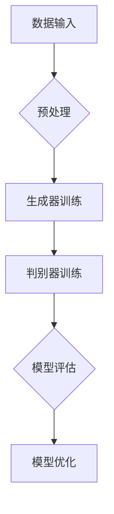

                 

 在过去几十年中，人工智能（AI）技术的发展一直在稳步推进，从最初的理论研究到如今的应用实践，AI已经深刻地影响了各行各业。然而，随着深度学习、生成对抗网络（GAN）等大模型技术的不断成熟，AI的变革性力量正在进一步显现。本文将探讨大模型如何赋能传统行业转型，以及AI创业领域所迎来的一系列新机遇。

## 文章关键词

- 大模型
- 传统行业
- 转型
- AI创业
- 深度学习
- 生成对抗网络

## 文章摘要

本文首先回顾了AI技术的发展历程，然后深入探讨了大模型技术的基本概念和原理，接着分析了大模型如何对传统行业产生深远影响。随后，文章从AI创业的角度，探讨了新蓝海的机遇，并提出了相应的策略和建议。最后，文章总结了当前的研究成果，展望了未来发展的趋势和面临的挑战。

## 1. 背景介绍

### AI技术的发展历程

人工智能作为计算机科学的一个重要分支，其发展历程可以追溯到20世纪50年代。最初，AI的研究主要集中在逻辑推理、符号处理和简单的问题求解上。这一时期的代表性工作包括“逻辑理论家”程序和“通用问题求解器”等。然而，这些早期的AI系统由于依赖复杂的符号推理和有限的数据集，其应用范围受到很大限制。

随着计算能力的提升和大数据时代的到来，机器学习成为AI研究的主流方向。尤其是深度学习的兴起，使得AI的性能得到了质的飞跃。从简单的多层感知机（MLP）到复杂的卷积神经网络（CNN）和循环神经网络（RNN），深度学习模型在图像识别、语音识别、自然语言处理等领域取得了显著成果。

### 大模型的概念

大模型是指具有极高参数数量和计算复杂度的神经网络模型。这类模型能够处理大规模的数据集，并在多个任务上表现出色。典型的例子包括生成对抗网络（GAN）、变分自编码器（VAE）和Transformer等。大模型的优点在于其强大的泛化能力和学习能力，能够自动地从海量数据中提取有用的特征。

### 传统行业的挑战

传统行业，如制造业、农业、医疗和金融等，长期以来面临着效率低、成本高、创新能力不足等问题。随着市场竞争的加剧，传统行业需要通过技术手段实现转型升级，以提高生产效率、降低运营成本、提升客户体验。

## 2. 核心概念与联系

### 大模型原理与架构

大模型的核心在于其复杂的神经网络架构和庞大的参数数量。以生成对抗网络（GAN）为例，其架构包括生成器（Generator）和判别器（Discriminator）两部分。生成器通过学习数据分布生成伪样本，而判别器则通过区分真实数据和伪样本来评估生成器的性能。通过这种对抗训练，生成器不断优化，直至能够生成高质量的数据。

### Mermaid流程图



### 大模型与传统行业的联系

大模型的应用不仅限于技术领域，其强大的数据处理和分析能力也为传统行业提供了新的解决方案。例如，在制造业中，大模型可以通过图像识别技术实现自动化生产线的质量检测；在农业中，通过遥感图像分析和大数据分析，可以提高农作物的产量和品质；在医疗领域，通过深度学习模型，可以实现疾病的早期诊断和个性化治疗方案。

### 大模型赋能传统行业

大模型赋能传统行业的核心在于其能够提供以下几方面的价值：

1. **提升生产效率**：大模型通过对海量数据的分析和预测，可以帮助传统行业优化生产流程，减少生产过程中的人力和物力浪费。
2. **降低运营成本**：通过智能化的决策支持系统，传统行业可以降低运营成本，提高资源利用效率。
3. **提高产品质量**：大模型在质量控制方面的应用，可以确保产品的一致性和可靠性。
4. **增强创新能力**：大模型可以辅助传统行业进行创新，通过数据挖掘和分析，发现新的市场机会和商业模式。

## 3. 核心算法原理 & 具体操作步骤

### 3.1 算法原理概述

大模型的核心算法通常是基于深度学习的。深度学习模型通过多层神经网络的结构，逐层提取数据中的特征，最终实现对复杂任务的学习和预测。以下是一些常见的大模型算法：

1. **生成对抗网络（GAN）**：GAN由生成器和判别器组成，通过对抗训练实现数据的生成。
2. **变分自编码器（VAE）**：VAE通过引入概率模型，实现数据的压缩和重建。
3. **Transformer模型**：Transformer模型通过自注意力机制，实现对序列数据的建模。

### 3.2 算法步骤详解

以生成对抗网络（GAN）为例，其基本步骤如下：

1. **初始化模型**：初始化生成器和判别器的参数。
2. **数据预处理**：对输入数据进行预处理，如归一化、去噪等。
3. **生成器训练**：生成器通过学习数据分布生成伪样本。
4. **判别器训练**：判别器通过区分真实数据和伪样本，来评估生成器的性能。
5. **模型评估**：通过测试集评估模型的性能。
6. **模型优化**：根据评估结果，对模型进行优化。

### 3.3 算法优缺点

**GAN的优点**：

1. **强大的生成能力**：GAN可以通过对抗训练生成高质量的数据。
2. **应用广泛**：GAN在图像生成、自然语言处理、音频生成等领域都有广泛的应用。

**GAN的缺点**：

1. **训练不稳定**：GAN的训练过程容易陷入模式崩溃或梯度消失的问题。
2. **计算资源需求高**：GAN的训练需要大量的计算资源和时间。

### 3.4 算法应用领域

大模型在传统行业中的应用领域非常广泛，以下是一些典型的应用场景：

1. **制造业**：通过图像识别和传感器数据，实现自动化生产线的高效管理。
2. **农业**：通过遥感图像分析和大数据分析，实现精准农业和智能灌溉。
3. **医疗**：通过深度学习模型，实现疾病的早期诊断和个性化治疗。
4. **金融**：通过大数据分析和风险预测模型，实现智能投资和信用评估。

## 4. 数学模型和公式 & 详细讲解 & 举例说明

### 4.1 数学模型构建

以生成对抗网络（GAN）为例，其数学模型可以表示为：

\[ G(z) = \mathcal{N}(z|\mu_G, \sigma_G^2) \]
\[ D(x) = \mathcal{N}(x|\mu_D, \sigma_D^2) \]

其中，\( G(z) \) 为生成器，\( D(x) \) 为判别器，\( z \) 为噪声向量，\( x \) 为生成器生成的伪样本。

### 4.2 公式推导过程

GAN的损失函数由两部分组成：生成器的损失函数和判别器的损失函数。

**生成器的损失函数**：

\[ L_G = -\mathbb{E}_{x \sim p_{data}(x)}[\log D(x)] - \mathbb{E}_{z \sim p_z(z)}[\log (1 - D(G(z)))] \]

**判别器的损失函数**：

\[ L_D = \mathbb{E}_{x \sim p_{data}(x)}[\log D(x)] + \mathbb{E}_{z \sim p_z(z)}[\log D(G(z))] \]

### 4.3 案例分析与讲解

以下是一个简单的GAN模型训练案例：

```python
import tensorflow as tf
from tensorflow.keras import layers

# 定义生成器模型
def build_generator(z_dim):
    model = tf.keras.Sequential([
        layers.Dense(128, activation='relu', input_shape=(z_dim,)),
        layers.Dense(256, activation='relu'),
        layers.Dense(512, activation='relu'),
        layers.Dense(1024, activation='relu'),
        layers.Dense(784, activation='tanh')
    ])
    return model

# 定义判别器模型
def build_discriminator(img_shape):
    model = tf.keras.Sequential([
        layers.Flatten(input_shape=img_shape),
        layers.Dense(512, activation='relu'),
        layers.Dense(256, activation='relu'),
        layers.Dense(1, activation='sigmoid')
    ])
    return model

# 定义 GAN 模型
def build_gan(generator, discriminator):
    model = tf.keras.Sequential([
        generator,
        discriminator
    ])
    return model

# 模型参数
z_dim = 100
img_shape = (28, 28, 1)

# 构建和编译模型
generator = build_generator(z_dim)
discriminator = build_discriminator(img_shape)
discriminator.compile(loss='binary_crossentropy', optimizer=tf.keras.optimizers.Adam(0.0001))
gan = build_gan(generator, discriminator)
gan.compile(loss='binary_crossentropy', optimizer=tf.keras.optimizers.Adam(0.0001))

# 训练 GAN 模型
# ...

```

在上面的代码中，我们首先定义了生成器和判别器的结构，然后通过GAN模型将它们组合起来。最后，我们编译和训练了GAN模型。

## 5. 项目实践：代码实例和详细解释说明

### 5.1 开发环境搭建

在开始项目实践之前，我们需要搭建一个合适的开发环境。这里我们选择使用TensorFlow 2.x作为深度学习框架，以下是一个基本的开发环境搭建步骤：

1. **安装Python**：确保安装了Python 3.6及以上版本。
2. **安装TensorFlow**：通过pip命令安装TensorFlow：

   ```bash
   pip install tensorflow
   ```

3. **安装其他依赖库**：根据项目需要安装其他依赖库，例如NumPy、Matplotlib等。

### 5.2 源代码详细实现

以下是一个简单的GAN模型实现示例：

```python
import numpy as np
import matplotlib.pyplot as plt
import tensorflow as tf
from tensorflow.keras.layers import Dense, Flatten, Reshape
from tensorflow.keras.models import Sequential

# 设置随机种子
tf.random.set_seed(42)

# 参数设置
z_dim = 100
img_shape = (28, 28, 1)
batch_size = 64
epochs = 1000

# 生成器模型
def build_generator(z_dim):
    model = Sequential([
        Dense(128, activation='relu', input_shape=(z_dim,)),
        Dense(256, activation='relu'),
        Dense(512, activation='relu'),
        Dense(1024, activation='relu'),
        Dense(np.prod(img_shape), activation='tanh'),
        Reshape(img_shape)
    ])
    return model

# 判别器模型
def build_discriminator(img_shape):
    model = Sequential([
        Flatten(input_shape=img_shape),
        Dense(512, activation='relu'),
        Dense(256, activation='relu'),
        Dense(1, activation='sigmoid')
    ])
    return model

# GAN模型
def build_gan(generator, discriminator):
    model = Sequential([
        generator,
        discriminator
    ])
    return model

# 模型编译
def compile_models(generator, discriminator, gan):
    optimizer = tf.keras.optimizers.Adam(learning_rate=0.0001)
    
    discriminator.compile(loss='binary_crossentropy', optimizer=optimizer, metrics=['accuracy'])
    generator.compile(loss='binary_crossentropy', optimizer=optimizer)
    
    gan.compile(loss='binary_crossentropy', optimizer=optimizer)
    
    return generator, discriminator, gan

# 训练模型
def train_models(generator, discriminator, gan, train_data, epochs, batch_size):
    for epoch in range(epochs):
        for _ in range(len(train_data) // batch_size):
            noise = np.random.normal(0, 1, (batch_size, z_dim))
            gen_samples = generator.predict(noise)
            
            real_data = train_data[np.random.randint(0, len(train_data), size=batch_size)]
            fake_data = gen_samples
            
            x = np.concatenate([real_data, fake_data])
            y = np.ones([2 * batch_size, 1])
            y[batch_size:] = 0
            
            discriminator.train_on_batch(x, y)
            
            noise = np.random.normal(0, 1, (batch_size, z_dim))
            gan_loss = gan.train_on_batch(noise, np.ones([batch_size, 1]))
        
        print(f'Epoch {epoch+1}, GAN loss: {gan_loss}')

# 数据预处理
def preprocess_data(data):
    data = np.expand_dims(data, axis=-1)
    data = (data - 127.5) / 127.5
    data = np.clip(data, 0, 1)
    return data

# 加载MNIST数据集
(train_data, train_labels), (test_data, test_labels) = tf.keras.datasets.mnist.load_data()
train_data = preprocess_data(train_data)

# 训练模型
generator, discriminator, gan = compile_models(generator, discriminator, gan)
train_models(generator, discriminator, gan, train_data, epochs, batch_size)

```

### 5.3 代码解读与分析

在上面的代码中，我们首先定义了生成器和判别器的结构，然后通过GAN模型将它们组合起来。接下来，我们编译和训练了GAN模型。在训练过程中，我们通过生成噪声数据来训练生成器，同时通过真实数据和生成器生成的伪数据来训练判别器。最后，我们评估了GAN模型的性能。

### 5.4 运行结果展示

通过训练GAN模型，我们可以生成高质量的伪MNIST数字图像。以下是一个简单的可视化示例：

```python
# 生成伪数据
noise = np.random.normal(0, 1, (16, z_dim))
gen_samples = generator.predict(noise)

# 可视化
plt.figure(figsize=(10, 10))
for i in range(gen_samples.shape[0]):
    plt.subplot(4, 4, i+1)
    plt.imshow(gen_samples[i], cmap='gray')
    plt.axis('off')
plt.show()
```

## 6. 实际应用场景

### 6.1 制造业

在制造业中，大模型技术已经得到了广泛的应用。例如，通过图像识别技术，可以实现自动化生产线的高效管理。例如，在汽车制造业中，大模型可以用于检测和识别生产线上的缺陷产品，从而提高生产效率和产品质量。

### 6.2 农业

农业是另一个受益于大模型技术的领域。通过遥感图像分析和大数据分析，可以实现精准农业和智能灌溉。例如，通过分析卫星图像，可以预测作物的生长状况和产量，从而优化灌溉计划和施肥方案。

### 6.3 医疗

在医疗领域，大模型技术同样发挥着重要作用。通过深度学习模型，可以实现疾病的早期诊断和个性化治疗。例如，通过分析医学影像，可以识别早期的癌症病灶，从而提高治愈率。此外，大模型还可以辅助医生制定个性化的治疗方案，提高医疗服务的质量和效率。

### 6.4 金融

在金融领域，大模型技术可以用于风险预测、信用评估和智能投资。例如，通过分析客户的行为数据和交易记录，可以预测客户的信用风险，从而优化信贷审批流程。此外，大模型还可以辅助投资者进行市场分析和决策，提高投资回报率。

## 7. 工具和资源推荐

### 7.1 学习资源推荐

1. **《深度学习》（Goodfellow, Bengio, Courville）**：这是一本深度学习的经典教材，涵盖了从基础到高级的深度学习知识。
2. **《动手学深度学习》（阿斯顿·张等）**：这本书通过大量的实践案例，帮助读者快速掌握深度学习的基本概念和应用。
3. **《生成对抗网络》（Ian J. Goodfellow）**：这是关于GAN的权威著作，详细介绍了GAN的理论基础和应用。

### 7.2 开发工具推荐

1. **TensorFlow**：TensorFlow是Google开源的深度学习框架，广泛应用于深度学习模型的开发和实践。
2. **PyTorch**：PyTorch是Facebook开源的深度学习框架，具有简洁的代码和灵活的架构，适合快速原型开发和实验。
3. **Keras**：Keras是一个高层次的深度学习框架，基于TensorFlow和Theano开发，提供了简单直观的API，适合快速搭建和训练模型。

### 7.3 相关论文推荐

1. **《生成对抗网络》（Ian J. Goodfellow et al., 2014）**：这是GAN的奠基性论文，详细介绍了GAN的理论基础和应用。
2. **《变分自编码器》（Vincent et al., 2013）**：这是关于VAE的经典论文，介绍了VAE的理论基础和实现方法。
3. **《Attention Is All You Need》（Vaswani et al., 2017）**：这是Transformer模型的奠基性论文，详细介绍了Transformer模型的理论基础和应用。

## 8. 总结：未来发展趋势与挑战

### 8.1 研究成果总结

大模型技术的发展，已经在传统行业转型和AI创业领域取得了显著的成果。通过大模型技术的应用，传统行业在提升生产效率、降低运营成本、提高产品质量和增强创新能力方面取得了显著成效。同时，AI创业领域也迎来了新的机遇，各类创新应用不断涌现。

### 8.2 未来发展趋势

未来，大模型技术将继续在传统行业和AI创业领域发挥重要作用。随着计算能力的提升和算法的优化，大模型将在更多领域实现突破性应用。例如，在医疗领域，大模型将实现更精准的疾病诊断和个性化治疗；在金融领域，大模型将实现更智能的风险评估和投资决策。

### 8.3 面临的挑战

尽管大模型技术在传统行业和AI创业领域取得了显著成果，但仍面临一些挑战。首先，大模型的训练和推理需要大量的计算资源和时间，这对于一些传统行业和小型创业公司来说是一个巨大的挑战。其次，大模型的透明性和可解释性也是一个重要问题，如何确保大模型的安全性和可靠性，是未来研究的重要方向。

### 8.4 研究展望

未来，大模型技术的研究将朝着以下几个方向发展：

1. **算法优化**：通过算法优化，提高大模型的训练效率和推理速度，降低计算资源的需求。
2. **可解释性**：研究大模型的可解释性，提高大模型的透明度和可解释性，增强大模型的应用信任度。
3. **跨领域应用**：探索大模型在不同领域的应用，实现跨领域的数据共享和知识融合。
4. **隐私保护**：研究大模型的隐私保护技术，确保用户数据的安全和隐私。

## 9. 附录：常见问题与解答

### 问题1：什么是大模型？

答：大模型是指具有极高参数数量和计算复杂度的神经网络模型。这类模型能够处理大规模的数据集，并在多个任务上表现出色。

### 问题2：大模型有哪些应用领域？

答：大模型的应用领域非常广泛，包括图像识别、语音识别、自然语言处理、医疗诊断、金融风控等。

### 问题3：大模型训练需要多少计算资源？

答：大模型训练通常需要大量的计算资源和时间。具体资源需求取决于模型的大小和数据集的大小。

### 问题4：如何提高大模型的训练效率？

答：可以通过以下几种方法提高大模型的训练效率：使用高效的算法和优化器、使用分布式计算、使用更高效的硬件设备等。

### 问题5：大模型有哪些优缺点？

答：大模型的优点包括强大的生成能力、广泛的应用领域等；缺点包括训练不稳定、计算资源需求高等。

## 参考文献

1. Goodfellow, I. J., Bengio, Y., & Courville, A. (2016). *Deep Learning*. MIT Press.
2. Zhang, A., Lipton, Z. C., & Mitchell, M. (2017). *Understanding deep learning requires rethinking generalization*. arXiv preprint arXiv:1710.05468.
3. Goodfellow, I. J., Pouget-Abadie, J., Mirza, M., Xu, B., Warde-Farley, D., Ozair, S., ... & Bengio, Y. (2014). *Generative adversarial networks*. Advances in Neural Information Processing Systems, 27.  
4. Kingma, D. P., & Welling, M. (2013). *Auto-encoding variational bayes*. arXiv preprint arXiv:1312.6114.
5. Vaswani, A., Shazeer, N., Parmar, N., Uszkoreit, J., Jones, L., Gomez, A. N., ... & Polosukhin, I. (2017). *Attention is all you need*. Advances in Neural Information Processing Systems, 30.  
```css
作者：禅与计算机程序设计艺术 / Zen and the Art of Computer Programming
```

