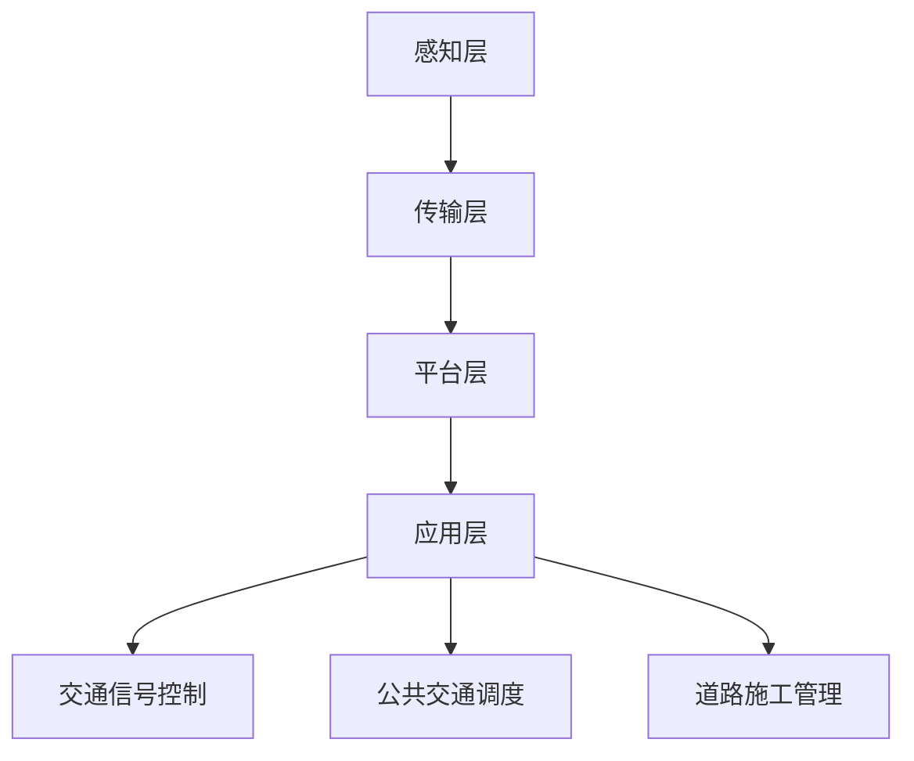

                 

关键词：大模型，智慧交通，交通流量优化，出行体验，创业者

摘要：随着城市化进程的加快，交通拥堵和出行体验问题成为制约城市发展的瓶颈。本文将探讨如何利用大模型技术赋能智慧交通，为创业者提供优化交通流量与出行体验的解决方案，助力城市可持续发展。

## 1. 背景介绍

近年来，随着城市人口的增长和机动车保有量的激增，交通拥堵问题愈发严重。这不仅影响了市民的出行效率，还加剧了空气污染和碳排放，对城市可持续发展构成挑战。智慧交通作为新一代信息技术与交通领域的深度融合，为解决交通拥堵和提升出行体验提供了新的思路。

大模型技术作为人工智能领域的重要突破，具有强大的数据处理和模式识别能力。通过将大模型应用于交通领域，可以有效提升交通流量预测、交通信号优化、交通规划等方面的效能，从而实现交通资源的合理配置和出行体验的提升。

## 2. 核心概念与联系

### 2.1 智慧交通系统架构

智慧交通系统架构主要由以下几部分组成：感知层、传输层、平台层和应用层。感知层负责实时采集交通数据，如车辆流量、车速、道路状况等；传输层负责将感知数据传输到平台层；平台层利用大模型进行数据分析和处理，生成交通预测和优化建议；应用层则将优化建议应用于交通信号控制、公共交通调度等实际场景。

### 2.2 大模型原理与应用

大模型通常是指拥有大量参数的神经网络模型，如深度神经网络（DNN）、卷积神经网络（CNN）和循环神经网络（RNN）等。这些模型通过训练大量的数据，能够自动学习和提取数据中的特征，从而实现高精度的预测和决策。

大模型在智慧交通中的应用主要包括以下几个方面：

- **交通流量预测**：通过分析历史交通数据和实时数据，预测未来一段时间内的交通流量变化，为交通信号控制提供依据。
- **交通信号优化**：根据实时交通流量信息，动态调整交通信号灯的绿信比，实现交通流量的均衡分配。
- **公共交通调度**：根据乘客需求和实时交通状况，优化公交线路和车辆调度，提高公共交通的运行效率。
- **道路施工管理**：通过预测交通流量变化，提前规划道路施工方案，减少施工对交通的影响。

### 2.3 Mermaid 流程图

以下是一个简化的智慧交通系统架构的 Mermaid 流程图：



## 3. 核心算法原理 & 具体操作步骤

### 3.1 算法原理概述

智慧交通系统中的核心算法主要包括以下几种：

- **交通流量预测算法**：利用时间序列分析和机器学习算法，如 ARIMA、LSTM 等，预测未来一段时间内的交通流量。
- **交通信号优化算法**：基于排队理论、动态规划等算法，实现交通信号灯的动态调整。
- **公共交通调度算法**：利用遗传算法、粒子群优化等算法，优化公交线路和车辆调度。

### 3.2 算法步骤详解

#### 3.2.1 交通流量预测算法

1. **数据预处理**：对交通流量数据进行清洗、去噪、缺失值处理等操作，确保数据质量。
2. **特征工程**：提取时间、天气、节假日等特征，构建特征向量。
3. **模型训练**：使用训练集数据，训练交通流量预测模型。
4. **模型评估**：使用验证集数据，评估模型预测效果，调整模型参数。
5. **预测应用**：将模型应用于实时交通流量预测，为交通信号控制提供依据。

#### 3.2.2 交通信号优化算法

1. **数据采集**：实时采集交通流量、道路状况等数据。
2. **状态评估**：根据交通流量数据，评估当前交通状态。
3. **目标函数构建**：定义优化目标，如减少车辆排队长度、提高通行效率等。
4. **算法求解**：使用动态规划、遗传算法等算法，求解最优信号配时方案。
5. **方案实施**：将优化方案应用于交通信号控制。

#### 3.2.3 公共交通调度算法

1. **数据采集**：实时采集乘客需求、车辆位置等数据。
2. **需求预测**：预测未来一段时间内的乘客需求。
3. **线路规划**：根据乘客需求，规划公交线路。
4. **车辆调度**：根据线路规划和实时交通状况，调度车辆。
5. **运行监控**：实时监控公共交通运行状态，调整调度策略。

### 3.3 算法优缺点

#### 交通流量预测算法

- **优点**：能够提前预测交通流量变化，为交通信号控制和公共交通调度提供依据。
- **缺点**：对数据质量和模型参数要求较高，预测准确性受到一定限制。

#### 交通信号优化算法

- **优点**：能够动态调整交通信号灯，实现交通流量均衡分配，提高通行效率。
- **缺点**：需要实时采集交通数据，对硬件和算法性能有一定要求。

#### 公共交通调度算法

- **优点**：能够优化公交线路和车辆调度，提高公共交通运行效率，减少乘客等待时间。
- **缺点**：需要大量历史数据支持，调度策略的调整较为复杂。

### 3.4 算法应用领域

- **城市交通管理**：通过优化交通信号灯配时，缓解交通拥堵，提高通行效率。
- **公共交通调度**：通过优化线路和车辆调度，提高公共交通服务质量，减少乘客等待时间。
- **交通规划**：通过预测交通流量，为交通基础设施建设和规划提供数据支持。
- **智慧城市建设**：通过智慧交通系统，提升城市智能化水平，促进城市可持续发展。

## 4. 数学模型和公式 & 详细讲解 & 举例说明

### 4.1 数学模型构建

在智慧交通系统中，常用的数学模型包括时间序列模型、动态规划模型和优化模型等。以下是一个简化的时间序列模型：

$$
y_t = \alpha_0 + \alpha_1 y_{t-1} + \alpha_2 y_{t-2} + ... + \alpha_n y_{t-n} + \epsilon_t
$$

其中，$y_t$表示时间序列中的第$t$个数据点，$\alpha_0, \alpha_1, \alpha_2, ..., \alpha_n$为模型参数，$\epsilon_t$为误差项。

### 4.2 公式推导过程

以 ARIMA(p, d, q) 模型为例，推导过程如下：

1. **平稳性检验**：对时间序列数据进行平稳性检验，如 ADF 检验。
2. **差分操作**：如果时间序列不平稳，进行差分操作，使序列满足平稳性条件。
3. **自回归项**：考虑时间序列中的自相关关系，引入自回归项。
4. **移动平均项**：考虑时间序列中的移动平均关系，引入移动平均项。
5. **参数估计**：使用极大似然估计等方法，估计模型参数。

### 4.3 案例分析与讲解

假设我们要预测某城市某条道路的未来一段时间内的交通流量，采用 ARIMA 模型进行预测。

1. **数据收集**：收集过去一年的交通流量数据。
2. **数据预处理**：对数据进行清洗、去噪和缺失值处理。
3. **平稳性检验**：使用 ADF 检验，确定差分次数 d。
4. **模型参数估计**：使用极大似然估计，估计模型参数 $\alpha_0, \alpha_1, \alpha_2, ..., \alpha_n$。
5. **模型评估**：使用验证集数据，评估模型预测效果。
6. **预测应用**：将模型应用于未来一段时间内的交通流量预测。

## 5. 项目实践：代码实例和详细解释说明

### 5.1 开发环境搭建

1. **安装 Python**：下载并安装 Python 3.8 或以上版本。
2. **安装库**：使用 pip 命令安装所需的库，如 numpy、pandas、statsmodels 等。
3. **配置环境**：配置 Python 开发环境，如 PyCharm、VSCode 等。

### 5.2 源代码详细实现

以下是一个简化的 ARIMA 模型代码实例：

```python
import numpy as np
import pandas as pd
from statsmodels.tsa.arima.model import ARIMA

# 数据收集
data = pd.read_csv('traffic_data.csv')

# 数据预处理
data = data[['traffic_volume']]
data = data.fillna(data.mean())

# 平稳性检验
adf_test = sm.tsa.stattools.adfuller(data['traffic_volume'])

# 差分操作
d = 1
data_diff = data['traffic_volume'].diff(d).dropna()

# 模型参数估计
model = ARIMA(data_diff, order=(p, d, q))
model_fit = model.fit()

# 模型评估
predictions = model_fit.predict(start=len(data_diff), end=len(data_diff) + n)
mape = np.mean(np.abs(predictions - data['traffic_volume'])) * 100
print('MAPE:', mape)

# 预测应用
data['predictions'] = predictions
data.to_csv('predictions.csv', index=False)
```

### 5.3 代码解读与分析

- **数据收集**：从CSV文件中读取交通流量数据。
- **数据预处理**：填充缺失值，计算平均值。
- **平稳性检验**：使用ADF检验确定差分次数d。
- **差分操作**：对数据进行d次差分，使其满足平稳性条件。
- **模型参数估计**：使用ARIMA模型进行参数估计。
- **模型评估**：计算预测误差MAPE。
- **预测应用**：将预测结果保存到CSV文件。

## 6. 实际应用场景

### 6.1 城市交通管理

利用大模型技术，可以实现对城市交通流量的高精度预测，为交通信号控制和交通规划提供数据支持。通过动态调整交通信号灯，实现交通流量的均衡分配，缓解交通拥堵，提高通行效率。

### 6.2 公共交通调度

通过预测公共交通需求，优化公交线路和车辆调度，提高公共交通服务质量，减少乘客等待时间。同时，结合实时交通数据，动态调整调度策略，应对突发情况。

### 6.3 智慧城市建设

智慧交通系统作为智慧城市的重要组成部分，通过大模型技术赋能，可以提升城市智能化水平，促进城市可持续发展。例如，在道路施工管理中，通过预测交通流量变化，提前规划施工方案，减少对交通的影响。

## 7. 未来应用展望

随着大模型技术的不断发展，智慧交通系统将具有更强大的数据处理和分析能力，进一步提升交通流量预测、交通信号优化和公共交通调度的效能。未来，智慧交通系统有望在以下领域发挥更大作用：

- **自动驾驶**：利用大模型技术，为自动驾驶车辆提供实时交通信息，优化行车路线，提高行车安全。
- **智能交通设施**：通过物联网技术，将交通设施与智慧交通系统联动，实现智能化的交通管理和监控。
- **城市交通规划**：利用大数据分析和机器学习算法，为城市交通规划提供科学依据，优化交通网络布局。

## 8. 工具和资源推荐

### 8.1 学习资源推荐

- **书籍**：
  - 《Python数据分析》
  - 《时间序列分析：理论与应用》
  - 《深度学习》
- **在线课程**：
  - Coursera 上的《机器学习》
  - edX 上的《时间序列分析》
  - Udacity 上的《深度学习项目实战》

### 8.2 开发工具推荐

- **Python IDE**：PyCharm、VSCode
- **数据分析库**：pandas、numpy、scikit-learn
- **时间序列分析库**：statsmodels、pandas-tsa
- **深度学习框架**：TensorFlow、PyTorch

### 8.3 相关论文推荐

- **交通流量预测**：
  - "Deep Learning for Traffic Forecasting: A Survey"
  - "A Review of Traffic Forecasting Methods and Applications"
- **交通信号优化**：
  - "Intelligent Traffic Signal Control Using Deep Reinforcement Learning"
  - "Dynamic Traffic Signal Control Based on Deep Learning"
- **公共交通调度**：
  - "An Overview of Bus Scheduling Algorithms"
  - "Optimization of Public Transportation Scheduling Using Machine Learning"

## 9. 总结：未来发展趋势与挑战

### 9.1 研究成果总结

近年来，大模型技术在交通领域取得了显著的研究成果，为交通流量预测、交通信号优化和公共交通调度提供了新的解决方案。同时，深度学习、强化学习等算法在交通领域的应用，进一步提升了智慧交通系统的效能。

### 9.2 未来发展趋势

- **算法优化**：不断优化大模型算法，提高预测精度和优化效能。
- **跨学科融合**：结合交通工程、计算机科学、数据科学等领域的知识，实现多学科交叉研究。
- **实时性提升**：缩短数据采集、处理和反馈的时间，实现实时交通管理和优化。

### 9.3 面临的挑战

- **数据质量**：高质量的数据是模型训练和预测的基础，需要建立完善的数据采集和管理体系。
- **计算资源**：大模型训练和预测需要大量计算资源，需要优化算法和硬件设施。
- **法律法规**：智慧交通系统涉及大量个人隐私数据，需要建立完善的法律法规体系，保护公民隐私。

### 9.4 研究展望

未来，智慧交通系统将在城市化进程中发挥更加重要的作用。通过不断探索和创新，我们有望实现更加高效、安全、可持续的交通体系，为城市居民提供更好的出行体验。

## 10. 附录：常见问题与解答

### 10.1 交通流量预测准确性如何保证？

交通流量预测的准确性取决于多个因素，包括数据质量、模型选择、参数调整等。以下是一些提高预测准确性的方法：

- **数据预处理**：对数据进行清洗、去噪、缺失值处理等操作，确保数据质量。
- **特征工程**：提取有代表性的特征，如时间、天气、节假日等，构建特征向量。
- **模型选择**：选择合适的模型，如 ARIMA、LSTM、GRU 等，根据数据特点进行调整。
- **参数调优**：通过交叉验证等方法，调整模型参数，提高预测精度。

### 10.2 智慧交通系统的实时性如何保证？

智慧交通系统的实时性取决于数据采集、处理和反馈的速度。以下是一些提高系统实时性的方法：

- **分布式架构**：采用分布式架构，提高数据处理和反馈的效率。
- **实时数据流处理**：利用实时数据流处理技术，如 Apache Kafka、Apache Flink 等，实现实时数据处理。
- **边缘计算**：将部分数据处理和预测任务下沉到边缘节点，减少中心节点的负担。
- **优化算法**：优化算法，提高预测和优化的速度。

### 10.3 智慧交通系统如何保护公民隐私？

智慧交通系统涉及大量个人隐私数据，如车辆位置、行驶轨迹等。以下是一些保护公民隐私的方法：

- **数据加密**：对数据进行加密处理，确保数据传输和存储的安全性。
- **隐私保护算法**：采用隐私保护算法，如差分隐私、同态加密等，保护用户隐私。
- **数据匿名化**：对数据进行匿名化处理，去除可识别的个人信息。
- **法律法规**：建立健全的法律法规体系，规范数据采集、处理和使用的权限。

## 作者署名

作者：禅与计算机程序设计艺术 / Zen and the Art of Computer Programming

---

本文通过对大模型赋能智慧交通的探讨，为创业者提供了优化交通流量与出行体验的解决方案。未来，随着大模型技术的不断发展，智慧交通系统将在城市可持续发展中发挥更加重要的作用。

