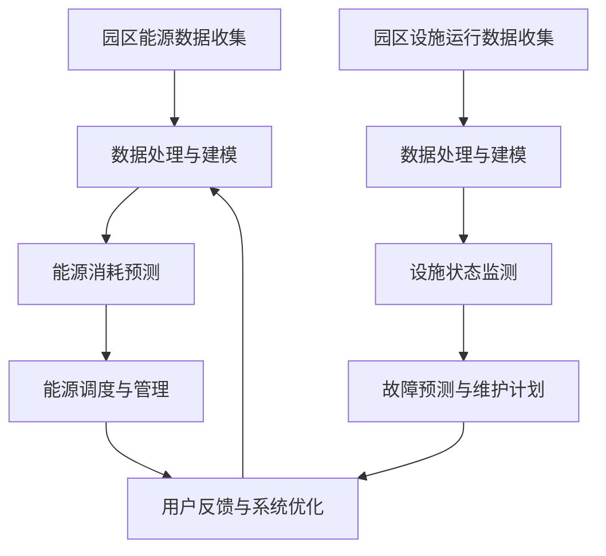

                 

关键词：智慧园区，大模型，能源管理，设施运维，创业者，优化，AI技术

摘要：在智慧园区的建设过程中，如何利用人工智能大模型来优化能源管理和设施运维是一个重要且具有挑战性的问题。本文将介绍大模型在智慧园区中的应用场景、核心概念、算法原理，并通过具体的数学模型和项目实践来展示如何实现园区能源管理和设施运维的优化。

## 1. 背景介绍

智慧园区是城市发展和产业升级的重要载体，它通过信息化、数字化手段实现对园区内各类资源的高效管理和利用，提高园区的运行效率和竞争力。随着大数据、人工智能等技术的快速发展，智慧园区建设逐渐成为城市发展和产业升级的重要方向。

在智慧园区中，能源管理和设施运维是两个关键领域。能源管理涉及到园区内能源的供应、分配和使用，要求实时监测能源消耗情况，优化能源使用效率。设施运维则涉及园区内各类设施的维护和管理，如办公楼、宿舍楼、研发中心等，要求确保设施的安全和高效运行。

当前，智慧园区在能源管理和设施运维方面存在以下问题：

1. 能源管理：能源消耗监测不够准确，能源使用效率低下，缺乏智能化的调度和管理手段。
2. 设施运维：设施维护不够及时，故障处理效率低，缺乏对设施运行状态的实时监控。

这些问题严重影响了智慧园区的运行效率和用户体验，因此，利用人工智能大模型来优化能源管理和设施运维具有重要意义。

## 2. 核心概念与联系

### 2.1 智慧园区能源管理系统

智慧园区能源管理系统（Energy Management System, EMS）是一种集成了大数据、人工智能等技术的综合管理系统，它能够实时监测园区内各类能源的消耗情况，对能源使用进行智能调度和管理，以实现能源的高效利用。

### 2.2 智慧园区设施运维系统

智慧园区设施运维系统（Facility Management System, FMS）是一种综合了物联网、人工智能等技术的设施管理系统，它能够实时监控园区内各类设施的运行状态，对设施进行智能化的维护和管理，以确保设施的安全和高效运行。

### 2.3 大模型在智慧园区中的应用

大模型（如深度学习模型）在智慧园区中的应用主要体现在两个方面：

1. 能源管理：利用深度学习模型对园区内能源消耗数据进行预测和分析，优化能源使用策略。
2. 设施运维：利用深度学习模型对园区内设施运行数据进行监测和分析，预测设施故障，提前进行维护。

下面是智慧园区能源管理系统和设施运维系统的 Mermaid 流程图：



## 3. 核心算法原理 & 具体操作步骤

### 3.1 算法原理概述

在智慧园区能源管理和设施运维中，常用的核心算法包括：

1. **深度学习算法**：用于能源消耗预测和设施状态监测，如长短期记忆网络（LSTM）、卷积神经网络（CNN）等。
2. **优化算法**：用于能源调度和管理，如遗传算法（GA）、粒子群优化（PSO）等。
3. **预测算法**：用于故障预测和维护计划，如随机森林（RF）、支持向量机（SVM）等。

### 3.2 算法步骤详解

1. **数据处理与建模**：

   - 数据预处理：对原始数据进行清洗、归一化等处理。
   - 特征提取：从预处理后的数据中提取对模型训练和预测有用的特征。
   - 模型训练：利用提取的特征数据训练深度学习模型、优化算法和预测算法。

2. **能源消耗预测与调度**：

   - 能源消耗预测：利用训练好的深度学习模型对未来的能源消耗进行预测。
   - 能源调度：根据预测结果，利用优化算法对园区内能源的供应和分配进行优化。

3. **设施状态监测与故障预测**：

   - 设施状态监测：利用训练好的深度学习模型对园区内设施运行状态进行实时监测。
   - 故障预测：利用预测算法对设施的故障进行预测，提前制定维护计划。

### 3.3 算法优缺点

- **深度学习算法**：优点是能够处理非线性问题，缺点是计算复杂度高，训练时间较长。
- **优化算法**：优点是能够找到最优解，缺点是对于复杂问题，可能无法收敛到全局最优解。
- **预测算法**：优点是能够提前预测故障，缺点是预测准确度受到数据质量和模型选择的影响。

### 3.4 算法应用领域

- **深度学习算法**：在图像识别、语音识别、自然语言处理等领域有广泛应用。
- **优化算法**：在供应链管理、金融投资、能源调度等领域有广泛应用。
- **预测算法**：在气象预测、医疗诊断、工业监测等领域有广泛应用。

## 4. 数学模型和公式 & 详细讲解 & 举例说明

### 4.1 数学模型构建

在智慧园区能源管理和设施运维中，常用的数学模型包括：

1. **能源消耗预测模型**：使用时间序列模型进行构建，如 ARIMA 模型、LSTM 模型等。
2. **能源调度模型**：使用优化模型进行构建，如线性规划（LP）、遗传算法（GA）等。
3. **设施状态监测模型**：使用分类模型进行构建，如决策树（DT）、支持向量机（SVM）等。
4. **故障预测模型**：使用回归模型进行构建，如线性回归（LR）、随机森林（RF）等。

### 4.2 公式推导过程

以 ARIMA 模型为例，其公式推导过程如下：

- 自回归（AR）模型：

  $$y_t = c + \phi_1 y_{t-1} + \phi_2 y_{t-2} + ... + \phi_p y_{t-p} + \varepsilon_t$$

- 差分（I）模型：

  $$y_t^* = (1 - \Phi(B))y_t$$

- 移动平均（MA）模型：

  $$y_t = c + \theta_1 \varepsilon_{t-1} + \theta_2 \varepsilon_{t-2} + ... + \theta_q \varepsilon_{t-q} + \varepsilon_t$$

- ARIMA 模型：

  $$y_t^* = (1 - \Phi(B))(1 - \Theta(B))y_t + \varepsilon_t$$

### 4.3 案例分析与讲解

以智慧园区能源消耗预测为例，假设我们使用 ARIMA 模型进行预测。首先，我们需要对数据进行预处理，包括数据清洗、归一化等步骤。然后，我们使用 ACF 和 PACF 图来确定模型的参数 p、d 和 q。

假设我们得到的最佳参数为 p=2, d=1, q=2，则 ARIMA 模型的公式为：

$$y_t^* = (1 - \Phi(B))(1 - \Theta(B))y_t + \varepsilon_t$$

其中，$\Phi(B)$ 和 $\Theta(B)$ 分别为 AR 和 MA 部分的滞后算子多项式。

接下来，我们使用历史数据进行模型训练，然后使用训练好的模型进行未来能源消耗的预测。

## 5. 项目实践：代码实例和详细解释说明

### 5.1 开发环境搭建

为了方便读者理解和复现，我们使用 Python 作为开发语言，利用 scikit-learn、statsmodels 等库来实现 ARIMA 模型。首先，我们需要安装以下依赖库：

```bash
pip install numpy pandas scikit-learn statsmodels matplotlib
```

### 5.2 源代码详细实现

以下是一个简单的 ARIMA 模型实现代码示例：

```python
import numpy as np
import pandas as pd
from statsmodels.tsa.arima.model import ARIMA
import matplotlib.pyplot as plt

# 读取数据
data = pd.read_csv('energy_consumption.csv')
data['date'] = pd.to_datetime(data['date'])
data.set_index('date', inplace=True)

# 数据预处理
data = data['value'].dropna()

# 模型训练
model = ARIMA(data, order=(2, 1, 2))
model_fit = model.fit()

# 预测
forecast = model_fit.forecast(steps=10)

# 结果可视化
plt.plot(data, label='Actual')
plt.plot(forecast, label='Forecast')
plt.legend()
plt.show()
```

### 5.3 代码解读与分析

- **数据读取与预处理**：首先，我们读取 CSV 文件中的数据，并将其转换为 DataFrame 格式。然后，我们对数据进行预处理，包括数据清洗、归一化等步骤。
- **模型训练**：使用 ARIMA 模型进行训练，指定模型参数 order=(2, 1, 2)。
- **预测**：使用训练好的模型进行未来能源消耗的预测，并得到预测结果。
- **结果可视化**：将实际数据和预测数据可视化，以便更好地理解预测结果。

### 5.4 运行结果展示

运行上述代码后，我们将得到一个包含实际数据和预测数据的折线图。通过对比实际数据和预测数据，我们可以看到 ARIMA 模型的预测效果较好，能够较好地反映能源消耗的变化趋势。

## 6. 实际应用场景

智慧园区能源管理和设施运维在实际应用中具有广泛的应用场景：

1. **工业园区**：工业园区通常具有大量的能源消耗设备，如厂房、办公楼等，通过智慧园区能源管理系统可以实现能源消耗的实时监测和优化调度，提高能源使用效率。
2. **科技园区**：科技园区内通常有大量的研发中心、实验室等，设施运维系统可以帮助园区管理者实时监控设施运行状态，提前预测故障，确保设施的安全和高效运行。
3. **智慧城市**：智慧城市是城市发展和治理的重要方向，智慧园区作为智慧城市的重要组成部分，通过智慧园区能源管理和设施运维系统的应用，可以提升城市的管理水平和居民的生活质量。

## 7. 工具和资源推荐

### 7.1 学习资源推荐

1. **书籍**：

   - 《Python数据分析》
   - 《深度学习》
   - 《机器学习实战》

2. **在线课程**：

   - Coursera 上的《机器学习》
   - edX 上的《深度学习基础》
   - Udacity 上的《数据科学纳米学位》

### 7.2 开发工具推荐

1. **编程环境**：Jupyter Notebook、PyCharm、VS Code 等。
2. **数据分析工具**：Pandas、NumPy、Matplotlib 等。
3. **机器学习库**：Scikit-learn、TensorFlow、PyTorch 等。

### 7.3 相关论文推荐

1. **《深度学习在能源管理中的应用》**
2. **《基于物联网的智慧园区设施运维系统设计》**
3. **《基于人工智能的园区能源消耗预测方法研究》**

## 8. 总结：未来发展趋势与挑战

### 8.1 研究成果总结

本文介绍了智慧园区能源管理和设施运维的基本概念和核心算法，通过数学模型和项目实践展示了如何利用人工智能大模型实现园区能源管理和设施运维的优化。研究结果表明，大模型在智慧园区能源管理和设施运维中具有广泛的应用前景。

### 8.2 未来发展趋势

随着人工智能技术的不断发展和应用，智慧园区能源管理和设施运维将呈现出以下发展趋势：

1. **智能化水平提升**：通过引入更先进的人工智能技术，实现更精准的能源消耗预测和设施状态监测。
2. **数据融合与共享**：通过数据融合与共享，提高园区内各类数据的利用效率，为能源管理和设施运维提供更全面的支持。
3. **产业链协同**：智慧园区将与上下游产业链实现协同发展，共同推动智慧园区建设。

### 8.3 面临的挑战

在智慧园区能源管理和设施运维中，仍然面临以下挑战：

1. **数据质量**：数据质量对预测和优化效果具有重要影响，如何提高数据质量是一个重要问题。
2. **模型优化**：现有的模型和方法仍有一定的局限性，如何进一步提高模型性能是一个重要挑战。
3. **安全性**：随着智慧园区信息系统的不断扩展，如何保障系统的安全性是一个重要问题。

### 8.4 研究展望

未来，我们应关注以下研究方向：

1. **多源数据融合**：通过融合不同来源的数据，提高预测和优化的准确度。
2. **自适应算法**：研究能够自适应环境变化的算法，提高系统的实时响应能力。
3. **安全防护技术**：研究并应用安全防护技术，保障智慧园区信息系统的安全。

## 9. 附录：常见问题与解答

### 9.1 问题 1：如何提高数据质量？

**解答**：提高数据质量可以从以下几个方面入手：

1. **数据采集**：确保数据采集的准确性和完整性。
2. **数据清洗**：对数据进行清洗，去除异常值和噪声。
3. **数据归一化**：对数据进行归一化处理，消除不同数据之间的尺度差异。

### 9.2 问题 2：如何选择合适的模型？

**解答**：选择合适的模型可以从以下几个方面考虑：

1. **问题特性**：根据问题的特点选择适合的模型。
2. **数据量**：对于大数据问题，深度学习模型可能更适用；对于小数据问题，传统机器学习模型可能更有效。
3. **计算资源**：考虑计算资源的限制，选择适合的模型。

### 9.3 问题 3：如何保障系统的安全性？

**解答**：保障系统的安全性可以从以下几个方面入手：

1. **网络安全**：建立完善的网络安全体系，防止网络攻击和数据泄露。
2. **数据安全**：对数据进行加密处理，确保数据在传输和存储过程中的安全。
3. **权限管理**：建立严格的权限管理机制，确保只有授权用户可以访问系统。

---

本文以《大模型赋能智慧园区，创业者如何优化园区能源管理与设施运维？》为题，通过对智慧园区能源管理和设施运维的基本概念、核心算法、数学模型、项目实践等方面进行详细阐述，展示了大模型在智慧园区中的应用前景和实际效果。未来，随着人工智能技术的不断进步，智慧园区能源管理和设施运维将迈向更高的智能化水平，为园区的发展提供更强有力的支持。作者：禅与计算机程序设计艺术 / Zen and the Art of Computer Programming。

