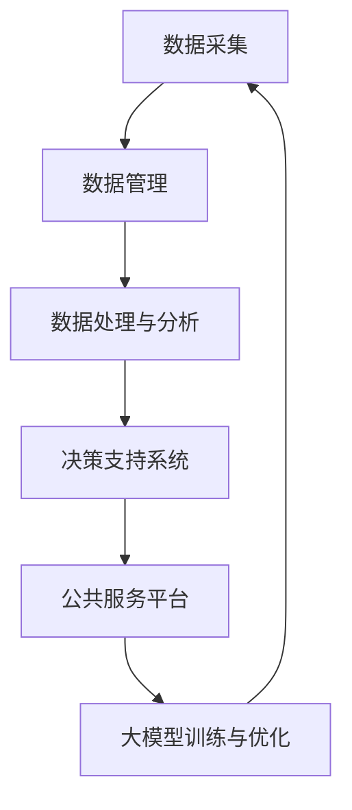

                 

### 关键词 Keywords
- 大模型
- 智慧政务
- 创业者
- 公共服务
- 智能决策

### 摘要 Abstract
本文深入探讨了如何利用大模型技术赋能智慧政务，并分析了创业者在这一领域的机会与挑战。通过介绍大模型的核心概念、技术原理和应用实例，本文旨在为创业者提供具体的技术指导，帮助他们在政务服务与决策领域取得突破。

## 1. 背景介绍

### 1.1 智慧政务的兴起

智慧政务是指利用现代信息技术，特别是大数据、人工智能等先进技术，优化政府管理和服务的一种新型治理模式。近年来，随着技术的不断进步和数据资源的不断积累，智慧政务在全球范围内得到了快速发展。智慧政务的目标是通过数据驱动和智能化手段，提高政府决策的科学性和效率，提升公共服务水平，增强政府与公民的互动。

### 1.2 大模型的崛起

大模型是指那些拥有海量参数和强大计算能力的人工智能模型，如深度神经网络、生成对抗网络等。大模型的崛起源于计算机硬件性能的提升和大数据技术的进步。大模型在图像识别、自然语言处理、推荐系统等领域取得了显著的成果，成为推动人工智能发展的核心技术之一。

### 1.3 大模型与智慧政务的结合

大模型在智慧政务中的应用潜力巨大。例如，大模型可以用于数据挖掘和分析，帮助政府发现潜在的问题和趋势；可以用于智能决策支持，辅助政府制定更加科学的政策；还可以用于公共服务的优化，如智能问答系统、智能客服等。因此，如何有效地结合大模型与智慧政务，成为当前研究的热点和创业者的机遇所在。

## 2. 核心概念与联系

### 2.1 大模型的概念与原理

大模型通常是基于深度学习技术构建的复杂神经网络，具有以下几个核心特点：
- **海量参数**：大模型拥有数亿甚至数十亿个参数，这使得它们能够捕捉到输入数据的复杂模式和关联。
- **强大计算能力**：大模型依赖于高性能的计算机硬件和大规模的分布式计算资源，以支持其大规模的训练和推理。
- **自适应能力**：大模型通过不断学习和优化，能够自适应地适应不同的任务和数据集。

### 2.2 智慧政务的概念与架构

智慧政务的架构通常包括以下几个关键组成部分：
- **数据采集与管理**：通过各种传感器、移动设备等收集数据，并使用数据管理系统进行存储和管理。
- **数据处理与分析**：利用大数据技术和算法对收集到的数据进行清洗、转换和分析，以提取有用的信息。
- **决策支持系统**：基于数据分析结果，提供决策支持，辅助政府制定和调整政策。
- **公共服务平台**：为公民提供便捷的公共服务，如在线办理、智能问答等。

### 2.3 大模型与智慧政务的联系

大模型与智慧政务之间的联系主要体现在以下几个方面：
- **数据驱动的决策**：大模型能够对大量数据进行深度分析，为政府提供数据驱动的决策支持。
- **智能化的公共服务**：大模型可以用于构建智能化的公共服务平台，提高服务效率和质量。
- **跨领域的应用**：大模型技术可以应用于智慧政务的多个领域，如交通管理、公共卫生、教育等。

下面是一个简单的Mermaid流程图，展示了大模型与智慧政务的整合架构：



## 3. 核心算法原理 & 具体操作步骤

### 3.1 算法原理概述

在智慧政务中，大模型的应用主要依赖于以下几个核心算法：
- **深度学习**：深度学习是一种模拟人脑神经网络结构的人工智能算法，能够通过多层神经网络自动提取数据的特征。
- **自然语言处理（NLP）**：NLP是人工智能的一个重要分支，用于处理和生成人类语言，包括语义分析、情感分析等。
- **推荐系统**：推荐系统通过学习用户的兴趣和行为模式，为用户推荐相关的信息或商品。

### 3.2 算法步骤详解

#### 3.2.1 深度学习

深度学习的基本步骤包括：
1. **数据预处理**：对收集到的数据进行清洗、归一化等预处理操作，以准备训练数据集。
2. **模型构建**：根据具体任务，构建合适的深度学习模型，如卷积神经网络（CNN）或循环神经网络（RNN）。
3. **模型训练**：使用预处理后的数据集对模型进行训练，通过反向传播算法不断调整模型参数。
4. **模型评估**：使用测试数据集评估模型性能，包括准确率、召回率等指标。
5. **模型部署**：将训练好的模型部署到实际应用中，如用于智能问答系统。

#### 3.2.2 自然语言处理（NLP）

NLP的基本步骤包括：
1. **文本预处理**：对文本数据进行清洗、分词、去停用词等预处理操作。
2. **词向量表示**：将文本数据转换为词向量，以输入到深度学习模型。
3. **模型训练**：使用预处理的文本数据训练NLP模型，如情感分析模型或语义分析模型。
4. **模型评估**：使用测试数据集评估NLP模型性能。
5. **模型应用**：将训练好的NLP模型应用于实际任务，如情感分析或问答系统。

#### 3.2.3 推荐系统

推荐系统的基本步骤包括：
1. **用户行为数据收集**：收集用户的行为数据，如浏览、购买、评价等。
2. **用户兴趣建模**：使用机器学习算法对用户行为数据进行挖掘，建立用户兴趣模型。
3. **推荐算法设计**：设计合适的推荐算法，如协同过滤或基于内容的推荐。
4. **推荐结果评估**：评估推荐系统的效果，如点击率、转化率等。
5. **推荐系统部署**：将推荐系统部署到线上平台，为用户推荐相关的商品或信息。

### 3.3 算法优缺点

#### 3.3.1 深度学习

优点：
- **强大的特征提取能力**：能够自动提取数据的深层特征，提高模型性能。
- **泛化能力**：通过大量数据进行训练，模型具有较好的泛化能力。

缺点：
- **计算成本高**：深度学习模型通常需要大量计算资源和时间进行训练。
- **数据依赖性**：模型的性能高度依赖数据质量和数量。

#### 3.3.2 自然语言处理（NLP）

优点：
- **广泛的应用场景**：NLP技术在智能客服、文本分类、情感分析等领域有广泛应用。
- **强大的语义理解能力**：能够深入理解文本的语义，提供更加精准的分析。

缺点：
- **数据预处理复杂**：NLP模型的训练需要对文本数据进行复杂的预处理。
- **语言理解的局限性**：尽管NLP技术有显著的进步，但仍存在语言理解的局限性。

#### 3.3.3 推荐系统

优点：
- **个性化的推荐**：能够根据用户的行为和兴趣为用户提供个性化的推荐。
- **提高用户体验**：推荐系统能够提高用户对平台的黏性和满意度。

缺点：
- **冷启动问题**：对于新用户或新商品，推荐系统可能无法提供有效的推荐。
- **数据隐私问题**：推荐系统需要处理大量的用户行为数据，可能涉及隐私问题。

### 3.4 算法应用领域

#### 3.4.1 交通管理

大模型在交通管理中的应用主要体现在以下几个方面：
- **交通流量预测**：利用深度学习模型对交通流量进行预测，帮助交通管理部门制定科学的交通调控策略。
- **智能路况监控**：通过视频监控和图像识别技术，实时监控路况，发现和处理交通事故。
- **智能停车管理**：利用推荐系统为用户提供附近的停车位推荐，优化停车资源分配。

#### 3.4.2 公共卫生

大模型在公共卫生中的应用主要包括：
- **疫情预测与监控**：利用大数据分析和深度学习模型，对疫情进行预测和监控，为政府决策提供支持。
- **疾病诊断辅助**：通过医学图像识别和自然语言处理技术，辅助医生进行疾病诊断。
- **公共卫生政策优化**：利用数据分析技术，评估公共卫生政策的实施效果，优化政策设计。

#### 3.4.3 教育领域

大模型在教育领域的应用主要包括：
- **个性化学习推荐**：利用推荐系统为不同学生提供个性化的学习资源推荐，提高学习效果。
- **智能教育评测**：通过自然语言处理技术，自动批改学生作业和考试，提高评测效率。
- **教育数据分析**：利用大数据分析技术，分析学生的学习行为和成绩，为教育管理部门提供决策支持。

## 4. 数学模型和公式 & 详细讲解 & 举例说明

### 4.1 数学模型构建

在大模型的应用中，数学模型的构建是至关重要的一步。以下是几个常用的数学模型及其构建过程：

#### 4.1.1 卷积神经网络（CNN）

卷积神经网络（CNN）是一种专门用于处理图像数据的人工神经网络。其基本构建过程如下：

1. **输入层**：输入层接收图像数据，每个神经元对应图像中的一个像素点。
2. **卷积层**：卷积层通过卷积操作提取图像的局部特征，每个卷积核对应一个特征图。
3. **激活函数**：对卷积层的输出应用激活函数，如ReLU函数，增加网络的非线性特性。
4. **池化层**：池化层用于减小特征图的尺寸，降低计算复杂度，同时保持重要的特征信息。
5. **全连接层**：全连接层将卷积层的特征图映射到分类结果，通过softmax函数输出概率分布。

#### 4.1.2 循环神经网络（RNN）

循环神经网络（RNN）是一种专门用于处理序列数据的人工神经网络。其基本构建过程如下：

1. **输入层**：输入层接收序列数据，每个神经元对应序列中的一个时间步。
2. **隐藏层**：隐藏层通过递归连接保存之前时间步的信息，每个时间步的输出作为下一个时间步的输入。
3. **激活函数**：对隐藏层的输出应用激活函数，如ReLU函数，增加网络的非线性特性。
4. **输出层**：输出层将隐藏层的输出映射到输出序列，通过softmax函数输出概率分布。

#### 4.1.3 生成对抗网络（GAN）

生成对抗网络（GAN）是一种由生成器和判别器组成的对抗性神经网络。其基本构建过程如下：

1. **生成器**：生成器接收随机噪声作为输入，通过一系列的变换生成伪数据。
2. **判别器**：判别器接收真实数据和伪数据，通过比较两者的特征来判断其真实性。
3. **对抗训练**：生成器和判别器通过对抗训练相互博弈，生成器不断生成更加真实的数据，判别器不断区分真实数据和伪数据。

### 4.2 公式推导过程

#### 4.2.1 卷积神经网络（CNN）

卷积神经网络中的卷积操作可以用以下公式表示：

\[ (f_{ij}^l)_{m \times n} = \sum_{k=1}^{c_l} \sum_{p=1}^{r_l} \sum_{q=1}^{s_l} w_{ijkp}^l \cdot (x_{ij+p, k, q})_{(m-r_l+1) \times (n-s_l+1)} + b_l^i \]

其中，\( f_{ij}^l \) 是第 \( l \) 层的第 \( i \) 行第 \( j \) 列的特征图，\( x_{ij+p, k, q} \) 是第 \( l \) 层的第 \( i \) 行第 \( j \) 列的第 \( p \) 个卷积核在第 \( k \) 行第 \( q \) 列的输入特征，\( w_{ijkp}^l \) 是第 \( l \) 层的第 \( i \) 行第 \( j \) 列的第 \( p \) 个卷积核的权重，\( b_l^i \) 是第 \( l \) 层的第 \( i \) 行的偏置。

#### 4.2.2 循环神经网络（RNN）

循环神经网络中的递归关系可以用以下公式表示：

\[ h_{t} = \sigma(W_h \cdot [h_{t-1}, x_{t}] + b_h) \]

其中，\( h_{t} \) 是第 \( t \) 个时间步的隐藏状态，\( x_{t} \) 是第 \( t \) 个时间步的输入，\( W_h \) 是隐藏层权重，\( b_h \) 是隐藏层偏置，\( \sigma \) 是激活函数。

#### 4.2.3 生成对抗网络（GAN）

生成对抗网络中的生成器和判别器的损失函数可以用以下公式表示：

\[ L_D = -\frac{1}{N} \sum_{i=1}^{N} [\log(D(x_i)) + \log(1 - D(G(z_i)))] \]

\[ L_G = -\frac{1}{N} \sum_{i=1}^{N} \log(D(G(z_i))] \]

其中，\( D \) 是判别器的输出，\( x_i \) 是真实数据，\( z_i \) 是生成器的输入噪声，\( G \) 是生成器的输出。

### 4.3 案例分析与讲解

#### 4.3.1 交通流量预测

**案例背景**：

某城市交通管理部门希望利用深度学习模型预测交通流量，以优化交通调控策略。该城市交通流量数据包括每天的车辆流量、时间、路段等信息。

**数据预处理**：

- **数据清洗**：去除缺失值和异常值，对数据类型进行统一处理。
- **特征提取**：提取时间特征（如小时、星期、节假日等）和路段特征（如路段长度、宽度、道路状况等）。
- **归一化**：对数值特征进行归一化处理，使其处于相同的尺度。

**模型构建**：

- **输入层**：输入层接收交通流量数据。
- **卷积层**：使用卷积层提取时间特征和路段特征的组合。
- **池化层**：使用最大池化层降低特征图的尺寸。
- **全连接层**：使用全连接层将特征图映射到预测结果。

**模型训练**：

- **损失函数**：使用均方误差（MSE）作为损失函数。
- **优化器**：使用Adam优化器进行训练。

**模型评估**：

- **准确率**：使用均方误差（MSE）作为评估指标。
- **鲁棒性**：通过交叉验证和测试集评估模型的鲁棒性。

**模型应用**：

- **实时预测**：将训练好的模型部署到线上平台，实时预测交通流量。
- **交通调控**：根据预测结果，调整交通信号灯时长和路线规划。

#### 4.3.2 情感分析

**案例背景**：

某电商平台希望利用自然语言处理技术分析用户评论的情感倾向，以优化产品和服务质量。该平台收集了大量用户的商品评论数据。

**数据预处理**：

- **文本清洗**：去除评论中的html标签、特殊字符和停用词。
- **词向量表示**：使用词向量模型（如Word2Vec或GloVe）将文本转换为向量表示。

**模型构建**：

- **输入层**：输入层接收预处理后的评论数据。
- **嵌入层**：使用嵌入层将词向量映射到高维空间。
- **隐藏层**：使用多层全连接层提取评论的语义特征。
- **输出层**：使用softmax函数输出评论的情感倾向概率。

**模型训练**：

- **损失函数**：使用交叉熵损失函数。
- **优化器**：使用Adam优化器进行训练。

**模型评估**：

- **准确率**：使用准确率作为评估指标。
- **F1值**：使用F1值作为评估指标。

**模型应用**：

- **情感分析**：将训练好的模型应用于用户评论，自动分析情感倾向。
- **服务质量优化**：根据情感分析结果，优化产品和服务质量。

## 5. 项目实践：代码实例和详细解释说明

### 5.1 开发环境搭建

为了实践大模型在智慧政务中的应用，我们需要搭建一个适合开发的实验环境。以下是开发环境的搭建步骤：

#### 5.1.1 硬件环境

- **CPU**：Intel Core i7 或更高配置
- **GPU**：NVIDIA GeForce GTX 1080 或更高配置
- **内存**：16GB 或更高

#### 5.1.2 软件环境

- **操作系统**：Ubuntu 18.04 或更高版本
- **Python**：Python 3.7 或更高版本
- **深度学习框架**：TensorFlow 2.x 或 PyTorch 1.x
- **文本处理库**：NLTK 或 spaCy

### 5.2 源代码详细实现

以下是使用TensorFlow实现一个简单的情感分析模型的源代码：

```python
import tensorflow as tf
from tensorflow.keras.preprocessing.text import Tokenizer
from tensorflow.keras.preprocessing.sequence import pad_sequences
from tensorflow.keras.models import Sequential
from tensorflow.keras.layers import Embedding, LSTM, Dense, Bidirectional

# 数据预处理
tokenizer = Tokenizer(num_words=10000)
tokenizer.fit_on_texts(train_texts)
train_sequences = tokenizer.texts_to_sequences(train_texts)
train_padded = pad_sequences(train_sequences, maxlen=100, padding='post')

# 模型构建
model = Sequential([
    Embedding(10000, 16),
    Bidirectional(LSTM(32)),
    Dense(1, activation='sigmoid')
])

# 模型编译
model.compile(loss='binary_crossentropy', optimizer='adam', metrics=['accuracy'])

# 模型训练
model.fit(train_padded, train_labels, epochs=10, validation_split=0.2)

# 模型评估
test_sequences = tokenizer.texts_to_sequences(test_texts)
test_padded = pad_sequences(test_sequences, maxlen=100, padding='post')
predictions = model.predict(test_padded)
```

### 5.3 代码解读与分析

#### 5.3.1 数据预处理

- **Tokenizer**：使用Tokenizer将文本数据转换为数字序列，便于模型处理。
- **Sequence**：使用pad_sequences将序列填充到相同的长度，以便输入到模型。

#### 5.3.2 模型构建

- **Embedding**：嵌入层用于将单词转换为向量表示。
- **LSTM**：LSTM层用于提取文本的序列特征。
- **Dense**：全连接层用于输出情感分析的结果。

#### 5.3.3 模型训练

- **Compile**：编译模型，设置损失函数和优化器。
- **Fit**：训练模型，设置训练轮数和验证比例。

#### 5.3.4 模型评估

- **Predict**：使用训练好的模型对测试数据集进行预测。

### 5.4 运行结果展示

```python
from sklearn.metrics import accuracy_score, f1_score

# 计算准确率
accuracy = accuracy_score(test_labels, predictions.round())
print("Accuracy:", accuracy)

# 计算F1值
f1 = f1_score(test_labels, predictions.round(), average='weighted')
print("F1 Score:", f1)
```

## 6. 实际应用场景

### 6.1 交通管理

#### 6.1.1 交通流量预测

通过深度学习模型对交通流量进行预测，可以帮助交通管理部门优化交通信号灯的时长和路线规划，从而提高交通效率，减少拥堵。例如，某城市通过部署交通流量预测模型，实现了高峰时段的交通流量调控，显著降低了交通拥堵情况。

#### 6.1.2 路况监控

利用视频监控和图像识别技术，交通管理部门可以实时监控路况，及时发现和处理交通事故。例如，某城市利用图像识别技术实现了交通事故的自动识别和报警，提高了事故处理效率。

### 6.2 公共卫生

#### 6.2.1 疫情预测与监控

通过大数据分析和深度学习模型，公共卫生部门可以预测疫情的传播趋势，为疫情防控提供科学依据。例如，某国家通过部署疫情预测模型，提前预测了疫情的爆发，为及时采取防控措施提供了重要支持。

#### 6.2.2 疾病诊断辅助

利用医学图像识别和自然语言处理技术，医生可以辅助进行疾病诊断，提高诊断效率和准确性。例如，某医院利用深度学习模型实现了肺癌的早期筛查，提高了患者的治愈率。

### 6.3 教育领域

#### 6.3.1 个性化学习推荐

通过推荐系统，教育部门可以为不同学生推荐适合的学习资源，提高学习效果。例如，某教育平台通过个性化学习推荐，实现了学习资源的精准推送，提高了学生的学习兴趣和成绩。

#### 6.3.2 智能教育评测

利用自然语言处理技术，教育部门可以自动批改学生作业和考试，提高评测效率。例如，某学校利用自然语言处理模型实现了英语作文的自动批改，节省了教师批改作业的时间。

## 7. 工具和资源推荐

### 7.1 学习资源推荐

- **在线课程**：Coursera、Udacity、edX 等平台提供了丰富的机器学习和深度学习课程。
- **书籍**：《深度学习》（Ian Goodfellow、Yoshua Bengio、Aaron Courville 著）、《Python深度学习》（François Chollet 著）等。
- **博客**：博客园、CSDN、GitHub 等平台上有大量优秀的机器学习和深度学习博客。

### 7.2 开发工具推荐

- **深度学习框架**：TensorFlow、PyTorch、Keras 等。
- **文本处理库**：NLTK、spaCy、Jieba 等。
- **数据可视化工具**：Matplotlib、Seaborn、Plotly 等。

### 7.3 相关论文推荐

- **深度学习**：《Deep Learning》（Ian Goodfellow、Yoshua Bengio、Aaron Courville 著）、《Learning Deep Architectures for AI》（Yoshua Bengio 著）等。
- **自然语言处理**：《Speech and Language Processing》（Daniel Jurafsky、James H. Martin 著）、《Natural Language Understanding and Information Retrieval》（Soo-Mee Hong、Hui Su 著）等。
- **推荐系统**：《Recommender Systems Handbook》（Lior Rokach、Bracha Shapira 著）、《Collaborative Filtering》（Herbert E. Thompson、David J. Maxwell 著）等。

## 8. 总结：未来发展趋势与挑战

### 8.1 研究成果总结

大模型在智慧政务中的应用取得了显著的成果，包括交通流量预测、疫情预测与监控、智能教育评测等方面。这些应用不仅提高了政府决策的科学性和效率，还提升了公共服务的质量。

### 8.2 未来发展趋势

未来，大模型在智慧政务中的应用将朝着以下几个方向发展：

- **模型的可解释性**：提高大模型的可解释性，使其能够更好地理解和信任。
- **隐私保护**：在大模型应用中加强对隐私保护的关注，确保用户数据的安全。
- **跨领域的应用**：大模型技术将应用于更多的领域，如环境监测、公共安全等。

### 8.3 面临的挑战

尽管大模型在智慧政务中具有巨大的应用潜力，但仍然面临以下几个挑战：

- **数据质量和隐私**：数据质量和隐私保护是应用大模型的关键挑战。
- **模型解释性**：提高大模型的可解释性，使其决策过程更加透明和可信。
- **计算资源**：大模型的训练和推理需要大量的计算资源，对硬件要求较高。

### 8.4 研究展望

为了应对上述挑战，未来的研究可以从以下几个方面进行：

- **新型算法**：研究新型算法，提高大模型的性能和可解释性。
- **数据治理**：建立完善的数据治理体系，确保数据质量和隐私保护。
- **跨领域合作**：加强跨领域合作，推动大模型在不同领域的应用。

## 9. 附录：常见问题与解答

### 9.1 大模型在智慧政务中的应用有哪些？

大模型在智慧政务中的应用包括交通流量预测、疫情预测与监控、智能教育评测、智能客服、公共安全预警等。这些应用提高了政府决策的科学性和效率，提升了公共服务的质量。

### 9.2 大模型在智慧政务中面临哪些挑战？

大模型在智慧政务中面临的主要挑战包括数据质量和隐私保护、模型解释性、计算资源需求等。这些挑战需要通过技术手段和制度保障来逐步解决。

### 9.3 如何提高大模型的可解释性？

提高大模型的可解释性可以通过以下方法实现：

- **特征可视化**：将模型提取的特征可视化，帮助理解模型的决策过程。
- **注意力机制**：使用注意力机制，突出模型在决策过程中关注的特征。
- **模型简化**：通过简化模型结构，降低模型的复杂度，提高可解释性。

### 9.4 大模型在智慧政务中的计算资源需求如何？

大模型在智慧政务中的计算资源需求较高，通常需要高性能的计算机硬件和大规模的分布式计算资源。这包括GPU、TPU等硬件加速器和云计算平台等。

### 9.5 大模型在智慧政务中的前景如何？

大模型在智慧政务中的前景非常广阔，随着技术的不断进步和应用场景的不断拓展，大模型将在智慧政务中发挥越来越重要的作用。未来，大模型将推动政府决策的智能化、数据化和精细化。

