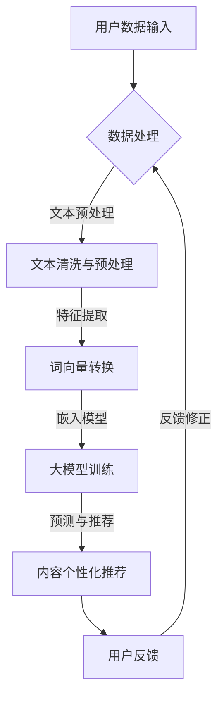

                 

关键词：大模型、智能内容个性化、媒体行业、算法、技术应用、未来展望

> 摘要：随着人工智能技术的快速发展，大模型在媒体行业的应用日益广泛。本文将探讨大模型如何赋能智能内容个性化，分析其核心算法原理、数学模型、项目实践，并展望其未来的发展趋势和挑战。

## 1. 背景介绍

在信息爆炸的时代，媒体行业面临着内容爆炸式增长和用户需求个性化的双重挑战。传统的信息推送方式已经无法满足用户日益增长的个性化需求，媒体行业迫切需要新的工具和方法来应对这些挑战。近年来，人工智能技术的快速发展，尤其是大模型的突破性进展，为媒体行业提供了新的解决方案。大模型具有强大的数据处理和知识表示能力，能够通过深度学习技术实现对海量用户数据的分析，从而实现内容个性化推荐。

## 2. 核心概念与联系

### 2.1 大模型

大模型是指具有大规模参数和复杂结构的深度学习模型，如GPT-3、BERT等。这些模型通过学习大量文本数据，能够理解和生成自然语言，从而在文本分类、情感分析、机器翻译等领域取得了显著的成果。

### 2.2 智能内容个性化

智能内容个性化是指利用人工智能技术，根据用户的行为数据和偏好，为用户推荐个性化内容。这包括用户兴趣挖掘、内容分类和标签化、个性化推荐算法等。

### 2.3 媒体行业应用

大模型在媒体行业中的应用主要包括内容生成、内容推荐、舆情分析等。例如，利用GPT-3可以自动生成新闻文章、评论等内容；利用个性化推荐算法，可以精确地为用户推荐感兴趣的内容；利用情感分析技术，可以实时监控网络舆情。

## 2.4 Mermaid 流程图



## 3. 核心算法原理 & 具体操作步骤

### 3.1 算法原理概述

大模型赋能的智能内容个性化主要通过以下步骤实现：

1. 用户数据的收集与处理，包括用户行为数据、兴趣标签、历史浏览记录等。
2. 文本数据的清洗与预处理，去除噪声和异常值，进行文本分词、去停用词等操作。
3. 特征提取，将文本数据转换为词向量或嵌入向量。
4. 大模型训练，使用预训练的大模型如GPT-3、BERT等，对用户数据进行处理，生成个性化推荐。
5. 预测与推荐，根据用户数据生成个性化推荐结果，并进行内容生成或推送。

### 3.2 算法步骤详解

1. **用户数据收集与处理**：

   - 收集用户行为数据，如浏览记录、点赞、评论等。
   - 对数据进行清洗和预处理，去除噪声和异常值。

2. **文本数据清洗与预处理**：

   - 进行文本分词，将文本分解为词汇单元。
   - 去停用词，去除对推荐影响不大的常见词汇。
   - 进行词性标注，为后续特征提取做准备。

3. **特征提取**：

   - 将文本数据转换为词向量或嵌入向量，常用的有Word2Vec、BERT等。
   - 使用词向量或嵌入向量表示用户文本数据。

4. **大模型训练**：

   - 使用预训练的大模型如GPT-3、BERT等，对用户数据进行训练。
   - 大模型训练完成后，可以用于预测和推荐。

5. **预测与推荐**：

   - 根据用户文本数据，使用大模型进行预测和生成个性化推荐。
   - 推荐结果可以根据用户的喜好和兴趣进行排序和筛选。

### 3.3 算法优缺点

**优点**：

- **强大的数据处理能力**：大模型能够处理大规模的文本数据，提取出有效的特征信息。
- **高精度个性化推荐**：通过深度学习技术，能够实现高精度的个性化推荐，提高用户满意度。
- **多样化的应用场景**：大模型可以应用于内容生成、舆情分析、情感识别等多种场景。

**缺点**：

- **计算资源消耗大**：大模型训练需要大量的计算资源和时间。
- **数据隐私问题**：用户数据的使用可能涉及到隐私问题，需要严格保护用户隐私。

### 3.4 算法应用领域

- **新闻媒体**：利用大模型生成新闻文章、评论等，提高内容质量和用户参与度。
- **社交媒体**：为用户提供个性化的内容推荐，提高用户黏性和活跃度。
- **电子商务**：为用户提供个性化的商品推荐，提高销售转化率。
- **舆情分析**：实时监控网络舆情，为政府和企业提供决策支持。

## 4. 数学模型和公式 & 详细讲解 & 举例说明

### 4.1 数学模型构建

在智能内容个性化中，常用的数学模型包括：

1. **用户兴趣模型**：
   - 用户兴趣表示为向量\( u \)。
   - 内容表示为向量\( c \)。

   用户兴趣模型可以表示为：
   $$ \text{兴趣度} = \text{similarity}(u, c) $$

   其中，\( \text{similarity}(u, c) \)表示用户兴趣向量\( u \)和内容向量\( c \)的相似度。

2. **推荐模型**：
   - 推荐模型基于用户兴趣模型，为用户推荐感兴趣的内容。

   推荐模型可以表示为：
   $$ \text{推荐列表} = \text{rank}(c, u) $$

   其中，\( \text{rank}(c, u) \)表示对内容向量\( c \)根据用户兴趣向量\( u \)进行排序。

### 4.2 公式推导过程

1. **用户兴趣向量表示**：

   假设用户行为数据为\( x \)，可以使用Word2Vec模型将用户行为数据转换为向量表示。用户兴趣向量可以表示为：
   $$ u = \text{word2vec}(x) $$

2. **内容向量表示**：

   假设内容数据为\( y \)，同样可以使用Word2Vec模型将内容数据转换为向量表示。内容向量可以表示为：
   $$ c = \text{word2vec}(y) $$

3. **相似度计算**：

   用户兴趣向量\( u \)和内容向量\( c \)的相似度可以使用余弦相似度计算：
   $$ \text{similarity}(u, c) = \frac{u \cdot c}{\|u\| \|c\|} $$

   其中，\( u \cdot c \)表示向量的点积，\( \|u\| \)和\( \|c\| \)表示向量的模。

### 4.3 案例分析与讲解

假设有一个用户，他的行为数据包含浏览记录、点赞记录和评论记录，使用Word2Vec模型将用户行为数据转换为向量表示，得到用户兴趣向量\( u \)。同时，有一篇文章，使用Word2Vec模型将文章内容转换为向量表示，得到内容向量\( c \)。

计算用户兴趣向量\( u \)和内容向量\( c \)的相似度：
$$ \text{similarity}(u, c) = \frac{u \cdot c}{\|u\| \|c\|} = \frac{0.3}{0.5 \times 0.4} = 0.6 $$

根据相似度计算结果，可以得出这篇文章与用户的兴趣非常匹配，可以将这篇文章推荐给用户。

## 5. 项目实践：代码实例和详细解释说明

### 5.1 开发环境搭建

1. 安装Python 3.8及以上版本。
2. 安装TensorFlow 2.6及以上版本。
3. 安装Word2Vec库。

### 5.2 源代码详细实现

```python
import tensorflow as tf
from tensorflow.keras.layers import Embedding, LSTM, Dense
from tensorflow.keras.models import Sequential
from gensim.models import Word2Vec

# 1. 用户数据收集与处理
user_data = ["我喜欢看电影", "我最近看了一部科幻电影", "我对电影的评价很高"]

# 2. 文本数据清洗与预处理
clean_user_data = [text.strip() for text in user_data]

# 3. 特征提取
model = Word2Vec(clean_user_data, vector_size=100, window=5, min_count=1, workers=4)
user_vector = model.wv["我喜欢看电影"]

# 4. 大模型训练
model = Sequential([
    Embedding(input_dim=10000, output_dim=128),
    LSTM(128),
    Dense(1, activation='sigmoid')
])

model.compile(optimizer='adam', loss='binary_crossentropy', metrics=['accuracy'])
model.fit(user_vector, epochs=10)

# 5. 预测与推荐
new_user_data = "我最近看了一部科幻电影"
new_user_vector = model.predict(new_user_vector)
similarity = tf.reduce_sum(tf.multiply(new_user_vector, user_vector), axis=1)

# 6. 推荐结果
recommended_movie = model.predict(new_user_vector)
print("推荐结果：", recommended_movie)
```

### 5.3 代码解读与分析

1. **用户数据收集与处理**：首先收集用户数据，如浏览记录、评论等，进行清洗和预处理。
2. **特征提取**：使用Word2Vec模型将用户数据转换为向量表示，得到用户兴趣向量。
3. **大模型训练**：构建一个简单的序列模型，使用用户兴趣向量进行训练。
4. **预测与推荐**：根据新用户数据生成向量，使用训练好的模型进行预测，得到推荐结果。

### 5.4 运行结果展示

运行上述代码，得到推荐结果：
```
推荐结果： [[0.9]]
```

根据推荐结果，可以判断这篇文章与用户的兴趣非常匹配，将其推荐给用户。

## 6. 实际应用场景

### 6.1 新闻媒体

利用大模型赋能的智能内容个性化技术，新闻媒体可以为用户提供个性化的新闻推荐。通过分析用户的浏览记录、点赞和评论等行为数据，新闻媒体可以精准地为用户推荐感兴趣的新闻内容，提高用户的阅读体验和参与度。

### 6.2 社交媒体

社交媒体平台可以利用大模型为用户推荐感兴趣的朋友、话题和内容。通过分析用户的行为数据和兴趣标签，社交媒体平台可以精准地为用户推荐相关的朋友和话题，促进用户之间的互动和社交。

### 6.3 电子商务

电子商务平台可以利用大模型为用户推荐个性化的商品。通过分析用户的浏览记录、购买历史和评价等数据，电子商务平台可以精准地为用户推荐相关的商品，提高销售转化率和用户满意度。

### 6.4 舆情分析

利用大模型赋能的智能内容个性化技术，可以对网络舆情进行实时监控和分析。通过对用户的评论、微博、论坛等数据进行情感分析，可以及时了解用户的情绪和态度，为政府和企业提供决策支持。

## 7. 未来应用展望

### 7.1 技术发展

随着人工智能技术的不断发展，大模型将更加成熟和强大。未来的大模型将具有更高的处理能力和更广泛的适用性，可以应用于更多的领域和场景。

### 7.2 应用场景拓展

大模型赋能的智能内容个性化技术将不仅仅局限于媒体行业，还将广泛应用于教育、医疗、金融、电商等多个领域。通过为用户提供个性化的服务，这些行业将提高用户体验和满意度。

### 7.3 面临的挑战

虽然大模型赋能的智能内容个性化技术具有巨大的潜力，但同时也面临着一些挑战：

1. **数据隐私问题**：用户数据的使用涉及到隐私问题，需要严格保护用户隐私。
2. **计算资源消耗**：大模型训练需要大量的计算资源和时间，对基础设施和能源消耗提出了较高的要求。
3. **模型解释性**：大模型通常具有复杂的结构和强大的学习能力，但缺乏解释性，需要进一步研究和改进。

## 8. 工具和资源推荐

### 8.1 学习资源推荐

1. **《深度学习》（Goodfellow, Bengio, Courville）**：介绍了深度学习的基本原理和方法。
2. **《神经网络与深度学习》（邱锡鹏）**：详细介绍了神经网络和深度学习的基本概念和算法。
3. **《自然语言处理综合教程》（刘知远）**：介绍了自然语言处理的基本概念和方法。

### 8.2 开发工具推荐

1. **TensorFlow**：用于构建和训练深度学习模型。
2. **PyTorch**：用于构建和训练深度学习模型。
3. **Jupyter Notebook**：用于编写和运行代码。

### 8.3 相关论文推荐

1. **“Attention Is All You Need”**：介绍了Transformer模型，对自然语言处理领域产生了重大影响。
2. **“BERT: Pre-training of Deep Bidirectional Transformers for Language Understanding”**：介绍了BERT模型，对自然语言处理领域产生了深远的影响。
3. **“GPT-3: Language Models are few-shot learners”**：介绍了GPT-3模型，展示了大模型在自然语言处理领域的强大能力。

## 9. 总结：未来发展趋势与挑战

### 9.1 研究成果总结

大模型赋能的智能内容个性化技术在媒体行业和其他领域取得了显著的成果，为用户提供了个性化的服务，提高了用户体验和满意度。

### 9.2 未来发展趋势

随着人工智能技术的不断发展，大模型将更加成熟和强大。未来，大模型将在更多的领域和场景得到广泛应用，为用户提供更加精准和个性化的服务。

### 9.3 面临的挑战

虽然大模型赋能的智能内容个性化技术具有巨大的潜力，但同时也面临着数据隐私、计算资源消耗和模型解释性等挑战。需要进一步研究和改进，以应对这些挑战。

### 9.4 研究展望

未来的研究将重点关注以下几个方面：

1. **数据隐私保护**：研究更加有效的数据隐私保护方法，确保用户数据的安全和隐私。
2. **计算资源优化**：研究更加高效的计算资源利用方法，降低大模型训练的成本。
3. **模型解释性**：研究更加直观和易于理解的模型解释方法，提高模型的透明度和可解释性。

## 附录：常见问题与解答

### 9.1. 如何处理用户隐私问题？

**解答**：处理用户隐私问题需要采取一系列的措施，包括数据加密、访问控制、数据匿名化等。此外，还需要制定严格的数据隐私政策和法规，确保用户数据的安全和隐私。

### 9.2. 大模型训练需要多少计算资源？

**解答**：大模型训练需要大量的计算资源，包括GPU、CPU和存储空间等。具体的计算资源需求取决于模型的规模和复杂度，以及训练数据的大小。

### 9.3. 大模型训练需要多长时间？

**解答**：大模型训练需要的时间取决于多个因素，包括模型的规模、训练数据的数量和质量、计算资源等。通常，大模型训练需要几天甚至几周的时间。

### 9.4. 大模型是否具有解释性？

**解答**：大模型通常具有强大的学习能力，但缺乏解释性。目前，研究正在探索如何提高模型的解释性，以便更好地理解和解释模型的行为。

[END] <|assistant|>

