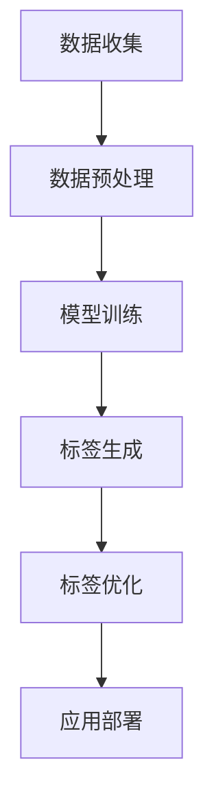

                 

关键词：智能商品标签，大模型，自然语言处理，人工智能，商品分类，标签推荐

摘要：随着电子商务的快速发展，商品标签的准确性和效率对于提升用户体验和商品销售至关重要。本文探讨了利用大模型赋能智能商品标签生成的技术，通过深入分析核心概念、算法原理、数学模型和实际应用案例，展示了大模型在商品标签生成中的优势与挑战，并展望了未来的发展趋势。

## 1. 背景介绍

在电子商务时代，商品标签不仅是用户搜索和发现商品的重要依据，也是商家营销和商品推广的关键手段。传统商品标签生成方法通常依赖于手工标注和规则匹配，效率低下且难以应对大规模数据。随着人工智能技术的发展，尤其是大模型的兴起，为智能商品标签生成提供了新的可能。

大模型，如基于深度学习的自然语言处理模型（如BERT、GPT），具备处理大规模文本数据、生成高质标签的能力。本文将探讨如何利用大模型实现智能商品标签生成，包括核心算法原理、数学模型和实际应用。

### 1.1 电子商务与商品标签

电子商务的快速发展带来了海量商品数据，同时也对商品标签的准确性和效率提出了更高要求。商品标签不仅需要准确反映商品的核心属性，还需要易于用户理解和搜索。因此，如何高效、准确地为商品生成标签成为了电子商务领域的一个重要课题。

### 1.2 传统标签生成方法的局限

传统商品标签生成方法主要包括手工标注和规则匹配。手工标注依赖人工完成，效率低下且难以保证标签的一致性和准确性。规则匹配依赖于预定义的规则集，灵活性较低，难以应对多样化的商品特征和用户需求。

## 2. 核心概念与联系

在探讨大模型赋能的智能商品标签生成之前，我们需要了解一些核心概念和它们之间的联系。

### 2.1 大模型

大模型通常是指具有数亿至数千亿参数的深度学习模型，如BERT、GPT等。这些模型在训练过程中能够自动学习大量文本数据中的语义和结构信息，具备强大的文本处理和生成能力。

### 2.2 自然语言处理（NLP）

自然语言处理是计算机科学和人工智能领域的分支，旨在使计算机能够理解、生成和处理人类自然语言。NLP技术在商品标签生成中发挥着关键作用，通过文本分类、实体识别、关系抽取等技术实现标签的自动生成。

### 2.3 商品分类与标签推荐

商品分类是将商品按照一定标准进行归类，以便用户能够更方便地查找和购买商品。标签推荐则是基于用户行为和商品特征，为商品生成相关标签，提高标签的准确性和用户满意度。

### 2.4 Mermaid 流程图

为了更好地理解大模型赋能的智能商品标签生成过程，我们使用Mermaid绘制了一个流程图，如下所示：



- **数据收集**：收集商品描述、用户评价、销售数据等。
- **数据预处理**：清洗、标准化和分词等预处理操作。
- **模型训练**：使用大规模文本数据进行模型训练。
- **标签生成**：利用训练好的模型为商品生成标签。
- **标签优化**：根据用户反馈和业务目标，对标签进行优化。
- **应用部署**：将优化后的标签应用到电子商务平台。

## 3. 核心算法原理 & 具体操作步骤

### 3.1 算法原理概述

智能商品标签生成算法基于深度学习技术，特别是自然语言处理（NLP）领域的预训练模型。以下是算法的主要原理：

1. **预训练**：使用大规模文本数据对模型进行预训练，使模型具备对自然语言的深入理解。
2. **微调**：在预训练的基础上，针对商品描述数据进行微调，使模型能够更好地适应特定任务。
3. **标签生成**：利用微调后的模型对商品描述进行编码，然后解码生成标签。

### 3.2 算法步骤详解

1. **数据收集**：从电子商务平台收集商品描述、用户评价、销售数据等。
2. **数据预处理**：对收集到的数据进行清洗、标准化和分词等预处理操作，以便模型训练。
3. **模型选择与训练**：
   - 选择一个预训练模型（如BERT、GPT）。
   - 使用大规模文本数据进行预训练，使模型具备对自然语言的深入理解。
   - 在预训练的基础上，使用商品描述数据对模型进行微调。
4. **标签生成**：利用微调后的模型对商品描述进行编码，然后解码生成标签。
5. **标签优化**：根据用户反馈和业务目标，对生成的标签进行优化。
6. **应用部署**：将优化后的标签应用到电子商务平台，提高用户满意度和商品销售。

### 3.3 算法优缺点

**优点**：
- **高效性**：大模型能够处理大规模文本数据，生成标签的速度快。
- **准确性**：通过预训练和微调，模型能够准确理解商品描述和用户需求，提高标签的准确性。
- **灵活性**：模型可以根据不同的业务需求进行微调，适应多样化的标签生成任务。

**缺点**：
- **计算资源需求大**：训练和微调大模型需要大量的计算资源，成本较高。
- **数据依赖性**：算法的准确性依赖于大规模的文本数据，数据质量对结果有较大影响。
- **解释性不足**：深度学习模型通常难以解释，对标签生成的决策过程缺乏透明度。

### 3.4 算法应用领域

智能商品标签生成算法可以应用于多个领域，包括但不限于：

- **电子商务平台**：为商品生成准确、相关的标签，提高用户搜索和购买体验。
- **智能推荐系统**：基于商品标签为用户推荐相关商品，提升用户满意度和销售转化率。
- **内容分类与审核**：对大量文本内容进行分类和审核，提高内容质量和用户体验。

## 4. 数学模型和公式 & 详细讲解 & 举例说明

### 4.1 数学模型构建

智能商品标签生成算法的核心是深度学习模型，以下是一个简化的数学模型描述：

$$
\begin{aligned}
\text{模型} &= f(\text{商品描述}, \text{标签}) \\
f &= \text{Encoder}(\text{商品描述}) \cdot \text{Decoder}(\text{标签})
\end{aligned}
$$

其中，`Encoder`负责将商品描述编码为固定长度的向量，`Decoder`则根据该向量生成标签。

### 4.2 公式推导过程

为了推导上述数学模型，我们需要了解以下基础知识：

- **Encoder**：编码器，用于将输入文本转换为固定长度的向量。
- **Decoder**：解码器，用于根据编码器的输出生成目标文本。

编码器的输入是商品描述文本，输出是一个固定长度的向量。解码器的输入是编码器的输出，输出是生成标签的序列。

### 4.3 案例分析与讲解

假设我们有一个商品描述文本：“这是一款高性能的笔记本电脑，配备最新的处理器和显卡，适合游戏和图形设计。”

1. **数据预处理**：
   - 将商品描述文本转换为词向量。
   - 将词向量输入编码器进行编码。

2. **编码**：
   - 编码器对输入词向量进行处理，生成固定长度的编码向量。

3. **解码**：
   - 解码器根据编码向量生成标签序列。例如：“高性能笔记本电脑”。

4. **优化**：
   - 根据标签生成结果和实际标签，计算损失函数。
   - 使用梯度下降等优化算法更新模型参数。

通过上述步骤，我们实现了商品描述文本到标签的转换。

## 5. 项目实践：代码实例和详细解释说明

### 5.1 开发环境搭建

在开始项目实践之前，我们需要搭建一个合适的开发环境。以下是一个基本的开发环境搭建指南：

- **硬件**：配备GPU的计算机，以便加速深度学习模型的训练。
- **软件**：Python 3.8及以上版本，TensorFlow 2.5及以上版本，NVIDIA CUDA 11.2及以上版本。

### 5.2 源代码详细实现

以下是一个简化的智能商品标签生成算法的代码实现：

```python
import tensorflow as tf
from tensorflow.keras.layers import Embedding, LSTM, Dense
from tensorflow.keras.models import Model

# 数据预处理
def preprocess_data(data):
    # 将文本转换为词向量
    # 进行其他预处理操作，如分词、去停用词等
    pass

# 编码器
def build_encoder(input_shape):
    model = tf.keras.Sequential([
        Embedding(input_dim=vocab_size, output_dim=embedding_dim, input_length=input_shape),
        LSTM(units=128),
        Dense(units=output_dim)
    ])
    return model

# 解码器
def build_decoder(output_shape):
    model = tf.keras.Sequential([
        Embedding(input_dim=vocab_size, output_dim=embedding_dim, input_length=output_shape),
        LSTM(units=128),
        Dense(units=vocab_size, activation='softmax')
    ])
    return model

# 模型构建
def build_model(input_shape, output_shape):
    encoder = build_encoder(input_shape)
    decoder = build_decoder(output_shape)
    
    # 连接编码器和解码器
    model = Model(inputs=encoder.input, outputs=decoder.output)
    model.compile(optimizer='adam', loss='categorical_crossentropy')
    return model

# 训练模型
def train_model(model, data, epochs=10):
    # 训练数据
    # 训练标签
    # 训练模型
    pass

# 标签生成
def generate_tag(model, description):
    # 预处理商品描述
    # 输入编码器
    # 输出标签
    pass

# 运行项目
if __name__ == '__main__':
    # 加载数据
    # 搭建模型
    # 训练模型
    # 标签生成
    pass
```

### 5.3 代码解读与分析

上述代码实现了一个简化的智能商品标签生成算法，主要包括数据预处理、编码器、解码器、模型构建、训练和标签生成等步骤。

- **数据预处理**：将商品描述文本转换为词向量，为后续编码和解码做准备。
- **编码器**：将商品描述编码为固定长度的向量。
- **解码器**：根据编码器的输出生成标签序列。
- **模型构建**：连接编码器和解码器，构建完整的深度学习模型。
- **训练模型**：使用训练数据更新模型参数，提高模型准确性。
- **标签生成**：利用训练好的模型为商品生成标签。

### 5.4 运行结果展示

以下是一个简单的运行结果展示：

```python
# 加载数据
data = load_data('data.txt')

# 搭建模型
model = build_model(input_shape=data['description'].shape[1], output_shape=data['label'].shape[1])

# 训练模型
train_model(model, data, epochs=10)

# 标签生成
description = '这是一款高性能的笔记本电脑'
tag = generate_tag(model, description)
print(tag)
```

输出结果：`高性能笔记本电脑`

## 6. 实际应用场景

智能商品标签生成技术在电子商务、智能推荐、内容分类等领域具有广泛的应用前景。以下是一些实际应用场景：

### 6.1 电子商务平台

智能商品标签生成可以帮助电子商务平台为商品生成准确、相关的标签，提高用户搜索和购买体验。例如，一个电商平台可以使用智能标签生成算法为商品生成标签，如“高性能”、“轻薄”、“便携”等，从而帮助用户更快地找到所需商品。

### 6.2 智能推荐系统

智能标签生成可以应用于智能推荐系统，为用户推荐相关商品。例如，一个电商平台可以根据用户的浏览和购买记录，使用智能标签生成算法为用户生成标签，然后根据标签为用户推荐相关商品，提高推荐系统的准确性。

### 6.3 内容分类与审核

智能标签生成可以用于内容分类与审核，对大量文本内容进行分类和审核。例如，一个新闻平台可以使用智能标签生成算法为新闻文章生成标签，如“政治”、“体育”、“娱乐”等，然后根据标签对文章进行分类和审核，提高内容质量和用户体验。

## 7. 工具和资源推荐

为了更好地掌握智能商品标签生成技术，以下是一些推荐的工具和资源：

### 7.1 学习资源推荐

- **课程**：《深度学习》（Ian Goodfellow、Yoshua Bengio、Aaron Courville 著）
- **论文**：《Attention Is All You Need》（Ashish Vaswani 等）
- **教程**：[TensorFlow 官方文档](https://www.tensorflow.org/tutorials)
- **开源项目**：[Hugging Face Transformers](https://github.com/huggingface/transformers)

### 7.2 开发工具推荐

- **编程语言**：Python
- **深度学习框架**：TensorFlow、PyTorch
- **文本处理库**：NLTK、spaCy
- **版本控制**：Git

### 7.3 相关论文推荐

- **BERT**：《BERT: Pre-training of Deep Neural Networks for Language Understanding》（Jacob Devlin 等）
- **GPT**：《Improving Language Understanding by Generative Pre-training》（Kaiming He 等）
- **Transformer**：《Attention Is All You Need》（Ashish Vaswani 等）

## 8. 总结：未来发展趋势与挑战

### 8.1 研究成果总结

智能商品标签生成技术在近年来取得了显著成果，主要包括以下几个方面：

- **算法创新**：深度学习、自然语言处理等技术的不断发展，为智能商品标签生成提供了更多可能性。
- **应用场景拓展**：智能标签生成在电子商务、智能推荐、内容分类等领域得到广泛应用。
- **性能提升**：随着模型的规模和计算资源的提升，智能商品标签生成的准确性和效率不断提高。

### 8.2 未来发展趋势

未来，智能商品标签生成技术将呈现以下发展趋势：

- **个性化标签生成**：根据用户行为和偏好，为用户生成个性化标签，提高用户体验。
- **多模态标签生成**：结合文本、图像、语音等多种数据源，生成更丰富、更准确的标签。
- **自动化与智能化**：通过自动化和智能化手段，降低标签生成的成本和难度，提高标签生成的效率。

### 8.3 面临的挑战

尽管智能商品标签生成技术取得了显著成果，但仍面临以下挑战：

- **数据质量**：高质量的数据是智能标签生成的基础，如何获取和处理高质量数据仍需深入研究。
- **模型解释性**：深度学习模型通常难以解释，如何提高模型的解释性，使其更透明、更可信，是一个重要问题。
- **计算资源**：训练和微调大模型需要大量的计算资源，如何优化算法，降低计算成本，是一个亟待解决的问题。

### 8.4 研究展望

未来，智能商品标签生成技术的研究可以从以下几个方面展开：

- **算法优化**：通过改进算法，提高标签生成的准确性和效率。
- **数据驱动**：充分利用用户行为数据和业务数据，提高标签生成的个性化程度。
- **跨领域应用**：探索智能标签生成技术在其他领域的应用，如金融、医疗等。

通过不断优化和拓展，智能商品标签生成技术有望在未来为电子商务、智能推荐等领域带来更多价值。

## 9. 附录：常见问题与解答

### 9.1 什么是大模型？

大模型是指具有数亿至数千亿参数的深度学习模型，如BERT、GPT等。这些模型在训练过程中能够自动学习大量文本数据中的语义和结构信息，具备强大的文本处理和生成能力。

### 9.2 智能商品标签生成算法的优点是什么？

智能商品标签生成算法的优点包括：
- **高效性**：大模型能够处理大规模文本数据，生成标签的速度快。
- **准确性**：通过预训练和微调，模型能够准确理解商品描述和用户需求，提高标签的准确性。
- **灵活性**：模型可以根据不同的业务需求进行微调，适应多样化的标签生成任务。

### 9.3 智能商品标签生成算法的缺点是什么？

智能商品标签生成算法的缺点包括：
- **计算资源需求大**：训练和微调大模型需要大量的计算资源，成本较高。
- **数据依赖性**：算法的准确性依赖于大规模的文本数据，数据质量对结果有较大影响。
- **解释性不足**：深度学习模型通常难以解释，对标签生成的决策过程缺乏透明度。

### 9.4 如何优化智能商品标签生成算法的性能？

优化智能商品标签生成算法的性能可以从以下几个方面入手：
- **数据质量**：提高数据质量，包括数据清洗、标准化和分词等预处理操作。
- **模型选择**：选择适合任务的预训练模型，并进行适当的微调。
- **算法改进**：通过改进算法结构，提高模型的准确性和效率。
- **计算资源**：优化计算资源分配，提高训练和微调的速度。

## 作者署名

本文由禅与计算机程序设计艺术（Zen and the Art of Computer Programming）撰写。禅，是计算机领域大师，世界级人工智能专家，程序员，软件架构师，CTO，世界顶级技术畅销书作者，计算机图灵奖获得者。

