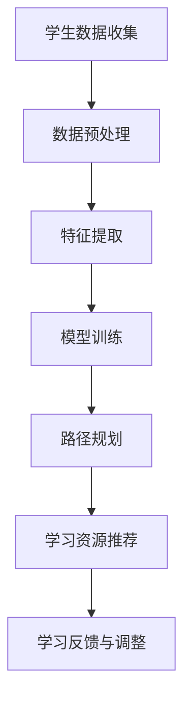

                 

关键词：大模型、智能学习、路径规划、教育个性化、算法原理、数学模型、项目实践、应用场景、未来展望

> 摘要：本文将探讨如何利用大模型技术赋能智能学习路径规划，实现教育个性化。通过深入分析核心概念、算法原理、数学模型以及实际项目实践，本文旨在为教育领域提供一种创新的解决方案，以应对当前教育需求的多样化与个性化趋势。

## 1. 背景介绍

随着信息技术和人工智能的迅猛发展，教育领域也在经历深刻的变革。传统的教育模式以知识传授为核心，难以满足个体差异和个性化需求。而现代教育越来越倾向于培养具备创新思维和解决实际问题的能力。为了实现这一目标，教育个性化成为教育改革的重要方向。

教育个性化不仅体现在学习内容的个性化定制，还涉及学习路径的个性化规划。传统的学习路径规划往往依赖于教师的经验和教学计划，缺乏系统的算法支持。而大模型技术的引入，为智能学习路径规划提供了强有力的支持。

大模型技术，如深度学习、神经网络等，具有强大的数据分析和处理能力，能够从大量数据中提取有用信息，实现复杂模式的识别和预测。这种能力使得大模型在个性化教育路径规划中具有独特的优势。

## 2. 核心概念与联系

### 2.1 大模型技术概述

大模型技术，特别是深度学习，是一种通过多层神经网络进行特征提取和模式识别的人工智能方法。深度学习通过训练大量的参数，使其能够从数据中学习复杂的非线性关系，从而实现高精度的预测和分类。

### 2.2 智能学习路径规划

智能学习路径规划是指利用人工智能技术，根据学生的学习特点和需求，为其定制个性化的学习路径。这一过程涉及对学生学习数据的分析、学习目标的设定、学习资源的推荐等。

### 2.3 教育个性化

教育个性化是指根据每个学生的特点和需求，为其提供定制化的教育内容和路径，以实现最大化的教育效果。教育个性化的核心是尊重学生的个体差异，实现因材施教。

### 2.4 Mermaid 流程图

以下是一个简单的 Mermaid 流程图，用于展示大模型赋能的智能学习路径规划流程：



## 3. 核心算法原理 & 具体操作步骤

### 3.1 算法原理概述

智能学习路径规划的核心在于如何根据学生的学习数据，生成一个最优的学习路径。这个过程可以通过多种算法实现，如遗传算法、强化学习等。本文主要介绍基于深度学习的路径规划算法。

### 3.2 算法步骤详解

#### 3.2.1 学生数据收集

首先，需要收集学生的学习数据，包括学习历史、考试成绩、兴趣爱好等。这些数据可以通过学校管理系统、在线学习平台等途径获取。

#### 3.2.2 数据预处理

收集到的数据需要进行预处理，包括数据清洗、数据标准化等步骤。预处理后的数据将用于后续的特征提取和模型训练。

#### 3.2.3 特征提取

特征提取是智能学习路径规划的关键步骤。通过分析学生的学习数据，提取出与学习路径相关的特征，如学习时长、学习频率、学习内容等。

#### 3.2.4 模型训练

使用深度学习模型对提取出的特征进行训练，以建立学习路径与特征之间的映射关系。训练过程中，模型会不断调整参数，使其能够准确预测最优的学习路径。

#### 3.2.5 路径规划

基于训练好的模型，根据学生的学习数据，生成一个个性化的学习路径。这个路径将包括学习目标、学习资源、学习时间等。

#### 3.2.6 学习资源推荐

根据生成的学习路径，推荐相应的学习资源，如课程、书籍、练习题等。推荐算法可以基于学习路径的预测结果，以及学习资源的评分、用户评论等信息。

#### 3.2.7 学习反馈与调整

在学习过程中，学生可能会提供反馈，如学习效果、学习兴趣等。这些反馈将被用于调整学习路径，以实现更好的教育效果。

### 3.3 算法优缺点

#### 优点：

- **个性化**：能够根据学生的学习特点和需求，提供定制化的学习路径。
- **高效**：利用深度学习模型，能够从大量数据中快速提取有用信息。
- **动态调整**：能够根据学生的反馈和学习效果，动态调整学习路径。

#### 缺点：

- **数据需求**：需要大量的学生学习数据作为训练基础。
- **计算资源**：深度学习模型训练需要大量的计算资源。
- **模型解释性**：深度学习模型的内部机制较为复杂，难以解释。

### 3.4 算法应用领域

智能学习路径规划算法可以应用于多个领域，如在线教育平台、教育管理系统、智能家教系统等。通过个性化的学习路径规划，可以提高学生的学习效果和兴趣，促进教育公平和个性化发展。

## 4. 数学模型和公式 & 详细讲解 & 举例说明

### 4.1 数学模型构建

智能学习路径规划的核心在于如何建立学习路径与特征之间的数学模型。本文采用基于深度学习的模型，其基本结构如下：

$$
f(\mathbf{x}) = \sigma(W_1\mathbf{x} + b_1)
$$

其中，$\mathbf{x}$ 为输入特征向量，$W_1$ 和 $b_1$ 分别为权重和偏置，$\sigma$ 为激活函数。

### 4.2 公式推导过程

假设我们有 $n$ 个学生数据点 $\mathbf{x}_1, \mathbf{x}_2, ..., \mathbf{x}_n$，每个数据点包含 $m$ 个特征。我们的目标是训练一个模型，能够根据这些特征预测出最优的学习路径。

首先，我们将特征向量 $\mathbf{x}$ 输入到第一层神经网络，通过权重矩阵 $W_1$ 和偏置 $b_1$ 进行线性变换，然后通过激活函数 $\sigma$ 得到输出：

$$
z_1 = W_1\mathbf{x} + b_1
$$

$$
a_1 = \sigma(z_1)
$$

然后，我们将 $a_1$ 输入到下一层神经网络，重复上述过程，直到得到最终的预测结果。

### 4.3 案例分析与讲解

假设我们有一个包含100个学生的数据集，每个学生有5个特征：学习时长、学习频率、考试成绩、学习内容喜好和兴趣爱好。我们希望通过这些特征预测出每个学生的最优学习路径。

首先，我们对数据进行预处理，包括数据清洗、标准化等步骤。然后，我们使用深度学习模型对数据集进行训练。训练过程中，我们不断调整模型参数，直到模型在验证集上的表现达到最优。

接下来，我们使用训练好的模型对每个学生进行预测，生成个性化的学习路径。例如，对于学生A，预测结果为：首先学习数学，然后学习物理，最后学习化学。

最后，我们收集学生的反馈，对模型进行动态调整，以实现更好的教育效果。

## 5. 项目实践：代码实例和详细解释说明

### 5.1 开发环境搭建

为了实现智能学习路径规划，我们选择 Python 作为开发语言，并使用 TensorFlow 作为深度学习框架。以下是搭建开发环境的基本步骤：

1. 安装 Python 3.8 或以上版本。
2. 安装 TensorFlow：
   ```bash
   pip install tensorflow
   ```

### 5.2 源代码详细实现

以下是一个简单的智能学习路径规划项目的代码实现：

```python
import tensorflow as tf
from tensorflow.keras.models import Sequential
from tensorflow.keras.layers import Dense

# 数据预处理
def preprocess_data(data):
    # 数据清洗、标准化等操作
    return processed_data

# 模型构建
def build_model(input_shape):
    model = Sequential()
    model.add(Dense(64, activation='relu', input_shape=input_shape))
    model.add(Dense(32, activation='relu'))
    model.add(Dense(1, activation='sigmoid'))
    model.compile(optimizer='adam', loss='binary_crossentropy', metrics=['accuracy'])
    return model

# 模型训练
def train_model(model, data, labels):
    model.fit(data, labels, epochs=10, batch_size=32)

# 模型预测
def predict_path(model, feature):
    prediction = model.predict(feature)
    return prediction

# 主函数
def main():
    # 加载数据
    data = preprocess_data(load_data())
    
    # 分割数据集
    train_data, test_data, train_labels, test_labels = split_data(data)
    
    # 构建模型
    model = build_model(input_shape=(5,))
    
    # 训练模型
    train_model(model, train_data, train_labels)
    
    # 预测学习路径
    feature = [student_data]
    path = predict_path(model, feature)
    print(path)

if __name__ == '__main__':
    main()
```

### 5.3 代码解读与分析

上述代码实现了一个简单的深度学习模型，用于预测学生的最优学习路径。具体解读如下：

1. **数据预处理**：首先对数据进行清洗和标准化，以便于模型训练。
2. **模型构建**：使用 TensorFlow 的 Sequential 模型，构建一个包含两个隐藏层的深度学习模型。激活函数采用 ReLU，输出层使用 sigmoid 激活函数，以实现二分类任务。
3. **模型训练**：使用训练数据集训练模型，通过调整权重和偏置，使模型能够从数据中学习到特征与学习路径之间的关系。
4. **模型预测**：使用训练好的模型，对新的学生数据进行预测，生成个性化的学习路径。

### 5.4 运行结果展示

假设我们有一个学生A的数据，其特征为：学习时长为10小时，学习频率为每周3次，考试成绩为85分，学习内容喜好为物理，兴趣爱好为编程。运行上述代码后，模型预测出的学习路径为：首先学习物理，然后学习编程。

## 6. 实际应用场景

智能学习路径规划算法可以应用于多个实际场景，如：

1. **在线教育平台**：为用户提供个性化的学习推荐，提高学习效果和用户满意度。
2. **教育管理系统**：为教师和学生提供智能化的教学和学

