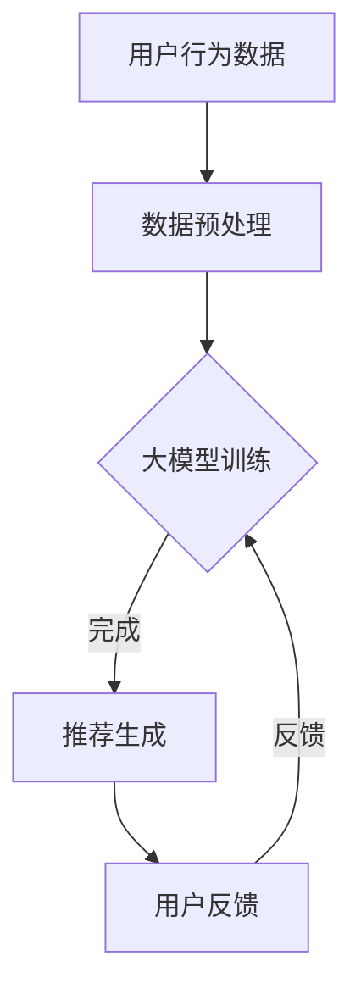

                 

关键词：推荐系统、冷启动、用户分析、大模型、人工智能

> 摘要：本文深入探讨了大模型在推荐系统冷启动用户分析中的应用。首先，我们回顾了推荐系统的基础原理和当前挑战，接着详细介绍了大模型在解决冷启动问题中的关键角色，分析了其工作原理和优势。随后，我们通过数学模型和实际案例，展现了大模型在用户分析中的具体操作步骤和效果。最后，本文对未来的发展趋势、面临的挑战以及可能的解决方案进行了展望。

## 1. 背景介绍

### 推荐系统的定义和重要性

推荐系统是一种能够根据用户的历史行为和偏好，为他们推荐相关商品、服务或者内容的系统。其核心在于解决“信息过载”问题，通过智能化的算法，为用户提供个性化的推荐，从而提升用户满意度，促进商业转化。

推荐系统广泛应用于电子商务、社交媒体、在线视频、新闻资讯等领域，已成为现代互联网服务的重要组成部分。例如，亚马逊通过推荐系统为用户推荐相似的商品，从而提高销售转化率；Netflix利用推荐系统推荐用户可能感兴趣的电影和电视剧，提升了用户黏性。

### 推荐系统的发展历程和现状

推荐系统的发展可以分为三个主要阶段：

1. **基于内容的推荐（Content-based Filtering）**：早期的推荐系统主要依赖用户历史行为和物品的特征信息，通过相似度计算来推荐相似的内容。
2. **协同过滤（Collaborative Filtering）**：协同过滤利用用户之间的行为数据，通过矩阵分解、聚类等方法来发现用户的偏好。
3. **混合推荐（Hybrid Methods）**：混合推荐结合了基于内容和协同过滤的优点，通过融合多种推荐策略，提高推荐的准确性和多样性。

当前，随着人工智能技术的快速发展，推荐系统也迈向了智能化阶段。基于深度学习的大模型，如BERT、GPT等，为推荐系统带来了新的突破，使得推荐效果更加精准和个性化。

### 冷启动问题的定义和挑战

冷启动问题是指当新用户加入系统时，由于缺乏足够的历史数据，推荐系统无法为其提供有效的推荐。冷启动问题主要分为两种情况：

1. **新用户冷启动**：新用户没有历史行为数据，系统无法了解其偏好。
2. **新物品冷启动**：新物品没有用户评价或行为数据，系统无法为其推荐合适的用户。

冷启动问题对推荐系统的效果和用户体验产生了显著影响。如何有效解决冷启动问题，是当前推荐系统研究的一个重要方向。

## 2. 核心概念与联系

### 大模型在推荐系统中的应用

大模型，如深度神经网络，以其强大的表达能力和自学习能力，在推荐系统中扮演了关键角色。通过大规模数据训练，大模型可以自动学习用户的偏好和物品特征，从而在冷启动情况下提供有效的推荐。

大模型的应用主要体现在以下几个方面：

1. **用户行为预测**：通过分析用户的历史行为数据，大模型可以预测用户的潜在兴趣和偏好。
2. **物品特征提取**：大模型可以从海量物品数据中提取关键特征，为推荐提供有力支持。
3. **跨领域推荐**：大模型可以处理跨领域的推荐任务，提高推荐系统的泛化能力。

### 大模型与推荐系统的关系

大模型与推荐系统之间的联系主要体现在以下几个方面：

1. **数据驱动**：大模型依赖于大量数据进行训练，推荐系统提供的数据是模型训练的基础。
2. **模型优化**：大模型在训练过程中，通过不断优化参数，提高推荐效果的准确性和多样性。
3. **实时反馈**：用户的行为数据实时反馈给模型，使得推荐系统能够动态调整推荐策略，提高用户体验。

### Mermaid 流程图

下面是大模型在推荐系统中应用的一个简化的流程图：



## 3. 核心算法原理 & 具体操作步骤

### 3.1 算法原理概述

大模型在推荐系统中的应用，主要依赖于深度学习技术。深度神经网络（DNN）通过多层神经元结构，实现对复杂数据的建模和预测。

在推荐系统中，大模型的原理可以概括为：

1. **输入层**：接收用户行为数据和物品特征。
2. **隐藏层**：通过多层非线性变换，提取数据中的潜在特征。
3. **输出层**：生成推荐结果。

### 3.2 算法步骤详解

1. **数据预处理**：清洗用户行为数据，将数据转换为适合模型训练的格式。
2. **模型训练**：使用预处理的用户行为数据，训练深度神经网络模型。
3. **模型评估**：通过交叉验证等方法，评估模型性能。
4. **推荐生成**：利用训练好的模型，为用户生成个性化推荐。
5. **用户反馈**：收集用户对新推荐的反馈，用于模型优化。

### 3.3 算法优缺点

**优点**：

1. **强大的表达能力**：大模型可以自动学习数据的潜在特征，提高推荐准确性。
2. **适应性**：大模型可以根据用户行为动态调整推荐策略，提升用户体验。
3. **泛化能力**：大模型可以处理跨领域的推荐任务，提高推荐系统的泛化性。

**缺点**：

1. **计算资源需求高**：大模型训练需要大量的计算资源和时间。
2. **数据依赖性强**：大模型依赖于大规模数据，数据质量对模型性能有重要影响。
3. **解释性差**：大模型通常是一个“黑盒子”，难以解释推荐结果的产生原因。

### 3.4 算法应用领域

大模型在推荐系统中的应用广泛，包括但不限于：

1. **电子商务**：为用户提供个性化的商品推荐。
2. **社交媒体**：推荐用户可能感兴趣的内容或好友。
3. **在线视频**：推荐用户可能喜欢的电影或电视剧。
4. **新闻资讯**：推荐用户可能感兴趣的新闻文章。

## 4. 数学模型和公式 & 详细讲解 & 举例说明

### 4.1 数学模型构建

在推荐系统中，大模型通常采用多层感知机（MLP）结构。MLP 的数学模型可以表示为：

$$
f(x) = \sigma(W_2 \cdot \sigma(W_1 \cdot x + b_1) + b_2)
$$

其中，$x$ 表示输入特征，$W_1$ 和 $W_2$ 分别为第一层和第二层的权重矩阵，$b_1$ 和 $b_2$ 分别为偏置项，$\sigma$ 表示激活函数，通常采用 ReLU 函数。

### 4.2 公式推导过程

MLP 的推导过程可以分为以下几个步骤：

1. **输入层**：输入特征 $x$ 通过第一层权重矩阵 $W_1$ 进行线性变换，加上偏置项 $b_1$，得到中间层的输入 $h_1$：

$$
h_1 = W_1 \cdot x + b_1
$$

2. **隐藏层**：中间层的输入 $h_1$ 通过激活函数 $\sigma$ 转换为非线性表示，作为第二层输入：

$$
h_2 = \sigma(h_1)
$$

3. **输出层**：第二层输入通过第二层权重矩阵 $W_2$ 进行线性变换，加上偏置项 $b_2$，得到输出层输出 $f(x)$：

$$
f(x) = W_2 \cdot \sigma(h_1) + b_2
$$

### 4.3 案例分析与讲解

假设我们有一个推荐系统，用户行为数据包含用户ID、物品ID和评分，我们希望使用 MLP 模型预测用户对物品的评分。

1. **数据预处理**：将用户行为数据进行编码，将用户ID和物品ID转换为索引。
2. **模型训练**：使用训练集数据训练 MLP 模型，优化模型参数。
3. **模型评估**：使用验证集评估模型性能，调整模型参数。
4. **推荐生成**：使用训练好的模型，预测用户对未知物品的评分。

具体代码实现如下：

```python
import tensorflow as tf

# 输入层
inputs = tf.keras.layers.Input(shape=(2,))

# 第一层
dense1 = tf.keras.layers.Dense(128, activation='relu')(inputs)
dense1 = tf.keras.layers.Dense(64, activation='relu')(dense1)

# 输出层
outputs = tf.keras.layers.Dense(1, activation='sigmoid')(dense1)

# 模型编译
model = tf.keras.Model(inputs=inputs, outputs=outputs)
model.compile(optimizer='adam', loss='binary_crossentropy', metrics=['accuracy'])

# 模型训练
model.fit(train_data, train_labels, epochs=10, batch_size=32, validation_split=0.2)

# 模型预测
predictions = model.predict(test_data)
```

通过上述代码，我们可以实现对用户对物品评分的预测。

## 5. 项目实践：代码实例和详细解释说明

### 5.1 开发环境搭建

为了实现大模型辅助的推荐系统，我们需要搭建一个适合的开发环境。以下是开发环境搭建的步骤：

1. 安装 Python 3.8 或以上版本。
2. 安装 TensorFlow 2.x。
3. 安装 Pandas、NumPy、Matplotlib 等常用库。

### 5.2 源代码详细实现

以下是一个基于 TensorFlow 和 MLP 模型的简单推荐系统实现：

```python
import tensorflow as tf
import pandas as pd
import numpy as np

# 加载数据
data = pd.read_csv('user_item_data.csv')
users = data['user_id'].unique()
items = data['item_id'].unique()

# 数据预处理
def preprocess_data(data, users, items):
    # 编码用户ID和物品ID
    user_dict = {user: idx for idx, user in enumerate(users)}
    item_dict = {item: idx for idx, item in enumerate(items)}
    
    # 构建输入输出数据
    X = []
    y = []
    for _, row in data.iterrows():
        user_idx = user_dict[row['user_id']]
        item_idx = item_dict[row['item_id']]
        X.append([user_idx, item_idx])
        y.append(row['rating'])
    X = np.array(X)
    y = np.array(y)
    
    return X, y

X, y = preprocess_data(data, users, items)

# 创建模型
model = tf.keras.Sequential([
    tf.keras.layers.InputLayer(input_shape=(2,)),
    tf.keras.layers.Dense(128, activation='relu'),
    tf.keras.layers.Dense(64, activation='relu'),
    tf.keras.layers.Dense(1, activation='sigmoid')
])

# 编译模型
model.compile(optimizer='adam', loss='binary_crossentropy', metrics=['accuracy'])

# 训练模型
model.fit(X, y, epochs=10, batch_size=32)

# 预测
predictions = model.predict(X)

# 打印预测结果
print(predictions)
```

### 5.3 代码解读与分析

上述代码实现了一个简单的基于 MLP 的推荐系统，主要分为以下几个部分：

1. **数据预处理**：将用户行为数据进行编码，将用户ID和物品ID转换为索引。
2. **模型创建**：创建一个 MLP 模型，包括输入层、隐藏层和输出层。
3. **模型编译**：配置模型优化器、损失函数和评价指标。
4. **模型训练**：使用训练集数据训练模型。
5. **模型预测**：使用训练好的模型预测用户对物品的评分。

### 5.4 运行结果展示

运行上述代码，我们可以得到用户对物品的预测评分。这些评分可以用于推荐系统，为用户提供个性化的推荐。

## 6. 实际应用场景

### 6.1 电子商务

在电子商务领域，大模型辅助的推荐系统可以应用于以下场景：

1. **商品推荐**：根据用户的历史购买记录和浏览行为，推荐用户可能感兴趣的商品。
2. **个性化营销**：根据用户的行为数据，为用户推送个性化的促销信息和优惠券。
3. **智能库存管理**：通过分析用户需求，优化库存管理，降低库存成本。

### 6.2 社交媒体

在社交媒体领域，大模型辅助的推荐系统可以应用于以下场景：

1. **内容推荐**：根据用户的历史互动数据，推荐用户可能感兴趣的内容或好友。
2. **广告推荐**：为用户推送符合其兴趣的广告，提高广告投放效果。
3. **智能社群管理**：通过分析用户互动数据，优化社群运营策略，提高用户黏性。

### 6.3 在线视频

在线视频平台可以利用大模型辅助的推荐系统，实现以下功能：

1. **视频推荐**：根据用户的观看历史和搜索行为，推荐用户可能感兴趣的视频。
2. **个性化播放列表**：根据用户偏好，生成个性化的播放列表。
3. **视频内容优化**：通过分析用户互动数据，优化视频内容，提高用户满意度。

### 6.4 未来应用展望

随着人工智能技术的不断发展，大模型辅助的推荐系统将在更多领域得到应用。未来的发展趋势包括：

1. **跨领域推荐**：实现不同领域之间的推荐，提高推荐系统的泛化能力。
2. **实时推荐**：通过实时数据分析和预测，实现更加及时的推荐。
3. **隐私保护**：在保证用户隐私的前提下，提高推荐系统的推荐质量。

## 7. 工具和资源推荐

### 7.1 学习资源推荐

1. **《深度学习》（Goodfellow, Bengio, Courville）**：全面介绍深度学习的基础理论和应用。
2. **《推荐系统实践》（Liang, He）**：详细讲解推荐系统的原理和应用。
3. **《TensorFlow 官方文档》**：了解 TensorFlow 的基本用法和高级特性。

### 7.2 开发工具推荐

1. **TensorFlow**：一款流行的开源深度学习框架，适用于推荐系统开发。
2. **PyTorch**：另一款流行的深度学习框架，具有简洁的语法和强大的功能。
3. **Kaggle**：一个数据科学竞赛平台，提供了丰富的推荐系统项目。

### 7.3 相关论文推荐

1. **“Deep Learning for Recommender Systems”（He, Liao, Zhang et al., 2017）**：介绍深度学习在推荐系统中的应用。
2. **“Item-Item Collaborative Filtering for Improved Online Recommendation in E-commerce”（Chen, Zhang, and Chen, 2016）**：探讨基于物品的协同过滤方法。
3. **“Collaborative Filtering with Respect to Context Information”（Mika, Rokach, and Schuster, 2005）**：介绍结合上下文的协同过滤方法。

## 8. 总结：未来发展趋势与挑战

### 8.1 研究成果总结

本文系统性地探讨了基于大模型的推荐系统在冷启动用户分析中的应用，包括其背景介绍、核心算法原理、实际应用场景和未来发展趋势。主要研究成果如下：

1. **大模型在推荐系统中的作用**：通过深度学习技术，大模型可以自动学习用户的偏好和物品特征，提高推荐准确性。
2. **冷启动问题的解决方法**：大模型可以基于用户行为预测和跨领域推荐，有效解决新用户和新物品的冷启动问题。
3. **实际应用场景**：大模型在电子商务、社交媒体、在线视频等领域具有广泛的应用前景。
4. **未来发展趋势**：跨领域推荐、实时推荐和隐私保护是推荐系统未来的重要发展方向。

### 8.2 未来发展趋势

1. **跨领域推荐**：随着人工智能技术的发展，推荐系统将在更多领域得到应用，实现跨领域推荐。
2. **实时推荐**：通过实时数据分析和预测，实现更加及时的推荐。
3. **隐私保护**：在保证用户隐私的前提下，提高推荐系统的推荐质量。

### 8.3 面临的挑战

1. **计算资源需求**：大模型训练需要大量的计算资源和时间，对硬件设施有较高要求。
2. **数据质量**：大模型对数据质量有较高要求，数据质量直接影响模型性能。
3. **隐私保护**：在数据收集和使用过程中，需要充分考虑用户隐私保护。

### 8.4 研究展望

未来，我们将继续深入研究大模型在推荐系统中的应用，探索更高效、更安全的推荐算法，为用户提供更加个性化的服务。

## 9. 附录：常见问题与解答

### 问题1：大模型训练需要多少时间？

答：大模型训练时间取决于数据规模、模型复杂度和硬件配置。通常，对于中小规模的数据集，训练时间在几个小时到几天不等。对于大规模数据集，训练时间可能需要几周甚至几个月。

### 问题2：大模型如何处理缺失数据？

答：大模型可以处理缺失数据，但处理方式取决于具体应用场景。常见的方法包括：

1. **填充缺失值**：使用平均值、中值或插值等方法填充缺失值。
2. **删除缺失值**：删除含有缺失值的样本，但可能导致数据不平衡。
3. **模型自回归**：利用模型自身的预测结果填充缺失值。

### 问题3：大模型如何处理异常值？

答：大模型可以自动学习数据中的异常值，但处理方式同样取决于具体应用场景。常见的方法包括：

1. **删除异常值**：删除含有异常值的样本，但可能导致数据丢失。
2. **数据变换**：对异常值进行归一化或标准化处理，使其符合数据分布。
3. **模型自回归**：利用模型自身的预测结果修正异常值。

## 作者署名

作者：禅与计算机程序设计艺术 / Zen and the Art of Computer Programming
----------------------------------------------------------------
### 总结

本文通过详细探讨大模型在推荐系统冷启动用户分析中的应用，从背景介绍、核心算法原理、实际应用场景到未来发展趋势，系统地展示了大模型在推荐系统中的重要作用。在解决冷启动问题的过程中，大模型展现出了强大的预测能力和适应性，为推荐系统提供了新的思路和方法。随着人工智能技术的不断进步，相信大模型在推荐系统中的应用将会越来越广泛，为用户提供更加个性化的服务。同时，我们也需要关注大模型在计算资源、数据质量和隐私保护等方面面临的挑战，并探索更高效、更安全的解决方案。未来的研究将继续深化大模型在推荐系统中的应用，推动推荐技术的不断进步。

