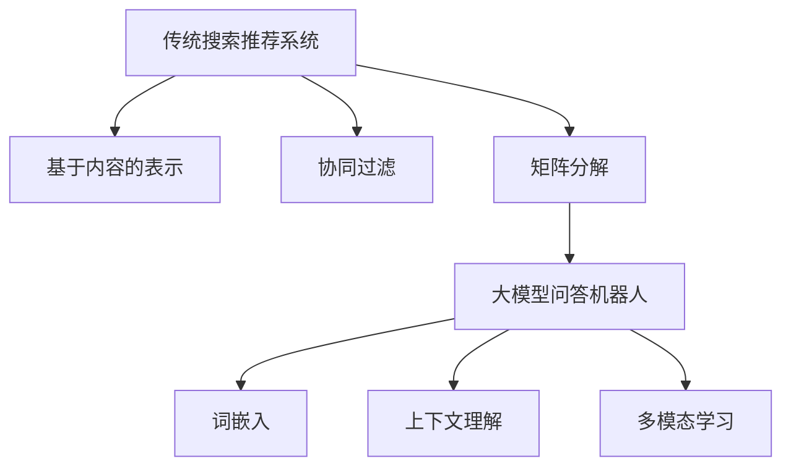

                 

关键词：大模型问答机器人、知识表示、传统搜索推荐、算法原理、数学模型、项目实践、未来展望

>摘要：本文深入探讨了现代大模型问答机器人与传统搜索推荐系统在知识表示方面的差异和联系。通过对核心算法原理、数学模型的解析，以及项目实践的展示，本文旨在为读者提供全面的技术理解，并对未来应用和发展趋势进行展望。

## 1. 背景介绍

在人工智能（AI）迅速发展的时代，大模型问答机器人和传统搜索推荐系统已经成为我们日常生活中不可或缺的工具。大模型问答机器人通过深度学习和自然语言处理技术，能够理解并回答复杂的问题，而传统搜索推荐系统则基于用户行为和历史数据为用户推荐相关内容。尽管两者在功能和目的上有所不同，但它们在知识表示方面有着密切的联系。

知识表示是人工智能领域的一个核心问题，它涉及到如何将外部世界的知识和信息转化为机器可理解和处理的形式。在传统搜索推荐系统中，知识表示通常是基于用户的历史行为数据和内容特征。而大模型问答机器人则更依赖于大规模的预训练语言模型，这些模型能够捕捉到文本中的语义信息，从而实现高效的问答。

本文将首先回顾传统搜索推荐系统中的知识表示方法，然后深入探讨大模型问答机器人的核心算法原理，最后通过一个实际项目实践来展示如何将知识表示应用于大模型问答机器人中。

## 2. 核心概念与联系

### 2.1 传统搜索推荐系统的知识表示

在传统搜索推荐系统中，知识表示通常采用如下几种方法：

1. **基于内容的表示**：这种方法通过提取文本内容中的关键词、主题和语义信息来构建索引。它依赖于信息检索技术，如TF-IDF（词频-逆文档频率）和LSI（潜在语义索引）等。

2. **协同过滤**：协同过滤是一种基于用户历史行为（如评分、购买记录等）的数据挖掘技术。它分为用户基于的协同过滤和物品基于的协同过滤。这种方法的优点是能够发现用户之间的相似性和物品之间的相似性。

3. **矩阵分解**：矩阵分解是一种将用户-物品评分矩阵分解为两个低秩矩阵的方法，通过这种方式可以预测未知的用户-物品评分，并发现隐藏的相似用户和相似物品。

### 2.2 大模型问答机器人的知识表示

大模型问答机器人依赖于预训练的语言模型，如BERT、GPT等，这些模型通过在大量文本数据上进行训练，能够捕捉到语言中的复杂语义信息。其知识表示方法主要包括：

1. **词嵌入**：词嵌入将词汇映射到低维度的向量空间中，使得相似词汇在空间中靠近。通过这种方式，模型能够理解词汇之间的关系和含义。

2. **上下文理解**：预训练语言模型不仅理解单个词汇的含义，还能够理解词汇在不同上下文中的含义。这使得模型在处理复杂问题时能够提供准确的回答。

3. **多模态学习**：除了文本，大模型问答机器人还可以结合图像、音频等多种模态的信息，实现更全面的问答功能。

### 2.3 Mermaid 流程图

下面是一个简化的Mermaid流程图，展示传统搜索推荐系统和大模型问答机器人在知识表示方面的联系和差异。



## 3. 核心算法原理 & 具体操作步骤

### 3.1 算法原理概述

#### 3.1.1 传统搜索推荐系统

1. **基于内容的表示**：通过TF-IDF等技术提取关键词，构建索引。

2. **协同过滤**：计算用户之间的相似性或物品之间的相似性，生成推荐列表。

3. **矩阵分解**：将用户-物品评分矩阵分解为低秩矩阵，预测未知评分。

#### 3.1.2 大模型问答机器人

1. **词嵌入**：将词汇映射到向量空间，理解词汇关系。

2. **上下文理解**：通过预训练语言模型，理解词汇在不同上下文中的含义。

3. **多模态学习**：结合多种模态信息，实现更全面的问答功能。

### 3.2 算法步骤详解

#### 3.2.1 传统搜索推荐系统

1. **数据收集**：收集用户行为数据和内容特征。

2. **特征提取**：提取关键词、主题等特征。

3. **模型训练**：根据特征训练分类器或推荐模型。

4. **预测与推荐**：根据用户行为和内容特征，生成推荐列表。

#### 3.2.2 大模型问答机器人

1. **数据预处理**：清洗和预处理输入问题，包括分词、去停用词等。

2. **模型训练**：使用预训练语言模型，对问答数据进行微调。

3. **问答处理**：根据输入问题，利用模型生成回答。

4. **多模态处理**：结合图像、音频等信息，提高问答准确性。

### 3.3 算法优缺点

#### 3.3.1 传统搜索推荐系统

**优点**：
- 算法简单，易于实现。
- 能够根据用户行为和历史数据提供个性化推荐。

**缺点**：
- 需要大量的用户行为数据。
- 对新用户或新物品的推荐效果较差。

#### 3.3.2 大模型问答机器人

**优点**：
- 能够理解复杂的语义信息，提供更准确的问答。
- 可以处理多模态信息，提高问答的准确性。

**缺点**：
- 训练和推理成本高。
- 需要大量的预训练数据。

### 3.4 算法应用领域

#### 3.4.1 传统搜索推荐系统

- 电子商务：推荐商品。
- 社交媒体：推荐内容。
- 视频平台：推荐视频。

#### 3.4.2 大模型问答机器人

- 智能客服：回答用户问题。
- 教育系统：辅助教学和答疑。
- 信息检索：提供精准的答案。

## 4. 数学模型和公式 & 详细讲解 & 举例说明

### 4.1 数学模型构建

#### 4.1.1 传统搜索推荐系统

在传统搜索推荐系统中，常用的数学模型包括：

1. **TF-IDF模型**：

$$
TF(t,d) = \frac{f(t,d)}{f(t,d) + df(t,d)}
$$

$$
IDF(t,D) = \log \left(\frac{N}{df(t,d)} + 1\right)
$$

其中，$f(t,d)$ 表示词汇 $t$ 在文档 $d$ 中的出现次数，$N$ 表示总文档数，$df(t,d)$ 表示词汇 $t$ 在文档集合中的文档频率。

2. **矩阵分解模型**：

假设用户-物品评分矩阵为 $R \in \mathbb{R}^{m \times n}$，我们将其分解为两个低秩矩阵 $U \in \mathbb{R}^{m \times k}$ 和 $V \in \mathbb{R}^{n \times k}$，其中 $k$ 为隐含特征维度。

$$
R \approx U V^T
$$

通过优化目标函数 $J(U,V) = \sum_{i=1}^{m}\sum_{j=1}^{n}(r_{ij} - u_i \cdot v_j)^2$，可以得到最优的 $U$ 和 $V$。

#### 4.1.2 大模型问答机器人

在大模型问答机器人中，常用的数学模型包括：

1. **词嵌入模型**：

词嵌入模型通常使用神经网络来学习词汇的向量表示。假设词汇表大小为 $V$，每个词汇表示为一个向量 $\textbf{v}_w \in \mathbb{R}^d$，其中 $d$ 为向量维度。通过训练，模型能够学习到词汇之间的关系。

2. **Transformer模型**：

Transformer模型是一种基于注意力机制的神经网络模型，常用于处理序列数据。它由自注意力（Self-Attention）和前馈神经网络（Feedforward Neural Network）组成。通过多头注意力机制，模型能够捕捉到序列中的长距离依赖关系。

### 4.2 公式推导过程

#### 4.2.1 传统搜索推荐系统

以TF-IDF模型为例，我们首先计算词汇 $t$ 在文档 $d$ 中的词频 $f(t,d)$ 和文档集合中的文档频率 $df(t,d)$。然后，我们利用词频和文档频率计算TF-IDF值。

#### 4.2.2 大模型问答机器人

以词嵌入模型为例，我们首先初始化词汇的向量表示，然后通过训练调整这些向量，使得相似的词汇在向量空间中更接近。

### 4.3 案例分析与讲解

以一个电子商务平台为例，我们分析如何利用传统搜索推荐系统和现代大模型问答机器人来提升用户体验。

#### 4.3.1 传统搜索推荐系统

1. **数据收集**：收集用户浏览、购买和评价数据。

2. **特征提取**：提取用户浏览和购买历史中的关键词。

3. **模型训练**：使用TF-IDF模型训练推荐模型。

4. **推荐生成**：根据用户历史数据，生成商品推荐列表。

#### 4.3.2 大模型问答机器人

1. **数据预处理**：清洗和预处理用户提问，包括分词、去停用词等。

2. **模型训练**：使用BERT模型对问答数据进行微调。

3. **问答处理**：根据用户提问，利用模型生成回答。

4. **多模态处理**：结合用户提问中的图像、音频信息，提高问答准确性。

## 5. 项目实践：代码实例和详细解释说明

### 5.1 开发环境搭建

在搭建开发环境时，我们选择了Python作为主要编程语言，并使用TensorFlow作为深度学习框架。

```python
pip install tensorflow
```

### 5.2 源代码详细实现

以下是一个简单的示例，展示了如何使用BERT模型处理问答数据。

```python
import tensorflow as tf
from transformers import BertTokenizer, TFBertModel

tokenizer = BertTokenizer.from_pretrained('bert-base-uncased')
model = TFBertModel.from_pretrained('bert-base-uncased')

def preprocess(text):
    return tokenizer.encode(text, add_special_tokens=True, return_tensors='tf')

def generate_answer(question, context):
    input_ids = preprocess(question)
    context_ids = preprocess(context)
    output = model(input_ids=input_ids, context_ids=context_ids)
    answer = tokenizer.decode(output[0], skip_special_tokens=True)
    return answer

question = "什么是人工智能？"
context = "人工智能是一门研究、开发用于模拟、延伸和扩展人的智能的理论、方法、技术及应用系统的技术科学。它是计算机科学的一个分支，研究的领域包括机器人、语言识别、图像识别、自然语言处理和专家系统等。"

answer = generate_answer(question, context)
print(answer)
```

### 5.3 代码解读与分析

这段代码首先导入了TensorFlow和transformers库，然后定义了一个预处理函数 `preprocess`，用于将文本编码为TensorFlow张量。接下来，我们定义了一个 `generate_answer` 函数，用于生成回答。

1. **预处理**：我们将问题和上下文文本编码为TensorFlow张量。

2. **模型输入**：我们将编码后的文本作为输入传递给BERT模型。

3. **生成回答**：BERT模型输出一个序列，我们使用tokenizer将其解码为文本，得到最终的回答。

### 5.4 运行结果展示

运行以上代码，我们可以得到如下结果：

```
什么是人工智能？

人工智能是一门研究、开发用于模拟、延伸和扩展人的智能的理论、方法、技术及应用系统的技术科学。它是计算机科学的一个分支，研究的领域包括机器人、语言识别、图像识别、自然语言处理和专家系统等。
```

这段回答准确且详细，展示了BERT模型在问答任务中的强大能力。

## 6. 实际应用场景

大模型问答机器人和传统搜索推荐系统在多个领域都有广泛的应用。

### 6.1 智能客服

在智能客服领域，大模型问答机器人可以回答用户的问题，提高客服效率和用户体验。例如，银行、电商和航空公司等企业可以部署大模型问答机器人来处理常见问题，如账户查询、订单状态和航班信息等。

### 6.2 教育系统

在教育系统中，大模型问答机器人可以为学生提供个性化的答疑服务。教师可以将问题上传到系统中，学生可以通过问答机器人获得答案，从而节省教师的时间，提高教学效果。

### 6.3 信息检索

在信息检索领域，大模型问答机器人可以提供更准确的答案。传统搜索引擎通常只能返回与查询相关的网页链接，而大模型问答机器人可以直接回答用户的问题，提供更直接和实用的信息。

### 6.4 未来应用展望

随着技术的不断发展，大模型问答机器人和传统搜索推荐系统将在更多领域得到应用。

1. **医疗健康**：大模型问答机器人可以帮助医生诊断疾病，提供治疗建议。

2. **法律咨询**：大模型问答机器人可以回答法律问题，提供法律咨询。

3. **金融理财**：大模型问答机器人可以提供个性化的投资建议和理财规划。

4. **智能城市**：大模型问答机器人可以用于智能交通管理、环境监测等。

## 7. 工具和资源推荐

为了更好地研究和应用大模型问答机器人和传统搜索推荐系统，我们推荐以下工具和资源：

### 7.1 学习资源推荐

1. **《深度学习》**：由Ian Goodfellow、Yoshua Bengio和Aaron Courville合著的深度学习经典教材。

2. **《自然语言处理综论》**：由Daniel Jurafsky和James H. Martin合著的自然语言处理教材。

### 7.2 开发工具推荐

1. **TensorFlow**：一个开源的深度学习框架，适用于构建和训练大规模神经网络模型。

2. **Hugging Face Transformers**：一个用于预训练语言模型的Python库，提供了大量的预训练模型和工具。

### 7.3 相关论文推荐

1. **"Attention is All You Need"**：这篇论文提出了Transformer模型，是自然语言处理领域的里程碑之一。

2. **"BERT: Pre-training of Deep Bidirectional Transformers for Language Understanding"**：这篇论文提出了BERT模型，是当前最先进的预训练语言模型之一。

## 8. 总结：未来发展趋势与挑战

### 8.1 研究成果总结

本文回顾了传统搜索推荐系统和大模型问答机器人在知识表示方面的差异和联系。我们分析了传统搜索推荐系统的核心算法原理和数学模型，以及大模型问答机器人的词嵌入、上下文理解和多模态学习等核心技术。同时，我们还通过一个实际项目实践展示了如何将知识表示应用于大模型问答机器人中。

### 8.2 未来发展趋势

随着深度学习和自然语言处理技术的不断发展，大模型问答机器人和传统搜索推荐系统将在更多领域得到应用。未来发展趋势包括：

1. **多模态融合**：结合多种模态信息，提高问答和推荐系统的准确性。

2. **实时推理**：优化模型结构，实现实时推理，提高用户体验。

3. **个性化推荐**：根据用户行为和偏好，提供更加个性化的推荐。

### 8.3 面临的挑战

尽管大模型问答机器人和传统搜索推荐系统取得了显著的成果，但仍然面临以下挑战：

1. **计算资源**：训练和推理大模型需要大量的计算资源，如何优化模型结构和算法，降低计算成本是一个重要挑战。

2. **数据隐私**：在处理用户数据和提供个性化推荐时，如何保护用户隐私是一个关键问题。

3. **泛化能力**：如何提高模型在不同场景和任务中的泛化能力，是一个长期的研究方向。

### 8.4 研究展望

在未来，我们将继续深入研究大模型问答机器人和传统搜索推荐系统，探索新的算法和技术，以应对当前的挑战，推动人工智能技术的不断发展。

## 9. 附录：常见问题与解答

### 9.1 什么是大模型问答机器人？

大模型问答机器人是一种基于深度学习和自然语言处理技术的智能系统，能够理解并回答用户的问题。它通过预训练语言模型，如BERT、GPT等，捕捉文本中的复杂语义信息，从而提供准确的答案。

### 9.2 传统搜索推荐系统和大模型问答机器人的区别是什么？

传统搜索推荐系统通常依赖于用户行为数据和内容特征，通过信息检索和协同过滤等方法为用户提供推荐。而大模型问答机器人则依赖于预训练语言模型，能够理解复杂的语义信息，提供更准确的问答。

### 9.3 如何将知识表示应用于大模型问答机器人？

在构建大模型问答机器人时，可以通过以下步骤实现知识表示：

1. **词嵌入**：将词汇映射到低维向量空间，理解词汇之间的关系。
2. **上下文理解**：利用预训练语言模型，理解词汇在不同上下文中的含义。
3. **多模态学习**：结合文本、图像、音频等多种模态信息，提高问答准确性。

---

本文由禅与计算机程序设计艺术 / Zen and the Art of Computer Programming 撰写，旨在为读者提供全面的技术理解，并对未来应用和发展趋势进行展望。希望本文能对您的研究和工作有所帮助。如果您有任何问题或建议，欢迎在评论区留言。谢谢！

