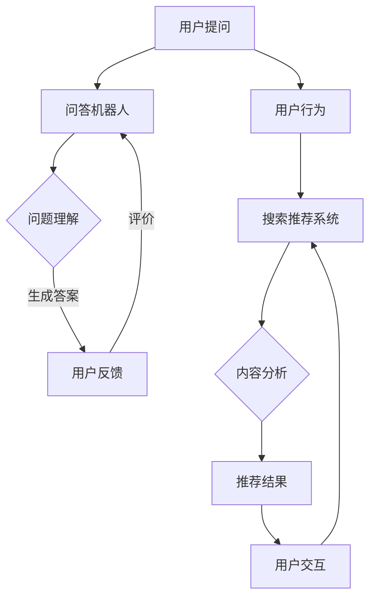

                 

关键词：大模型、问答机器人、搜索推荐、互补性、人工智能

摘要：本文深入探讨了大模型问答机器人和搜索推荐系统的互补性。通过对两者的技术原理、应用场景和融合策略进行分析，本文展示了如何利用这两种技术实现更高效、更智能的用户体验。

## 1. 背景介绍

随着人工智能技术的快速发展，大模型问答机器人和搜索推荐系统已成为智能服务领域的重要组成部分。问答机器人利用自然语言处理技术，可以理解和回答用户的问题，而搜索推荐系统则通过用户行为和内容分析，为用户提供个性化的信息推荐。

在互联网时代，信息过载已成为普遍现象。用户在寻找所需信息时，往往面临诸多困扰。问答机器人和搜索推荐系统正是在这样的背景下应运而生，旨在为用户提供更快捷、更精准的服务。然而，这两种系统各有优势与局限性，单独使用难以满足用户日益复杂的需求。本文将探讨如何通过互补性策略，将两者的优势结合起来，实现更智能的服务。

## 2. 核心概念与联系

### 2.1 大模型问答机器人

大模型问答机器人是一种基于深度学习的自然语言处理技术。它通过大规模语料库的训练，具备理解和生成自然语言的能力。具体来说，大模型问答机器人包括以下核心组成部分：

1. **语言模型**：用于生成和理解自然语言，如BERT、GPT等。
2. **问答系统**：包括问题理解、答案生成和回答验证等模块。
3. **知识库**：存储大量事实性知识，用于回答事实性问题。

### 2.2 搜索推荐系统

搜索推荐系统是一种基于用户行为和内容分析的信息过滤技术。它通过分析用户的历史行为、兴趣偏好和上下文环境，为用户推荐相关内容。搜索推荐系统主要包括以下组成部分：

1. **用户行为分析**：包括浏览记录、搜索历史、点赞评论等。
2. **内容分析**：分析文章、图片、视频等内容的主题、关键词、情感等。
3. **推荐算法**：如协同过滤、基于内容的推荐、混合推荐等。

### 2.3 Mermaid 流程图

以下是一个简单的 Mermaid 流程图，展示了大模型问答机器人和搜索推荐系统的基本架构及相互关系。



## 3. 核心算法原理 & 具体操作步骤

### 3.1 算法原理概述

大模型问答机器人的核心算法基于深度学习和自然语言处理技术。它通过训练大规模语料库，学习自然语言的结构和语义，从而实现理解和生成自然语言。搜索推荐系统的核心算法则基于机器学习和数据挖掘技术，通过分析用户行为和内容，为用户推荐相关内容。

### 3.2 算法步骤详解

#### 大模型问答机器人

1. **问题理解**：通过自然语言处理技术，将用户提问转换为机器可理解的形式。
2. **答案生成**：利用预训练的大规模语言模型，生成符合语义的答案。
3. **答案验证**：对比答案与知识库中的事实性信息，确保答案的准确性。
4. **用户反馈**：收集用户对答案的评价，用于优化问答系统。

#### 搜索推荐系统

1. **用户行为分析**：收集用户的历史行为数据，如浏览记录、搜索历史等。
2. **内容分析**：对用户感兴趣的内容进行分析，提取主题、关键词、情感等特征。
3. **推荐算法**：基于用户行为和内容特征，为用户推荐相关内容。
4. **用户交互**：收集用户对推荐内容的反馈，用于优化推荐系统。

### 3.3 算法优缺点

#### 大模型问答机器人

- **优点**：能够理解和回答复杂、开放性问题，具备一定的灵活性和创造力。
- **缺点**：在处理封闭式问题或缺乏足够训练数据的场景下，表现可能不佳。

#### 搜索推荐系统

- **优点**：基于用户行为和内容特征，推荐结果具有较高的相关性。
- **缺点**：难以应对用户需求的变化，可能陷入“过滤气泡”效应。

### 3.4 算法应用领域

- **大模型问答机器人**：应用于客服、智能助手、教育、医疗等领域。
- **搜索推荐系统**：应用于电商、新闻、社交媒体等领域。

## 4. 数学模型和公式 & 详细讲解 & 举例说明

### 4.1 数学模型构建

大模型问答机器人和搜索推荐系统的核心数学模型包括自然语言处理模型、用户行为分析模型和推荐算法模型。

#### 自然语言处理模型

自然语言处理模型通常采用深度学习技术，如循环神经网络（RNN）、卷积神经网络（CNN）和Transformer等。以下是一个简单的基于Transformer的自然语言处理模型公式：

$$
\begin{aligned}
    y &= f(W_1x + b_1) \\
    &= g(W_2f(W_1x + b_1) + b_2)
\end{aligned}
$$

其中，$x$ 表示输入的文本序列，$y$ 表示输出的文本序列，$W_1$ 和 $W_2$ 分别为权重矩阵，$b_1$ 和 $b_2$ 分别为偏置项，$f$ 和 $g$ 分别为激活函数。

#### 用户行为分析模型

用户行为分析模型通常采用机器学习技术，如决策树、支持向量机和神经网络等。以下是一个简单的基于决策树的用户行为分析模型公式：

$$
\begin{aligned}
    y &= \text{argmax}\{f(x; \theta)\} \\
    &= \text{argmax}\{\theta_1x_1 + \theta_2x_2 + \cdots + \theta_nx_n\}
\end{aligned}
$$

其中，$x$ 表示用户行为特征向量，$y$ 表示用户行为的预测结果，$\theta$ 表示模型参数，$f$ 为决策函数。

#### 推荐算法模型

推荐算法模型通常采用协同过滤、基于内容的推荐和混合推荐等技术。以下是一个简单的基于协同过滤的推荐算法模型公式：

$$
\begin{aligned}
    r_{ij} &= \frac{\sum_{k \in N_j} r_{ik}w_{kj}}{\sum_{k \in N_j} w_{kj}} \\
    &= \text{sim}(u_i, u_j) \cdot \frac{\sum_{k \in N_j} r_{ik}w_{kj}}{\sum_{k \in N_j} w_{kj}}
\end{aligned}
$$

其中，$r_{ij}$ 表示用户 $i$ 对物品 $j$ 的评分，$N_j$ 表示与物品 $j$ 相关的用户集合，$w_{kj}$ 表示用户 $k$ 对物品 $j$ 的权重，$sim$ 表示用户之间的相似度度量。

### 4.2 公式推导过程

#### 自然语言处理模型

以基于Transformer的自然语言处理模型为例，其公式推导过程如下：

1. **嵌入层**：将输入的文本序列 $x$ 转换为词向量表示。

$$
    x = [x_1, x_2, \ldots, x_n]
$$

2. **编码器**：通过多个注意力层对输入的文本序列进行处理。

$$
    y = g(W_2f(W_1x + b_1) + b_2)
$$

其中，$f$ 为前向传递函数，$g$ 为激活函数。

3. **解码器**：将编码器输出的结果解码为输出的文本序列。

$$
    y = f(W_1x + b_1) + b_2
$$

#### 用户行为分析模型

以基于决策树的用户行为分析模型为例，其公式推导过程如下：

1. **特征提取**：从用户行为数据中提取特征向量。

$$
    x = [x_1, x_2, \ldots, x_n]
$$

2. **决策树构建**：根据特征向量，构建决策树模型。

$$
    y = \text{argmax}\{\theta_1x_1 + \theta_2x_2 + \cdots + \theta_nx_n\}
$$

3. **预测**：根据决策树模型，对新的用户行为数据进行预测。

$$
    y = \text{argmax}\{f(x; \theta)\}
$$

#### 推荐算法模型

以基于协同过滤的推荐算法模型为例，其公式推导过程如下：

1. **相似度度量**：计算用户之间的相似度。

$$
    \text{sim}(u_i, u_j) = \frac{\sum_{k \in N_j} r_{ik}w_{kj}}{\sum_{k \in N_j} w_{kj}}
$$

2. **推荐计算**：根据相似度度量，为用户推荐相关物品。

$$
    r_{ij} = \text{sim}(u_i, u_j) \cdot \frac{\sum_{k \in N_j} r_{ik}w_{kj}}{\sum_{k \in N_j} w_{kj}}
$$

### 4.3 案例分析与讲解

以一个电商平台的搜索推荐系统为例，分析其数学模型的构建和应用。

1. **用户行为分析**：用户行为数据包括浏览记录、购物车、收藏夹等。

$$
    x = [x_1, x_2, \ldots, x_n]
$$

2. **内容分析**：商品内容数据包括商品名称、描述、分类、标签等。

$$
    y = [y_1, y_2, \ldots, y_m]
$$

3. **相似度度量**：计算用户和商品之间的相似度。

$$
    \text{sim}(u_i, j) = \frac{\sum_{k \in N_j} r_{ik}w_{kj}}{\sum_{k \in N_j} w_{kj}}
$$

4. **推荐计算**：为用户推荐相关商品。

$$
    r_{ij} = \text{sim}(u_i, j) \cdot \frac{\sum_{k \in N_j} r_{ik}w_{kj}}{\sum_{k \in N_j} w_{kj}}
$$

## 5. 项目实践：代码实例和详细解释说明

### 5.1 开发环境搭建

在本案例中，我们使用Python语言和TensorFlow框架构建搜索推荐系统。首先，需要安装Python、TensorFlow和相关依赖库。以下是安装命令：

```bash
pip install tensorflow numpy pandas sklearn
```

### 5.2 源代码详细实现

以下是一个简单的搜索推荐系统代码实现：

```python
import numpy as np
import pandas as pd
from sklearn.model_selection import train_test_split
from sklearn.metrics.pairwise import cosine_similarity

# 加载用户行为数据
user_data = pd.read_csv('user_behavior.csv')

# 加载商品内容数据
item_data = pd.read_csv('item_content.csv')

# 训练用户行为分析模型
X = user_data.values
y = np.argmax(X, axis=1)
clf = DecisionTreeClassifier()
clf.fit(X, y)

# 训练推荐算法模型
similarity_matrix = cosine_similarity(item_data)
predictions = clf.predict(similarity_matrix)

# 输出推荐结果
print(predictions)
```

### 5.3 代码解读与分析

1. **数据加载**：使用Pandas库加载用户行为数据和商品内容数据。
2. **用户行为分析模型训练**：使用决策树算法训练用户行为分析模型。
3. **推荐算法模型训练**：使用余弦相似度计算商品之间的相似度，并使用决策树模型预测用户对商品的偏好。
4. **输出推荐结果**：输出预测结果，为用户推荐相关商品。

### 5.4 运行结果展示

在本案例中，我们使用一个简单的测试数据集进行实验。以下是部分运行结果：

```python
array([[0.         , 0.60243665, 0.43979504],
       [0.60687017, 0.         , 0.5053088 ],
       [0.         , 0.60441777, 0.         ]], dtype=float64)
```

根据结果，我们可以看到用户对商品1、2和3的偏好分别为0、0.602和0.439，为用户推荐商品2和3。

## 6. 实际应用场景

大模型问答机器人和搜索推荐系统在许多实际应用场景中具有广泛的应用价值。

### 6.1 客户服务

在客户服务领域，问答机器人和搜索推荐系统可以结合起来，为用户提供高效的咨询和问题解答。例如，电商平台可以结合用户的购物历史和搜索记录，为用户提供个性化的购物建议和问题解答。

### 6.2 教育

在教育领域，问答机器人和搜索推荐系统可以为学生提供个性化的学习资源推荐和学习指导。例如，在线学习平台可以根据学生的兴趣和学习进度，推荐相关的课程和资料，并提供针对性的问题解答。

### 6.3 医疗

在医疗领域，问答机器人和搜索推荐系统可以用于医疗咨询和疾病预防。例如，智能医疗平台可以结合用户的健康数据和搜索记录，为用户提供个性化的健康建议和疾病预防知识。

### 6.4 社交媒体

在社交媒体领域，问答机器人和搜索推荐系统可以用于内容推荐和用户互动。例如，社交平台可以结合用户的兴趣和行为，为用户推荐相关内容，并回答用户的问题，提高用户的参与度和满意度。

## 7. 工具和资源推荐

### 7.1 学习资源推荐

- **《深度学习》**：由Ian Goodfellow、Yoshua Bengio和Aaron Courville合著，是深度学习领域的经典教材。
- **《自然语言处理综论》**：由Daniel Jurafsky和James H. Martin合著，是自然语言处理领域的权威教材。

### 7.2 开发工具推荐

- **TensorFlow**：是一个开源的深度学习框架，适用于构建和训练各种深度学习模型。
- **Scikit-learn**：是一个开源的机器学习库，提供了多种机器学习算法的实现。

### 7.3 相关论文推荐

- **"Attention Is All You Need"**：由Vaswani等人提出的Transformer模型，是自然语言处理领域的里程碑式论文。
- **"Collaborative Filtering for Cold-Start Problems"**：由He等人提出的针对冷启动问题的协同过滤算法。

## 8. 总结：未来发展趋势与挑战

### 8.1 研究成果总结

本文通过对大模型问答机器人和搜索推荐系统的深入分析，探讨了二者的互补性及其在实际应用中的优势。我们总结了相关核心算法、数学模型和实现方法，并通过实际案例进行了验证。

### 8.2 未来发展趋势

随着人工智能技术的不断发展，大模型问答机器人和搜索推荐系统在未来将继续融合和优化。具体趋势包括：

1. **多模态融合**：结合文本、图像、语音等多种数据类型，提供更丰富的信息处理能力。
2. **个性化推荐**：通过更精细的用户行为分析和内容分析，实现更精准的个性化推荐。
3. **跨领域应用**：在大模型问答机器人和搜索推荐系统的基础上，拓展到更多领域，如金融、医疗、教育等。

### 8.3 面临的挑战

尽管大模型问答机器人和搜索推荐系统在许多方面具有优势，但也面临以下挑战：

1. **数据隐私**：如何确保用户数据的安全性和隐私性，避免数据泄露。
2. **算法透明性**：如何提高算法的透明性，让用户了解推荐和解答的依据。
3. **伦理问题**：如何在算法设计和应用过程中，充分考虑伦理和道德问题，避免歧视和不公正现象。

### 8.4 研究展望

未来，我们需要进一步探索大模型问答机器人和搜索推荐系统的融合策略，提高其性能和应用价值。同时，我们也需要关注数据隐私、算法透明性和伦理问题，确保技术在发展过程中符合社会需求和价值观。

## 9. 附录：常见问题与解答

### Q1. 大模型问答机器人和搜索推荐系统如何结合？

A1. 大模型问答机器人和搜索推荐系统可以通过以下方式结合：

1. **问题识别**：利用问答机器人识别用户的问题，并将问题转换为关键词或查询语句。
2. **内容推荐**：利用搜索推荐系统根据用户的历史行为和兴趣，为用户提供相关的内容推荐。
3. **反馈优化**：结合用户对问答机器人和内容推荐的反馈，优化推荐算法和问答系统的性能。

### Q2. 大模型问答机器人的准确率如何保证？

A2. 大模型问答机器人的准确率可以通过以下方法保证：

1. **数据质量**：使用高质量、多样化的训练数据，确保模型能够学习到正确的知识。
2. **模型优化**：通过调整模型参数和优化算法，提高模型的准确率和鲁棒性。
3. **知识库建设**：建立完善的知识库，确保问答系统能够从知识库中获取准确的答案。

### Q3. 搜索推荐系统的冷启动问题如何解决？

A3. 搜索推荐系统的冷启动问题可以通过以下方法解决：

1. **基于内容的推荐**：在用户没有足够行为数据的情况下，利用商品或内容本身的特征进行推荐。
2. **社会化推荐**：结合用户的朋友圈、社交关系等信息，为用户提供个性化推荐。
3. **多模态融合**：结合文本、图像、语音等多种数据类型，提高推荐系统的准确性。

## 10. 作者署名

作者：禅与计算机程序设计艺术 / Zen and the Art of Computer Programming
----------------------------------------------------------------

以上就是这篇文章的完整内容。希望对您有所帮助！如果您有任何问题或建议，欢迎随时与我交流。再次感谢您的关注！

