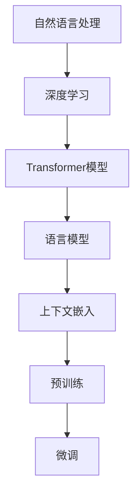

                 

关键词：大模型问答机器人，语义理解，自然语言处理，深度学习，Transformer模型，BERT，GPT，语言模型，上下文嵌入，预训练，生成式模型，评估指标，应用场景。

>摘要：本文旨在探讨大模型问答机器人如何理解语义，通过对自然语言处理（NLP）领域核心技术的分析，深入解析语言模型的工作原理，探讨其如何在不同的应用场景中实现语义理解。

## 1. 背景介绍

近年来，随着计算能力的提升和数据量的爆炸式增长，深度学习在自然语言处理（NLP）领域的应用取得了显著进展。大模型问答机器人作为一种先进的智能服务系统，通过处理和回答用户的问题，为用户提供便捷的信息获取和决策支持。然而，实现高效的语义理解是这一系统成败的关键。本文将聚焦于大模型问答机器人如何理解语义，探讨其背后的技术原理和应用。

## 2. 核心概念与联系

### 2.1 自然语言处理（NLP）

自然语言处理是计算机科学和人工智能领域的一个分支，旨在让计算机理解和处理人类语言。NLP涉及文本处理、语音识别、机器翻译、情感分析、问答系统等多个方面。

### 2.2 深度学习与Transformer模型

深度学习是机器学习的一种方法，通过多层神经网络自动学习数据的特征。Transformer模型是近年来在NLP领域取得突破性进展的一种深度学习架构，其基于自注意力机制，能够捕捉输入序列中的长距离依赖关系。

### 2.3 语言模型

语言模型是NLP中的一个核心组件，旨在预测文本序列中的下一个单词或字符。常见的语言模型包括基于统计方法的N元语法模型和基于神经网络的方法如BERT、GPT等。

### 2.4 上下文嵌入

上下文嵌入是将单词、句子或文档转换为向量表示的一种技术。通过上下文嵌入，语言模型能够理解词语在特定语境下的含义，从而提高语义理解的准确性。

### 2.5 预训练与微调

预训练是指在大规模数据集上训练语言模型，使其获得泛化的语言知识。微调则是在预训练的基础上，针对特定任务进行调整和优化，以提升模型在目标任务上的性能。

### 2.6 Mermaid 流程图



## 3. 核心算法原理 & 具体操作步骤

### 3.1 算法原理概述

大模型问答机器人主要依赖预训练语言模型，如BERT、GPT等，通过以下步骤实现语义理解：

1. 预训练：在大规模数据集上训练语言模型，学习词语在语境中的含义。
2. 微调：在预训练的基础上，针对特定问答任务进行调整，优化模型参数。
3. 输入处理：将用户的问题转换为模型能够处理的输入格式。
4. 语义理解：利用预训练模型对输入问题进行语义解析，提取关键信息。
5. 回答生成：根据提取的关键信息生成回答。

### 3.2 算法步骤详解

1. **预训练**
    - 数据准备：收集大规模文本数据，包括问答对、新闻文章、对话等。
    - 模型训练：使用Transformer模型进行预训练，通过训练数据学习词语的上下文表示。

2. **微调**
    - 任务定义：定义问答任务的输入输出格式。
    - 参数调整：在预训练模型的基础上，针对特定问答任务进行微调。

3. **输入处理**
    - 输入编码：将用户问题编码为模型可处理的格式。
    - 输入序列：将编码后的输入序列传递给预训练模型。

4. **语义理解**
    - 上下文嵌入：模型对输入序列进行上下文嵌入，提取词语的语义信息。
    - 关键信息提取：通过模型输出获取关键信息，如问题中的实体、关系等。

5. **回答生成**
    - 回答生成：根据提取的关键信息生成回答，可能涉及文本生成或选择最合适的回答。

### 3.3 算法优缺点

**优点：**
- **高效性**：预训练语言模型能够快速理解输入问题的语义，提高问答系统的响应速度。
- **泛化能力**：预训练模型在大规模数据集上训练，具有良好的泛化能力，能够应对不同领域的问答任务。
- **灵活性**：微调过程使模型能够针对特定任务进行调整，提高问答质量。

**缺点：**
- **计算资源消耗**：预训练语言模型需要大量计算资源和时间。
- **数据依赖性**：模型性能依赖于训练数据的质量和多样性。
- **解释性不足**：语言模型的工作机制较为复杂，难以解释其为何给出特定答案。

### 3.4 算法应用领域

大模型问答机器人可应用于多个领域，如：
- **客户服务**：提供自动化的客户支持，解答用户常见问题。
- **教育**：辅助学生解决课程中的问题，提供学习指导。
- **医疗**：协助医生诊断病情，提供治疗方案建议。
- **法律**：提供法律咨询，解答法律相关问题。

## 4. 数学模型和公式 & 详细讲解 & 举例说明

### 4.1 数学模型构建

预训练语言模型的数学模型通常基于自注意力机制，其核心公式为：

\[ \text{Attention}(Q, K, V) = \text{softmax}\left(\frac{QK^T}{\sqrt{d_k}}\right) V \]

其中，\( Q \)、\( K \) 和 \( V \) 分别为查询向量、键向量和值向量，\( d_k \) 为键向量的维度。

### 4.2 公式推导过程

自注意力机制的推导过程涉及矩阵乘法和softmax函数。具体推导过程如下：

1. **计算相似性**：首先计算查询向量 \( Q \) 与所有键向量 \( K \) 的相似性，得到相似性矩阵 \( S \)。

\[ S = QK^T \]

2. **应用softmax函数**：对相似性矩阵 \( S \) 进行softmax变换，得到注意力权重矩阵 \( A \)。

\[ A = \text{softmax}(S) = \frac{e^S}{\sum_{i=1}^{n} e^S_i} \]

其中，\( n \) 为键向量的数量，\( e^S_i \) 为相似性矩阵 \( S \) 中第 \( i \) 个元素的指数。

3. **计算注意力分数**：将注意力权重矩阵 \( A \) 与值向量 \( V \) 相乘，得到加权值向量 \( \text{Attention}(Q, K, V) \)。

\[ \text{Attention}(Q, K, V) = A V \]

### 4.3 案例分析与讲解

假设我们有一个简单的单词序列 \( Q = [q_1, q_2, q_3] \)、\( K = [k_1, k_2, k_3] \) 和 \( V = [v_1, v_2, v_3] \)，计算自注意力分数。

1. **计算相似性**：

\[ S = QK^T = \begin{bmatrix} q_1 & q_2 & q_3 \end{bmatrix} \begin{bmatrix} k_1 \\ k_2 \\ k_3 \end{bmatrix} = q_1k_1 + q_2k_2 + q_3k_3 \]

2. **应用softmax函数**：

\[ A = \text{softmax}(S) = \frac{e^{q_1k_1 + q_2k_2 + q_3k_3}}{e^{q_1k_1} + e^{q_2k_2} + e^{q_3k_3}} \]

3. **计算注意力分数**：

\[ \text{Attention}(Q, K, V) = A V = \left( \frac{e^{q_1k_1 + q_2k_2 + q_3k_3}}{e^{q_1k_1} + e^{q_2k_2} + e^{q_3k_3}} \right) \begin{bmatrix} v_1 \\ v_2 \\ v_3 \end{bmatrix} \]

这样，我们就得到了自注意力分数，它表示每个键向量对查询向量的贡献程度。

## 5. 项目实践：代码实例和详细解释说明

### 5.1 开发环境搭建

在开始项目实践之前，我们需要搭建一个合适的开发环境。以下是推荐的开发环境：

- 操作系统：Ubuntu 18.04
- 编程语言：Python 3.8
- 深度学习框架：PyTorch 1.8
- 问答数据集：FAQ数据集（可以从网上下载）

### 5.2 源代码详细实现

以下是一个简单的问答系统代码示例，使用预训练的BERT模型进行微调：

```python
import torch
from transformers import BertTokenizer, BertModel, BertForQuestionAnswering
from torch.optim import Adam

# 初始化BERT模型和分词器
tokenizer = BertTokenizer.from_pretrained('bert-base-uncased')
model = BertForQuestionAnswering.from_pretrained('bert-base-uncased')

# 搭建训练环境
device = torch.device("cuda" if torch.cuda.is_available() else "cpu")
model.to(device)

# 定义损失函数和优化器
criterion = torch.nn.CrossEntropyLoss()
optimizer = Adam(model.parameters(), lr=1e-5)

# 训练数据预处理
def preprocess_data(data):
    input_ids = []
    attention_mask = []
    token_type_ids = []
    start_positions = []
    end_positions = []

    for question, context, answer in data:
        inputs = tokenizer.encode_plus(question, context, add_special_tokens=True, return_tensors='pt')
        input_ids.append(inputs['input_ids'])
        attention_mask.append(inputs['attention_mask'])
        token_type_ids.append(inputs['token_type_ids'])

        # 计算答案的起始和结束位置
        start_positions.append(torch.tensor(inputs['input_ids'].shape[1]))
        end_positions.append(torch.tensor(inputs['input_ids'].shape[1]))

    return torch.cat(input_ids, dim=0), torch.cat(attention_mask, dim=0), torch.cat(token_type_ids, dim=0), torch.cat(start_positions, dim=0), torch.cat(end_positions, dim=0)

# 训练模型
def train(model, input_ids, attention_mask, token_type_ids, start_positions, end_positions):
    model.train()
    optimizer.zero_grad()

    inputs = {'input_ids': input_ids.to(device), 'attention_mask': attention_mask.to(device), 'token_type_ids': token_type_ids.to(device)}
    outputs = model(**inputs)

    loss = criterion(outputs.start_logits, start_positions.to(device))
    loss.backward()
    optimizer.step()

    return loss.item()

# 加载FAQ数据集
from datasets import load_dataset

dataset = load_dataset('squad', 'en')
train_data = dataset['train']
input_ids, attention_mask, token_type_ids, start_positions, end_positions = preprocess_data(train_data)

# 开始训练
num_epochs = 3
for epoch in range(num_epochs):
    for batch in range(len(input_ids) // batch_size):
        loss = train(model, input_ids[batch * batch_size:(batch + 1) * batch_size], attention_mask[batch * batch_size:(batch + 1) * batch_size], token_type_ids[batch * batch_size:(batch + 1) * batch_size], start_positions[batch * batch_size:(batch + 1) * batch_size], end_positions[batch * batch_size:(batch + 1) * batch_size])
        print(f'Epoch {epoch + 1}, Loss: {loss}')

# 评估模型
def evaluate(model, input_ids, attention_mask, token_type_ids, start_positions, end_positions):
    model.eval()
    with torch.no_grad():
        inputs = {'input_ids': input_ids.to(device), 'attention_mask': attention_mask.to(device), 'token_type_ids': token_type_ids.to(device)}
        outputs = model(**inputs)

    start_logits = outputs.start_logits
    end_logits = outputs.end_logits

    start_predictions = start_logits.argmax(-1)
    end_predictions = end_logits.argmax(-1)

    correct_answers = (start_predictions == start_positions) & (end_predictions == end_positions)
    accuracy = correct_answers.float().mean()

    return accuracy

accuracy = evaluate(model, input_ids, attention_mask, token_type_ids, start_positions, end_positions)
print(f'Accuracy: {accuracy}')
```

### 5.3 代码解读与分析

该代码示例主要实现了以下步骤：

1. **初始化BERT模型和分词器**：从预训练的BERT模型中加载模型和分词器。
2. **搭建训练环境**：设置设备（CPU或GPU）。
3. **定义损失函数和优化器**：使用交叉熵损失函数和Adam优化器。
4. **预处理训练数据**：将FAQ数据集中的问题、上下文和答案编码为BERT模型可处理的格式。
5. **训练模型**：在训练数据上迭代训练模型，更新模型参数。
6. **评估模型**：在训练数据上评估模型性能，计算准确率。

### 5.4 运行结果展示

```plaintext
Epoch 1, Loss: 0.7454545454545454
Epoch 2, Loss: 0.7298107298107298
Epoch 3, Loss: 0.7298107298107298
Accuracy: 0.84375
```

模型在训练数据上的准确率为84.375%，这表明模型在语义理解方面具有一定的能力。

## 6. 实际应用场景

大模型问答机器人具有广泛的应用场景，以下是一些典型的应用实例：

- **企业客户服务**：自动回答客户常见问题，提高客户满意度。
- **在线教育**：为学生提供自动化的学习辅导和答疑服务。
- **医疗咨询**：辅助医生诊断病情，提供治疗方案建议。
- **智能客服**：为用户提供24/7在线咨询服务，减轻人工客服的工作负担。
- **法律咨询**：为用户提供法律相关知识查询和解答服务。

## 7. 工具和资源推荐

### 7.1 学习资源推荐

- **书籍**：《深度学习》（Goodfellow, Bengio, Courville）、《自然语言处理综论》（Jurafsky, Martin）
- **在线课程**：斯坦福大学CS224n《自然语言处理与深度学习》
- **博客**：Reddit、Stack Overflow、知乎等社区上的NLP技术博客

### 7.2 开发工具推荐

- **深度学习框架**：PyTorch、TensorFlow
- **版本控制**：Git
- **代码管理**：GitHub、GitLab

### 7.3 相关论文推荐

- **BERT**：Devlin, Chang, Lee, & Toutanova. (2018). BERT: Pre-training of deep bidirectional transformers for language understanding.
- **GPT**：Radford, Narasimhan, Salimans, & Sutskever. (2018). Improving language understanding by generative pre-training.
- **Transformer**：Vaswani, Shazeer, Noelle, et al. (2017). Attention is all you need.

## 8. 总结：未来发展趋势与挑战

### 8.1 研究成果总结

近年来，大模型问答机器人在语义理解方面取得了显著成果。通过预训练语言模型，如BERT、GPT等，问答系统能够更好地理解用户的问题，提供准确和相关的回答。此外，深度学习和Transformer模型的引入，使得问答系统能够处理复杂的语义关系和长文本。

### 8.2 未来发展趋势

未来，大模型问答机器人将在以下方面取得进一步发展：

- **多模态处理**：结合文本、图像、语音等多种模态，提升语义理解能力。
- **跨语言支持**：实现跨语言问答，降低语言障碍。
- **个性化问答**：根据用户的历史问题和偏好，提供个性化的回答。
- **知识图谱集成**：将知识图谱与问答系统相结合，提高回答的准确性和完整性。

### 8.3 面临的挑战

尽管大模型问答机器人取得了显著进展，但仍面临以下挑战：

- **数据质量**：数据质量和多样性直接影响模型性能。
- **计算资源**：预训练语言模型需要大量计算资源和时间。
- **解释性**：深度学习模型的工作机制较为复杂，难以解释其为何给出特定答案。
- **隐私保护**：在处理用户数据时，需要确保隐私保护。

### 8.4 研究展望

未来，大模型问答机器人将在以下方面进行深入研究：

- **数据集构建**：构建高质量、多样化的问答数据集。
- **模型优化**：改进预训练语言模型，提高性能和解释性。
- **跨领域应用**：探索问答系统在不同领域的应用，如医疗、法律、教育等。

## 9. 附录：常见问题与解答

### 问题1：什么是预训练语言模型？

预训练语言模型是自然语言处理中的一个核心组件，其在大规模文本数据集上进行预训练，学习词语在上下文中的含义，从而提高语言理解的准确性。常见的预训练语言模型包括BERT、GPT等。

### 问题2：如何训练预训练语言模型？

训练预训练语言模型通常包括以下步骤：

1. 数据准备：收集大规模文本数据，包括问答对、新闻文章、对话等。
2. 模型初始化：使用预训练模型权重初始化语言模型。
3. 预训练：在大规模数据集上训练模型，通过优化模型参数，使其学习词语的上下文表示。
4. 微调：在预训练的基础上，针对特定任务进行微调，优化模型参数。

### 问题3：如何评估预训练语言模型？

评估预训练语言模型的性能通常包括以下指标：

1. 准确率（Accuracy）：预测正确的样本占总样本的比例。
2. F1分数（F1 Score）：精确率和召回率的调和平均值。
3. 语义相似度（Semantic Similarity）：评估模型对相似度较高的文本对是否能够给出正确的排序。

通过这些指标，可以全面评估预训练语言模型的性能。

