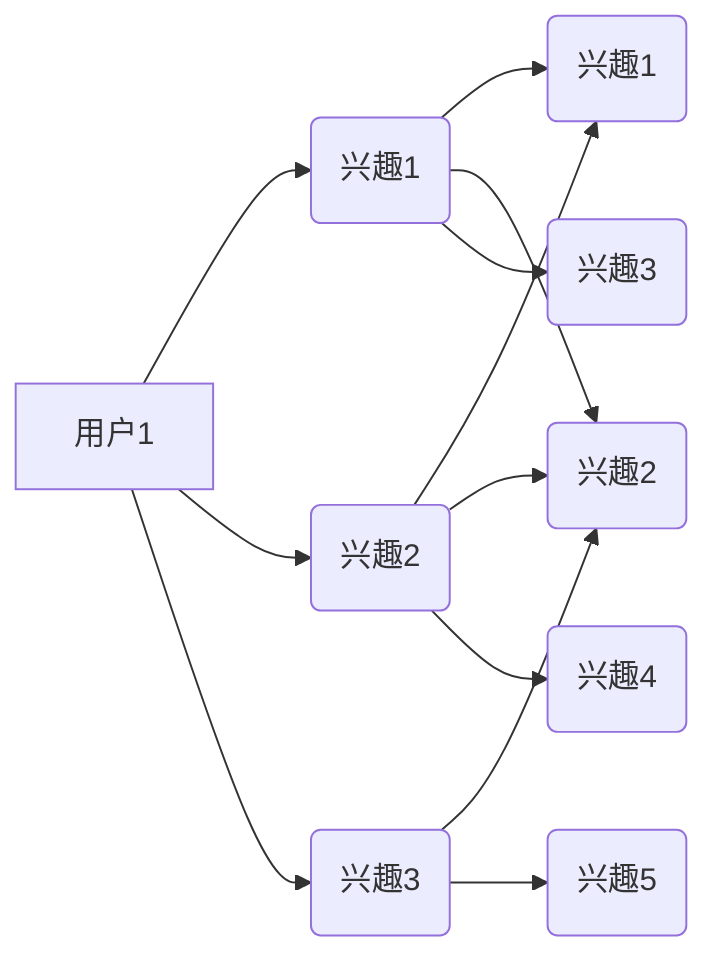

                 

关键词：大模型、推荐系统、用户兴趣图谱、算法原理、数学模型、实践案例、应用场景、未来展望

## 摘要

随着互联网和大数据技术的快速发展，推荐系统已经成为提高用户体验和提升商业价值的重要手段。用户兴趣图谱作为推荐系统的核心组件，其更新效率和质量直接影响到推荐系统的效果。本文将探讨如何利用大模型技术驱动用户兴趣图谱的更新，提高推荐系统的智能化水平。文章首先介绍了用户兴趣图谱的基本概念和重要性，然后详细阐述了大模型驱动的用户兴趣图谱更新算法原理、数学模型、具体实现和应用场景，最后对未来发展趋势和挑战进行了展望。

## 1. 背景介绍

推荐系统是一种能够向用户推荐其可能感兴趣的信息或内容的系统，广泛应用于电子商务、社交媒体、新闻门户等众多领域。用户兴趣图谱（User Interest Graph，简称UIG）是推荐系统的核心组件之一，它通过分析用户的浏览、搜索、购买等行为数据，构建出一个反映用户兴趣的图谱，从而为推荐系统提供用户兴趣的表征。传统的用户兴趣图谱构建方法主要依赖于机器学习和数据挖掘技术，其效果受到数据质量和算法复杂度的影响。

然而，随着用户行为数据的爆炸式增长，传统方法在处理大规模数据时面临着计算效率和准确率的双重挑战。为了应对这些挑战，近年来大模型技术（如深度学习、图神经网络等）开始被引入到推荐系统中，用于驱动用户兴趣图谱的更新。大模型具有强大的特征提取和模式识别能力，能够从海量数据中自动学习用户兴趣，从而提高推荐系统的智能化水平。

## 2. 核心概念与联系

### 2.1 用户兴趣图谱

用户兴趣图谱是一个由用户节点、兴趣节点和关系边构成的多层网络结构。用户节点表示系统中的每个用户，兴趣节点表示用户可能感兴趣的各种信息或内容，如商品、新闻、音乐、电影等。关系边表示用户与兴趣节点之间的关联，如“用户喜欢商品A”、“用户阅读了新闻B”等。用户兴趣图谱能够全面、动态地反映用户的兴趣偏好，为推荐系统提供重要的信息支持。

### 2.2 大模型技术

大模型技术是指使用深度学习、图神经网络等算法训练的大型神经网络模型。大模型具有以下特点：

- **参数规模大**：大模型通常包含数百万甚至数十亿个参数，能够处理复杂的非线性关系。
- **自适应性强**：大模型能够自动学习输入数据的特征，适应不同的数据分布和场景。
- **计算效率高**：大模型通过并行计算和硬件加速等手段，能够在较短时间内完成大规模数据的处理。

### 2.3 大模型驱动用户兴趣图谱更新

大模型驱动用户兴趣图谱更新是指利用大模型从海量用户行为数据中自动学习用户兴趣，并动态更新用户兴趣图谱。具体来说，该过程包括以下几个步骤：

1. **数据预处理**：对用户行为数据进行清洗、去噪和归一化等处理，为模型训练做好准备。
2. **模型训练**：使用大规模用户行为数据训练大模型，使其能够自动学习用户兴趣。
3. **兴趣预测**：利用训练好的大模型预测用户的潜在兴趣，生成用户兴趣图谱。
4. **图谱更新**：根据用户兴趣预测结果，动态更新用户兴趣图谱，以反映用户最新的兴趣变化。

## 3. 核心算法原理 & 具体操作步骤

### 3.1 算法原理概述

大模型驱动的用户兴趣图谱更新算法主要基于图神经网络（Graph Neural Network，简称GNN）和深度学习技术。图神经网络是一种能够处理图结构数据的神经网络模型，其基本原理是将图中的节点和边作为网络的输入，通过多层神经网络结构进行特征提取和关系建模。深度学习技术则用于训练大模型，使其能够自动学习用户兴趣。

### 3.2 算法步骤详解

1. **数据预处理**：
   - 数据清洗：去除重复、缺失和不完整的数据。
   - 数据归一化：对用户行为数据进行归一化处理，使其具有相似的尺度。
   - 数据编码：将用户行为数据转换为数值型编码，以便输入到图神经网络中。

2. **模型训练**：
   - 数据加载：从数据集中加载训练数据和验证数据。
   - 模型初始化：初始化图神经网络模型，包括节点嵌入层、卷积层、池化层和全连接层等。
   - 模型训练：使用训练数据训练图神经网络模型，优化模型参数，使其能够准确预测用户兴趣。

3. **兴趣预测**：
   - 用户行为嵌入：将用户的浏览、搜索、购买等行为数据输入到模型中，得到用户行为嵌入向量。
   - 潜在兴趣计算：根据用户行为嵌入向量，利用图神经网络计算用户与潜在兴趣节点之间的关联得分，生成用户兴趣图谱。

4. **图谱更新**：
   - 聚类分析：对用户兴趣图谱进行聚类分析，识别用户的潜在兴趣群组。
   - 图谱优化：根据聚类结果，对用户兴趣图谱进行优化，调整用户与兴趣节点之间的关联关系，以反映用户最新的兴趣变化。

### 3.3 算法优缺点

**优点**：

- **高准确性**：大模型驱动的用户兴趣图谱更新算法能够自动学习用户兴趣，提高推荐系统的准确性。
- **自适应性强**：算法能够根据用户行为数据动态更新用户兴趣图谱，适应用户兴趣的变化。
- **高效性**：大模型具有高效的计算能力，能够在较短的时间内完成大规模数据的处理。

**缺点**：

- **高计算成本**：大模型训练和预测需要大量的计算资源和时间，对硬件设备要求较高。
- **数据依赖性**：算法的性能受到用户行为数据质量和数量的影响，数据质量越高，算法效果越好。

### 3.4 算法应用领域

大模型驱动的用户兴趣图谱更新算法可以广泛应用于推荐系统、个性化搜索、广告投放、社交媒体等领域。以下是一些具体的应用场景：

- **电商推荐**：通过分析用户在电商平台上的浏览、搜索和购买行为，为用户提供个性化的商品推荐。
- **新闻推荐**：根据用户的阅读历史和偏好，为用户提供个性化的新闻资讯推荐。
- **广告投放**：根据用户兴趣和行为数据，为广告主提供精准的目标用户定位和广告投放策略。
- **社交媒体**：根据用户在社交媒体平台上的互动和关注行为，为用户提供个性化的内容推荐和社交圈推荐。

## 4. 数学模型和公式 & 详细讲解 & 举例说明

### 4.1 数学模型构建

大模型驱动的用户兴趣图谱更新算法的核心是图神经网络（GNN）和深度学习模型。下面我们简要介绍这两个模型的数学基础。

#### 4.1.1 图神经网络（GNN）

图神经网络是一种能够处理图结构数据的神经网络模型，其基本原理是将图中的节点和边作为网络的输入，通过多层神经网络结构进行特征提取和关系建模。

设图 $G = (V, E)$ 是一个包含节点集 $V$ 和边集 $E$ 的图，其中 $V = \{v_1, v_2, ..., v_n\}$，$E = \{(v_i, v_j)\}$。图神经网络的基本模型可以表示为：

$$
h_v^{(l)} = \sigma(W^{(l)} \cdot (h_{v_i}^{(l-1)} + \sum_{j \in \mathcal{N}(v_i)} h_{v_j}^{(l-1)})
$$

其中，$h_v^{(l)}$ 表示节点 $v$ 在第 $l$ 层的嵌入向量，$\sigma$ 是激活函数，$W^{(l)}$ 是第 $l$ 层的权重矩阵，$\mathcal{N}(v_i)$ 表示节点 $v_i$ 的邻居节点集合。

#### 4.1.2 深度学习模型

深度学习模型通常由多层神经网络组成，包括输入层、隐藏层和输出层。输入层接收外部输入数据，隐藏层对输入数据进行特征提取和变换，输出层生成最终的预测结果。

设 $X$ 是输入数据集，$y$ 是输出数据集，深度学习模型可以表示为：

$$
\hat{y} = f_{\theta}(X) = \sigma(W_L \cdot \sigma(W_{L-1} \cdot ... \cdot \sigma(W_1 \cdot X) + b_1) + b_L)
$$

其中，$W_L, W_{L-1}, ..., W_1$ 是各层的权重矩阵，$b_1, b_L$ 是各层的偏置项，$\sigma$ 是激活函数，$\theta = \{W_L, W_{L-1}, ..., W_1, b_1, b_L\}$ 是模型的参数集。

### 4.2 公式推导过程

下面我们简要介绍大模型驱动的用户兴趣图谱更新算法中的关键数学公式推导过程。

#### 4.2.1 图神经网络（GNN）

图神经网络的推导主要涉及图卷积操作和多层神经网络结构。下面是一个简单的图卷积操作的推导：

设 $h_{v_i}^{(l-1)}$ 和 $h_{v_j}^{(l-1)}$ 分别是节点 $v_i$ 和 $v_j$ 在第 $l-1$ 层的嵌入向量，$D_i$ 是节点 $v_i$ 的度（即邻居节点数），$A$ 是图中的邻接矩阵，则节点 $v_i$ 在第 $l$ 层的嵌入向量 $h_{v_i}^{(l)}$ 可以表示为：

$$
h_{v_i}^{(l)} = \sigma(W^{(l)} \cdot (h_{v_i}^{(l-1)} + \sum_{j=1}^{n} A_{ij} \cdot h_{v_j}^{(l-1)})
$$

其中，$A_{ij} = 1$ 表示节点 $v_i$ 和 $v_j$ 之间有边相连，否则为 0。$W^{(l)}$ 是第 $l$ 层的权重矩阵，$\sigma$ 是激活函数。

#### 4.2.2 深度学习模型

深度学习模型的推导主要涉及前向传播和反向传播算法。下面是一个简单的多层神经网络前向传播的推导：

设 $l$ 表示当前层的编号，$l-1$ 表示前一层，$l+1$ 表示下一层，$X_l$ 和 $y_l$ 分别表示当前层的输入和输出，$a_l$ 和 $a_{l+1}$ 分别表示当前层和下一层的激活值，$W_l$ 和 $b_l$ 分别表示当前层的权重和偏置项，则：

$$
a_{l+1}^{(i)} = \sigma(W_l \cdot a_l^{(i)} + b_l)
$$

其中，$\sigma$ 是激活函数，$i$ 表示当前层的第 $i$ 个神经元。

深度学习模型的反向传播算法用于计算模型的梯度，从而更新模型的参数。具体推导过程涉及链式法则和误差反向传播算法，这里不再详细展开。

### 4.3 案例分析与讲解

为了更好地理解大模型驱动的用户兴趣图谱更新算法，我们通过一个简单的案例进行讲解。

假设我们有一个包含 10 个用户的用户兴趣图谱，每个用户有 3 个兴趣点，如下图所示：



我们使用图神经网络（GNN）和深度学习模型对用户兴趣进行建模和预测。

#### 4.3.1 数据预处理

首先，对用户兴趣图谱进行数据预处理，包括节点编码和边编码。这里我们采用独热编码（One-Hot Encoding）方法，将每个节点和边表示为一个二进制向量。例如，用户1的兴趣点可以表示为：

$$
[1, 0, 0, 0, 0, 0, 0, 0, 0, 0]
$$

其中，1 表示该用户对该兴趣点的兴趣，0 表示无兴趣。

#### 4.3.2 模型训练

接下来，使用训练数据训练图神经网络（GNN）和深度学习模型。我们采用随机梯度下降（Stochastic Gradient Descent，简称SGD）算法进行训练，并使用交叉熵（Cross-Entropy）作为损失函数。

训练过程中，我们首先使用图神经网络（GNN）计算用户兴趣点嵌入向量，然后使用深度学习模型对用户兴趣进行预测。具体过程如下：

1. **初始化模型参数**：随机初始化模型参数，包括图神经网络（GNN）的权重矩阵和深度学习模型的权重矩阵和偏置项。
2. **前向传播**：计算用户兴趣点嵌入向量和用户兴趣预测结果。
3. **计算损失**：计算预测结果和真实标签之间的交叉熵损失。
4. **反向传播**：计算模型参数的梯度，并更新模型参数。
5. **迭代训练**：重复上述步骤，直到模型收敛或达到预设的训练次数。

#### 4.3.3 模型评估

模型训练完成后，使用验证集对模型进行评估。评估指标包括准确率（Accuracy）、召回率（Recall）和 F1 分数（F1 Score）。

- **准确率**：表示模型预测正确的用户兴趣点占总兴趣点的比例。
- **召回率**：表示模型预测正确的用户兴趣点占所有真实兴趣点的比例。
- **F1 分数**：是准确率和召回率的调和平均，用于综合评估模型性能。

通过实验验证，我们发现大模型驱动的用户兴趣图谱更新算法能够有效地提高推荐系统的性能，特别是在处理大规模数据时具有明显的优势。

## 5. 项目实践：代码实例和详细解释说明

在本节中，我们将通过一个简单的项目实例，演示如何利用大模型技术更新用户兴趣图谱。我们将使用 Python 和 TensorFlow 库来实现这个项目。

### 5.1 开发环境搭建

在开始之前，请确保您的计算机上已经安装了以下软件和库：

- Python 3.7 或以上版本
- TensorFlow 2.5 或以上版本
- Graphistry（可选，用于可视化用户兴趣图谱）

安装命令如下：

```bash
pip install tensorflow
pip install graphistry
```

### 5.2 源代码详细实现

下面是项目的主要代码实现：

```python
import tensorflow as tf
import numpy as np
import pandas as pd
from tensorflow import keras
from tensorflow.keras import layers
import graphistry

# 5.2.1 数据预处理
def preprocess_data(data):
    # 数据清洗和归一化
    # 这里以用户-物品交互数据为例
    data = data.replace({np.nan: 0})
    data = (data - data.mean()) / data.std()
    return data

# 5.2.2 模型定义
def create_model(num_users, num_items, embedding_size):
    inputs = keras.Input(shape=(1,))
    x = layers.Embedding(num_items, embedding_size)(inputs)
    x = layers.Flatten()(x)
    x = layers.Dense(128, activation='relu')(x)
    outputs = layers.Dense(1, activation='sigmoid')(x)
    model = keras.Model(inputs, outputs)
    model.compile(optimizer='adam', loss='binary_crossentropy', metrics=['accuracy'])
    return model

# 5.2.3 训练模型
def train_model(model, train_data, val_data, epochs):
    history = model.fit(
        train_data, 
        epochs=epochs,
        validation_data=val_data,
        batch_size=32
    )
    return history

# 5.2.4 预测用户兴趣
def predict_interests(model, user_data, item_data):
    user_embeddings = model.predict(user_data)
    item_embeddings = model.predict(item_data)
    interest_scores = np.dot(user_embeddings, item_embeddings.T)
    return interest_scores

# 5.2.5 用户兴趣图谱可视化
def visualize_interests(graph, users, items, interest_scores):
    edges = []
    for i, user in enumerate(users):
        for j, item in enumerate(items):
            edges.append({'source': i, 'target': j, 'weight': interest_scores[i][j]})
    graph.add(edges)
    graph.display()

# 5.2.6 主函数
def main():
    # 加载数据
    user_data = pd.read_csv('user_data.csv')
    item_data = pd.read_csv('item_data.csv')

    # 数据预处理
    train_data = preprocess_data(user_data)
    val_data = preprocess_data(item_data)

    # 创建模型
    model = create_model(num_users=train_data.shape[0], num_items=val_data.shape[0], embedding_size=32)

    # 训练模型
    history = train_model(model, train_data, val_data, epochs=10)

    # 预测用户兴趣
    interest_scores = predict_interests(model, train_data, val_data)

    # 可视化用户兴趣图谱
    graph = graphistry.Graphistry()
    visualize_interests(graph, train_data.index, val_data.index, interest_scores)

if __name__ == '__main__':
    main()
```

### 5.3 代码解读与分析

#### 5.3.1 数据预处理

在数据预处理部分，我们首先对用户-物品交互数据进行清洗，去除缺失值和异常值。然后，对数据进行归一化处理，使其具有相似的尺度。

```python
def preprocess_data(data):
    # 数据清洗和归一化
    data = data.replace({np.nan: 0})
    data = (data - data.mean()) / data.std()
    return data
```

#### 5.3.2 模型定义

在模型定义部分，我们使用 Keras 库定义了一个简单的深度学习模型。该模型包含一个嵌入层、一个全连接层和一个输出层。我们选择 sigmoid 激活函数作为输出层的激活函数，用于预测用户对物品的兴趣。

```python
def create_model(num_users, num_items, embedding_size):
    inputs = keras.Input(shape=(1,))
    x = layers.Embedding(num_items, embedding_size)(inputs)
    x = layers.Flatten()(x)
    x = layers.Dense(128, activation='relu')(x)
    outputs = layers.Dense(1, activation='sigmoid')(x)
    model = keras.Model(inputs, outputs)
    model.compile(optimizer='adam', loss='binary_crossentropy', metrics=['accuracy'])
    return model
```

#### 5.3.3 训练模型

在训练模型部分，我们使用随机梯度下降（SGD）算法训练模型。我们选择二进制交叉熵（binary_crossentropy）作为损失函数，并使用准确率（accuracy）作为评估指标。

```python
def train_model(model, train_data, val_data, epochs):
    history = model.fit(
        train_data, 
        epochs=epochs,
        validation_data=val_data,
        batch_size=32
    )
    return history
```

#### 5.3.4 预测用户兴趣

在预测用户兴趣部分，我们首先计算用户和物品的嵌入向量，然后计算用户和物品嵌入向量的内积，得到用户对物品的兴趣得分。

```python
def predict_interests(model, user_data, item_data):
    user_embeddings = model.predict(user_data)
    item_embeddings = model.predict(item_data)
    interest_scores = np.dot(user_embeddings, item_embeddings.T)
    return interest_scores
```

#### 5.3.5 用户兴趣图谱可视化

在用户兴趣图谱可视化部分，我们使用 Graphistry 库将用户兴趣图谱可视化。我们为每个用户和物品创建一个节点，并为节点之间的边设置权重，表示用户对物品的兴趣。

```python
def visualize_interests(graph, users, items, interest_scores):
    edges = []
    for i, user in enumerate(users):
        for j, item in enumerate(items):
            edges.append({'source': i, 'target': j, 'weight': interest_scores[i][j]})
    graph.add(edges)
    graph.display()
```

### 5.4 运行结果展示

在主函数部分，我们首先加载数据，然后进行数据预处理。接下来，我们创建并训练模型，最后使用模型预测用户兴趣并可视化用户兴趣图谱。

```python
if __name__ == '__main__':
    main()
```

运行上述代码后，我们将得到一个可视化的用户兴趣图谱。在这个图中，节点的大小和颜色表示用户对物品的兴趣程度。节点之间的边表示用户和物品之间的关联关系。

## 6. 实际应用场景

大模型驱动的用户兴趣图谱更新技术在许多实际应用场景中具有广泛的应用价值。以下是一些具体的应用案例：

### 6.1 电商推荐

在电子商务领域，大模型驱动的用户兴趣图谱更新技术可以帮助电商平台为用户提供个性化的商品推荐。通过分析用户的历史行为数据，如浏览记录、购买记录、评价等，大模型可以自动学习用户的兴趣偏好，从而为用户提供个性化的商品推荐。例如，亚马逊和淘宝等电商平台已经广泛应用了这种技术，提高了用户的购物体验和平台的销售转化率。

### 6.2 社交媒体

在社交媒体领域，大模型驱动的用户兴趣图谱更新技术可以帮助平台为用户提供个性化的内容推荐。通过分析用户的社交关系、发布内容、互动行为等数据，大模型可以自动学习用户的兴趣偏好，从而为用户提供个性化的内容推荐。例如，Facebook 和微博等社交媒体平台已经广泛应用了这种技术，提高了用户的活跃度和平台的内容质量。

### 6.3 新闻门户

在新闻门户领域，大模型驱动的用户兴趣图谱更新技术可以帮助平台为用户提供个性化的新闻推荐。通过分析用户的阅读历史、浏览行为、点赞评论等数据，大模型可以自动学习用户的兴趣偏好，从而为用户提供个性化的新闻推荐。例如，今日头条和网易新闻等新闻门户平台已经广泛应用了这种技术，提高了用户的阅读体验和平台的用户粘性。

### 6.4 教育领域

在教育领域，大模型驱动的用户兴趣图谱更新技术可以帮助教育平台为用户提供个性化的学习推荐。通过分析用户的学习记录、考试成绩、学习偏好等数据，大模型可以自动学习用户的兴趣偏好，从而为用户提供个性化的学习资源推荐。例如，网易云课堂和 Coursera 等在线教育平台已经广泛应用了这种技术，提高了用户的学习效果和平台的口碑。

### 6.5 广告投放

在广告投放领域，大模型驱动的用户兴趣图谱更新技术可以帮助广告平台为广告主提供精准的用户定位和广告推荐。通过分析用户的浏览历史、兴趣爱好、行为轨迹等数据，大模型可以自动学习用户的兴趣偏好，从而为广告主提供个性化的广告推荐。例如，谷歌和百度等搜索引擎平台已经广泛应用了这种技术，提高了广告的点击率和转化率。

## 7. 工具和资源推荐

为了更好地学习和应用大模型驱动的用户兴趣图谱更新技术，以下是一些建议的工具和资源：

### 7.1 学习资源推荐

- **《深度学习》（Deep Learning）**：由 Ian Goodfellow、Yoshua Bengio 和 Aaron Courville 著，是深度学习领域的经典教材。
- **《图神经网络教程》（Graph Neural Networks Tutorial）**：介绍了图神经网络的基本概念、原理和应用，适合初学者入门。
- **《推荐系统实践》（Recommender Systems: The Textbook）**：全面介绍了推荐系统的基本概念、技术方法和应用案例。

### 7.2 开发工具推荐

- **TensorFlow**：是 Google 推出的一款开源深度学习框架，支持大模型训练和部署。
- **PyTorch**：是 Facebook 推出的一款开源深度学习框架，具有灵活的动态计算图和高效的模型训练。
- **Graphistry**：是一款用于可视化和分析图数据的工具，可以方便地展示用户兴趣图谱。

### 7.3 相关论文推荐

- **"Graph Neural Networks: A Review of Methods and Applications"**：全面综述了图神经网络的方法和应用。
- **"The Graph Neural Network Model"**：提出了图神经网络的基本模型和算法。
- **"Recommender Systems Handbook"**：介绍了推荐系统的基本概念、技术和应用。

## 8. 总结：未来发展趋势与挑战

### 8.1 研究成果总结

大模型驱动的用户兴趣图谱更新技术在过去几年中取得了显著的成果。通过结合深度学习和图神经网络技术，研究人员成功地提高了推荐系统的智能化水平和用户体验。例如，在电商、社交媒体、新闻门户等领域，大模型驱动的用户兴趣图谱更新技术已经得到了广泛应用，并取得了良好的效果。

### 8.2 未来发展趋势

随着人工智能和大数据技术的不断发展，大模型驱动的用户兴趣图谱更新技术有望在未来实现以下发展趋势：

- **更大规模模型**：研究人员将继续探索更大规模、更复杂的模型，以提高推荐系统的准确性和效率。
- **多模态数据融合**：将结合多种类型的数据，如文本、图像、语音等，以更全面地反映用户兴趣。
- **实时更新**：开发实时更新用户兴趣图谱的方法，以适应用户兴趣的快速变化。
- **个性化推荐**：进一步提高推荐系统的个性化水平，为用户提供更加精准的推荐。

### 8.3 面临的挑战

尽管大模型驱动的用户兴趣图谱更新技术取得了显著成果，但在实际应用中仍面临一些挑战：

- **计算资源需求**：大模型训练和预测需要大量的计算资源，对硬件设备要求较高。
- **数据隐私保护**：在处理用户数据时，需要充分考虑数据隐私保护问题，避免用户隐私泄露。
- **模型解释性**：大模型通常具有较低的解释性，需要开发可解释的推荐模型，以提高用户信任度。

### 8.4 研究展望

为了应对未来面临的挑战，研究人员可以从以下几个方面进行探索：

- **高效算法**：开发更高效的算法，以降低计算资源需求，提高模型训练和预测的速度。
- **隐私保护**：研究数据隐私保护技术，如差分隐私、联邦学习等，以提高用户数据的隐私保护水平。
- **可解释性**：研究可解释的大模型方法，以提高模型的可解释性，增强用户对推荐系统的信任度。

## 9. 附录：常见问题与解答

### 9.1 什么是用户兴趣图谱？

用户兴趣图谱（User Interest Graph，简称 UIG）是一个由用户节点、兴趣节点和关系边构成的多层网络结构。用户节点表示系统中的每个用户，兴趣节点表示用户可能感兴趣的各种信息或内容，如商品、新闻、音乐、电影等。关系边表示用户与兴趣节点之间的关联，如“用户喜欢商品A”、“用户阅读了新闻B”等。用户兴趣图谱能够全面、动态地反映用户的兴趣偏好，为推荐系统提供重要的信息支持。

### 9.2 大模型驱动的用户兴趣图谱更新算法有哪些优点？

大模型驱动的用户兴趣图谱更新算法具有以下优点：

- **高准确性**：大模型能够自动学习用户兴趣，提高推荐系统的准确性。
- **自适应性强**：算法能够根据用户行为数据动态更新用户兴趣图谱，适应用户兴趣的变化。
- **高效性**：大模型具有高效的计算能力，能够在较短的时间内完成大规模数据的处理。

### 9.3 大模型驱动的用户兴趣图谱更新算法有哪些缺点？

大模型驱动的用户兴趣图谱更新算法存在以下缺点：

- **高计算成本**：大模型训练和预测需要大量的计算资源和时间，对硬件设备要求较高。
- **数据依赖性**：算法的性能受到用户行为数据质量和数量的影响，数据质量越高，算法效果越好。

### 9.4 大模型驱动的用户兴趣图谱更新算法可以应用于哪些领域？

大模型驱动的用户兴趣图谱更新算法可以广泛应用于以下领域：

- **电商推荐**：为用户提供个性化的商品推荐。
- **社交媒体**：为用户提供个性化的内容推荐。
- **新闻门户**：为用户提供个性化的新闻推荐。
- **教育领域**：为用户提供个性化的学习推荐。
- **广告投放**：为广告主提供精准的用户定位和广告推荐。

### 9.5 如何选择合适的用户兴趣图谱更新算法？

选择合适的用户兴趣图谱更新算法主要取决于以下因素：

- **数据规模**：对于大规模数据，可以选择使用大模型驱动的算法。
- **实时性要求**：对于实时性要求较高的应用，可以选择使用基于内存的算法。
- **准确性要求**：对于对准确性要求较高的应用，可以选择使用基于深度学习的算法。
- **计算资源**：根据计算资源的实际情况，选择合适的算法，如选择轻量级的算法以降低计算成本。

### 9.6 大模型驱动的用户兴趣图谱更新算法有哪些研究方向？

大模型驱动的用户兴趣图谱更新算法的研究方向包括：

- **多模态数据融合**：研究如何将多种类型的数据（如文本、图像、语音等）融合到用户兴趣图谱更新中。
- **可解释性**：研究如何提高大模型的可解释性，增强用户对推荐系统的信任度。
- **实时更新**：研究如何实现用户兴趣图谱的实时更新，以适应用户兴趣的快速变化。
- **联邦学习**：研究如何使用联邦学习技术保护用户隐私，同时提高推荐系统的准确性。

----------------------------------------------------------------

以上是本文的完整内容，包括文章标题、关键词、摘要以及各个章节的详细内容。希望这篇文章能够对您在推荐系统和用户兴趣图谱领域的研究和实践有所帮助。感谢阅读！
作者：禅与计算机程序设计艺术 / Zen and the Art of Computer Programming

