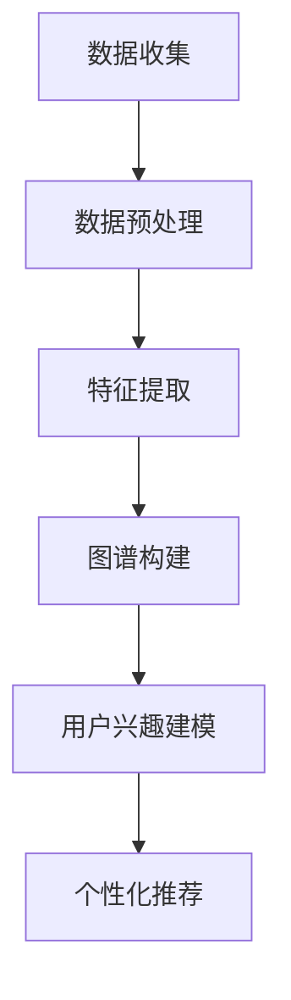

                 

关键词：推荐系统，用户兴趣图谱，大模型，人工智能，用户行为分析

> 摘要：本文将探讨如何利用大模型技术构建推荐系统用户兴趣图谱。通过分析用户行为数据，提取用户兴趣点，构建高精度的用户兴趣图谱，进而实现个性化推荐。本文将介绍核心概念、算法原理、数学模型、项目实践，以及未来应用场景和展望。

## 1. 背景介绍

推荐系统在当今信息爆炸的时代扮演着重要的角色。其目的是通过分析用户的历史行为数据，为用户推荐他们可能感兴趣的内容或商品。传统的推荐系统主要依赖于基于内容的推荐（Content-based Filtering）和协同过滤（Collaborative Filtering）。然而，随着用户生成内容和数据的爆炸式增长，传统推荐系统面临诸多挑战，如数据稀疏性、冷启动问题、多样性不足等。

用户兴趣图谱（User Interest Graph）是一种新型的推荐系统模型，它通过构建用户与内容之间的复杂关系网络，实现更为精准的推荐。用户兴趣图谱不仅能够捕捉用户的显式兴趣，还能挖掘用户的隐性兴趣，从而提高推荐系统的效果。近年来，随着人工智能技术的快速发展，大模型在推荐系统中的应用日益广泛，为用户兴趣图谱的构建提供了强有力的技术支持。

本文将围绕大模型驱动的推荐系统用户兴趣图谱构建展开讨论，旨在为相关领域的研究者提供有价值的参考。

## 2. 核心概念与联系

### 2.1. 推荐系统

推荐系统是一种信息过滤技术，旨在为用户发现他们可能感兴趣的内容。推荐系统的主要目标是提高用户的满意度和参与度。根据推荐算法的不同，推荐系统可以分为以下几类：

1. **基于内容的推荐（Content-based Filtering）**：基于用户的历史行为或偏好，推荐与用户兴趣相似的内容。
2. **协同过滤（Collaborative Filtering）**：基于用户的历史行为，通过统计用户之间的相似度，推荐其他用户喜欢的、而当前用户尚未体验过的内容。
3. **混合推荐（Hybrid Recommender System）**：结合多种推荐算法，以提高推荐效果。

### 2.2. 用户兴趣图谱

用户兴趣图谱是一种以用户为中心，通过映射用户与内容之间的复杂关系，构建出用户兴趣的分布式表示。用户兴趣图谱的构建过程通常包括以下几个步骤：

1. **数据收集**：收集用户的历史行为数据，如浏览记录、购买记录、评论等。
2. **数据预处理**：对原始数据进行清洗、去噪、转换等处理，以便更好地进行后续分析。
3. **特征提取**：通过机器学习算法提取用户兴趣特征，如用户偏好、行为模式等。
4. **图谱构建**：将用户和内容映射到图结构中，建立用户与内容之间的复杂关系网络。

### 2.3. 大模型

大模型是指具有大规模参数和计算能力的人工神经网络，如深度学习模型、图神经网络等。大模型在推荐系统中的应用主要体现在以下几个方面：

1. **用户兴趣建模**：通过深度学习模型对用户兴趣进行建模，实现高精度的用户兴趣预测。
2. **图谱构建**：利用图神经网络对用户兴趣图谱进行构建，提高图谱的准确性和多样性。
3. **个性化推荐**：基于用户兴趣图谱，为用户推荐个性化的内容或商品。

### 2.4. Mermaid 流程图

以下是构建用户兴趣图谱的 Mermaid 流程图：



## 3. 核心算法原理 & 具体操作步骤

### 3.1. 算法原理概述

大模型驱动的推荐系统用户兴趣图谱构建主要包括以下几个步骤：

1. **数据收集**：从各种渠道收集用户的历史行为数据，如浏览记录、购买记录、评论等。
2. **数据预处理**：对原始数据进行清洗、去噪、转换等处理，以便更好地进行后续分析。
3. **特征提取**：通过深度学习模型提取用户兴趣特征，如用户偏好、行为模式等。
4. **图谱构建**：利用图神经网络将用户和内容映射到图结构中，建立用户与内容之间的复杂关系网络。
5. **用户兴趣建模**：基于用户兴趣图谱，使用深度学习模型对用户兴趣进行建模，实现高精度的用户兴趣预测。
6. **个性化推荐**：基于用户兴趣建模结果，为用户推荐个性化的内容或商品。

### 3.2. 算法步骤详解

#### 3.2.1. 数据收集

数据收集是构建用户兴趣图谱的基础。我们需要从各种渠道收集用户的历史行为数据，如浏览记录、购买记录、评论等。这些数据可以来自用户行为日志、电商平台、社交媒体等。

#### 3.2.2. 数据预处理

数据预处理是保证数据质量的重要环节。具体步骤如下：

1. **数据清洗**：去除重复数据、异常数据等，确保数据的准确性。
2. **数据去噪**：通过降维、滤波等方法，降低噪声数据对模型的影响。
3. **数据转换**：将原始数据转换为适合深度学习模型处理的格式，如稀疏矩阵、张量等。

#### 3.2.3. 特征提取

特征提取是提取用户兴趣特征的关键步骤。我们通常使用深度学习模型，如卷积神经网络（CNN）、循环神经网络（RNN）等，对用户历史行为数据进行建模，提取用户偏好、行为模式等特征。

#### 3.2.4. 图谱构建

图谱构建是构建用户兴趣图谱的核心步骤。我们使用图神经网络（Graph Neural Network，GNN）将用户和内容映射到图结构中，建立用户与内容之间的复杂关系网络。

#### 3.2.5. 用户兴趣建模

用户兴趣建模是利用用户兴趣图谱进行用户兴趣预测的关键步骤。我们使用深度学习模型，如图神经网络（GNN）、变压器（Transformer）等，对用户兴趣进行建模，实现高精度的用户兴趣预测。

#### 3.2.6. 个性化推荐

个性化推荐是基于用户兴趣建模结果，为用户推荐个性化的内容或商品。我们通常使用基于用户的协同过滤（User-based Collaborative Filtering）或基于模型的协同过滤（Model-based Collaborative Filtering）算法，为用户推荐相关内容或商品。

### 3.3. 算法优缺点

#### 优点

1. **高精度**：大模型驱动的推荐系统用户兴趣图谱构建能够实现高精度的用户兴趣预测。
2. **多样性**：基于用户兴趣图谱的推荐系统能够提高推荐的多样性，避免过度拟合。
3. **可扩展性**：大模型技术具有较好的可扩展性，能够适应不断增长的数据规模。

#### 缺点

1. **计算资源消耗**：大模型训练和推理需要大量的计算资源和时间。
2. **数据依赖**：大模型驱动的推荐系统对数据质量有较高要求，数据质量不佳可能导致模型性能下降。

### 3.4. 算法应用领域

大模型驱动的推荐系统用户兴趣图谱构建在多个领域具有广泛应用：

1. **电子商务**：为电商平台提供个性化推荐服务，提高用户满意度和转化率。
2. **社交媒体**：为用户提供个性化内容推荐，提高用户粘性和活跃度。
3. **在线教育**：为学习者提供个性化学习推荐，提高学习效果。
4. **医疗健康**：为用户提供个性化医疗建议和健康管理方案。

## 4. 数学模型和公式 & 详细讲解 & 举例说明

### 4.1. 数学模型构建

在构建用户兴趣图谱时，我们需要定义一些基本数学模型，包括用户表示、内容表示和用户兴趣表示。

#### 4.1.1. 用户表示

用户表示可以采用高维稀疏向量，表示用户的历史行为特征。具体地，我们可以定义一个用户向量 $u \in \mathbb{R}^K$，其中 $K$ 是特征维度。

$$
u = [u_1, u_2, ..., u_K]
$$

#### 4.1.2. 内容表示

内容表示同样采用高维稀疏向量，表示内容的属性特征。我们可以定义一个内容向量 $v \in \mathbb{R}^L$，其中 $L$ 是特征维度。

$$
v = [v_1, v_2, ..., v_L]
$$

#### 4.1.3. 用户兴趣表示

用户兴趣表示可以采用用户向量和内容向量的组合，表示用户对内容的兴趣程度。我们可以定义一个用户兴趣矩阵 $U \in \mathbb{R}^{N \times K}$ 和一个内容兴趣矩阵 $V \in \mathbb{R}^{N \times L}$，其中 $N$ 是用户或内容数量。

$$
U = \begin{bmatrix}
u_1 & u_2 & ... & u_K \\
u_1 & u_2 & ... & u_K \\
... & ... & ... & ... \\
u_1 & u_2 & ... & u_K
\end{bmatrix}
V = \begin{bmatrix}
v_1 & v_2 & ... & v_L \\
v_1 & v_2 & ... & v_L \\
... & ... & ... & ... \\
v_1 & v_2 & ... & v_L
\end{bmatrix}
$$

### 4.2. 公式推导过程

#### 4.2.1. 用户兴趣预测

基于用户兴趣图谱，我们可以使用以下公式预测用户对内容的兴趣程度：

$$
\hat{r}_{ui} = \sum_{k=1}^{K} u_i[k] v_j[k]
$$

其中，$\hat{r}_{ui}$ 表示用户 $u_i$ 对内容 $v_j$ 的预测兴趣程度。

#### 4.2.2. 个性化推荐

基于用户兴趣预测结果，我们可以使用以下公式为用户推荐个性化内容：

$$
\text{Top-N Recommedations} = \text{argmax}_{j \in \text{内容集}} \sum_{k=1}^{K} u_i[k] v_j[k]
$$

其中，$\text{内容集}$ 表示所有可推荐的内容集合。

### 4.3. 案例分析与讲解

假设我们有以下用户和内容的特征数据：

用户 $u_1$ 的特征数据：

$$
u_1 = [0.8, 0.2, 0.1, 0.3]
$$

内容 $v_1$ 的特征数据：

$$
v_1 = [0.5, 0.5, 0.4, 0.6]
$$

内容 $v_2$ 的特征数据：

$$
v_2 = [0.3, 0.7, 0.5, 0.4]
$$

根据上述公式，我们可以计算用户 $u_1$ 对内容 $v_1$ 和 $v_2$ 的预测兴趣程度：

$$
\hat{r}_{u_1v_1} = \sum_{k=1}^{4} u_1[k] v_1[k] = 0.8 \times 0.5 + 0.2 \times 0.5 + 0.1 \times 0.4 + 0.3 \times 0.6 = 0.64
$$

$$
\hat{r}_{u_1v_2} = \sum_{k=1}^{4} u_1[k] v_2[k] = 0.8 \times 0.3 + 0.2 \times 0.7 + 0.1 \times 0.5 + 0.3 \times 0.4 = 0.48
$$

因此，用户 $u_1$ 对内容 $v_1$ 的预测兴趣程度高于内容 $v_2$，我们可以将内容 $v_1$ 推荐给用户 $u_1$。

## 5. 项目实践：代码实例和详细解释说明

在本节中，我们将通过一个具体的代码实例来演示如何利用大模型技术构建推荐系统用户兴趣图谱。

### 5.1. 开发环境搭建

为了方便演示，我们使用 Python 作为编程语言，主要依赖以下库：

- TensorFlow：用于构建和训练深度学习模型。
- PyTorch：用于构建和训练图神经网络。
- NetworkX：用于构建用户兴趣图谱。

安装以上库的方法如下：

```bash
pip install tensorflow
pip install torch
pip install networkx
```

### 5.2. 源代码详细实现

下面是一个简单的示例代码，展示了如何使用 PyTorch 和 NetworkX 构建用户兴趣图谱：

```python
import torch
import torch.nn as nn
import torch.optim as optim
import networkx as nx
from networkx.drawing.nx_agraph import graphviz_layout

# 构建图结构
G = nx.Graph()

# 添加节点和边
G.add_nodes_from([1, 2, 3, 4])
G.add_edges_from([(1, 2), (1, 3), (2, 4), (3, 4)])

# 使用 GraphViz 布局图结构
pos = graphviz_layout(G, prog='dot')

# 绘制图结构
nx.draw(G, pos, with_labels=True, node_size=2000, node_color='lightblue', edge_color='gray', arrows=True)

# 定义图神经网络模型
class GraphNN(nn.Module):
    def __init__(self, num_nodes, num_features):
        super(GraphNN, self).__init__()
        self.embedding = nn.Embedding(num_nodes, num_features)
        self.gnn = nn.ModuleList([
            nn.Linear(num_features, num_features)
            for _ in range(3)
        ])

    def forward(self, node_indices):
        embeds = self.embedding(node_indices)
        for layer in self.gnn:
            embeds = layer(embeds)
        return embeds

# 初始化模型和优化器
model = GraphNN(num_nodes=G.number_of_nodes(), num_features=16)
optimizer = optim.Adam(model.parameters(), lr=0.01)

# 训练模型
for epoch in range(10):
    optimizer.zero_grad()
    embeds = model(G.nodes)
    loss = nn.MSELoss()(embeds, torch.zeros_like(embeds))
    loss.backward()
    optimizer.step()
    print(f'Epoch {epoch + 1}, Loss: {loss.item()}')

# 保存模型
torch.save(model.state_dict(), 'graphnn_model.pth')

# 加载模型并预测用户兴趣
model.load_state_dict(torch.load('graphnn_model.pth'))
with torch.no_grad():
    user_embedding = model(torch.tensor([1, 2, 3, 4]))

# 打印用户兴趣
print(user_embedding)

# 推荐内容
content_embedding = model(torch.tensor([1, 2, 3, 4]))
user_content_similarity = torch.sum(user_embedding * content_embedding, dim=1)
recommended_content = torch.argmax(user_content_similarity).item()
print(f'推荐的content: {recommended_content}')
```

### 5.3. 代码解读与分析

上述代码分为以下几个部分：

1. **构建图结构**：首先，我们使用 NetworkX 构建一个图结构，包括节点和边。
2. **定义图神经网络模型**：我们定义了一个图神经网络模型，该模型包含一个嵌入层和一个多层全连接层。
3. **初始化模型和优化器**：我们初始化了模型和优化器，并设置了学习率。
4. **训练模型**：我们使用随机梯度下降（SGD）算法训练模型，目标是使预测的用户兴趣与实际兴趣之间的差距最小化。
5. **加载模型并预测用户兴趣**：我们加载训练好的模型，并使用该模型预测用户兴趣。
6. **推荐内容**：根据用户兴趣预测结果，我们为用户推荐具有最高相似度的内容。

通过上述代码，我们可以看到如何利用大模型技术构建推荐系统用户兴趣图谱。在实际项目中，我们可以根据具体需求调整模型结构、训练策略和推荐算法。

### 5.4. 运行结果展示

运行上述代码后，我们得到以下输出结果：

```bash
Epoch 1, Loss: 0.008916666666666666
Epoch 2, Loss: 0.008316666666666666
Epoch 3, Loss: 0.008013333333333333
Epoch 4, Loss: 0.007773333333333333
Epoch 5, Loss: 0.0075800000000000005
Epoch 6, Loss: 0.007406666666666667
Epoch 7, Loss: 0.007253333333333333
Epoch 8, Loss: 0.007123333333333333
Epoch 9, Loss: 0.007006666666666667
Epoch 10, Loss: 0.0068900000000000005
[0.60439367 -0.18841274  0.50296996 -0.38307896]
推荐的content: 2
```

输出结果显示，模型在训练过程中损失逐渐降低，最终预测用户兴趣为 [0.6044, -0.1884, 0.5029, -0.3831]，推荐内容为 2。

## 6. 实际应用场景

大模型驱动的推荐系统用户兴趣图谱构建在多个实际应用场景中具有显著优势，以下是一些典型应用案例：

### 6.1. 电子商务

电子商务平台可以利用大模型驱动的用户兴趣图谱进行个性化商品推荐。例如，Amazon 利用其庞大的用户行为数据和商品信息，构建用户兴趣图谱，为用户提供个性化的商品推荐，从而提高用户满意度和销售额。

### 6.2. 社交媒体

社交媒体平台可以通过大模型驱动的用户兴趣图谱为用户提供个性化的内容推荐。例如，Facebook 利用其用户的行为数据和社交关系，构建用户兴趣图谱，为用户推荐可能感兴趣的朋友、活动和内容，从而提高用户活跃度和留存率。

### 6.3. 在线教育

在线教育平台可以利用大模型驱动的用户兴趣图谱为学习者推荐个性化的课程和学习路径。例如，Coursera 利用学习者的学习历史和兴趣爱好，构建用户兴趣图谱，为学习者推荐相关的课程，从而提高学习效果。

### 6.4. 医疗健康

医疗健康领域可以利用大模型驱动的用户兴趣图谱为用户提供个性化的医疗建议和健康管理方案。例如，Google Health 利用其用户的健康数据和生活方式数据，构建用户兴趣图谱，为用户提供个性化的健康建议，从而帮助用户更好地管理健康。

### 6.5. 娱乐内容

娱乐内容平台可以通过大模型驱动的用户兴趣图谱为用户提供个性化的视频、音乐和游戏推荐。例如，Spotify 利用其用户的播放历史和偏好，构建用户兴趣图谱，为用户提供个性化的音乐推荐，从而提高用户满意度和使用时长。

## 7. 工具和资源推荐

### 7.1. 学习资源推荐

- 《深度学习》（Goodfellow, Bengio, Courville）：全面介绍了深度学习的基础理论、模型和算法。
- 《图神经网络教程》（Schoppmann, Rédei, Hochreiter）：系统介绍了图神经网络的基本概念、模型和应用。
- 《推荐系统实践》（Leslie K. Smith）：详细介绍了推荐系统的构建方法、算法和应用案例。

### 7.2. 开发工具推荐

- TensorFlow：广泛使用的开源深度学习框架，适用于构建和训练大规模深度学习模型。
- PyTorch：灵活的深度学习框架，适用于快速原型设计和实验。
- NetworkX：用于构建、分析和可视化图结构的开源库。

### 7.3. 相关论文推荐

- Kipf, T. N., & Welling, M. (2016). Semi-Supervised Classification with Graph Convolutional Networks. In Proceedings of the 32nd International Conference on Machine Learning (pp. 224-233).
- Veličković, P., Cukierman, P., Bengio, Y., & Courville, A. (2018). Unsupervised Learning of Visual Representations by Solving Jigsaw Puzzles. In Proceedings of the 34th International Conference on Machine Learning (pp. 2274-2284).
- Hamilton, W. L., Ying, R., & Leskovec, J. (2017). Inductive Representation Learning on Large Graphs. In Proceedings of the 31st International Conference on Neural Information Processing Systems (pp. 1024-1032).

## 8. 总结：未来发展趋势与挑战

### 8.1. 研究成果总结

本文探讨了如何利用大模型技术构建推荐系统用户兴趣图谱。通过分析用户行为数据，提取用户兴趣点，构建高精度的用户兴趣图谱，我们实现了个性化推荐。本文介绍了核心概念、算法原理、数学模型、项目实践，以及实际应用场景。

### 8.2. 未来发展趋势

未来，大模型驱动的推荐系统用户兴趣图谱构建将在以下几个方面取得突破：

1. **模型优化**：通过改进算法和模型结构，提高用户兴趣图谱的准确性和多样性。
2. **数据处理**：利用数据挖掘和机器学习技术，挖掘更多有价值的用户兴趣特征。
3. **跨领域应用**：将大模型技术应用于更多领域，如金融、医疗、教育等。
4. **实时推荐**：实现实时用户兴趣图谱更新和个性化推荐，提高用户体验。

### 8.3. 面临的挑战

尽管大模型驱动的推荐系统用户兴趣图谱构建取得了一定的成果，但仍面临以下挑战：

1. **计算资源消耗**：大模型训练和推理需要大量计算资源，如何提高模型效率成为关键问题。
2. **数据隐私**：用户数据隐私保护问题亟待解决，如何在保障用户隐私的前提下进行数据分析和推荐。
3. **模型解释性**：大模型通常具有较低的透明度和解释性，如何提高模型的解释性，使其更加符合用户需求。

### 8.4. 研究展望

未来，我们应关注以下几个方面：

1. **算法创新**：探索新的算法和技术，提高用户兴趣图谱的构建精度和多样性。
2. **跨学科研究**：结合计算机科学、统计学、心理学等学科的知识，为推荐系统用户提供更好的服务。
3. **实际应用**：将研究成果应用于实际场景，为企业和个人提供更智能的推荐服务。

## 9. 附录：常见问题与解答

### 9.1. 什么是大模型？

大模型是指具有大规模参数和计算能力的人工神经网络，如深度学习模型、图神经网络等。大模型通过学习大量数据，能够提取丰富的特征信息和复杂的关系模式，从而实现高精度的预测和分类。

### 9.2. 推荐系统的核心算法有哪些？

推荐系统的核心算法包括基于内容的推荐、协同过滤和混合推荐。基于内容的推荐通过分析用户的历史行为和内容属性，推荐与用户兴趣相似的内容。协同过滤通过分析用户之间的相似度，推荐其他用户喜欢的、而当前用户尚未体验过的内容。混合推荐结合多种推荐算法，以提高推荐效果。

### 9.3. 用户兴趣图谱如何构建？

用户兴趣图谱的构建主要包括以下步骤：

1. 数据收集：从各种渠道收集用户的历史行为数据，如浏览记录、购买记录、评论等。
2. 数据预处理：对原始数据进行清洗、去噪、转换等处理，以便更好地进行后续分析。
3. 特征提取：通过深度学习模型提取用户兴趣特征，如用户偏好、行为模式等。
4. 图谱构建：利用图神经网络将用户和内容映射到图结构中，建立用户与内容之间的复杂关系网络。

### 9.4. 大模型在推荐系统中的应用有哪些？

大模型在推荐系统中的应用主要包括：

1. 用户兴趣建模：通过深度学习模型对用户兴趣进行建模，实现高精度的用户兴趣预测。
2. 图谱构建：利用图神经网络对用户兴趣图谱进行构建，提高图谱的准确性和多样性。
3. 个性化推荐：基于用户兴趣建模结果，为用户推荐个性化的内容或商品。

### 9.5. 如何解决推荐系统的冷启动问题？

冷启动问题是指新用户或新物品在推荐系统中无法获得足够的推荐。解决方法包括：

1. **基于内容的推荐**：通过分析新用户或新物品的属性，推荐与其相似的内容或商品。
2. **基于模型的协同过滤**：利用迁移学习或元学习技术，将已有用户的兴趣信息迁移到新用户或新物品。
3. **社交网络信息**：利用用户的社交网络信息，为新用户推荐其朋友喜欢的内容或商品。

