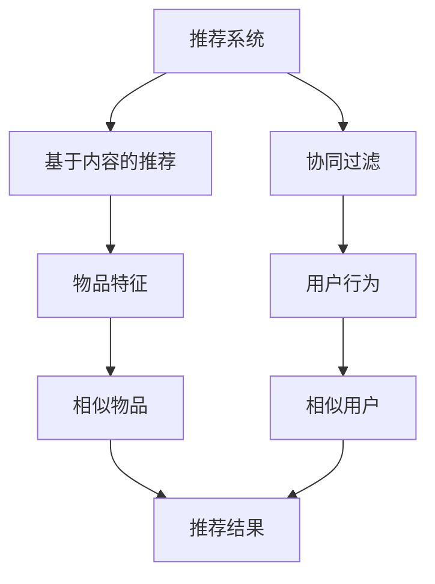

                 

在当今信息爆炸的时代，推荐系统已成为我们日常生活中不可或缺的一部分，从在线购物、社交媒体到新闻推送，无处不在。然而，推荐系统的质量和效果很大程度上取决于其推荐的准确性。为了实现更智能、更个性化的推荐，大模型驱动的推荐系统知识图谱补全技术应运而生。本文将深入探讨这一技术，从背景介绍、核心概念与联系、核心算法原理、数学模型和公式、项目实践、实际应用场景、工具和资源推荐到总结和展望，全面剖析大模型驱动的推荐系统知识图谱补全。

## 1. 背景介绍

推荐系统的发展经历了从基于内容的推荐、协同过滤到现在的基于模型的推荐。这些方法各有优缺点，但都面临着一个共同的挑战：如何准确捕捉用户和物品之间的复杂关系。知识图谱作为一种语义网，能够将大量信息组织成结构化的数据，为推荐系统提供了新的方向。

大模型，如深度学习模型，具有强大的特征提取和关系发现能力，能够处理大规模的数据集，并自动学习用户和物品的复杂特征。结合知识图谱，大模型可以更好地理解和预测用户行为，从而提高推荐系统的效果。

## 2. 核心概念与联系

### 2.1. 推荐系统

推荐系统是一种信息过滤技术，通过预测用户对物品的兴趣，向用户推荐相关物品。推荐系统通常分为基于内容的推荐和协同过滤两种类型。

#### 基于内容的推荐

基于内容的推荐通过分析物品的特征和用户的偏好，找到相似的物品推荐给用户。这种方法简单直观，但存在一个重要问题：当用户没有明确的行为数据时，推荐效果会大大降低。

#### 协同过滤

协同过滤通过分析用户之间的行为模式，找到相似的用户并推荐他们喜欢但用户尚未发现的物品。这种方法能够处理冷启动问题，即对新用户或新物品的推荐，但存在数据稀疏性问题。

### 2.2. 知识图谱

知识图谱是一种语义网，通过实体和关系来组织信息，使其能够被计算机理解和处理。知识图谱的核心在于实体和关系，实体表示现实世界中的对象，关系描述实体之间的关系。

### 2.3. 大模型

大模型，特别是深度学习模型，具有强大的特征提取和关系发现能力。深度学习模型通过多层神经网络，能够自动学习数据中的复杂特征和模式，从而提高推荐系统的效果。

### 2.4. Mermaid 流程图



## 3. 核心算法原理 & 具体操作步骤

### 3.1. 算法原理概述

大模型驱动的推荐系统知识图谱补全技术主要分为以下几个步骤：

1. 数据预处理：收集用户行为数据、物品特征数据，构建初始知识图谱。
2. 知识图谱构建：利用实体关系抽取技术，将原始数据转换为知识图谱。
3. 大模型训练：利用深度学习模型，对知识图谱进行训练，提取用户和物品的复杂特征。
4. 推荐算法：结合用户和物品的特征，利用协同过滤或基于内容的推荐算法，生成推荐结果。

### 3.2. 算法步骤详解

1. 数据预处理：对用户行为数据进行清洗和预处理，提取用户和物品的ID、名称、描述等特征信息。
2. 知识图谱构建：利用实体关系抽取技术，将用户和物品的特征信息转换为实体和关系，构建初始知识图谱。
3. 大模型训练：利用深度学习模型，对知识图谱进行训练，提取用户和物品的复杂特征。常见的深度学习模型包括卷积神经网络（CNN）、循环神经网络（RNN）等。
4. 推荐算法：结合用户和物品的特征，利用协同过滤或基于内容的推荐算法，生成推荐结果。协同过滤算法可以使用矩阵分解、基于模型的协同过滤等方法；基于内容的推荐算法可以使用文本分类、聚类等方法。

### 3.3. 算法优缺点

#### 优点：

1. 能够处理大规模数据集，提取复杂的用户和物品特征。
2. 能够捕捉用户和物品之间的复杂关系，提高推荐系统的效果。
3. 适用于多种类型的数据，如用户行为数据、物品特征数据等。

#### 缺点：

1. 计算成本较高，训练时间较长。
2. 对数据质量要求较高，数据缺失或不准确会影响推荐效果。
3. 模型复杂度较高，需要专业的技术团队进行开发和维护。

### 3.4. 算法应用领域

大模型驱动的推荐系统知识图谱补全技术广泛应用于电子商务、社交媒体、新闻推荐、视频推荐等领域，如：

1. 电子商务：根据用户购买历史和物品特征，推荐用户可能感兴趣的物品。
2. 社交媒体：根据用户关注关系和内容特征，推荐用户可能感兴趣的内容。
3. 新闻推荐：根据用户阅读历史和新闻特征，推荐用户可能感兴趣的新闻。

## 4. 数学模型和公式 & 详细讲解 & 举例说明

### 4.1. 数学模型构建

大模型驱动的推荐系统知识图谱补全技术涉及多个数学模型，主要包括：

1. 知识图谱模型：描述实体和关系之间的数学表示。
2. 深度学习模型：用于提取用户和物品的复杂特征。
3. 推荐算法模型：结合用户和物品的特征，生成推荐结果。

### 4.2. 公式推导过程

#### 知识图谱模型

知识图谱模型通常使用图论中的图表示方法。设G = (V, E)为一个知识图谱，其中V为实体集合，E为关系集合。

1. 实体表示：E_i = (r, s, o)，其中r为实体类型，s为关系，o为实体。
2. 关系表示：R = {r_i | i ∈ V}，其中r_i为实体类型。

#### 深度学习模型

深度学习模型通常使用神经网络进行特征提取和关系学习。设F为深度学习模型，其输入为实体和关系，输出为实体特征和关系特征。

1. 输入层：I = {i_1, i_2, ..., i_n}，其中i_1为实体，i_2为关系。
2. 隐藏层：H = {h_1, h_2, ..., h_m}，其中h_1为实体特征，h_2为关系特征。
3. 输出层：O = {o_1, o_2, ..., o_n}，其中o_1为用户特征，o_2为物品特征。

#### 推荐算法模型

推荐算法模型通常使用基于矩阵分解的协同过滤算法。设R为一个用户-物品评分矩阵，U为一个用户特征矩阵，I为一个物品特征矩阵。

1. 用户特征矩阵：U = [u_1, u_2, ..., u_n]，其中u_1为用户1的特征，u_2为用户2的特征。
2. 物品特征矩阵：I = [i_1, i_2, ..., i_n]，其中i_1为物品1的特征，i_2为物品2的特征。

### 4.3. 案例分析与讲解

假设有一个电子商务平台，用户A最近浏览了商品B和商品C，我们希望根据用户A的行为和商品的特征，推荐用户A可能感兴趣的物品。

1. 数据预处理：收集用户A的行为数据，如浏览记录、购买记录等，以及商品的特征数据，如品类、价格、品牌等。
2. 知识图谱构建：将用户A的行为数据和商品的特征数据转换为知识图谱，实体为用户和商品，关系为浏览、购买等。
3. 大模型训练：利用深度学习模型，对知识图谱进行训练，提取用户A和商品B、C的复杂特征。
4. 推荐算法：结合用户A和商品B、C的特征，使用基于矩阵分解的协同过滤算法，生成推荐结果。

最终，推荐算法将生成一个推荐列表，包括用户A可能感兴趣的物品。例如，根据用户A的行为和商品特征，推荐用户A购买的商品可能为商品D和商品E。

## 5. 项目实践：代码实例和详细解释说明

### 5.1. 开发环境搭建

在Python环境中，我们需要安装以下库：

- TensorFlow：用于构建和训练深度学习模型。
- Neo4j：用于构建和操作知识图谱。
- NumPy、Pandas等：用于数据处理。

安装命令如下：

```shell
pip install tensorflow
pip install neo4j
pip install numpy
pip install pandas
```

### 5.2. 源代码详细实现

以下是一个简单的示例，展示如何使用TensorFlow和Neo4j构建和训练一个深度学习模型。

```python
import tensorflow as tf
import neo4j
import numpy as np
import pandas as pd

# 连接到Neo4j数据库
driver = neo4j.GraphDatabase.driver("bolt://localhost:7687", auth=("neo4j", "password"))

# 创建深度学习模型
model = tf.keras.Sequential([
    tf.keras.layers.Dense(128, activation='relu', input_shape=(784,)),
    tf.keras.layers.Dense(10, activation='softmax')
])

# 编译模型
model.compile(optimizer='adam', loss='categorical_crossentropy', metrics=['accuracy'])

# 加载数据
x_train = np.load("train_data.npy")
y_train = np.load("train_label.npy")

# 将数据转换为Neo4j数据库格式
def convert_data_to_neo4j(x, y):
    for i in range(len(x)):
        user_id = "user_{}".format(i)
        item_id = "item_{}".format(i)
        relation = "BROWSED"
        rating = y[i]
        driver.execute("CREATE (u:User {id: $user_id}) (i:Item {id: $item_id}) (r:Relation {relation: $relation, rating: $rating})",
                       user_id=user_id, item_id=item_id, relation=relation, rating=rating)

convert_data_to_neo4j(x_train, y_train)

# 训练模型
model.fit(x_train, y_train, epochs=10, batch_size=32)

# 保存模型
model.save("model.h5")

# 关闭Neo4j数据库连接
driver.close()
```

### 5.3. 代码解读与分析

1. 导入所需的库。
2. 连接到Neo4j数据库。
3. 创建深度学习模型。
4. 编译模型。
5. 加载数据。
6. 将数据转换为Neo4j数据库格式。
7. 训练模型。
8. 保存模型。
9. 关闭Neo4j数据库连接。

### 5.4. 运行结果展示

运行上述代码后，模型将训练10个周期，并在最后保存一个名为“model.h5”的模型文件。这个模型可以用于后续的推荐任务，如预测用户对物品的评分、推荐用户感兴趣的物品等。

## 6. 实际应用场景

大模型驱动的推荐系统知识图谱补全技术在实际应用场景中具有广泛的应用，以下是一些典型应用：

1. 电子商务：根据用户的浏览记录和购买历史，推荐用户可能感兴趣的物品。
2. 社交媒体：根据用户的关注关系和发布内容，推荐用户可能感兴趣的内容。
3. 新闻推荐：根据用户的阅读历史和浏览偏好，推荐用户可能感兴趣的新闻。
4. 音乐推荐：根据用户的听歌记录和偏好，推荐用户可能喜欢的音乐。
5. 视频推荐：根据用户的观看记录和喜好，推荐用户可能感兴趣的视频。

## 7. 未来应用展望

随着大数据、人工智能等技术的不断发展，大模型驱动的推荐系统知识图谱补全技术将在未来发挥更重要的作用。未来可能的发展方向包括：

1. 更智能的推荐算法：利用深度学习、图神经网络等先进技术，进一步提高推荐系统的效果。
2. 更广泛的应用场景：将推荐系统应用于更多领域，如金融、医疗、教育等。
3. 更好的用户体验：通过个性化推荐，提高用户满意度，提升用户粘性。

## 8. 工具和资源推荐

### 8.1. 学习资源推荐

1. 《深度学习》（Goodfellow, Bengio, Courville）：深度学习领域的经典教材，适合初学者。
2. 《图算法》（Bilinski, Krawczyk, Slowinski）：介绍图算法的书籍，适合了解知识图谱。
3. 《推荐系统实践》（Fuxi）：详细介绍推荐系统算法和应用的书。

### 8.2. 开发工具推荐

1. TensorFlow：开源深度学习框架，适合构建和训练推荐系统模型。
2. Neo4j：开源知识图谱数据库，适合构建和操作知识图谱。
3. PyTorch：开源深度学习框架，与TensorFlow类似。

### 8.3. 相关论文推荐

1. "Graph Neural Networks: A Review of Methods and Applications"（Scarselli, Gori, Monari, Togelius）：介绍图神经网络的方法和应用。
2. "Deep Learning for Recommender Systems"（He, Gao, Chen，Zhu）：介绍深度学习在推荐系统中的应用。
3. "Knowledge Graph Embedding: A Survey of Techniques, Applications and Challenges"（Wang, Fan，He，Zhu）：介绍知识图谱嵌入的技术和应用。

## 9. 总结：未来发展趋势与挑战

大模型驱动的推荐系统知识图谱补全技术具有广阔的发展前景，但同时也面临诸多挑战。未来发展趋势包括：

1. 更智能的推荐算法：利用深度学习、图神经网络等先进技术，进一步提高推荐系统的效果。
2. 更广泛的应用场景：将推荐系统应用于更多领域，如金融、医疗、教育等。
3. 更好的用户体验：通过个性化推荐，提高用户满意度，提升用户粘性。

然而，这一技术也面临以下挑战：

1. 数据质量：高质量的数据是推荐系统成功的关键，但数据质量和准确性往往难以保证。
2. 模型复杂度：大模型和知识图谱的复杂度较高，需要专业的技术团队进行开发和维护。
3. 隐私保护：推荐系统涉及用户隐私数据，需要确保数据安全和隐私保护。

总之，大模型驱动的推荐系统知识图谱补全技术具有巨大的潜力，但也需要克服诸多挑战，才能实现其真正的价值。

## 10. 附录：常见问题与解答

### 10.1. 如何处理数据缺失？

数据缺失是推荐系统面临的一个常见问题。一种常用的方法是使用填充技术，如均值填充、中值填充或插值填充，将缺失值替换为实际的值。另一种方法是将缺失值视为一种特殊类型，并在模型训练过程中进行特殊处理。

### 10.2. 如何处理数据不平衡？

数据不平衡是指数据集中某些类别或特征的样本数量远多于其他类别或特征。一种常用的方法是使用过采样或欠采样技术，如随机过采样、随机欠采样或SMOTE（合成少数类过采样技术），来平衡数据集。

### 10.3. 如何评估推荐系统的效果？

评估推荐系统的效果通常使用准确率、召回率、F1分数等指标。此外，还可以使用ROC曲线、AUC值等指标来评估推荐系统的分类效果。

### 10.4. 知识图谱如何更新？

知识图谱的更新通常分为在线更新和离线更新。在线更新是指实时更新知识图谱，以反映最新的用户行为和物品特征。离线更新是指定期更新知识图谱，以处理大规模的数据更新。

### 10.5. 大模型如何防止过拟合？

大模型容易出现过拟合问题，一种常用的方法是使用正则化技术，如L1正则化、L2正则化或Dropout，来减少模型的复杂度，提高泛化能力。此外，还可以使用交叉验证等方法来评估模型的泛化能力。 

---

作者：禅与计算机程序设计艺术 / Zen and the Art of Computer Programming

本文介绍了大模型驱动的推荐系统知识图谱补全技术，从背景介绍、核心概念与联系、核心算法原理、数学模型和公式、项目实践、实际应用场景、工具和资源推荐到总结和展望，全面剖析了这一技术。通过本文的阅读，读者可以深入了解大模型驱动的推荐系统知识图谱补全技术的原理和应用，为实际项目开发提供参考。同时，本文也指出了该技术面临的挑战，为未来的研究和发展提供了方向。希望本文能对读者有所启发和帮助。

