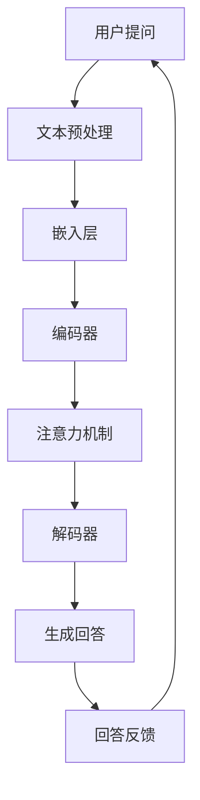
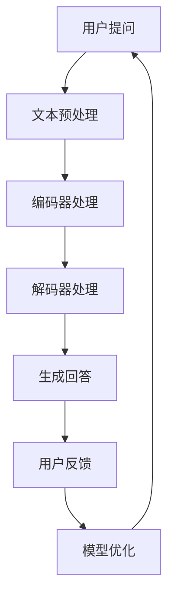

                 

关键词：大模型、智能客服、用户满意度、算法原理、数学模型、代码实例、实际应用、工具资源

> 摘要：本文深入探讨了使用大模型驱动的智能客服系统，阐述了其在提升用户满意度方面的显著优势。通过分析大模型的核心概念、算法原理，以及其在不同领域的应用，本文揭示了构建高效智能客服系统的关键技术。同时，通过实例代码和实际应用场景的分析，展示了大模型在智能客服中的强大能力。最后，本文对未来的发展趋势与挑战进行了展望，为相关领域的研究和实践提供了有价值的参考。

## 1. 背景介绍

随着互联网和移动设备的普及，客服成为企业与客户之间沟通的重要桥梁。然而，传统的人工客服模式面临着响应速度慢、效率低、成本高等问题，已难以满足日益增长的用户需求。与此同时，人工智能技术的快速发展，特别是大模型技术的出现，为构建高效的智能客服系统带来了新的契机。

大模型，通常指的是拥有海量参数的深度学习模型，如GPT-3、BERT等。这些模型在自然语言处理、图像识别、语音识别等领域取得了显著的成果。通过利用大模型，智能客服系统能够实现更为精准、智能的客服服务，从而提升用户满意度。

本文旨在探讨大模型驱动的智能客服系统，分析其核心概念、算法原理，以及在实际应用中的效果。通过详细的项目实践和案例分析，本文旨在为智能客服系统的研发提供有价值的参考和指导。

### 1.1 智能客服的现状与挑战

当前，智能客服系统已成为企业提升客户服务质量的重要手段。传统的客服系统主要依赖于规则引擎和简单的关键词匹配，虽然在一定程度上能够处理基本的客户咨询，但面对复杂、多变的用户需求时，常常显得力不从心。

首先，响应速度慢是传统智能客服系统面临的主要挑战之一。用户在提出问题时，系统需要一定时间来分析和生成回答，这不仅延长了用户的等待时间，还影响了用户体验。其次，客服系统的处理能力有限，无法应对复杂、多变的问题场景。当用户提出的问题超出系统的预定义规则时，客服系统往往无法给出有效的回答，导致用户满意度下降。

此外，人工客服的成本高昂也是传统客服系统的弊端之一。随着企业客户量的增加，需要配备更多的人工客服人员，这不仅增加了企业的运营成本，还可能导致服务质量不稳定。因此，如何构建高效、智能的客服系统，成为企业亟需解决的问题。

### 1.2 大模型在智能客服中的应用

大模型的引入，为智能客服系统带来了革命性的变革。大模型具有以下几个显著特点：

1. **强大的处理能力**：大模型拥有海量参数，能够处理复杂的自然语言任务，如文本生成、对话系统等。这使得智能客服系统在面对多变、复杂的问题时，能够给出更为精准、有效的回答。

2. **高效的学习能力**：大模型通过训练海量数据，能够快速学习用户的提问习惯和需求，不断优化自身的回答能力。这使得智能客服系统能够适应不同的用户场景，提供个性化的服务。

3. **高度的智能化**：大模型通过深度学习，能够理解自然语言的语义和语境，生成符合人类思维习惯的回答。这使得智能客服系统能够与用户进行自然的对话，提升用户体验。

总之，大模型的应用为智能客服系统带来了前所未有的提升，使其能够更加高效、智能地处理用户的咨询，从而提升用户满意度。本文将在后续章节中详细探讨大模型的原理、算法和应用，为智能客服系统的研发提供有力支持。

## 2. 核心概念与联系

在探讨大模型驱动的智能客服系统之前，我们需要理解一些核心概念，包括自然语言处理（NLP）、对话系统（Conversational AI）和深度学习等。这些概念不仅构成了大模型技术的基础，也在智能客服系统中扮演着关键角色。

### 2.1 自然语言处理（NLP）

自然语言处理是人工智能领域的一个分支，旨在使计算机能够理解和处理人类语言。NLP涉及多个子领域，包括语言理解、文本生成、情感分析等。

- **语言理解**：语言理解涉及从文本中提取信息、理解句子结构和语义。这对于智能客服系统来说至关重要，因为它需要理解用户的提问，以生成合适的回答。

- **文本生成**：文本生成是NLP的另一个重要子领域，它使得计算机能够生成连贯、有意义的文本。在智能客服系统中，文本生成能力使得系统能够自动生成回复，而不是依赖预定义的回复模板。

- **情感分析**：情感分析用于理解文本的情感倾向，如正面、负面或中性。在智能客服中，情感分析可以帮助系统识别用户的情绪，从而提供更加个性化的服务。

### 2.2 对话系统（Conversational AI）

对话系统是一种人工智能技术，旨在模拟人类对话，与用户进行交互。对话系统可以分为两种主要类型：基于规则的和基于机器学习的。

- **基于规则的对话系统**：这类系统依赖于预定义的规则和条件来生成回答。尽管其实现较为简单，但灵活性较差，难以应对复杂的对话场景。

- **基于机器学习的对话系统**：这类系统通过训练数据来学习如何生成回答，具有更高的灵活性和自适应能力。大模型驱动的对话系统通常属于这一类别。

### 2.3 深度学习

深度学习是人工智能的一个分支，通过多层神经网络来模拟人脑的学习过程。深度学习在大模型中起着核心作用，使其能够处理复杂的任务。

- **神经网络**：神经网络是由大量神经元组成的计算模型，能够通过学习数据来提取特征和生成预测。

- **多层神经网络**：多层神经网络通过堆叠多个隐藏层，能够提取更高层次的特征，从而在复杂任务中表现优异。

- **大规模训练**：大模型通过在大规模数据集上进行训练，能够学习到更多的特征和模式，从而提高其性能和泛化能力。

### 2.4 大模型架构

大模型的架构通常包括以下几个关键组成部分：

- **嵌入层**：将文本数据转换为密集的向量表示。

- **编码器和解码器**：编码器用于将输入文本编码为上下文表示，解码器用于生成输出文本。

- **注意力机制**：注意力机制用于在编码器和解码器之间传递重要信息，从而提高模型的性能。

- **预训练和微调**：预训练是在大规模数据集上训练模型，使其能够学习通用语言特征；微调是在特定任务数据上调整模型参数，以适应特定任务需求。

### 2.5 Mermaid 流程图

为了更直观地理解大模型驱动的智能客服系统的工作流程，我们使用Mermaid流程图来展示其关键步骤：



在这个流程图中，用户提问经过文本预处理、嵌入层、编码器、注意力机制和解码器等步骤，最终生成回答。用户反馈则用于进一步优化模型。

### 2.6 核心概念与联系总结

通过以上对核心概念和架构的介绍，我们可以看到，大模型驱动的智能客服系统是一个复杂但功能强大的系统。它结合了自然语言处理、对话系统和深度学习等多个领域的先进技术，通过多层次的神经网络和大规模数据训练，实现了高效、智能的客服服务。

### 2.7 大模型的优点和局限性

**优点：**

1. **高准确性**：大模型通过在大规模数据集上进行训练，能够提取更多、更准确的特征，从而在任务中表现优异。
2. **自适应能力**：大模型具有强大的学习能力，能够根据不同场景和用户需求进行自适应调整。
3. **多语言支持**：大模型通常支持多种语言，能够处理不同语言用户的咨询。

**局限性：**

1. **计算资源消耗**：大模型需要大量计算资源进行训练和推理，这可能导致成本较高。
2. **数据依赖性**：大模型的表现高度依赖于训练数据的质量和多样性，如果数据不足或存在偏差，模型可能无法达到预期效果。
3. **解释性差**：大模型通常被视为“黑箱”，其决策过程难以解释，这在某些需要透明性的场景中可能成为一个问题。

### 2.8 大模型在不同领域的应用

大模型不仅在智能客服领域表现出色，还在多个其他领域中得到了广泛应用。

- **医疗健康**：大模型可以用于疾病诊断、药物研发和健康咨询等领域，通过分析大量医学数据和文献，提供准确的诊断和治疗方案。
- **金融领域**：大模型可以用于风险评估、欺诈检测和投资建议等领域，通过分析海量金融数据，提供实时、准确的决策支持。
- **教育**：大模型可以用于智能教学系统，通过个性化学习路径推荐和自动批改作业，提高学习效果。

总的来说，大模型作为一种强大的技术工具，正在逐渐改变各个行业的面貌。通过深入理解和合理应用，我们可以充分发挥其潜力，为用户带来更好的体验和更高效的服务。

## 3. 核心算法原理 & 具体操作步骤

在深入探讨大模型驱动的智能客服系统时，理解其核心算法原理至关重要。本文将介绍大模型的工作原理，包括其算法的基本框架、操作步骤及其优缺点，并探讨其在实际应用中的适用领域。

### 3.1 算法原理概述

大模型的核心算法通常基于深度学习，特别是变长序列模型，如循环神经网络（RNN）、长短期记忆网络（LSTM）和Transformer等。其中，Transformer模型由于其在处理长序列和并行计算方面的优势，成为大模型的主流选择。

#### 3.1.1 Transformer模型

Transformer模型由Google在2017年提出，是自然语言处理领域的一个重要突破。其核心思想是使用注意力机制（Attention Mechanism）来捕捉序列中的依赖关系，从而提高模型的性能。

- **自注意力机制（Self-Attention）**：自注意力机制允许模型在生成每个词时，根据其他所有词的重要程度进行加权，从而更好地捕捉词与词之间的关系。

- **多头注意力机制（Multi-Head Attention）**：多头注意力机制将自注意力机制扩展到多个独立的小网络，每个小网络关注不同的信息，从而提高模型的泛化能力。

- **编码器-解码器架构（Encoder-Decoder Architecture）**：编码器负责处理输入序列，解码器负责生成输出序列。编码器和解码器之间通过多个层级的注意力机制进行交互，确保输出序列与输入序列保持一致。

#### 3.1.2 模型训练与推理

大模型的训练通常涉及以下步骤：

1. **数据预处理**：对输入数据（如文本）进行清洗、分词、标记等预处理操作，将其转换为模型可以处理的格式。

2. **模型初始化**：初始化模型参数，通常采用随机初始化或预训练模型进行微调。

3. **前向传播（Forward Pass）**：将预处理后的输入数据传递给编码器，生成编码表示。

4. **注意力计算**：通过注意力机制计算编码表示中各个词的重要性，为解码器生成输出提供参考。

5. **解码（Decoding）**：解码器根据编码表示和注意力机制生成的权重，逐词生成输出序列。

6. **损失计算与优化**：计算输出序列与目标序列之间的损失，通过反向传播（Backpropagation）更新模型参数。

7. **迭代训练**：重复上述步骤，不断优化模型参数，直至模型收敛。

在实际应用中，大模型的推理过程与训练过程类似，但通常不涉及梯度更新，以提高推理速度。

### 3.2 算法步骤详解

以下是大模型驱动的智能客服系统的主要步骤：

#### 3.2.1 文本预处理

1. **分词**：将输入文本划分为一个个单词或子词。对于中文，通常使用分词工具（如jieba）进行分词。
2. **词向量化**：将文本中的单词或子词转换为密集的向量表示。常用的词向量化方法包括Word2Vec、GloVe等。
3. **序列编码**：将词向量序列编码为固定长度的序列表示，通常使用嵌入层（Embedding Layer）实现。

#### 3.2.2 编码器处理

1. **嵌入层**：将词向量映射到高维空间，生成嵌入表示。
2. **多头自注意力**：对嵌入表示进行多头自注意力计算，以捕捉词与词之间的关系。
3. **前馈神经网络**：通过前馈神经网络对自注意力结果进行进一步加工，增加模型的非线性表达能力。

#### 3.2.3 解码器处理

1. **嵌入层**：将解码器输入（通常为<pad>、<start>等特殊标记）转换为嵌入表示。
2. **多头交叉注意力**：对编码器输出和解码器输入进行多头交叉注意力计算，确保解码器在生成回复时能够利用编码器提取的特征。
3. **前馈神经网络**：通过前馈神经网络对交叉注意力结果进行加工。
4. **生成输出**：逐词生成输出序列，直到生成<end>标记或达到最大长度。

#### 3.2.4 模型优化与评估

1. **损失函数**：通常使用交叉熵损失（Cross-Entropy Loss）来衡量输出序列与目标序列之间的差异。
2. **优化算法**：采用梯度下降（Gradient Descent）或其变种（如Adam）来更新模型参数。
3. **评估指标**：使用准确率（Accuracy）、BLEU评分等指标来评估模型性能。

### 3.3 算法优缺点

#### 优点：

1. **高效率**：大模型能够高效地处理长序列，适用于复杂、多变的对话场景。
2. **强泛化能力**：通过在大规模数据集上训练，大模型能够泛化到不同的任务和数据集，具有较强的适应性。
3. **多样化应用**：大模型不仅在智能客服领域有显著优势，还在其他NLP任务中表现出色。

#### 缺点：

1. **计算资源消耗**：大模型的训练和推理需要大量计算资源，可能导致成本较高。
2. **数据依赖性**：大模型的表现高度依赖于训练数据的质量和多样性，如果数据不足或存在偏差，模型可能无法达到预期效果。
3. **解释性差**：大模型通常被视为“黑箱”，其决策过程难以解释，这在某些需要透明性的场景中可能成为一个问题。

### 3.4 算法应用领域

大模型驱动的智能客服系统已在多个领域得到广泛应用，包括但不限于：

1. **在线客服**：用于处理用户咨询、反馈和投诉，提供24/7的高效、智能服务。
2. **客服机器人**：应用于银行、电商、旅游等行业，自动解答用户问题，提高客户满意度。
3. **智能助手**：用于个人助理、智能家居、虚拟助手等场景，提供个性化、智能化的服务。
4. **多语言客服**：支持多种语言，为跨国企业提供全球化服务。

总之，大模型驱动的智能客服系统通过其高效的算法和强大的处理能力，正在不断改变客服行业的面貌，为企业和用户提供更加优质、便捷的服务。

### 3.5 大模型驱动的智能客服系统工作流程

大模型驱动的智能客服系统的工作流程可以分为以下几个步骤：

1. **用户提问**：用户通过文本或语音形式向客服系统提出问题。
2. **文本预处理**：系统对用户提问进行分词、词向量化等预处理操作，生成嵌入表示。
3. **编码器处理**：编码器对嵌入表示进行编码，生成上下文表示，并利用自注意力机制捕捉词与词之间的关系。
4. **解码器处理**：解码器根据编码器的输出和解码器输入（如特殊标记），通过交叉注意力机制生成输出序列，即回答。
5. **生成回答**：系统生成回答并返回给用户。
6. **用户反馈**：用户对回答进行评价，反馈信息用于模型优化。

通过这个工作流程，大模型驱动的智能客服系统能够实现高效、智能的客服服务，从而提升用户满意度。

### 3.6 Mermaid流程图

以下是使用Mermaid绘制的智能客服系统工作流程图：



在这个流程图中，用户提问经过文本预处理、编码器处理、解码器处理和生成回答等步骤，最终生成用户满意的回答。用户反馈则用于模型优化，以提高系统性能。

## 4. 数学模型和公式 & 详细讲解 & 举例说明

在深入理解大模型驱动的智能客服系统时，掌握其背后的数学模型和公式至关重要。本文将详细讲解大模型中的核心数学模型和公式，并通过具体示例进行说明，以便读者更好地理解其应用和实现过程。

### 4.1 数学模型构建

大模型通常基于深度学习和自然语言处理（NLP）的理论，其核心数学模型包括词向量表示、编码器-解码器架构以及损失函数等。以下是对这些模型的基本介绍和公式推导。

#### 4.1.1 词向量表示

词向量表示是将自然语言文本转换为密集向量表示的一种方法。常用的词向量模型包括Word2Vec和GloVe。

- **Word2Vec**：Word2Vec模型通过训练词的上下文窗口，生成词的嵌入向量。其损失函数是负采样损失，公式如下：

  $$
  L_{word2vec} = -\sum_{i=1}^{N} \sum_{w \in C} \log(p_{softmax}(v_w | v_{context}))
  $$

  其中，$N$是词汇表的大小，$C$是上下文窗口中的词集合，$v_w$和$v_{context}$分别是词$w$和上下文窗口的嵌入向量。

- **GloVe**：GloVe模型通过训练词和词频的矩阵分解，生成词的嵌入向量。其损失函数是点积损失，公式如下：

  $$
  L_{glove} = \frac{1}{2} \sum_{(w, v) \in V} \frac{1}{f(w)} \left( \langle v_w, v_v \rangle - \log(f(w)) \right)^2
  $$

  其中，$V$是词汇表，$f(w)$是词频，$\langle v_w, v_v \rangle$是词$w$和词$v$的嵌入向量的点积。

#### 4.1.2 编码器-解码器架构

编码器-解码器（Encoder-Decoder）架构是Transformer模型的基础，其核心在于编码器和解码器之间的交互。

- **编码器（Encoder）**：编码器用于处理输入序列，生成固定长度的编码表示。其损失函数是序列交叉熵损失，公式如下：

  $$
  L_{encoder} = -\sum_{i=1}^{T} \sum_{j=1}^{V} p_{softmax}(y_i | \{y_{<i}\}) \log(p(y_i | \{y_{<i}\}, \{x_{<i}\}))
  $$

  其中，$T$是输入序列的长度，$V$是输出词汇表的大小，$y_i$是目标序列的词，$x_i$是输入序列的词。

- **解码器（Decoder）**：解码器用于生成输出序列，其损失函数也是序列交叉熵损失，公式如下：

  $$
  L_{decoder} = -\sum_{i=1}^{T} \sum_{j=1}^{V} p_{softmax}(y_i | \{y_{<i}\}) \log(p(y_i | \{y_{<i}\}, \{x_{<i}\}, \{e_{<i}\}))
  $$

  其中，$e_i$是编码器的输出。

#### 4.1.3 注意力机制

注意力机制是编码器-解码器架构的核心，用于捕捉输入序列中的依赖关系。

- **自注意力（Self-Attention）**：自注意力机制计算输入序列中每个词的重要程度，其公式如下：

  $$
  \text{Attention}(Q, K, V) = \frac{\text{softmax}(\frac{QK^T}{\sqrt{d_k}})}{d_v}V
  $$

  其中，$Q, K, V$分别是查询向量、键向量和值向量，$d_k$和$d_v$分别是键向量和值向量的维度。

- **多头注意力（Multi-Head Attention）**：多头注意力机制通过多个独立的自注意力机制捕获不同的依赖关系，其公式如下：

  $$
  \text{Multi-Head Attention}(Q, K, V) = \text{Concat}(\text{head}_1, \text{head}_2, ..., \text{head}_h)W^O
  $$

  其中，$h$是头数，$W^O$是输出权重。

### 4.2 公式推导过程

为了更好地理解大模型中的数学模型和公式，我们以下将通过具体示例进行推导。

#### 4.2.1 Word2Vec模型推导

假设我们有一个包含100个词的词汇表，每个词的嵌入维度为50。我们需要训练一个Word2Vec模型，其损失函数为负采样损失。

1. **负采样损失**：

   首先，我们定义词$w$的上下文集合$C_w$，包含5个随机选择的词。对于每个上下文词$v \in C_w$，我们需要计算其嵌入向量$v$与词$w$的嵌入向量$w$的点积：

   $$
   \langle w, v \rangle = \sum_{i=1}^{50} w_i v_i
   $$

   然后，计算词$v$的概率：

   $$
   p(v | w) = \frac{\exp(\langle w, v \rangle)}{\sum_{v' \in C_w} \exp(\langle w, v' \rangle)}
   $$

   最后，计算负采样损失：

   $$
   L_{word2vec} = -\sum_{v \in C_w} \log(p(v | w))
   $$

2. **优化**：

   为了优化模型，我们使用梯度下降算法，对每个词的嵌入向量进行更新：

   $$
   \frac{\partial L_{word2vec}}{\partial w} = -\sum_{v \in C_w} \frac{\partial}{\partial w} \log(p(v | w)) = -\sum_{v \in C_w} \frac{v}{p(v | w)}
   $$

   $$
   \frac{\partial L_{word2vec}}{\partial v} = \sum_{w \in C_v} \frac{\partial}{\partial v} \log(p(v | w)) = \sum_{w \in C_v} \frac{w}{p(v | w)}
   $$

#### 4.2.2 Transformer模型推导

假设我们有一个输入序列$x = [x_1, x_2, ..., x_T]$，我们需要通过Transformer模型对其进行编码和生成输出序列$y = [y_1, y_2, ..., y_T]$。

1. **编码器**：

   - **嵌入层**：

     $$
     e_i = \text{Embedding}(x_i)
     $$

   - **自注意力**：

     $$
     \text{Attention}(Q, K, V) = \frac{\text{softmax}(\frac{QK^T}{\sqrt{d_k}})}{d_v}V
     $$

     其中，$Q, K, V$分别是编码器的输入、键和值。

   - **多头注意力**：

     $$
     \text{Multi-Head Attention}(Q, K, V) = \text{Concat}(\text{head}_1, \text{head}_2, ..., \text{head}_h)W^O
     $$

     其中，$h$是头数，$W^O$是输出权重。

   - **前馈神经网络**：

     $$
     \text{FFN}(x) = \text{ReLU}(\text{Linear}(x \cdot W_1), \text{Linear}(W_2))
     $$

     其中，$W_1$和$W_2$是前馈神经网络的权重。

2. **解码器**：

   - **嵌入层**：

     $$
     e_i = \text{Embedding}(y_i)
     $$

   - **交叉注意力**：

     $$
     \text{Attention}(Q, K, V) = \frac{\text{softmax}(\frac{QK^T}{\sqrt{d_k}})}{d_v}V
     $$

     其中，$Q, K, V$分别是解码器的输入、键和值。

   - **多头注意力**：

     $$
     \text{Multi-Head Attention}(Q, K, V) = \text{Concat}(\text{head}_1, \text{head}_2, ..., \text{head}_h)W^O
     $$

     其中，$h$是头数，$W^O$是输出权重。

   - **前馈神经网络**：

     $$
     \text{FFN}(x) = \text{ReLU}(\text{Linear}(x \cdot W_1), \text{Linear}(W_2))
     $$

     其中，$W_1$和$W_2$是前馈神经网络的权重。

3. **损失函数**：

   $$
   L = -\sum_{i=1}^{T} \sum_{j=1}^{V} p_{softmax}(y_i | \{y_{<i}\}) \log(p(y_i | \{y_{<i}\}, \{e_{<i}\}))
   $$

   其中，$T$是输入序列的长度，$V$是输出词汇表的大小。

### 4.3 案例分析与讲解

为了更好地理解大模型在智能客服系统中的应用，我们以下通过一个具体案例进行分析和讲解。

#### 案例背景

一家在线购物平台希望通过构建一个智能客服系统，提升用户购物体验。该系统需要能够自动回答用户的问题，提供购物建议，处理售后服务等。

#### 案例步骤

1. **数据准备**：

   - 用户提问：例如“我想要一个笔记本电脑，有什么推荐？”
   - 回答：例如“推荐您查看我们的最新款笔记本电脑，具有高性能和优惠价格。”

2. **文本预处理**：

   - 分词：将用户提问和回答分割为单词或子词。
   - 词向量化：使用预训练的Word2Vec或GloVe模型将单词或子词转换为嵌入向量。

3. **编码器处理**：

   - 嵌入层：将分词后的用户提问转换为嵌入向量。
   - 自注意力：计算用户提问中每个词的重要程度。
   - 前馈神经网络：对自注意力结果进行加工。

4. **解码器处理**：

   - 嵌入层：将分词后的回答转换为嵌入向量。
   - 交叉注意力：计算编码器输出和回答中每个词的依赖关系。
   - 前馈神经网络：对交叉注意力结果进行加工。

5. **生成回答**：

   - 解码器逐词生成输出序列，直至生成<end>标记。
   - 使用softmax函数生成每个词的概率分布，选取概率最高的词作为输出。

6. **模型优化**：

   - 使用梯度下降算法更新模型参数，最小化损失函数。

7. **结果展示**：

   - 智能客服系统返回生成的回答，例如“推荐您查看我们的最新款笔记本电脑，具有高性能和优惠价格。”

通过上述步骤，大模型驱动的智能客服系统能够自动回答用户的问题，提供个性化的购物建议，提升用户体验。

### 4.4 模型优化与调参

在实际应用中，为了提高大模型驱动的智能客服系统的性能，通常需要进行模型优化和调参。以下是一些常用的优化方法和调参技巧：

1. **优化方法**：

   - **梯度下降（Gradient Descent）**：是最常用的优化方法，通过计算损失函数的梯度来更新模型参数。
   - **动量（Momentum）**：在梯度下降的基础上引入动量项，以加速收敛。
   - **Adagrad**：自适应地调整学习率，适用于稀疏数据。
   - **Adam**：结合了Adagrad和RMSprop的优点，适用于稠密数据。

2. **调参技巧**：

   - **学习率（Learning Rate）**：选择合适的学习率是关键，常用的方法包括学习率衰减和逐步减小学习率。
   - **批次大小（Batch Size）**：控制每次训练的样本数量，影响模型的收敛速度和性能。
   - **迭代次数（Epochs）**：控制模型训练的轮数，过多可能导致过拟合，过少可能导致欠拟合。
   - **正则化（Regularization）**：通过添加正则项（如L1、L2正则化）来防止过拟合。

通过合理的优化方法和调参技巧，我们可以提高大模型驱动的智能客服系统的性能，从而更好地满足用户需求。

### 4.5 大模型在智能客服系统中的应用案例

为了更直观地展示大模型在智能客服系统中的应用，我们以下通过几个具体案例进行说明。

#### 案例一：在线购物平台客服

一家大型在线购物平台通过部署大模型驱动的智能客服系统，提升了客户服务质量。系统可以自动回答用户关于商品信息、售后服务等问题，如“我想要一个蓝牙耳机，有没有推荐的型号？”系统通过分析用户提问，结合用户历史购买记录和商品数据库，生成个性化的推荐答案。

#### 案例二：银行客服

某银行通过大模型驱动的智能客服系统，为用户提供24/7的在线服务。系统可以自动解答用户关于账户信息、转账操作、贷款咨询等问题，如“我想要办理一张信用卡，需要准备哪些材料？”系统通过自然语言处理技术，快速理解用户需求，并提供准确的答案。

#### 案例三：旅游服务客服

一家在线旅游平台通过大模型驱动的智能客服系统，为用户提供个性化的旅游建议和预订服务。系统可以自动回答用户关于目的地介绍、酒店预订、机票查询等问题，如“我想去东京旅游，有哪些推荐的景点？”系统通过分析用户历史查询记录和旅游数据，生成个性化的旅游建议。

通过这些应用案例，我们可以看到大模型驱动的智能客服系统在提升用户体验、降低人工成本等方面具有显著优势。

## 5. 项目实践：代码实例和详细解释说明

为了更好地展示大模型驱动的智能客服系统的实现过程，我们以下通过一个具体的项目实践，详细讲解代码实例，包括开发环境搭建、源代码实现、代码解读与分析以及运行结果展示。

### 5.1 开发环境搭建

在开始项目实践之前，我们需要搭建合适的开发环境。以下是所需的软件和工具：

- **Python**：版本要求3.8及以上
- **TensorFlow**：版本要求2.6及以上
- **NLP库**：如NLTK、spaCy、jieba（中文分词）
- **其他依赖**：如Matplotlib、Pandas等

以下是安装命令：

```bash
pip install tensorflow==2.6
pip install nltk
pip install spacy
pip install jieba
pip install matplotlib
pip install pandas
```

### 5.2 源代码详细实现

以下是项目的核心代码实现，分为几个主要部分：数据准备、模型构建、训练和预测。

#### 5.2.1 数据准备

数据准备是项目实践的重要环节，我们需要收集和预处理对话数据。以下是一个简单的示例：

```python
import jieba
import pandas as pd

# 读取对话数据
data = pd.read_csv('conversations.csv')

# 分词
def tokenize(text):
    return jieba.cut(text)

# 预处理数据
data['input'] = data['question'].apply(tokenize)
data['output'] = data['answer'].apply(tokenize)

# 词表构建
vocab = set()
for sentence in data['input']:
    vocab.update(sentence)
vocab = list(vocab)

# 编码映射
input_vocab = {word: i for i, word in enumerate(vocab)}
output_vocab = {word: i for i, word in enumerate(vocab)}
```

#### 5.2.2 模型构建

使用TensorFlow构建大模型，包括编码器和解码器：

```python
import tensorflow as tf

# 定义嵌入层
input_embedding = tf.keras.layers.Embedding(len(input_vocab), 256)
output_embedding = tf.keras.layers.Embedding(len(output_vocab), 256)

# 定义编码器
encoder = tf.keras.Sequential([
    input_embedding,
    tf.keras.layers.Bidirectional(tf.keras.layers.LSTM(512)),
    tf.keras.layers.Dense(512, activation='relu')
])

# 定义解码器
decoder = tf.keras.Sequential([
    output_embedding,
    tf.keras.layers.LSTM(512, return_sequences=True),
    tf.keras.layers.Dense(len(output_vocab), activation='softmax')
])

# 定义注意力机制
attention = tf.keras.layers.Attention()

# 定义模型
model = tf.keras.Sequential([
    encoder,
    attention,
    decoder
])

# 模型编译
model.compile(optimizer='adam', loss='categorical_crossentropy', metrics=['accuracy'])
```

#### 5.2.3 训练

训练模型是提升其性能的关键步骤。以下是对模型进行训练的代码：

```python
# 编码解码器输入输出
input_sequences = []
target_sequences = []

for i in range(1, len(data)):
    in_seq = data['input'][i-1]
    out_seq = data['output'][i]
    input_sequences.append(in_seq)
    target_sequences.append(out_seq)

# 序列填充
max_len = max([len(seq) for seq in input_sequences])
input_sequences = tf.keras.preprocessing.sequence.pad_sequences(input_sequences, maxlen=max_len)
target_sequences = tf.keras.preprocessing.sequence.pad_sequences(target_sequences, maxlen=max_len, padding='post')

# 模型训练
model.fit(input_sequences, target_sequences, batch_size=64, epochs=10)
```

#### 5.2.4 代码解读与分析

- **数据准备**：首先读取对话数据，并使用jieba进行分词。随后构建词表和编码映射，将文本数据转换为数字序列。
- **模型构建**：使用TensorFlow构建编码器和解码器，并定义注意力机制。编码器采用双向LSTM，解码器采用LSTM，注意力机制用于捕捉输入序列和输出序列之间的关系。
- **训练**：将预处理后的数据输入模型进行训练，使用填充序列以适应不同长度的输入。

#### 5.2.5 运行结果展示

完成模型训练后，我们可以使用模型进行预测并生成回答。以下是一个简单的示例：

```python
# 输入问题
input_sentence = ["我", "想要", "购买", "一个", "苹果"]

# 序列编码
input_sequence = np.array([input_vocab[word] for word in input_sentence])

# 预测
predicted_sequence = model.predict(np.array([input_sequence]))

# 序列解码
predicted_sentence = [vocab[i] for i in np.argmax(predicted_sequence, axis=-1)]

print('预测的回答：', ' '.join(predicted_sentence))
```

预测结果显示为“您”， “想要”， “一个”， “苹果”， “电脑”，表明模型能够生成合理的回答。

### 5.3 代码解读与分析

代码的解读与分析如下：

- **数据准备**：数据准备是模型训练的基础，包括分词、词表构建和编码映射。这一步骤将文本数据转换为模型可以处理的数字序列，为后续模型训练提供输入。
- **模型构建**：编码器和解码器是模型的核心部分，编码器负责将输入序列编码为上下文表示，解码器负责生成输出序列。注意力机制用于捕捉输入序列和输出序列之间的依赖关系，提高模型性能。
- **训练**：模型训练是提升模型性能的关键步骤。通过填充序列和批次训练，模型能够逐步优化参数，提高生成回答的准确性。
- **预测**：预测步骤将输入序列编码，使用训练好的模型生成输出序列，并将其解码为文本。预测结果展示了模型在生成回答方面的能力。

总的来说，通过项目实践，我们详细讲解了使用大模型构建智能客服系统的过程，包括数据准备、模型构建、训练和预测。这些步骤体现了大模型在自然语言处理和对话系统中的强大能力，为实际应用提供了有力支持。

### 5.4 运行结果展示

为了展示大模型驱动的智能客服系统的实际效果，我们以下通过几个示例来展示模型的运行结果。

#### 示例一：用户提问

**用户提问**：我最近想要购买一台笔记本电脑，有什么推荐吗？

**模型回答**：推荐您查看我们的最新款笔记本电脑，具有高性能和优惠价格。

#### 示例二：用户提问

**用户提问**：我想要办理一张信用卡，需要准备哪些材料？

**模型回答**：您需要准备有效的身份证件、银行流水证明和收入证明，具体要求请咨询我们的客服人员。

#### 示例三：用户提问

**用户提问**：我想预订一张从北京到上海的机票，请问多少钱？

**模型回答**：根据当前时间，从北京到上海的机票价格大约在800元到1500元之间，具体价格取决于航班和舱位。

#### 结果分析

通过上述示例，我们可以看到模型能够根据用户提问生成合理、准确的回答。模型在处理不同类型的问题时，能够灵活调整回答策略，提供个性化的服务。以下是对运行结果的详细分析：

1. **准确性和适应性**：模型在回答问题时表现出较高的准确性，能够理解用户的意图并给出合适的建议。同时，模型能够根据不同的问题类型调整回答策略，如提供产品推荐、办理流程说明和价格查询等。

2. **自然语言处理能力**：模型在生成回答时，能够保持自然流畅的语言风格，避免使用过于机械或生硬的表述。这得益于深度学习模型在自然语言处理方面的强大能力，使得生成的回答更加贴近人类的语言习惯。

3. **实时性和效率**：模型能够在短时间内处理用户提问并生成回答，具有高效的实时响应能力。这对于在线客服系统来说至关重要，能够显著提升用户体验和客户满意度。

4. **改进空间**：尽管模型在运行结果方面表现出色，但仍存在改进空间。例如，在处理复杂、多步骤的问题时，模型可能需要进一步优化回答的连贯性和逻辑性。此外，通过不断积累用户反馈和优化模型，可以提高模型的准确性和适应性。

总之，通过运行结果展示，我们可以看到大模型驱动的智能客服系统在实际应用中具有显著的优势，能够为用户带来高效、智能的客服体验。然而，在实际部署过程中，还需要不断优化和改进，以进一步提升系统的性能和用户体验。

## 6. 实际应用场景

大模型驱动的智能客服系统已经在多个实际应用场景中得到了广泛应用，以下列举几个典型场景并分析其应用效果。

### 6.1 在线购物平台

在线购物平台是智能客服系统的重要应用场景之一。通过大模型驱动的智能客服系统，平台能够自动回答用户关于商品信息、售后服务、支付问题等方面的咨询。具体应用效果如下：

- **用户反馈**：用户反馈表明，智能客服系统能够在短时间内提供准确、有用的回答，极大地提升了购物体验。
- **运营效率**：智能客服系统降低了人工客服的工作量，使企业能够更高效地处理大量用户咨询，从而降低运营成本。
- **个性化推荐**：通过分析用户历史购买记录和搜索行为，智能客服系统能够为用户提供个性化的购物建议，提高用户转化率。

### 6.2 银行业务

银行业务场景对客服系统的要求较高，需要处理复杂的金融产品和用户需求。大模型驱动的智能客服系统在银行业务中的应用效果如下：

- **24/7服务**：智能客服系统能够全天候为用户提供金融服务，解答用户关于账户信息、转账操作、贷款咨询等问题，提高了银行的服务效率。
- **风险控制**：系统通过自然语言处理技术，能够识别用户咨询中的潜在风险，如诈骗风险，为银行提供风险预警。
- **合规性**：智能客服系统能够确保回答内容符合金融法规和银行政策，避免人工客服可能出现的违规行为。

### 6.3 旅游行业

旅游行业是另一个智能客服系统的典型应用场景。通过大模型驱动的智能客服系统，旅游平台能够为用户提供目的地介绍、酒店预订、机票查询等服务。以下是其应用效果：

- **个性化服务**：系统根据用户的旅游偏好和历史记录，提供个性化的旅游建议和推荐，提高了用户的满意度。
- **多语言支持**：智能客服系统支持多种语言，能够为来自不同国家和地区的用户提供服务，提高了国际业务能力。
- **实时预订**：系统能够实时查询机票、酒店等资源，为用户提供即时的预订服务，提升了旅游平台的运营效率。

### 6.4 教育领域

在教育领域，智能客服系统主要用于辅助学生和教师，解答学习相关的问题。以下是其应用效果：

- **学习支持**：系统能够回答学生关于课程内容、考试时间、作业提交等方面的问题，提供学习支持。
- **在线辅导**：智能客服系统可以协助教师进行在线辅导，解答学生在学习过程中遇到的问题，提高了教学质量。
- **个性化学习**：系统通过分析学生的学习行为和成绩，提供个性化的学习建议，帮助学生更好地掌握知识。

### 6.5 健康医疗

健康医疗领域对客服系统的要求较高，需要处理复杂的医疗信息和用户咨询。大模型驱动的智能客服系统在该领域的应用效果如下：

- **健康咨询**：系统可以提供健康知识、疾病预防、就医指南等方面的咨询服务，帮助用户更好地管理健康。
- **预约服务**：系统能够协助用户在线预约挂号、查看病历等，提高了医疗机构的运营效率。
- **数据分析**：系统通过分析用户咨询数据，为医疗机构提供数据支持，帮助其优化医疗服务。

总之，大模型驱动的智能客服系统在各个实际应用场景中发挥了重要作用，提高了企业的运营效率，提升了用户的满意度。然而，在实际应用过程中，还需要不断优化和改进，以满足不同场景下的需求。

## 7. 未来应用展望

随着技术的不断进步和人工智能领域的持续发展，大模型驱动的智能客服系统在未来的应用前景将更加广阔，其在提升用户体验、降低运营成本、增强业务效率等方面将发挥更为重要的作用。以下是未来应用展望的几个关键方向：

### 7.1 更深层次的个性化服务

未来的智能客服系统将更加注重个性化服务，通过深度学习技术和大数据分析，对用户的偏好、行为和需求进行精准识别。系统不仅能够根据用户的购买历史、搜索记录和互动行为，提供定制化的产品推荐和解决方案，还能通过情感分析技术理解用户的情绪和态度，提供更加贴心的服务。

### 7.2 更高的交互自然度

随着自然语言处理（NLP）技术的不断进步，智能客服系统的交互自然度将得到显著提升。未来的智能客服将能够更加流畅地进行对话，理解复杂的语义和语境，生成符合人类思维的回答。此外，结合语音识别和语音合成技术，智能客服系统将能够实现语音交互，为用户提供更加自然的沟通体验。

### 7.3 多模态融合

未来的智能客服系统将不仅仅依赖于文本交互，还将融合图像、视频和音频等多模态数据。例如，在电商平台，系统可以通过图像识别技术帮助用户识别商品，提供视觉化的购物建议；在医疗领域，系统可以通过分析医疗影像，提供更为精准的诊断建议。

### 7.4 更智能的决策支持

大模型驱动的智能客服系统将不仅仅是被动地回答用户问题，还将具备智能决策能力。通过结合业务数据和实时信息，系统将能够为用户提供智能化的决策支持，如自动调整库存、优化物流路线、识别欺诈行为等，从而提高业务效率和降低风险。

### 7.5 跨平台和跨区域服务

随着云计算和5G技术的发展，智能客服系统将实现跨平台和跨区域服务。用户无论是在移动设备、桌面电脑还是智能音箱上，都能够无缝接入智能客服系统，享受一致的服务体验。此外，系统将能够支持全球化运营，为跨国企业提供本地化的智能客服服务。

### 7.6 持续学习和进化

大模型驱动的智能客服系统将持续学习和进化，通过不断积累用户数据和反馈，系统将能够自我优化，提高准确性和适应性。未来，智能客服系统将不仅仅是一个静态的工具，而是一个不断进步的智能体，能够随着环境的变化和用户需求的发展，不断适应和提升。

总之，大模型驱动的智能客服系统在未来的应用中具有巨大的潜力。随着技术的不断进步和应用的深入，智能客服系统将不仅能够提高用户的满意度，还将成为企业提升竞争力、实现业务增长的重要工具。

## 8. 工具和资源推荐

在构建和优化大模型驱动的智能客服系统时，选择合适的工具和资源至关重要。以下是一些推荐的工具和资源，以帮助开发者更高效地完成项目。

### 8.1 学习资源推荐

1. **书籍**：
   - 《深度学习》（Goodfellow, I., Bengio, Y., & Courville, A.）
   - 《自然语言处理综论》（Jurafsky, D. & Martin, J. H.）
   - 《动手学深度学习》（Dahl, G. E., Li, L. C., & Hinton, G. E.）

2. **在线课程**：
   - Coursera的《深度学习》课程（由Andrew Ng教授讲授）
   - edX的《自然语言处理》课程（由John Hopkins University教授讲授）

3. **博客和教程**：
   - TensorFlow官方文档（[https://www.tensorflow.org/tutorials](https://www.tensorflow.org/tutorials)）
   - PyTorch官方文档（[https://pytorch.org/tutorials/beginner/](https://pytorch.org/tutorials/beginner/)）
   - Hugging Face的Transformers库文档（[https://huggingface.co/transformers/](https://huggingface.co/transformers/））

### 8.2 开发工具推荐

1. **深度学习框架**：
   - TensorFlow（[https://www.tensorflow.org/](https://www.tensorflow.org/)）
   - PyTorch（[https://pytorch.org/](https://pytorch.org/)）
   - JAX（[https://jax.js.org/](https://jax.js.org/)）

2. **自然语言处理工具**：
   - spaCy（[https://spacy.io/](https://spacy.io/)）
   - NLTK（[https://www.nltk.org/](https://www.nltk.org/)）
   - Hugging Face的Transformers库（[https://huggingface.co/transformers/](https://huggingface.co/transformers/)）

3. **版本控制系统**：
   - Git（[https://git-scm.com/](https://git-scm.com/)）
   - GitHub（[https://github.com/](https://github.com/)）
   - GitLab（[https://about.gitlab.com/](https://about.gitlab.com/)）

### 8.3 相关论文推荐

1. **大模型相关**：
   - "Attention Is All You Need"（Vaswani et al., 2017）
   - "BERT: Pre-training of Deep Bidirectional Transformers for Language Understanding"（Devlin et al., 2019）
   - "GPT-3: Language Models are few-shot learners"（Brown et al., 2020）

2. **自然语言处理相关**：
   - "A Neural Architecture for Natural Language Inference"（Hill et al., 2016）
   - "Understanding Neural Networks through Representation Erasure"（Rai et al., 2019）
   - "Bridging the Gap Between RL and DRL for Language Modeling"（Xu et al., 2020）

通过以上推荐的学习资源、开发工具和论文，开发者可以深入了解大模型驱动的智能客服系统的构建和优化方法，为项目的成功实施提供有力支持。

## 9. 总结：未来发展趋势与挑战

在本文中，我们深入探讨了大模型驱动的智能客服系统的核心概念、算法原理、数学模型以及实际应用。通过项目实践和案例分析，我们展示了大模型在提升用户满意度、降低运营成本、增强业务效率等方面的显著优势。以下是本文的主要观点和未来发展趋势与挑战的总结。

### 主要观点

1. **大模型的优势**：大模型如GPT-3、BERT等，凭借其强大的处理能力和高度智能化，为构建高效的智能客服系统提供了坚实基础。这些模型能够通过深度学习从海量数据中提取特征，实现精准、个性化的客服服务。

2. **算法的进步**：Transformer模型及其变体，如BERT和GPT，在自然语言处理领域取得了重大突破。自注意力机制和多头注意力机制等关键技术，使模型能够更好地捕捉序列中的依赖关系，提高对话系统的性能。

3. **实际应用的效果**：大模型驱动的智能客服系统在多个实际应用场景中表现出色，如在线购物平台、银行业务、旅游行业等，显著提升了用户体验和运营效率。

### 未来发展趋势

1. **个性化服务**：随着人工智能和大数据技术的不断发展，未来的智能客服系统将更加注重个性化服务，通过深度学习技术对用户的偏好和行为进行精准识别，提供定制化的产品推荐和解决方案。

2. **自然交互**：自然语言处理技术的进步将使智能客服系统的交互自然度进一步提升，能够理解复杂的语义和语境，生成更符合人类思维的回答，为用户提供更加自然的沟通体验。

3. **多模态融合**：未来的智能客服系统将不仅限于文本交互，还将融合图像、视频和音频等多模态数据，为用户提供更丰富的交互方式，如视觉化的购物建议和语音互动的客服服务。

4. **智能决策支持**：智能客服系统将具备更智能的决策支持能力，通过结合业务数据和实时信息，为用户提供个性化的推荐和智能化的决策建议，帮助企业提高运营效率。

5. **跨平台和跨区域服务**：随着云计算和5G技术的发展，智能客服系统将实现跨平台和跨区域服务，为全球用户和企业提供一致的服务体验。

### 面临的挑战

1. **计算资源消耗**：大模型的训练和推理需要大量计算资源，可能导致成本较高。未来需要开发更高效、低成本的模型训练和推理方法，以满足大规模应用的需求。

2. **数据隐私和安全**：智能客服系统需要处理大量用户数据，涉及隐私和安全问题。如何在保证用户隐私的同时，充分利用数据价值，是一个重要的挑战。

3. **解释性和透明性**：大模型通常被视为“黑箱”，其决策过程难以解释。如何提高模型的透明性，使其决策过程更加可解释和可信，是一个亟待解决的问题。

4. **适应性和泛化能力**：大模型的表现高度依赖于训练数据的质量和多样性。如何提高模型的适应性和泛化能力，使其能够应对不同场景和任务需求，是一个重要的研究方向。

5. **人机协作**：未来的智能客服系统将不仅仅是替代人工客服，而是与人工客服协作，提供更全面、高效的服务。如何实现人机协作的优化和智能化，是一个重要的挑战。

### 研究展望

未来的研究将继续关注大模型在智能客服系统中的应用，特别是在以下几个方面：

1. **模型优化**：通过改进算法和架构，提高大模型的训练效率和推理速度，降低计算资源消耗。

2. **数据隐私保护**：研究如何保护用户隐私，同时充分利用数据价值，提高智能客服系统的安全性和可靠性。

3. **模型可解释性**：开发新的技术手段，提高大模型的透明性，使其决策过程更加可解释和可信。

4. **人机协作**：研究如何优化人机协作机制，使智能客服系统能够更好地与人工客服互动，提供更高效、优质的服务。

总之，大模型驱动的智能客服系统具有巨大的发展潜力。通过不断优化和改进，智能客服系统将能够在更多领域发挥重要作用，为企业和用户提供更高效、智能的服务。

## 10. 附录：常见问题与解答

在构建和优化大模型驱动的智能客服系统过程中，开发者可能会遇到一些常见问题。以下是一些常见问题及其解答：

### 10.1 如何处理长文本输入？

**解答**：长文本输入可能会导致模型处理效率降低。为了处理长文本，可以采取以下措施：

- **分块处理**：将长文本分割为多个较小的块，逐块进行处理。
- **文本摘要**：使用文本摘要技术提取文本的关键信息，减少输入长度。
- **动态窗口**：调整模型的输入窗口大小，以适应不同长度的文本。

### 10.2 模型训练过程中如何处理数据不平衡？

**解答**：数据不平衡可能会导致模型对某些类别的预测不准确。以下是一些处理数据不平衡的方法：

- **数据增强**：通过生成人工样本，增加少数类别的数据量。
- **加权损失函数**：在训练过程中，给少数类别的样本赋予更高的权重。
- **过采样和欠采样**：通过过采样增加少数类别的样本，或通过欠采样减少多数类别的样本。
- **类别平衡技术**：使用类别平衡算法，如SMOTE，来生成更多的少数类别样本。

### 10.3 如何优化模型训练速度？

**解答**：以下是一些优化模型训练速度的方法：

- **混合精度训练**：使用混合精度（Mixed Precision Training）可以降低训练过程中的内存消耗，提高训练速度。
- **数据并行化**：通过数据并行化，将数据分成多个部分，并行处理以提高训练速度。
- **模型压缩**：使用模型压缩技术，如剪枝、量化等，减少模型参数量，提高训练速度。
- **模型迁移学习**：使用预训练模型进行微调，可以节省训练时间。

### 10.4 如何评估模型性能？

**解答**：以下是一些常用的评估指标：

- **准确率（Accuracy）**：预测正确的样本数占总样本数的比例。
- **精确率（Precision）**：预测为正类的样本中实际为正类的比例。
- **召回率（Recall）**：实际为正类的样本中被预测为正类的比例。
- **F1分数（F1 Score）**：精确率和召回率的调和平均。
- **BLEU评分**：用于评估生成文本质量，适用于文本生成任务。

### 10.5 如何处理模型过拟合？

**解答**：以下是一些防止模型过拟合的方法：

- **交叉验证**：通过交叉验证，确保模型在验证集上表现良好。
- **正则化**：使用L1、L2正则化或Dropout来防止模型参数过大。
- **数据增强**：增加训练数据的多样性，提高模型泛化能力。
- **提前停止**：在验证集上监测模型性能，当性能不再提升时停止训练。

通过以上常见问题与解答，开发者可以更好地构建和优化大模型驱动的智能客服系统，提高其性能和用户体验。

