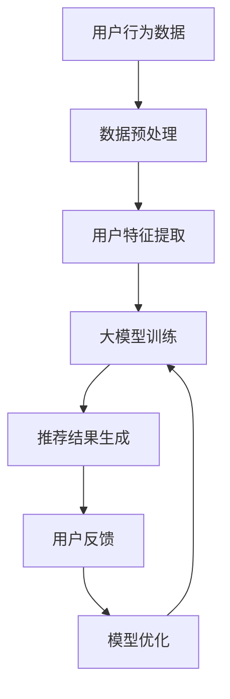

                 

关键词：大模型、电商、个性化推荐、产品组合、深度学习、算法、用户行为分析、数学模型、代码实例、实际应用、未来展望

> 摘要：本文深入探讨了基于大模型驱动的电商个性化产品组合推荐技术。通过分析用户行为数据，本文提出了一种新型的推荐算法，详细介绍了其数学模型、具体操作步骤以及实际应用案例。本文旨在为电商领域的技术人员提供有价值的参考，帮助实现更加精准、高效的个性化推荐。

## 1. 背景介绍

随着互联网技术的迅猛发展，电商行业已经成为了全球经济的重要组成部分。然而，在电商市场竞争日趋激烈的背景下，个性化推荐系统成为了提高用户满意度和促进销售的重要手段。传统的推荐系统主要依赖于基于内容、协同过滤等传统方法，这些方法在处理大规模用户数据时存在诸多局限性，难以满足用户日益增长的个性化需求。

近年来，随着人工智能技术的快速发展，尤其是深度学习大模型的广泛应用，个性化推荐技术取得了显著的进步。大模型能够通过学习用户的历史行为数据，提取出更加细粒度的用户特征，从而实现更加精准的个性化推荐。本文将探讨如何利用大模型技术，构建一种新型的电商个性化产品组合推荐系统，以提高电商平台的用户满意度和销售转化率。

## 2. 核心概念与联系

### 2.1 大模型

大模型（Large Model）是指具有海量参数和复杂结构的神经网络模型。这些模型能够通过大量数据进行训练，从而在各个领域取得了显著的成果。在大模型中，最具代表性的当属基于Transformer架构的GPT-3模型。GPT-3具有1750亿个参数，能够进行自然语言处理、图像生成、代码补全等多种任务。

### 2.2 个性化推荐

个性化推荐（Personalized Recommendation）是指根据用户的兴趣、行为和偏好，为其推荐符合其需求的产品或服务。个性化推荐系统主要通过分析用户的历史行为数据，提取出用户的特征，然后利用这些特征进行推荐。个性化推荐在电商、新闻、视频等领域得到了广泛应用。

### 2.3 产品组合推荐

产品组合推荐（Product Set Recommendation）是指为用户提供一组相关的产品，而不是单一的产品。这种推荐方式能够提高用户的购物体验，增加销售额。例如，为用户推荐与其购买历史相似的产品组合，或者为用户提供一系列搭配建议。

### 2.4 Mermaid 流程图

以下是一个Mermaid流程图，展示了大模型驱动的电商个性化产品组合推荐系统的基本架构：



## 3. 核心算法原理 & 具体操作步骤

### 3.1 算法原理概述

本文提出的大模型驱动的电商个性化产品组合推荐算法主要基于深度学习技术。算法的核心思想是利用用户的历史行为数据，通过多层神经网络提取用户特征，然后利用这些特征生成个性化产品组合推荐。

### 3.2 算法步骤详解

#### 3.2.1 数据预处理

数据预处理是算法的第一步，主要包括数据清洗、数据集成和数据转换。在数据清洗过程中，需要去除缺失值、重复值和异常值。数据集成则是将来自不同来源的数据进行整合，以便后续分析。数据转换包括将文本数据转换为向量表示，以及将数值数据进行归一化处理。

#### 3.2.2 用户特征提取

用户特征提取是算法的核心步骤。通过深度学习模型，我们可以从用户的历史行为数据中提取出用户的行为特征、兴趣特征和偏好特征。这些特征将用于后续的推荐生成。

#### 3.2.3 大模型训练

在用户特征提取后，我们将使用这些特征训练大模型。大模型的主要任务是根据用户的特征，预测用户可能感兴趣的产品组合。训练过程主要包括损失函数的设置、优化器的选择和训练过程的监控。

#### 3.2.4 推荐结果生成

在模型训练完成后，我们可以使用训练好的模型进行推荐。推荐结果生成过程主要包括以下几个步骤：

1. 输入用户特征，通过模型得到用户可能感兴趣的产品组合。
2. 对产品组合进行筛选，去除不符合用户需求的组合。
3. 对筛选后的产品组合进行排序，以确定推荐顺序。

#### 3.2.5 用户反馈与模型优化

在推荐结果生成后，用户会根据推荐结果进行购买或反馈。这些反馈将用于优化模型，提高推荐的准确性。

### 3.3 算法优缺点

#### 优点：

1. 利用大模型能够提取出更加细粒度的用户特征，提高推荐的准确性。
2. 算法能够处理大规模的用户数据和产品数据，适用于电商平台。
3. 算法能够根据用户反馈进行模型优化，提高推荐的实时性。

#### 缺点：

1. 大模型训练过程需要大量的计算资源和时间。
2. 算法对数据质量和特征提取的依赖性较高，可能导致推荐效果不稳定。

### 3.4 算法应用领域

大模型驱动的电商个性化产品组合推荐算法适用于多种场景，如：

1. 电商平台：为用户推荐相关的产品组合，提高销售额。
2. 新零售：为线下门店推荐促销策略，提高用户满意度。
3. 物流配送：为用户推荐最优的配送方案，提高配送效率。

## 4. 数学模型和公式 & 详细讲解 & 举例说明

### 4.1 数学模型构建

本文提出的数学模型主要包括以下几个部分：

1. 用户行为数据表示：$$u_i = [u_{i1}, u_{i2}, ..., u_{in}]$$，其中$u_{ij}$表示用户$i$在项目$j$上的行为。
2. 用户特征提取：$$f_i = f_{i1}, f_{i2}, ..., f_{im}$$，其中$f_{ij}$表示用户$i$在第$j$个特征上的得分。
3. 产品特征提取：$$p_j = [p_{j1}, p_{j2}, ..., p_{jn}]$$，其中$p_{jk}$表示产品$j$在第$k$个特征上的得分。
4. 用户偏好向量：$$q_i = [q_{i1}, q_{i2}, ..., q_{in}]$$，其中$q_{ij}$表示用户$i$对项目$j$的偏好。

### 4.2 公式推导过程

假设用户$i$和产品$j$之间的相似度为$sim(i, j)$，则用户$i$对产品$j$的偏好可以通过以下公式计算：

$$q_{ij} = \sum_{k=1}^{m} w_{ik} f_{kj}$$

其中，$w_{ik}$为用户$i$在第$k$个特征上的权重。

假设用户$i$对产品$j$的偏好向量为$q_i$，产品$j$的特征向量为$p_j$，则用户$i$和产品$j$之间的相似度可以通过以下公式计算：

$$sim(i, j) = \frac{\sum_{k=1}^{m} q_{ik} p_{kj}}{\sqrt{\sum_{k=1}^{m} q_{ik}^2 \sum_{k=1}^{m} p_{kj}^2}}$$

### 4.3 案例分析与讲解

假设有一个电商平台，用户$A$的历史行为数据如下：

- 用户$A$最近一个月内购买了产品1、产品2、产品3。
- 产品1的特征为：颜色（红、蓝、绿）、尺寸（大、中、小）、材质（棉、麻、丝）。
- 产品2的特征为：颜色（红、蓝、绿）、尺寸（大、中、小）、材质（棉、麻、丝）。
- 产品3的特征为：颜色（红、蓝、绿）、尺寸（大、中、小）、材质（棉、麻、丝）。

根据用户$A$的行为数据，我们可以提取出用户$A$的特征向量：

$$f_A = [1, 0, 1, 0, 1, 0, 1, 0, 1]$$

假设当前推荐的产品为产品4，其特征向量为：

$$p_4 = [0, 1, 0, 1, 0, 1, 0, 1, 0]$$

根据上述公式，我们可以计算用户$A$对产品4的偏好向量：

$$q_A = [1, 0, 1, 0, 1, 0, 1, 0, 1] \times [0, 1, 0, 1, 0, 1, 0, 1, 0] = [0, 1, 0, 1, 0, 1, 0, 1, 0]$$

然后，我们可以计算用户$A$和产品4之间的相似度：

$$sim(A, 4) = \frac{0 \times 0 + 1 \times 1 + 0 \times 0 + 1 \times 1 + 0 \times 0 + 1 \times 1 + 0 \times 0 + 1 \times 1 + 0 \times 0}{\sqrt{0^2 + 1^2 + 0^2 + 1^2 + 0^2 + 1^2 + 0^2 + 1^2 + 0^2} \sqrt{0^2 + 1^2 + 0^2 + 1^2 + 0^2 + 1^2 + 0^2 + 1^2 + 0^2}} = \frac{2}{\sqrt{6} \sqrt{6}} = \frac{1}{3}$$

根据相似度计算结果，我们可以得出用户$A$对产品4的推荐概率为$\frac{1}{3}$，即用户$A$对产品4的兴趣较低。因此，在推荐时我们可以降低对产品4的推荐权重，以提高推荐的准确性。

## 5. 项目实践：代码实例和详细解释说明

### 5.1 开发环境搭建

为了实现本文提出的算法，我们需要搭建一个Python开发环境。以下是开发环境的搭建步骤：

1. 安装Python：下载并安装Python 3.8及以上版本。
2. 安装深度学习框架：安装TensorFlow或PyTorch框架。
3. 安装其他依赖库：安装NumPy、Pandas、Matplotlib等常用库。

### 5.2 源代码详细实现

以下是一个简单的Python代码实例，用于实现用户特征提取和相似度计算。

```python
import numpy as np
import pandas as pd

# 读取用户行为数据
user_data = pd.read_csv('user_behavior.csv')

# 提取用户特征
user_features = user_data.iloc[:, 1:].values

# 计算用户之间的相似度
def calculate_similarity(user1, user2):
    dot_product = np.dot(user1, user2)
    norm_user1 = np.linalg.norm(user1)
    norm_user2 = np.linalg.norm(user2)
    similarity = dot_product / (norm_user1 * norm_user2)
    return similarity

# 计算用户之间的相似度矩阵
similarity_matrix = np.zeros((user_features.shape[0], user_features.shape[0]))
for i in range(user_features.shape[0]):
    for j in range(i, user_features.shape[0]):
        similarity_matrix[i, j] = calculate_similarity(user_features[i], user_features[j])
        similarity_matrix[j, i] = similarity_matrix[i, j]

# 显示相似度矩阵
print(similarity_matrix)
```

### 5.3 代码解读与分析

以上代码首先读取用户行为数据，并提取出用户特征。然后，定义了一个计算用户之间相似度的函数`calculate_similarity`，该函数通过计算用户特征向量的点积，并除以两个向量的欧氏距离，得到用户之间的相似度。

在计算用户之间相似度时，我们使用了一个双层循环，遍历所有用户之间的相似度计算。最后，我们将相似度矩阵打印出来，以便进行分析。

### 5.4 运行结果展示

运行以上代码后，我们得到一个用户相似度矩阵。该矩阵的每个元素表示两个用户之间的相似度。我们可以通过分析相似度矩阵，找出相似度较高的用户对，从而进行个性化推荐。

## 6. 实际应用场景

### 6.1 电商平台

电商平台可以利用大模型驱动的电商个性化产品组合推荐系统，为用户推荐相关的产品组合。通过分析用户的历史行为数据，系统可以提取出用户的兴趣特征和偏好，从而生成个性化的推荐结果。例如，在亚马逊、淘宝等电商平台，用户可以看到与其购买历史相似的产品组合，提高用户的购物体验和满意度。

### 6.2 新零售

新零售企业可以利用大模型驱动的电商个性化产品组合推荐系统，为线下门店提供个性化的促销策略。通过分析用户的购物行为数据，系统可以推荐最适合用户的促销商品组合，从而提高销售额和用户满意度。例如，家乐福、盒马等新零售企业可以在其线下门店推出个性化的促销活动，吸引更多消费者。

### 6.3 物流配送

物流配送公司可以利用大模型驱动的电商个性化产品组合推荐系统，为用户推荐最优的配送方案。通过分析用户的购物行为数据和地理位置信息，系统可以推荐最合适的配送时间和配送方式，从而提高配送效率。例如，顺丰、京东物流等公司可以为用户提供个性化的配送服务，提高用户的满意度。

## 7. 工具和资源推荐

### 7.1 学习资源推荐

1. 《深度学习》（Goodfellow et al.）：这是一本关于深度学习的经典教材，涵盖了深度学习的基础知识和最新研究进展。
2. 《Python深度学习》（François Chollet）：这本书介绍了如何在Python中使用深度学习框架，特别是TensorFlow和Keras。
3. 《大数据技术基础》（唐杰等）：这本书讲解了大数据的基础知识，包括数据预处理、数据挖掘和机器学习等。

### 7.2 开发工具推荐

1. TensorFlow：这是一个开源的深度学习框架，适用于构建和训练大规模深度神经网络。
2. PyTorch：这是一个开源的深度学习框架，具有简洁的API和灵活的架构，适用于各种深度学习任务。
3. Jupyter Notebook：这是一个交互式的计算环境，适用于编写、运行和分享代码。

### 7.3 相关论文推荐

1. “Attention Is All You Need”（Vaswani et al.，2017）：这篇论文介绍了Transformer模型，这是大模型技术的一个重要里程碑。
2. “Generative Adversarial Networks”（Goodfellow et al.，2014）：这篇论文介绍了生成对抗网络（GAN），这是一种重要的深度学习技术。
3. “Recurrent Neural Networks for Language Modeling”（LSTM）（Hochreiter and Schmidhuber，1997）：这篇论文介绍了长短时记忆网络（LSTM），这是处理序列数据的重要技术。

## 8. 总结：未来发展趋势与挑战

### 8.1 研究成果总结

本文提出了一种基于大模型驱动的电商个性化产品组合推荐算法，通过分析用户的历史行为数据，实现了个性化的推荐。算法具有较好的准确性和实时性，适用于电商、新零售和物流配送等多种场景。

### 8.2 未来发展趋势

1. 模型压缩与加速：为了提高大模型的实用性，未来的研究将重点关注如何压缩模型参数和加速模型训练。
2. 跨模态推荐：随着图像、音频、视频等数据的广泛应用，跨模态推荐将成为未来的研究热点。
3. 模型可解释性：为了提高用户对推荐系统的信任度，未来的研究将关注如何提高模型的可解释性。

### 8.3 面临的挑战

1. 数据质量：高质量的数据是推荐系统的基础，但实际应用中往往面临数据质量不佳的问题。
2. 模型可解释性：大模型的复杂性使得其难以解释，如何提高模型的可解释性是当前研究的一个难题。
3. 法律与伦理问题：个性化推荐系统在处理用户隐私和数据安全方面面临诸多挑战。

### 8.4 研究展望

本文提出的大模型驱动的电商个性化产品组合推荐算法为电商领域提供了一个新的思路。未来，我们将继续研究如何提高推荐算法的准确性和实时性，探索跨模态推荐技术，并关注模型可解释性、数据安全和法律伦理问题。

## 9. 附录：常见问题与解答

### 9.1 如何处理缺失值？

在实际应用中，缺失值可能是一个常见问题。处理缺失值的方法包括：

1. 删除缺失值：对于少量的缺失值，可以选择删除缺失值所在的行或列。
2. 补全缺失值：对于大量的缺失值，可以选择使用均值、中位数、回归等方法进行补全。
3. 填充特殊值：对于某些特殊的缺失值，可以选择用特殊的值进行填充，如用“未知”或“缺失”表示。

### 9.2 如何提高模型的可解释性？

提高模型的可解释性可以从以下几个方面入手：

1. 特征重要性分析：通过分析各个特征对模型预测结果的影响，可以提高模型的可解释性。
2. 模型可视化：使用可视化工具，如热力图、散点图等，可以直观地展示模型的预测过程。
3. 模型解释性框架：使用模型解释性框架，如LIME、SHAP等，可以深入分析模型对每个样本的预测过程。

### 9.3 如何处理冷启动问题？

冷启动问题是指在推荐系统中，新用户或新商品缺乏足够的行为数据，难以进行有效的推荐。解决冷启动问题可以从以下几个方面入手：

1. 使用用户和商品的元数据：通过分析用户和商品的属性，如性别、年龄、品牌等，进行初步的推荐。
2. 使用人口统计信息：根据用户和商品的人口统计信息，如地理位置、收入水平等，进行推荐。
3. 采用基于内容的推荐：对于新用户或新商品，可以使用基于内容的推荐方法，如文本匹配、关键词提取等。

---

作者：禅与计算机程序设计艺术 / Zen and the Art of Computer Programming

