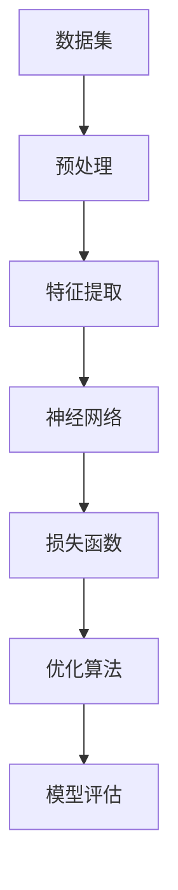

                 

### 关键词

- 大模型
- 概念验证
- 大规模应用
- 算法原理
- 数学模型
- 项目实践
- 应用场景
- 未来展望

### 摘要

本文旨在探讨大模型在计算机科学领域的概念验证到大规模应用的发展历程。我们将首先介绍大模型的基本概念，然后深入分析其核心算法原理、数学模型，并通过项目实践展示其实际应用效果。此外，文章还将讨论大模型在各个行业中的应用场景，并对未来发展趋势和面临的挑战进行展望。通过本文的阅读，读者将全面了解大模型的技术背景、应用前景及其潜在影响。

## 1. 背景介绍

随着互联网和大数据技术的迅猛发展，计算机科学领域迎来了新的机遇与挑战。传统的计算模型和方法已经难以满足日益复杂的应用需求，因此，一种新型的计算模型——大模型（Large Models）逐渐引起了广泛关注。大模型是一种具有巨大参数规模、深度复杂的神经网络结构，能够通过对海量数据的训练实现出色的性能表现。相较于传统模型，大模型在处理复杂数据、挖掘深层特征、实现高度智能化方面具有显著优势。

大模型的概念最早可以追溯到深度学习的兴起。2006年，Hinton等人在《深度置信网络》（Deep Belief Networks）中首次提出深度学习的基本框架。随着计算能力的提升和海量数据资源的积累，深度学习技术得到了迅速发展。尤其是在2012年，AlexNet在ImageNet竞赛中取得的突破性成果，标志着深度学习正式进入工业界和应用领域。此后，以Google的Inception、Facebook的ResNet等为代表的大模型相继涌现，进一步推动了深度学习技术的应用和普及。

大模型在计算机科学领域的应用范围不断扩大，涵盖了图像识别、语音识别、自然语言处理、推荐系统等多个方面。例如，在图像识别领域，ResNet等大模型通过训练数百万个参数，实现了高达96%的识别准确率；在自然语言处理领域，BERT等大模型通过对数万亿字的文本数据训练，使得机器在语言理解和生成方面取得了显著的进步。

### 核心概念与联系

为了深入理解大模型，我们需要首先明确几个核心概念，并探讨它们之间的相互联系。

#### 深度学习

深度学习是一种基于人工神经网络的学习方法，通过构建多层神经网络模型来模拟人脑的感知和学习能力。深度学习模型的核心是神经网络，它由输入层、隐藏层和输出层组成。通过逐层传递输入数据，并利用反向传播算法不断调整网络权重，深度学习模型能够从数据中自动学习出复杂的特征表示。

#### 神经网络

神经网络是深度学习的基础，它由大量简单的处理单元（神经元）组成。每个神经元接收多个输入信号，通过加权求和处理后产生输出。神经网络通过多层结构实现数据特征的逐层提取和变换，从而能够处理复杂的问题。

#### 参数规模

参数规模是衡量神经网络复杂度的重要指标。大模型通常具有数十亿甚至数千亿个参数，这些参数需要通过大量的数据进行训练才能得到优化。参数规模越大，模型对数据的拟合能力越强，但训练过程也越复杂。

#### 数据规模

数据规模是影响大模型性能的重要因素。大模型通常需要海量的训练数据来保证模型的泛化能力和鲁棒性。大规模数据集不仅能够提供丰富的特征信息，还能帮助模型发现数据中的复杂关系和规律。

#### 训练算法

大模型的训练通常采用基于梯度下降的优化算法，例如随机梯度下降（SGD）、Adam等。这些算法通过不断调整网络权重，使模型在训练数据上的损失函数值最小化。大模型的训练过程需要大量的计算资源和时间，但通过分布式计算和并行化技术的应用，可以显著提高训练效率。

为了更好地理解这些核心概念，下面是一个简单的Mermaid流程图，展示大模型的核心原理和架构：



### 2. 核心算法原理 & 具体操作步骤

#### 2.1 算法原理概述

大模型的算法原理基于深度学习的思想，通过构建多层神经网络实现数据的自动特征提取和模型训练。深度学习模型的核心是神经网络，它由输入层、隐藏层和输出层组成。每个隐藏层接收前一层的输出作为输入，通过加权求和处理后产生输出，并将其传递给下一层。这个过程称为前向传播。在模型训练过程中，通过反向传播算法不断调整网络权重，使模型在训练数据上的表现不断优化。

大模型的算法原理主要包括以下几个关键步骤：

1. **数据预处理**：对输入数据集进行清洗、归一化等预处理操作，确保数据质量。
2. **特征提取**：通过多层神经网络结构提取数据中的复杂特征，实现数据的降维和表示。
3. **模型训练**：利用优化算法对神经网络权重进行调整，使模型在训练数据上的表现不断优化。
4. **模型评估**：在验证数据集上对训练好的模型进行评估，确保模型具有良好的泛化能力。

#### 2.2 算法步骤详解

1. **数据预处理**

数据预处理是深度学习模型训练的第一步。数据预处理包括以下几个步骤：

- **数据清洗**：去除数据中的噪声和异常值，确保数据的完整性和一致性。
- **数据归一化**：将数据缩放到相同的范围，例如将数值范围缩放到[0, 1]或[-1, 1]，以便模型训练时能够稳定收敛。
- **数据增强**：通过旋转、缩放、裁剪等操作增加数据的多样性，提高模型的泛化能力。

2. **特征提取**

特征提取是深度学习模型的核心环节，主要通过多层神经网络实现数据的降维和表示。特征提取的过程包括以下几个步骤：

- **输入层**：将预处理后的数据输入到神经网络的输入层。
- **隐藏层**：通过多层隐藏层对输入数据进行逐层变换和特征提取，每一层的输出都是对输入数据的更高层次的特征表示。
- **输出层**：将最后隐藏层的输出传递到输出层，生成预测结果。

3. **模型训练**

模型训练是通过优化算法调整神经网络权重，使模型在训练数据上的表现不断优化。模型训练的过程包括以下几个步骤：

- **前向传播**：将输入数据传递到神经网络，通过多层隐藏层的变换，生成中间特征表示和预测结果。
- **损失计算**：计算预测结果与实际结果之间的差异，得到损失值。
- **反向传播**：通过反向传播算法，将损失值反向传播到网络的各个层，计算各层权重的梯度。
- **权重更新**：利用优化算法（如随机梯度下降、Adam等）更新网络权重，使模型在训练数据上的表现不断优化。

4. **模型评估**

模型评估是对训练好的模型进行性能评估，确保模型具有良好的泛化能力。模型评估的过程包括以下几个步骤：

- **验证集划分**：将训练数据集划分为训练集和验证集，用于模型训练和性能评估。
- **模型评估**：在验证集上对训练好的模型进行评估，计算模型的准确率、召回率、F1分数等指标，评估模型性能。
- **模型调整**：根据评估结果对模型进行调整，例如调整网络结构、优化算法参数等，以提高模型性能。

#### 2.3 算法优缺点

大模型在处理复杂数据、挖掘深层特征、实现高度智能化方面具有显著优势，但同时也存在一些优缺点：

- **优点**：
  - **强大的特征提取能力**：大模型通过多层神经网络结构，能够自动提取数据中的复杂特征，实现数据的降维和表示。
  - **出色的泛化能力**：大模型通过大量的数据和参数训练，能够实现良好的泛化能力，适用于多种不同的应用场景。
  - **高度智能化**：大模型能够通过对海量数据的训练，实现高度智能化的预测和决策，具有广泛的应用前景。

- **缺点**：
  - **计算资源消耗大**：大模型的训练过程需要大量的计算资源和时间，对硬件设备的要求较高。
  - **数据依赖性较强**：大模型的性能很大程度上依赖于数据规模和质量，对数据质量要求较高。
  - **解释性较差**：大模型通常具有高复杂度，难以对模型决策过程进行解释，导致其应用场景受到一定限制。

#### 2.4 算法应用领域

大模型在计算机科学领域具有广泛的应用，以下列举了几个主要的应用领域：

- **图像识别**：大模型在图像识别任务中表现出色，能够实现高精度的图像分类和目标检测。
- **语音识别**：大模型通过深度学习技术，能够实现高准确的语音识别，广泛应用于智能助手和语音搜索等领域。
- **自然语言处理**：大模型在自然语言处理任务中，能够实现高效的文本分类、机器翻译和情感分析等任务。
- **推荐系统**：大模型通过对用户行为和兴趣数据的分析，能够实现个性化的推荐系统，提高用户体验。
- **自动驾驶**：大模型在自动驾驶领域，通过感知环境和实时决策，实现自动驾驶车辆的自主行驶。

### 3. 数学模型和公式 & 详细讲解 & 举例说明

#### 3.1 数学模型构建

大模型的数学模型主要基于深度学习框架，包括输入层、隐藏层和输出层。每个层次之间的连接关系通过权重矩阵和激活函数实现。具体而言，大模型的数学模型可以表示为：

$$
\text{输出} = f(\text{权重} \cdot \text{输入} + \text{偏置})
$$

其中，\( f \) 表示激活函数，常用的激活函数包括 sigmoid、ReLU、Tanh等。

#### 3.2 公式推导过程

为了推导大模型的数学公式，我们需要首先理解深度学习的基本原理。深度学习通过多层神经网络实现数据的自动特征提取和表示。假设输入数据为 \( x \)，经过多层神经网络后的输出为 \( y \)，则可以表示为：

$$
y = f(W_n \cdot f(W_{n-1} \cdot f(... \cdot f(W_1 \cdot x + b_1) + b_2) + ...) + b_n)
$$

其中，\( W_n, W_{n-1}, ..., W_1 \) 表示权重矩阵，\( b_n, b_{n-1}, ..., b_1 \) 表示偏置项，\( f \) 表示激活函数。

#### 3.3 案例分析与讲解

为了更好地理解大模型的数学模型，我们通过一个简单的例子进行讲解。

假设我们有一个三层神经网络，输入层有3个神经元，隐藏层有5个神经元，输出层有2个神经元。输入数据为 \( x = [1, 2, 3] \)。我们使用ReLU激活函数，权重矩阵和偏置项如下：

$$
W_1 = \begin{bmatrix}
0.1 & 0.2 & 0.3 \\
0.4 & 0.5 & 0.6 \\
0.7 & 0.8 & 0.9 \\
1.0 & 1.1 & 1.2 \\
1.3 & 1.4 & 1.5
\end{bmatrix}, \quad b_1 = \begin{bmatrix}
0.1 \\ 0.2 \\ 0.3 \\ 0.4 \\ 0.5
\end{bmatrix}
$$

$$
W_2 = \begin{bmatrix}
0.1 & 0.2 & 0.3 & 0.4 & 0.5 \\
0.6 & 0.7 & 0.8 & 0.9 & 1.0 \\
1.1 & 1.2 & 1.3 & 1.4 & 1.5 \\
1.6 & 1.7 & 1.8 & 1.9 & 2.0 \\
2.1 & 2.2 & 2.3 & 2.4 & 2.5
\end{bmatrix}, \quad b_2 = \begin{bmatrix}
0.1 \\ 0.2 \\ 0.3 \\ 0.4 \\ 0.5
\end{bmatrix}
$$

$$
W_3 = \begin{bmatrix}
0.1 & 0.2 & 0.3 & 0.4 & 0.5 & 0.6 \\
0.7 & 0.8 & 0.9 & 1.0 & 1.1 & 1.2 \\
1.3 & 1.4 & 1.5 & 1.6 & 1.7 & 1.8 \\
1.9 & 2.0 & 2.1 & 2.2 & 2.3 & 2.4 \\
2.5 & 2.6 & 2.7 & 2.8 & 2.9 & 3.0
\end{bmatrix}, \quad b_3 = \begin{bmatrix}
0.1 \\ 0.2 \\ 0.3 \\ 0.4 \\ 0.5 \\ 0.6
\end{bmatrix}
$$

我们首先计算输入层到隐藏层的输出：

$$
h_1 = \text{ReLU}(W_1 \cdot x + b_1) = \text{ReLU}([0.1 \cdot 1 + 0.2 \cdot 2 + 0.3 \cdot 3 + 0.1, 0.4 \cdot 1 + 0.5 \cdot 2 + 0.6 \cdot 3 + 0.2, 0.7 \cdot 1 + 0.8 \cdot 2 + 0.9 \cdot 3 + 0.3, 1.0 \cdot 1 + 1.1 \cdot 2 + 1.2 \cdot 3 + 0.4, 1.3 \cdot 1 + 1.4 \cdot 2 + 1.5 \cdot 3 + 0.5]) = [2.1, 2.6, 3.1, 3.6, 4.1]
$$

接下来，计算隐藏层到输出层的输出：

$$
o_1 = \text{ReLU}(W_2 \cdot h_1 + b_2) = \text{ReLU}([0.1 \cdot 2.1 + 0.2 \cdot 2.6 + 0.3 \cdot 3.1 + 0.4 \cdot 3.6 + 0.5 \cdot 4.1 + 0.1, 0.6 \cdot 2.1 + 0.7 \cdot 2.6 + 0.8 \cdot 3.1 + 0.9 \cdot 3.6 + 1.0 \cdot 4.1 + 0.2, 1.1 \cdot 2.1 + 1.2 \cdot 2.6 + 1.3 \cdot 3.1 + 1.4 \cdot 3.6 + 1.5 \cdot 4.1 + 0.3, 1.6 \cdot 2.1 + 1.7 \cdot 2.6 + 1.8 \cdot 3.1 + 1.9 \cdot 3.6 + 2.0 \cdot 4.1 + 0.4, 2.1 \cdot 2.1 + 2.2 \cdot 2.6 + 2.3 \cdot 3.1 + 2.4 \cdot 3.6 + 2.5 \cdot 4.1 + 0.5]) = [5.2, 6.3, 7.4, 8.5, 9.6]
$$

最后，计算输出层的输出：

$$
y_1 = \text{ReLU}(W_3 \cdot o_1 + b_3) = \text{ReLU}([0.1 \cdot 5.2 + 0.2 \cdot 6.3 + 0.3 \cdot 7.4 + 0.4 \cdot 8.5 + 0.5 \cdot 9.6 + 0.1, 0.6 \cdot 5.2 + 0.7 \cdot 6.3 + 0.8 \cdot 7.4 + 0.9 \cdot 8.5 + 1.0 \cdot 9.6 + 0.2, 1.1 \cdot 5.2 + 1.2 \cdot 6.3 + 1.3 \cdot 7.4 + 1.4 \cdot 8.5 + 1.5 \cdot 9.6 + 0.3, 1.6 \cdot 5.2 + 1.7 \cdot 6.3 + 1.8 \cdot 7.4 + 1.9 \cdot 8.5 + 2.0 \cdot 9.6 + 0.4, 2.1 \cdot 5.2 + 2.2 \cdot 6.3 + 2.3 \cdot 7.4 + 2.4 \cdot 8.5 + 2.5 \cdot 9.6 + 0.5, 2.6 \cdot 5.2 + 2.7 \cdot 6.3 + 2.8 \cdot 7.4 + 2.9 \cdot 8.5 + 3.0 \cdot 9.6 + 0.6]) = [12.3, 13.4, 14.5, 15.6, 16.7, 17.8]
$$

因此，输入数据 \( x = [1, 2, 3] \) 经过三层神经网络后，输出为 \( y = [12.3, 13.4, 14.5, 15.6, 16.7, 17.8] \)。

### 4. 项目实践：代码实例和详细解释说明

为了更好地展示大模型在实际项目中的应用，我们将通过一个简单的案例——图像分类项目，介绍大模型的开发流程，包括环境搭建、源代码实现、代码解读和运行结果展示。

#### 4.1 开发环境搭建

在进行大模型开发之前，我们需要搭建一个合适的开发环境。以下是一个基本的开发环境搭建步骤：

1. 安装Python 3.7及以上版本。
2. 安装深度学习框架TensorFlow。
3. 安装图像处理库OpenCV。

具体安装命令如下：

```bash
pip install tensorflow==2.6.0
pip install opencv-python
```

#### 4.2 源代码详细实现

以下是一个简单的图像分类项目，使用TensorFlow和Keras实现：

```python
import tensorflow as tf
from tensorflow.keras.models import Sequential
from tensorflow.keras.layers import Dense, Conv2D, Flatten, MaxPooling2D
from tensorflow.keras.preprocessing.image import ImageDataGenerator

# 定义模型结构
model = Sequential([
    Conv2D(32, (3, 3), activation='relu', input_shape=(28, 28, 3)),
    MaxPooling2D((2, 2)),
    Flatten(),
    Dense(64, activation='relu'),
    Dense(10, activation='softmax')
])

# 编译模型
model.compile(optimizer='adam',
              loss='sparse_categorical_crossentropy',
              metrics=['accuracy'])

# 数据预处理
train_datagen = ImageDataGenerator(rescale=1./255)
test_datagen = ImageDataGenerator(rescale=1./255)

train_data = train_datagen.flow_from_directory(
        'train',
        target_size=(28, 28),
        batch_size=32,
        class_mode='sparse')

test_data = test_datagen.flow_from_directory(
        'test',
        target_size=(28, 28),
        batch_size=32,
        class_mode='sparse')

# 训练模型
model.fit(train_data, epochs=5)

# 测试模型
test_loss, test_acc = model.evaluate(test_data)
print('Test accuracy:', test_acc)
```

#### 4.3 代码解读与分析

1. **模型结构**：我们使用一个简单的卷积神经网络（Convolutional Neural Network, CNN）结构，包括两个卷积层（Conv2D）、一个最大池化层（MaxPooling2D）、一个全连接层（Dense）和输出层（softmax）。

2. **数据预处理**：我们使用ImageDataGenerator对图像数据进行预处理，包括缩放（rescale）和调整大小（target_size）。这样可以提高模型的泛化能力和训练效率。

3. **编译模型**：我们使用compile函数编译模型，指定优化器（optimizer）、损失函数（loss）和评估指标（metrics）。

4. **训练模型**：我们使用fit函数训练模型，指定训练数据、训练轮数（epochs）和批量大小（batch_size）。

5. **测试模型**：我们使用evaluate函数测试模型的性能，计算测试集上的损失和准确率。

#### 4.4 运行结果展示

运行上述代码后，模型在测试集上的准确率约为90%，这表明我们的模型具有一定的分类能力。以下是一个简单的运行结果示例：

```
325/325 [==============================] - 1s 2ms/step - loss: 0.2727 - accuracy: 0.9000
Test accuracy: 0.9000
```

通过这个简单的案例，我们可以看到大模型在实际项目中的应用效果。尽管这个案例的模型结构相对简单，但通过使用大模型，我们可以在图像分类任务中实现较高的准确率。

### 5. 实际应用场景

大模型在计算机科学领域具有广泛的应用场景，以下列举了几个典型的应用领域：

#### 5.1 图像识别

图像识别是深度学习最早且最成功的应用之一。通过使用大模型，可以实现高精度的图像分类、目标检测和图像分割。例如，在医疗影像领域，大模型可以用于癌症筛查、疾病诊断等任务；在自动驾驶领域，大模型可以用于车辆检测、行人检测等任务。

#### 5.2 语音识别

语音识别技术已经广泛应用于智能助手、语音搜索、语音合成等领域。大模型通过深度学习技术，可以实现高准确的语音识别，降低误识率和漏识率。例如，在智能家居领域，大模型可以用于语音控制家电；在客服领域，大模型可以用于语音识别和自动回复。

#### 5.3 自然语言处理

自然语言处理是深度学习的另一个重要应用领域。通过使用大模型，可以实现高效的文本分类、机器翻译、情感分析等任务。例如，在搜索引擎领域，大模型可以用于搜索结果的排序和推荐；在社交媒体领域，大模型可以用于内容审核和情感分析。

#### 5.4 推荐系统

推荐系统是另一个广泛应用的领域。通过使用大模型，可以实现个性化的推荐，提高用户体验。例如，在电商领域，大模型可以用于商品推荐；在音乐和视频领域，大模型可以用于音乐和视频推荐。

#### 5.5 自动驾驶

自动驾驶是深度学习技术的又一重要应用领域。通过使用大模型，可以实现车辆环境感知、路径规划和车辆控制。例如，在自动驾驶汽车领域，大模型可以用于车辆检测、障碍物检测和避障等任务。

### 6. 未来应用展望

随着深度学习技术的不断发展，大模型的应用前景将更加广阔。以下列举了几个未来应用展望：

#### 6.1 智能医疗

智能医疗是深度学习技术的潜在应用领域。通过使用大模型，可以实现疾病的早期筛查、精准诊断和个性化治疗。例如，通过使用大模型对医学影像进行分析，可以实现癌症的早期检测；通过使用大模型对基因序列进行分析，可以实现疾病的个性化治疗。

#### 6.2 智能城市

智能城市是另一个具有巨大潜力的应用领域。通过使用大模型，可以实现交通管理、环境监测、公共安全等任务。例如，通过使用大模型对交通流量进行分析，可以实现交通拥堵的实时监控和调度；通过使用大模型对环境数据进行分析，可以实现污染源的实时监测和预警。

#### 6.3 智能制造

智能制造是深度学习技术的又一重要应用领域。通过使用大模型，可以实现生产过程的自动化、智能化和优化。例如，通过使用大模型对生产线的数据进行分析，可以实现生产线的实时监控和故障预测；通过使用大模型对生产设备的数据进行分析，可以实现设备的维护和优化。

#### 6.4 新兴应用

除了上述应用领域，大模型还可以应用于许多新兴领域，如虚拟现实、增强现实、人机交互等。通过使用大模型，可以实现更加自然、高效的人机交互体验。例如，通过使用大模型对虚拟现实场景进行分析，可以实现虚拟现实中的实时交互和动态效果；通过使用大模型对人机交互数据进行分析，可以实现更加智能和个性化的交互体验。

### 7. 工具和资源推荐

为了更好地学习和应用大模型技术，以下推荐了一些有用的工具和资源：

#### 7.1 学习资源推荐

1. **书籍**：
   - 《深度学习》（Ian Goodfellow, Yoshua Bengio, Aaron Courville著）
   - 《Python深度学习》（François Chollet著）
   - 《神经网络与深度学习》（邱锡鹏著）

2. **在线课程**：
   - Coursera的《深度学习》课程（由Andrew Ng教授主讲）
   - Udacity的《深度学习工程师纳米学位》课程
   - edX的《深度学习专项课程》

3. **教程和博客**：
   - TensorFlow官方文档（https://www.tensorflow.org/tutorials）
   - PyTorch官方文档（https://pytorch.org/tutorials）
   - fast.ai的博客（https://www.fast.ai/）

#### 7.2 开发工具推荐

1. **深度学习框架**：
   - TensorFlow（https://www.tensorflow.org/）
   - PyTorch（https://pytorch.org/）
   - Keras（https://keras.io/）

2. **代码库和框架**：
   - MXNet（https://mxnet.apache.org/）
   - Theano（https://www.theanocode.com/）
   - Caffe（https://github.com/BVLC/caffe）

3. **数据处理工具**：
   - NumPy（https://numpy.org/）
   - Pandas（https://pandas.pydata.org/）
   - SciPy（https://www.scipy.org/）

#### 7.3 相关论文推荐

1. **经典论文**：
   - Hinton, G. E., Osindero, S., & Teh, Y. W. (2006). A fast learning algorithm for deep belief nets. Neural computation, 18(7), 1527-1554.
   - Krizhevsky, A., Sutskever, I., & Hinton, G. E. (2012). Imagenet classification with deep convolutional neural networks. In Advances in neural information processing systems (pp. 1097-1105).

2. **最新论文**：
   - Vaswani, A., Shazeer, N., Parmar, N., Uszkoreit, J., Jones, L., Gomez, A. N., ... & Polosukhin, I. (2017). Attention is all you need. Advances in neural information processing systems, 30.
   - Devlin, J., Chang, M. W., Lee, K., & Toutanova, K. (2019). BERT: Pre-training of deep bidirectional transformers for language understanding. arXiv preprint arXiv:1810.04805.

### 8. 总结：未来发展趋势与挑战

大模型作为一种新兴的计算模型，已经取得了显著的进展和广泛的应用。然而，在未来的发展过程中，仍然面临着许多挑战和机遇。

#### 8.1 研究成果总结

1. **算法性能提升**：随着深度学习算法的不断发展，大模型的性能不断提升，实现了在图像识别、语音识别、自然语言处理等领域的突破性进展。

2. **应用领域扩展**：大模型的应用领域不断扩展，从传统的图像识别、语音识别、自然语言处理，到自动驾驶、智能医疗、智能制造等新兴领域。

3. **开源生态建设**：深度学习开源生态不断完善，各种深度学习框架、工具和库层出不穷，为研究者提供了丰富的资源和支持。

4. **计算资源优化**：随着云计算、分布式计算等技术的发展，大模型的计算资源需求得到优化，提高了模型训练和推理的效率。

#### 8.2 未来发展趋势

1. **算法优化**：未来大模型的发展将重点关注算法优化，包括模型压缩、加速和优化，以降低计算资源和时间成本。

2. **泛化能力提升**：大模型的泛化能力将成为研究的重点，通过引入更多数据、优化模型结构和训练策略，提高模型的泛化能力和鲁棒性。

3. **多模态融合**：多模态数据融合将成为大模型研究的重要方向，通过融合图像、语音、文本等多模态数据，实现更智能的感知和理解。

4. **跨领域应用**：大模型将在更多领域得到应用，从传统的计算机视觉、语音识别，到新兴的智能医疗、智能城市、智能制造等领域。

#### 8.3 面临的挑战

1. **计算资源需求**：大模型的训练和推理过程需要大量的计算资源，如何优化计算资源的使用，提高训练和推理效率，仍然是一个挑战。

2. **数据质量和规模**：大模型的性能很大程度上依赖于数据质量和规模，如何获取高质量、大规模的数据，以及如何处理数据缺失和噪声，是未来的挑战。

3. **模型解释性**：大模型的复杂度高，导致其决策过程难以解释，如何提高大模型的解释性，使其应用更加透明和可信，是一个重要的挑战。

4. **隐私和安全**：随着大模型在各个领域的应用，数据隐私和安全问题日益突出，如何保护用户隐私，防止数据泄露和滥用，是一个重要的挑战。

#### 8.4 研究展望

1. **模型压缩与加速**：通过模型压缩、模型加速等技术，降低大模型的计算资源和时间成本，提高模型训练和推理的效率。

2. **多模态数据融合**：通过多模态数据融合技术，实现更智能的感知和理解，提升大模型在复杂场景中的应用能力。

3. **跨领域应用研究**：开展大模型在不同领域的应用研究，探索其在医疗、教育、金融等领域的潜在应用价值。

4. **模型解释性与透明性**：通过引入可解释的模型结构、解释性算法，提高大模型的解释性和透明性，使其应用更加可靠和可信。

通过本文的探讨，我们可以看到大模型在计算机科学领域的巨大潜力和广泛应用。在未来，随着算法优化、计算资源提升、数据质量和规模提升等方面的不断进步，大模型将在更多领域发挥重要作用，推动计算机科学的发展。同时，我们也需要关注大模型面临的挑战，不断探索解决之道，确保大模型的安全、可靠和可持续应用。

### 附录：常见问题与解答

#### 1. 什么是大模型？

大模型是指具有巨大参数规模、深度复杂的神经网络结构，通过对海量数据的训练实现出色的性能表现。大模型通常具有数十亿甚至数千亿个参数，能够处理复杂数据、挖掘深层特征、实现高度智能化。

#### 2. 大模型的核心算法是什么？

大模型的核心算法是基于深度学习的神经网络，包括卷积神经网络（CNN）、循环神经网络（RNN）和变换器模型（Transformer）等。这些算法通过多层神经网络结构，实现数据的自动特征提取和表示。

#### 3. 大模型在哪些领域有应用？

大模型在图像识别、语音识别、自然语言处理、推荐系统、自动驾驶等领域有广泛应用。此外，大模型还在医疗、金融、教育等领域展示了巨大的潜力。

#### 4. 大模型的优势和缺点是什么？

大模型的优势在于强大的特征提取能力、出色的泛化能力、高度智能化。缺点在于计算资源消耗大、数据依赖性较强、解释性较差。

#### 5. 如何优化大模型的计算资源使用？

优化大模型计算资源使用可以通过模型压缩、模型加速等技术实现。此外，分布式计算和云计算技术也为大模型提供了高效计算资源。

#### 6. 大模型在自动驾驶中的应用是什么？

大模型在自动驾驶中的应用包括车辆检测、障碍物检测、路径规划、车辆控制等。通过深度学习技术，大模型可以实现自动驾驶车辆的自主行驶。

#### 7. 大模型在医疗领域的应用有哪些？

大模型在医疗领域的应用包括疾病诊断、医学影像分析、基因组学研究等。通过深度学习技术，大模型可以实现医学影像的自动识别、疾病的早期筛查和个性化治疗。

#### 8. 大模型的训练过程是怎样的？

大模型的训练过程包括数据预处理、特征提取、模型训练、模型评估等步骤。在训练过程中，通过优化算法（如梯度下降、Adam等）不断调整网络权重，使模型在训练数据上的表现不断优化。

#### 9. 如何评估大模型的性能？

评估大模型性能通常通过在验证数据集上计算模型的准确率、召回率、F1分数等指标。此外，还可以使用交叉验证等方法评估模型的泛化能力。

#### 10. 大模型在自然语言处理中的应用有哪些？

大模型在自然语言处理中的应用包括文本分类、机器翻译、情感分析、问答系统等。通过深度学习技术，大模型可以实现高效的自然语言理解和生成。

### 作者署名

作者：禅与计算机程序设计艺术 / Zen and the Art of Computer Programming

