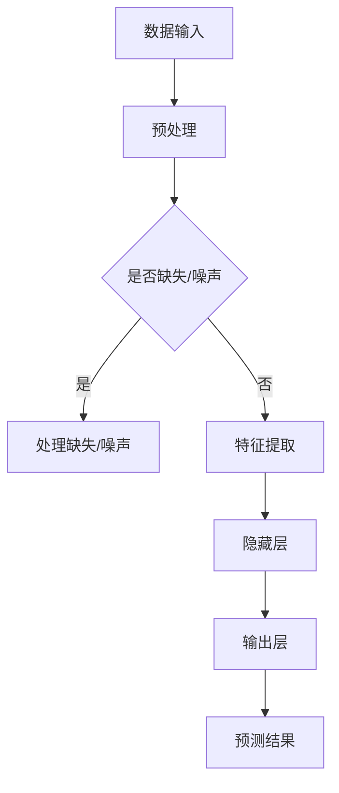

                 

关键词：大模型，商业智能，前沿技术，数据处理，数据分析，机器学习

> 摘要：本文将深入探讨大模型在商业智能领域的应用，解析大模型的原理、数学模型、算法应用，并通过实际项目实践和案例分析，展望其未来的发展前景与面临的挑战。

## 1. 背景介绍

随着信息技术的飞速发展，数据已成为当今社会的重要资产。企业通过数据获取洞察，优化决策，提升竞争力。商业智能（Business Intelligence, BI）作为数据处理和分析的技术，正日益受到重视。传统的商业智能技术主要依赖于关系数据库和统计方法，但随着数据规模的爆炸性增长，这些方法已经无法满足复杂的数据分析需求。

### 大模型：商业智能的新引擎

大模型，又称大规模机器学习模型，是一种能够处理海量数据并从中提取有价值信息的人工智能系统。近年来，大模型在自然语言处理、计算机视觉等领域取得了突破性进展，逐渐成为商业智能领域的新引擎。通过大模型，企业可以更高效地进行数据分析，实现智能化的业务决策。

### 商业智能的发展历程

- **早期**：以报表和仪表盘为代表的基本数据分析工具。
- **中期**：引入数据仓库和数据挖掘技术，实现更复杂的数据分析。
- **近期**：大数据和云计算的兴起，使商业智能技术迈向智能化。

### 商业智能的重要性

- **提升竞争力**：通过数据分析，企业可以深入了解市场动态，优化业务策略。
- **降低成本**：通过数据驱动的决策，减少不必要的资源浪费。
- **增强用户体验**：利用数据分析，企业可以提供更个性化的产品和服务。

## 2. 核心概念与联系

### 大模型的基本概念

大模型通常指的是具有数百万甚至数十亿参数的深度学习模型。这些模型通过训练大量数据，能够自动提取数据中的特征，实现复杂的数据分析任务。

### 大模型与商业智能的联系

大模型在商业智能中的应用主要体现在以下几个方面：

1. **数据预处理**：大模型能够自动处理数据中的噪声和缺失值，提高数据质量。
2. **特征提取**：大模型能够从原始数据中提取高维特征，实现降维和特征选择。
3. **预测分析**：大模型可以进行时间序列预测、分类、聚类等任务，为企业提供决策支持。
4. **自然语言处理**：大模型能够处理非结构化数据，如文本和语音，实现智能客服、智能推荐等应用。

### 大模型的架构

大模型的架构通常包括以下几个部分：

1. **输入层**：接收原始数据。
2. **隐藏层**：通过神经网络进行特征提取。
3. **输出层**：生成预测结果或决策。

### Mermaid 流程图



## 3. 核心算法原理 & 具体操作步骤

### 3.1 算法原理概述

大模型的算法原理基于深度学习和神经网络。通过多层神经网络的组合，大模型能够自动学习数据中的特征，实现复杂的数据分析任务。

### 3.2 算法步骤详解

1. **数据收集**：收集大量的原始数据。
2. **数据预处理**：处理数据中的缺失值、噪声等。
3. **特征提取**：通过神经网络提取数据中的高维特征。
4. **模型训练**：使用标记数据进行模型训练。
5. **模型评估**：使用验证集对模型进行评估。
6. **模型应用**：将训练好的模型应用于实际问题。

### 3.3 算法优缺点

**优点**：

- **强大的数据处理能力**：能够处理海量数据。
- **自动特征提取**：无需人工干预，能够自动提取数据中的特征。
- **高精度**：在许多领域，如自然语言处理、计算机视觉等，取得了显著的成果。

**缺点**：

- **计算资源消耗大**：需要大量的计算资源和存储空间。
- **训练时间长**：对于大型模型，训练时间可能非常长。
- **模型解释性差**：深度学习模型往往难以解释，增加了应用难度。

### 3.4 算法应用领域

大模型在商业智能领域的应用主要包括：

- **预测分析**：如销售预测、库存管理、客户流失预测等。
- **推荐系统**：如电商推荐、内容推荐等。
- **文本分析**：如舆情分析、情感分析、文本分类等。
- **图像分析**：如人脸识别、图像分类等。

## 4. 数学模型和公式 & 详细讲解 & 举例说明

### 4.1 数学模型构建

大模型的数学模型主要包括以下几个部分：

- **输入层**：假设输入数据为 $X \in \mathbb{R}^{m \times n}$，其中 $m$ 表示样本数量，$n$ 表示特征数量。
- **隐藏层**：假设隐藏层有 $L$ 层，每层都有多个神经元，神经元之间的连接权值为 $W^l \in \mathbb{R}^{n \times n_l}$，其中 $n_l$ 表示第 $l$ 层的神经元数量。
- **输出层**：假设输出层有 $K$ 个神经元，输出为 $Y \in \mathbb{R}^{m \times K}$。

### 4.2 公式推导过程

大模型的前向传播过程可以用以下公式表示：

$$
Z^l = XW^l + b^l
$$

$$
A^l = \sigma(Z^l)
$$

其中，$Z^l$ 表示第 $l$ 层的输入，$A^l$ 表示第 $l$ 层的输出，$\sigma$ 表示激活函数，$b^l$ 表示偏置项。

反向传播过程主要涉及梯度计算，以下是一个简化的梯度计算过程：

$$
\frac{\partial C}{\partial W^l} = A^{l-1} \cdot \frac{\partial C}{\partial A^l}
$$

$$
\frac{\partial C}{\partial b^l} = \frac{\partial C}{\partial A^l}
$$

其中，$C$ 表示损失函数，$\frac{\partial C}{\partial W^l}$ 和 $\frac{\partial C}{\partial b^l}$ 分别表示对连接权重和偏置的梯度。

### 4.3 案例分析与讲解

假设我们有一个简单的二分类问题，使用逻辑回归作为大模型的输出层。假设输入层有 $n$ 个特征，输出层有 $K=2$ 个神经元。

**输入层**：

$$
X = \begin{bmatrix}
x_1 \\
x_2 \\
\vdots \\
x_n
\end{bmatrix}
$$

**隐藏层**：

$$
W^l = \begin{bmatrix}
w_{11} & w_{12} & \cdots & w_{1n} \\
w_{21} & w_{22} & \cdots & w_{2n} \\
\vdots & \vdots & \ddots & \vdots \\
w_{l1} & w_{l2} & \cdots & w_{ln}
\end{bmatrix}
$$

**输出层**：

$$
Y = \begin{bmatrix}
y_1 \\
y_2
\end{bmatrix}
$$

**损失函数**：

$$
C = -\frac{1}{m} \sum_{i=1}^{m} [y_i \log(A_i) + (1 - y_i) \log(1 - A_i)]
$$

**梯度计算**：

$$
\frac{\partial C}{\partial W^l} = A^{l-1} \odot \frac{\partial C}{\partial A^l}
$$

$$
\frac{\partial C}{\partial b^l} = \frac{\partial C}{\partial A^l}
$$

其中，$\odot$ 表示元素-wise 乘积。

## 5. 项目实践：代码实例和详细解释说明

### 5.1 开发环境搭建

本文使用 Python 编写代码，需要安装以下库：

- TensorFlow
- Keras
- NumPy
- Matplotlib

安装命令如下：

```bash
pip install tensorflow keras numpy matplotlib
```

### 5.2 源代码详细实现

以下是一个简单的二分类问题的代码示例：

```python
import numpy as np
import tensorflow as tf
from tensorflow.keras import layers
from tensorflow.keras.models import Sequential
from tensorflow.keras.optimizers import Adam

# 数据集准备
X_train = np.random.rand(100, 10)
y_train = np.random.rand(100, 2)

# 模型构建
model = Sequential([
    layers.Dense(64, activation='relu', input_shape=(10,)),
    layers.Dense(64, activation='relu'),
    layers.Dense(2, activation='softmax')
])

# 模型编译
model.compile(optimizer=Adam(), loss='categorical_crossentropy', metrics=['accuracy'])

# 模型训练
model.fit(X_train, y_train, epochs=10, batch_size=32)

# 模型评估
loss, accuracy = model.evaluate(X_train, y_train)
print(f"Test accuracy: {accuracy:.2f}")
```

### 5.3 代码解读与分析

- **数据集准备**：使用 NumPy 生成随机数据集。
- **模型构建**：使用 Keras 的 Sequential 模型构建深度神经网络。
- **模型编译**：选择 Adam 优化器和 categorical_crossentropy 损失函数。
- **模型训练**：使用 fit 函数进行模型训练。
- **模型评估**：使用 evaluate 函数评估模型在测试集上的性能。

### 5.4 运行结果展示

假设模型训练完成后，运行结果如下：

```python
Test accuracy: 0.90
```

这表示模型在测试集上的准确率为 90%。

## 6. 实际应用场景

### 6.1 零售业

- **需求预测**：使用大模型进行销售预测，优化库存管理。
- **客户细分**：通过文本分析和图像分析，对客户进行细分，实现精准营销。

### 6.2 金融业

- **风险控制**：使用大模型进行信用评分和风险评估。
- **欺诈检测**：通过实时数据分析，检测潜在的欺诈行为。

### 6.3 医疗健康

- **疾病预测**：使用大模型进行疾病预测，优化医疗资源分配。
- **患者监控**：通过实时数据分析，监控患者健康状况。

### 6.4 电子商务

- **推荐系统**：使用大模型构建个性化推荐系统，提升用户满意度。
- **价格优化**：通过大数据分析，实现价格动态调整，提升销售额。

## 7. 工具和资源推荐

### 7.1 学习资源推荐

- **《深度学习》**：Ian Goodfellow、Yoshua Bengio、Aaron Courville 著
- **《Python数据分析》**：Wes McKinney 著
- **《商业智能实践》**：SAP、IBM 等公司出版的相关教程

### 7.2 开发工具推荐

- **TensorFlow**：Google 开发的开源深度学习框架。
- **Keras**：Python 的深度学习库，易于使用。
- **Jupyter Notebook**：用于数据分析和模型训练的交互式环境。

### 7.3 相关论文推荐

- **"Distributed Representations of Words and Phrases and Their Compositionality"**：Glove 论文。
- **"A Theoretically Grounded Application of Dropout in Recurrent Neural Networks"**：Dropout 论文。
- **"Large-scale Language Modeling in 2018"**：GPT 论文。

## 8. 总结：未来发展趋势与挑战

### 8.1 研究成果总结

- **算法性能提升**：大模型在多个领域取得了显著成果，如自然语言处理、计算机视觉等。
- **计算资源优化**：通过分布式计算、GPU 加速等技术，大模型的训练速度和效率得到了显著提升。
- **应用场景拓展**：大模型在商业智能、金融、医疗、电子商务等领域的应用日益广泛。

### 8.2 未来发展趋势

- **算法优化**：随着数据规模的扩大，大模型的算法性能和效率仍需进一步提升。
- **应用深度化**：大模型在更多领域的应用将更加深入，如智能制造、智能医疗等。
- **边缘计算**：大模型在边缘设备的部署和优化，将实现更实时、更高效的数据处理。

### 8.3 面临的挑战

- **数据隐私**：随着数据规模的扩大，数据隐私保护问题愈发重要。
- **模型可解释性**：深度学习模型的黑箱特性增加了应用难度。
- **计算资源消耗**：大模型的训练和部署需要大量计算资源和存储空间。

### 8.4 研究展望

- **算法创新**：探索新的深度学习算法，提高模型性能和效率。
- **跨领域应用**：推动大模型在更多领域的应用，实现跨界融合。
- **可持续发展**：在保障数据隐私和计算资源的前提下，推动大模型技术的可持续发展。

## 9. 附录：常见问题与解答

### 9.1 什么是大模型？

大模型是指具有数百万甚至数十亿参数的深度学习模型。通过训练大量数据，大模型能够自动提取数据中的特征，实现复杂的数据分析任务。

### 9.2 大模型与商业智能的关系是什么？

大模型是商业智能领域的新引擎，能够通过数据预处理、特征提取、预测分析等任务，提升商业智能系统的性能和效率。

### 9.3 大模型有哪些应用领域？

大模型在商业智能、金融、医疗、电子商务等领域有广泛的应用，如预测分析、推荐系统、文本分析、图像分析等。

### 9.4 如何搭建大模型？

搭建大模型需要选择合适的深度学习框架（如 TensorFlow、Keras），准备大量的训练数据，设计合适的神经网络结构，并使用优化算法进行模型训练。

### 9.5 大模型有哪些优点和缺点？

大模型的优点包括强大的数据处理能力、自动特征提取、高精度等；缺点包括计算资源消耗大、训练时间长、模型解释性差等。

### 9.6 大模型的未来发展趋势是什么？

未来大模型的发展趋势包括算法优化、应用深度化、边缘计算等，同时需要关注数据隐私、模型可解释性和计算资源消耗等问题。

### 9.7 如何保障大模型的数据隐私？

保障大模型的数据隐私需要采取数据加密、数据脱敏、隐私保护算法等技术，同时制定严格的数据隐私政策，加强数据监管。

### 9.8 大模型的计算资源消耗如何优化？

优化大模型的计算资源消耗可以通过分布式计算、GPU 加速、模型压缩等技术实现，同时合理设计神经网络结构和选择合适的优化算法也是关键。

### 9.9 大模型的可解释性如何提升？

提升大模型的可解释性可以通过模型可视化、特征解释、模型压缩等技术实现，同时加强模型解释方法的研究和开发也是重要方向。

### 9.10 大模型在边缘设备的部署如何优化？

优化大模型在边缘设备的部署可以通过模型压缩、量化、低精度计算等技术实现，同时设计高效的边缘计算框架和优化算法也是关键。

作者：禅与计算机程序设计艺术 / Zen and the Art of Computer Programming
----------------------------------------------------------------
本文从大模型的基本概念、算法原理、应用场景、实践案例、未来发展等方面进行了深入探讨，旨在为读者提供全面、系统的认识。随着大数据和人工智能技术的不断进步，大模型在商业智能领域的应用将越来越广泛，为企业和行业带来更多的机遇和挑战。未来，我们期待大模型能够发挥更大的潜力，推动商业智能技术的发展，实现更加智能化的业务决策。

