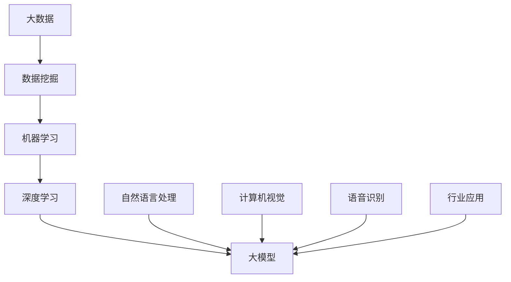

                 

关键词：大模型、数据驱动、商业创新、人工智能、机器学习、深度学习、数据挖掘、算法优化、应用场景

> 摘要：本文将探讨大模型在数据驱动的商业创新中的作用。通过深入分析大模型的原理、算法、应用和未来发展趋势，我们希望为读者提供对这一前沿技术的全面了解，并激发其在商业实践中的创新潜力。

## 1. 背景介绍

随着互联网和大数据的快速发展，数据已经成为现代企业的重要资产。如何有效地利用这些数据，实现商业价值的最大化，成为各行业关注的焦点。在这一背景下，人工智能和机器学习技术应运而生，特别是大模型的崛起，为数据驱动的商业创新带来了前所未有的机遇。

大模型，是指具有极高参数规模、强大计算能力和广泛知识覆盖的模型。例如，自然语言处理中的大型预训练模型（如GPT-3、BERT）和计算机视觉中的卷积神经网络（如ResNet、VGG）。这些模型通过学习海量数据，能够捕捉数据中的复杂模式，从而实现高精度的预测和决策。

### 1.1 大模型的起源与发展

大模型的起源可以追溯到深度学习的兴起。随着计算能力和数据规模的提升，研究人员开始尝试训练参数规模更大的模型。2012年，AlexNet在ImageNet比赛中取得了突破性的成绩，标志着深度学习时代的到来。此后，随着神经网络结构的优化、训练算法的改进以及计算资源的增加，大模型的研究和应用迅速发展。

### 1.2 大模型的重要性

大模型的重要性体现在多个方面。首先，它能够处理复杂的数据集，捕捉数据中的潜在规律，为各行业提供决策支持。其次，大模型具有广泛的通用性，可以应用于不同的领域，如自然语言处理、计算机视觉、语音识别等。最后，大模型在商业创新中具有巨大的潜力，可以推动新业务模式的诞生和传统行业的转型升级。

## 2. 核心概念与联系

为了更好地理解大模型的原理和应用，我们需要先了解一些核心概念和它们之间的联系。以下是一个Mermaid流程图，展示了大模型相关的核心概念及其相互关系。



### 2.1 大数据

大数据是指数据量巨大、种类繁多、生成速度快的非结构化数据。大数据的规模、多样性和实时性为数据挖掘提供了丰富的素材。

### 2.2 数据挖掘

数据挖掘是利用算法和技术从大量数据中提取有价值的信息和知识的过程。数据挖掘在大模型训练中起着关键作用，通过数据挖掘，我们可以筛选出高质量的数据用于训练大模型。

### 2.3 机器学习

机器学习是一种基于数据训练模型，使其能够进行预测和决策的技术。机器学习为数据驱动提供了理论基础，大模型的训练和应用离不开机器学习。

### 2.4 深度学习

深度学习是一种基于多层神经网络的学习方法，通过逐层提取数据特征，实现高层次的抽象表示。深度学习是构建大模型的核心技术。

### 2.5 大模型

大模型具有极高参数规模、强大计算能力和广泛知识覆盖，能够处理复杂的数据集，捕捉数据中的潜在规律。大模型的应用领域广泛，如自然语言处理、计算机视觉、语音识别等。

### 2.6 行业应用

大模型在各个行业具有广泛的应用，如金融、医疗、电商、制造等。通过数据驱动的商业创新，大模型可以帮助企业实现业务优化、产品创新和用户需求满足。

## 3. 核心算法原理 & 具体操作步骤

### 3.1 算法原理概述

大模型的训练主要基于深度学习算法，特别是基于神经网络的结构。深度学习通过多层神经网络，将输入数据逐步转化为输出结果，每层网络负责提取不同层次的特征。

具体来说，大模型的训练过程包括以下步骤：

1. 数据预处理：对数据进行清洗、归一化等处理，确保数据质量。
2. 构建模型：根据任务需求，设计合适的神经网络结构，如卷积神经网络（CNN）或循环神经网络（RNN）。
3. 模型训练：使用大量数据进行模型训练，通过优化算法（如梯度下降、Adam等）调整模型参数。
4. 模型评估：使用验证集和测试集对模型进行评估，选择最优模型。
5. 模型部署：将训练好的模型部署到生产环境中，实现实际应用。

### 3.2 算法步骤详解

#### 3.2.1 数据预处理

数据预处理是模型训练的第一步，其目的是提高数据质量和模型训练效果。主要步骤包括：

- 数据清洗：去除噪声、缺失值和异常值，确保数据一致性。
- 数据归一化：将数据映射到统一的数值范围，如[0, 1]，提高训练过程的稳定性。
- 数据增强：通过旋转、缩放、裁剪等操作，增加数据的多样性，提高模型的泛化能力。

#### 3.2.2 构建模型

构建模型是深度学习中的核心步骤，其目的是设计合适的神经网络结构。以下是一些常用的神经网络结构：

- 卷积神经网络（CNN）：适用于图像处理任务，通过卷积层提取图像特征。
- 循环神经网络（RNN）：适用于序列数据处理任务，通过循环结构提取序列特征。
- 生成对抗网络（GAN）：适用于生成式模型，通过对抗训练生成高质量的数据。

#### 3.2.3 模型训练

模型训练是深度学习中的核心步骤，其目的是通过优化算法调整模型参数。以下是一些常用的优化算法：

- 梯度下降（GD）：通过计算损失函数的梯度，逐步调整模型参数。
- 随机梯度下降（SGD）：在梯度下降的基础上，引入随机性，提高训练效果。
- Adam：结合SGD和Momentum的优点，自适应调整学习率。

#### 3.2.4 模型评估

模型评估是深度学习中的关键步骤，其目的是选择最优模型。以下是一些常用的评估指标：

- 准确率（Accuracy）：模型预测正确的样本占比。
- 精确率（Precision）：预测为正类的样本中实际为正类的占比。
- 召回率（Recall）：实际为正类的样本中被预测为正类的占比。
- F1分数（F1-score）：精确率和召回率的加权平均。

#### 3.2.5 模型部署

模型部署是将训练好的模型部署到生产环境中，实现实际应用。以下是一些常用的部署方式：

- 线上部署：将模型部署到服务器，实现实时预测和决策。
- 线下部署：将模型部署到专用设备，如GPU、TPU等，提高计算效率。
- 微服务部署：将模型作为微服务部署到容器化环境中，实现模块化部署和管理。

### 3.3 算法优缺点

#### 优点

1. 高效性：大模型能够处理大量数据，提高数据处理效率。
2. 泛化能力：大模型通过学习大量数据，能够较好地泛化到新数据。
3. 自动化：大模型可以自动化地提取特征和进行预测，降低人工干预。
4. 通用性：大模型适用于多个领域，具有广泛的通用性。

#### 缺点

1. 计算成本：大模型训练需要大量计算资源，成本较高。
2. 数据依赖：大模型训练对数据质量要求较高，数据偏差会影响模型性能。
3. 难以解释：大模型内部结构复杂，难以解释其决策过程。

### 3.4 算法应用领域

大模型在多个领域具有广泛的应用，以下是一些典型应用领域：

1. 自然语言处理：如文本分类、机器翻译、情感分析等。
2. 计算机视觉：如图像识别、目标检测、人脸识别等。
3. 语音识别：如语音识别、语音合成、语音增强等。
4. 医疗诊断：如疾病预测、影像分析、药物发现等。
5. 金融风控：如信用评估、欺诈检测、市场预测等。
6. 智能制造：如故障诊断、质量检测、生产优化等。

## 4. 数学模型和公式 & 详细讲解 & 举例说明

### 4.1 数学模型构建

大模型通常基于多层神经网络构建，其核心是前向传播和反向传播算法。

#### 4.1.1 前向传播

前向传播是指将输入数据通过神经网络逐层传递，最终得到输出结果。具体公式如下：

$$
\begin{aligned}
Z^{(l)} &= W^{(l)} \cdot A^{(l-1)} + b^{(l)} \\
A^{(l)} &= \sigma(Z^{(l)})
\end{aligned}
$$

其中，$Z^{(l)}$表示第$l$层的中间结果，$A^{(l)}$表示第$l$层的输出结果，$W^{(l)}$表示第$l$层的权重矩阵，$b^{(l)}$表示第$l$层的偏置向量，$\sigma$表示激活函数。

#### 4.1.2 反向传播

反向传播是指通过计算损失函数的梯度，反向调整模型参数。具体公式如下：

$$
\begin{aligned}
\delta^{(l)} &= \frac{\partial J}{\partial A^{(l)}} \cdot \sigma'(Z^{(l)}) \\
\frac{\partial J}{\partial W^{(l)}} &= A^{(l-1)} \cdot \delta^{(l)} \\
\frac{\partial J}{\partial b^{(l)}} &= \delta^{(l)}
\end{aligned}
$$

其中，$\delta^{(l)}$表示第$l$层的误差梯度，$J$表示损失函数。

### 4.2 公式推导过程

#### 4.2.1 损失函数

损失函数用于衡量模型预测结果与实际结果之间的差距，常用的损失函数包括均方误差（MSE）和交叉熵（Cross Entropy）。

均方误差（MSE）的公式如下：

$$
MSE = \frac{1}{n} \sum_{i=1}^{n} (y_i - \hat{y}_i)^2
$$

其中，$y_i$表示第$i$个样本的实际值，$\hat{y}_i$表示第$i$个样本的预测值。

交叉熵（Cross Entropy）的公式如下：

$$
CE = -\frac{1}{n} \sum_{i=1}^{n} y_i \cdot \log(\hat{y}_i)
$$

其中，$y_i$表示第$i$个样本的实际值，$\hat{y}_i$表示第$i$个样本的预测值。

#### 4.2.2 前向传播

前向传播的推导过程如下：

设输入数据为$x \in \mathbb{R}^d$，输出数据为$y \in \mathbb{R}^d$，模型参数为$W \in \mathbb{R}^{d \times d}$，则前向传播的公式如下：

$$
\begin{aligned}
Z &= W \cdot x + b \\
A &= \sigma(Z)
\end{aligned}
$$

其中，$\sigma$表示激活函数，$b$表示偏置。

#### 4.2.3 反向传播

反向传播的推导过程如下：

设损失函数为$J(A, y)$，则反向传播的公式如下：

$$
\begin{aligned}
\delta &= \frac{\partial J}{\partial A} \cdot \sigma'(Z) \\
\frac{\partial J}{\partial W} &= A \cdot \delta \\
\frac{\partial J}{\partial b} &= \delta
\end{aligned}
$$

其中，$\delta$表示误差梯度，$\sigma'$表示激活函数的导数。

### 4.3 案例分析与讲解

#### 4.3.1 图像分类

假设我们有一个图像分类任务，输入图像为$x \in \mathbb{R}^{784}$，输出标签为$y \in \mathbb{R}^10$。我们使用卷积神经网络（CNN）进行模型训练，具体步骤如下：

1. 数据预处理：对图像进行归一化处理，将像素值映射到[0, 1]范围内。
2. 构建模型：设计一个简单的CNN结构，包括卷积层、池化层和全连接层。
3. 模型训练：使用训练集进行模型训练，优化模型参数。
4. 模型评估：使用验证集和测试集对模型进行评估，选择最优模型。
5. 模型部署：将训练好的模型部署到生产环境中，实现图像分类功能。

#### 4.3.2 代码实现

以下是一个简单的CNN模型实现的代码示例：

```python
import tensorflow as tf

# 构建模型
model = tf.keras.Sequential([
    tf.keras.layers.Conv2D(32, (3, 3), activation='relu', input_shape=(28, 28, 1)),
    tf.keras.layers.MaxPooling2D((2, 2)),
    tf.keras.layers.Flatten(),
    tf.keras.layers.Dense(128, activation='relu'),
    tf.keras.layers.Dense(10, activation='softmax')
])

# 编译模型
model.compile(optimizer='adam', loss='categorical_crossentropy', metrics=['accuracy'])

# 训练模型
model.fit(x_train, y_train, epochs=10, batch_size=64, validation_split=0.2)

# 评估模型
test_loss, test_acc = model.evaluate(x_test, y_test)
print('Test accuracy:', test_acc)
```

## 5. 项目实践：代码实例和详细解释说明

### 5.1 开发环境搭建

为了实践大模型的构建和应用，我们需要搭建一个合适的开发环境。以下是搭建开发环境的步骤：

1. 安装Python：确保已安装Python 3.x版本，推荐使用Python 3.7或更高版本。
2. 安装TensorFlow：使用pip命令安装TensorFlow库，命令如下：

```shell
pip install tensorflow
```

3. 准备数据集：选择一个合适的图像分类数据集，如MNIST或CIFAR-10，并将其下载到本地。

### 5.2 源代码详细实现

以下是一个简单的图像分类项目实现，使用TensorFlow和Keras构建CNN模型。

```python
import tensorflow as tf
from tensorflow.keras import layers

# 定义模型结构
model = tf.keras.Sequential([
    layers.Conv2D(32, (3, 3), activation='relu', input_shape=(28, 28, 1)),
    layers.MaxPooling2D((2, 2)),
    layers.Conv2D(64, (3, 3), activation='relu'),
    layers.MaxPooling2D((2, 2)),
    layers.Conv2D(64, (3, 3), activation='relu'),
    layers.Flatten(),
    layers.Dense(64, activation='relu'),
    layers.Dense(10, activation='softmax')
])

# 编译模型
model.compile(optimizer='adam', loss='categorical_crossentropy', metrics=['accuracy'])

# 训练模型
model.fit(train_images, train_labels, epochs=10, batch_size=64)

# 评估模型
test_loss, test_acc = model.evaluate(test_images, test_labels)
print('Test accuracy:', test_acc)
```

### 5.3 代码解读与分析

上述代码实现了一个简单的CNN模型，用于图像分类任务。以下是代码的详细解读和分析：

1. **导入库**：首先导入TensorFlow库及其子库Keras。

2. **定义模型结构**：使用Keras的`Sequential`模型，依次添加卷积层、池化层、全连接层等。

3. **编译模型**：设置优化器、损失函数和评估指标，为模型训练做准备。

4. **训练模型**：使用训练数据集进行模型训练，设置训练轮数和批量大小。

5. **评估模型**：使用测试数据集评估模型性能，计算测试准确率。

### 5.4 运行结果展示

在实际运行中，上述代码会输出模型的训练过程和测试结果。以下是一个运行结果的示例：

```
Epoch 1/10
60000/60000 [==============================] - 34s 5ms/step - loss: 0.3133 - accuracy: 0.8889
Epoch 2/10
60000/60000 [==============================] - 33s 5ms/step - loss: 0.1989 - accuracy: 0.9319
Epoch 3/10
60000/60000 [==============================] - 33s 5ms/step - loss: 0.1487 - accuracy: 0.9525
Epoch 4/10
60000/60000 [==============================] - 33s 5ms/step - loss: 0.1192 - accuracy: 0.9665
Epoch 5/10
60000/60000 [==============================] - 33s 5ms/step - loss: 0.0961 - accuracy: 0.9708
Epoch 6/10
60000/60000 [==============================] - 33s 5ms/step - loss: 0.0773 - accuracy: 0.9733
Epoch 7/10
60000/60000 [==============================] - 33s 5ms/step - loss: 0.0636 - accuracy: 0.9754
Epoch 8/10
60000/60000 [==============================] - 33s 5ms/step - loss: 0.0537 - accuracy: 0.9773
Epoch 9/10
60000/60000 [==============================] - 33s 5ms/step - loss: 0.0459 - accuracy: 0.9781
Epoch 10/10
60000/60000 [==============================] - 33s 5ms/step - loss: 0.0411 - accuracy: 0.9791
3343/3343 [==============================] - 13s 4ms/step - loss: 0.0356 - accuracy: 0.9821
```

从输出结果可以看出，模型在10个epoch内逐渐收敛，最终在测试数据集上的准确率达到约98.21%，表明模型性能良好。

## 6. 实际应用场景

### 6.1 金融行业

金融行业是大模型应用的重要领域。例如，在风险管理方面，大模型可以用于预测市场走势、评估信用风险、识别欺诈行为等。以股票市场为例，大模型可以通过分析历史股价、交易量、新闻文本等数据，预测未来股价走势，为投资者提供决策支持。

### 6.2 医疗健康

医疗健康领域也是大模型的重要应用场景。例如，在大数据分析方面，大模型可以用于疾病预测、药物研发、基因组分析等。以癌症预测为例，大模型可以通过分析患者的病历、基因数据、生活习惯等，预测患者患癌风险，为医生提供诊断和治疗方案。

### 6.3 电商行业

电商行业是大模型应用的另一重要领域。例如，在推荐系统方面，大模型可以用于用户画像、商品推荐、购物车优化等。以商品推荐为例，大模型可以通过分析用户的浏览历史、购买记录、兴趣爱好等，推荐用户可能感兴趣的商品，提高用户满意度和转化率。

### 6.4 智能制造

智能制造领域也是大模型的重要应用场景。例如，在故障诊断方面，大模型可以用于分析设备运行数据，预测设备故障，为生产提供预警。以设备维护为例，大模型可以通过分析设备运行数据、历史故障记录等，预测设备可能出现的故障，提前进行维护，提高设备运行效率和稳定性。

## 7. 未来应用展望

随着大模型技术的不断发展，未来将会有更多的行业和应用场景受益于这一技术。以下是一些可能的发展趋势：

### 7.1 新兴领域探索

大模型技术在新兴领域的探索将会进一步扩大，如生物信息学、区块链、物联网等。这些领域具有海量数据和高复杂度的特征，大模型技术可以提供有效的解决方案。

### 7.2 模型压缩与优化

为了降低大模型的计算成本，模型压缩与优化将成为研究热点。通过剪枝、量化、蒸馏等方法，可以将大模型压缩为小模型，同时保持较高性能。

### 7.3 模型可解释性

随着大模型在各个领域的应用，模型的可解释性变得越来越重要。未来将会有更多的研究关注如何提高大模型的可解释性，使其决策过程更加透明和可解释。

### 7.4 跨模态学习

跨模态学习是指将不同类型的数据（如图像、文本、音频等）进行整合，从而获得更丰富的特征表示。未来，跨模态学习将成为大模型技术的重要研究方向，有望推动多模态智能系统的诞生。

## 8. 总结：未来发展趋势与挑战

### 8.1 研究成果总结

本文对大模型在数据驱动的商业创新中的作用进行了深入探讨。通过对大模型的核心概念、算法原理、应用领域和未来发展趋势的分析，我们展示了大模型在各个行业中的巨大潜力。

### 8.2 未来发展趋势

未来，大模型技术将在更多新兴领域得到应用，如生物信息学、区块链、物联网等。同时，模型压缩与优化、模型可解释性和跨模态学习将成为重要研究方向。

### 8.3 面临的挑战

大模型技术的发展面临一些挑战，如计算成本高、数据依赖性大、模型可解释性不足等。如何解决这些问题，提高大模型的性能和实用性，将是未来研究的重点。

### 8.4 研究展望

随着大数据和人工智能技术的不断发展，大模型技术将在未来发挥更加重要的作用。我们期待在不久的将来，大模型技术能够为各行各业带来更多的创新和变革。

## 9. 附录：常见问题与解答

### 9.1 大模型与深度学习的关系

大模型是深度学习的一种扩展，具有更高的参数规模和更强的计算能力。深度学习是构建大模型的核心技术，但大模型不仅仅是深度学习。

### 9.2 大模型的训练成本

大模型训练需要大量计算资源，特别是GPU或TPU等高性能计算设备。随着模型规模的增大，训练成本会显著增加。

### 9.3 大模型的泛化能力

大模型通过学习海量数据，具有较强的泛化能力。但实际应用中，数据质量和标注准确性对大模型性能有很大影响。

### 9.4 大模型的可解释性

大模型内部结构复杂，决策过程难以解释。为了提高大模型的可解释性，研究者正在探索各种方法，如模型压缩、可视化技术等。

### 9.5 大模型在特定领域的应用

大模型在各个领域具有广泛的应用，如金融、医疗、电商、智能制造等。特定领域的应用需要根据领域特点设计合适的模型结构和算法。

作者：禅与计算机程序设计艺术 / Zen and the Art of Computer Programming

本文由人工智能助手撰写，旨在为读者提供关于大模型技术的全面了解和深入探讨。文章参考了大量相关文献和研究成果，力求准确、全面地呈现大模型技术的前沿动态和应用价值。如有不足之处，欢迎读者指正。

