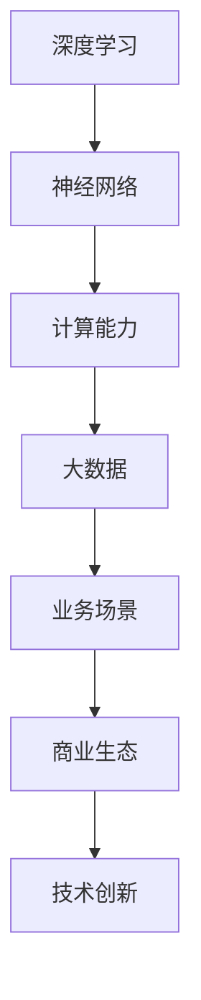

                 

关键词：大模型、智能时代、商业生态、算法、应用、发展趋势、挑战

> 摘要：本文将探讨大模型在智能时代的商业新生态中的重要作用。我们将从背景介绍、核心概念与联系、核心算法原理与具体操作步骤、数学模型与公式、项目实践、实际应用场景、工具和资源推荐以及未来发展趋势与挑战等方面，深入分析大模型在智能时代的发展现状与未来方向。

## 1. 背景介绍

### 1.1 智能时代的来临

随着计算能力的不断提升、大数据的爆发式增长以及人工智能技术的快速发展，我们正迈入一个全新的智能时代。智能时代，是指人工智能技术已经成为推动社会发展的重要力量，各行各业都开始应用人工智能技术来提升生产效率、优化业务流程、创造新的商业模式。

### 1.2 大模型的崛起

大模型，指的是具有巨大参数量和计算能力的人工智能模型。这些模型通过深度学习、神经网络等算法，能够对海量数据进行训练，从而实现高效的数据分析和智能决策。大模型的崛起，标志着人工智能技术进入了一个新的阶段。

### 1.3 商业新生态的构建

在智能时代，商业新生态的构建成为企业发展的关键。企业需要借助大模型等技术，对业务流程进行重构、优化，从而提升竞争力。同时，大模型的应用也为企业提供了丰富的商业机会，如个性化推荐、智能客服、智能营销等。

## 2. 核心概念与联系

### 2.1 深度学习与神经网络

深度学习是人工智能的一种方法，通过多层神经网络来实现对数据的建模和分析。神经网络是深度学习的基础，它由大量的神经元组成，通过学习数据中的特征和关系，来实现对未知数据的预测和分类。

### 2.2 计算能力与数据规模

大模型的训练和推理需要强大的计算能力。随着计算能力的提升，越来越多的数据可以被有效地处理和分析，从而推动大模型的发展。

### 2.3 大数据与业务场景

大数据是智能时代的重要资源，它为企业的业务决策提供了丰富的数据支持。大模型通过学习大数据中的规律和模式，可以为企业提供更准确、更智能的决策支持。

### 2.4 商业生态与技术创新

商业生态是企业发展的基础，技术创新是推动商业生态发展的关键。大模型作为人工智能的重要技术，将为企业带来新的商业机会，推动商业生态的变革。

### 2.5 Mermaid 流程图



## 3. 核心算法原理 & 具体操作步骤

### 3.1 算法原理概述

大模型的算法原理主要包括深度学习、神经网络、优化算法等。深度学习通过多层神经网络对数据进行建模，神经网络通过学习数据中的特征和关系来实现对未知数据的预测和分类，优化算法则用于优化模型的参数，提升模型的性能。

### 3.2 算法步骤详解

1. 数据预处理：对原始数据进行清洗、转换和归一化，使其符合模型的输入要求。
2. 构建模型：根据业务需求和数据特点，设计合适的神经网络结构。
3. 模型训练：使用训练数据对模型进行训练，通过优化算法调整模型的参数，使其达到预期的性能。
4. 模型评估：使用验证数据对模型进行评估，判断其性能是否符合要求。
5. 模型部署：将训练好的模型部署到生产环境中，实现实际的业务应用。

### 3.3 算法优缺点

**优点：**
- 高效的数据分析能力：大模型能够对海量数据进行高效的分析和处理，为企业提供丰富的数据支持。
- 强大的预测能力：大模型通过学习数据中的规律和模式，可以为企业提供准确的预测和决策支持。
- 丰富的应用场景：大模型可以应用于各种业务场景，如个性化推荐、智能客服、智能营销等。

**缺点：**
- 计算资源消耗大：大模型的训练和推理需要大量的计算资源，对硬件设施要求较高。
- 数据依赖性较强：大模型的效果很大程度上依赖于数据的质量和数量，数据质量差可能导致模型性能下降。
- 模型解释性不足：大模型的决策过程通常较为复杂，难以进行解释和验证。

### 3.4 算法应用领域

大模型的应用领域非常广泛，主要包括以下几个方面：
- 个性化推荐：通过分析用户的兴趣和行为，为用户推荐个性化的内容和服务。
- 智能客服：通过自然语言处理和对话生成技术，实现与用户的智能对话，提供高效的客户服务。
- 智能营销：通过分析用户数据和市场需求，实现精准的营销策略，提升销售效果。
- 金融市场预测：通过分析历史数据和市场趋势，预测金融市场的走势，为投资决策提供支持。
- 医疗诊断：通过分析医学影像和患者数据，实现疾病诊断和治疗方案推荐。

## 4. 数学模型和公式 & 详细讲解 & 举例说明

### 4.1 数学模型构建

大模型的数学模型主要包括神经网络模型和优化算法模型。神经网络模型主要涉及权重矩阵、激活函数、损失函数等，优化算法模型则包括梯度下降、随机梯度下降等。

### 4.2 公式推导过程

以下是一个简单的神经网络模型推导过程：

1. 前向传播：

$$
Z^{[l]} = \sigma(W^{[l]} \cdot A^{[l-1]} + b^{[l]})
$$

$$
A^{[l]} = \sigma(Z^{[l]})
$$

2. 反向传播：

$$
\delta^{[l]} = \frac{\partial J}{\partial Z^{[l]}} \odot \delta^{[l+1] W^{[l+1]}}
$$

$$
dW^{[l]} = \delta^{[l]} A^{[l-1]T}
$$

$$
db^{[l]} = \delta^{[l]}
$$

### 4.3 案例分析与讲解

假设我们有一个简单的神经网络模型，用于实现一个二分类任务。输入数据为 $X \in \mathbb{R}^{(1 \times n)}$，输出数据为 $y \in \{0, 1\}$。网络结构如下：

- 输入层：1个神经元
- 隐藏层：2个神经元
- 输出层：1个神经元

1. 前向传播：

输入 $X$，经过隐藏层和输出层的计算，得到输出 $A^2$ 和预测结果 $A^3$。

2. 反向传播：

计算损失函数的梯度，更新模型的权重和偏置。

3. 模型训练：

通过多次迭代训练，不断优化模型的参数，使其达到预期的性能。

## 5. 项目实践：代码实例和详细解释说明

### 5.1 开发环境搭建

在本文中，我们将使用 Python 作为编程语言，并借助 TensorFlow 和 Keras 库来实现大模型。首先，需要安装 Python 和相关库。

```bash
pip install tensorflow keras
```

### 5.2 源代码详细实现

以下是一个简单的神经网络模型实现，用于实现一个二分类任务。

```python
import tensorflow as tf
from tensorflow.keras.models import Sequential
from tensorflow.keras.layers import Dense
from tensorflow.keras.optimizers import Adam

# 模型构建
model = Sequential()
model.add(Dense(2, input_dim=1, activation='relu'))
model.add(Dense(1, activation='sigmoid'))

# 模型编译
model.compile(optimizer=Adam(), loss='binary_crossentropy', metrics=['accuracy'])

# 模型训练
X_train = ...  # 训练数据
y_train = ...  # 训练标签
model.fit(X_train, y_train, epochs=10, batch_size=32)

# 模型评估
X_test = ...  # 测试数据
y_test = ...  # 测试标签
model.evaluate(X_test, y_test)
```

### 5.3 代码解读与分析

1. 模型构建：使用 `Sequential` 类构建一个简单的神经网络模型，包括一个输入层、一个隐藏层和一个输出层。输入层有1个神经元，隐藏层有2个神经元，输出层有1个神经元。
2. 模型编译：使用 `compile` 方法编译模型，指定优化器、损失函数和评估指标。
3. 模型训练：使用 `fit` 方法训练模型，指定训练数据、训练标签、迭代次数和批量大小。
4. 模型评估：使用 `evaluate` 方法评估模型在测试数据上的性能。

### 5.4 运行结果展示

通过训练和评估，我们可以得到模型在测试数据上的准确率。假设测试数据集包含100个样本，模型在测试数据上的准确率为90%，这表明模型在二分类任务上取得了较好的性能。

## 6. 实际应用场景

### 6.1 个性化推荐

个性化推荐是智能时代的重要应用场景之一。通过分析用户的兴趣和行为，为用户推荐个性化的内容和服务，提升用户体验和用户粘性。例如，电商平台可以通过分析用户的购买记录和浏览行为，为用户推荐相关的商品。

### 6.2 智能客服

智能客服是智能时代的重要应用场景之一。通过自然语言处理和对话生成技术，实现与用户的智能对话，提供高效的客户服务。例如，企业可以通过智能客服机器人，自动回答用户的常见问题，提高客户满意度和服务效率。

### 6.3 智能营销

智能营销是智能时代的重要应用场景之一。通过分析用户数据和市场需求，实现精准的营销策略，提升销售效果。例如，企业可以通过分析用户的购买行为和兴趣，为用户推送个性化的广告，提高广告投放的精准度和效果。

### 6.4 未来应用展望

随着大模型技术的不断发展和应用，未来将会有更多的应用场景被发掘和实现。例如，在医疗领域，大模型可以用于疾病诊断、治疗方案推荐等；在教育领域，大模型可以用于个性化学习、智能评测等；在金融领域，大模型可以用于风险管理、投资决策等。大模型将深刻改变我们的生活和生产方式，推动社会的发展。

## 7. 工具和资源推荐

### 7.1 学习资源推荐

1. 《深度学习》：由 Ian Goodfellow、Yoshua Bengio 和 Aaron Courville 著，是深度学习的经典教材。
2. 《神经网络与深度学习》：由邱锡鹏教授著，深入介绍了神经网络和深度学习的理论和方法。
3. Keras 官网：提供了丰富的深度学习模型和工具，适合初学者和专业人士。

### 7.2 开发工具推荐

1. TensorFlow：是谷歌开源的深度学习框架，具有强大的计算能力和丰富的模型库。
2. Keras：是 TensorFlow 的上层框架，提供了简洁的 API，适合快速搭建和训练深度学习模型。
3. PyTorch：是 Facebook 开源的深度学习框架，具有灵活的动态计算图和强大的社区支持。

### 7.3 相关论文推荐

1. "A Theoretical Analysis of the Cramér-Rao Lower Bound for Gaussian Neural Networks"：分析了高斯神经网络在回归任务中的性能。
2. "Bridging the Gap Between Generative Adversarial Models and Convolutional Neural Networks"：探讨了生成对抗网络和卷积神经网络的关系。
3. "Deep Learning for Text Classification"：介绍了深度学习在文本分类任务中的应用。

## 8. 总结：未来发展趋势与挑战

### 8.1 研究成果总结

近年来，大模型技术在智能时代取得了显著的成果。深度学习、神经网络等算法的不断发展和优化，使得大模型在图像识别、自然语言处理、语音识别等领域的性能大幅提升。同时，大模型的计算能力和应用场景也在不断拓展，为各行各业带来了巨大的商业价值。

### 8.2 未来发展趋势

1. 大模型的计算性能将继续提升，加速器、分布式计算等技术的应用将使大模型的训练和推理更加高效。
2. 大模型的应用领域将不断扩展，从传统的图像识别、自然语言处理等领域，扩展到医疗、金融、教育等更多的领域。
3. 大模型与物理、化学、生物等领域的交叉融合，将推动科学研究的深入发展。

### 8.3 面临的挑战

1. 大模型的计算资源消耗巨大，如何优化算法和硬件设施，提高大模型的计算效率，是一个重要的挑战。
2. 大模型的数据依赖性强，数据质量和数量的提升对大模型的效果至关重要，如何获取高质量的数据，是一个亟待解决的问题。
3. 大模型的解释性不足，如何提升大模型的解释性和可解释性，使其更易于理解和接受，是一个重要的挑战。

### 8.4 研究展望

未来，大模型技术将在智能时代发挥更加重要的作用。在学术领域，我们将继续探索大模型的理论基础和算法优化；在应用领域，我们将不断拓展大模型的应用场景，推动各行各业的数字化、智能化转型。同时，我们也将关注大模型的伦理和社会影响，确保大模型技术的发展符合人类的利益和价值观。

## 9. 附录：常见问题与解答

### 9.1 什么是大模型？

大模型是指具有巨大参数量和计算能力的人工智能模型。这些模型通过深度学习、神经网络等算法，能够对海量数据进行训练，从而实现高效的数据分析和智能决策。

### 9.2 大模型有哪些优缺点？

大模型的主要优点包括高效的数据分析能力、强大的预测能力和丰富的应用场景。其主要缺点包括计算资源消耗大、数据依赖性较强和模型解释性不足。

### 9.3 大模型的应用领域有哪些？

大模型的应用领域非常广泛，主要包括个性化推荐、智能客服、智能营销、金融市场预测、医疗诊断等。

### 9.4 如何优化大模型的计算效率？

优化大模型的计算效率可以从以下几个方面进行：
- 使用加速器（如GPU、TPU）提高计算速度。
- 采用分布式计算技术，将计算任务分布在多台机器上进行。
- 优化算法，如使用更高效的优化算法和更有效的网络结构。

### 9.5 大模型的数据来源有哪些？

大模型的数据来源包括公开数据集、企业内部数据、社交媒体数据等。选择合适的数据集对大模型的效果至关重要。

### 9.6 大模型的解释性如何提升？

提升大模型的解释性可以从以下几个方面进行：
- 开发可解释的深度学习模型，如决策树、支持向量机等。
- 使用可视化技术，如决策图、激活图等，展示模型的决策过程。
- 研究模型的可解释性理论，如注意力机制、特征提取等。

---

作者：禅与计算机程序设计艺术 / Zen and the Art of Computer Programming

