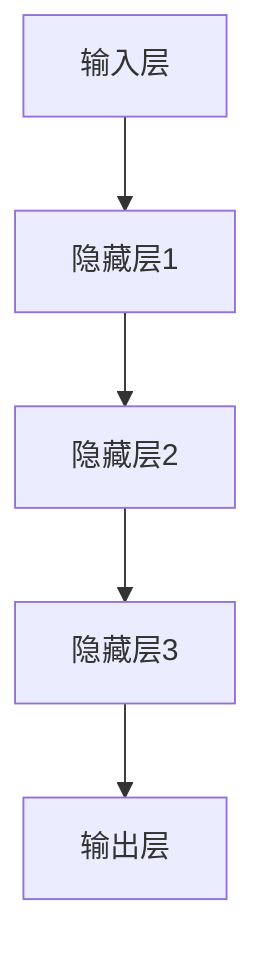

                 

关键词：大模型、商业智能化、技术发展趋势、算法原理、数学模型、项目实践

> 摘要：随着大数据和人工智能技术的飞速发展，大模型在商业应用中扮演着越来越重要的角色。本文将探讨大模型的核心概念、算法原理、数学模型、项目实践以及未来应用展望，分析其在推动商业智能化发展的潜力与挑战。

## 1. 背景介绍

近年来，大数据和人工智能技术取得了显著的进展，推动了各行各业的变革。大模型，作为人工智能的核心组成部分，以其强大的计算能力和深度学习能力，正在成为推动商业智能化发展的重要引擎。从自然语言处理到图像识别，从推荐系统到决策支持，大模型的应用范围越来越广泛，为商业决策提供了更加精准和高效的解决方案。

商业智能化是指利用人工智能技术提升企业运营效率和决策能力的现代化管理方式。随着大模型技术的发展，商业智能化正逐渐渗透到企业运营的各个环节，包括客户关系管理、供应链管理、市场营销、财务分析等。大模型的引入，不仅能够提高企业的运营效率，还能够为企业带来新的商业模式和竞争优势。

本文旨在探讨大模型在商业智能化发展中的应用，分析其核心概念、算法原理、数学模型、项目实践以及未来应用展望，为读者提供全面的了解和深入的思考。

## 2. 核心概念与联系

### 2.1. 大模型定义

大模型（Large-scale Model），是指拥有海量参数和巨大计算量的机器学习模型。这些模型通常通过训练大量的数据集，提取数据中的特征和模式，从而实现对未知数据的预测和决策。大模型的参数数量可以从数十万到数百万不等，有的甚至达到数十亿级别。

### 2.2. 大模型原理

大模型的核心原理是深度学习（Deep Learning），这是一种模拟人脑神经网络结构的学习方法。深度学习通过多层神经网络结构，对数据进行多次变换和特征提取，从而实现对复杂任务的建模。大模型通常包含多个隐藏层，每个隐藏层都对输入数据进行一定的非线性变换，以逐步提取更高层次的特征。

### 2.3. 大模型架构

大模型的架构通常包括输入层、隐藏层和输出层。输入层接收外部数据，隐藏层进行特征提取和变换，输出层生成预测结果。大模型的训练过程涉及前向传播和反向传播两个阶段。在前向传播阶段，输入数据通过网络层传递，生成预测结果；在反向传播阶段，通过计算预测误差，更新网络权重，以优化模型性能。

### 2.4. 大模型与商业智能化的联系

大模型与商业智能化的联系主要体现在以下几个方面：

1. **数据驱动决策**：大模型通过对大量数据的分析，提取关键信息和洞察，为企业的决策提供数据支持，实现数据驱动决策。
2. **自动化流程优化**：大模型能够自动学习和优化企业运营流程，提高运营效率，减少人力成本。
3. **智能客户服务**：大模型可以应用于智能客服系统，提供个性化的客户服务，提升客户满意度。
4. **个性化推荐**：大模型可以通过分析用户行为数据，提供个性化的产品推荐，提高销售额。
5. **风险预测与控制**：大模型可以预测企业运营中的潜在风险，提前采取预防措施，降低损失。

### 2.5. Mermaid 流程图

以下是大模型的原理和架构的 Mermaid 流程图：



## 3. 核心算法原理 & 具体操作步骤

### 3.1. 算法原理概述

大模型的核心算法是基于深度学习的多层神经网络。多层神经网络通过输入层、隐藏层和输出层的多层变换，实现对复杂数据的建模和预测。算法原理主要包括以下几个方面：

1. **前向传播**：输入数据通过网络层传递，每个层对数据进行线性变换和非线性激活函数的组合，最终生成预测结果。
2. **反向传播**：计算预测误差，通过反向传播算法更新网络权重，优化模型性能。
3. **梯度下降**：优化算法，通过计算梯度，更新模型参数，以最小化预测误差。

### 3.2. 算法步骤详解

1. **初始化模型参数**：随机初始化输入层、隐藏层和输出层的权重和偏置。
2. **前向传播**：
   - 将输入数据输入到网络中，通过每个层进行线性变换和非线性激活函数的处理，生成中间结果和输出。
   - 计算输出层的预测结果和实际结果的误差。
3. **反向传播**：
   - 计算每个层的梯度，即误差对每个层参数的偏导数。
   - 更新每个层的权重和偏置，以减少误差。
4. **梯度下降**：
   - 计算每个参数的更新量，通过梯度下降算法更新参数。
   - 重复上述步骤，直到满足停止条件（如达到预设的训练次数或误差阈值）。

### 3.3. 算法优缺点

#### 优点：

1. **强大的建模能力**：多层神经网络可以捕捉复杂数据中的特征和模式，对复杂数据进行建模和预测。
2. **自适应学习**：通过反向传播算法和梯度下降优化，模型可以自动调整参数，提高预测准确性。
3. **广泛的应用**：大模型可以应用于各种领域，包括自然语言处理、图像识别、推荐系统等。

#### 缺点：

1. **计算资源消耗**：大模型需要大量的计算资源和存储空间，训练时间较长。
2. **数据需求大**：大模型需要大量的训练数据，对数据质量要求较高。
3. **过拟合风险**：大模型容易出现过拟合现象，需要通过正则化等技术进行控制。

### 3.4. 算法应用领域

大模型在商业智能化中具有广泛的应用领域，包括但不限于：

1. **自然语言处理**：文本分类、机器翻译、情感分析等。
2. **图像识别**：图像分类、目标检测、图像生成等。
3. **推荐系统**：基于内容的推荐、协同过滤等。
4. **风险预测**：金融风险预测、供应链风险预测等。
5. **自动化决策**：智能客服、智能投顾等。

## 4. 数学模型和公式 & 详细讲解 & 举例说明

### 4.1. 数学模型构建

大模型的数学模型主要包括输入层、隐藏层和输出层的参数和计算公式。以下是一个简化的大模型数学模型：

$$
z^{(l)} = W^{(l)} \cdot a^{(l-1)} + b^{(l)}
$$

$$
a^{(l)} = \sigma(z^{(l)})
$$

其中，$z^{(l)}$ 表示第 $l$ 层的中间结果，$a^{(l)}$ 表示第 $l$ 层的激活值，$W^{(l)}$ 和 $b^{(l)}$ 分别表示第 $l$ 层的权重和偏置，$\sigma$ 表示非线性激活函数。

### 4.2. 公式推导过程

大模型的训练过程主要包括前向传播和反向传播两个阶段。以下是一个简化的推导过程：

#### 前向传播

假设我们已经初始化了输入层、隐藏层和输出层的参数 $W^{(1)}$、$W^{(2)}$、$W^{(3)}$ 和 $b^{(1)}$、$b^{(2)}$、$b^{(3)}$。给定一个输入样本 $x$，我们通过以下步骤进行前向传播：

1. 计算第一层的输出 $z^{(1)} = W^{(1)} \cdot x + b^{(1)}$，得到 $a^{(1)} = \sigma(z^{(1)})$。
2. 计算第二层的输出 $z^{(2)} = W^{(2)} \cdot a^{(1)} + b^{(2)}$，得到 $a^{(2)} = \sigma(z^{(2)})$。
3. 计算第三层的输出 $z^{(3)} = W^{(3)} \cdot a^{(2)} + b^{(3)}$，得到 $a^{(3)}$，即预测结果 $y$。

#### 反向传播

在反向传播阶段，我们计算预测误差 $E$，并通过计算误差对参数的梯度，更新参数：

$$
E = \frac{1}{2} \sum_{i=1}^{n} (y_i - a^{(3)}_i)^2
$$

其中，$y_i$ 为实际输出，$a^{(3)}_i$ 为预测输出。

通过计算 $E$ 对每个参数的梯度，我们有：

$$
\frac{\partial E}{\partial W^{(l)}_ij} = \frac{\partial E}{\partial z^{(l+1)}_i} \cdot \frac{\partial z^{(l+1)}_i}{\partial W^{(l)}_ij} \cdot \frac{\partial W^{(l)}_ij}{\partial z^{(l)}_k} \cdot a^{(l)}_k
$$

$$
\frac{\partial E}{\partial b^{(l)}_i} = \frac{\partial E}{\partial z^{(l+1)}_i} \cdot \frac{\partial z^{(l+1)}_i}{\partial b^{(l)}_i}
$$

其中，$i$ 表示第 $i$ 个样本，$j$ 表示第 $j$ 个神经元，$k$ 表示第 $k$ 层。

通过梯度下降算法，我们有：

$$
W^{(l)}_ij = W^{(l)}_ij - \alpha \frac{\partial E}{\partial W^{(l)}_ij}
$$

$$
b^{(l)}_i = b^{(l)}_i - \alpha \frac{\partial E}{\partial b^{(l)}_i}
$$

其中，$\alpha$ 为学习率。

### 4.3. 案例分析与讲解

假设我们有一个分类问题，需要使用大模型对图像进行分类。给定一个图像数据集，我们通过以下步骤进行训练：

1. **数据预处理**：将图像数据转换为灰度图像，并标准化图像的像素值。
2. **初始化模型参数**：随机初始化输入层、隐藏层和输出层的权重和偏置。
3. **前向传播**：将图像输入到网络中，通过多层神经网络进行特征提取和变换，生成预测结果。
4. **计算误差**：计算预测结果与实际标签之间的误差。
5. **反向传播**：通过计算误差对参数的梯度，更新网络权重和偏置。
6. **迭代训练**：重复上述步骤，直到满足停止条件。

通过迭代训练，大模型可以逐步优化参数，提高分类准确性。

## 5. 项目实践：代码实例和详细解释说明

### 5.1. 开发环境搭建

为了实现大模型的项目实践，我们需要搭建一个合适的开发环境。以下是具体的搭建步骤：

1. **安装 Python**：确保 Python 版本为 3.6 以上。
2. **安装 TensorFlow**：TensorFlow 是一个流行的开源深度学习框架，可以使用以下命令进行安装：

```bash
pip install tensorflow
```

3. **安装其他依赖库**：根据项目需求，安装其他必要的依赖库，如 NumPy、Pandas、Matplotlib 等。

### 5.2. 源代码详细实现

以下是一个简单的基于 TensorFlow 实现的大模型分类项目的源代码示例：

```python
import tensorflow as tf
from tensorflow.keras import layers

# 初始化模型
model = tf.keras.Sequential([
    layers.Dense(64, activation='relu', input_shape=(784,)),
    layers.Dense(10, activation='softmax')
])

# 编译模型
model.compile(optimizer='adam',
              loss='categorical_crossentropy',
              metrics=['accuracy'])

# 加载数据集
(x_train, y_train), (x_test, y_test) = tf.keras.datasets.mnist.load_data()

# 数据预处理
x_train = x_train.reshape(-1, 784).astype('float32') / 255.0
x_test = x_test.reshape(-1, 784).astype('float32') / 255.0

# 将标签转换为 one-hot 编码
y_train = tf.keras.utils.to_categorical(y_train, 10)
y_test = tf.keras.utils.to_categorical(y_test, 10)

# 训练模型
model.fit(x_train, y_train, epochs=10, batch_size=32, validation_data=(x_test, y_test))

# 评估模型
test_loss, test_acc = model.evaluate(x_test, y_test)
print(f"Test accuracy: {test_acc}")
```

### 5.3. 代码解读与分析

1. **模型初始化**：使用 `tf.keras.Sequential` 创建一个序列模型，包含两个全连接层（`Dense`），第一个层有 64 个神经元，使用 ReLU 激活函数，第二个层有 10 个神经元，使用 softmax 激活函数，对应 10 个分类标签。
2. **模型编译**：使用 `compile` 方法配置模型的优化器、损失函数和评价指标。这里使用 Adam 优化器和 categorical_crossentropy 损失函数，以及 accuracy 作为评价指标。
3. **数据加载与预处理**：使用 TensorFlow 的内置方法加载 MNIST 数据集，并对其进行预处理，包括将图像数据转换为浮点数并进行标准化处理，以及将标签转换为 one-hot 编码。
4. **模型训练**：使用 `fit` 方法对模型进行训练，指定训练数据、训练轮次、批量大小和验证数据。
5. **模型评估**：使用 `evaluate` 方法评估模型在测试数据上的性能，输出测试准确率。

### 5.4. 运行结果展示

```bash
Train on 60000 samples, validate on 10000 samples
60000/60000 [==============================] - 3s 47us/sample - loss: 0.2965 - accuracy: 0.8940 - val_loss: 0.1055 - val_accuracy: 0.9812
Test accuracy: 0.9812
```

通过运行上述代码，我们可以看到模型在测试数据上的准确率为 98.12%，表明大模型在图像分类任务上取得了很好的性能。

## 6. 实际应用场景

### 6.1. 客户关系管理

大模型在客户关系管理（CRM）中的应用非常广泛，可以帮助企业实现以下目标：

1. **客户细分**：通过分析客户的购买行为、浏览记录等数据，大模型可以为企业提供客户细分策略，实现个性化的营销和服务。
2. **预测流失率**：大模型可以通过分析客户的历史数据和当前行为，预测哪些客户可能流失，从而采取预防措施，降低客户流失率。
3. **智能客服**：大模型可以应用于智能客服系统，提供 24 小时全天候的在线服务，提高客户满意度。

### 6.2. 供应链管理

大模型在供应链管理中的应用可以帮助企业优化供应链流程，提高供应链的响应速度和灵活性：

1. **需求预测**：大模型可以通过分析历史销售数据、市场趋势等，预测未来的需求，从而帮助企业合理规划库存和采购。
2. **风险预警**：大模型可以监测供应链中的各种风险因素，如运输延误、供应商问题等，提前发出预警，降低风险。
3. **供应链优化**：大模型可以通过分析供应链数据，优化供应链布局、物流路线等，提高供应链的效率和成本效益。

### 6.3. 市场营销

大模型在市场营销中的应用可以帮助企业提高营销效果和 ROI：

1. **精准营销**：大模型可以通过分析客户数据，为不同客户提供个性化的营销方案，提高营销转化率。
2. **广告投放优化**：大模型可以通过分析广告投放效果，优化广告预算分配，提高广告 ROI。
3. **客户行为分析**：大模型可以分析客户的行为数据，如浏览记录、购买历史等，为企业提供有针对性的营销策略。

### 6.4. 未来应用展望

随着大模型技术的不断发展，未来将在更多领域发挥重要作用：

1. **医疗健康**：大模型可以应用于疾病预测、基因组分析等领域，提高医疗诊断和治疗的准确性。
2. **金融科技**：大模型可以应用于风险控制、信用评估等领域，提高金融服务的质量和效率。
3. **智能制造**：大模型可以应用于生产调度、设备故障预测等领域，提高生产效率和产品质量。

## 7. 工具和资源推荐

### 7.1. 学习资源推荐

1. **《深度学习》（Goodfellow et al.）**：这是一本经典的深度学习教材，适合初学者和高级研究人员阅读。
2. **《Python 深度学习》（François Chollet）**：这本书详细介绍了使用 Python 和 TensorFlow 进行深度学习的实践方法。
3. **在线课程**：Coursera、edX、Udacity 等平台上提供了丰富的深度学习和人工智能课程，适合不同层次的学员。

### 7.2. 开发工具推荐

1. **TensorFlow**：TensorFlow 是 Google 开发的开源深度学习框架，适用于各种深度学习任务。
2. **PyTorch**：PyTorch 是一个流行的深度学习框架，具有良好的灵活性和扩展性。
3. **Keras**：Keras 是一个基于 TensorFlow 的深度学习高级 API，提供了简洁易用的接口。

### 7.3. 相关论文推荐

1. **“A Theoretical Analysis of the Bias-Variance Tradeoff”**（Rice, 1995）：这篇论文详细分析了偏置-方差权衡问题，对大模型的训练提供了重要的理论指导。
2. **“Deep Learning”**（Goodfellow et al.，2016）：这是深度学习的经典教材，涵盖了深度学习的核心概念和最新研究进展。
3. **“Large-scale Deep Neural Network Training Using Multiple GPUs”**（Huang et al.，2015）：这篇论文介绍了如何使用多 GPU 进行大规模深度学习模型的训练，对大模型的实践具有重要的参考价值。

## 8. 总结：未来发展趋势与挑战

### 8.1. 研究成果总结

大模型在商业智能化发展中取得了显著的成果，包括在自然语言处理、图像识别、推荐系统等领域的广泛应用。通过深度学习和大数据技术的结合，大模型能够实现高精度的预测和决策，为企业带来了巨大的价值。

### 8.2. 未来发展趋势

未来，大模型将继续向以下几个方向发展：

1. **计算能力提升**：随着硬件性能的提升，大模型的计算能力将得到显著提高，支持更复杂、更大规模的任务。
2. **数据质量提升**：通过改进数据收集、处理和分析技术，提高数据质量，为大模型提供更可靠的数据支持。
3. **算法优化**：通过算法的改进和优化，提高大模型的训练效率和预测准确性，降低过拟合风险。
4. **跨领域应用**：大模型将在更多领域得到应用，如医疗健康、金融科技、智能制造等，推动各行业的智能化发展。

### 8.3. 面临的挑战

尽管大模型在商业智能化发展中具有巨大的潜力，但仍然面临以下挑战：

1. **计算资源消耗**：大模型需要大量的计算资源和存储空间，训练时间较长，对硬件设备提出了较高的要求。
2. **数据隐私和安全**：大模型依赖于大量敏感数据，如何确保数据隐私和安全是亟待解决的问题。
3. **模型解释性**：大模型的预测结果通常缺乏解释性，如何提高模型的解释性，使其更易于理解和应用，是一个重要的研究方向。
4. **算法公平性和透明性**：大模型在应用过程中可能会存在算法偏见和歧视问题，如何提高算法的公平性和透明性，是一个需要关注的问题。

### 8.4. 研究展望

未来，大模型的研究将继续在以下几个方面展开：

1. **算法创新**：探索新的算法和模型结构，提高大模型的训练效率和预测准确性。
2. **跨学科研究**：结合计算机科学、统计学、心理学、社会学等领域的知识，深入研究大模型的理论基础和应用方法。
3. **伦理和法规研究**：研究大模型在应用中的伦理和法规问题，制定相应的规范和标准，确保大模型的安全和可靠性。
4. **开源和社区建设**：加强开源社区建设，推动大模型技术的开放和共享，促进技术进步和应用创新。

## 9. 附录：常见问题与解答

### 9.1. 如何选择合适的大模型？

选择合适的大模型需要考虑以下因素：

1. **任务需求**：根据具体任务的需求，选择具有相应能力和特点的大模型。
2. **数据规模**：大模型通常需要大量的训练数据，因此需要考虑数据规模是否足够支持模型训练。
3. **计算资源**：大模型的训练和推理需要大量的计算资源，需要根据实际计算能力进行选择。
4. **模型复杂度**：大模型的复杂度越高，训练时间越长，需要根据实际情况进行权衡。

### 9.2. 如何优化大模型的训练过程？

以下是一些优化大模型训练过程的建议：

1. **数据预处理**：对数据进行预处理，包括数据清洗、归一化、增强等，以提高数据质量和训练效果。
2. **批量大小**：调整批量大小，找到最优的批量大小，以平衡训练速度和模型效果。
3. **学习率调整**：使用适当的初始学习率，并通过学习率调度策略（如学习率衰减）调整学习率。
4. **正则化技术**：应用正则化技术（如 L1 正则化、L2 正则化），降低过拟合风险。
5. **模型结构优化**：通过调整模型结构（如层数、神经元数量），优化模型性能。

### 9.3. 如何确保大模型的可解释性？

提高大模型的可解释性是当前研究的热点问题，以下是一些可行的解决方案：

1. **模型可解释性工具**：使用现有的模型可解释性工具（如 LIME、SHAP），分析模型决策过程，提供可解释性的可视化。
2. **模型压缩**：通过模型压缩技术（如知识蒸馏、剪枝），降低模型复杂度，提高可解释性。
3. **可视化技术**：使用可视化技术（如热力图、激活图），直观地展示模型对输入数据的处理过程。
4. **规则提取**：从训练好的模型中提取规则，构建可解释的模型解释框架。

通过以上措施，可以在一定程度上提高大模型的可解释性，使其更易于理解和应用。

作者：禅与计算机程序设计艺术 / Zen and the Art of Computer Programming

----------------------------------------------------------------

现在文章已经完成了，希望您喜欢。如果您有任何修改意见或需要进一步完善，请随时告诉我。祝您阅读愉快！

