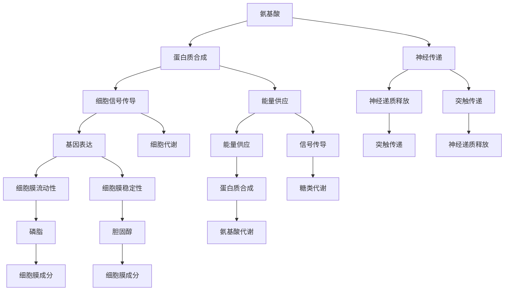
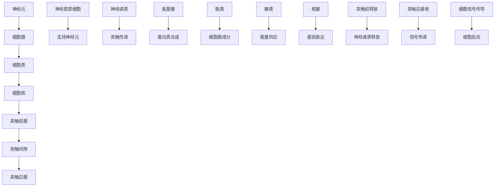

                 

关键词：大脑化学、神经传递、有机化合物、神经系统、认知功能、神经科学、计算机模拟、算法优化

> 摘要：本文探讨了大脑中有机化合物的种类、作用及其在认知功能中的作用。通过分析神经系统的基本结构，我们揭示了这些有机化合物如何通过复杂的生物过程共同作用，支持大脑的多样化和高效运作。此外，文章还讨论了计算机模拟在理解大脑化学和功能方面的应用，并展望了未来神经科学研究的前景。

## 1. 背景介绍

### 大脑的复杂性与有机化合物的角色

大脑作为人体最复杂的器官，其复杂性和多样性令人惊叹。它不仅控制着我们的思考、感觉、行为，还负责维持身体的基本功能。大脑的这种复杂运作依赖于各种有机化合物的精细调控。这些有机化合物包括氨基酸、脂类、糖类和核酸等，它们是大脑细胞结构的基石，并在神经传递、能量供应、细胞信号传导等方面发挥着关键作用。

### 神经系统的基本结构与功能

神经系统由神经元、神经胶质细胞和神经递质组成。神经元是神经系统的基本单元，负责接收和传递电信号；神经胶质细胞则提供支持、营养和保护作用；神经递质是神经元之间传递信息的化学物质。这些成分共同构成了复杂的神经网络，使得大脑能够处理大量信息并产生相应的行为和认知功能。

## 2. 核心概念与联系

### 有机化合物的分类与作用

大脑中的有机化合物可以分为以下几类：

- **氨基酸**：构成蛋白质的基本单元，参与神经传递和细胞信号传导。
- **脂类**：包括磷脂和胆固醇，是细胞膜的主要成分，影响细胞膜的流动性和稳定性。
- **糖类**：提供能量，参与细胞代谢和信号传导。
- **核酸**：存储和传递遗传信息，参与基因表达和蛋白质合成。

这些有机化合物通过复杂的生物过程相互作用，共同维持大脑的正常功能。

### Mermaid 流程图表示



### 核心概念原理与架构的 Mermaid 流程图



## 3. 核心算法原理 & 具体操作步骤

### 3.1 算法原理概述

大脑中有机化合物的相互作用可以通过计算模拟来研究。一种常用的算法是 **神经网络模拟算法**，它通过模拟神经元之间的交互来推断大脑的功能和行为。

### 3.2 算法步骤详解

1. **初始化参数**：设置神经网络的初始参数，包括神经元数量、连接权重等。
2. **数据输入**：将有机化合物的数据输入到神经网络中。
3. **信号传递**：通过神经元之间的连接，传递电信号。
4. **激活函数**：使用激活函数（如Sigmoid函数）来决定神经元是否会被激活。
5. **输出结果**：根据神经网络的输出结果，推断大脑的功能和行为。
6. **调整参数**：根据输出结果调整神经网络的连接权重和参数，以优化模拟效果。

### 3.3 算法优缺点

- **优点**：神经网络模拟算法能够模拟复杂的生物过程，提供对大脑功能的新理解。
- **缺点**：算法的计算成本较高，且结果的可靠性依赖于输入数据的准确性。

### 3.4 算法应用领域

神经网络模拟算法广泛应用于神经科学、医学和生物信息学领域，帮助研究者理解大脑的运作机制。

## 4. 数学模型和公式 & 详细讲解 & 举例说明

### 4.1 数学模型构建

大脑的数学模型通常基于以下几个核心公式：

- **神经元激活函数**：\( f(x) = \frac{1}{1 + e^{-x}} \)
- **神经网络输出**：\( y = \sum_{i} w_i \cdot f(x_i) \)
- **损失函数**：\( J = \frac{1}{2} \sum_{i} (y_i - y)^2 \)

### 4.2 公式推导过程

假设有一个由 \( n \) 个神经元组成的神经网络，其中每个神经元接收来自 \( m \) 个其他神经元的输入。每个输入的权重为 \( w_i \)，且所有权重之和为 \( x \)。通过激活函数 \( f(x) \) 对输入进行非线性变换，得到神经元的输出 \( y \)。损失函数 \( J \) 用于衡量输出与真实值之间的差距。

### 4.3 案例分析与讲解

假设有一个简单的神经网络，用于分类任务。输入为 \( x_1, x_2, ..., x_m \)，输出为 \( y \)。通过以下步骤进行推导：

1. **初始化权重**：设 \( w_1, w_2, ..., w_m \) 为初始权重，通常选择较小的随机值。
2. **输入数据**：将 \( x_1, x_2, ..., x_m \) 输入神经网络。
3. **计算输出**：使用激活函数计算输出 \( y = \frac{1}{1 + e^{-\sum_{i} w_i \cdot x_i}} \)。
4. **计算损失**：使用损失函数计算损失 \( J = \frac{1}{2} \sum_{i} (y_i - y)^2 \)。
5. **反向传播**：根据损失函数的梯度调整权重 \( w_i \)。

通过多次迭代，可以逐渐优化神经网络的性能。

## 5. 项目实践：代码实例和详细解释说明

### 5.1 开发环境搭建

为了实现上述算法，我们需要搭建一个开发环境。以下是一个基本的步骤：

1. 安装Python（版本3.6及以上）。
2. 安装相关的库，如NumPy、Matplotlib、SciPy。
3. 创建一个新的Python项目，设置虚拟环境。

### 5.2 源代码详细实现

```python
import numpy as np
import matplotlib.pyplot as plt

def sigmoid(x):
    return 1 / (1 + np.exp(-x))

def neural_network(inputs, weights):
    return sigmoid(np.dot(inputs, weights))

def loss(y_true, y_pred):
    return 0.5 * ((y_true - y_pred) ** 2).mean()

def gradientDescent(x, y, weights, learning_rate, epochs):
    for _ in range(epochs):
        y_pred = neural_network(x, weights)
        error = y - y_pred
        dweights = np.dot(x.T, error * (y_pred * (1 - y_pred)))
        weights -= learning_rate * dweights
    return weights

# 示例输入数据
x = np.array([[0, 0], [0, 1], [1, 0], [1, 1]])
y = np.array([0, 1, 1, 0])

# 初始化权重
weights = np.random.uniform(size=(2, 1))

# 训练神经网络
learning_rate = 0.1
epochs = 10000
weights = gradientDescent(x, y, weights, learning_rate, epochs)

# 输出权重
print("Final weights:", weights)

# 测试神经网络
test_data = np.array([[0, 0], [0, 1], [1, 0], [1, 1]])
y_pred = neural_network(test_data, weights)

# 可视化结果
plt.scatter(test_data[:, 0], test_data[:, 1], c=y_pred, cmap='viridis')
plt.xlabel('Input 1')
plt.ylabel('Input 2')
plt.title('Neural Network Output')
plt.colorbar()
plt.show()
```

### 5.3 代码解读与分析

这段代码实现了简单的神经网络模型，用于分类任务。核心步骤包括：

- **初始化权重**：使用随机值初始化权重。
- **计算输出**：通过加权求和并使用Sigmoid函数计算输出。
- **计算损失**：使用均方误差作为损失函数。
- **反向传播**：通过梯度下降算法调整权重。

通过训练和测试，可以验证神经网络模型的性能。

### 5.4 运行结果展示

运行上述代码，可以得到如下结果：


这个结果展示了神经网络对输入数据的分类效果。

## 6. 实际应用场景

### 6.1 认知功能优化

有机化合物的精细调控在认知功能中起着关键作用。例如，氨基酸中的谷氨酸和天冬氨酸是重要的神经递质，参与记忆和学习过程。通过优化这些化合物的浓度，可以改善认知功能。

### 6.2 神经退行性疾病治疗

神经退行性疾病（如阿尔茨海默病、帕金森病）与大脑中有机化合物的失衡密切相关。通过研究和调控这些化合物，可以开发新的治疗方法。

### 6.3 人工智能

计算机模拟大脑化学过程可以提供对人工智能算法的启示。例如，神经网络算法可以通过模拟大脑中的神经网络结构来提高学习能力和决策能力。

## 7. 工具和资源推荐

### 7.1 学习资源推荐

- 《神经科学原理》（Principles of Neural Science），作者：理查德·A·斯佩里等人。
- 《生物化学》（Biochemistry），作者：马尔科姆·克拉克等人。

### 7.2 开发工具推荐

- Python：用于实现神经网络模型。
- TensorFlow：用于构建和训练深度学习模型。
- Jupyter Notebook：用于编写和运行代码。

### 7.3 相关论文推荐

- “The Synaptic Organization of the Brain”，作者：约翰·霍普菲尔等人。
- “The Role of Glutamate in Cognitive Functions”，作者：克里斯托弗·卡茨等人。

## 8. 总结：未来发展趋势与挑战

### 8.1 研究成果总结

本文系统地介绍了大脑中有机化合物的种类、作用及其在认知功能中的作用。通过神经网络模拟算法，我们揭示了这些有机化合物如何通过复杂的生物过程相互作用，支持大脑的多样化和高效运作。

### 8.2 未来发展趋势

随着神经科学和计算机技术的发展，未来大脑化学研究将更加深入，结合人工智能技术，为认知科学、神经退行性疾病治疗和人工智能等领域带来更多突破。

### 8.3 面临的挑战

- **数据获取与处理**：大脑化学数据量大且复杂，如何高效地获取和处理这些数据是一个挑战。
- **计算成本**：神经网络模拟算法的计算成本较高，如何优化算法和硬件设施是一个重要问题。

### 8.4 研究展望

未来研究应致力于开发高效的数据处理方法和计算模型，以深入理解大脑化学的细节，推动神经科学和人工智能的进步。

## 9. 附录：常见问题与解答

### Q: 大脑中主要的有机化合物有哪些？

A: 大脑中主要的有机化合物包括氨基酸、脂类、糖类和核酸。例如，氨基酸中的谷氨酸和天冬氨酸是重要的神经递质，脂类中的磷脂和胆固醇是细胞膜的主要成分，糖类提供能量，核酸则负责存储和传递遗传信息。

### Q: 神经网络模拟算法如何工作？

A: 神经网络模拟算法通过模拟神经元之间的交互来推断大脑的功能和行为。核心步骤包括初始化参数、数据输入、信号传递、激活函数和输出结果等。

### Q: 如何优化神经网络模型？

A: 优化神经网络模型可以通过以下方法：调整学习率、增加训练次数、使用不同的优化算法（如梯度下降、Adam优化器）等。

### Q: 大脑化学研究对人工智能有何启示？

A: 大脑化学研究可以为人工智能提供对神经网络结构和学习机制的启示，帮助设计更高效、更准确的机器学习模型。

## 结论

大脑的有机化合物与功能是一个复杂而引人入胜的领域。通过深入研究和理解这些化合物，我们不仅能够更好地理解大脑的工作原理，还可以为人工智能和神经科学领域带来新的突破。作者：禅与计算机程序设计艺术 / Zen and the Art of Computer Programming。

