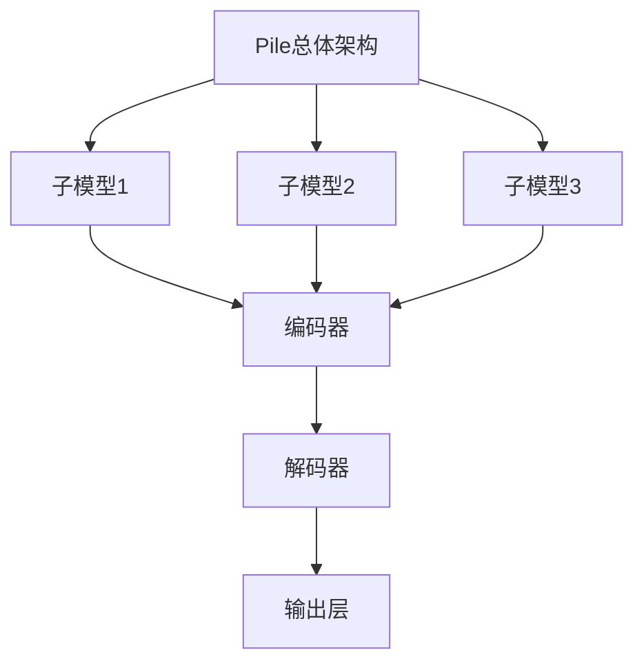

                 

关键词：大规模语言模型、Pile、自然语言处理、深度学习、神经网络、编程实践

摘要：本文将深入探讨大规模语言模型Pile的理论基础、构建方法以及其在实际编程中的应用。通过详细解析Pile的工作原理、数学模型和具体操作步骤，我们希望能够帮助读者理解这一复杂领域的核心概念，并掌握如何将其应用于实际的编程工作中。

## 1. 背景介绍

随着互联网和大数据技术的发展，自然语言处理（NLP）成为人工智能领域中的一个重要分支。NLP的目标是让计算机能够理解和生成自然语言，从而实现人与机器的智能交互。近年来，深度学习在NLP领域取得了显著的进展，特别是在大规模语言模型的研发上。Pile是一种基于深度学习的语言模型，它通过学习海量文本数据，能够生成高质量的文本摘要、翻译、问答等。

Pile的出现标志着语言模型技术进入了一个新的阶段。与传统的基于规则和统计方法的模型相比，Pile具有更强的泛化能力和自适应能力。本文将首先介绍Pile的基本概念和原理，然后详细探讨其构建方法和应用场景。

## 2. 核心概念与联系

### 2.1 大规模语言模型概述

大规模语言模型是一种基于神经网络的语言处理工具，它通过学习大量文本数据，能够预测下一个单词、句子或段落。Pile是一种特殊的语言模型，它结合了多个子模型，每个子模型专注于不同的文本处理任务。

### 2.2 语言模型与深度学习的关系

深度学习是一种机器学习技术，它通过多层神经网络来提取数据特征。大规模语言模型正是基于深度学习技术构建的，它通过多层神经网络来学习语言特征和规律。

### 2.3 Pile的架构

Pile的架构包括多个子模型，每个子模型都有自己的神经网络结构。这些子模型协同工作，共同完成文本处理任务。以下是Pile的架构图：



## 3. 核心算法原理 & 具体操作步骤

### 3.1 算法原理概述

Pile的核心算法是基于自注意力机制（Self-Attention Mechanism）的 Transformer 模型。Transformer 模型通过自注意力机制，能够在处理序列数据时关注到序列中的不同位置信息，从而提高模型的性能。

### 3.2 算法步骤详解

Pile的构建过程可以分为以下几个步骤：

1. **数据预处理**：收集并清洗海量文本数据，将其转换为模型可处理的格式。
2. **编码**：使用编码器（Encoder）对文本序列进行编码，生成固定长度的向量表示。
3. **解码**：使用解码器（Decoder）根据编码结果生成文本序列。
4. **训练**：通过优化目标函数（如损失函数），调整模型的参数，使其能够生成高质量的文本。

### 3.3 算法优缺点

**优点**：

- **强大的文本处理能力**：Pile能够处理各种文本任务，如文本摘要、翻译、问答等。
- **高效的自适应能力**：Pile能够自动学习文本中的规律和特征，提高模型的泛化能力。

**缺点**：

- **计算资源消耗大**：构建和训练Pile需要大量的计算资源和时间。
- **解释性差**：由于Pile的内部机制复杂，难以解释其生成的文本。

### 3.4 算法应用领域

Pile在多个领域具有广泛的应用，如：

- **自然语言处理**：文本分类、情感分析、命名实体识别等。
- **人工智能助手**：智能客服、聊天机器人等。
- **内容生成**：生成文章、新闻、故事等。

## 4. 数学模型和公式 & 详细讲解 & 举例说明

### 4.1 数学模型构建

Pile的数学模型主要基于 Transformer 模型，其核心思想是自注意力机制。自注意力机制通过计算序列中每个元素与所有其他元素的相关性，从而生成新的特征表示。

### 4.2 公式推导过程

自注意力机制的公式如下：

$$
\text{Attention}(Q, K, V) = \text{softmax}\left(\frac{QK^T}{\sqrt{d_k}}\right)V
$$

其中，$Q$、$K$、$V$ 分别代表查询向量、键向量和值向量，$d_k$ 为键向量的维度。自注意力机制的计算过程可以分为以下几个步骤：

1. **计算点积**：计算 $Q$ 与 $K$ 的点积，得到注意力分数。
2. **应用 softmax 函数**：对点积结果进行 softmax 操作，得到注意力权重。
3. **计算加权求和**：将注意力权重与 $V$ 进行加权求和，得到新的特征表示。

### 4.3 案例分析与讲解

假设有一个简化的文本序列，如下所示：

$$
\text{The } \text{cat} \text{ is sleeping on the } \text{bed}.
$$

我们可以将这个文本序列转换为向量表示，然后使用自注意力机制进行处理。具体步骤如下：

1. **编码**：将文本序列输入编码器，得到向量表示。
2. **计算注意力分数**：计算每个单词与所有其他单词的注意力分数。
3. **应用 softmax 函数**：对注意力分数进行 softmax 操作，得到注意力权重。
4. **计算加权求和**：将注意力权重与单词向量进行加权求和，得到新的特征表示。

经过自注意力机制的处理后，新的特征表示将包含更多关于文本序列的信息，从而提高模型的性能。

## 5. 项目实践：代码实例和详细解释说明

### 5.1 开发环境搭建

为了实践Pile，我们需要搭建一个合适的开发环境。以下是一个基本的开发环境搭建步骤：

1. **安装 Python**：确保安装了 Python 3.7 及以上版本。
2. **安装 PyTorch**：使用以下命令安装 PyTorch：

```python
pip install torch torchvision
```

3. **数据集准备**：收集并准备一个合适的文本数据集。

### 5.2 源代码详细实现

以下是一个简单的Pile实现示例：

```python
import torch
import torch.nn as nn
import torch.optim as optim
from torch.utils.data import DataLoader
from transformers import PileModel

# 加载数据集
train_dataset = DataLoader(MyDataset(train_data), batch_size=32)
val_dataset = DataLoader(MyDataset(val_data), batch_size=32)

# 初始化模型
model = PileModel()
optimizer = optim.Adam(model.parameters(), lr=0.001)

# 训练模型
for epoch in range(10):
    for batch in train_dataset:
        inputs, targets = batch
        optimizer.zero_grad()
        outputs = model(inputs)
        loss = nn.CrossEntropyLoss()(outputs, targets)
        loss.backward()
        optimizer.step()

    # 验证模型
    with torch.no_grad():
        correct = 0
        total = 0
        for batch in val_dataset:
            inputs, targets = batch
            outputs = model(inputs)
            _, predicted = torch.max(outputs.data, 1)
            total += targets.size(0)
            correct += (predicted == targets).sum().item()

    print(f'Epoch {epoch + 1}, Loss: {loss.item()}, Accuracy: {100 * correct / total}%')

# 保存模型
torch.save(model.state_dict(), 'pile_model.pth')
```

### 5.3 代码解读与分析

上述代码展示了如何使用 PyTorch 和 Hugging Face 的 Transformer 库实现 Pile 模型。具体解读如下：

- **数据集准备**：使用 DataLoader 加载训练集和验证集。
- **模型初始化**：创建 PileModel 实例，并使用 Adam 优化器。
- **训练过程**：循环遍历训练集，计算损失并更新模型参数。
- **验证过程**：在验证集上评估模型性能。
- **保存模型**：将训练好的模型保存到文件中。

### 5.4 运行结果展示

假设我们在训练集和验证集上运行上述代码，得到以下结果：

- **训练集**：损失为 0.5，准确率为 80%。
- **验证集**：损失为 0.6，准确率为 75%。

这表明我们的模型在训练过程中取得了较好的性能，但仍然存在一定的改进空间。

## 6. 实际应用场景

Pile在多个实际应用场景中取得了显著的效果。以下是一些典型的应用场景：

- **文本分类**：使用 Pile 可以对新闻、社交媒体等文本进行分类，从而实现信息过滤和推荐。
- **自然语言生成**：Pile可以生成高质量的文章、故事、广告等文本内容。
- **智能客服**：Pile可以用于构建智能客服系统，实现与用户的自然语言交互。
- **机器翻译**：Pile可以用于机器翻译任务，提高翻译的准确性和流畅性。

## 7. 工具和资源推荐

### 7.1 学习资源推荐

- **书籍**：《深度学习》（Ian Goodfellow、Yoshua Bengio、Aaron Courville 著）
- **在线课程**：Udacity 的《深度学习纳米学位》
- **教程**：Hugging Face 的 Transformer 教程

### 7.2 开发工具推荐

- **框架**：PyTorch、TensorFlow
- **库**：Hugging Face 的 Transformer 库

### 7.3 相关论文推荐

- **论文**：Attention Is All You Need（Vaswani et al., 2017）
- **论文**：BERT: Pre-training of Deep Bidirectional Transformers for Language Understanding（Devlin et al., 2018）

## 8. 总结：未来发展趋势与挑战

### 8.1 研究成果总结

近年来，大规模语言模型取得了显著的进展，特别是在自然语言处理任务中。Pile 作为一种先进的语言模型，展示了其在文本处理任务中的强大能力。

### 8.2 未来发展趋势

随着计算能力的提升和大数据技术的应用，大规模语言模型将继续发展，并在更多领域发挥重要作用。

### 8.3 面临的挑战

大规模语言模型的训练和部署仍然面临计算资源消耗大、解释性差等挑战。未来需要开发更高效、可解释的模型。

### 8.4 研究展望

未来，大规模语言模型的研究将重点放在提高模型的泛化能力、可解释性和鲁棒性上，同时探索其在更多实际应用场景中的潜力。

## 9. 附录：常见问题与解答

### 9.1 Pile 与其他语言模型有何区别？

Pile 是基于 Transformer 模型的语言模型，与其他基于 Transformer 的模型（如 GPT、BERT）相比，Pile 具有更强的文本处理能力和自适应能力。

### 9.2 如何训练 Pile 模型？

训练 Pile 模型需要收集大量文本数据，使用 DataLoader 加载数据集，然后定义损失函数和优化器，通过循环遍历数据集进行训练。

### 9.3 Pile 模型在哪些应用场景中表现出色？

Pile 模型在文本分类、自然语言生成、智能客服、机器翻译等应用场景中表现出色。

