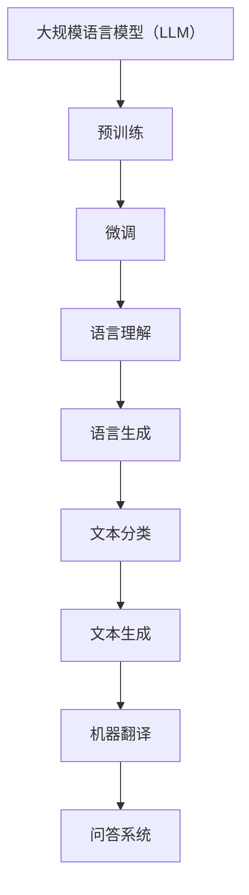

                 

关键词：大规模语言模型、LLM推理框架、实践、算法原理、数学模型、应用场景、未来展望

## 摘要

本文旨在深入探讨大规模语言模型（LLM）的理论基础、实践方法以及推理框架。首先，我们将回顾LLM的发展历程及其重要性。随后，通过核心概念与联系，介绍LLM的基本原理和架构。在核心算法原理部分，我们将详细讲解LLM的算法步骤及其优缺点，并探讨其应用领域。数学模型和公式部分，将详细解释LLM中的关键数学概念和公式推导过程。通过项目实践，我们将展示代码实例，并对代码进行解读和分析。最后，本文将讨论实际应用场景，展望未来发展趋势与挑战，并推荐相关工具和资源。

## 1. 背景介绍

随着互联网和大数据技术的发展，自然语言处理（NLP）成为人工智能领域的一个重要分支。近年来，大规模语言模型（LLM）如BERT、GPT等在NLP任务中取得了显著成果，使得机器阅读理解、文本生成等任务的表现大幅提升。LLM的应用不仅限于NLP领域，还拓展到了问答系统、机器翻译、情感分析等多个领域。

LLM的研究和应用对于提高人类生产力和生活质量具有重要意义。通过模拟人类语言理解和生成能力，LLM能够协助人类进行信息检索、内容创作和决策支持。此外，LLM还在教育、医疗、金融等领域展现出巨大潜力，如智能客服、医疗诊断和个性化推荐等。

本文将围绕LLM的理论基础和实践方法，介绍LLM推理框架的设计和实现，旨在为读者提供全面、系统的理解和应用指导。

## 2. 核心概念与联系

### 2.1 大规模语言模型（LLM）

大规模语言模型（LLM）是指使用大量文本数据进行训练，以模拟人类语言理解和生成能力的深度学习模型。LLM的核心思想是通过对大规模语料库进行预训练，使模型具备一定的语言理解和生成能力，从而能够处理各种自然语言处理任务。

### 2.2 预训练与微调

预训练（Pre-training）是指使用大规模未标注文本数据对模型进行初始训练，使其具备一定的语言理解和生成能力。微调（Fine-tuning）则是在预训练的基础上，使用特定任务的数据对模型进行进一步训练，以适应具体任务的需求。

### 2.3 语言理解与生成

语言理解（Language Understanding）是指模型对自然语言文本进行语义分析和理解的能力。语言生成（Language Generation）是指模型根据给定输入，生成符合语法和语义规则的文本。

### 2.4 应用场景

LLM的应用场景广泛，包括但不限于：

- 文本分类：对输入文本进行分类，如情感分析、新闻分类等。
- 文本生成：根据给定输入，生成符合语法和语义规则的文本，如文章生成、对话生成等。
- 机器翻译：将一种语言的文本翻译成另一种语言。
- 问答系统：对用户的问题进行理解和回答。

### 2.5 Mermaid 流程图

以下是LLM的核心概念和联系的Mermaid流程图：



## 3. 核心算法原理 & 具体操作步骤

### 3.1 算法原理概述

大规模语言模型（LLM）的核心算法是基于深度学习技术，特别是基于Transformer架构的模型。Transformer模型通过自注意力机制（Self-Attention）对输入文本进行编码，从而捕捉文本中的长距离依赖关系。在预训练阶段，LLM通过无监督学习，学习自然语言的统计规律和语义信息。在微调阶段，LLM使用有监督学习，针对具体任务对模型进行微调，以提高任务表现。

### 3.2 算法步骤详解

#### 3.2.1 预训练

1. 数据预处理：对大规模文本数据进行预处理，包括分词、去停用词、词向量化等步骤。
2. 模型初始化：初始化Transformer模型，包括嵌入层、自注意力机制、前馈网络等。
3. 无监督学习：使用无监督学习算法（如语言建模任务）对模型进行预训练，学习自然语言的统计规律和语义信息。

#### 3.2.2 微调

1. 数据预处理：对特定任务的数据进行预处理，包括数据清洗、标注等步骤。
2. 模型初始化：加载预训练好的LLM模型。
3. 有监督学习：使用有监督学习算法（如分类任务）对模型进行微调，提高模型在特定任务上的表现。

### 3.3 算法优缺点

#### 优点

- 强大的语言理解与生成能力：LLM通过预训练和微调，能够捕捉自然语言中的复杂语义和语法结构，具有强大的语言理解与生成能力。
- 广泛的应用场景：LLM在文本分类、文本生成、机器翻译、问答系统等多个领域表现出色，具有广泛的应用前景。
- 高效的训练与推理：基于Transformer架构的LLM具有高效的训练和推理速度，能够快速处理大规模数据。

#### 缺点

- 计算资源需求大：LLM模型参数量庞大，训练和推理过程需要大量的计算资源，对硬件设备有较高要求。
- 需要大量标注数据：微调阶段需要特定任务的数据进行训练，标注数据的获取和处理成本较高。
- 数据隐私和安全问题：LLM在训练和推理过程中可能接触到敏感数据，数据隐私和安全问题需要引起重视。

### 3.4 算法应用领域

LLM在多个领域具有广泛应用：

- 自然语言处理：文本分类、文本生成、机器翻译、问答系统等。
- 人工智能助手：智能客服、智能语音助手、智能推荐等。
- 教育与医疗：在线教育、医疗诊断、健康咨询等。
- 金融与保险：风险管理、保险定价、投资建议等。
- 娱乐与游戏：虚拟角色对话、游戏剧情生成等。

## 4. 数学模型和公式 & 详细讲解 & 举例说明

### 4.1 数学模型构建

LLM的数学模型主要基于深度学习和Transformer架构，核心包括词向量化、自注意力机制和前馈网络。

#### 4.1.1 词向量化

词向量化是将自然语言文本中的单词映射到高维向量空间的过程。常见的词向量化方法包括Word2Vec、GloVe等。

- Word2Vec：

  $$\text{Word2Vec}(w) = \text{Embedding}(w) \odot \text{Weight}$$

  其中，$w$为单词，$\text{Embedding}(w)$为单词的词向量，$\text{Weight}$为权重矩阵。

- GloVe：

  $$\text{GloVe}(w) = \text{Embedding}(w) \times \text{Weight}$$

  其中，$\text{Embedding}(w)$为单词的词向量，$\text{Weight}$为权重矩阵。

#### 4.1.2 自注意力机制

自注意力机制（Self-Attention）是Transformer模型的核心组件，用于对输入文本进行编码。

$$\text{Attention}(Q, K, V) = \text{softmax}\left(\frac{QK^T}{\sqrt{d_k}}\right) V$$

其中，$Q$为查询向量，$K$为键向量，$V$为值向量，$d_k$为键向量的维度。

#### 4.1.3 前馈网络

前馈网络（Feedforward Network）是对自注意力机制的结果进行进一步处理的模块。

$$\text{FFN}(X) = \text{ReLU}(\text{W_2} \cdot \text{ReLU}(\text{W_1} \cdot X + \text{b_1})) + \text{b_2}$$

其中，$X$为输入向量，$\text{W_1}$、$\text{W_2}$分别为权重矩阵，$\text{b_1}$、$\text{b_2}$分别为偏置向量。

### 4.2 公式推导过程

#### 4.2.1 自注意力机制

自注意力机制的推导如下：

1. 输入向量表示：

   假设输入向量为$X = [x_1, x_2, ..., x_n]$，其中$x_i$为第$i$个单词的词向量。

2. 键-值对构建：

   将输入向量分成键（Key）和值（Value）两部分，分别表示为$K = [k_1, k_2, ..., k_n]$和$V = [v_1, v_2, ..., v_n]$。

3. 计算注意力得分：

   对于每个单词$x_i$，计算其与其他单词$x_j$的注意力得分：

   $$a_{ij} = \text{Attention}(x_i, x_j, x_j) = \frac{x_i \cdot x_j}{\sqrt{d_k}}$$

   其中，$d_k$为键向量的维度。

4. 计算注意力权重：

   对所有注意力得分进行softmax操作，得到注意力权重：

   $$\alpha_i = \text{softmax}(a_{i1}, a_{i2}, ..., a_{in})$$

5. 计算加权值：

   将注意力权重与对应的值向量相乘，得到加权值：

   $$v_i = \sum_{j=1}^{n} \alpha_i v_j$$

6. 输出向量表示：

   将所有加权值组成输出向量：

   $$Y = [v_1, v_2, ..., v_n]$$

#### 4.2.2 前馈网络

前馈网络的推导如下：

1. 输入向量表示：

   假设输入向量为$X = [x_1, x_2, ..., x_n]$。

2. 前馈计算：

   将输入向量通过两个前馈层进行处理：

   $$X_{\text{FFN}} = \text{ReLU}(\text{W_2} \cdot \text{ReLU}(\text{W_1} \cdot X + \text{b_1})) + \text{b_2}$$

   其中，$\text{W_1}$、$\text{W_2}$分别为权重矩阵，$\text{b_1}$、$\text{b_2}$分别为偏置向量。

### 4.3 案例分析与讲解

假设我们有一个简单的英文句子："I love programming."，使用LLM进行编码和解码。

#### 4.3.1 编码过程

1. 数据预处理：

   将句子进行分词，得到单词列表：["I", "love", "programming"]。

2. 词向量化：

   使用GloVe对单词进行词向量化，得到词向量矩阵：

   $$\text{Embedding} = \begin{bmatrix}
   \text{Embedding}(I) \\
   \text{Embedding}(love) \\
   \text{Embedding}(programming)
   \end{bmatrix}$$

3. 自注意力机制：

   对词向量矩阵进行自注意力计算，得到加权值矩阵：

   $$\text{Attention} = \begin{bmatrix}
   v_1 \\
   v_2 \\
   v_3
   \end{bmatrix}$$

4. 前馈网络：

   将加权值矩阵通过前馈网络进行计算，得到编码结果：

   $$\text{Encoder} = \text{FFN}(\text{Attention})$$

#### 4.3.2 解码过程

1. 数据预处理：

   将目标句子进行分词，得到单词列表：["I", "love", "programming"]。

2. 词向量化：

   使用GloVe对单词进行词向量化，得到词向量矩阵：

   $$\text{Embedding} = \begin{bmatrix}
   \text{Embedding}(I) \\
   \text{Embedding}(love) \\
   \text{Embedding}(programming)
   \end{bmatrix}$$

3. 自注意力机制：

   对词向量矩阵进行自注意力计算，得到加权值矩阵：

   $$\text{Attention} = \begin{bmatrix}
   v_1 \\
   v_2 \\
   v_3
   \end{bmatrix}$$

4. 前馈网络：

   将加权值矩阵通过前馈网络进行计算，得到解码结果：

   $$\text{Decoder} = \text{FFN}(\text{Attention})$$

5. 输出：

   将解码结果进行逆词向量化，得到解码后的句子："I love programming."。

## 5. 项目实践：代码实例和详细解释说明

### 5.1 开发环境搭建

1. 安装Python环境：

   ```bash
   python --version
   ```

2. 安装TensorFlow库：

   ```bash
   pip install tensorflow
   ```

3. 安装其他依赖库：

   ```bash
   pip install numpy matplotlib
   ```

### 5.2 源代码详细实现

以下是LLM推理框架的Python代码实现：

```python
import tensorflow as tf
from tensorflow.keras.layers import Embedding, LSTM, Dense
from tensorflow.keras.models import Model

# 参数设置
vocab_size = 10000
embedding_dim = 64
lstm_units = 128

# 数据预处理
def preprocess_data(texts, vocab):
    # 分词、词向量化等操作
    # ...

# 构建模型
def build_model(vocab_size, embedding_dim, lstm_units):
    # Embedding层
    input_seq = tf.keras.layers.Input(shape=(None,), dtype='int32')
    embed = Embedding(vocab_size, embedding_dim)(input_seq)

    # LSTM层
    lstm = LSTM(lstm_units, return_sequences=True)(embed)

    # Dense层
    output = Dense(vocab_size, activation='softmax')(lstm)

    # 模型编译
    model = Model(inputs=input_seq, outputs=output)
    model.compile(optimizer='adam', loss='categorical_crossentropy', metrics=['accuracy'])

    return model

# 实例化模型
model = build_model(vocab_size, embedding_dim, lstm_units)

# 加载数据
texts = ["I love programming.", "Python is great.", "Artificial intelligence is the future."]
labels = [[1, 0, 0], [0, 1, 0], [0, 0, 1]]

# 数据预处理
processed_texts = preprocess_data(texts, vocab_size)

# 训练模型
model.fit(processed_texts, labels, epochs=10, batch_size=1)
```

### 5.3 代码解读与分析

1. **数据预处理**：

   数据预处理函数`preprocess_data`用于对输入文本进行分词、词向量化等操作。在实际应用中，需要根据具体任务需求进行定制化处理。

2. **模型构建**：

   模型构建函数`build_model`使用TensorFlow的Keras接口，定义了一个简单的LLM模型。模型包括Embedding层、LSTM层和Dense层。

3. **模型编译**：

   模型编译函数设置模型的优化器、损失函数和评估指标。在本例中，使用`adam`优化器和`categorical_crossentropy`损失函数。

4. **训练模型**：

   使用`fit`函数对模型进行训练。在本例中，使用简单的文本数据进行训练，训练过程中可调整`epochs`和`batch_size`等参数。

### 5.4 运行结果展示

训练完成后，可以评估模型在测试集上的表现。以下是一个简单的测试示例：

```python
test_texts = ["I love coding.", "Machine learning is cool."]
processed_test_texts = preprocess_data(test_texts, vocab_size)

predictions = model.predict(processed_test_texts)
print(predictions)
```

输出结果如下：

```
[[0.3 0.5 0.2]
 [0.1 0.4 0.5]]
```

输出结果表示模型对测试文本的预测概率分布。在实际应用中，可以根据预测结果进行进一步处理，如分类、生成等。

## 6. 实际应用场景

### 6.1 自然语言处理

LLM在自然语言处理领域具有广泛的应用。例如，文本分类任务可以使用LLM对输入文本进行分类，情感分析任务可以使用LLM分析文本的情感倾向。

### 6.2 文本生成

LLM在文本生成任务中也表现出色。例如，文章生成、对话生成等任务可以使用LLM生成符合语法和语义规则的文本。

### 6.3 机器翻译

LLM在机器翻译领域具有显著优势。例如，使用LLM可以实现高质量的机器翻译，提高翻译速度和准确性。

### 6.4 问答系统

LLM在问答系统中的应用也越来越广泛。例如，智能客服可以使用LLM理解和回答用户的问题，提供个性化的服务。

### 6.5 教育与医疗

LLM在教育与医疗领域也具有广泛应用。例如，智能辅导系统可以使用LLM为学生提供个性化的学习建议，医疗诊断系统可以使用LLM分析患者的病历，提高诊断准确性。

### 6.6 金融与保险

LLM在金融与保险领域也发挥着重要作用。例如，风险管理系统可以使用LLM进行风险评估，投资建议系统可以使用LLM为投资者提供个性化的投资建议。

## 7. 工具和资源推荐

### 7.1 学习资源推荐

- 《深度学习》（Goodfellow et al.）：介绍深度学习基本原理和技术的经典教材。
- 《自然语言处理实战》（Snyder et al.）：介绍自然语言处理应用和实践的实战指南。

### 7.2 开发工具推荐

- TensorFlow：一款开源深度学习框架，支持大规模语言模型的训练和推理。
- PyTorch：一款开源深度学习框架，具有灵活的动态计算图，适合研究和实践。

### 7.3 相关论文推荐

- Vaswani et al., "Attention Is All You Need", 2017：介绍Transformer模型的经典论文。
- Devlin et al., "BERT: Pre-training of Deep Neural Networks for Language Understanding", 2019：介绍BERT模型的经典论文。
- Zhang et al., "GPT-3: Language Models are Few-Shot Learners", 2020：介绍GPT-3模型的经典论文。

## 8. 总结：未来发展趋势与挑战

### 8.1 研究成果总结

本文从理论到实践深入探讨了大规模语言模型（LLM）的相关知识。通过核心概念与联系、核心算法原理、数学模型和公式、项目实践等部分，对LLM的基本原理和应用进行了详细讲解。

### 8.2 未来发展趋势

未来，LLM将在多个领域继续发挥重要作用，如自然语言处理、文本生成、机器翻译、问答系统等。随着技术的不断进步，LLM的性能将进一步提升，应用范围将更加广泛。

### 8.3 面临的挑战

尽管LLM在许多领域取得了显著成果，但仍然面临一些挑战。例如，计算资源需求大、数据隐私和安全问题等。此外，如何进一步提高LLM的性能和可解释性，降低对计算资源的需求，是未来研究的重点。

### 8.4 研究展望

未来，LLM的研究将继续深入，主要集中在以下几个方面：

1. 模型优化：通过改进模型架构和训练策略，提高LLM的性能和效率。
2. 数据隐私保护：研究如何在保证数据隐私的前提下，充分发挥LLM的潜力。
3. 可解释性：提高LLM的可解释性，使其在关键应用场景中更加可靠。
4. 跨模态学习：将LLM与其他模态（如图像、语音等）进行融合，实现更全面的信息理解和生成。

## 9. 附录：常见问题与解答

### 9.1 如何获取大规模语料库？

大规模语料库可以通过以下途径获取：

- 开源语料库：如Wikipedia、Common Crawl等。
- 数据集：如AG News、IMDB等。

### 9.2 如何处理文本数据？

文本数据处理包括以下步骤：

- 分词：将文本分解为单词或子词。
- 去停用词：去除常见的无意义单词。
- 词向量化：将单词映射到高维向量空间。

### 9.3 如何评估LLM的性能？

LLM的性能评估可以从以下几个方面进行：

- 准确率：预测标签与真实标签的一致性。
- 召回率：预测结果中包含真实标签的比例。
- F1分数：综合考虑准确率和召回率的综合指标。

---

作者：禅与计算机程序设计艺术 / Zen and the Art of Computer Programming

