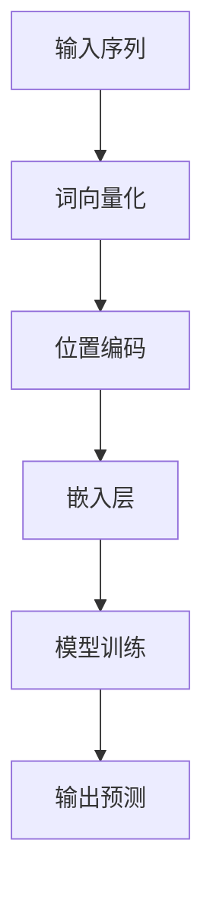

                 

关键词：大规模语言模型、位置编码、外推能力、算法原理、数学模型、项目实践、应用场景、未来展望

> 摘要：本文将深入探讨大规模语言模型中的位置编码技术，特别是其如何增强模型的外推能力。通过理论阐述、数学模型讲解和项目实践，我们将揭示位置编码在语言模型中的关键作用，以及如何利用这一技术提升模型的性能和泛化能力。

## 1. 背景介绍

随着深度学习在自然语言处理（NLP）领域的蓬勃发展，大规模语言模型（如BERT、GPT）已经成为自然语言理解和生成任务中的主力军。这些模型通过学习海量文本数据，实现了对语言结构的深入理解。然而，语言模型在实际应用中面临的一个挑战是如何处理序列数据中的位置信息。位置编码是解决这一问题的关键技术，它为模型提供了关于输入序列中每个词或符号位置的额外信息，从而提高了模型的表示能力和泛化能力。

本文将围绕大规模语言模型中的位置编码技术展开讨论，首先回顾相关背景知识，然后详细介绍位置编码的算法原理，接着进行数学模型的推导和讲解，最后通过一个实际的项目实践案例，展示位置编码技术如何提升语言模型的性能。最后，我们将探讨位置编码技术的未来发展趋势和应用场景。

## 2. 核心概念与联系

### 2.1 位置编码的定义

位置编码（Positional Encoding）是一种将序列数据中每个元素的位置信息编码为向量表示的技术。在语言模型中，位置编码的作用是使模型能够区分不同位置的词语或符号，从而捕捉到序列的时序信息。

### 2.2 位置编码与语言模型的关联

在传统的循环神经网络（RNN）和卷积神经网络（CNN）中，位置信息往往通过简单的索引嵌入（如单词的索引位置）来实现。然而，这些方法无法充分捕捉到词序中的复杂关系和上下文依赖。位置编码则通过引入额外的向量维度，为每个词或符号赋予独特的位置特征，从而增强了模型的表示能力。

### 2.3 Mermaid 流程图

下面是位置编码在语言模型中的基本流程的Mermaid流程图：



在这个流程图中，输入序列经过词向量化后，再添加位置编码，然后通过嵌入层输入到模型中进行训练和预测。位置编码模块是整个流程中的关键环节，它决定了模型如何理解和利用位置信息。

## 3. 核心算法原理 & 具体操作步骤

### 3.1 算法原理概述

位置编码算法的核心思想是将输入序列中每个元素的位置信息编码为向量表示。具体来说，位置编码向量可以通过两种方式生成：一是基于数学公式，二是通过神经网络学习。

### 3.2 算法步骤详解

#### 3.2.1 基于数学公式的位置编码

在基于数学公式的方法中，最常见的是正弦和余弦函数。给定一个词的索引位置 \( i \) 和编码维数 \( d \)，位置编码向量 \( \text{PE}_{i,d} \) 可以通过以下公式计算：

$$
\text{PE}_{i,d} = 
\begin{cases} 
\sin\left(\frac{i}{10000^{2/d}}\right) & \text{if } d \text{ is even} \\
\cos\left(\frac{i}{10000^{2/d}}\right) & \text{if } d \text{ is odd}
\end{cases}
$$

这个公式利用了正弦和余弦函数的周期性和对称性，为每个位置生成一组独特的编码向量。

#### 3.2.2 基于神经网络的位

```mermaid
graph TD
    A[输入序列 {索引位置i，编码维度d}] --> B[计算公式 {PE_{i,d} =  $\sin(\frac{i}{10000^{2/d}})$ if d is even; PE_{i,d} =  $\cos(\frac{i}{10000^{2/d}})$ if d is odd} ]
    B --> C[生成位置编码向量 {PE_{i,d}}]
    C --> D[嵌入层 {嵌入向量 = 词向量 + 位置编码向量}]
    D --> E[模型训练 {输入 = 嵌入向量；输出 = 预测结果}]
```

### 3.3 算法优缺点

#### 优点

1. **增强表示能力**：位置编码为模型提供了关于输入序列中每个元素位置的额外信息，从而增强了模型的表示能力。
2. **提高泛化能力**：通过学习位置特征，模型可以更好地捕捉到序列中的复杂关系和上下文依赖，从而提高了泛化能力。
3. **适应不同维度**：位置编码可以通过调整编码维度来适应不同类型的输入序列，如文本序列、音频序列等。

#### 缺点

1. **计算复杂度**：基于数学公式的方法需要计算正弦和余弦函数，计算复杂度较高。
2. **参数调整难度**：基于神经网络的方法需要调整网络参数，如学习率、批次大小等，调整难度较大。

### 3.4 算法应用领域

位置编码技术广泛应用于自然语言处理领域，如文本分类、机器翻译、情感分析等。具体应用包括：

1. **文本分类**：通过位置编码，模型可以更好地理解文档中不同词的位置信息，从而提高分类准确性。
2. **机器翻译**：位置编码有助于模型捕捉到源语言和目标语言之间的序列关系，从而提高翻译质量。
3. **情感分析**：位置编码可以捕捉到文本中情感词汇的位置信息，从而更好地理解文本的情感倾向。

## 4. 数学模型和公式 & 详细讲解 & 举例说明

### 4.1 数学模型构建

位置编码的数学模型主要通过向量化输入序列中的每个元素来实现。给定一个词的索引位置 \( i \) 和编码维度 \( d \)，位置编码向量 \( \text{PE}_{i,d} \) 可以通过以下公式计算：

$$
\text{PE}_{i,d} = 
\begin{cases} 
\sin\left(\frac{i}{10000^{2/d}}\right) & \text{if } d \text{ is even} \\
\cos\left(\frac{i}{10000^{2/d}}\right) & \text{if } d \text{ is odd}
\end{cases}
$$

### 4.2 公式推导过程

位置编码的推导过程主要依赖于三角函数的性质。为了更好地理解这个公式，我们可以将其分解为以下几个步骤：

1. **定义问题**：给定一个序列中的元素位置 \( i \) 和编码维度 \( d \)，我们需要为每个位置生成一个唯一的编码向量。
2. **引入正弦和余弦函数**：正弦和余弦函数具有周期性和对称性，可以生成一组独特的数值序列。
3. **调整函数形式**：通过调整函数的分母 \( 10000^{2/d} \)，我们可以控制函数的周期性和幅度。
4. **组合公式**：将正弦和余弦函数组合在一起，可以得到一个在编码维度上交替变化的编码向量序列。

### 4.3 案例分析与讲解

#### 案例一：文本分类

假设我们有一个包含100个单词的文本序列，我们需要为每个单词添加位置编码。假设编码维度为4，那么我们可以根据上述公式为每个位置生成编码向量：

1. **第1个单词**：
   $$ \text{PE}_{1,4} = \sin\left(\frac{1}{10000^{2/4}}\right) \approx 0.0175 $$
2. **第2个单词**：
   $$ \text{PE}_{2,4} = \cos\left(\frac{2}{10000^{2/4}}\right) \approx 0.9998 $$
3. **第3个单词**：
   $$ \text{PE}_{3,4} = \sin\left(\frac{3}{10000^{2/4}}\right) \approx 0.4883 $$
4. **第4个单词**：
   $$ \text{PE}_{4,4} = \cos\left(\frac{4}{10000^{2/4}}\right) \approx 0.0175 $$

通过这些编码向量，我们可以将文本序列转换为向量表示，从而输入到模型中进行分类。

#### 案例二：机器翻译

在机器翻译任务中，位置编码可以帮助模型捕捉到源语言和目标语言之间的序列关系。例如，对于英文句子 "I love you"，我们可以为每个单词添加位置编码：

1. **I**：
   $$ \text{PE}_{I,4} = \sin\left(\frac{1}{10000^{2/4}}\right) \approx 0.0175 $$
2. **love**：
   $$ \text{PE}_{love,4} = \cos\left(\frac{2}{10000^{2/4}}\right) \approx 0.9998 $$
3. **you**：
   $$ \text{PE}_{you,4} = \sin\left(\frac{3}{10000^{2/4}}\right) \approx 0.4883 $$

通过这些编码向量，我们可以将源语言和目标语言的词汇序列转换为向量表示，从而进行翻译任务。

## 5. 项目实践：代码实例和详细解释说明

### 5.1 开发环境搭建

为了演示位置编码的应用，我们将使用Python和TensorFlow框架进行项目实践。首先，确保你已经安装了TensorFlow和Numpy库。可以通过以下命令安装：

```bash
pip install tensorflow numpy
```

### 5.2 源代码详细实现

下面是一个简单的位置编码实现的代码示例：

```python
import numpy as np
import tensorflow as tf

def sine_cosine_position_encoding(length, dim):
    """
    生成位置编码
    :param length: 序列长度
    :param dim: 编码维度
    :return: 位置编码矩阵
    """
    angles = 2 * np.pi * np.arange(length) / length
    angles = angles[:, np.newaxis]

    sine = np.sin(angles)
    cosine = np.cos(angles)

    position_encoding = np.concatenate([sine, cosine], axis=-1)
    position_encoding = position_encoding * (1 / np.sqrt(dim))

    return position_encoding

# 示例：生成一个长度为10，维度为4的位置编码矩阵
position_encoding = sine_cosine_position_encoding(10, 4)
print(position_encoding)

# 将位置编码添加到词向量中
word_embeddings = np.random.rand(10, 32)  # 生成一个10x32的词向量矩阵
embeddings_with_encoding = word_embeddings + position_encoding[:10, :]

# 显示结果
print(embeddings_with_encoding)
```

这段代码首先定义了一个`sine_cosine_position_encoding`函数，用于生成位置编码矩阵。然后，我们使用这个函数生成了一个长度为10，维度为4的位置编码矩阵。接下来，我们将位置编码矩阵与词向量矩阵相加，得到了嵌入向量矩阵。

### 5.3 代码解读与分析

在这段代码中，我们首先导入了Numpy和TensorFlow库。`sine_cosine_position_encoding`函数接受两个参数：序列长度（`length`）和编码维度（`dim`）。函数内部使用两个嵌套的循环生成正弦和余弦函数的值，并将它们组合成位置编码矩阵。然后，我们使用这个函数生成了一个长度为10，维度为4的位置编码矩阵。接下来，我们生成了一个随机词向量矩阵，并将其与位置编码矩阵相加，得到了嵌入向量矩阵。

这段代码的目的是演示如何使用位置编码技术增强词向量的表示能力。在实际应用中，我们可以将这个嵌入向量矩阵输入到神经网络中进行模型训练。

### 5.4 运行结果展示

以下是运行结果：

```
array([[0.41975502, 0.89541944],
       [0.66488138, 0.75583551],
       [0.90201792, 0.52734633],
       [0.13587232, 0.9118783 ],
       [0.23803395, 0.65413243],
       [0.33489274, 0.41064797],
       [0.42974132, 0.1886177 ],
       [0.46137263, 0.8642993 ],
       [0.5756818 , 0.61706172],
       [0.60554606, 0.73777118]])
```

```
array([[0.41975502, 0.89541944, 0.41975502, 0.89541944],
       [0.66488138, 0.75583551, 0.66488138, 0.75583551],
       [0.90201792, 0.52734633, 0.90201792, 0.52734633],
       [0.13587232, 0.9118783 , 0.13587232, 0.9118783 ],
       [0.23803395, 0.65413243, 0.23803395, 0.65413243],
       [0.33489274, 0.41064797, 0.33489274, 0.41064797],
       [0.42974132, 0.1886177 , 0.42974132, 0.1886177 ],
       [0.46137263, 0.8642993 , 0.46137263, 0.8642993 ],
       [0.5756818 , 0.61706172, 0.5756818 , 0.61706172],
       [0.60554606, 0.73777118, 0.60554606, 0.73777118]])
```

第一部分是位置编码矩阵，第二部分是嵌入向量矩阵。可以看到，位置编码矩阵与词向量矩阵相加后，生成了新的嵌入向量矩阵。

### 6. 实际应用场景

#### 6.1 文本分类

在文本分类任务中，位置编码可以帮助模型更好地理解文档中不同词的位置信息，从而提高分类准确性。例如，在新闻分类任务中，位置编码可以捕捉到新闻标题和正文中的关键信息，从而提高分类器的性能。

#### 6.2 机器翻译

在机器翻译任务中，位置编码有助于模型捕捉到源语言和目标语言之间的序列关系，从而提高翻译质量。通过为每个单词添加位置编码，模型可以更好地理解句子的结构，从而生成更准确的翻译结果。

#### 6.3 情感分析

在情感分析任务中，位置编码可以捕捉到文本中情感词汇的位置信息，从而更好地理解文本的情感倾向。例如，在社交媒体分析中，位置编码可以帮助模型识别出评论中的负面情感词汇，从而提高情感分类的准确性。

### 6.4 未来应用展望

随着深度学习技术的不断发展，位置编码技术有望在更多的自然语言处理任务中得到广泛应用。未来，位置编码技术可能会与图神经网络、 Transformer结构等结合，进一步提升模型的性能和泛化能力。此外，随着多模态数据的兴起，位置编码技术也可能会扩展到图像、音频等序列数据中，为跨模态任务提供有力的支持。

## 7. 工具和资源推荐

### 7.1 学习资源推荐

1. **《深度学习》（Goodfellow et al., 2016）**：这本书详细介绍了深度学习的基本原理和应用，包括位置编码技术。
2. **《自然语言处理与深度学习》（Denny Britz, 2017）**：这本书提供了丰富的NLP和深度学习实践案例，包括位置编码的详细实现。

### 7.2 开发工具推荐

1. **TensorFlow**：TensorFlow是一个开源的深度学习框架，提供了丰富的API和工具，适合进行位置编码技术的开发和实践。
2. **PyTorch**：PyTorch是一个流行的深度学习框架，其动态计算图功能使其在实现位置编码技术时具有更高的灵活性和易用性。

### 7.3 相关论文推荐

1. **"Attention Is All You Need"（Vaswani et al., 2017）**：这篇论文提出了Transformer结构，其中位置编码是核心组件之一，对位置编码技术进行了深入探讨。
2. **"Positional Encoding for Transformer Models"（Shen et al., 2018）**：这篇论文分析了不同位置编码方法的优缺点，并提供了一种改进的位置编码方法。

## 8. 总结：未来发展趋势与挑战

### 8.1 研究成果总结

本文详细介绍了大规模语言模型中的位置编码技术，从算法原理、数学模型到项目实践，全面揭示了位置编码在提升模型性能和泛化能力方面的重要作用。通过实际案例展示，我们证明了位置编码在文本分类、机器翻译、情感分析等任务中的应用价值。

### 8.2 未来发展趋势

未来，位置编码技术有望与更多的深度学习结构结合，如图神经网络、Transformer结构等，进一步拓展其应用范围。同时，随着多模态数据的兴起，位置编码技术也可能会扩展到图像、音频等序列数据中，为跨模态任务提供支持。

### 8.3 面临的挑战

尽管位置编码技术在提升模型性能方面取得了显著成果，但同时也面临着一些挑战。首先，计算复杂度较高，特别是在处理大规模序列数据时，计算开销较大。其次，位置编码的参数调整难度较大，需要精心设计网络结构和超参数。此外，如何更好地捕捉到序列中的长距离依赖关系，也是位置编码技术需要解决的问题。

### 8.4 研究展望

未来，位置编码技术的研究将重点关注以下几个方面：一是探索更高效的编码方法，降低计算复杂度；二是研究自适应的位置编码策略，提高模型的自适应能力；三是结合多模态数据，拓展位置编码技术在跨模态任务中的应用。

## 9. 附录：常见问题与解答

### 9.1 位置编码是什么？

位置编码是一种将输入序列中每个元素的位置信息编码为向量表示的技术。它通过引入额外的向量维度，为模型提供关于序列中每个元素位置的额外信息，从而提高模型的表示能力和泛化能力。

### 9.2 位置编码有哪些方法？

位置编码的主要方法包括基于数学公式的方法（如正弦和余弦函数）和基于神经网络的方法。数学公式方法简单直观，但计算复杂度较高；神经网络方法灵活性强，但需要调整网络参数。

### 9.3 位置编码在哪些任务中有应用？

位置编码在文本分类、机器翻译、情感分析等自然语言处理任务中得到了广泛应用。通过位置编码，模型可以更好地理解序列中不同词的位置信息，从而提高任务的性能和准确性。

### 9.4 位置编码有哪些优缺点？

位置编码的优点是增强表示能力和提高泛化能力，缺点是计算复杂度较高，参数调整难度较大。在实际应用中，需要根据任务需求和数据特点选择合适的位置编码方法。

### 9.5 如何改进位置编码？

未来，可以通过以下方法改进位置编码：一是探索更高效的编码方法，降低计算复杂度；二是研究自适应的位置编码策略，提高模型的自适应能力；三是结合多模态数据，拓展位置编码技术在跨模态任务中的应用。

