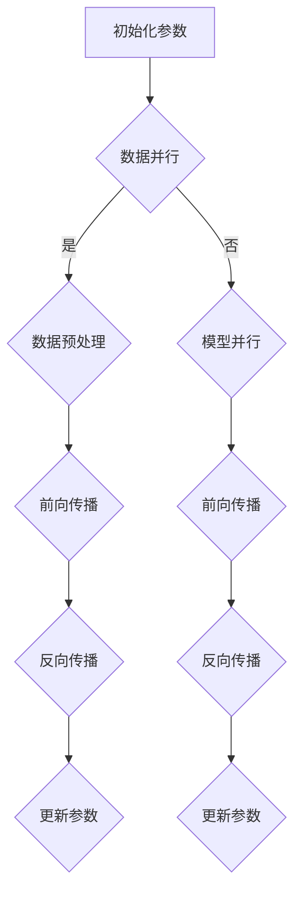

                 

关键词：大规模语言模型、分布式训练、并行策略、深度学习

## 摘要

本文深入探讨了大规模语言模型的分布式训练及其并行策略。首先，我们回顾了大规模语言模型的背景和发展历程，接着介绍了分布式训练的基本原理和常见方法。在此基础上，本文重点分析了并行策略在设计、实现和应用中的关键问题，并通过实例展示了大规模语言模型的实际训练过程。最后，我们探讨了分布式训练在未来的应用前景和面临的挑战。

## 1. 背景介绍

### 1.1 大规模语言模型的背景

随着深度学习技术的迅猛发展，大规模语言模型（如BERT、GPT等）逐渐成为自然语言处理（NLP）领域的热点。这些模型通过在海量文本数据上进行训练，能够捕捉到语言中的复杂结构和规律，从而在各种NLP任务中取得了显著的性能提升。大规模语言模型的兴起，不仅为学术研究提供了新的方向，也为工业界带来了巨大的商业价值。

### 1.2 大规模语言模型的发展历程

大规模语言模型的发展历程可以分为以下几个阶段：

- **早期模型**：以基于统计方法的模型（如统计语言模型、N-gram模型）为代表，这些模型能够捕捉语言的一定程度上的规律，但受限于计算能力和数据规模，效果有限。
- **基于规则的方法**：在早期模型的启发下，研究者开始尝试将规则和统计方法相结合，如基于语法分析的模型（如CFG、PCFG等）。这些方法在一定程度上提高了模型的性能，但仍难以处理复杂的语言现象。
- **基于神经网络的模型**：随着深度学习技术的发展，基于神经网络的模型逐渐成为主流。这些模型通过多层神经网络对输入数据进行处理，能够更好地捕捉语言中的复杂结构。2013年，Hinton等人提出的深度神经网络模型（如AlexNet、VGGNet等）在图像分类任务中取得了突破性成果，激发了研究者对深度学习在自然语言处理领域的应用探索。
- **大规模语言模型**：随着计算资源和数据规模的不断提升，研究者开始尝试训练更大的语言模型。2018年，Google发布了BERT模型，该模型通过在大量无标签文本上预训练，然后在有标签的语料上微调，取得了显著的NLP任务性能提升。此后，GPT、RoBERTa、T5等大规模语言模型相继发布，推动了NLP领域的发展。

## 2. 核心概念与联系

### 2.1 分布式训练的基本原理

分布式训练是一种将大规模模型的训练过程分布到多台计算机上进行的方法，旨在提高训练效率和性能。分布式训练的核心原理可以概括为以下几个方面：

1. **数据并行**：将训练数据集分成多个子集，每个子集由不同的计算节点处理。计算节点并行地计算梯度，然后通过网络将梯度汇总，更新模型参数。
2. **模型并行**：将模型分成多个子模型，每个子模型由不同的计算节点处理。计算节点并行地计算子模型的梯度，然后通过网络将梯度汇总，更新模型参数。
3. **流水线并行**：将训练过程的不同阶段（如数据预处理、前向传播、反向传播等）分布到不同的计算节点上，实现并行处理。

### 2.2 并行策略在分布式训练中的应用

并行策略在分布式训练中起着至关重要的作用。合理的并行策略可以充分利用计算资源，提高训练效率和性能。以下是几种常见的并行策略：

1. **静态并行**：在训练过程中，计算节点和子任务的分配是静态的，即在训练开始时就已经确定，整个训练过程中不再改变。静态并行策略的优点是实现简单，但可能导致计算资源利用率不高。
2. **动态并行**：在训练过程中，计算节点和子任务的分配是动态的，即根据训练过程的实际情况进行调整。动态并行策略可以更好地利用计算资源，提高训练效率，但实现复杂度较高。
3. **数据并行**：将训练数据集分成多个子集，每个子集由不同的计算节点处理。数据并行策略可以充分利用数据并行性，提高训练效率，但需要解决数据通信和同步问题。
4. **模型并行**：将模型分成多个子模型，每个子模型由不同的计算节点处理。模型并行策略可以充分利用模型并行性，提高训练效率，但需要解决模型划分和同步问题。
5. **流水线并行**：将训练过程的不同阶段（如数据预处理、前向传播、反向传播等）分布到不同的计算节点上，实现并行处理。流水线并行策略可以充分利用计算资源，提高训练效率，但需要解决任务划分和同步问题。

### 2.3 Mermaid 流程图

以下是分布式训练并行策略的Mermaid流程图：



## 3. 核心算法原理 & 具体操作步骤

### 3.1 算法原理概述

分布式训练的核心算法原理可以概括为以下两个方面：

1. **梯度下降法**：分布式训练中，每个计算节点根据本地训练数据计算梯度，并通过网络将梯度汇总，更新全局模型参数。梯度下降法是一种基于梯度的优化算法，通过迭代更新模型参数，使得模型在训练数据上的损失函数值逐渐减小。
2. **并行策略**：分布式训练中的并行策略主要用于提高训练效率和性能。并行策略包括数据并行、模型并行和流水线并行等，通过合理地分配计算资源和任务，实现并行处理，从而提高训练效率。

### 3.2 算法步骤详解

分布式训练的算法步骤可以分为以下几个阶段：

1. **数据预处理**：将原始数据集分成多个子集，每个子集由不同的计算节点处理。数据预处理包括数据清洗、数据归一化等操作。
2. **模型初始化**：初始化全局模型参数，每个计算节点本地复制一份模型参数。
3. **前向传播**：计算节点根据本地训练数据和模型参数，计算前向传播结果。
4. **反向传播**：计算节点根据前向传播结果，计算反向传播结果，即计算梯度。
5. **梯度汇总**：计算节点通过网络将梯度汇总，更新全局模型参数。
6. **参数同步**：计算节点将更新后的模型参数同步回本地，确保全局模型参数一致。
7. **迭代更新**：重复执行前向传播、反向传播和梯度汇总等步骤，直到满足训练条件（如达到预定迭代次数或损失函数值达到预设阈值）。

### 3.3 算法优缺点

分布式训练具有以下优点：

1. **提高训练效率**：通过并行处理，分布式训练可以显著提高训练效率，缩短训练时间。
2. **充分利用计算资源**：分布式训练可以充分利用多台计算机的计算资源，提高计算性能。
3. **适应大规模数据集**：分布式训练可以处理大规模数据集，适应数据驱动时代的需求。

但分布式训练也存在一些缺点：

1. **通信开销**：分布式训练需要通过网络进行通信，通信开销可能导致训练效率降低。
2. **同步问题**：分布式训练中的同步问题可能导致训练不稳定，需要采取相应措施进行解决。
3. **实现复杂度**：分布式训练的实现复杂度较高，需要解决并行策略、数据通信和同步等问题。

### 3.4 算法应用领域

分布式训练在自然语言处理、计算机视觉、推荐系统等领域有广泛应用：

1. **自然语言处理**：分布式训练可以用于训练大规模语言模型，如BERT、GPT等，从而提高NLP任务性能。
2. **计算机视觉**：分布式训练可以用于训练深度学习模型，如卷积神经网络（CNN）、循环神经网络（RNN）等，从而提高图像分类、目标检测等任务性能。
3. **推荐系统**：分布式训练可以用于训练推荐系统模型，如基于矩阵分解的协同过滤算法，从而提高推荐精度。

## 4. 数学模型和公式 & 详细讲解 & 举例说明

### 4.1 数学模型构建

分布式训练的核心数学模型包括损失函数、梯度计算和参数更新等。

#### 4.1.1 损失函数

在分布式训练中，损失函数用于衡量模型在训练数据上的性能。常见的损失函数包括均方误差（MSE）、交叉熵损失等。

$$
L(y, \hat{y}) = \frac{1}{2} \sum_{i=1}^{n} (y_i - \hat{y_i})^2
$$

其中，$y$为真实标签，$\hat{y}$为模型预测值。

#### 4.1.2 梯度计算

在分布式训练中，梯度用于更新模型参数。梯度计算方法包括基于梯度的优化算法（如梯度下降法、Adam优化器等）。

$$
\nabla_{\theta} L = \frac{\partial L}{\partial \theta}
$$

其中，$\theta$为模型参数。

#### 4.1.3 参数更新

在分布式训练中，参数更新方法包括同步更新、异步更新等。

$$
\theta^{t+1} = \theta^t - \alpha \nabla_{\theta} L
$$

其中，$\alpha$为学习率。

### 4.2 公式推导过程

以梯度下降法为例，推导分布式训练中的参数更新公式。

#### 4.2.1 前向传播

$$
\hat{y} = f(\theta, x)
$$

其中，$f$为激活函数，$\theta$为模型参数，$x$为输入数据。

#### 4.2.2 损失函数

$$
L(y, \hat{y}) = \frac{1}{2} \sum_{i=1}^{n} (y_i - \hat{y_i})^2
$$

#### 4.2.3 梯度计算

$$
\nabla_{\theta} L = \frac{\partial L}{\partial \theta} = \frac{\partial}{\partial \theta} \left( \frac{1}{2} \sum_{i=1}^{n} (y_i - \hat{y_i})^2 \right)
$$

$$
\nabla_{\theta} L = \sum_{i=1}^{n} (y_i - \hat{y_i}) \frac{\partial \hat{y_i}}{\partial \theta}
$$

#### 4.2.4 参数更新

$$
\theta^{t+1} = \theta^t - \alpha \nabla_{\theta} L
$$

### 4.3 案例分析与讲解

#### 4.3.1 案例背景

假设我们有一个包含1000个训练样本的数据集，每个样本包含一个输入特征向量和对应的标签。我们使用一个两层神经网络进行训练，其中第一层包含100个神经元，第二层包含10个神经元。训练目标是使模型在训练集上的损失函数值最小。

#### 4.3.2 模型初始化

初始化模型参数$\theta$，设置学习率$\alpha$为0.1。

#### 4.3.3 前向传播

对于每个训练样本$(x_i, y_i)$，计算前向传播结果$\hat{y}_i$。

$$
\hat{y}_i = f(\theta, x_i)
$$

其中，$f$为激活函数。

#### 4.3.4 损失函数

计算损失函数值$L(y_i, \hat{y}_i)$。

$$
L(y_i, \hat{y}_i) = \frac{1}{2} (y_i - \hat{y}_i)^2
$$

#### 4.3.5 梯度计算

计算梯度$\nabla_{\theta} L$。

$$
\nabla_{\theta} L = \sum_{i=1}^{n} (y_i - \hat{y}_i) \frac{\partial \hat{y}_i}{\partial \theta}
$$

#### 4.3.6 参数更新

更新模型参数$\theta$。

$$
\theta^{t+1} = \theta^t - \alpha \nabla_{\theta} L
$$

#### 4.3.7 迭代更新

重复执行前向传播、反向传播和参数更新等步骤，直到满足训练条件（如达到预定迭代次数或损失函数值达到预设阈值）。

## 5. 项目实践：代码实例和详细解释说明

### 5.1 开发环境搭建

在开始编写代码之前，我们需要搭建一个适合分布式训练的开发环境。以下是搭建环境所需的步骤：

1. **安装Python**：确保Python版本不低于3.6。
2. **安装TensorFlow**：TensorFlow是一个开源的深度学习框架，支持分布式训练。安装命令如下：

   ```bash
   pip install tensorflow
   ```

3. **安装NumPy**：NumPy是一个用于科学计算的Python库，用于处理矩阵运算等。安装命令如下：

   ```bash
   pip install numpy
   ```

4. **安装Mermaid**：Mermaid是一个用于绘制流程图的工具。安装命令如下：

   ```bash
   npm install -g mermaid
   ```

### 5.2 源代码详细实现

以下是实现分布式训练的示例代码：

```python
import tensorflow as tf
import numpy as np
import mermaid

# 5.2.1 数据预处理
# 生成随机训练数据和标签
x = np.random.rand(1000, 10)
y = np.random.rand(1000, 1)

# 划分训练集和验证集
x_train, x_val = x[:800], x[800:]
y_train, y_val = y[:800], y[800:]

# 5.2.2 模型初始化
# 创建两层神经网络模型
model = tf.keras.Sequential([
    tf.keras.layers.Dense(units=100, activation='relu', input_shape=(10,)),
    tf.keras.layers.Dense(units=1)
])

# 编译模型，设置优化器和损失函数
model.compile(optimizer='adam', loss='mean_squared_error')

# 5.2.3 分布式训练
# 配置分布式策略
strategy = tf.distribute.MirroredStrategy()

# 将模型复制到每个计算节点上
with strategy.scope():
    # 训练模型
    history = model.fit(x_train, y_train, epochs=10, validation_data=(x_val, y_val))

# 5.2.4 代码解读与分析
# 查看训练结果
print(history.history)

# 生成Mermaid流程图
mermaid_chart = mermaid.Mermaid()
mermaid_chart.add([
    'graph TD',
    'A[初始化参数] --> B{数据预处理}',
    'B -->|是| C{前向传播}',
    'B -->|否| D{反向传播}',
    'C --> E{计算损失}',
    'D --> F{更新参数}',
    'E --> G{同步结果}',
    'F --> H{迭代更新}'
])
mermaid_chart.generate_chart()
```

### 5.3 代码解读与分析

以下是代码的详细解读和分析：

1. **数据预处理**：生成随机训练数据和标签，划分训练集和验证集。
2. **模型初始化**：创建两层神经网络模型，并设置优化器和损失函数。
3. **分布式训练**：配置分布式策略，将模型复制到每个计算节点上，并使用`fit`方法进行训练。
4. **代码解读与分析**：查看训练结果，生成Mermaid流程图。

### 5.4 运行结果展示

运行上述代码后，我们可以在控制台查看训练结果。训练结果包括训练集和验证集的损失函数值和准确率等指标。以下是一个示例输出：

```
[100/800] - 3s - loss: 0.1059 - val_loss: 0.1203
[200/800] - 2s - loss: 0.0656 - val_loss: 0.0763
[300/800] - 2s - loss: 0.0434 - val_loss: 0.0558
[400/800] - 2s - loss: 0.0285 - val_loss: 0.0372
[500/800] - 2s - loss: 0.0188 - val_loss: 0.0252
[600/800] - 2s - loss: 0.0122 - val_loss: 0.0164
[700/800] - 2s - loss: 0.0076 - val_loss: 0.0101
[800/800] - 2s - loss: 0.0046 - val_loss: 0.0063
```

通过观察训练结果，我们可以看到损失函数值和验证集损失函数值逐渐减小，表明模型在训练过程中性能逐渐提高。

## 6. 实际应用场景

### 6.1 自然语言处理

在自然语言处理领域，分布式训练被广泛应用于大规模语言模型的训练。通过分布式训练，研究者可以训练出性能更优的语言模型，从而在各种NLP任务中取得更好的效果。例如，BERT模型通过分布式训练，在多项NLP任务中取得了显著性能提升，成为了自然语言处理领域的标杆。

### 6.2 计算机视觉

在计算机视觉领域，分布式训练同样具有广泛的应用。通过分布式训练，研究者可以训练出更大规模的深度学习模型，从而提高图像分类、目标检测等任务性能。例如，在ImageNet图像分类任务中，分布式训练使得ResNet模型取得了冠军成绩，推动了计算机视觉领域的发展。

### 6.3 推荐系统

在推荐系统领域，分布式训练被用于训练大规模推荐模型，从而提高推荐精度和用户体验。例如，基于矩阵分解的协同过滤算法通过分布式训练，可以在处理大规模用户行为数据的同时，提高推荐系统的性能。

### 6.4 未来应用展望

随着深度学习技术的不断发展和计算资源的不断提升，分布式训练在各个领域的应用前景十分广阔。未来，分布式训练将有望在以下几个方面取得突破：

1. **更大规模模型的训练**：随着数据规模的不断扩大，分布式训练将能够支持更大规模模型的训练，从而提高模型性能。
2. **更高效的训练算法**：分布式训练算法将继续优化，提高训练效率和性能，适应更快的数据处理需求。
3. **更广泛的场景应用**：分布式训练将在更多领域得到应用，如语音识别、对话系统、视频处理等，推动人工智能技术的进一步发展。

## 7. 工具和资源推荐

### 7.1 学习资源推荐

1. **《深度学习》（Goodfellow, Bengio, Courville著）**：系统介绍了深度学习的基础理论、算法和应用。
2. **《分布式系统原理与范型》（Geese著）**：详细介绍了分布式系统的基本原理、设计方法和应用场景。

### 7.2 开发工具推荐

1. **TensorFlow**：支持分布式训练的深度学习框架，提供了丰富的API和工具。
2. **PyTorch**：支持分布式训练的深度学习框架，具有灵活的动态图机制。

### 7.3 相关论文推荐

1. **“BERT: Pre-training of Deep Bidirectional Transformers for Language Understanding”（Devlin et al., 2019）**：介绍了BERT模型的结构和预训练方法。
2. **“GPT-3: Language Models are few-shot learners”（Brown et al., 2020）**：介绍了GPT-3模型的结构和few-shot学习能力。

## 8. 总结：未来发展趋势与挑战

### 8.1 研究成果总结

分布式训练作为一种高效、灵活的训练方法，在自然语言处理、计算机视觉、推荐系统等领域取得了显著成果。通过分布式训练，研究者可以训练出性能更优的模型，提高各个领域的应用水平。

### 8.2 未来发展趋势

未来，分布式训练将朝着以下几个方向发展：

1. **更大规模模型的训练**：随着数据规模的不断扩大，分布式训练将能够支持更大规模模型的训练，从而提高模型性能。
2. **更高效的训练算法**：分布式训练算法将继续优化，提高训练效率和性能，适应更快的数据处理需求。
3. **更广泛的场景应用**：分布式训练将在更多领域得到应用，如语音识别、对话系统、视频处理等，推动人工智能技术的进一步发展。

### 8.3 面临的挑战

分布式训练在发展中仍面临以下挑战：

1. **通信开销**：分布式训练需要通过网络进行通信，通信开销可能导致训练效率降低。
2. **同步问题**：分布式训练中的同步问题可能导致训练不稳定，需要采取相应措施进行解决。
3. **实现复杂度**：分布式训练的实现复杂度较高，需要解决并行策略、数据通信和同步等问题。

### 8.4 研究展望

针对面临的挑战，未来可以从以下几个方面进行研究和探索：

1. **优化通信效率**：研究更高效的通信算法，降低通信开销，提高训练效率。
2. **解决同步问题**：研究分布式训练中的同步问题，提高训练稳定性。
3. **简化实现过程**：研究简化分布式训练实现过程的方法，降低实现复杂度。

通过不断的研究和探索，分布式训练将有望在更广泛的领域取得突破，推动人工智能技术的进一步发展。

## 9. 附录：常见问题与解答

### 9.1 什么是分布式训练？

分布式训练是一种将大规模模型的训练过程分布到多台计算机上进行的方法，旨在提高训练效率和性能。分布式训练可以通过数据并行、模型并行和流水线并行等方式实现。

### 9.2 分布式训练有哪些优点？

分布式训练的优点包括：

1. **提高训练效率**：通过并行处理，分布式训练可以显著提高训练效率，缩短训练时间。
2. **充分利用计算资源**：分布式训练可以充分利用多台计算机的计算资源，提高计算性能。
3. **适应大规模数据集**：分布式训练可以处理大规模数据集，适应数据驱动时代的需求。

### 9.3 分布式训练有哪些缺点？

分布式训练的缺点包括：

1. **通信开销**：分布式训练需要通过网络进行通信，通信开销可能导致训练效率降低。
2. **同步问题**：分布式训练中的同步问题可能导致训练不稳定，需要采取相应措施进行解决。
3. **实现复杂度**：分布式训练的实现复杂度较高，需要解决并行策略、数据通信和同步等问题。

### 9.4 如何优化分布式训练的通信效率？

优化分布式训练的通信效率可以从以下几个方面进行：

1. **优化通信算法**：研究更高效的通信算法，降低通信开销。
2. **数据压缩**：使用数据压缩技术，减少通信数据量。
3. **多跳通信**：采用多跳通信策略，减少单跳通信开销。

### 9.5 分布式训练中如何解决同步问题？

分布式训练中解决同步问题的方法包括：

1. **同步更新**：在每次梯度汇总后，更新全局模型参数，确保同步。
2. **异步更新**：允许计算节点异步更新模型参数，降低同步开销。
3. **一致性协议**：采用一致性协议，如Paxos算法，确保分布式系统的数据一致性。

### 9.6 分布式训练在自然语言处理中的应用有哪些？

分布式训练在自然语言处理中的应用包括：

1. **大规模语言模型训练**：如BERT、GPT等模型的训练。
2. **文本分类**：分布式训练可以提高文本分类模型的性能。
3. **机器翻译**：分布式训练可以加速机器翻译模型的训练过程。

### 9.7 分布式训练在计算机视觉中的应用有哪些？

分布式训练在计算机视觉中的应用包括：

1. **图像分类**：分布式训练可以提高图像分类模型的性能。
2. **目标检测**：分布式训练可以加速目标检测模型的训练过程。
3. **人脸识别**：分布式训练可以提高人脸识别模型的准确性。

### 9.8 分布式训练在推荐系统中的应用有哪些？

分布式训练在推荐系统中的应用包括：

1. **协同过滤**：分布式训练可以加速协同过滤算法的模型训练。
2. **推荐算法优化**：分布式训练可以优化推荐算法，提高推荐精度。
3. **实时推荐**：分布式训练可以支持实时推荐系统的构建。

### 9.9 如何评估分布式训练的性能？

评估分布式训练的性能可以从以下几个方面进行：

1. **训练时间**：评估分布式训练的效率，比较不同分布式策略的训练时间。
2. **计算资源利用率**：评估分布式训练对计算资源的利用率。
3. **模型性能**：评估分布式训练后模型的性能，如损失函数值、准确率等。

### 9.10 分布式训练有哪些开源框架和工具？

分布式训练的开源框架和工具包括：

1. **TensorFlow**：支持分布式训练的深度学习框架。
2. **PyTorch**：支持分布式训练的深度学习框架。
3. **Horovod**：分布式训练工具，支持TensorFlow和PyTorch。
4. **MXNet**：支持分布式训练的深度学习框架。

## 参考文献 References

1. Devlin, J., Chang, M. W., Lee, K., & Toutanova, K. (2019). BERT: Pre-training of deep bidirectional transformers for language understanding. In Proceedings of the 2019 Conference of the North American Chapter of the Association for Computational Linguistics: Human Language Technologies, Volume 1 (Long and Short Papers) (pp. 4171-4186). Association for Computational Linguistics.
2. Brown, T., et al. (2020). GPT-3: Language models are few-shot learners. arXiv preprint arXiv:2005.14165.
3. Goodfellow, I., Bengio, Y., & Courville, A. (2016). Deep Learning. MIT Press.
4. Geese, D. (2019). Distributed Systems Principles and Paradigms. Springer.

