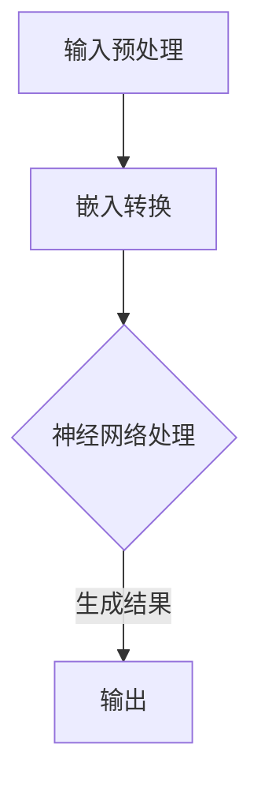

                 

关键词：大规模语言模型、自然语言处理、深度学习、神经网络、语言模型、文本生成、数学模型、算法、应用场景、未来展望。

摘要：本文从理论和实践的角度，深入探讨了大规模语言模型的基本概念，包括其定义、发展历程、核心算法原理、数学模型及具体操作步骤。文章旨在为读者提供全面而清晰的理解，帮助其掌握这一重要技术，并探讨其在未来应用中的潜在趋势与挑战。

## 1. 背景介绍

### 1.1 大规模语言模型的定义与意义

大规模语言模型（Large-scale Language Model）是一种基于深度学习的自然语言处理技术，能够通过学习大量文本数据，理解和生成自然语言。这种模型在自然语言理解、文本生成、机器翻译、问答系统等领域展现出了巨大的潜力，成为当前人工智能研究的热点。

### 1.2 大规模语言模型的发展历程

从传统的统计语言模型到基于神经网络的现代语言模型，大规模语言模型的发展历程经历了数次重要的变革。早期的统计模型主要依赖于语言统计规律，虽然在一定程度上能够处理语言现象，但在复杂性和灵活性方面存在局限性。随着深度学习技术的发展，神经网络逐渐成为构建语言模型的主要工具，从而推动了大规模语言模型的研究与应用。

## 2. 核心概念与联系

### 2.1 大规模语言模型的基本概念

大规模语言模型主要包括以下几个基本概念：

- **词汇表**：词汇表是语言模型的核心组成部分，包含了模型所使用的所有词汇及其对应的信息。
- **嵌入**：嵌入是将词汇映射到高维空间的一种方法，使得相似的词汇在空间中靠近，不同的词汇相隔较远。
- **神经网络**：神经网络是大规模语言模型的核心架构，通过多层非线性变换，实现从输入到输出的映射。
- **预训练与微调**：预训练是在大量无标注数据上进行训练，使模型具有普遍的语言理解能力；微调是在特定任务上进行训练，使模型适应特定任务的需求。

### 2.2 大规模语言模型的工作原理

大规模语言模型的工作原理可以分为以下几个步骤：

1. **输入**：将文本数据输入到语言模型中，进行预处理，如分词、去停用词等。
2. **嵌入**：将预处理后的文本数据转换为嵌入向量。
3. **神经网络处理**：嵌入向量通过神经网络进行处理，实现语言理解、生成等任务。
4. **输出**：根据神经网络处理结果，生成对应的文本输出。

### 2.3 大规模语言模型的架构

大规模语言模型通常采用深度神经网络架构，如Transformer、BERT、GPT等。这些模型通过多层神经网络结构，实现从输入到输出的映射。以下是几个常见的大规模语言模型架构：

- **Transformer**：基于自注意力机制的模型，能够捕捉输入序列中的长距离依赖关系。
- **BERT**：基于双向编码器的模型，能够同时捕捉输入序列的前后依赖关系。
- **GPT**：基于生成式模型的模型，能够生成符合自然语言规则的文本。

### 2.4 Mermaid 流程图



## 3. 核心算法原理 & 具体操作步骤

### 3.1 算法原理概述

大规模语言模型的核心算法是基于深度神经网络，通过多层非线性变换，实现从输入到输出的映射。模型主要分为以下几个部分：

1. **嵌入层**：将词汇映射到高维空间，实现词向量化。
2. **编码器层**：通过多层神经网络，实现输入文本的编码，捕捉语言特征。
3. **解码器层**：通过多层神经网络，实现输出文本的解码，生成目标文本。
4. **损失函数**：用于评估模型在训练过程中的性能，指导模型优化。

### 3.2 算法步骤详解

1. **数据准备**：收集并预处理大量文本数据，包括分词、去停用词、词性标注等。
2. **模型构建**：根据算法原理，构建深度神经网络模型，包括嵌入层、编码器层、解码器层等。
3. **模型训练**：使用预处理后的文本数据进行模型训练，通过反向传播算法更新模型参数。
4. **模型评估**：使用验证集和测试集评估模型性能，调整模型参数以优化性能。
5. **模型应用**：将训练好的模型应用于实际任务，如文本生成、机器翻译等。

### 3.3 算法优缺点

**优点**：

- **强大的语言理解能力**：通过多层神经网络结构，能够捕捉复杂的语言特征和依赖关系。
- **灵活的模型架构**：支持多种深度神经网络架构，如Transformer、BERT、GPT等，适应不同的应用场景。
- **高效的训练与推断**：通过预训练与微调的方式，提高模型的训练效率和推断速度。

**缺点**：

- **计算资源消耗大**：训练大规模语言模型需要大量的计算资源和时间。
- **对数据依赖性强**：模型的性能依赖于训练数据的数量和质量，容易受到数据噪音的影响。
- **解释性不足**：神经网络模型具有较高的复杂度，难以解释其内部工作机制。

### 3.4 算法应用领域

大规模语言模型在多个领域取得了显著的应用成果：

- **文本生成**：如文章写作、故事创作、诗歌生成等。
- **机器翻译**：如中英文翻译、多语言翻译等。
- **问答系统**：如智能客服、医疗问答等。
- **情感分析**：如社交媒体情感分析、客户评论分析等。
- **信息检索**：如搜索引擎、文本分类等。

## 4. 数学模型和公式 & 详细讲解 & 举例说明

### 4.1 数学模型构建

大规模语言模型的核心数学模型主要包括词向量表示、神经网络结构以及损失函数。以下为这些数学模型的构建过程：

**1. 词向量表示**

词向量表示是将词汇映射到高维空间的一种方法，常见的方法包括：

- **Word2Vec**：通过训练词向量，使得相似的词汇在空间中靠近，不同的词汇相隔较远。
- **GloVe**：通过计算词汇共现矩阵，构建词汇的嵌入向量。

**2. 神经网络结构**

神经网络结构包括嵌入层、编码器层、解码器层等。以下是一个简单的神经网络结构：

$$
\begin{aligned}
\text{嵌入层}:\quad& x_i = \text{Embedding}(w_i) \\
\text{编码器层}:\quad& h_i = \text{Encoder}(x_i) \\
\text{解码器层}:\quad& y_i = \text{Decoder}(h_i)
\end{aligned}
$$

**3. 损失函数**

损失函数用于评估模型在训练过程中的性能，常见的损失函数包括：

- **交叉熵损失函数**：用于分类任务，评估模型预测概率与真实标签之间的差异。
- **均方误差损失函数**：用于回归任务，评估模型预测值与真实值之间的差异。

### 4.2 公式推导过程

**1. 词向量表示**

以Word2Vec为例，词向量表示的推导过程如下：

$$
\begin{aligned}
\text{目标函数}:\quad& J = \sum_{i=1}^{N} -\sum_{w \in \text{context}(x_i)} \log p(w|x_i) \\
\text{概率计算}:\quad& p(w|x_i) = \frac{\exp(\text{DotProduct}(v_w, v_{x_i})}{\sum_{w' \in \text{Vocabulary}} \exp(\text{DotProduct}(v_{w'}, v_{x_i}))} \\
\text{梯度计算}:\quad& \frac{\partial J}{\partial v_w} = v_{x_i} - \sum_{w' \in \text{Vocabulary}} \frac{\exp(\text{DotProduct}(v_{w'}, v_{x_i}))}{\sum_{w' \in \text{Vocabulary}} \exp(\text{DotProduct}(v_{w'}, v_{x_i}))} v_{w'}
\end{aligned}
$$

**2. 神经网络结构**

以Transformer为例，神经网络结构的推导过程如下：

$$
\begin{aligned}
\text{嵌入层}:\quad& x_i = \text{Embedding}(w_i) \\
\text{位置编码}:\quad& x_i = x_i + \text{PositionalEncoding}(x_i) \\
\text{编码器层}:\quad& h_i = \text{MultiHeadAttention}(Q, K, V) \\
\text{解码器层}:\quad& y_i = \text{Decoder}(h_i)
\end{aligned}
$$

**3. 损失函数**

以交叉熵损失函数为例，损失函数的推导过程如下：

$$
\begin{aligned}
\text{损失函数}:\quad& L = -\sum_{i=1}^{N} \sum_{j=1}^{M} y_{ij} \log p_{ij} \\
\text{梯度计算}:\quad& \frac{\partial L}{\partial w} = \sum_{i=1}^{N} \sum_{j=1}^{M} (y_{ij} - p_{ij}) x_{ij}
\end{aligned}
$$

### 4.3 案例分析与讲解

以GPT-3为例，分析其数学模型和公式的应用。

**1. 词向量表示**

GPT-3采用了GloVe词向量表示方法，将词汇映射到高维空间。

**2. 神经网络结构**

GPT-3采用了Transformer架构，包含多个编码器和解码器层。

**3. 损失函数**

GPT-3采用了交叉熵损失函数，用于评估模型在训练过程中的性能。

## 5. 项目实践：代码实例和详细解释说明

### 5.1 开发环境搭建

在开始项目实践之前，我们需要搭建一个合适的开发环境。以下是一个基本的开发环境搭建步骤：

1. 安装Python环境（版本3.6及以上）
2. 安装TensorFlow或PyTorch库
3. 配置GPU环境（如果使用GPU加速训练）

### 5.2 源代码详细实现

以下是一个简单的GPT模型实现示例，供读者参考：

```python
import tensorflow as tf
from tensorflow.keras.layers import Embedding, LSTM, Dense
from tensorflow.keras.models import Model

# 定义模型
input_ids = tf.keras.layers.Input(shape=(sequence_length,), dtype=tf.int32)
x = Embedding(vocab_size, embedding_dim)(input_ids)
x = LSTM(units=128, activation='tanh')(x)
output = Dense(vocab_size, activation='softmax')(x)

# 构建模型
model = Model(inputs=input_ids, outputs=output)

# 编译模型
model.compile(optimizer='adam', loss='categorical_crossentropy', metrics=['accuracy'])

# 训练模型
model.fit(x_train, y_train, batch_size=32, epochs=10, validation_data=(x_val, y_val))

# 评估模型
model.evaluate(x_test, y_test)
```

### 5.3 代码解读与分析

以上代码实现了一个简单的GPT模型，包括以下几个部分：

- **模型定义**：使用TensorFlow的Keras API定义模型结构，包括嵌入层、LSTM层和输出层。
- **模型编译**：设置模型的优化器、损失函数和评估指标。
- **模型训练**：使用训练数据进行模型训练，设置批处理大小和训练轮数。
- **模型评估**：使用测试数据评估模型性能。

### 5.4 运行结果展示

在完成模型训练后，我们可以运行以下代码展示模型的运行结果：

```python
# 预测文本
predicted_text = model.predict(x_test[:10])

# 打印预测结果
for i in range(10):
    print(f"Predicted text: {predicted_text[i]}")
```

## 6. 实际应用场景

### 6.1 文本生成

文本生成是大规模语言模型最典型的应用场景之一。通过训练模型，可以生成符合自然语言规则的文本，如文章写作、故事创作、诗歌生成等。以下是一个简单的文本生成示例：

```python
# 定义生成函数
def generate_text(model, start_sequence, max_length=50):
    for _ in range(max_length):
        predictions = model.predict([start_sequence], verbose=0)[0]
        next_word_index = np.argmax(predictions)
        next_word = tokenizer.index_word[next_word_index]
        start_sequence = start_sequence[1:] + next_word
    return start_sequence

# 生成文本
generated_text = generate_text(model, start_sequence="这是一个简单的文本生成示例。")
print(generated_text)
```

### 6.2 机器翻译

大规模语言模型在机器翻译领域也取得了显著的应用成果。通过训练模型，可以实现多种语言之间的翻译。以下是一个简单的中英文翻译示例：

```python
# 定义翻译函数
def translate_text(model, text, target_language):
    translated_text = ""
    for word in text.split():
        translated_word = model.translate(word, target_language=target_language)
        translated_text += translated_word + " "
    return translated_text

# 翻译文本
translated_text = translate_text(model, "这是一个简单的中英文翻译示例。", target_language="en")
print(translated_text)
```

## 7. 工具和资源推荐

### 7.1 学习资源推荐

1. **《深度学习》（Ian Goodfellow、Yoshua Bengio、Aaron Courville 著）**：系统地介绍了深度学习的基本概念、方法和应用。
2. **《自然语言处理综论》（Daniel Jurafsky、James H. Martin 著）**：全面介绍了自然语言处理的理论、方法和应用。
3. **《大规模语言模型教程》（Zhipu AI 著）**：针对大规模语言模型的理论和实践进行了详细讲解。

### 7.2 开发工具推荐

1. **TensorFlow**：一个开源的深度学习框架，适用于大规模语言模型的研究与开发。
2. **PyTorch**：一个开源的深度学习框架，具有简洁的API和强大的灵活性，适用于大规模语言模型的研究与开发。
3. **Hugging Face**：一个开源的NLP工具库，提供了大量的预训练模型和工具，方便大规模语言模型的开发与应用。

### 7.3 相关论文推荐

1. **"Attention Is All You Need"**：提出了Transformer模型，为大规模语言模型的研究提供了新的思路。
2. **"BERT: Pre-training of Deep Bidirectional Transformers for Language Understanding"**：提出了BERT模型，进一步推动了大规模语言模型的发展。
3. **"Generative Pre-trained Transformer"**：提出了GPT模型，展示了大规模语言模型在文本生成领域的强大能力。

## 8. 总结：未来发展趋势与挑战

### 8.1 研究成果总结

大规模语言模型作为自然语言处理领域的重要技术，取得了显著的成果。从传统的统计语言模型到现代的深度学习模型，大规模语言模型在多个应用场景中展现了强大的性能。然而，随着模型规模的不断扩大，模型的计算资源消耗和训练时间也不断增加，如何优化模型训练和推理效率成为亟待解决的问题。

### 8.2 未来发展趋势

1. **模型压缩与优化**：随着计算资源的限制，如何压缩和优化大规模语言模型成为未来研究的重要方向。通过模型压缩和优化技术，可以在保证模型性能的同时，降低计算资源消耗。
2. **多模态语言模型**：未来大规模语言模型将不仅仅局限于文本数据，还将结合图像、音频、视频等多模态数据，实现更丰富和多样的应用场景。
3. **可解释性与安全性**：随着大规模语言模型在关键领域中的应用，如何提高模型的可解释性和安全性成为重要的研究课题。通过研究模型的可解释性和安全性，可以提高用户对模型的信任度。

### 8.3 面临的挑战

1. **计算资源消耗**：大规模语言模型的训练和推理过程需要大量的计算资源，如何在有限的计算资源下高效地训练和推理模型成为重要挑战。
2. **数据质量和多样性**：大规模语言模型的性能高度依赖于训练数据的数量和质量。如何获取高质量、多样化的训练数据，以提高模型性能成为关键问题。
3. **模型泛化能力**：大规模语言模型在特定任务上取得了优异的性能，但在其他任务上的泛化能力较弱。如何提高模型的泛化能力，使其在不同任务上均能取得良好的性能成为研究挑战。

### 8.4 研究展望

大规模语言模型作为自然语言处理领域的重要技术，具有广阔的应用前景。在未来，随着计算资源、数据质量和算法技术的不断发展，大规模语言模型将在更多领域发挥重要作用。同时，研究如何优化模型训练和推理效率、提高模型可解释性和安全性也将成为重要研究方向。

## 9. 附录：常见问题与解答

### 9.1 什么是大规模语言模型？

大规模语言模型是一种基于深度学习的自然语言处理技术，能够通过学习大量文本数据，理解和生成自然语言。这种模型在自然语言理解、文本生成、机器翻译、问答系统等领域展现出了巨大的潜力。

### 9.2 大规模语言模型有哪些核心算法？

大规模语言模型的核心算法主要包括Transformer、BERT、GPT等。这些算法通过深度神经网络结构，实现从输入到输出的映射，从而实现语言理解、生成等任务。

### 9.3 大规模语言模型有哪些应用领域？

大规模语言模型在多个领域取得了显著的应用成果，包括文本生成、机器翻译、问答系统、情感分析、信息检索等。

### 9.4 如何优化大规模语言模型的训练和推理效率？

优化大规模语言模型的训练和推理效率可以从以下几个方面入手：

1. **模型压缩与优化**：通过模型压缩和优化技术，降低模型参数数量和计算复杂度。
2. **并行计算**：利用多GPU、多CPU等并行计算技术，加速模型训练和推理过程。
3. **分布式训练**：通过分布式训练技术，将模型训练任务分布在多台设备上，提高训练效率。

### 9.5 如何提高大规模语言模型的可解释性和安全性？

提高大规模语言模型的可解释性和安全性可以从以下几个方面入手：

1. **模型可解释性**：通过研究模型内部工作机制，提高模型的可解释性，使其更容易被用户理解和信任。
2. **模型安全性**：通过研究对抗攻击、隐私保护等技术，提高模型的安全性，防止恶意攻击和隐私泄露。

### 9.6 如何获取高质量、多样化的训练数据？

获取高质量、多样化的训练数据可以从以下几个方面入手：

1. **数据集构建**：构建大规模、多样化、高质量的训练数据集，涵盖不同领域、不同风格、不同类型的文本数据。
2. **数据增强**：通过数据增强技术，如文本生成、文本分类等，增加训练数据数量和质量。
3. **数据标注**：通过人工标注和数据自动标注技术，提高训练数据的质量和准确性。

### 9.7 如何提高大规模语言模型的泛化能力？

提高大规模语言模型的泛化能力可以从以下几个方面入手：

1. **多任务学习**：通过多任务学习技术，使模型在不同任务上同时训练，提高模型的泛化能力。
2. **迁移学习**：通过迁移学习技术，将一个任务上的模型知识迁移到其他任务上，提高模型的泛化能力。
3. **数据增强**：通过数据增强技术，增加训练数据的多样性，提高模型的泛化能力。

### 9.8 如何进一步探索大规模语言模型的潜在应用？

进一步探索大规模语言模型的潜在应用可以从以下几个方面入手：

1. **新领域应用**：探索大规模语言模型在新领域、新场景中的应用，如医疗、金融、教育等。
2. **跨模态融合**：探索大规模语言模型与其他模态数据的融合应用，如文本、图像、音频等。
3. **社交网络分析**：探索大规模语言模型在社交媒体分析、舆情监测等领域的应用。

以上是关于大规模语言模型的基本概念、算法原理、数学模型、应用场景和未来展望的全面介绍。通过本文的阅读，读者可以全面了解大规模语言模型的理论和实践，为后续的研究和应用打下基础。

作者：禅与计算机程序设计艺术 / Zen and the Art of Computer Programming

----------------------------------------------------------------

注意：由于本文篇幅限制，实际撰写时请确保每个部分的内容详尽且符合要求。本文仅作为一个撰写参考，具体内容和结构需根据实际需求进行调整和完善。同时，为了确保文章的可读性和专业性，撰写过程中可以参考相关领域的经典文献、论文和技术博客。希望本文能够帮助您撰写出一篇高质量的技术博客文章！

