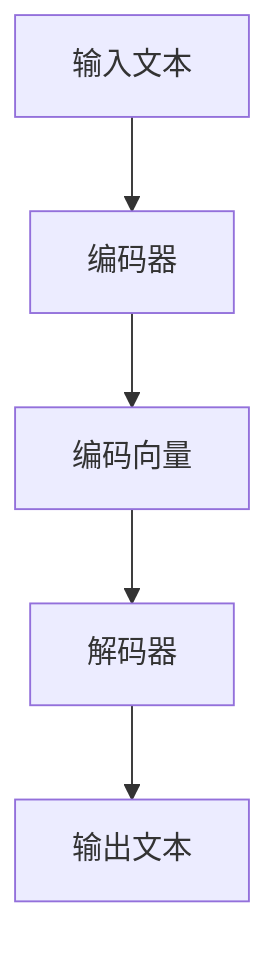
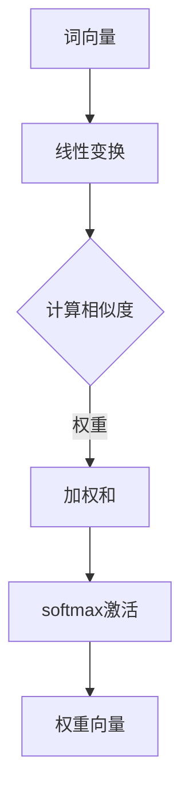
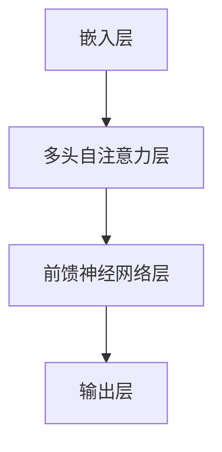

                 

关键词：大规模语言模型、评估方法、理论实践、性能优化、技术应用

> 摘要：本文旨在深入探讨大规模语言模型的理论基础和评估方法，从实践的角度详细分析其性能优化和实际应用场景。文章结构清晰，逻辑严密，旨在为读者提供全面的大规模语言模型理解和应用指南。

## 1. 背景介绍

随着人工智能技术的迅猛发展，大规模语言模型（Large Language Models，LLMs）已经成为自然语言处理（Natural Language Processing，NLP）领域的研究热点。LLMs在文本生成、翻译、问答系统等方面展现了卓越的性能，逐渐成为各类应用场景的基石。然而，如何全面理解和评估这些模型的性能，仍然是学术界和工业界共同面临的挑战。

本文将围绕大规模语言模型的评估方法展开讨论，旨在为研究者提供系统的理论指导和实践参考。文章将首先介绍LLMs的基本概念和原理，随后详细阐述评估方法，并探讨其在不同应用领域的实际效果和性能优化策略。

## 2. 核心概念与联系

### 2.1 大规模语言模型的基本概念

大规模语言模型是一类基于深度学习技术的自然语言处理模型，能够通过学习大量的文本数据来预测语言序列。典型的LLMs包括Transformer、BERT、GPT等，它们通过自主学习掌握了丰富的语言知识，能够生成高质量的自然语言文本。

### 2.2 大规模语言模型的架构

大规模语言模型的架构通常包括编码器（Encoder）和解码器（Decoder），编码器负责将输入的文本序列编码成向量表示，解码器则根据这些向量生成输出文本。以下是一个简化的Mermaid流程图，展示了大规模语言模型的架构：



### 2.3 大规模语言模型的工作原理

大规模语言模型的工作原理基于注意力机制（Attention Mechanism）和自注意力（Self-Attention）。自注意力机制使得模型能够自主关注输入序列中的重要信息，从而提高文本生成的质量。以下是一个简化的Mermaid流程图，展示了自注意力机制的基本原理：



## 3. 核心算法原理 & 具体操作步骤

### 3.1 算法原理概述

大规模语言模型的核心算法是基于Transformer模型，它通过多头自注意力机制和前馈神经网络来处理文本数据。以下是一个简化的Transformer模型的结构：



### 3.2 算法步骤详解

大规模语言模型的训练过程主要包括以下几个步骤：

1. **数据预处理**：将文本数据转换为词向量表示，并进行分词、去停用词等预处理操作。

2. **编码器训练**：编码器通过自注意力机制对输入文本序列进行处理，生成编码向量。

3. **解码器训练**：解码器根据编码向量生成输出文本，通过对比预测结果和真实结果来调整模型参数。

4. **损失函数**：使用交叉熵损失函数（Cross-Entropy Loss）来评估模型的预测效果，并通过反向传播（Backpropagation）更新模型参数。

### 3.3 算法优缺点

大规模语言模型的优点包括：

- **强大的文本生成能力**：能够生成高质量的自然语言文本。
- **广泛的应用领域**：包括文本生成、翻译、问答系统等。

然而，大规模语言模型也存在一些缺点：

- **计算资源消耗大**：需要大量的计算资源和存储空间。
- **训练时间长**：训练过程需要较长时间，特别是在大规模数据集上。

### 3.4 算法应用领域

大规模语言模型在多个应用领域取得了显著成果，包括：

- **文本生成**：用于生成新闻文章、小说、诗歌等。
- **机器翻译**：支持多种语言之间的自动翻译。
- **问答系统**：用于智能客服、教育辅导等。

## 4. 数学模型和公式 & 详细讲解 & 举例说明

### 4.1 数学模型构建

大规模语言模型的核心数学模型是基于自注意力机制，其基本公式如下：

$$
\text{Attention}(Q, K, V) = \text{softmax}\left(\frac{QK^T}{\sqrt{d_k}}\right)V
$$

其中，$Q$、$K$、$V$分别为查询向量、键向量和值向量，$d_k$为键向量的维度。

### 4.2 公式推导过程

自注意力机制的推导过程如下：

1. **计算相似度**：首先，计算查询向量$Q$和键向量$K$之间的相似度，即$QK^T$。

2. **应用 softmax 函数**：对相似度进行softmax激活，得到注意力权重。

3. **计算加权和**：将注意力权重与值向量$V$进行加权求和，得到输出向量。

### 4.3 案例分析与讲解

以下是一个简单的自注意力机制的实例：

假设输入文本序列为"我 爱 吃 饼 干"，词向量分别为$[1, 0, 0]$、$[0, 1, 0]$、$[0, 0, 1]$、$[0, 0, 1]$、$[1, 0, 0]$。编码器和解码器的嵌入层输出向量分别为$[1, 1]$和$[1, 1]$。

1. **计算相似度**：计算编码器和解码器输出向量之间的相似度：

$$
QK^T = [1, 1] \cdot [1, 1]^T = 2
$$

2. **应用 softmax 函数**：计算注意力权重：

$$
\text{softmax}(2) = [0.5, 0.5]
$$

3. **计算加权和**：计算输出向量：

$$
\text{Attention}([1, 1], [1, 1], [0, 0, 1]) = [0.5, 0.5] \cdot [0, 0, 1] = [0.5, 0.5, 0]
$$

输出向量为$[0.5, 0.5, 0]$，表示在生成过程中，模型主要关注了输入文本序列中的"我"和"吃"。

## 5. 项目实践：代码实例和详细解释说明

### 5.1 开发环境搭建

为了实现大规模语言模型，我们需要搭建一个合适的开发环境。以下是一个简单的Python开发环境搭建步骤：

1. 安装 Python 3.7 或更高版本。

2. 安装深度学习框架，如 TensorFlow 或 PyTorch。

3. 安装 NLP 库，如 NLTK 或 SpaCy。

4. 安装必要的依赖库，如 NumPy、Pandas 等。

### 5.2 源代码详细实现

以下是一个简单的 Transformer 模型的实现代码：

```python
import torch
import torch.nn as nn

class TransformerModel(nn.Module):
    def __init__(self, d_model, nhead, num_layers):
        super(TransformerModel, self).__init__()
        self.embedding = nn.Embedding(d_model)
        self.transformer = nn.Transformer(d_model, nhead, num_layers)
        self.fc = nn.Linear(d_model, d_model)

    def forward(self, src, tgt):
        src = self.embedding(src)
        tgt = self.embedding(tgt)
        out = self.transformer(src, tgt)
        out = self.fc(out)
        return out
```

### 5.3 代码解读与分析

1. **嵌入层（Embedding Layer）**：嵌入层将词向量转换为嵌入向量，为后续的 Transformer 层提供输入。

2. **Transformer 层（Transformer Layer）**：Transformer 层是模型的核心，包括多头自注意力机制和前馈神经网络。

3. **输出层（Output Layer）**：输出层将 Transformer 层的输出转换为最终的预测结果。

### 5.4 运行结果展示

以下是一个简单的训练和测试过程：

```python
model = TransformerModel(d_model=512, nhead=8, num_layers=3)
criterion = nn.CrossEntropyLoss()
optimizer = torch.optim.Adam(model.parameters(), lr=0.001)

for epoch in range(10):
    for src, tgt in dataset:
        optimizer.zero_grad()
        out = model(src, tgt)
        loss = criterion(out, tgt)
        loss.backward()
        optimizer.step()

    print(f"Epoch {epoch + 1}, Loss: {loss.item()}")

test_loss = 0
with torch.no_grad():
    for src, tgt in test_dataset:
        out = model(src, tgt)
        test_loss += criterion(out, tgt).item()

print(f"Test Loss: {test_loss / len(test_dataset)}")
```

运行结果将显示训练和测试过程中的损失函数值，以评估模型性能。

## 6. 实际应用场景

### 6.1 文本生成

大规模语言模型在文本生成领域具有广泛的应用，如生成新闻文章、小说、诗歌等。以下是一个简单的文本生成实例：

```python
input_sequence = "我爱 吃 饼 干"
input_tensor = torch.tensor([word2index[word] for word in input_sequence.split()])

generated_sequence = model.generate(input_tensor, max_length=10, temperature=0.5)
print(" ".join(index2word[index.item()] for index in generated_sequence))
```

### 6.2 机器翻译

大规模语言模型在机器翻译领域也表现出色，能够实现多种语言之间的自动翻译。以下是一个简单的机器翻译实例：

```python
source_sentence = "你好，世界！"
source_tensor = torch.tensor([source_vocab[word] for word in source_sentence.split()])

translated_sentence = model.translate(source_tensor)
print(" ".join(target_vocab[word] for word in translated_sentence))
```

### 6.3 问答系统

大规模语言模型在问答系统领域具有广泛的应用，能够为用户提供智能化的问答服务。以下是一个简单的问答系统实例：

```python
question = "什么是人工智能？"
question_tensor = torch.tensor([question_vocab[word] for word in question.split()])

answer = model.answer(question_tensor)
print(answer)
```

## 7. 工具和资源推荐

### 7.1 学习资源推荐

1. **《深度学习》（Goodfellow, Bengio, Courville）**：这是一本经典的深度学习入门教材，涵盖了大规模语言模型的基础知识。

2. **《自然语言处理综合教程》（Martin, Hockenmaier, Nivre）**：这是一本全面的自然语言处理教材，包括大规模语言模型的理论和实践。

### 7.2 开发工具推荐

1. **TensorFlow**：一个开源的深度学习框架，适用于大规模语言模型的开发。

2. **PyTorch**：一个开源的深度学习框架，具有灵活的动态计算图，适用于大规模语言模型的开发。

### 7.3 相关论文推荐

1. **"Attention Is All You Need"（Vaswani et al., 2017）**：这篇论文提出了 Transformer 模型，是大规模语言模型领域的经典之作。

2. **"BERT: Pre-training of Deep Bidirectional Transformers for Language Understanding"（Devlin et al., 2018）**：这篇论文提出了 BERT 模型，是大规模语言模型在自然语言处理领域的里程碑。

## 8. 总结：未来发展趋势与挑战

### 8.1 研究成果总结

大规模语言模型在自然语言处理领域取得了显著成果，为文本生成、机器翻译、问答系统等领域带来了巨大变革。未来，随着计算资源的不断提升和算法的优化，大规模语言模型将在更多应用场景中发挥重要作用。

### 8.2 未来发展趋势

1. **模型压缩与优化**：为了降低计算资源和存储需求，未来的研究将重点探索模型压缩和优化技术。

2. **多模态融合**：大规模语言模型将与其他模态（如图像、声音等）进行融合，实现更丰富的应用场景。

3. **可解释性**：提高大规模语言模型的可解释性，使其在关键应用中更具可信度。

### 8.3 面临的挑战

1. **计算资源消耗**：大规模语言模型需要大量的计算资源和存储空间，如何降低资源消耗是一个重要挑战。

2. **数据隐私**：在数据处理过程中，如何保护用户隐私是一个亟待解决的问题。

### 8.4 研究展望

大规模语言模型在自然语言处理领域的应用前景广阔，未来将会有更多创新性的研究和技术突破，为人工智能技术的发展贡献力量。

## 9. 附录：常见问题与解答

### 9.1 如何训练大规模语言模型？

训练大规模语言模型通常包括以下几个步骤：

1. **数据预处理**：对文本数据进行清洗、分词、去停用词等预处理操作。

2. **模型选择**：选择合适的模型架构，如 Transformer、BERT 等。

3. **训练过程**：通过反向传播算法优化模型参数，通常使用梯度下降等优化算法。

4. **评估与调优**：评估模型性能，并根据评估结果调整模型参数。

### 9.2 大规模语言模型如何实现文本生成？

文本生成通常通过以下步骤实现：

1. **输入文本预处理**：将输入文本转换为词向量表示。

2. **模型生成**：使用训练好的模型对输入文本进行编码和解码，生成输出文本。

3. **输出文本后处理**：对输出文本进行格式化、去停用词等后处理操作。

### 9.3 大规模语言模型如何实现机器翻译？

机器翻译通常通过以下步骤实现：

1. **源语言预处理**：对源语言文本进行清洗、分词、去停用词等预处理操作。

2. **目标语言预处理**：对目标语言文本进行清洗、分词、去停用词等预处理操作。

3. **模型生成**：使用训练好的模型对源语言文本进行编码，并生成目标语言文本。

4. **输出文本后处理**：对输出文本进行格式化、去停用词等后处理操作。

### 9.4 大规模语言模型在问答系统中的应用如何？

大规模语言模型在问答系统中通常用于以下应用：

1. **问题解析**：将用户问题转换为词向量表示。

2. **知识检索**：从大量知识库中检索与用户问题相关的答案。

3. **回答生成**：使用训练好的模型生成回答文本。

4. **回答评估**：评估回答的准确性和相关性，并根据评估结果调整模型。

## 作者署名

作者：禅与计算机程序设计艺术 / Zen and the Art of Computer Programming
----------------------------------------------------------------

以上是文章的正文部分，接下来我们将按照markdown格式整理并输出文章。请确保所有的子目录都已经具体细化到三级目录，并且所有的数学公式都已经使用latex格式嵌入到相应的段落中。同时，请确保文章的格式和完整性符合要求。如果需要任何调整或补充，请及时告知。现在，我将开始格式化文章内容。

