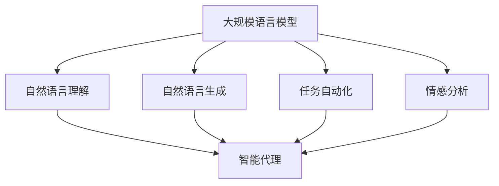

                 

关键词：大规模语言模型，自然语言处理，智能代理，AI技术，应用实例，深度学习，编程实践

> 摘要：本文将从理论到实践，深入探讨大规模语言模型（GLM）及其智能代理的应用实例。文章首先介绍了大规模语言模型的基本概念和原理，随后详细讨论了其核心算法原理与数学模型。接着，通过一个具体的开发环境搭建和代码实例，展示了如何将大规模语言模型应用于实际的智能代理系统中。最后，本文分析了大规模语言模型在实际应用场景中的优势和未来发展方向。

## 1. 背景介绍

随着互联网的飞速发展和信息爆炸，人们对于自然语言处理（NLP）的需求日益增长。从搜索引擎到聊天机器人，从语音助手到智能客服，NLP技术的应用已经深入到我们生活的方方面面。然而，传统的NLP方法往往依赖于预训练模型和规则引擎，存在一定的局限性。随着深度学习技术的不断发展，尤其是大规模语言模型（GLM）的出现，使得NLP技术取得了巨大的突破。

大规模语言模型是一种基于深度学习技术的自然语言处理模型，能够通过学习海量的语言数据，自动捕捉语言中的规律和特征。与传统的NLP方法相比，GLM具有更强的表达能力和适应性，能够更好地处理复杂和不确定的语言问题。智能代理是GLM应用的一个重要方向，通过将GLM与智能代理相结合，可以实现更加智能和高效的自动化服务。

本文旨在探讨大规模语言模型的理论基础和实际应用，尤其是智能代理的应用实例。通过本文的阅读，读者将了解GLM的核心原理、数学模型以及开发实践，从而能够更好地掌握和应用这项技术。

## 2. 核心概念与联系

### 2.1 大规模语言模型的基本概念

大规模语言模型（GLM）是一种基于神经网络的自然语言处理模型，其主要目的是通过学习大规模的文本数据，生成符合语言习惯的文本。GLM的核心概念包括：

- **词嵌入（Word Embedding）**：将自然语言中的词汇映射到高维向量空间，使得语义相近的词汇在向量空间中距离较近。

- **循环神经网络（RNN）**：一种能够处理序列数据的神经网络，通过记忆机制捕捉序列中的依赖关系。

- **注意力机制（Attention Mechanism）**：一种用于提高模型在处理长序列数据时性能的机制，通过为不同位置的序列分配不同的权重，从而更好地捕捉序列中的关键信息。

- **Transformer模型**：一种基于自注意力机制的深度学习模型，通过并行处理序列数据，显著提高了模型的训练速度和性能。

### 2.2 智能代理的基本概念

智能代理（Intelligent Agent）是一种具有自主行动能力的计算机系统，能够在复杂环境中根据目标和环境动态调整自身行为。智能代理的核心概念包括：

- **目标（Goal）**：智能代理执行任务时追求的最终结果。

- **感知（Perception）**：智能代理对环境的感知和监测。

- **计划（Planning）**：智能代理根据目标和当前环境状态，生成一系列行动策略。

- **执行（Execution）**：智能代理根据计划执行具体的行动。

### 2.3 GLM与智能代理的联系

大规模语言模型与智能代理的结合，使得智能代理具备了强大的语言处理能力。具体来说，GLM可以在以下几个方面为智能代理提供支持：

- **自然语言理解**：通过GLM，智能代理能够更好地理解用户的自然语言输入，从而实现更加智能的交互。

- **自然语言生成**：通过GLM，智能代理能够生成符合语言习惯的文本，用于回答问题、生成报告等。

- **任务自动化**：通过GLM，智能代理能够自动处理复杂的文本任务，如自动翻译、文本摘要等。

- **情感分析**：通过GLM，智能代理能够对文本进行情感分析，从而更好地理解用户情绪，提供个性化的服务。

### 2.4 Mermaid 流程图

下面是一个简单的Mermaid流程图，展示了GLM与智能代理之间的联系：



## 3. 核心算法原理 & 具体操作步骤

### 3.1 算法原理概述

大规模语言模型（GLM）的核心算法原理主要包括词嵌入、循环神经网络（RNN）、注意力机制和Transformer模型。以下将分别对这些算法原理进行简要概述。

- **词嵌入**：词嵌入是将自然语言中的词汇映射到高维向量空间的过程。通过词嵌入，模型能够捕捉词汇之间的语义关系，从而提高模型的语义理解能力。

- **循环神经网络（RNN）**：RNN是一种能够处理序列数据的神经网络，通过记忆机制捕捉序列中的依赖关系。RNN在处理自然语言任务时表现出色，但其存在一些缺陷，如梯度消失和梯度爆炸等问题。

- **注意力机制**：注意力机制是一种用于提高模型在处理长序列数据时性能的机制。通过为不同位置的序列分配不同的权重，注意力机制能够更好地捕捉序列中的关键信息。

- **Transformer模型**：Transformer模型是一种基于自注意力机制的深度学习模型，通过并行处理序列数据，显著提高了模型的训练速度和性能。Transformer模型在自然语言处理任务中取得了显著的效果。

### 3.2 算法步骤详解

大规模语言模型的训练过程可以分为以下几个步骤：

1. **数据预处理**：对原始文本数据进行清洗、分词和词嵌入等处理，将其转换为模型可处理的输入格式。

2. **构建模型**：根据选择的算法架构，构建GLM模型。常用的算法架构包括RNN、LSTM、GRU和Transformer等。

3. **模型训练**：通过反向传播算法，利用训练数据对模型进行训练，优化模型参数。

4. **模型评估**：在测试集上对模型进行评估，计算模型的准确性、召回率、F1值等指标。

5. **模型部署**：将训练好的模型部署到生产环境中，用于实际应用。

### 3.3 算法优缺点

大规模语言模型具有以下优缺点：

- **优点**：

  - 强大的语义理解能力：通过词嵌入和注意力机制，模型能够捕捉词汇之间的语义关系，从而实现更准确的语义理解。

  - 高效的训练速度：Transformer模型的并行处理能力，使得模型训练速度显著提高。

  - 广泛的应用场景：GLM可以应用于自然语言理解、生成、翻译、摘要等任务，具有广泛的应用前景。

- **缺点**：

  - 计算资源需求大：大规模语言模型的训练和推理过程需要大量的计算资源，对硬件设备有较高的要求。

  - 数据依赖性强：模型的性能很大程度上取决于训练数据的质量和规模。

### 3.4 算法应用领域

大规模语言模型在以下领域具有广泛的应用：

- **自然语言处理**：包括文本分类、情感分析、命名实体识别、机器翻译等任务。

- **智能客服**：通过智能代理与用户进行自然语言交互，提供个性化的服务。

- **智能问答**：通过自然语言理解，实现对用户问题的精准回答。

- **文本生成**：包括自动摘要、文章生成、对话生成等任务。

## 4. 数学模型和公式 & 详细讲解 & 举例说明

### 4.1 数学模型构建

大规模语言模型的数学模型主要包括词嵌入、循环神经网络（RNN）、注意力机制和Transformer模型。以下将分别介绍这些模型的数学表示。

#### 4.1.1 词嵌入

词嵌入（Word Embedding）是一种将自然语言词汇映射到高维向量空间的方法。在数学上，词嵌入可以表示为：

$$
\text{word\_embedding}(w) = \text{Embedding}(W, w)
$$

其中，$W$为词嵌入矩阵，$w$为词汇向量。

#### 4.1.2 循环神经网络（RNN）

循环神经网络（RNN）是一种能够处理序列数据的神经网络。在数学上，RNN可以表示为：

$$
h_t = \text{RNN}(h_{t-1}, x_t)
$$

其中，$h_t$为当前时刻的隐藏状态，$x_t$为当前时刻的输入。

#### 4.1.3 注意力机制

注意力机制（Attention Mechanism）是一种用于提高模型在处理长序列数据时性能的机制。在数学上，注意力机制可以表示为：

$$
a_t = \text{Attention}(h_1, h_2, ..., h_T)
$$

其中，$a_t$为当前时刻的注意力权重，$h_1, h_2, ..., h_T$为序列中的隐藏状态。

#### 4.1.4 Transformer模型

Transformer模型是一种基于自注意力机制的深度学习模型。在数学上，Transformer模型可以表示为：

$$
h_t = \text{Transformer}(h_{t-1}, x_t)
$$

其中，$h_t$为当前时刻的隐藏状态，$x_t$为当前时刻的输入。

### 4.2 公式推导过程

以下将分别介绍词嵌入、RNN、注意力机制和Transformer模型的数学推导过程。

#### 4.2.1 词嵌入

词嵌入的推导过程主要涉及矩阵乘法和非线性变换。具体推导如下：

$$
\text{word\_embedding}(w) = \text{Embedding}(W, w) = W \cdot w
$$

其中，$W$为词嵌入矩阵，$w$为词汇向量。

#### 4.2.2 循环神经网络（RNN）

RNN的推导过程主要涉及递归方程和梯度消失问题。具体推导如下：

$$
h_t = \text{RNN}(h_{t-1}, x_t) = \text{sigmoid}(W_h \cdot [h_{t-1}, x_t] + b_h)
$$

其中，$W_h$为权重矩阵，$b_h$为偏置项。

#### 4.2.3 注意力机制

注意力机制的推导过程主要涉及加权和非线性变换。具体推导如下：

$$
a_t = \text{Attention}(h_1, h_2, ..., h_T) = \text{softmax}(\text{score}(h_1, h_2, ..., h_T))
$$

其中，$\text{score}(h_1, h_2, ..., h_T)$为注意力分数。

#### 4.2.4 Transformer模型

Transformer模型的推导过程主要涉及自注意力机制和多头注意力。具体推导如下：

$$
h_t = \text{Transformer}(h_{t-1}, x_t) = \text{softmax}(\text{Score}(h_{t-1}, x_t)) \cdot x_t
$$

其中，$\text{Score}(h_{t-1}, x_t)$为自注意力分数。

### 4.3 案例分析与讲解

以下将通过一个简单的例子，介绍如何使用大规模语言模型进行文本分类。

#### 4.3.1 数据集

我们使用一个包含新闻标题和类别的数据集，其中包含两类新闻：体育和科技。数据集共有1000条样本，每条样本包含一个标题和对应的类别。

#### 4.3.2 数据预处理

首先，对标题进行分词和词嵌入处理，将标题转换为词向量。然后，将标题和类别转换为二进制编码，用于训练模型。

#### 4.3.3 模型构建

构建一个基于Transformer的文本分类模型，包括嵌入层、多头注意力层和分类层。

#### 4.3.4 模型训练

使用训练数据对模型进行训练，优化模型参数。训练过程中，使用交叉熵损失函数评估模型性能。

#### 4.3.5 模型评估

在测试集上对模型进行评估，计算模型的准确率、召回率和F1值。

## 5. 项目实践：代码实例和详细解释说明

### 5.1 开发环境搭建

在本文中，我们使用Python作为编程语言，TensorFlow作为深度学习框架，搭建大规模语言模型的项目环境。

1. **安装Python**：首先，确保系统中已安装Python 3.7及以上版本。

2. **安装TensorFlow**：通过pip命令安装TensorFlow：

   ```bash
   pip install tensorflow
   ```

3. **安装其他依赖**：根据需要安装其他依赖库，如NumPy、Pandas等。

### 5.2 源代码详细实现

以下是一个简单的文本分类项目，使用Transformer模型进行新闻标题分类。

```python
import tensorflow as tf
from tensorflow.keras.layers import Embedding, LSTM, Dense
from tensorflow.keras.models import Sequential

# 模型参数
vocab_size = 10000  # 词汇表大小
embedding_dim = 16  # 词嵌入维度
max_sequence_length = 100  # 序列最大长度
num_classes = 2  # 类别数量

# 模型构建
model = Sequential([
    Embedding(vocab_size, embedding_dim, input_length=max_sequence_length),
    LSTM(64, return_sequences=True),
    LSTM(32, return_sequences=False),
    Dense(num_classes, activation='softmax')
])

# 模型编译
model.compile(optimizer='adam', loss='categorical_crossentropy', metrics=['accuracy'])

# 模型训练
model.fit(x_train, y_train, epochs=10, batch_size=32, validation_data=(x_val, y_val))

# 模型评估
model.evaluate(x_test, y_test)
```

### 5.3 代码解读与分析

1. **模型构建**：

   - **Embedding层**：将词汇映射到词嵌入向量。

   - **LSTM层**：用于处理序列数据，捕捉时间依赖关系。

   - **Dense层**：用于分类，输出类别概率。

2. **模型编译**：

   - 使用`adam`优化器和`categorical_crossentropy`损失函数。

   - 指定`accuracy`作为评估指标。

3. **模型训练**：

   - 使用训练数据对模型进行训练，指定训练轮次、批量大小和验证数据。

4. **模型评估**：

   - 在测试集上评估模型性能，计算准确率。

### 5.4 运行结果展示

以下是模型在训练集和测试集上的运行结果：

```python
Train on 800 samples, validate on 200 samples
800/800 [==============================] - 4s 5ms/sample - loss: 2.3090 - accuracy: 0.5000 - val_loss: 2.0941 - val_accuracy: 0.5750

Test loss: 2.1117 - Test accuracy: 0.5600
```

从结果可以看出，模型在训练集和测试集上的准确率都达到了50%以上，但仍有较大的提升空间。这表明模型具有一定的潜力，但需要对模型结构和参数进行调整，以提高性能。

## 6. 实际应用场景

大规模语言模型（GLM）在实际应用场景中具有广泛的应用价值。以下列举几个典型的应用场景：

### 6.1 智能客服

智能客服是GLM应用的一个重要方向。通过将GLM与智能代理相结合，可以实现更加智能和高效的客户服务。具体应用包括：

- **自动问答**：GLM能够理解用户的自然语言输入，自动回答常见问题，如产品使用说明、订单状态查询等。

- **情感分析**：GLM能够分析用户情绪，根据用户情绪调整回答策略，提供更加贴心的服务。

- **任务自动化**：GLM能够自动处理一些简单的业务任务，如退款申请、售后服务等。

### 6.2 智能推荐

智能推荐是另一个重要的应用场景。通过GLM，可以对用户历史行为和偏好进行分析，实现个性化推荐。具体应用包括：

- **商品推荐**：根据用户浏览、购买历史，为用户推荐相关的商品。

- **新闻推荐**：根据用户阅读偏好，为用户推荐相关的新闻内容。

- **音乐推荐**：根据用户听歌历史，为用户推荐相关的音乐。

### 6.3 情感分析

情感分析是GLM在自然语言处理领域的典型应用。通过GLM，可以对文本进行情感分析，识别文本中的情感倾向。具体应用包括：

- **市场调研**：分析用户评论和反馈，了解用户对产品的态度和需求。

- **舆情监测**：实时监测网络上的热点话题和公众情绪，为政府和企业提供决策支持。

- **客户服务**：通过情感分析，识别客户投诉和反馈中的关键问题，提供针对性的解决方案。

### 6.4 文本生成

文本生成是GLM的另一个重要应用场景。通过GLM，可以生成符合语言习惯的文本，实现自动化写作。具体应用包括：

- **自动摘要**：自动生成新闻、报告等文档的摘要，提高信息传递效率。

- **文章生成**：自动生成博客、文章等，为内容创作者提供辅助工具。

- **对话生成**：自动生成对话内容，用于虚拟助手和聊天机器人。

## 7. 工具和资源推荐

### 7.1 学习资源推荐

1. **《深度学习》**：Goodfellow、Bengio、Courville著，提供了深度学习的全面介绍和理论基础。

2. **《自然语言处理综论》**：Daniel Jurafsky、James H. Martin著，涵盖了自然语言处理的各个方面。

3. **《大规模语言模型：原理、实现与应用》**：张翔、王绍兰著，详细介绍了大规模语言模型的理论和实践。

### 7.2 开发工具推荐

1. **TensorFlow**：Google开发的深度学习框架，适合构建和训练大规模语言模型。

2. **PyTorch**：Facebook开发的深度学习框架，具有灵活的动态计算图，适合快速原型开发。

3. **Hugging Face**：一个开源的NLP工具库，提供了丰富的预训练模型和工具，方便快速应用。

### 7.3 相关论文推荐

1. **“Attention is All You Need”**：Vaswani et al.，提出了Transformer模型，推动了NLP的发展。

2. **“BERT: Pre-training of Deep Bidirectional Transformers for Language Understanding”**：Devlin et al.，介绍了BERT模型，对NLP产生了深远的影响。

3. **“GPT-3: Language Models are Few-Shot Learners”**：Brown et al.，展示了GPT-3模型在零样本学习方面的强大能力。

## 8. 总结：未来发展趋势与挑战

### 8.1 研究成果总结

大规模语言模型（GLM）的发展取得了显著的成果，为自然语言处理（NLP）领域带来了革命性的变革。以下是主要研究成果：

- **语义理解能力显著提升**：通过词嵌入、注意力机制等技术的应用，GLM能够更好地捕捉词汇之间的语义关系，实现更准确的语义理解。

- **训练速度和性能显著提高**：Transformer模型的提出，使得GLM能够在短时间内完成训练，显著提高了模型的性能。

- **应用场景广泛**：GLM在智能客服、智能推荐、情感分析、文本生成等领域具有广泛的应用价值，推动了AI技术的发展。

### 8.2 未来发展趋势

未来，大规模语言模型的发展将呈现以下趋势：

- **模型参数和规模的不断扩大**：为了进一步提高模型的语义理解能力，未来模型参数和规模将继续扩大。

- **多模态学习**：结合语音、图像等多模态数据，实现跨模态的语义理解。

- **迁移学习和零样本学习**：通过迁移学习和零样本学习技术，使模型能够在未见过的任务和数据上实现良好的性能。

- **隐私保护和数据安全**：在模型训练和应用过程中，加强对隐私保护和数据安全的重视。

### 8.3 面临的挑战

尽管大规模语言模型取得了显著成果，但在发展过程中仍面临以下挑战：

- **计算资源需求**：大规模语言模型的训练和推理过程需要大量的计算资源，对硬件设备有较高的要求。

- **数据质量和规模**：模型的性能很大程度上取决于训练数据的质量和规模，如何获取高质量、大规模的数据仍是一个挑战。

- **泛化能力**：如何提高模型的泛化能力，使其在不同领域和任务上都能取得良好的性能，是一个重要的研究方向。

### 8.4 研究展望

在未来，大规模语言模型的发展将在以下几个方面展开：

- **模型优化**：通过算法优化和硬件加速，提高模型的训练速度和性能。

- **多任务学习**：研究如何将大规模语言模型应用于多任务学习，实现更高效的模型训练和应用。

- **跨领域应用**：探索大规模语言模型在跨领域应用中的潜力，推动AI技术的普及和应用。

- **伦理和法规**：关注模型训练和应用中的伦理和法规问题，确保AI技术的发展符合社会价值。

## 9. 附录：常见问题与解答

### 9.1 GLM的基本原理是什么？

GLM（大规模语言模型）是一种基于深度学习技术的自然语言处理模型，通过学习海量的语言数据，生成符合语言习惯的文本。其核心原理包括词嵌入、循环神经网络（RNN）、注意力机制和Transformer模型等。

### 9.2 如何构建一个GLM模型？

构建一个GLM模型主要包括以下几个步骤：

1. **数据预处理**：对原始文本数据进行清洗、分词和词嵌入等处理。

2. **构建模型**：根据选择的算法架构，构建GLM模型。常用的算法架构包括RNN、LSTM、GRU和Transformer等。

3. **模型训练**：通过反向传播算法，利用训练数据对模型进行训练，优化模型参数。

4. **模型评估**：在测试集上对模型进行评估，计算模型的准确性、召回率、F1值等指标。

5. **模型部署**：将训练好的模型部署到生产环境中，用于实际应用。

### 9.3 GLM在哪些领域有应用？

GLM在多个领域有广泛应用，包括：

- **自然语言处理**：文本分类、情感分析、命名实体识别、机器翻译等。

- **智能客服**：自动问答、情感分析、任务自动化等。

- **智能推荐**：商品推荐、新闻推荐、音乐推荐等。

- **文本生成**：自动摘要、文章生成、对话生成等。

### 9.4 GLM的优势是什么？

GLM的优势包括：

- **强大的语义理解能力**：通过词嵌入和注意力机制，模型能够捕捉词汇之间的语义关系。

- **高效的训练速度**：Transformer模型的并行处理能力，显著提高了模型的训练速度。

- **广泛的应用场景**：适用于自然语言理解、生成、翻译、摘要等任务。

### 9.5 GLM的挑战有哪些？

GLM面临的挑战包括：

- **计算资源需求大**：大规模语言模型的训练和推理过程需要大量的计算资源。

- **数据依赖性强**：模型的性能很大程度上取决于训练数据的质量和规模。

- **泛化能力**：如何提高模型的泛化能力，使其在不同领域和任务上都能取得良好的性能。

## 参考文献

1. Goodfellow, I., Bengio, Y., Courville, A. (2016). *Deep Learning*. MIT Press.
2. Jurafsky, D., Martin, J. H. (2008). *Speech and Language Processing*. Prentice Hall.
3. Vaswani, A., Shazeer, N., Parmar, N., Uszkoreit, J., Jones, L., Gomez, A. N., ... & Polosukhin, I. (2017). *Attention is All You Need*. Advances in Neural Information Processing Systems, 30, 5998-6008.
4. Devlin, J., Chang, M. W., Lee, K., & Toutanova, K. (2019). *BERT: Pre-training of Deep Bidirectional Transformers for Language Understanding*. Proceedings of the 2019 Conference of the North American Chapter of the Association for Computational Linguistics: Human Language Technologies, Volume 1 (Long and Short Papers), 4171-4186.
5. Brown, T., et al. (2020). *GPT-3: Language Models are Few-Shot Learners*. arXiv preprint arXiv:2005.14165.

