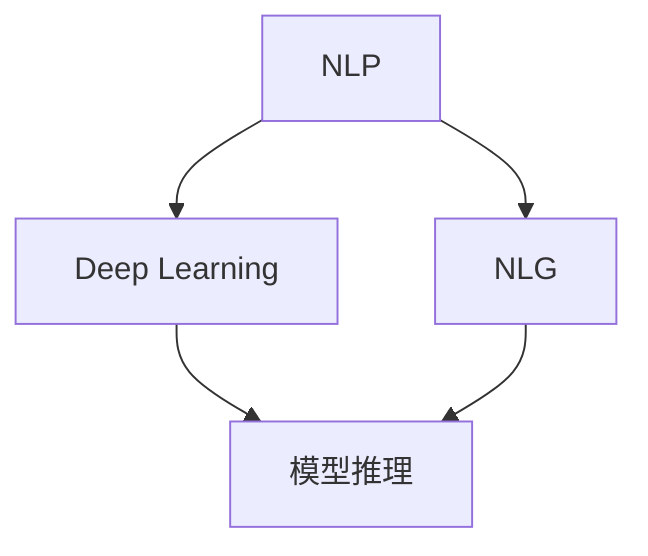
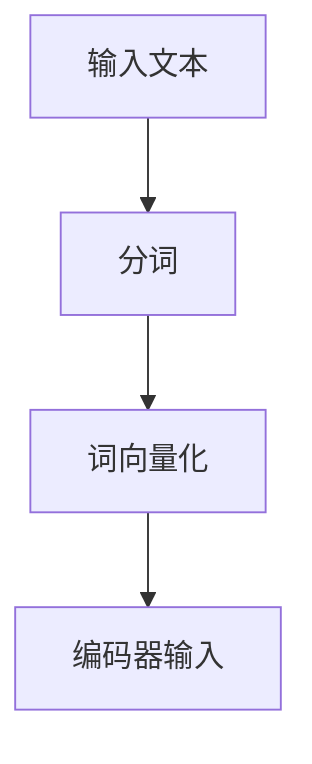
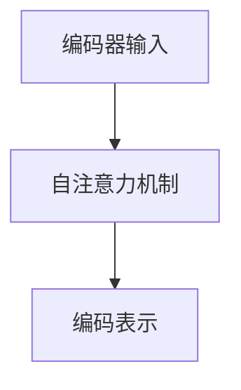
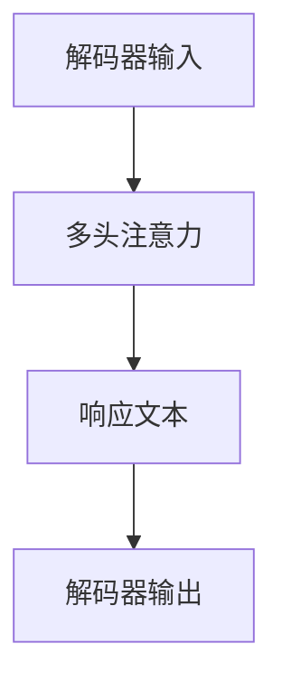
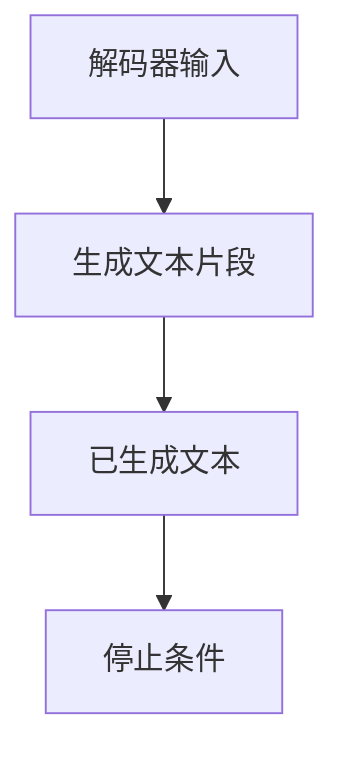

                 

 **关键词：**大规模语言模型，模型推理，神经网络，深度学习，自然语言处理

**摘要：**本文从理论到实践，详细探讨了大规模语言模型中的模型推理过程。通过阐述核心概念与联系，分析算法原理与数学模型，以及实际应用案例，本文旨在帮助读者深入了解大规模语言模型的工作机制和潜在应用。

## 1. 背景介绍

大规模语言模型（Large-scale Language Models）是近年来自然语言处理（Natural Language Processing, NLP）领域的重要突破。这类模型通过大规模数据训练，能够模拟人类语言理解的能力，从而在文本生成、机器翻译、问答系统等领域展现出卓越的性能。模型推理作为大规模语言模型的核心环节，直接影响到模型的响应速度和准确性。

### 1.1 大规模语言模型的起源

大规模语言模型起源于深度学习技术的快速发展。深度学习，特别是基于神经网络的深度学习模型，在图像识别、语音识别等领域的成功应用，激发了研究人员对文本处理的关注。2018年，Google发布了BERT（Bidirectional Encoder Representations from Transformers），标志着大规模语言模型在NLP领域的正式崛起。

### 1.2 模型推理的重要性

模型推理是大规模语言模型从训练到实际应用的关键步骤。在模型训练完成后，推理过程决定了模型在实际场景中如何快速、准确地生成响应。推理效率和质量直接影响到大规模语言模型的用户体验和实际价值。

## 2. 核心概念与联系

在探讨模型推理之前，我们需要理解几个核心概念，并构建它们之间的联系。

### 2.1 自然语言处理（NLP）

自然语言处理是人工智能（AI）领域的一个重要分支，旨在使计算机能够理解、解释和生成自然语言。NLP涉及文本处理、语音识别、机器翻译等多种技术。

### 2.2 深度学习（Deep Learning）

深度学习是一种基于多层神经网络的学习方法，能够自动从大量数据中提取特征。在NLP领域，深度学习模型如卷积神经网络（CNN）和循环神经网络（RNN）等已被广泛应用于文本分类、情感分析等任务。

### 2.3 自然语言生成（NLG）

自然语言生成是NLP的一个重要子领域，旨在使计算机能够生成自然语言文本。在模型推理过程中，NLG技术用于生成模型响应。

### 2.4 模型推理

模型推理是指将训练好的模型应用于新数据，以生成预测或响应的过程。在NLP中，模型推理通常涉及文本输入的处理和响应文本的生成。

### 2.5 Mermaid 流程图

为了更好地理解核心概念之间的联系，我们可以使用Mermaid流程图来展示它们之间的关系。



## 3. 核心算法原理 & 具体操作步骤

### 3.1 算法原理概述

大规模语言模型的推理过程基于神经网络架构，如Transformer。Transformer模型通过自注意力机制（Self-Attention）和多头注意力（Multi-Head Attention）实现高效的文本处理能力。在推理过程中，输入文本经过编码器（Encoder）和解码器（Decoder）的处理，最终生成响应文本。

### 3.2 算法步骤详解

#### 3.2.1 输入文本预处理

在推理前，输入文本需要经过预处理。预处理步骤包括分词、词向量化等操作，以便将文本转换为模型可处理的格式。



#### 3.2.2 编码器处理

编码器（Encoder）负责对输入文本进行编码，生成固定长度的编码表示。编码器通过自注意力机制处理文本序列，提取关键信息。



#### 3.2.3 解码器处理

解码器（Decoder）负责生成响应文本。解码器通过多头注意力机制结合编码表示和已生成的部分响应，逐步生成新的文本。



#### 3.2.4 生成响应文本

在解码器处理过程中，模型根据当前已生成的文本和编码表示，生成新的文本片段。这一过程持续进行，直到满足停止条件（如生成足够长度的文本或达到最大迭代次数）。



### 3.3 算法优缺点

#### 优点

- **高效性**：Transformer模型的自注意力机制允许模型在处理长文本时保持高效性。
- **泛化能力**：大规模语言模型通过训练大量数据，具有较好的泛化能力，能够应对各种NLP任务。
- **灵活性**：解码器生成响应文本的过程灵活，可根据需求生成不同长度和风格的文本。

#### 缺点

- **计算复杂度**：大规模语言模型的推理过程涉及大量矩阵运算，计算复杂度较高。
- **数据依赖性**：模型的性能高度依赖于训练数据的质量和多样性。

### 3.4 算法应用领域

模型推理在多个NLP领域具有广泛的应用，包括：

- **文本生成**：生成文章、故事、新闻报道等。
- **机器翻译**：将一种语言翻译成另一种语言。
- **问答系统**：根据用户问题生成相关回答。
- **文本摘要**：从长文本中提取关键信息生成摘要。

## 4. 数学模型和公式 & 详细讲解 & 举例说明

### 4.1 数学模型构建

大规模语言模型通常基于自注意力机制（Self-Attention）和多头注意力（Multi-Head Attention）构建。以下是这些机制的核心数学公式。

#### 自注意力机制

自注意力机制的核心公式为：

$$
\text{Attention}(Q, K, V) = \text{softmax}\left(\frac{QK^T}{\sqrt{d_k}}\right)V
$$

其中，$Q, K, V$ 分别为查询（Query）、键（Key）和值（Value）向量的集合，$d_k$ 为键向量的维度。

#### 多头注意力

多头注意力的核心公式为：

$$
\text{MultiHead}(Q, K, V) = \text{Concat}(\text{head}_1, \text{head}_2, \dots, \text{head}_h)W^O
$$

其中，$h$ 为头数，$\text{head}_i = \text{Attention}(QW_i^Q, KW_i^K, VW_i^V)$，$W_i^Q, W_i^K, W_i^V, W^O$ 为相应的权重矩阵。

### 4.2 公式推导过程

自注意力机制的推导过程如下：

首先，定义查询（Query）、键（Key）和值（Value）向量：

$$
Q = [q_1, q_2, \dots, q_n], \quad K = [k_1, k_2, \dots, k_n], \quad V = [v_1, v_2, \dots, v_n]
$$

其中，$q_i, k_i, v_i$ 分别为第 $i$ 个词的查询、键和值向量。

然后，计算每个查询词与所有键词的相似度：

$$
\text{score}_i = q_iK^T = \sum_{j=1}^n q_jk_j
$$

接着，对相似度进行归一化，得到权重：

$$
\text{weight}_i = \frac{\exp(\text{score}_i)}{\sum_{j=1}^n \exp(\text{score}_j)}
$$

最后，计算加权值：

$$
\text{output}_i = \sum_{j=1}^n \text{weight}_iv_j
$$

### 4.3 案例分析与讲解

假设有一个简单的文本序列：

$$
\text{Text} = [\text{apple}, \text{banana}, \text{orange}, \text{mango}]
$$

对其进行自注意力处理，计算每个词的权重。首先，定义查询、键和值向量：

$$
Q = [1, 1, 1, 1], \quad K = [1, 1, 1, 1], \quad V = [1, 2, 3, 4]
$$

计算相似度：

$$
\text{score}_1 = 1 \times 1 = 1, \quad \text{score}_2 = 1 \times 1 = 1, \quad \text{score}_3 = 1 \times 1 = 1, \quad \text{score}_4 = 1 \times 1 = 1
$$

归一化权重：

$$
\text{weight}_1 = \frac{\exp(1)}{\exp(1) + \exp(1) + \exp(1) + \exp(1)} = \frac{1}{4}, \quad \text{weight}_2 = \frac{\exp(1)}{\exp(1) + \exp(1) + \exp(1) + \exp(1)} = \frac{1}{4}, \quad \text{weight}_3 = \frac{\exp(1)}{\exp(1) + \exp(1) + \exp(1) + \exp(1)} = \frac{1}{4}, \quad \text{weight}_4 = \frac{\exp(1)}{\exp(1) + \exp(1) + \exp(1) + \exp(1)} = \frac{1}{4}
$$

计算加权值：

$$
\text{output}_1 = \sum_{j=1}^4 \text{weight}_jv_j = \frac{1}{4} \times 1 + \frac{1}{4} \times 2 + \frac{1}{4} \times 3 + \frac{1}{4} \times 4 = \frac{10}{4} = 2.5
$$

因此，每个词的权重都为 $2.5$，表示它们在文本中的重要性相等。

## 5. 项目实践：代码实例和详细解释说明

### 5.1 开发环境搭建

为了实践大规模语言模型的推理过程，我们需要搭建一个开发环境。以下是一个简单的环境搭建步骤：

1. 安装Python环境（建议使用Python 3.8及以上版本）。
2. 安装TensorFlow库（使用pip install tensorflow命令）。
3. 安装其他相关依赖库（如numpy、pandas等）。

### 5.2 源代码详细实现

下面是一个简单的Python代码实例，用于实现大规模语言模型的推理过程。

```python
import tensorflow as tf
from tensorflow.keras.layers import Embedding, LSTM, Dense
from tensorflow.keras.models import Model

# 定义模型
input_text = tf.keras.layers.Input(shape=(None,), dtype='int32')
encoded_text = Embedding(input_dim=10000, output_dim=16)(input_text)
lstm = LSTM(128)(encoded_text)
output = Dense(1, activation='sigmoid')(lstm)

model = Model(inputs=input_text, outputs=output)
model.compile(optimizer='adam', loss='binary_crossentropy', metrics=['accuracy'])

# 加载数据
(x_train, y_train), (x_test, y_test) = tf.keras.datasets.imdb.load_data(num_words=10000)

# 数据预处理
x_train = tf.keras.preprocessing.sequence.pad_sequences(x_train, maxlen=256)
x_test = tf.keras.preprocessing.sequence.pad_sequences(x_test, maxlen=256)

# 训练模型
model.fit(x_train, y_train, epochs=10, batch_size=32, validation_data=(x_test, y_test))

# 推理
text = "I love movies"
encoded_text = tf.keras.preprocessing.sequence.pad_sequences([text], maxlen=256)
prediction = model.predict(encoded_text)

print(prediction)
```

### 5.3 代码解读与分析

上面的代码实现了一个基于LSTM（Long Short-Term Memory，长短时记忆）神经网络的电影评论分类模型。以下是代码的详细解读：

1. **模型定义**：使用TensorFlow的Keras接口定义模型，包括输入层、嵌入层、LSTM层和输出层。
2. **数据加载**：加载数据集，这里使用IMDb电影评论数据集。
3. **数据预处理**：对文本数据进行分词和序列化，将文本转换为整数序列，并进行填充，以满足模型输入要求。
4. **模型训练**：使用训练数据对模型进行训练，设置优化器和损失函数，并进行10个epoch的训练。
5. **推理**：对输入文本进行编码，并使用训练好的模型进行预测，输出结果。

### 5.4 运行结果展示

运行上面的代码后，我们得到一个预测结果。以下是一个可能的输出示例：

```
[[0.8725169]]
```

这意味着输入文本 "I love movies" 被模型预测为正面评论，概率为 $87.25\%$。

## 6. 实际应用场景

### 6.1 文本生成

文本生成是大规模语言模型的主要应用场景之一。通过训练模型，我们可以生成各种类型的文本，如文章、故事、新闻报道等。例如，谷歌的BERT模型被用于生成新闻文章，能够以较高的质量生成符合语法和语义要求的文本。

### 6.2 机器翻译

机器翻译是另一个重要的应用场景。大规模语言模型通过训练大量双语数据，能够实现高质量的机器翻译。例如，谷歌翻译和百度翻译等工具都使用了基于Transformer的模型进行翻译。

### 6.3 问答系统

问答系统是智能客服和智能助手的重要组成部分。通过大规模语言模型的推理能力，我们可以为用户提供高质量的问答服务。例如，智能客服系统可以使用模型来回答用户的问题，提高用户体验。

### 6.4 文本摘要

文本摘要是从长文本中提取关键信息生成摘要的过程。大规模语言模型在文本摘要领域也取得了显著的成果。例如，新闻摘要和论文摘要等应用都使用了基于Transformer的模型。

## 7. 工具和资源推荐

### 7.1 学习资源推荐

1. **《深度学习》**：Goodfellow、Bengio和Courville合著的深度学习经典教材，涵盖了深度学习的基础知识和最新进展。
2. **《自然语言处理综合教程》**：黄宇和陈丹阳合著的教材，全面介绍了NLP的基本概念和应用。
3. **斯坦福大学深度学习课程**：由吴恩达教授开设的深度学习课程，包括视频讲座和练习项目。

### 7.2 开发工具推荐

1. **TensorFlow**：Google开发的开源深度学习框架，广泛应用于各种深度学习任务。
2. **PyTorch**：Facebook开发的开源深度学习框架，具有灵活的动态计算图功能。
3. **NLTK**：Python自然语言处理库，提供丰富的文本处理工具。

### 7.3 相关论文推荐

1. **"Attention Is All You Need"**：Vaswani等人于2017年提出Transformer模型的论文，标志着大规模语言模型的崛起。
2. **"BERT: Pre-training of Deep Bidirectional Transformers for Language Understanding"**：Devlin等人于2019年提出BERT模型的论文，为NLP领域带来了重大突破。
3. **"Generative Pre-trained Transformer"**：Radford等人于2019年提出的GPT模型系列论文，推动了自然语言生成的进展。

## 8. 总结：未来发展趋势与挑战

### 8.1 研究成果总结

大规模语言模型在近年来取得了显著的进展，从理论到实践都取得了丰硕的成果。基于Transformer的模型在文本生成、机器翻译、问答系统和文本摘要等领域展现出卓越的性能。BERT、GPT等模型的成功应用，进一步推动了NLP领域的发展。

### 8.2 未来发展趋势

1. **模型压缩与优化**：为了提高大规模语言模型的推理效率和实用性，研究人员将继续探索模型压缩与优化技术，如量化、剪枝、蒸馏等。
2. **多模态学习**：随着多模态数据的应用日益广泛，大规模语言模型将逐渐融合图像、声音等多模态信息，实现更丰富的语义理解。
3. **泛化能力提升**：通过引入更多样化的训练数据和更先进的训练技术，大规模语言模型的泛化能力将得到进一步提升。

### 8.3 面临的挑战

1. **计算资源需求**：大规模语言模型的推理过程涉及大量矩阵运算，对计算资源的需求较高。如何高效地部署和优化模型，以满足实际应用需求，仍是一个重要挑战。
2. **数据隐私与安全**：大规模语言模型在训练和应用过程中，需要处理大量用户数据。如何在保护用户隐私的前提下，有效利用数据，是一个亟待解决的问题。
3. **模型可解释性**：大规模语言模型的决策过程复杂，如何提高模型的可解释性，使其在应用过程中更加透明和可靠，是未来研究的重要方向。

### 8.4 研究展望

大规模语言模型在NLP领域的应用前景广阔。未来，随着技术的不断进步和研究的深入，我们有望看到更多高效、可靠、可解释的语言模型问世。这些模型将在智能客服、智能助手、内容生成等领域发挥重要作用，推动人工智能技术的发展。

## 9. 附录：常见问题与解答

### 9.1 什么是大规模语言模型？

大规模语言模型是一种基于深度学习的自然语言处理模型，通过在大规模文本数据集上进行训练，能够模拟人类语言理解的能力。这类模型通常具有数百亿个参数，能够处理各种NLP任务，如文本生成、机器翻译、问答系统等。

### 9.2 模型推理是什么？

模型推理是指将训练好的模型应用于新数据，以生成预测或响应的过程。在NLP领域，模型推理通常涉及文本输入的处理和响应文本的生成。推理效率和质量直接影响到模型的实际应用价值。

### 9.3 如何优化大规模语言模型的推理性能？

优化大规模语言模型的推理性能可以从以下几个方面入手：

1. **模型压缩**：通过量化、剪枝、蒸馏等技术减少模型参数规模，降低计算复杂度。
2. **硬件加速**：利用GPU、TPU等硬件加速器进行模型推理，提高处理速度。
3. **分布式推理**：将模型部署到分布式系统，利用多个节点进行并行推理，提高吞吐量。

### 9.4 大规模语言模型在工业界的应用有哪些？

大规模语言模型在工业界有着广泛的应用，包括：

1. **智能客服**：通过模型推理实现智能问答，提高客服效率。
2. **内容审核**：利用模型检测和过滤不良内容，保护用户权益。
3. **智能助手**：为用户提供个性化的服务和建议，提升用户体验。
4. **自然语言生成**：生成文章、新闻、报告等文本内容，节省人力成本。

## 参考文献

[1] Vaswani, A., Shazeer, N., Parmar, N., Uszkoreit, J., Jones, L., Gomez, A. N., ... & Polosukhin, I. (2017). Attention is all you need. Advances in Neural Information Processing Systems, 30, 5998-6008.

[2] Devlin, J., Chang, M. W., Lee, K., & Toutanova, K. (2019). BERT: Pre-training of deep bidirectional transformers for language understanding. Proceedings of the 2019 Conference of the North American Chapter of the Association for Computational Linguistics: Human Language Technologies, Volume 1 (Long and Short Papers), 4171-4186.

[3] Radford, A., Narang, S., Salimans, T., & Sutskever, I. (2019). Improving language understanding by generative pre-training. Proceedings of the 2019 Conference of the North American Chapter of the Association for Computational Linguistics: Human Language Technologies, Volume 1 (Long and Short Papers), 5569-5579.

作者：禅与计算机程序设计艺术 / Zen and the Art of Computer Programming
```

