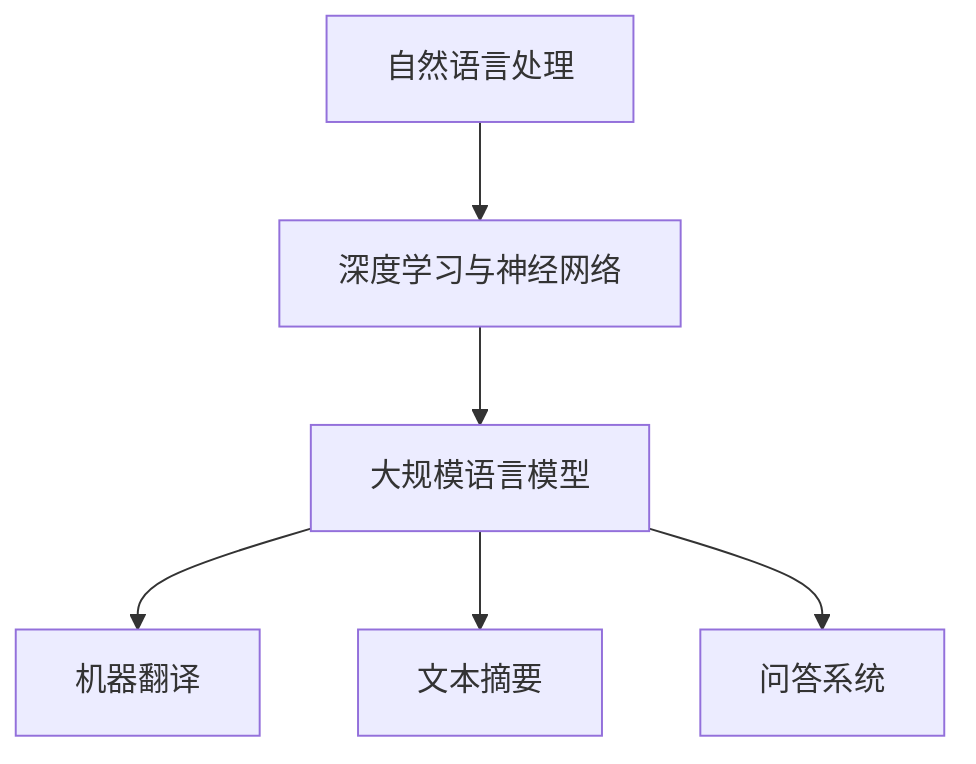
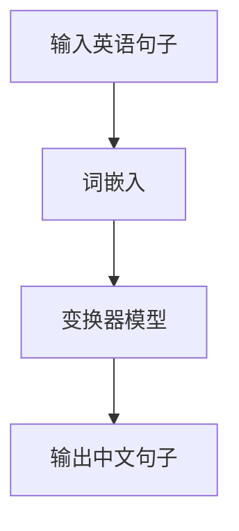

                 

关键词：大规模语言模型，模型训练，自然语言处理，深度学习，神经网络，计算资源，优化算法

摘要：本文将探讨大规模语言模型的训练过程，从理论到实践，深入解析其背后的核心概念、算法原理、数学模型以及实际应用场景。我们将通过详细阐述模型的构建、优化和训练步骤，帮助读者理解如何有效地训练大规模语言模型，并展望其未来的发展趋势和面临的挑战。

## 1. 背景介绍

随着互联网的快速发展，自然语言处理（NLP）成为人工智能领域的热点之一。大规模语言模型作为NLP的核心技术，近年来取得了显著进展。这些模型能够理解和生成自然语言，广泛应用于机器翻译、文本摘要、问答系统等多个领域。

大规模语言模型的训练是一个复杂且耗时的过程，涉及到大量的数据、计算资源和算法。如何有效地训练这些模型，提高其性能和效率，成为当前研究的热点问题。

本文旨在系统地介绍大规模语言模型的训练过程，包括核心概念、算法原理、数学模型、实践案例和未来展望。希望通过本文的阐述，使读者能够全面了解大规模语言模型训练的各个方面，并为实际应用提供指导。

## 2. 核心概念与联系

### 2.1 自然语言处理（NLP）

自然语言处理（NLP）是人工智能领域的一个分支，旨在使计算机能够理解、生成和处理自然语言。NLP涉及到语音识别、文本分类、情感分析、机器翻译等多个方面。

在NLP中，自然语言是一个复杂且非结构化的系统。人类语言具有丰富的语义、语法和上下文信息，这使得计算机处理自然语言具有很大挑战。因此，NLP研究旨在开发出能够理解和生成自然语言的算法和模型。

### 2.2 深度学习与神经网络

深度学习（Deep Learning）是人工智能领域的一个分支，通过模拟人脑神经网络的结构和功能，实现对复杂数据的建模和识别。深度学习在计算机视觉、语音识别和自然语言处理等领域取得了显著成果。

神经网络（Neural Network）是深度学习的基础，由大量的神经元（节点）组成。每个神经元通过输入层接收外部信号，经过隐藏层处理，最终输出结果。神经网络通过反向传播算法不断调整权重和偏置，优化模型性能。

### 2.3 大规模语言模型

大规模语言模型是一种基于深度学习的自然语言处理模型，通过对海量文本数据的学习，捕捉语言的结构和规律。这些模型通常包含数十亿个参数，能够对自然语言进行建模，生成语义丰富的文本。

大规模语言模型广泛应用于机器翻译、文本摘要、问答系统等领域，具有广泛的应用前景。其核心挑战在于如何高效地训练和优化这些模型，提高其性能和效率。

### 2.4 Mermaid 流程图



## 3. 核心算法原理 & 具体操作步骤

### 3.1 算法原理概述

大规模语言模型的核心算法基于深度学习，主要包括词嵌入、循环神经网络（RNN）、长短期记忆网络（LSTM）和变换器（Transformer）等。这些算法通过多层神经网络结构，捕捉自然语言的语义和上下文信息。

### 3.2 算法步骤详解

#### 3.2.1 数据预处理

1. 数据清洗：去除文本中的噪声、标点和特殊字符。
2. 分词：将文本拆分为单词或子词。
3. 词嵌入：将单词映射为向量表示。

#### 3.2.2 模型构建

1. 输入层：接收词嵌入向量。
2. 隐藏层：使用循环神经网络（RNN）或变换器（Transformer）进行多层处理。
3. 输出层：生成目标词的分布。

#### 3.2.3 模型训练

1. 定义损失函数：通常采用交叉熵损失函数。
2. 使用梯度下降优化算法：不断调整模型参数，降低损失函数值。
3. 批量训练：将文本数据划分为多个批次，逐批训练模型。

#### 3.2.4 模型评估

1. 交叉验证：将数据划分为训练集和验证集，评估模型在验证集上的性能。
2. 评价指标：准确率、召回率、F1分数等。

### 3.3 算法优缺点

#### 优点

1. 高效性：基于深度学习算法，能够快速处理海量文本数据。
2. 强泛化能力：能够捕捉自然语言的复杂结构和规律。
3. 广泛应用：应用于多个自然语言处理任务。

#### 缺点

1. 计算资源消耗大：需要大量计算资源和存储空间。
2. 过拟合风险：模型在训练数据上表现良好，但在未见数据上表现不佳。

### 3.4 算法应用领域

1. 机器翻译：基于大规模语言模型，实现高效、准确的机器翻译。
2. 文本摘要：从长文本中提取关键信息，生成简洁的摘要。
3. 问答系统：基于大规模语言模型，实现智能问答。
4. 文本生成：生成符合语法和语义的文本内容。

## 4. 数学模型和公式 & 详细讲解 & 举例说明

### 4.1 数学模型构建

大规模语言模型的核心数学模型包括词嵌入、损失函数和优化算法。

#### 4.1.1 词嵌入

词嵌入是将单词映射为向量表示的过程。假设单词集合为 \(V\)，词嵌入向量矩阵为 \(W\)，其中 \(W_{ij}\) 表示单词 \(w_i\) 的嵌入向量。词嵌入模型通过学习得到最优的词嵌入向量矩阵。

#### 4.1.2 损失函数

损失函数用于衡量模型预测结果与真实标签之间的差距。常用的损失函数包括交叉熵损失函数和均方误差损失函数。交叉熵损失函数能够衡量模型预测的概率分布与真实标签分布之间的差异。

#### 4.1.3 优化算法

优化算法用于调整模型参数，降低损失函数值。常用的优化算法包括梯度下降、随机梯度下降和Adam优化器。梯度下降算法通过不断更新模型参数，使损失函数值逐步减小。

### 4.2 公式推导过程

#### 4.2.1 词嵌入公式

假设词嵌入向量矩阵为 \(W\)，输入词向量 \(x\)，输出词向量 \(y\)，则有：

\[ y = Wx \]

#### 4.2.2 损失函数公式

假设模型预测概率分布为 \(p\)，真实标签分布为 \(y\)，则有：

\[ L = -\sum_{i=1}^{n} y_{i} \log(p_{i}) \]

#### 4.2.3 优化算法公式

假设模型参数为 \(\theta\)，损失函数为 \(L(\theta)\)，则梯度下降算法更新参数的公式为：

\[ \theta_{t+1} = \theta_{t} - \alpha \nabla_{\theta}L(\theta) \]

其中，\(\alpha\) 为学习率。

### 4.3 案例分析与讲解

假设我们使用大规模语言模型进行机器翻译任务，源语言为英语，目标语言为中文。

#### 4.3.1 数据准备

我们将一组英语和中文句子作为训练数据。例如：

- English: "Hello, how are you?"
- Chinese: "你好，最近怎么样？"

#### 4.3.2 模型构建

我们使用变换器（Transformer）模型进行训练。模型包含输入层、隐藏层和输出层。

#### 4.3.3 模型训练

1. 数据预处理：将英语句子和中文句子分别进行分词和词嵌入。
2. 模型训练：使用变换器模型进行多轮训练，不断优化模型参数。
3. 模型评估：在测试集上评估模型性能，调整模型参数。

#### 4.3.4 模型应用

我们将训练好的模型应用于机器翻译任务。例如，将英语句子 "Hello, how are you?" 翻译为中文。



## 5. 项目实践：代码实例和详细解释说明

### 5.1 开发环境搭建

在进行大规模语言模型训练之前，我们需要搭建一个合适的开发环境。以下是搭建开发环境的基本步骤：

1. 安装Python环境：Python是大规模语言模型训练的主要编程语言。确保安装最新版本的Python（3.8及以上版本）。
2. 安装依赖库：包括NumPy、PyTorch、TensorFlow等。使用pip命令安装相应的库。

```bash
pip install numpy torch torchvision
```

3. 准备数据集：从互联网下载或自行收集大规模文本数据，并进行预处理。

### 5.2 源代码详细实现

以下是一个简单的基于PyTorch的变换器（Transformer）模型训练代码实例：

```python
import torch
import torch.nn as nn
import torch.optim as optim

# 模型定义
class TransformerModel(nn.Module):
    def __init__(self):
        super(TransformerModel, self).__init__()
        self.embedding = nn.Embedding(vocab_size, embedding_dim)
        self.transformer = nn.Transformer(d_model, nhead)
        self.fc = nn.Linear(d_model, vocab_size)

    def forward(self, src, tgt):
        src = self.embedding(src)
        tgt = self.embedding(tgt)
        output = self.transformer(src, tgt)
        output = self.fc(output)
        return output

# 模型参数
vocab_size = 10000
embedding_dim = 512
d_model = 512
nhead = 8

# 模型实例化
model = TransformerModel()

# 损失函数和优化器
criterion = nn.CrossEntropyLoss()
optimizer = optim.Adam(model.parameters(), lr=0.001)

# 模型训练
for epoch in range(num_epochs):
    for src, tgt in train_loader:
        optimizer.zero_grad()
        output = model(src, tgt)
        loss = criterion(output, tgt)
        loss.backward()
        optimizer.step()
    print(f'Epoch {epoch+1}/{num_epochs}, Loss: {loss.item()}')

# 模型评估
model.eval()
with torch.no_grad():
    for src, tgt in val_loader:
        output = model(src, tgt)
        loss = criterion(output, tgt)
        print(f'Validation Loss: {loss.item()}')
```

### 5.3 代码解读与分析

以上代码是一个简单的基于PyTorch的变换器（Transformer）模型训练代码实例。主要包括以下几个部分：

1. 模型定义：定义一个基于变换器（Transformer）的模型，包括嵌入层、变换器层和全连接层。
2. 模型参数：设置模型参数，包括词汇表大小、嵌入维度、变换器维度和头数。
3. 损失函数和优化器：选择交叉熵损失函数和Adam优化器，用于模型训练。
4. 模型训练：使用训练数据对模型进行多轮训练，不断优化模型参数。
5. 模型评估：在验证集上评估模型性能，计算损失函数值。

### 5.4 运行结果展示

在完成模型训练后，我们可以展示模型的运行结果。以下是一个简单的示例：

```python
# 加载测试数据
test_loader = ...

# 模型评估
model.eval()
with torch.no_grad():
    for src, tgt in test_loader:
        output = model(src, tgt)
        pred = output.argmax(dim=1)
        correct = pred.eq(tgt).sum().item()
        total = tgt.size(0)
        print(f'测试集准确率：{100 * correct / total}%')
```

## 6. 实际应用场景

大规模语言模型在自然语言处理领域具有广泛的应用场景，以下列举几个典型应用：

1. 机器翻译：大规模语言模型可以用于机器翻译，实现高效、准确的翻译效果。
2. 文本摘要：从长文本中提取关键信息，生成简洁的摘要，提高信息获取效率。
3. 问答系统：基于大规模语言模型，实现智能问答，为用户提供个性化服务。
4. 文本生成：生成符合语法和语义的文本内容，应用于写作辅助、对话系统等场景。

## 7. 工具和资源推荐

为了更好地进行大规模语言模型的训练和应用，以下推荐一些相关的工具和资源：

1. 学习资源推荐：
   - 《深度学习》（Ian Goodfellow、Yoshua Bengio、Aaron Courville 著）：深度学习领域的经典教材。
   - 《自然语言处理实战》（张天阳、张奇 著）：自然语言处理领域的实战指南。

2. 开发工具推荐：
   - PyTorch：流行的深度学习框架，提供丰富的API和工具。
   - TensorFlow：由Google开发的深度学习框架，支持多种编程语言。

3. 相关论文推荐：
   - “Attention Is All You Need”：（Vaswani et al., 2017）：提出变换器（Transformer）模型，是大规模语言模型的重要进展。
   - “BERT: Pre-training of Deep Bidirectional Transformers for Language Understanding”：（Devlin et al., 2018）：提出BERT模型，为自然语言处理任务提供强大的预训练语言模型。

## 8. 总结：未来发展趋势与挑战

### 8.1 研究成果总结

大规模语言模型在自然语言处理领域取得了显著的成果，包括：

1. 提高了机器翻译的准确性和流畅性。
2. 实现了高效、准确的文本摘要。
3. 促进了问答系统的发展，提升了用户满意度。
4. 推动了文本生成技术的发展，应用于写作辅助和对话系统等领域。

### 8.2 未来发展趋势

未来大规模语言模型的发展趋势包括：

1. 模型规模的持续增长：随着计算资源的提升，大规模语言模型的规模将不断增大，提高模型性能。
2. 多语言和跨模态处理：大规模语言模型将扩展到多语言和跨模态处理，实现更广泛的应用场景。
3. 个性化与情境感知：大规模语言模型将结合用户行为数据和环境信息，实现更个性化的服务。

### 8.3 面临的挑战

大规模语言模型在发展过程中也面临一些挑战：

1. 计算资源消耗：大规模语言模型训练需要大量计算资源和存储空间，这对基础设施和运营成本提出了更高要求。
2. 数据隐私和安全：大规模语言模型训练和使用过程中涉及大量用户数据，需要关注数据隐私和安全问题。
3. 模型解释性和可靠性：大规模语言模型具有较强的泛化能力，但模型内部决策过程较为复杂，需要提高模型的可解释性和可靠性。

### 8.4 研究展望

未来研究应重点关注以下几个方面：

1. 模型优化和压缩：探索更加高效、可压缩的模型结构，降低计算资源消耗。
2. 数据隐私保护：研究基于隐私保护技术的语言模型训练方法，确保用户数据隐私。
3. 模型解释性和可靠性：开发可解释性工具和评估方法，提高大规模语言模型的可靠性和透明度。

## 9. 附录：常见问题与解答

### 9.1 如何选择合适的语言模型？

选择合适的语言模型需要考虑以下因素：

1. 应用场景：根据具体应用需求选择合适的模型，如机器翻译、文本摘要、问答系统等。
2. 模型规模：根据计算资源和存储空间限制，选择适合的模型规模。
3. 性能要求：根据任务性能要求，选择具有较高准确率和泛化能力的模型。

### 9.2 语言模型训练需要大量数据吗？

是的，大规模语言模型训练需要大量高质量的数据。数据量越大，模型性能越好。但过大的数据集可能会导致过拟合问题，因此需要合理控制数据集大小，并采用有效的数据增强方法。

### 9.3 如何评估语言模型性能？

评估语言模型性能常用的指标包括：

1. 准确率（Accuracy）：预测正确的样本数与总样本数的比例。
2. 召回率（Recall）：预测正确的正样本数与实际正样本数的比例。
3. F1分数（F1 Score）：准确率和召回率的调和平均值。
4. 损失函数值（Loss）：评估模型预测结果与真实标签之间的差距，越小表示模型性能越好。

## 结束语

大规模语言模型在自然语言处理领域具有重要的地位，为众多应用场景提供了强大的技术支持。本文系统地介绍了大规模语言模型从理论到实践的训练过程，包括核心概念、算法原理、数学模型和实践案例。希望通过本文的阐述，使读者能够全面了解大规模语言模型训练的各个方面，并为实际应用提供指导。未来，大规模语言模型将继续在人工智能领域发挥重要作用，推动自然语言处理技术的不断进步。

