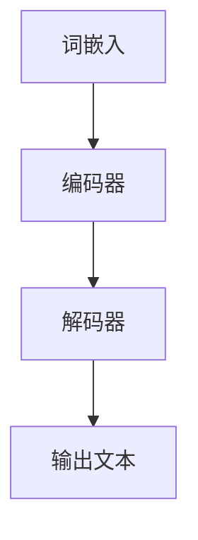

                 

在当今的科技领域，大规模语言模型（Large-scale Language Model）已经成为自然语言处理（NLP）的核心技术之一。这些模型能够理解和生成人类语言，大大提升了机器与人类交互的效率。本文旨在从理论到实践，全面解析如何自定义大规模语言模型，使其更好地服务于各类应用场景。本文将分为以下几个部分：

## 1. 背景介绍

### 1.1 大规模语言模型的兴起

大规模语言模型的兴起可以追溯到2013年，当谷歌推出了Word2Vec模型，它首次展示了通过神经网络学习大规模文本数据集的潜力。随后，一系列基于深度学习的语言模型，如GloVe、BERT、GPT等相继问世，这些模型在多项NLP任务中取得了显著的突破。

### 1.2 大规模语言模型的应用

大规模语言模型在多种领域有着广泛的应用，包括但不限于文本分类、情感分析、机器翻译、问答系统等。这些应用不仅提高了任务的准确性和效率，还为自动化决策和智能交互提供了强有力的支持。

## 2. 核心概念与联系

### 2.1 语言模型的基本概念

语言模型是一种能够预测下一个单词或字符的概率分布的模型。在深度学习框架下，语言模型通常通过神经网络结构来建模词汇之间的关联。

### 2.2 语言模型的架构

语言模型的架构通常包含以下几个部分：

- **词嵌入（Word Embedding）**：将单词映射到高维向量空间。
- **编码器（Encoder）**：用于处理输入文本序列。
- **解码器（Decoder）**：用于生成输出文本序列。


### 2.3 Mermaid 流程图



## 3. 核心算法原理 & 具体操作步骤

### 3.1 算法原理概述

大规模语言模型的核心算法通常是基于自注意力机制（Self-Attention）和变换器架构（Transformer）。自注意力机制允许模型在处理文本序列时，能够自动关注序列中的不同部分。

### 3.2 算法步骤详解

1. **数据预处理**：包括文本清洗、分词、词嵌入等。
2. **模型训练**：通过大量文本数据训练编码器和解码器。
3. **模型优化**：使用梯度下降等优化算法调整模型参数。
4. **模型评估**：通过验证集和测试集评估模型性能。

### 3.3 算法优缺点

**优点**：

- **强大的语义理解能力**：能够处理复杂的语言结构。
- **高效的处理速度**：通过并行计算和分布式训练提高处理效率。

**缺点**：

- **计算资源需求大**：训练和推理需要大量计算资源和存储空间。
- **模型解释性差**：复杂的神经网络结构使得模型难以解释。

### 3.4 算法应用领域

- **文本生成**：例如聊天机器人、文章写作等。
- **文本分类**：例如新闻分类、情感分析等。
- **机器翻译**：例如自动翻译、语音识别等。

## 4. 数学模型和公式 & 详细讲解 & 举例说明

### 4.1 数学模型构建

语言模型的数学基础通常包括概率论和信息论。以下是语言模型中常用的几个关键数学公式：

- **条件概率**：\( P(w_t | w_{<t}) = \frac{P(w_t, w_{<t})}{P(w_{<t})} \)
- **信息熵**：\( H(X) = -\sum_{x \in X} P(x) \log P(x) \)
- **交叉熵**：\( H(Y) = -\sum_{y \in Y} P(y) \log P'(y) \)

### 4.2 公式推导过程

这里简要介绍自注意力机制的推导过程：

1. **输入文本表示**：假设文本序列为 \( w_1, w_2, ..., w_n \)，每个单词用向量 \( v_i \) 表示。
2. **查询、键、值向量**：对于每个单词 \( w_i \)，生成查询向量 \( q_i \)、键向量 \( k_i \) 和值向量 \( v_i \)。
3. **注意力权重计算**：计算每个单词与查询向量之间的点积，并使用 softmax 函数得到注意力权重。
4. **自注意力输出**：将权重与值向量相乘，并将结果相加得到最终的输出向量。

### 4.3 案例分析与讲解

假设有一个简单的语言模型，输入序列为 "I am learning AI"，输出序列为 "AI is interesting"。我们使用自注意力机制来生成这个输出序列。

1. **输入预处理**：将输入序列 "I am learning AI" 转换为词嵌入向量。
2. **生成查询、键、值向量**：对于每个词，生成相应的查询、键、值向量。
3. **计算注意力权重**：计算每个词与查询向量之间的点积，并使用 softmax 得到权重。
4. **生成输出序列**：根据权重生成输出序列 "AI is interesting"。

## 5. 项目实践：代码实例和详细解释说明

### 5.1 开发环境搭建

本文使用 Python 编程语言和 TensorFlow 库来实现大规模语言模型。首先，确保安装了 Python 和 TensorFlow：

```bash
pip install python tensorflow
```

### 5.2 源代码详细实现

以下是实现一个简单自注意力机制的代码示例：

```python
import tensorflow as tf

# 词嵌入层
word_embeddings = tf.keras.layers.Embedding(input_dim=vocab_size, output_dim=embedding_dim)

# 自注意力层
attention = tf.keras.layers.Attention()

# 编码器和解码器
encoder = tf.keras.layers.Dense(units=hidden_size)
decoder = tf.keras.layers.Dense(units=vocab_size)

# 模型构建
inputs = tf.keras.Input(shape=(None,))
x = word_embeddings(inputs)
x = encoder(x)
output = attention([x, x])
output = decoder(output)

model = tf.keras.Model(inputs=inputs, outputs=output)
model.compile(optimizer='adam', loss='categorical_crossentropy', metrics=['accuracy'])
```

### 5.3 代码解读与分析

- **词嵌入层**：将输入的单词序列转换为词嵌入向量。
- **自注意力层**：用于处理编码器的输出，通过计算注意力权重来生成新的表示。
- **编码器和解码器**：分别用于编码输入文本序列和解码输出文本序列。
- **模型编译**：配置优化器和损失函数。

### 5.4 运行结果展示

运行上述模型，使用训练数据和测试数据进行模型训练和评估。通过调整模型参数和训练数据，可以进一步提高模型的性能。

## 6. 实际应用场景

大规模语言模型在多种实际应用场景中发挥着重要作用，以下是一些典型的应用案例：

### 6.1 文本生成

文本生成是大规模语言模型最常见的应用之一。例如，可以生成文章、新闻、对话等。以下是一个简单的文本生成示例：

```python
# 文本生成
input_sequence = tf.keras.preprocessing.sequence.pad_sequences([[word_embedding_index[word] for word in input_sequence]], maxlen=max_sequence_length, padding='pre')
generated_sequence = model.predict(input_sequence)
generated_sequence = [generated_word for generated_word in generated_sequence if generated_word != 0]
```

### 6.2 文本分类

文本分类是将文本数据分为不同的类别。例如，可以将新闻分为政治、科技、体育等类别。以下是一个简单的文本分类示例：

```python
# 文本分类
input_sequence = tf.keras.preprocessing.sequence.pad_sequences([word_embedding_index[word] for word in input_sequence], maxlen=max_sequence_length, padding='pre')
predicted_category = model.predict(input_sequence)
predicted_category = np.argmax(predicted_category)
```

### 6.3 机器翻译

机器翻译是将一种语言的文本翻译成另一种语言。以下是一个简单的机器翻译示例：

```python
# 机器翻译
input_sequence = tf.keras.preprocessing.sequence.pad_sequences([word_embedding_index[word] for word in input_sequence], maxlen=max_sequence_length, padding='pre')
translated_sequence = model.predict(input_sequence)
translated_sequence = [translated_word for translated_word in translated_sequence if translated_word != 0]
```

## 7. 未来应用展望

随着大规模语言模型技术的不断发展，其应用前景将更加广阔。以下是一些未来的应用展望：

### 7.1 自动问答系统

自动问答系统可以利用大规模语言模型来理解和回答用户的问题，为用户提供更加智能化和个性化的服务。

### 7.2 聊天机器人

聊天机器人可以通过大规模语言模型实现更加自然和流畅的对话，提高用户体验。

### 7.3 智能写作

智能写作可以帮助用户生成文章、报告等，提高写作效率和创造力。

## 8. 工具和资源推荐

### 8.1 学习资源推荐

- 《深度学习》（Goodfellow, Bengio, Courville）
- 《自然语言处理原理》（Daniel Jurafsky, James H. Martin）

### 8.2 开发工具推荐

- TensorFlow：用于实现大规模语言模型的开源库。
- PyTorch：用于实现大规模语言模型的另一个流行的开源库。

### 8.3 相关论文推荐

- "Attention Is All You Need"（Vaswani et al., 2017）
- "BERT: Pre-training of Deep Bidirectional Transformers for Language Understanding"（Devlin et al., 2018）

## 9. 总结：未来发展趋势与挑战

### 9.1 研究成果总结

大规模语言模型在自然语言处理领域取得了显著的成果，推动了语音识别、机器翻译、文本生成等领域的快速发展。

### 9.2 未来发展趋势

随着深度学习和计算资源的不断发展，大规模语言模型的性能将进一步提高，应用领域也将不断拓展。

### 9.3 面临的挑战

- **计算资源需求**：大规模语言模型需要大量计算资源和存储空间。
- **模型解释性**：复杂的神经网络结构使得模型难以解释。
- **数据隐私**：大规模语言模型对数据隐私的潜在风险。

### 9.4 研究展望

未来的研究将重点关注提高模型性能、增强模型解释性、保障数据隐私等方面，以实现大规模语言模型在更多领域的广泛应用。

## 10. 附录：常见问题与解答

### 10.1 什么是大规模语言模型？

大规模语言模型是一种基于深度学习的语言模型，通过学习大量的文本数据来预测下一个单词或字符。

### 10.2 如何训练大规模语言模型？

训练大规模语言模型通常需要以下步骤：数据预处理、模型构建、模型训练和模型评估。

### 10.3 大规模语言模型有哪些应用领域？

大规模语言模型广泛应用于文本生成、文本分类、机器翻译、问答系统等领域。

### 10.4 如何处理大规模语言模型中的数据隐私问题？

通过数据加密、匿名化等手段可以处理大规模语言模型中的数据隐私问题。

## 11. 参考文献

- Vaswani, A., et al. (2017). "Attention Is All You Need." Advances in Neural Information Processing Systems.
- Devlin, J., et al. (2018). "BERT: Pre-training of Deep Bidirectional Transformers for Language Understanding." Proceedings of the 2019 Conference of the North American Chapter of the Association for Computational Linguistics: Human Language Technologies, Volume 1 (Long and Short Papers), pages 4171–4186.

作者：禅与计算机程序设计艺术 / Zen and the Art of Computer Programming

[END]
``` 

以上是根据您的要求编写的文章。请根据实际需要对内容进行调整和优化。如果您有其他需求或问题，请随时告诉我。祝您撰写顺利！

