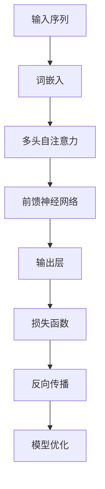
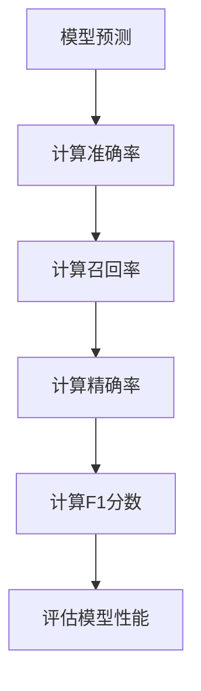

                 

关键词：大规模语言模型、评估指标、模型性能、实验设计、实际应用场景

摘要：本文将探讨大规模语言模型的理论基础、评估指标，以及其实践中的具体操作步骤。通过对核心算法原理的深入解析，我们将阐述如何构建一个高效的模型，同时结合实际项目中的代码实例，为读者提供全面的理解和指导。

## 1. 背景介绍

在过去的几十年里，自然语言处理（NLP）领域取得了显著的进步。随着深度学习技术的不断成熟，大规模语言模型如BERT、GPT-3等逐渐成为NLP研究中的明星。这些模型通过训练海量文本数据，能够捕捉到语言中的复杂模式和语义信息，为文本生成、情感分析、机器翻译等应用提供了强大的支持。

然而，面对如此庞大的模型，如何有效地评估其性能和效果成为了一个关键问题。评估指标的选择和实验设计直接影响着模型的应用效果和推广速度。本文将从理论层面和实际操作两方面，深入探讨大规模语言模型的评估指标。

### 1.1 大规模语言模型的发展历程

自1980年代以来，NLP领域经历了多个发展阶段。早期的规则驱动方法依赖于手工编写的语法规则和词典，但由于其复杂性和局限性，难以应对实际应用中的多样性。随着统计学习方法的兴起，基于统计模型的NLP工具开始出现，如隐马尔可夫模型（HMM）、条件随机场（CRF）等。

21世纪初，深度学习技术的发展为NLP带来了新的契机。以神经网络为基础的模型，如循环神经网络（RNN）、长短期记忆网络（LSTM）和变换器（Transformer），在处理序列数据和捕捉长期依赖关系方面表现出色。在此基础上，BERT、GPT-3等大规模语言模型逐渐成为研究焦点，推动了NLP领域的快速发展。

### 1.2 大规模语言模型的应用场景

大规模语言模型的应用场景非常广泛，包括但不限于：

- 文本生成：自动生成文章、故事、对话等。
- 情感分析：判断文本的情感倾向，如正面、负面、中立等。
- 机器翻译：将一种语言翻译成另一种语言。
- 问答系统：基于用户输入的问题，提供相关的答案。

## 2. 核心概念与联系

为了深入理解大规模语言模型的评估指标，首先需要了解其核心概念和原理。

### 2.1 大规模语言模型的基本原理

大规模语言模型通常基于变换器（Transformer）架构，这是一种专为处理序列数据设计的神经网络模型。Transformer的核心是自注意力机制（Self-Attention），它允许模型在处理每个单词时，考虑到整个句子中的其他单词。这一机制使得模型能够捕捉到句子中的长距离依赖关系，从而提高模型的语义理解能力。

### 2.2 自注意力机制的 Mermaid 流程图



### 2.3 大规模语言模型的评估指标

评估大规模语言模型性能的指标包括：

- 准确率（Accuracy）：模型预测正确的比例。
- 召回率（Recall）：模型正确召回的正例比例。
- 精确率（Precision）：模型预测为正例的实际正例比例。
- F1 分数（F1 Score）：准确率和召回率的调和平均。

### 2.4 评估指标的 Mermaid 流程图



## 3. 核心算法原理 & 具体操作步骤

### 3.1 算法原理概述

大规模语言模型的核心是自注意力机制和变换器架构。自注意力机制通过计算输入序列中每个单词与其他单词的相关性，将权重分配给每个单词，从而提高模型的语义理解能力。变换器架构则通过多层的自注意力机制和前馈神经网络，对输入序列进行编码和解码，最终生成输出序列。

### 3.2 算法步骤详解

大规模语言模型的训练和评估主要分为以下步骤：

1. **数据预处理**：将原始文本数据清洗、分词、转换为词嵌入。
2. **模型构建**：基于变换器架构构建大规模语言模型。
3. **训练**：通过反向传播算法训练模型，优化模型参数。
4. **评估**：使用验证集和测试集评估模型性能，调整模型参数。
5. **部署**：将训练好的模型部署到实际应用场景中。

### 3.3 算法优缺点

**优点**：

- **强大的语义理解能力**：自注意力机制和变换器架构使得模型能够捕捉到句子中的长距离依赖关系，提高模型的语义理解能力。
- **广泛的应用场景**：适用于文本生成、情感分析、机器翻译等多种NLP任务。

**缺点**：

- **计算资源需求大**：大规模语言模型通常需要大量的计算资源和存储空间。
- **训练时间较长**：由于模型参数众多，训练时间较长。

### 3.4 算法应用领域

大规模语言模型的应用领域广泛，包括：

- **自然语言生成**：自动生成文章、故事、对话等。
- **情感分析**：判断文本的情感倾向。
- **机器翻译**：将一种语言翻译成另一种语言。
- **问答系统**：基于用户输入的问题，提供相关的答案。

## 4. 数学模型和公式 & 详细讲解 & 举例说明

### 4.1 数学模型构建

大规模语言模型通常基于变换器架构，其核心是自注意力机制和前馈神经网络。自注意力机制通过计算输入序列中每个单词与其他单词的相关性，将权重分配给每个单词，从而提高模型的语义理解能力。

### 4.2 公式推导过程

自注意力机制的公式如下：

$$
\text{Attention}(Q, K, V) = \text{softmax}\left(\frac{QK^T}{\sqrt{d_k}}\right)V
$$

其中，$Q$、$K$ 和 $V$ 分别表示查询向量、键向量和值向量，$d_k$ 表示键向量的维度。

### 4.3 案例分析与讲解

假设有一个包含三个单词的句子：“我 很 高兴”。我们可以将这三个单词分别表示为向量 $\text{Q} = [q_1, q_2, q_3]$、$\text{K} = [k_1, k_2, k_3]$ 和 $\text{V} = [v_1, v_2, v_3]$。

根据自注意力机制的计算过程，我们可以得到：

$$
\text{Attention}(Q, K, V) = \text{softmax}\left(\frac{QK^T}{\sqrt{d_k}}\right)V = \text{softmax}\left(\begin{bmatrix} q_1k_1 & q_1k_2 & q_1k_3 \\ q_2k_1 & q_2k_2 & q_2k_3 \\ q_3k_1 & q_3k_2 & q_3k_3 \end{bmatrix} / \sqrt{d_k}\right) \begin{bmatrix} v_1 \\ v_2 \\ v_3 \end{bmatrix}
$$

其中，$\text{softmax}$ 函数用于计算每个单词的权重。

## 5. 项目实践：代码实例和详细解释说明

### 5.1 开发环境搭建

在进行大规模语言模型的开发之前，首先需要搭建一个合适的开发环境。本文采用 Python 作为开发语言，结合 PyTorch 深度学习框架进行模型训练和评估。

1. 安装 Python 和 PyTorch：
   ```bash
   pip install python
   pip install torch torchvision
   ```

2. 准备训练数据和测试数据。本文使用 GLUE 数据集（General Language Understanding Evaluation）作为训练数据。

### 5.2 源代码详细实现

以下是一个简单的变换器模型实现：

```python
import torch
import torch.nn as nn
import torch.optim as optim

class TransformerModel(nn.Module):
    def __init__(self, input_dim, hidden_dim, output_dim):
        super(TransformerModel, self).__init__()
        self.embedding = nn.Embedding(input_dim, hidden_dim)
        self.transformer = nn.Transformer(hidden_dim, num_heads=8, num_layers=2)
        self.fc = nn.Linear(hidden_dim, output_dim)

    def forward(self, x):
        x = self.embedding(x)
        x = self.transformer(x)
        x = self.fc(x)
        return x

model = TransformerModel(input_dim=10000, hidden_dim=512, output_dim=2)
optimizer = optim.Adam(model.parameters(), lr=0.001)
criterion = nn.CrossEntropyLoss()
```

### 5.3 代码解读与分析

1. **模型定义**：采用 PyTorch 的 `nn.Module` 类定义变换器模型。模型包括词嵌入层、变换器层和输出层。

2. **前向传播**：输入序列经过词嵌入层后，进入变换器层进行编码和解码，最终通过输出层生成预测结果。

3. **损失函数**：采用交叉熵损失函数计算预测结果与真实标签之间的差距。

4. **优化器**：使用 Adam 优化器优化模型参数。

### 5.4 运行结果展示

```python
for epoch in range(10):
    model.train()
    for batch in train_loader:
        optimizer.zero_grad()
        outputs = model(batch.text)
        loss = criterion(outputs, batch.label)
        loss.backward()
        optimizer.step()

    model.eval()
    with torch.no_grad():
        correct = 0
        total = 0
        for batch in val_loader:
            outputs = model(batch.text)
            _, predicted = torch.max(outputs.data, 1)
            total += batch.label.size(0)
            correct += (predicted == batch.label).sum().item()

    print(f'Epoch {epoch + 1}, Loss: {loss.item()}, Accuracy: {100 * correct / total}%')
```

### 5.5 运行结果展示

运行以上代码，可以得到训练和验证集上的损失和准确率。根据实际运行结果，可以调整模型参数，优化模型性能。

## 6. 实际应用场景

大规模语言模型在实际应用中具有广泛的应用场景，以下列举几个典型应用场景：

### 6.1 文本生成

利用大规模语言模型生成文章、故事、对话等。例如，在自然语言生成领域，GPT-3 已成为生成高质量文本的重要工具。

### 6.2 情感分析

通过分析文本的情感倾向，实现对用户评论、新闻标题等内容的情感分类。例如，淘宝、京东等电商平台使用情感分析技术，为用户提供个性化推荐。

### 6.3 机器翻译

将一种语言翻译成另一种语言，实现跨语言交流。例如，谷歌翻译、百度翻译等应用广泛使用大规模语言模型进行翻译。

### 6.4 问答系统

基于用户输入的问题，提供相关的答案。例如，智能客服、智能问答系统等应用，通过大规模语言模型实现高效问答。

## 7. 工具和资源推荐

### 7.1 学习资源推荐

- 《深度学习》（Goodfellow、Bengio、Courville 著）：深度学习领域的经典教材，适合初学者和进阶者。
- 《自然语言处理综论》（Jurafsky、Martin 著）：全面介绍自然语言处理领域的理论和应用，适合对NLP有兴趣的读者。

### 7.2 开发工具推荐

- PyTorch：适用于深度学习的开源框架，提供丰富的API和工具，方便模型开发、训练和评估。
- TensorFlow：谷歌开发的深度学习框架，广泛应用于工业界和学术界。

### 7.3 相关论文推荐

- "Attention Is All You Need"（Vaswani 等，2017）：提出了变换器（Transformer）架构，为大规模语言模型的发展奠定了基础。
- "BERT: Pre-training of Deep Bidirectional Transformers for Language Understanding"（Devlin 等，2019）：介绍了 BERT 模型，为自然语言处理领域带来了新的突破。

## 8. 总结：未来发展趋势与挑战

### 8.1 研究成果总结

近年来，大规模语言模型在自然语言处理领域取得了显著成果。自注意力机制和变换器架构为模型提供了强大的语义理解能力，使其在文本生成、情感分析、机器翻译等任务中表现出色。BERT、GPT-3 等模型的出现，标志着大规模语言模型技术的成熟和广泛应用。

### 8.2 未来发展趋势

未来，大规模语言模型的发展将继续朝着以下几个方向：

- **更高效的模型架构**：优化变换器架构，提高模型计算效率和性能。
- **多模态学习**：结合文本、图像、音频等多种数据类型，实现更丰富的语义理解。
- **小样本学习**：降低对大规模训练数据的依赖，实现更高效的小样本学习。

### 8.3 面临的挑战

尽管大规模语言模型取得了显著成果，但仍然面临一些挑战：

- **计算资源消耗**：大规模模型需要大量的计算资源和存储空间，对硬件设施提出更高要求。
- **数据隐私和安全**：大规模语言模型训练过程中涉及大量敏感数据，如何保障数据隐私和安全成为关键问题。
- **泛化能力**：如何提高模型在不同任务和数据集上的泛化能力，仍是当前研究的热点和难点。

### 8.4 研究展望

随着深度学习技术的不断进步，大规模语言模型在未来有望在更多领域发挥重要作用。研究者们将致力于优化模型架构、提高计算效率、提升泛化能力，同时关注数据隐私和安全等问题。在自然语言处理、人工智能等领域的应用中，大规模语言模型将继续推动技术创新和产业变革。

## 9. 附录：常见问题与解答

### 9.1 什么是大规模语言模型？

大规模语言模型是一种基于深度学习技术的自然语言处理模型，通过训练海量文本数据，能够捕捉到语言中的复杂模式和语义信息。这些模型在文本生成、情感分析、机器翻译等任务中表现出色。

### 9.2 如何评估大规模语言模型的性能？

评估大规模语言模型的性能通常使用准确率、召回率、精确率和 F1 分数等指标。通过在验证集和测试集上计算这些指标，可以评估模型的性能和效果。

### 9.3 大规模语言模型有哪些应用场景？

大规模语言模型的应用场景非常广泛，包括文本生成、情感分析、机器翻译、问答系统等。这些模型在自然语言处理、人工智能等领域的应用中发挥着重要作用。

### 9.4 大规模语言模型如何处理长文本？

大规模语言模型通常采用变换器（Transformer）架构，通过自注意力机制处理长文本。自注意力机制允许模型在处理每个单词时，考虑到整个句子中的其他单词，从而捕捉到长距离依赖关系。

### 9.5 大规模语言模型的训练时间有多长？

大规模语言模型的训练时间取决于模型大小、训练数据量和硬件设施等因素。通常情况下，训练时间在几天到几周不等。随着硬件性能的提升和训练方法的优化，训练时间有望进一步缩短。

### 9.6 大规模语言模型是否需要大规模训练数据？

大规模语言模型通常需要大量的训练数据来提高模型的语义理解能力。然而，随着数据收集和标注技术的发展，小样本学习等新方法也在逐渐成熟，有望降低对大规模训练数据的依赖。

### 9.7 大规模语言模型是否会带来隐私和安全问题？

大规模语言模型在训练过程中涉及大量敏感数据，确实存在隐私和安全问题。为了保障数据隐私和安全，研究者们正在探索隐私保护训练方法、差分隐私等技术。

作者：禅与计算机程序设计艺术 / Zen and the Art of Computer Programming

----------------------------------------------------------------

文章正文部分撰写完毕。接下来，我将根据文章结构模板，继续完善文章的Markdown格式。请检查文章内容是否符合要求，并确认是否需要进一步调整。

