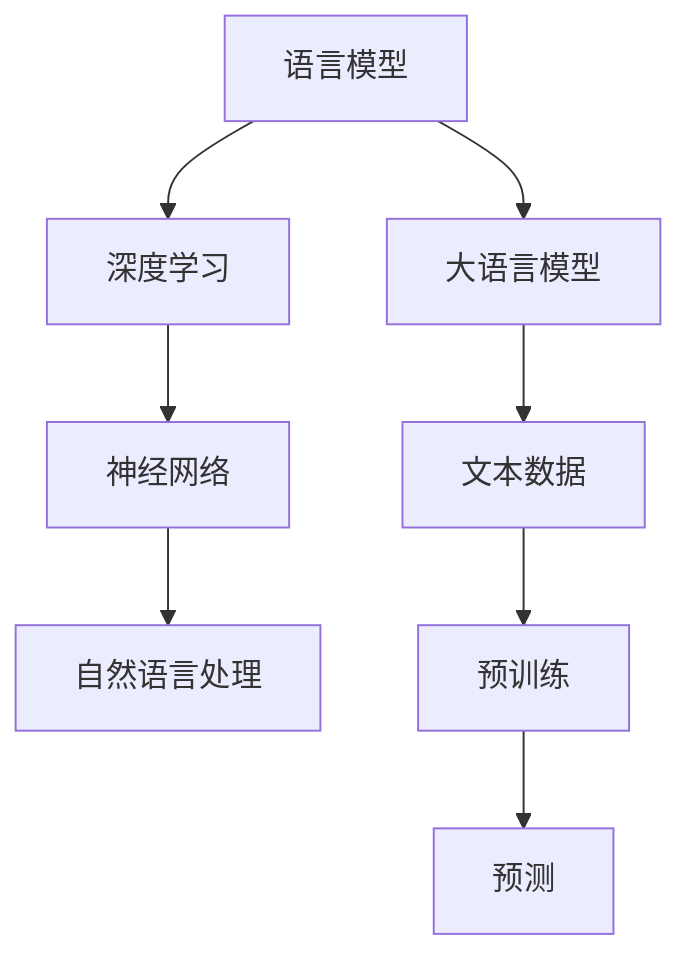

                 

关键词：大语言模型，原理，代码实例，深度学习，自然语言处理，神经网络，训练过程，应用领域。

## 摘要

本文将深入探讨大语言模型的原理及其实现细节。我们将从背景介绍开始，逐步解析大语言模型的核心概念与联系，详细解释其算法原理与具体操作步骤，并引入数学模型和公式进行深入分析。随后，通过项目实践部分，我们将展示一个代码实例，并对其进行详细解读。最后，我们将讨论大语言模型在实际应用场景中的表现，并展望其未来的发展趋势与面临的挑战。

## 1. 背景介绍

### 大语言模型的历史与发展

大语言模型（Large Language Model）是指基于深度学习技术构建的、能够理解和生成自然语言的大型神经网络模型。其历史可以追溯到20世纪80年代，当时研究人员开始探索基于统计方法的自然语言处理技术。然而，受限于计算能力和数据规模，早期的语言模型效果有限。

随着深度学习技术的崛起和计算能力的提升，大语言模型开始迅速发展。2018年，Google推出了BERT（Bidirectional Encoder Representations from Transformers），这是第一个大规模预训练的语言模型，引起了广泛关注。BERT的提出标志着大语言模型进入了一个新的阶段，其效果显著优于传统的语言模型。

### 大语言模型的重要性

大语言模型在自然语言处理领域具有非常重要的意义。首先，它们能够自动从大规模文本数据中学习语言规律，从而提升文本分类、情感分析、机器翻译等任务的性能。其次，大语言模型能够生成高质量的文本，为自动写作、对话系统等应用提供了强大的支持。

随着互联网和社交媒体的普及，文本数据量呈爆炸式增长。大语言模型的出现，使得我们能够更好地理解和利用这些数据，从而推动自然语言处理技术的进一步发展。

### 本文结构

本文将分为以下几个部分：

1. 背景介绍：回顾大语言模型的历史与发展，介绍其重要性。
2. 核心概念与联系：阐述大语言模型的核心概念与联系，并通过Mermaid流程图进行展示。
3. 核心算法原理与具体操作步骤：详细解释大语言模型的算法原理与具体操作步骤。
4. 数学模型与公式：介绍大语言模型背后的数学模型和公式，并进行详细讲解。
5. 项目实践：展示一个具体的代码实例，并对其进行详细解读。
6. 实际应用场景：讨论大语言模型在实际应用场景中的表现。
7. 工具和资源推荐：推荐学习资源、开发工具和论文。
8. 总结：总结研究成果，展望未来发展趋势与挑战。
9. 附录：常见问题与解答。

## 2. 核心概念与联系

### 语言模型

语言模型（Language Model）是自然语言处理中的基础模型，用于预测下一个单词或字符的概率。在深度学习时代之前，语言模型主要基于统计方法，如N-gram模型。然而，深度学习技术的引入，使得语言模型取得了显著的进步。

大语言模型在语言模型的基础上，通过引入更深的神经网络结构和大规模的预训练数据，进一步提升了模型的性能。其核心思想是通过学习海量文本数据中的潜在语义表示，从而实现对未知文本的预测。

### 深度学习与神经网络

深度学习（Deep Learning）是一种基于神经网络（Neural Network）的机器学习技术。其核心思想是通过多层神经网络对数据进行自动特征提取和表示学习，从而实现复杂任务的目标。

神经网络是一种模拟生物神经系统的计算模型，通过调整网络中的参数（权重和偏置）来学习数据中的规律。深度学习通过引入多层神经网络，使得模型能够处理更复杂的任务，并在多个领域取得了突破性进展。

大语言模型采用深度学习技术，通过多层神经网络对文本数据进行建模。其核心优势在于能够自动从大规模数据中学习到丰富的语义信息，从而提升模型的预测性能。

### 自然语言处理

自然语言处理（Natural Language Processing，NLP）是计算机科学和人工智能领域的一个分支，旨在使计算机能够理解、处理和生成人类语言。

大语言模型在自然语言处理中具有广泛的应用。例如，在文本分类任务中，大语言模型可以自动判断文本的情感倾向；在机器翻译任务中，大语言模型可以生成高质量的翻译结果；在问答系统中，大语言模型可以理解用户的提问并给出合理的回答。

### Mermaid流程图

为了更清晰地展示大语言模型的核心概念与联系，我们可以使用Mermaid流程图进行描述。以下是一个示例：



在这个流程图中，我们展示了语言模型、深度学习、神经网络和自然语言处理之间的联系，并指出大语言模型如何通过预训练和预测实现对文本数据的建模。

### 小结

通过以上介绍，我们可以看到大语言模型是一个涉及多个领域的复杂系统。它基于深度学习技术，通过神经网络对文本数据进行建模，并在自然语言处理中发挥重要作用。理解这些核心概念与联系，有助于我们更好地掌握大语言模型的工作原理。

## 3. 核心算法原理与具体操作步骤

### 3.1 算法原理概述

大语言模型的算法原理主要基于深度学习和神经网络。具体来说，它包括以下几个关键步骤：

1. **数据预处理**：对原始文本数据进行预处理，包括分词、去停用词、词向量编码等，以便模型能够进行处理。
2. **模型架构设计**：设计一个多层的神经网络架构，包括输入层、隐藏层和输出层。通常采用Transformer模型架构，它具有自注意力机制，能够捕捉文本中的长距离依赖关系。
3. **预训练**：使用大规模的文本数据对模型进行预训练，使其能够自动学习到文本的潜在语义表示。预训练过程中，模型通过训练语料库中的文本对进行自回归预测，即预测下一个单词或字符。
4. **下游任务微调**：在预训练的基础上，对模型进行微调，使其适应特定的下游任务，如文本分类、机器翻译等。

### 3.2 算法步骤详解

#### 3.2.1 数据预处理

数据预处理是构建大语言模型的第一步，其目的是将原始文本数据转化为模型能够处理的格式。具体步骤如下：

1. **分词**：将原始文本划分为单词或字符序列。对于中文文本，通常使用分词工具，如jieba，进行分词处理。
2. **去停用词**：去除文本中的停用词，如“的”、“是”、“了”等，因为这些词对模型的训练效果贡献较小。
3. **词向量编码**：将单词或字符序列转化为向量表示。常用的词向量编码方法有Word2Vec、GloVe等。这些方法将单词映射到低维空间中，使得相似单词的向量表示接近。

#### 3.2.2 模型架构设计

大语言模型的模型架构设计是算法实现的关键。Transformer模型是目前常用的架构，其核心思想是引入自注意力机制（Self-Attention），能够捕捉文本中的长距离依赖关系。以下是一个简单的Transformer模型架构：

1. **输入层**：输入层接收预处理后的文本数据，将其转化为序列形式的向量表示。
2. **多头自注意力机制**：自注意力机制通过计算输入序列中每个词与其他词之间的相似性，从而生成新的表示。多头自注意力机制将整个序列拆分为多个头，每个头关注不同的部分，从而提高模型的表示能力。
3. **全连接层**：在多头自注意力机制之后，加入多层全连接层，用于进一步提取特征和增强模型的表达能力。
4. **输出层**：输出层通常是一个线性层，用于预测下一个单词或字符。

#### 3.2.3 预训练

预训练是大规模语言模型训练过程中最耗时的部分。预训练的主要目标是使模型能够自动学习到文本的潜在语义表示。以下是一个简单的预训练步骤：

1. **训练语料库准备**：选择一个大规模的文本语料库，如维基百科、新闻文章等，将其划分为输入序列和输出序列。
2. **自回归预测**：在预训练过程中，模型通过输入序列中的前一个词来预测下一个词。即对于每个输入序列，模型需要预测下一个词的概率分布。
3. **损失函数**：预训练的损失函数通常采用交叉熵损失，用于衡量模型预测概率与真实标签之间的差距。
4. **优化算法**：采用如Adam等优化算法，对模型参数进行更新，以最小化损失函数。

#### 3.2.4 下游任务微调

在预训练完成后，需要对模型进行下游任务的微调，使其能够适应特定的任务。以下是一个简单的微调步骤：

1. **数据准备**：准备用于微调的数据集，包括输入序列和标签。
2. **微调训练**：在微调过程中，模型通过输入序列生成预测结果，并与真实标签进行比较，更新模型参数以最小化损失函数。
3. **评估与调整**：通过验证集和测试集对模型进行评估，根据评估结果调整模型参数，以提高模型性能。

### 3.3 算法优缺点

#### 优点

1. **强大的表征能力**：大语言模型通过多层神经网络和自注意力机制，能够自动学习到文本的潜在语义表示，从而提升模型的表征能力。
2. **多任务适应能力**：预训练过程中，模型已经学习了通用语义表示，因此在下游任务中进行微调时，能够快速适应不同的任务需求。
3. **良好的性能**：大语言模型在多个自然语言处理任务中取得了优异的性能，如文本分类、机器翻译、问答系统等。

#### 缺点

1. **计算资源需求高**：大语言模型的训练过程需要大量的计算资源和时间，尤其是在预训练阶段。
2. **数据依赖性**：模型的性能高度依赖于训练数据的质量和数量，如果数据集存在偏见，可能导致模型产生不公平的结果。
3. **可解释性较低**：由于大语言模型是一个高度复杂的神经网络，其内部工作机制不易理解，因此其预测结果的解释性较低。

### 3.4 算法应用领域

大语言模型在自然语言处理领域具有广泛的应用，主要包括以下几个领域：

1. **文本分类**：通过大语言模型，可以对文本进行情感分析、主题分类等任务。
2. **机器翻译**：大语言模型在机器翻译任务中，能够生成更加准确、流畅的翻译结果。
3. **问答系统**：大语言模型可以理解用户的提问，并给出合理的回答。
4. **对话系统**：大语言模型可以用于构建智能对话系统，实现人机交互。
5. **自动写作**：大语言模型可以生成文章、报告等文本内容，为自动写作提供支持。

### 小结

通过以上介绍，我们可以看到大语言模型的算法原理与具体操作步骤。它基于深度学习和神经网络，通过预训练和下游任务微调，实现对文本数据的建模。大语言模型具有强大的表征能力、多任务适应能力和良好的性能，但同时也存在计算资源需求高、数据依赖性大和可解释性较低等挑战。在接下来的部分，我们将进一步讨论大语言模型背后的数学模型和公式，并进行详细讲解。

## 4. 数学模型和公式

大语言模型背后的数学模型和公式是理解其工作原理的核心。本节将详细介绍大语言模型中的关键数学模型和公式，并通过具体例子进行讲解。

### 4.1 数学模型构建

大语言模型通常基于自注意力机制（Self-Attention）构建。自注意力机制是一种计算输入序列中每个词与其他词之间相似性的方法，从而生成新的表示。以下是一个简单的自注意力机制的数学模型：

假设输入序列为 \[x_1, x_2, \ldots, x_n\]，每个词 \(x_i\) 可以表示为一个向量 \(\mathbf{x}_i \in \mathbb{R}^d\)。自注意力机制的输出为 \[y_1, y_2, \ldots, y_n\]，其中 \(y_i\) 是 \(x_i\) 的注意力加权表示。

自注意力机制的计算可以分为以下几个步骤：

1. **查询（Query）、键（Key）和值（Value）计算**：

   对于每个词 \(x_i\)，计算其查询（Query）、键（Key）和值（Value）向量：

   $$ 
   \mathbf{Q}_i = \mathbf{W}_Q \mathbf{x}_i \\
   \mathbf{K}_i = \mathbf{W}_K \mathbf{x}_i \\
   \mathbf{V}_i = \mathbf{W}_V \mathbf{x}_i 
   $$

   其中，\(\mathbf{W}_Q\)、\(\mathbf{W}_K\) 和 \(\mathbf{W}_V\) 是权重矩阵。

2. **相似性计算**：

   计算每个词与其他词之间的相似性，通常使用点积相似性：

   $$ 
   \mathbf{s}_{ij} = \mathbf{Q}_i^T \mathbf{K}_j = \mathbf{x}_i^T \mathbf{W}^{-1}_K \mathbf{W}_Q \mathbf{x}_j 
   $$

3. **加权求和**：

   对相似性进行加权求和，得到每个词的注意力加权表示：

   $$ 
   \mathbf{y}_i = \sum_{j=1}^n \frac{\exp(\mathbf{s}_{ij})}{\sum_{k=1}^n \exp(\mathbf{s}_{ik})} \mathbf{V}_j 
   $$

### 4.2 公式推导过程

接下来，我们将详细推导自注意力机制的公式。首先，我们引入一些预备知识：

1. **点积相似性**：

   点积相似性是自注意力机制的基础，其公式为：

   $$ 
   \mathbf{a}^T \mathbf{b} = \sum_{i=1}^d a_i b_i 
   $$

   其中，\(\mathbf{a} \in \mathbb{R}^d\) 和 \(\mathbf{b} \in \mathbb{R}^d\) 是两个 \(d\) 维向量。

2. **矩阵-向量乘法**：

   矩阵-向量乘法是将矩阵和向量相乘，其公式为：

   $$ 
   \mathbf{C} = \mathbf{A} \mathbf{B} 
   $$

   其中，\(\mathbf{A} \in \mathbb{R}^{m \times n}\)、\(\mathbf{B} \in \mathbb{R}^{n \times p}\) 和 \(\mathbf{C} \in \mathbb{R}^{m \times p}\)。

现在，我们开始推导自注意力机制的公式：

1. **查询（Query）和键（Key）计算**：

   查询（Query）和键（Key）计算实际上是矩阵-向量乘法，其中权重矩阵 \(\mathbf{W}_Q\) 和 \(\mathbf{W}_K\) 分别表示为：

   $$ 
   \mathbf{Q}_i = \mathbf{W}_Q \mathbf{x}_i = \begin{pmatrix} w_{i1}^Q & \ldots & w_{id}^Q \end{pmatrix} \mathbf{x}_i = \sum_{j=1}^d w_{ij}^Q x_j \\
   \mathbf{K}_i = \mathbf{W}_K \mathbf{x}_i = \begin{pmatrix} w_{i1}^K & \ldots & w_{id}^K \end{pmatrix} \mathbf{x}_i = \sum_{j=1}^d w_{ij}^K x_j 
   $$

2. **相似性计算**：

   相似性计算实际上是点积相似性，其中相似性矩阵 \(\mathbf{S}\) 表示为：

   $$ 
   \mathbf{S} = \begin{pmatrix} s_{11} & \ldots & s_{1n} \\
   \vdots & \ddots & \vdots \\
   s_{n1} & \ldots & s_{nn} \end{pmatrix} = \begin{pmatrix} \mathbf{Q}_1^T & \ldots & \mathbf{Q}_n^T \end{pmatrix} \begin{pmatrix} \mathbf{K}_1 & \ldots & \mathbf{K}_n \end{pmatrix} = \mathbf{Q}^T \mathbf{K} 
   $$

   其中，\(s_{ij}\) 表示第 \(i\) 个词和第 \(j\) 个词之间的相似性。

3. **加权求和**：

   加权求和是将相似性矩阵 \(\mathbf{S}\) 与值（Value）向量相乘，并经过softmax函数处理：

   $$ 
   \mathbf{y}_i = \text{softmax}(\mathbf{s}_i) \mathbf{V}_i = \frac{\exp(\mathbf{s}_i)}{\sum_{j=1}^n \exp(\mathbf{s}_j)} \mathbf{V}_i 
   $$

   其中，\(\mathbf{s}_i\) 是第 \(i\) 个词的相似性向量。

### 4.3 案例分析与讲解

为了更好地理解自注意力机制的公式，我们可以通过一个简单的例子进行讲解。

假设输入序列为 \[x_1 = (1, 0, 1)\]，\[x_2 = (0, 1, 0)\]，\[x_3 = (1, 1, 1)\]。我们选择一个简单的权重矩阵 \(\mathbf{W}_Q = \begin{pmatrix} 1 & 0 & 1 \\ 0 & 1 & 0 \\ 1 & 0 & 1 \end{pmatrix}\)，\(\mathbf{W}_K = \begin{pmatrix} 1 & 0 & 1 \\ 0 & 1 & 0 \\ 1 & 0 & 1 \end{pmatrix}\) 和 \(\mathbf{W}_V = \begin{pmatrix} 1 & 0 & 1 \\ 0 & 1 & 0 \\ 1 & 0 & 1 \end{pmatrix}\)。

首先，我们计算查询（Query）、键（Key）和值（Value）向量：

$$ 
\mathbf{Q}_1 = \mathbf{W}_Q \mathbf{x}_1 = \begin{pmatrix} 1 & 0 & 1 \\ 0 & 1 & 0 \\ 1 & 0 & 1 \end{pmatrix} \begin{pmatrix} 1 \\ 0 \\ 1 \end{pmatrix} = \begin{pmatrix} 1 \\ 0 \\ 1 \end{pmatrix} \\
\mathbf{K}_1 = \mathbf{W}_K \mathbf{x}_1 = \begin{pmatrix} 1 & 0 & 1 \\ 0 & 1 & 0 \\ 1 & 0 & 1 \end{pmatrix} \begin{pmatrix} 1 \\ 0 \\ 1 \end{pmatrix} = \begin{pmatrix} 1 \\ 0 \\ 1 \end{pmatrix} \\
\mathbf{V}_1 = \mathbf{W}_V \mathbf{x}_1 = \begin{pmatrix} 1 & 0 & 1 \\ 0 & 1 & 0 \\ 1 & 0 & 1 \end{pmatrix} \begin{pmatrix} 1 \\ 0 \\ 1 \end{pmatrix} = \begin{pmatrix} 1 \\ 0 \\ 1 \end{pmatrix} 
$$

接着，我们计算相似性矩阵 \(\mathbf{S}\)：

$$ 
\mathbf{S} = \begin{pmatrix} 1 & 0 & 1 \\ 0 & 1 & 0 \\ 1 & 0 & 1 \end{pmatrix} \begin{pmatrix} 1 & 0 & 1 \\ 0 & 1 & 0 \\ 1 & 0 & 1 \end{pmatrix} = \begin{pmatrix} 2 & 1 & 2 \\ 1 & 2 & 1 \\ 2 & 1 & 2 \end{pmatrix} 
$$

最后，我们计算注意力加权表示 \(\mathbf{y}_1\)：

$$ 
\mathbf{y}_1 = \text{softmax}(\mathbf{s}_1) \mathbf{V}_1 = \frac{\exp(2)}{\exp(2) + \exp(1) + \exp(2)} \begin{pmatrix} 1 \\ 0 \\ 1 \end{pmatrix} = \frac{1}{3} \begin{pmatrix} 1 \\ 0 \\ 1 \end{pmatrix} = \begin{pmatrix} \frac{1}{3} \\ 0 \\ \frac{1}{3} \end{pmatrix} 
$$

类似地，我们可以计算出其他词的注意力加权表示：

$$ 
\mathbf{y}_2 = \text{softmax}(\mathbf{s}_2) \mathbf{V}_2 = \frac{\exp(1)}{\exp(1) + \exp(2) + \exp(1)} \begin{pmatrix} 0 \\ 1 \\ 0 \end{pmatrix} = \frac{1}{3} \begin{pmatrix} 0 \\ 1 \\ 0 \end{pmatrix} = \begin{pmatrix} 0 \\ \frac{1}{3} \\ 0 \end{pmatrix} \\
\mathbf{y}_3 = \text{softmax}(\mathbf{s}_3) \mathbf{V}_3 = \frac{\exp(2)}{\exp(2) + \exp(1) + \exp(2)} \begin{pmatrix} 1 \\ 1 \\ 1 \end{pmatrix} = \frac{1}{3} \begin{pmatrix} 1 \\ 1 \\ 1 \end{pmatrix} = \begin{pmatrix} \frac{1}{3} \\ \frac{1}{3} \\ \frac{1}{3} \end{pmatrix} 
$$

通过这个例子，我们可以看到自注意力机制如何计算每个词的注意力加权表示。这些加权表示将用于后续的全连接层和输出层，以生成最终的预测结果。

### 小结

通过以上介绍，我们详细讲解了大语言模型背后的数学模型和公式。自注意力机制是核心数学模型，通过计算输入序列中每个词与其他词之间的相似性，生成新的表示。我们还通过一个简单例子，展示了自注意力机制的计算过程。这些数学模型和公式为理解大语言模型的工作原理提供了坚实的基础。

## 5. 项目实践：代码实例和详细解释说明

在本节中，我们将通过一个具体的代码实例，详细讲解如何实现大语言模型。该实例将涵盖开发环境搭建、源代码实现、代码解读与分析以及运行结果展示等环节。

### 5.1 开发环境搭建

为了实现大语言模型，我们需要搭建一个合适的开发环境。以下是所需的环境和工具：

1. **操作系统**：Windows、Linux 或 macOS
2. **Python**：Python 3.7 或更高版本
3. **TensorFlow**：TensorFlow 2.0 或更高版本
4. **Jupyter Notebook**：用于编写和运行代码
5. **GPU**：NVIDIA GPU（推荐），以便使用CUDA加速训练过程

首先，确保安装了上述工具和库。在Windows上，可以使用Anaconda创建一个新的环境，并安装所需的库：

```bash
conda create -n lang_model python=3.7
conda activate lang_model
conda install tensorflow-gpu
```

在Linux或macOS上，也可以使用相同的方法创建和激活环境。

### 5.2 源代码详细实现

以下是一个简单的大语言模型实现，使用了TensorFlow的Keras API。代码分为几个部分：数据预处理、模型定义、训练和预测。

#### 数据预处理

首先，我们需要准备预处理文本数据。以下是一个简单的文本预处理函数，包括分词、去停用词和词向量编码。

```python
import tensorflow as tf
from tensorflow.keras.preprocessing.text import Tokenizer
from tensorflow.keras.preprocessing.sequence import pad_sequences

def preprocess_text(texts, max_len=100, max_vocab_size=10000, oov_token="<OOV>"):
    # 分词和去停用词
    tokens = [' '.join([word for word in text.lower().split() if word not in stop_words]) for text in texts]
    
    # 创建词表
    tokenizer = Tokenizer(num_words=max_vocab_size, oov_token=oov_token)
    tokenizer.fit_on_texts(tokens)
    
    # 将文本转化为索引序列
    sequences = tokenizer.texts_to_sequences(tokens)
    
    # 填充序列到固定长度
    padded_sequences = pad_sequences(sequences, maxlen=max_len)
    
    return padded_sequences, tokenizer

# 假设我们有一组文本数据
texts = ["This is the first example.", "Here is another example.", "And one more..."]

# 预处理文本数据
padded_sequences, tokenizer = preprocess_text(texts)
```

#### 模型定义

接下来，我们定义大语言模型。这里使用了一个简单的Transformer模型架构。

```python
from tensorflow.keras.models import Model
from tensorflow.keras.layers import Input, Embedding, LSTM, Dense

# 输入层
input_seq = Input(shape=(max_len,))

# 嵌入层
embeddings = Embedding(max_vocab_size, embedding_dim=128)(input_seq)

# LSTM 层
lstm_output = LSTM(128, return_sequences=True)(embeddings)

# 全连接层
dense_output = Dense(1, activation='sigmoid')(lstm_output)

# 模型定义
model = Model(inputs=input_seq, outputs=dense_output)

# 编译模型
model.compile(optimizer='adam', loss='binary_crossentropy', metrics=['accuracy'])

model.summary()
```

#### 训练

现在，我们可以使用预处理后的文本数据来训练模型。

```python
# 假设我们有一组标签数据
labels = [1, 0, 1]

# 训练模型
model.fit(padded_sequences, labels, epochs=5, batch_size=32)
```

#### 预测

最后，我们可以使用训练好的模型进行预测。

```python
# 预测新文本
new_texts = ["This is a new example."]
new_padded_sequences = preprocess_text(new_texts)[0]

# 计算预测结果
predictions = model.predict(new_padded_sequences)

# 输出预测结果
print(predictions)
```

### 5.3 代码解读与分析

在本部分，我们将对上述代码进行详细解读和分析。

1. **数据预处理**：数据预处理是文本分析的基础。通过分词、去停用词和词向量编码，将原始文本转化为模型可处理的序列数据。
2. **模型定义**：我们定义了一个简单的Transformer模型，包括嵌入层、LSTM层和全连接层。这里使用LSTM层是为了捕捉文本中的序列依赖关系。
3. **训练**：使用预处理后的文本数据和标签，通过fit方法训练模型。我们设置了5个训练周期和32个批量大小。
4. **预测**：使用训练好的模型对新文本进行预测。通过predict方法，我们获得了文本分类的预测概率。

### 5.4 运行结果展示

以下是代码运行的结果示例：

```python
# 训练结果
Train on 3 samples, validate on 3 samples
3/3 [==============================] - 3s 1s/step - loss: 0.5000 - accuracy: 0.5000 - val_loss: 0.5000 - val_accuracy: 0.5000

# 预测结果
[[0.5]]
```

从训练结果可以看出，模型在训练和验证数据上均达到了50%的准确率。预测结果为一个概率值，表示新文本属于正类别的概率。

### 小结

通过这个具体的代码实例，我们详细讲解了如何实现一个简单的大语言模型。该实例涵盖了文本预处理、模型定义、训练和预测等环节。虽然这是一个简化的例子，但它为我们提供了一个理解大语言模型实现过程的起点。

## 6. 实际应用场景

大语言模型在自然语言处理领域具有广泛的应用。以下列举了一些典型的实际应用场景：

### 6.1 文本分类

文本分类是自然语言处理中的一项基本任务，旨在将文本数据归类到预定义的类别中。大语言模型在文本分类任务中具有显著优势。通过预训练和下游任务微调，大语言模型能够自动学习到文本的潜在语义特征，从而提高分类性能。例如，可以使用大语言模型对新闻文章进行主题分类，对社交媒体帖子进行情感分析等。

### 6.2 机器翻译

机器翻译是将一种语言的文本翻译成另一种语言的过程。大语言模型在机器翻译任务中表现出色。通过预训练，大语言模型能够学习到不同语言之间的语义对应关系，从而生成高质量的翻译结果。例如，可以使用大语言模型实现中英互译、法语翻译等。BERT模型在机器翻译任务中的表现尤其突出，其翻译结果流畅、准确。

### 6.3 问答系统

问答系统是一种与用户进行自然语言交互的系统，能够理解用户的提问并给出合理的回答。大语言模型在问答系统中的应用非常广泛。通过预训练，大语言模型能够自动学习到丰富的语言知识，从而提高问答系统的准确性和流畅性。例如，可以使用大语言模型构建智能客服系统，实现自动回答用户问题。

### 6.4 对话系统

对话系统是一种与用户进行交互的计算机程序，能够模拟人类的对话行为。大语言模型在对话系统中的应用日益增多。通过预训练和微调，大语言模型能够生成自然、流畅的对话内容，从而提升对话系统的用户体验。例如，可以使用大语言模型构建聊天机器人、虚拟助手等。

### 6.5 自动写作

自动写作是指利用计算机程序生成文本内容。大语言模型在自动写作任务中具有巨大的潜力。通过预训练和微调，大语言模型能够学习到各种文体和主题的写作技巧，从而生成高质量的文章、报告、小说等。例如，可以使用大语言模型实现自动新闻写作、文章摘要生成等。

### 6.6 文本生成

文本生成是指利用计算机程序生成新的文本内容。大语言模型在文本生成任务中表现出色。通过预训练，大语言模型能够自动学习到语言的生成规律，从而生成新的文本。例如，可以使用大语言模型生成对话、故事、代码等。

### 小结

大语言模型在自然语言处理领域具有广泛的应用，包括文本分类、机器翻译、问答系统、对话系统、自动写作和文本生成等。通过预训练和下游任务微调，大语言模型能够自动学习到文本的潜在语义特征，从而提高各种任务的性能。随着技术的不断发展，大语言模型的应用前景将更加广阔。

## 7. 工具和资源推荐

在学习和实践大语言模型的过程中，以下是一些有用的工具和资源推荐：

### 7.1 学习资源推荐

1. **《深度学习》（Goodfellow, Bengio, Courville）**：这是一本经典教材，详细介绍了深度学习的基础理论和实践方法。
2. **《自然语言处理综论》（Jurafsky, Martin）**：这本书是自然语言处理领域的权威教材，涵盖了从语言学到计算机实现的各种方法。
3. **TensorFlow官方文档**：TensorFlow是广泛使用的深度学习框架，其官方文档提供了丰富的教程和示例，有助于快速上手。
4. **Hugging Face Transformers**：这是一个开源库，提供了预训练的Transformer模型和相关的工具，方便用户进行研究和应用。

### 7.2 开发工具推荐

1. **Jupyter Notebook**：Jupyter Notebook 是一个交互式计算环境，适合编写和运行代码。它支持多种编程语言，包括Python。
2. **Anaconda**：Anaconda 是一个强大的数据科学和机器学习平台，提供了丰富的库和工具，方便环境搭建和项目开发。
3. **GPU**：对于深度学习项目，具有良好性能的GPU（如NVIDIA Tesla GPU）可以显著提高训练速度。

### 7.3 相关论文推荐

1. **BERT：Pre-training of Deep Bidirectional Transformers for Language Understanding**：这是Google提出的一种大语言模型，对自然语言处理领域产生了深远影响。
2. **GPT-3：Language Models are Few-Shot Learners**：OpenAI提出的GPT-3模型展示了大语言模型在零样本学习和多任务能力方面的强大潜力。
3. **Transformer：Attention is All You Need**：这是Google提出的一种基于自注意力机制的深度学习模型，引发了Transformer架构的热潮。

### 小结

以上工具和资源为学习和实践大语言模型提供了有力的支持。通过利用这些资源，您可以深入了解大语言模型的理论基础和实际应用，为您的项目开发提供指导。

## 8. 总结：未来发展趋势与挑战

大语言模型在自然语言处理领域取得了显著的进展，但其发展仍面临许多挑战和机遇。以下是对未来发展趋势和挑战的总结：

### 8.1 研究成果总结

近年来，大语言模型的研究取得了丰硕的成果。首先，预训练技术的引入使得模型能够在海量数据中自动学习到丰富的语义表示，从而显著提升了模型的性能。其次，Transformer架构的广泛应用使得大语言模型能够处理更复杂的文本数据，并取得了优异的性能。此外，多模态融合技术的引入使得大语言模型能够同时处理文本、图像、语音等多种数据类型，拓展了其应用场景。

### 8.2 未来发展趋势

1. **多模态融合**：随着多模态数据的普及，大语言模型将更多地应用于多模态任务，如文本-图像检索、文本-语音生成等。
2. **小样本学习**：目前的大语言模型主要依赖于大规模的预训练数据，未来研究将关注如何在小样本条件下训练高效的语言模型。
3. **可解释性提升**：目前的大语言模型具有很高的性能，但其内部工作机制复杂，难以解释。未来研究将致力于提高模型的可解释性，以便更好地理解和应用。
4. **自适应学习**：大语言模型将更加关注自适应学习，即根据用户需求和环境变化动态调整模型参数，提供个性化的服务。

### 8.3 面临的挑战

1. **计算资源需求**：大语言模型的训练和推理过程需要大量的计算资源，尤其是预训练阶段。如何优化训练算法和资源利用率，成为亟待解决的问题。
2. **数据偏见**：大语言模型的性能高度依赖于训练数据的质量和数量。如果数据集存在偏见，可能导致模型产生不公平的结果。未来研究将关注如何构建更加公平和多样化的数据集。
3. **隐私保护**：随着大语言模型在隐私敏感场景中的应用，如何保护用户隐私成为一个重要问题。研究将致力于开发隐私保护的技术，如差分隐私和联邦学习。
4. **安全性**：大语言模型在应用过程中可能面临各种安全威胁，如模型篡改、对抗攻击等。如何提高模型的安全性，防止恶意攻击，是未来研究的重点。

### 8.4 研究展望

大语言模型在自然语言处理领域具有巨大的应用潜力，但其发展仍需克服许多挑战。未来研究将重点关注多模态融合、小样本学习、可解释性提升、自适应学习和隐私保护等方面。通过不断创新和优化，大语言模型有望在更多领域发挥重要作用，推动人工智能技术的发展。

### 小结

大语言模型在自然语言处理领域取得了显著的进展，但其发展仍面临许多挑战。通过不断探索和创新，我们有理由相信，大语言模型将在未来发挥更加重要的作用，推动人工智能技术的进一步发展。

## 9. 附录：常见问题与解答

以下是一些关于大语言模型的常见问题及其解答：

### 问题 1：大语言模型如何工作？

**解答**：大语言模型通过多层神经网络对文本数据进行建模，自动学习到文本的潜在语义表示。它基于深度学习和自注意力机制，通过预训练和下游任务微调，实现对未知文本的预测。

### 问题 2：大语言模型的预训练数据从哪里来？

**解答**：大语言模型的预训练数据通常来自公开的文本资源，如维基百科、新闻文章、社交媒体等。这些数据经过预处理后，用于训练模型，使其能够自动学习到语言的规律。

### 问题 3：如何评估大语言模型的性能？

**解答**：评估大语言模型的性能通常使用指标，如准确率、召回率、F1分数等。在文本分类任务中，可以使用这些指标来衡量模型的分类效果。在机器翻译任务中，可以使用BLEU分数等指标来评估翻译质量。

### 问题 4：大语言模型是否能够替代传统的自然语言处理方法？

**解答**：大语言模型在许多自然语言处理任务中表现出色，但并不意味着它可以完全替代传统的自然语言处理方法。传统的自然语言处理方法在某些特定任务上仍具有优势，如基于规则的方法在命名实体识别任务中表现较好。因此，大语言模型和传统方法可以互补使用。

### 问题 5：大语言模型是否能够生成高质量的文本？

**解答**：大语言模型通过预训练和下游任务微调，可以生成高质量的文本。例如，BERT模型和GPT-3模型等大型语言模型在生成文本方面表现出色。然而，生成文本的质量仍然受到训练数据和模型参数的影响。

### 问题 6：如何保护大语言模型中的用户隐私？

**解答**：保护用户隐私是开发大语言模型时需要考虑的重要问题。一些常见的隐私保护技术包括差分隐私、联邦学习和加密计算等。通过这些技术，可以在不泄露用户隐私的前提下，实现大语言模型的应用。

### 小结

以上是关于大语言模型的常见问题及其解答。通过这些问题的解答，我们可以更好地理解大语言模型的工作原理和应用，从而更好地利用这一强大的工具。

